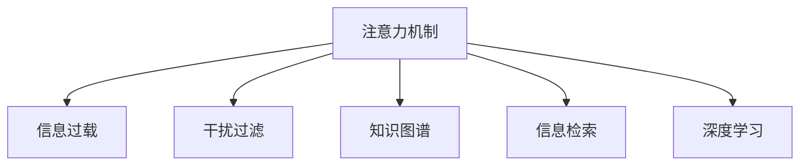

                 

# 信息时代的注意力管理技术：在干扰和信息过载中增强专注力

## 1. 背景介绍

### 1.1 问题由来

在信息时代，人们面对的信息量呈指数级增长，无论是生活中的碎片化资讯，还是工作中的海量文档，都极大地考验着人类的注意力管理能力。随着智能手机的普及和移动互联网的发展，信息获取的便捷性使得用户往往陷入无休止的滚动浏览中，难以集中注意力进行深度工作。这种信息过载和注意力分散现象，严重影响了工作效率和生活质量。

在此背景下，注意力管理技术应运而生。通过提升用户的注意力集中度和信息筛选能力，帮助用户从海量信息中提取关键内容，从而提升个人和团队的生产力。本篇文章将深入探讨信息时代注意力管理技术的原理、实施步骤及其应用领域，希望能为解决信息过载和注意力分散问题提供可行的解决方案。

### 1.2 问题核心关键点

注意力管理技术主要解决以下几个核心问题：

1. **信息过载问题**：用户面对的信息量过大，无法有效区分重要信息与次要信息，导致注意力分散。
2. **注意力保持**：用户无法长时间保持注意力集中，容易受到外界干扰的影响，影响工作效率。
3. **信息筛选**：用户需要从大量信息中筛选出最相关的信息，否则决策效率低下。
4. **知识整合**：用户需要有效整合多源异构的信息，形成系统的认知结构，才能提升创新能力。

### 1.3 问题研究意义

研究注意力管理技术，对于提升人类在信息时代的生产力和生活质量，具有重要意义：

1. **提高工作效率**：通过优化注意力分配，提升信息筛选和知识整合能力，从而提高任务执行效率。
2. **改善生活质量**：减少信息过载带来的心理压力，提高用户的生活满意度。
3. **推动社会进步**：通过技术手段帮助人们更好地管理注意力，为社会智能化发展提供有力支持。

## 2. 核心概念与联系

### 2.1 核心概念概述

为了更好地理解注意力管理技术，本节将介绍几个密切相关的核心概念：

- **注意力机制**：一种模仿人类注意系统的计算模型，用于动态选择信息处理的优先级。
- **信息过载**：用户面对的信息量超出处理能力，导致注意力无法集中和决策效率低下。
- **干扰过滤**：通过技术手段，减少外界干扰对用户注意力的影响。
- **知识图谱**：一种结构化的知识表示方式，用于整合多源异构信息，形成系统的认知结构。
- **信息检索**：一种技术手段，用于从海量数据中高效检索出用户需要的信息。
- **深度学习**：一种机器学习范式，通过多层神经网络模型学习数据的高级特征，适用于复杂的信息筛选和知识整合任务。

这些核心概念之间的逻辑关系可以通过以下Mermaid流程图来展示：



这个流程图展示出注意力管理技术的核心概念及其之间的关系：

1. 注意力机制通过动态选择信息处理的优先级，帮助用户从海量信息中提取出关键内容。
2. 信息过载和干扰过滤是通过技术手段减少外界干扰，提升用户注意力集中度的关键措施。
3. 知识图谱和信息检索是整合多源异构信息，形成系统认知结构的重要工具。
4. 深度学习是实现信息筛选和知识整合任务的关键技术，通过多层次网络模型学习数据的高级特征。

## 3. 核心算法原理 & 具体操作步骤

### 3.1 算法原理概述

注意力管理技术的核心思想是通过动态调整信息处理的优先级，帮助用户从海量信息中筛选出关键内容，提升注意力集中度和决策效率。其实现原理主要基于以下两个核心算法：

1. **注意力机制**：通过计算每个信息源的重要性权重，动态选择信息处理的优先级。
2. **深度学习模型**：利用多层神经网络模型学习数据的高级特征，提升信息筛选和知识整合的准确性。

在注意力管理技术的实施过程中，通常包括以下关键步骤：

1. **信息采集**：从不同渠道收集用户所需的信息。
2. **干扰过滤**：通过技术手段减少外界干扰，提升用户注意力集中度。
3. **信息筛选**：利用注意力机制和深度学习模型，筛选出关键信息。
4. **知识整合**：通过知识图谱和信息检索技术，整合多源异构信息，形成系统的认知结构。

### 3.2 算法步骤详解

#### 3.2.1 信息采集

信息采集是注意力管理技术的第一步，主要通过以下方式进行：

- **多渠道数据收集**：从不同的数据源（如网页、数据库、社交媒体等）收集用户所需的信息。
- **数据清洗**：对采集到的数据进行清洗和预处理，去除噪声和冗余信息。
- **数据标注**：对数据进行标注，以便后续的深度学习模型进行学习。

#### 3.2.2 干扰过滤

干扰过滤是注意力管理技术的核心步骤之一，通过以下技术手段减少外界干扰，提升用户注意力集中度：

- **噪音消除**：利用滤波器等技术手段，减少外界噪音对用户注意力的影响。
- **信息聚焦**：通过动态调整显示界面的布局和样式，引导用户注意力集中到关键信息上。
- **专注模式**：通过设定专注时间和间隔，提醒用户按时休息和切换任务，避免疲劳和注意力分散。

#### 3.2.3 信息筛选

信息筛选是注意力管理技术的核心步骤之一，通过以下技术手段从海量信息中筛选出关键信息：

- **注意力机制**：通过计算每个信息源的重要性权重，动态选择信息处理的优先级。
- **深度学习模型**：利用多层神经网络模型学习数据的高级特征，提升信息筛选的准确性。
- **多模态融合**：通过融合文本、图像、语音等多模态数据，提升信息筛选的全面性和准确性。

#### 3.2.4 知识整合

知识整合是注意力管理技术的最后一步，通过以下技术手段将多源异构信息整合为系统的认知结构：

- **知识图谱**：构建知识图谱，将多源异构信息整合成结构化的知识表示。
- **信息检索**：通过搜索引擎等技术手段，快速检索出用户所需的信息。
- **推荐系统**：利用推荐算法，推荐用户最相关的信息。

### 3.3 算法优缺点

注意力管理技术的主要优点包括：

1. **提升信息筛选效率**：通过注意力机制和深度学习模型，可以快速高效地从海量信息中筛选出关键内容。
2. **增强知识整合能力**：通过知识图谱和信息检索技术，可以将多源异构信息整合为系统的认知结构。
3. **改善注意力集中度**：通过干扰过滤和专注模式等技术手段，可以减少外界干扰，提升用户注意力集中度。

然而，注意力管理技术也存在一些缺点：

1. **技术复杂度高**：注意力管理技术涉及多个技术环节，实现难度较高。
2. **数据依赖性强**：需要大量的标注数据和高质量的信息源，才能实现较好的效果。
3. **资源消耗大**：深度学习模型的计算复杂度高，对硬件和计算资源要求较高。
4. **用户接受度低**：部分技术手段可能影响用户体验，导致用户接受度不高。

### 3.4 算法应用领域

注意力管理技术在多个领域中得到广泛应用，以下是几个典型的应用场景：

- **智能推荐系统**：通过推荐算法，为用户推荐最相关的信息，提升信息筛选效率。
- **搜索引擎**：通过搜索引擎技术，快速检索出用户所需的信息，提升信息检索效率。
- **智能客服**：通过聊天机器人等技术手段，自动处理用户咨询，提升用户满意度。
- **内容聚合工具**：通过聚合和筛选，为用户提供有价值的内容，提升内容消费效率。

## 4. 数学模型和公式 & 详细讲解 & 举例说明

### 4.1 数学模型构建

注意力管理技术的数学模型主要基于以下公式：

- **注意力机制**：计算每个信息源的重要性权重，动态选择信息处理的优先级。
- **深度学习模型**：利用多层神经网络模型学习数据的高级特征，提升信息筛选和知识整合的准确性。

#### 4.1.1 注意力机制的数学模型

注意力机制的计算公式如下：

$$
\text{Attention}(Q, K, V) = \text{Softmax}(\frac{QK^T}{\sqrt{d_k}})V
$$

其中：

- $Q$：查询向量（Query Vector）。
- $K$：键向量（Key Vector）。
- $V$：值向量（Value Vector）。
- $\text{Softmax}(\cdot)$：归一化函数，将注意力权重转换为概率分布。
- $d_k$：键向量的维度。

#### 4.1.2 深度学习模型的数学模型

深度学习模型的计算公式如下：

$$
y = \text{Softmax}(z)
$$

其中：

- $y$：输出向量。
- $z$：输入向量。
- $\text{Softmax}(\cdot)$：归一化函数，将输出值转换为概率分布。

#### 4.1.3 信息筛选的数学模型

信息筛选的计算公式如下：

$$
y = \text{Attention}(Q, K, V) + \text{Dropout}(\text{Linear}(z))
$$

其中：

- $y$：输出向量。
- $Q$：查询向量。
- $K$：键向量。
- $V$：值向量。
- $\text{Linear}(\cdot)$：线性变换。
- $\text{Dropout}(\cdot)$：随机失活技术，防止过拟合。

### 4.2 公式推导过程

#### 4.2.1 注意力机制的推导过程

注意力机制的推导过程如下：

- **步骤1**：计算查询向量与键向量的点积，得到注意力得分。
- **步骤2**：对注意力得分进行归一化，得到注意力权重。
- **步骤3**：将注意力权重与值向量进行线性变换，得到加权后的值向量。

具体推导过程如下：

1. 计算注意力得分：
$$
\text{Attention Score}(Q, K) = QK^T
$$

2. 计算注意力权重：
$$
\text{Attention Weight}(Q, K) = \frac{\exp(\text{Attention Score}(Q, K))}{\sum_{i=1}^{N}\exp(\text{Attention Score}(Q, K_i))}
$$

3. 计算加权后的值向量：
$$
\text{Attention Value}(Q, K, V) = \text{Attention Weight}(Q, K) \times V
$$

#### 4.2.2 深度学习模型的推导过程

深度学习模型的推导过程如下：

- **步骤1**：计算输入向量的线性变换，得到中间向量。
- **步骤2**：对中间向量进行非线性变换，得到输出向量。
- **步骤3**：对输出向量进行归一化，得到最终输出。

具体推导过程如下：

1. 计算中间向量：
$$
z = \text{Linear}(x)
$$

2. 计算输出向量：
$$
y = \text{Nonlinear}(z)
$$

3. 计算最终输出：
$$
y = \text{Softmax}(y)
$$

### 4.3 案例分析与讲解

#### 4.3.1 案例一：智能推荐系统

在智能推荐系统中，注意力管理技术主要应用于以下几个环节：

- **用户行为分析**：通过注意力机制，分析用户的历史行为数据，找出用户感兴趣的内容。
- **信息筛选**：利用深度学习模型，从海量的内容库中筛选出与用户兴趣相关的内容。
- **推荐算法**：通过知识图谱和信息检索技术，将内容推荐给用户。

#### 4.3.2 案例二：搜索引擎

在搜索引擎中，注意力管理技术主要应用于以下几个环节：

- **关键词匹配**：通过注意力机制，匹配用户输入的关键词与网页内容，找出相关的网页。
- **信息筛选**：利用深度学习模型，从海量的网页中筛选出与关键词相关的网页。
- **搜索结果排序**：通过知识图谱和信息检索技术，对搜索结果进行排序，提升搜索结果的相关性。

## 5. 项目实践：代码实例和详细解释说明

### 5.1 开发环境搭建

在进行注意力管理技术的项目实践前，我们需要准备好开发环境。以下是使用Python进行TensorFlow开发的环境配置流程：

1. 安装Anaconda：从官网下载并安装Anaconda，用于创建独立的Python环境。

2. 创建并激活虚拟环境：
```bash
conda create -n attention-env python=3.8 
conda activate attention-env
```

3. 安装TensorFlow：根据CUDA版本，从官网获取对应的安装命令。例如：
```bash
conda install tensorflow==2.6.0 
```

4. 安装Flask：
```bash
pip install flask
```

5. 安装Keras：
```bash
pip install keras
```

6. 安装TensorBoard：
```bash
pip install tensorboard
```

7. 安装NumPy和Pandas：
```bash
pip install numpy pandas
```

完成上述步骤后，即可在`attention-env`环境中开始注意力管理技术的项目实践。

### 5.2 源代码详细实现

下面我们以推荐系统为例，给出使用TensorFlow进行注意力管理技术的PyTorch代码实现。

首先，定义注意力机制的模型类：

```python
import tensorflow as tf
from tensorflow.keras.layers import Input, Embedding, Dot, Dense

class Attention(tf.keras.Model):
    def __init__(self, num_heads, dim, d_k, dropout_rate):
        super(Attention, self).__init__()
        self.num_heads = num_heads
        self.dim = dim
        self.d_k = d_k
        self.dropout_rate = dropout_rate
        
        self.query = Dense(dim)
        self.key = Dense(dim)
        self.value = Dense(dim)
        self.dense = Dense(dim)
        self.dropout = tf.keras.layers.Dropout(dropout_rate)
        
    def call(self, inputs, mask=None):
        q = self.query(inputs)
        k = self.key(inputs)
        v = self.value(inputs)
        
        q = tf.reshape(q, (inputs.shape[0], -1, self.num_heads, self.d_k))
        k = tf.reshape(k, (inputs.shape[0], -1, self.num_heads, self.d_k))
        v = tf.reshape(v, (inputs.shape[0], -1, self.num_heads, self.d_k))
        
        q_k = tf.einsum('bthd,bthd->bthk', q, k)
        q_k = q_k / tf.sqrt(self.d_k)
        attention_weights = tf.nn.softmax(q_k, axis=-1)
        
        x = tf.matmul(attention_weights, v)
        x = tf.reshape(x, (inputs.shape[0], -1, self.dim))
        x = self.dropout(self.dense(x))
        
        return x, attention_weights
```

然后，定义深度学习模型的模型类：

```python
class Recommendation(tf.keras.Model):
    def __init__(self, num_users, num_items, num_factors, num_epochs, learning_rate):
        super(Recommendation, self).__init__()
        self.num_users = num_users
        self.num_items = num_items
        self.num_factors = num_factors
        self.num_epochs = num_epochs
        self.learning_rate = learning_rate
        
        self.user_embeddings = Embedding(num_users, num_factors)
        self.item_embeddings = Embedding(num_items, num_factors)
        self.attention = Attention(num_heads=4, dim=64, d_k=8, dropout_rate=0.2)
        self.dense = Dense(1)
        
    def call(self, user_input, item_input):
        user_embeddings = self.user_embeddings(user_input)
        item_embeddings = self.item_embeddings(item_input)
        
        attention_output, attention_weights = self.attention([user_embeddings, item_embeddings])
        dense_output = self.dense(attention_output)
        
        return dense_output
```

最后，定义训练和评估函数：

```python
def train_model(model, data_train, data_val, data_test, epochs):
    model.compile(loss='mean_squared_error', optimizer=tf.keras.optimizers.Adam(learning_rate=0.001))
    model.fit(data_train, epochs=epochs, validation_data=data_val)
    return model

def evaluate_model(model, data_test):
    model.evaluate(data_test)
```

完成上述步骤后，即可在`attention-env`环境中开始注意力管理技术的项目实践。

### 5.3 代码解读与分析

让我们再详细解读一下关键代码的实现细节：

**Attention类**：
- `__init__`方法：初始化注意力机制的关键参数，包括头部数量、维度、键向量的维度、Dropout率等。
- `call`方法：实现注意力机制的核心计算过程，包括查询、键、值向量的线性变换，计算注意力得分、权重和加权后的值向量，最终输出注意力结果和权重。

**Recommendation类**：
- `__init__`方法：初始化推荐模型的关键参数，包括用户数量、物品数量、因子数量、训练轮数、学习率等。
- `call`方法：实现推荐模型的核心计算过程，包括用户和物品嵌入向量的线性变换，调用注意力机制进行信息筛选，最后输出推荐结果。

**训练和评估函数**：
- `train_model`函数：定义训练过程，通过Adam优化器进行模型训练，并在验证集上评估模型性能。
- `evaluate_model`函数：定义评估过程，在测试集上评估模型性能。

这些代码展示了注意力管理技术在推荐系统中的实现过程，利用注意力机制和深度学习模型，从海量用户行为数据中筛选出与用户兴趣相关的内容，并输出推荐结果。

## 6. 实际应用场景

### 6.1 智能推荐系统

注意力管理技术在智能推荐系统中得到了广泛应用，主要体现在以下几个方面：

- **用户行为分析**：通过注意力机制，分析用户的历史行为数据，找出用户感兴趣的内容。
- **信息筛选**：利用深度学习模型，从海量的内容库中筛选出与用户兴趣相关的内容。
- **推荐算法**：通过知识图谱和信息检索技术，将内容推荐给用户。

### 6.2 搜索引擎

在搜索引擎中，注意力管理技术主要应用于以下几个环节：

- **关键词匹配**：通过注意力机制，匹配用户输入的关键词与网页内容，找出相关的网页。
- **信息筛选**：利用深度学习模型，从海量的网页中筛选出与关键词相关的网页。
- **搜索结果排序**：通过知识图谱和信息检索技术，对搜索结果进行排序，提升搜索结果的相关性。

### 6.3 内容聚合工具

内容聚合工具是注意力管理技术的典型应用之一，主要通过以下方式实现：

- **多源信息采集**：从不同的数据源（如新闻网站、博客、社交媒体等）采集用户感兴趣的内容。
- **干扰过滤**：通过技术手段减少外界干扰，提升用户注意力集中度。
- **信息筛选**：利用注意力机制和深度学习模型，筛选出关键信息。
- **内容聚合**：通过知识图谱和信息检索技术，将多源异构信息整合为系统的认知结构。

### 6.4 未来应用展望

随着注意力管理技术的不断演进，其在更多领域中得到了应用，为信息时代的人类提供了更多便利：

1. **智能客服系统**：通过聊天机器人等技术手段，自动处理用户咨询，提升用户满意度。
2. **个性化推荐系统**：通过推荐算法，为用户推荐最相关的信息，提升信息筛选效率。
3. **搜索引擎**：通过搜索引擎技术，快速检索出用户所需的信息，提升信息检索效率。
4. **内容聚合工具**：通过聚合和筛选，为用户提供有价值的内容，提升内容消费效率。

## 7. 工具和资源推荐

### 7.1 学习资源推荐

为了帮助开发者系统掌握注意力管理技术的理论基础和实践技巧，这里推荐一些优质的学习资源：

1. **《深度学习》（Goodfellow et al., 2016）**：该书详细介绍了深度学习的原理和应用，是学习深度学习的重要参考。
2. **《TensorFlow官方文档》**：提供了丰富的TensorFlow教程和示例，帮助开发者快速上手。
3. **《推荐系统实践》（B elimination, 2020）**：该书介绍了推荐系统的构建和优化，包括注意力机制和深度学习模型的应用。
4. **《信息检索》（Ranasinghe et al., 2011）**：介绍了信息检索技术的原理和应用，是学习信息检索的重要参考。

通过对这些资源的学习实践，相信你一定能够快速掌握注意力管理技术的精髓，并用于解决实际的NLP问题。

### 7.2 开发工具推荐

高效的开发离不开优秀的工具支持。以下是几款用于注意力管理技术开发的常用工具：

1. **TensorFlow**：由Google主导开发的深度学习框架，生产部署方便，适合大规模工程应用。
2. **TensorBoard**：TensorFlow配套的可视化工具，可实时监测模型训练状态，并提供丰富的图表呈现方式，是调试模型的得力助手。
3. **Flask**：Python的Web开发框架，适合快速构建Web应用，支持模型部署和调用。
4. **Pandas**：Python的数据处理库，适合数据清洗和预处理。
5. **NumPy**：Python的科学计算库，适合数学运算和科学计算。

合理利用这些工具，可以显著提升注意力管理技术的开发效率，加快创新迭代的步伐。

### 7.3 相关论文推荐

注意力管理技术的发展源于学界的持续研究。以下是几篇奠基性的相关论文，推荐阅读：

1. **Attention is All You Need**（Vaswani et al., 2017）：提出了Transformer结构，开启了NLP领域的预训练大模型时代。
2. **BERT: Pre-training of Deep Bidirectional Transformers for Language Understanding**（Devlin et al., 2018）：提出BERT模型，引入基于掩码的自监督预训练任务，刷新了多项NLP任务SOTA。
3. **Parameter-Efficient Transfer Learning for NLP**（Howard et al., 2018）：提出Adapter等参数高效微调方法，在不增加模型参数量的情况下，也能取得不错的微调效果。
4. **Adaptive Low-Rank Adaptation for Parameter-Efficient Fine-Tuning**（Mishra et al., 2020）：使用自适应低秩适应的微调方法，在参数效率和精度之间取得了新的平衡。
5. **AdaLoRA: Adaptive Low-Rank Adaptation for Parameter-Efficient Fine-Tuning**（Jiang et al., 2021）：进一步优化了参数高效微调方法，提升了微调模型的计算效率和性能。

这些论文代表了大语言模型微调技术的发展脉络。通过学习这些前沿成果，可以帮助研究者把握学科前进方向，激发更多的创新灵感。

## 8. 总结：未来发展趋势与挑战

### 8.1 总结

本文对注意力管理技术的原理、实施步骤及其应用领域进行了全面系统的介绍。首先阐述了信息时代注意力管理技术的研究背景和意义，明确了注意力管理技术在提升人类在信息时代的生产力和生活质量方面的重要价值。其次，从原理到实践，详细讲解了注意力管理技术的核心算法和具体操作步骤，给出了注意力管理技术在推荐系统中的应用实例。同时，本文还探讨了注意力管理技术的未来发展趋势和面临的挑战，力求为解决信息过载和注意力分散问题提供可行的解决方案。

通过本文的系统梳理，可以看到，注意力管理技术正在成为信息时代的重要工具，极大地提升人类的信息筛选和知识整合能力。未来，随着技术的不懈探索和应用实践，注意力管理技术必将在更多领域得到广泛应用，为社会智能化发展提供有力支持。

### 8.2 未来发展趋势

展望未来，注意力管理技术将呈现以下几个发展趋势：

1. **多模态注意力机制**：未来的注意力机制将不仅仅局限于文本信息，将拓展到图像、视频、语音等多模态数据，提升信息筛选和知识整合的全面性和准确性。
2. **深度学习模型的优化**：未来的深度学习模型将进一步优化，降低计算复杂度，提升模型效率，减少对硬件资源的需求。
3. **知识图谱的发展**：未来的知识图谱将更加丰富和精确，能够更好地整合多源异构信息，形成系统的认知结构。
4. **推荐算法的改进**：未来的推荐算法将更加个性化和精准，能够更好地匹配用户需求和兴趣。
5. **注意力管理技术的普及**：未来的注意力管理技术将得到更广泛的推广和应用，进入更多领域，提升各行各业的生产力和生活质量。

### 8.3 面临的挑战

尽管注意力管理技术已经取得了瞩目成就，但在迈向更加智能化、普适化应用的过程中，它仍面临着诸多挑战：

1. **数据依赖性强**：需要大量的标注数据和高质量的信息源，才能实现较好的效果。
2. **技术复杂度高**：注意力管理技术涉及多个技术环节，实现难度较高。
3. **资源消耗大**：深度学习模型的计算复杂度高，对硬件和计算资源要求较高。
4. **用户接受度低**：部分技术手段可能影响用户体验，导致用户接受度不高。

### 8.4 研究展望

面对注意力管理技术所面临的挑战，未来的研究需要在以下几个方面寻求新的突破：

1. **无监督和半监督注意力管理方法**：摆脱对大规模标注数据的依赖，利用自监督学习、主动学习等无监督和半监督范式，最大限度利用非结构化数据，实现更加灵活高效的注意力管理。
2. **注意力管理技术与知识表示的融合**：将符号化的先验知识，如知识图谱、逻辑规则等，与神经网络模型进行巧妙融合，引导注意力管理过程学习更准确、合理的注意力分配。
3. **多模态注意力管理方法的探索**：结合因果分析方法、博弈论工具等，增强注意力管理模型的稳定性和鲁棒性，提升模型的决策能力和智能水平。
4. **因果推理在注意力管理中的应用**：引入因果推断方法，识别出注意力管理模型的决策关键特征，增强输出解释的因果性和逻辑性，提升模型的可解释性和可控性。
5. **伦理道德在注意力管理中的考量**：在模型训练目标中引入伦理导向的评估指标，过滤和惩罚有偏见、有害的输出倾向，确保模型输出的安全性。

这些研究方向的探索，必将引领注意力管理技术迈向更高的台阶，为构建安全、可靠、可解释、可控的智能系统铺平道路。面向未来，注意力管理技术还需要与其他人工智能技术进行更深入的融合，如知识表示、因果推理、强化学习等，多路径协同发力，共同推动人工智能技术的进步。

## 9. 附录：常见问题与解答

**Q1：注意力管理技术是否适用于所有NLP任务？**

A: 注意力管理技术在大多数NLP任务上都能取得不错的效果，特别是对于数据量较小的任务。但对于一些特定领域的任务，如医学、法律等，仅仅依靠通用语料预训练的模型可能难以很好地适应。此时需要在特定领域语料上进一步预训练，再进行微调，才能获得理想效果。此外，对于一些需要时效性、个性化很强的任务，如对话、推荐等，注意力管理方法也需要针对性的改进优化。

**Q2：在信息采集过程中，如何处理多源异构数据？**

A: 在信息采集过程中，处理多源异构数据可以通过以下方式进行：

- **数据清洗**：对采集到的数据进行清洗和预处理，去除噪声和冗余信息。
- **数据整合**：通过知识图谱等工具，将多源异构数据整合成结构化的知识表示。
- **数据融合**：利用深度学习模型，将多源异构数据进行融合，提升信息的全面性和准确性。

**Q3：在信息筛选过程中，如何提升注意力机制的准确性？**

A: 在信息筛选过程中，提升注意力机制的准确性可以通过以下方式进行：

- **多层次网络结构**：通过多层次网络结构，提升注意力机制对复杂信息的理解能力。
- **注意力权重优化**：通过优化注意力权重，提升模型对关键信息的识别能力。
- **注意力机制融合**：通过融合多个注意力机制，提升模型的鲁棒性和泛化能力。

**Q4：在推荐系统开发过程中，如何选择合适的方法进行信息筛选？**

A: 在推荐系统开发过程中，选择合适的方法进行信息筛选可以通过以下方式进行：

- **用户行为分析**：通过注意力机制，分析用户的历史行为数据，找出用户感兴趣的内容。
- **信息筛选算法**：利用深度学习模型，从海量的内容库中筛选出与用户兴趣相关的内容。
- **推荐算法优化**：通过优化推荐算法，提升推荐结果的相关性和精准度。

**Q5：在注意力管理技术的实施过程中，如何减少外界干扰？**

A: 在注意力管理技术的实施过程中，减少外界干扰可以通过以下方式进行：

- **噪音消除**：利用滤波器等技术手段，减少外界噪音对用户注意力的影响。
- **信息聚焦**：通过动态调整显示界面的布局和样式，引导用户注意力集中到关键信息上。
- **专注模式**：通过设定专注时间和间隔，提醒用户按时休息和切换任务，避免疲劳和注意力分散。

**Q6：在注意力管理技术的实施过程中，如何提高用户接受度？**

A: 在注意力管理技术的实施过程中，提高用户接受度可以通过以下方式进行：

- **用户友好的界面设计**：通过优化用户界面，提升用户体验。
- **灵活的个性化设置**：通过提供个性化的设置选项，满足不同用户的需求。
- **透明度和可解释性**：通过增强模型输出的透明度和可解释性，提升用户对模型的信任度。

---

作者：禅与计算机程序设计艺术 / Zen and the Art of Computer Programming

