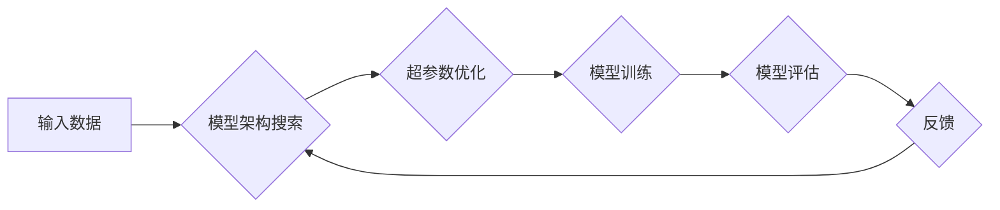

> AI模型合成，自动化机器学习，模型架构搜索，神经网络，深度学习，迁移学习

## 1. 背景介绍

人工智能（AI）领域近年来取得了令人瞩目的进展，深度学习模型在图像识别、自然语言处理等领域展现出强大的能力。然而，构建高性能深度学习模型仍然是一个耗时、耗资源且需要专业知识的过程。传统的深度学习模型设计依赖于人工经验和启发式方法，这限制了模型的探索空间和效率。

AI模型合成旨在通过自动化的方法生成高性能深度学习模型，从而降低模型开发的门槛，加速AI应用的普及。该领域的研究主要集中在以下几个方面：

* **模型架构搜索 (NAS)：** 自动搜索最优的模型架构，以提高模型性能和效率。
* **超参数优化：** 自动优化模型训练过程中的超参数，例如学习率、批处理大小等，以获得更好的训练结果。
* **数据增强：** 自动生成新的训练数据，以提高模型的泛化能力。

## 2. 核心概念与联系

AI模型合成是一个多学科交叉的领域，涉及到机器学习、深度学习、优化算法、搜索算法等多个领域。其核心概念包括：

* **模型架构：** 深度学习模型的结构，包括层数、层类型、连接方式等。
* **超参数：** 模型训练过程中的参数，例如学习率、批处理大小等，这些参数需要手动设置。
* **搜索空间：** 所有可能的模型架构和超参数组合的集合。
* **搜索算法：** 用于探索搜索空间并找到最优模型架构和超参数的算法。

**Mermaid 流程图**



## 3. 核心算法原理 & 具体操作步骤

### 3.1  算法原理概述

AI模型合成的核心算法主要包括：

* **强化学习 (RL)：** 将模型训练过程视为一个强化学习问题，训练一个代理来探索搜索空间并找到最优模型架构和超参数。
* **进化算法 (EA)：** 将模型架构和超参数视为个体，通过选择、交叉和变异等操作进行进化，最终找到最优模型。
* **梯度下降 (GD)：** 使用梯度下降算法优化模型架构和超参数，以最小化模型的损失函数。

### 3.2  算法步骤详解

以强化学习为例，其具体操作步骤如下：

1. **定义奖励函数：** 奖励函数用于评估模型性能，例如准确率、F1-score等。
2. **构建代理：** 代理负责探索搜索空间并选择模型架构和超参数。
3. **训练代理：** 使用强化学习算法训练代理，使其能够最大化奖励函数的值。
4. **生成模型：** 根据代理选择的模型架构和超参数，生成深度学习模型。
5. **评估模型：** 使用测试集评估模型性能，并根据评估结果更新奖励函数和代理的策略。

### 3.3  算法优缺点

| 算法 | 优点 | 缺点 |
|---|---|---|
| 强化学习 | 可以探索更广阔的搜索空间，找到更优的模型 | 训练时间长，需要大量的计算资源 |
| 进化算法 | 能够处理离散的搜索空间，例如模型架构 | 容易陷入局部最优解 |
| 梯度下降 | 训练速度快，收敛性好 | 容易陷入局部最优解，需要人工设置超参数 |

### 3.4  算法应用领域

AI模型合成算法在以下领域具有广泛的应用前景：

* **图像识别：** 自动生成高性能的图像分类、目标检测和图像分割模型。
* **自然语言处理：** 自动生成高性能的文本分类、机器翻译和文本摘要模型。
* **语音识别：** 自动生成高性能的语音识别和语音合成模型。
* **药物发现：** 自动生成高性能的药物分子设计和药物靶点预测模型。

## 4. 数学模型和公式 & 详细讲解 & 举例说明

### 4.1  数学模型构建

在强化学习中，模型合成过程可以被建模为一个马尔可夫决策过程 (MDP)。

* 状态空间：模型架构和超参数的集合。
* 动作空间：选择模型架构和超参数的集合。
* 转移概率：从一个状态到另一个状态的概率。
* 奖励函数：评估模型性能的函数。

### 4.2  公式推导过程

强化学习的目标是找到一个策略，使得在长期的交互过程中，累积的奖励最大化。

* **Bellman方程：**

$$
V(s) = \max_{\alpha} \sum_{s'} P(s' | s, \alpha) [R(s, \alpha, s') + \gamma V(s')]
$$

其中：

* $V(s)$ 是状态 $s$ 的价值函数。
* $\alpha$ 是策略。
* $P(s' | s, \alpha)$ 是从状态 $s$ 到状态 $s'$ 的转移概率。
* $R(s, \alpha, s')$ 是从状态 $s$ 执行动作 $\alpha$ 到状态 $s'$ 的奖励。
* $\gamma$ 是折扣因子。

### 4.3  案例分析与讲解

例如，在图像分类任务中，可以使用强化学习算法自动搜索最优的卷积神经网络 (CNN) 架构和超参数。

* 状态空间：所有可能的 CNN 架构和超参数组合。
* 动作空间：选择一个 CNN 架构和超参数组合。
* 奖励函数：使用准确率作为奖励函数，奖励更高的准确率。

通过训练强化学习代理，可以找到一个 CNN 架构和超参数组合，使得在图像分类任务上的准确率最高。

## 5. 项目实践：代码实例和详细解释说明

### 5.1  开发环境搭建

* Python 3.7+
* TensorFlow 2.0+
* Keras 2.0+
* PyTorch 1.0+

### 5.2  源代码详细实现

```python
# 使用 TensorFlow 构建一个简单的 CNN 模型
import tensorflow as tf

model = tf.keras.models.Sequential([
    tf.keras.layers.Conv2D(32, (3, 3), activation='relu', input_shape=(28, 28, 1)),
    tf.keras.layers.MaxPooling2D((2, 2)),
    tf.keras.layers.Conv2D(64, (3, 3), activation='relu'),
    tf.keras.layers.MaxPooling2D((2, 2)),
    tf.keras.layers.Flatten(),
    tf.keras.layers.Dense(10, activation='softmax')
])

# 编译模型
model.compile(optimizer='adam',
              loss='sparse_categorical_crossentropy',
              metrics=['accuracy'])

# 训练模型
model.fit(x_train, y_train, epochs=10)

# 评估模型
loss, accuracy = model.evaluate(x_test, y_test)
print('Test loss:', loss)
print('Test accuracy:', accuracy)
```

### 5.3  代码解读与分析

* 代码首先使用 TensorFlow 库构建了一个简单的 CNN 模型。
* 模型包含两个卷积层、两个最大池化层、一个全连接层和一个输出层。
* 模型使用 Adam 优化器、交叉熵损失函数和准确率作为评估指标。
* 代码然后使用训练数据训练模型，并使用测试数据评估模型性能。

### 5.4  运行结果展示

运行代码后，可以得到模型在测试集上的准确率。

## 6. 实际应用场景

AI模型合成技术已经在多个领域得到了应用，例如：

* **自动驾驶：** 自动生成高性能的图像识别和路径规划模型。
* **医疗诊断：** 自动生成高性能的疾病诊断和影像分析模型。
* **金融风险管理：** 自动生成高性能的欺诈检测和风险评估模型。

### 6.4  未来应用展望

随着 AI 模型合成的技术不断发展，其应用场景将会更加广泛，例如：

* **个性化推荐：** 自动生成个性化的商品推荐和内容推荐模型。
* **智能客服：** 自动生成能够理解和回复用户问题的智能客服模型。
* **教育辅助：** 自动生成个性化的学习计划和教学内容模型。

## 7. 工具和资源推荐

### 7.1  学习资源推荐

* **书籍：**
    * 《深度学习》
    * 《强化学习：原理、算法和应用》
* **在线课程：**
    * Coursera: 深度学习
    * Udacity: 强化学习

### 7.2  开发工具推荐

* **TensorFlow：** 开源深度学习框架。
* **PyTorch：** 开源深度学习框架。
* **Keras：** 高级深度学习 API。

### 7.3  相关论文推荐

* **《Neural Architecture Search with Reinforcement Learning》**
* **《Evolutionary Algorithms for Neural Architecture Search》**
* **《AutoML: A Survey》**

## 8. 总结：未来发展趋势与挑战

### 8.1  研究成果总结

AI模型合成技术取得了显著的进展，能够自动生成高性能的深度学习模型，降低了模型开发的门槛，加速了AI应用的普及。

### 8.2  未来发展趋势

* **模型效率提升：** 研究更有效的搜索算法和优化方法，以提高模型合成效率。
* **跨模态模型合成：** 研究能够处理多种模态数据的模型合成技术，例如图像、文本、音频等。
* **可解释性增强：** 研究能够解释模型合成过程和结果的算法，提高模型的可解释性和可信度。

### 8.3  面临的挑战

* **搜索空间规模：** 深度学习模型的搜索空间非常庞大，难以穷尽搜索。
* **计算资源需求：** 模型合成过程需要大量的计算资源，成本较高。
* **模型泛化能力：** 合成的模型可能在新的数据上表现不佳，泛化能力不足。

### 8.4  研究展望

未来，AI模型合成技术将继续朝着更自动化、更高效、更可解释的方向发展，为人工智能的普及和应用提供强大的支持。

## 9. 附录：常见问题与解答

* **Q：AI模型合成技术是否会取代人工模型设计？**

* **A：** AI模型合成技术可以辅助人工模型设计，提高效率和效果，但不会完全取代人工设计。人工经验和启发式方法仍然在模型设计中发挥着重要作用。

* **Q：AI模型合成技术是否适用于所有类型的深度学习模型？**

* **A：** 目前，AI模型合成技术主要适用于一些结构相对简单的深度学习模型，例如 CNN 和 RNN。对于更复杂的模型，例如 Transformer，仍然需要人工设计。

* **Q：AI模型合成技术的应用场景有哪些？**

* **A：** AI模型合成技术可以应用于图像识别、自然语言处理、语音识别、药物发现等多个领域。


作者：禅与计算机程序设计艺术 / Zen and the Art of Computer Programming 
<end_of_turn>