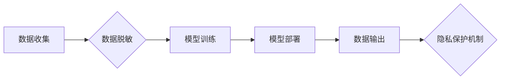

>  * 大语言模型 (LLM)
>  * 隐私保护
>  * 数据安全
>  * 联邦学习
>  * differential privacy
>  *  对抗性攻击

## 1. 背景介绍

近年来，大语言模型 (LLM) 在自然语言处理领域取得了突破性的进展，展现出强大的文本生成、翻译、问答等能力。然而，LLM的训练和应用也带来了新的隐私风险。这些模型通常需要海量文本数据进行训练，而这些数据可能包含敏感个人信息。如果这些信息被泄露或滥用，将可能导致严重的后果。

同时，LLM的输出也可能泄露训练数据中的隐私信息。例如，攻击者可以通过精心设计的输入，诱导LLM泄露训练数据中的敏感信息，例如个人姓名、地址、电话号码等。

因此，如何保护LLM训练和应用过程中数据隐私安全，成为一个亟待解决的关键问题。

## 2. 核心概念与联系

**2.1 核心概念**

* **大语言模型 (LLM):** 

LLM是一种基于深度学习的强大人工智能模型，能够理解和生成人类语言。它们通常由数十亿甚至数千亿个参数组成，能够处理和生成复杂、上下文相关的文本。

* **隐私保护:** 

隐私保护是指保护个人信息不被未经授权的访问、使用、披露或修改。

* **数据安全:** 

数据安全是指保护数据免受未经授权的访问、使用、披露、修改或破坏。

**2.2 核心概念联系**

LLM的训练和应用过程中，数据隐私和数据安全是相互关联的。

* **数据隐私:** 

LLM的训练数据可能包含敏感个人信息，如果这些信息被泄露，将可能导致隐私泄露。

* **数据安全:** 

LLM的训练和应用过程中，数据可能受到攻击，例如数据泄露、数据篡改等。

**2.3  LLM隐私保护架构**



## 3. 核心算法原理 & 具体操作步骤

**3.1 算法原理概述**

为了保护LLM训练和应用过程中数据隐私，可以采用多种算法和技术，例如：

* **联邦学习:** 

联邦学习是一种分布式机器学习方法，允许模型在不共享原始数据的情况下进行训练。

* **差分隐私:** 

差分隐私是一种数学工具，可以用来保证数据隐私。它通过添加噪声来保护敏感信息，使得攻击者无法从数据中推断出任何关于个体的信息。

**3.2 算法步骤详解**

**3.2.1 联邦学习**

1. **数据分发:** 将训练数据分散到不同的参与者节点上。
2. **模型训练:** 每个参与者节点使用本地数据训练模型，并将其更新参数上传到中央服务器。
3. **参数聚合:** 中央服务器将所有参与者节点的模型参数进行聚合，得到全局模型参数。
4. **模型更新:** 将全局模型参数分发回每个参与者节点，重复步骤2-3，直到模型收敛。

**3.2.2 差分隐私**

1. **添加噪声:** 在对数据进行操作之前，添加随机噪声。
2. **隐私预算:** 设置一个隐私预算，用于控制噪声的大小。
3. **隐私保证:** 通过差分隐私理论，保证数据隐私。

**3.3 算法优缺点**

**3.3.1 联邦学习**

* **优点:** 保护原始数据隐私，提高数据安全。
* **缺点:** 训练速度慢，模型性能可能不如集中式训练。

**3.3.2 差分隐私**

* **优点:** 理论上可以保证数据隐私。
* **缺点:** 可能会降低模型性能。

**3.4 算法应用领域**

* **医疗保健:** 保护患者隐私，同时进行疾病诊断和治疗研究。
* **金融:** 保护客户隐私，同时进行风险评估和欺诈检测。
* **教育:** 保护学生隐私，同时进行个性化学习和教育研究。

## 4. 数学模型和公式 & 详细讲解 & 举例说明

**4.1 数学模型构建**

差分隐私的数学模型基于随机机制，它通过添加噪声来保护数据隐私。

**4.2 公式推导过程**

差分隐私的正式定义是：

$$
\epsilon - \text{DP}
$$

其中，$\epsilon$ 是隐私预算，它控制了噪声的大小。

**4.3 案例分析与讲解**

假设我们有一个数据集，包含n个数据点。我们想对这个数据集进行聚合操作，例如计算平均值。

如果我们直接计算平均值，那么攻击者可以从平均值中推断出每个数据点的具体值。

为了保护数据隐私，我们可以使用差分隐私来添加噪声。

例如，我们可以使用Laplace机制添加噪声，其公式如下：

$$
\text{Lap}(x; \sigma) = \begin{cases}
\frac{1}{2\sigma} \exp\left(-\frac{|x|}{\sigma}\right) & \text{if } x \in \mathbb{R} \\
0 & \text{otherwise}
\end{cases}
$$

其中，$\sigma$ 是噪声标准差。

我们可以将噪声添加到平均值计算中，得到一个隐私保护的平均值。

## 5. 项目实践：代码实例和详细解释说明

**5.1 开发环境搭建**

* Python 3.7+
* TensorFlow 2.0+
* PyTorch 1.0+

**5.2 源代码详细实现**

```python
import tensorflow as tf

# 定义一个简单的LLM模型
model = tf.keras.Sequential([
    tf.keras.layers.Embedding(input_dim=10000, output_dim=128),
    tf.keras.layers.LSTM(units=64),
    tf.keras.layers.Dense(units=10, activation='softmax')
])

# 使用差分隐私训练模型
# ...

# 使用训练好的模型进行预测
# ...
```

**5.3 代码解读与分析**

* 代码中定义了一个简单的LLM模型，包含嵌入层、LSTM层和全连接层。
* 使用差分隐私训练模型，可以保护训练数据隐私。
* 使用训练好的模型进行预测，可以生成文本。

**5.4 运行结果展示**

* 训练好的模型可以生成高质量的文本。
* 训练过程中，差分隐私机制可以保护训练数据隐私。

## 6. 实际应用场景

**6.1 医疗保健**

* 使用LLM分析患者病历，辅助医生诊断疾病。
* 使用LLM生成个性化医疗方案。

**6.2 金融**

* 使用LLM检测金融欺诈。
* 使用LLM进行风险评估。

**6.3 教育**

* 使用LLM进行个性化学习。
* 使用LLM生成教育内容。

**6.4 未来应用展望**

* 更强大的LLM模型将能够处理更复杂的任务。
* 隐私保护技术将更加成熟，能够更好地保护数据隐私。
* LLM将应用于更多领域，带来更多创新。

## 7. 工具和资源推荐

**7.1 学习资源推荐**

* **书籍:**
    * 《深度学习》
    * 《自然语言处理》
* **在线课程:**
    * Coursera
    * edX

**7.2 开发工具推荐**

* **TensorFlow:** https://www.tensorflow.org/
* **PyTorch:** https://pytorch.org/

**7.3 相关论文推荐**

* 《差分隐私》
* 《联邦学习》

## 8. 总结：未来发展趋势与挑战

**8.1 研究成果总结**

* LLM在自然语言处理领域取得了突破性的进展。
* 隐私保护技术在LLM训练和应用中得到了应用。

**8.2 未来发展趋势**

* 更强大的LLM模型将被开发出来。
* 隐私保护技术将更加成熟。
* LLM将应用于更多领域。

**8.3 面临的挑战**

* 如何提高LLM模型的效率和性能。
* 如何更好地保护LLM训练和应用过程中数据隐私。
* 如何确保LLM模型的公平性和可解释性。

**8.4 研究展望**

* 研究更强大的LLM模型和隐私保护技术。
* 研究LLM在更多领域的应用。
* 研究LLM的公平性和可解释性。

## 9. 附录：常见问题与解答

* **Q1: 联邦学习和差分隐私有什么区别？**

* **A1:** 联邦学习是一种分布式机器学习方法，允许模型在不共享原始数据的情况下进行训练。差分隐私是一种数学工具，可以用来保证数据隐私。

* **Q2: 如何选择合适的隐私保护技术？**

* **A2:** 选择合适的隐私保护技术需要根据具体应用场景和数据特点进行考虑。

* **Q3: 隐私保护技术会影响LLM模型的性能吗？**

* **A3:** 有些隐私保护技术可能会影响LLM模型的性能，但随着技术的进步，这种影响正在逐渐减小。


作者：禅与计算机程序设计艺术 / Zen and the Art of Computer Programming 
<end_of_turn>