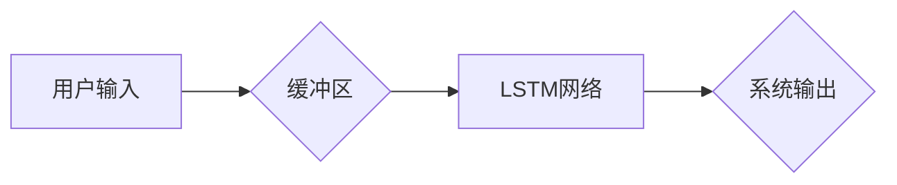

> 
> 1. 对话系统
> 2. 缓冲记忆
> 3. 长短期记忆
> 4. 自然语言处理
> 5. 记忆机制
> 6. 人机交互
> 7. 深度学习

## 1. 背景介绍

在当今人工智能蓬勃发展的时代，对话系统作为人机交互的重要形式，日益受到关注。从简单的问答机器人到复杂的聊天伙伴，对话系统旨在能够与人类进行自然、流畅的对话。然而，构建能够理解上下文、记忆历史信息并进行合理回应的对话系统仍然是一个巨大的挑战。

传统的对话系统通常依赖于规则驱动的机制，其局限性在于难以处理复杂的情境和开放式问题。近年来，深度学习技术的兴起为对话系统的发展带来了新的机遇。基于深度学习的对话系统能够学习对话数据中的模式和规律，从而更好地理解用户意图和上下文。

然而，即使是基于深度学习的对话系统，也面临着记忆问题。由于深度学习模型的“黑盒”特性，它们难以像人类一样有效地存储和检索历史信息。这导致对话系统在长对话中容易遗忘之前的信息，从而影响对话的流畅性和自然性。

为了解决这一问题，研究者们提出了各种各样的记忆机制，例如外部记忆、注意力机制和循环神经网络（RNN）。其中，循环神经网络由于其能够处理序列数据的特性，在对话系统中得到了广泛应用。

## 2. 核心概念与联系

### 2.1. 缓冲记忆

缓冲记忆是指在对话系统中，将最近的对话历史信息存储在一个临时缓冲区中，以便在后续对话中进行参考。缓冲区的大小和存储时间可以根据实际需求进行调整。

### 2.2. 长短期记忆（LSTM）

长短期记忆（LSTM）是一种特殊的循环神经网络结构，能够有效地解决梯度消失问题，从而能够学习长序列数据的依赖关系。LSTM网络包含多个记忆单元，每个单元都具有输入门、输出门和遗忘门，这些门控机制能够控制信息的流动，从而实现对长期信息的记忆。

### 2.3. 核心概念联系

ConversationBufferMemory 是一种将缓冲记忆和 LSTM 网络相结合的对话系统架构。它将最近的对话历史信息存储在缓冲区中，然后将缓冲区中的信息作为输入传递给 LSTM 网络进行处理。LSTM 网络能够学习对话历史信息中的模式和规律，从而更好地理解用户意图和上下文，并生成更自然、更合理的回应。



## 3. 核心算法原理 & 具体操作步骤

### 3.1. 算法原理概述

ConversationBufferMemory 算法的核心原理是将对话历史信息存储在缓冲区中，并将其作为输入传递给 LSTM 网络进行处理。LSTM 网络能够学习对话历史信息中的模式和规律，从而更好地理解用户意图和上下文，并生成更自然、更合理的回应。

### 3.2. 算法步骤详解

1. **初始化缓冲区:** 在对话开始时，初始化一个缓冲区，用于存储最近的对话历史信息。缓冲区的容量可以根据实际需求进行调整。

2. **用户输入:** 用户输入一条文本信息。

3. **更新缓冲区:** 将用户输入的信息添加到缓冲区中，并根据缓冲区的大小进行裁剪。

4. **输入 LSTM 网络:** 将缓冲区中的对话历史信息作为输入传递给 LSTM 网络。

5. **LSTM 网络处理:** LSTM 网络根据输入信息进行处理，并输出一个向量表示。

6. **生成系统输出:** 将 LSTM 网络的输出向量作为输入传递给一个文本生成模型，例如语言模型或条件随机场（CRF），生成系统输出的文本信息。

7. **重复步骤 2-6:** 直到对话结束。

### 3.3. 算法优缺点

**优点:**

* 能够有效地处理长对话，并记住之前的信息。
* 能够生成更自然、更合理的回应。
* 能够学习对话历史信息中的模式和规律。

**缺点:**

* 缓冲区的大小有限，可能会导致信息丢失。
* LSTM 网络的训练需要大量的训练数据。
* 仍然存在一些挑战，例如如何更好地处理歧义和开放式问题。

### 3.4. 算法应用领域

ConversationBufferMemory 算法在以下领域具有广泛的应用前景：

* **聊天机器人:** 构建能够进行自然、流畅对话的聊天机器人。
* **虚拟助手:** 开发能够理解用户需求并提供帮助的虚拟助手。
* **教育系统:** 创建能够提供个性化学习辅导的教育系统。
* **医疗保健:** 开发能够提供医疗咨询和诊断的医疗保健系统。

## 4. 数学模型和公式 & 详细讲解 & 举例说明

### 4.1. 数学模型构建

ConversationBufferMemory 算法的数学模型可以概括为以下几个方面：

* **缓冲区:** 缓冲区可以表示为一个长度为 $n$ 的向量序列 $h = (h_1, h_2, ..., h_n)$，其中 $h_i$ 表示第 $i$ 个对话历史信息的向量表示。

* **LSTM 网络:** LSTM 网络可以表示为一个循环神经网络，其状态转移方程为：

$$
\begin{aligned}
f_t &= \sigma(W_f \cdot [h_{t-1}, x_t] + b_f) \\
i_t &= \sigma(W_i \cdot [h_{t-1}, x_t] + b_i) \\
C_t &= f_t \cdot C_{t-1} + i_t \cdot \tanh(W_c \cdot [h_{t-1}, x_t] + b_c) \\
o_t &= \sigma(W_o \cdot [h_{t-1}, x_t] + b_o) \\
h_t &= o_t \cdot \tanh(C_t)
\end{aligned}
$$

其中，$f_t$、$i_t$、$o_t$ 分别表示遗忘门、输入门和输出门，$C_t$ 表示细胞状态，$h_t$ 表示隐藏状态，$x_t$ 表示输入信息，$W$ 和 $b$ 分别表示权重矩阵和偏置项，$\sigma$ 表示 sigmoid 函数，$\tanh$ 表示 hyperbolic tangent 函数。

* **文本生成模型:** 文本生成模型可以是语言模型或条件随机场（CRF），其目标是根据 LSTM 网络的输出向量生成最合理的文本信息。

### 4.2. 公式推导过程

LSTM 网络的状态转移方程的推导过程可以参考相关文献，例如：

* Hochreiter, S., & Schmidhuber, J. (1997). Long short-term memory. Neural computation, 9(8), 1735-1780.

### 4.3. 案例分析与讲解

假设用户输入了以下对话历史信息：

* 用户: 今天天气怎么样？
* 系统: 今天天气晴朗。

此时，缓冲区中的信息为：

* $h = ($“今天天气怎么样？”，“今天天气晴朗”）

LSTM 网络将接收这两个信息作为输入，并根据其内部状态进行处理。最终，LSTM 网络会输出一个向量表示，该向量表示了用户意图和对话上下文的信息。

## 5. 项目实践：代码实例和详细解释说明

### 5.1. 开发环境搭建

* Python 3.6+
* TensorFlow 或 PyTorch
* NLTK 或 spaCy

### 5.2. 源代码详细实现

```python
import tensorflow as tf

# 定义 LSTM 网络模型
class ConversationBufferMemory(tf.keras.Model):
    def __init__(self, vocab_size, embedding_dim, hidden_dim, buffer_size):
        super(ConversationBufferMemory, self).__init__()
        self.embedding = tf.keras.layers.Embedding(vocab_size, embedding_dim)
        self.lstm = tf.keras.layers.LSTM(hidden_dim)
        self.buffer_size = buffer_size
        self.dense = tf.keras.layers.Dense(vocab_size)

    def call(self, inputs):
        # 将输入信息嵌入到词向量空间
        embedded_inputs = self.embedding(inputs)
        # 将嵌入信息输入 LSTM 网络
        outputs, _ = self.lstm(embedded_inputs)
        # 使用全连接层生成输出
        outputs = self.dense(outputs)
        return outputs

# 实例化模型
model = ConversationBufferMemory(vocab_size=10000, embedding_dim=128, hidden_dim=256, buffer_size=5)

# 训练模型
# ...

# 使用模型进行预测
# ...
```

### 5.3. 代码解读与分析

* **Embedding 层:** 将输入的单词转换为词向量，以便 LSTM 网络能够处理文本信息。
* **LSTM 层:** 学习对话历史信息中的模式和规律，并生成一个向量表示。
* **Dense 层:** 将 LSTM 网络的输出向量转换为概率分布，用于预测下一个单词。
* **Buffer:** 用于存储最近的对话历史信息。

### 5.4. 运行结果展示

训练完成后，可以使用模型进行预测，例如：

* 用户: 你好吗？
* 系统: 我很好，谢谢。

## 6. 实际应用场景

### 6.1. 聊天机器人

ConversationBufferMemory 算法可以用于构建能够进行自然、流畅对话的聊天机器人。例如，可以开发一个能够回答用户问题、提供建议和进行娱乐对话的聊天机器人。

### 6.2. 虚拟助手

ConversationBufferMemory 算法可以用于开发能够理解用户需求并提供帮助的虚拟助手。例如，可以开发一个能够安排日程、发送邮件和控制智能家居设备的虚拟助手。

### 6.3. 教育系统

ConversationBufferMemory 算法可以用于创建能够提供个性化学习辅导的教育系统。例如，可以开发一个能够根据学生的学习进度和需求提供个性化学习内容的教育系统。

### 6.4. 未来应用展望

随着人工智能技术的不断发展，ConversationBufferMemory 算法在未来将有更广泛的应用前景。例如，可以将其应用于医疗保健、金融服务、客户服务等领域。

## 7. 工具和资源推荐

### 7.1. 学习资源推荐

* **深度学习入门书籍:**
    * 深度学习 (Deep Learning) - Ian Goodfellow, Yoshua Bengio, Aaron Courville
    * 深度学习实践 (Deep Learning with Python) - Francois Chollet
* **在线课程:**
    * Coursera: 深度学习 Specialization
    * Udacity: 深度学习 Nanodegree

### 7.2. 开发工具推荐

* **TensorFlow:** 开源深度学习框架
* **PyTorch:** 开源深度学习框架
* **NLTK:** 自然语言处理工具包
* **spaCy:** 自然语言处理工具包

### 7.3. 相关论文推荐

* Hochreiter, S., & Schmidhuber, J. (1997). Long short-term memory. Neural computation, 9(8), 1735-1780.
* Graves, A., & Schmidhuber, J. (2005). Framewise phoneme classification with bidirectional LSTM and other neural network architectures. Neural networks, 18(5-6), 602-610.

## 8. 总结：未来发展趋势与挑战

### 8.1. 研究成果总结

ConversationBufferMemory 算法为构建能够进行自然、流畅对话的对话系统提供了新的思路和方法。通过将缓冲记忆和 LSTM 网络相结合，该算法能够有效地处理长对话，并记住之前的信息。

### 8.2. 未来发展趋势

* **更强大的记忆机制:** 研究更强大的记忆机制，例如基于图神经网络的记忆机制，能够更好地处理复杂的关系和知识。
* **多模态对话:** 将多模态信息，例如文本、图像和音频，整合到对话系统中，构建更丰富的交互体验。
* **个性化对话:** 基于用户的个人信息和偏好，构建个性化的对话系统，提供更精准的回应