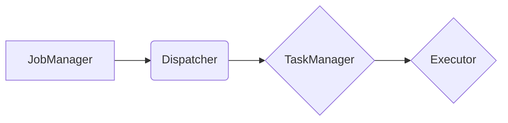

> Flink, Dispatcher, 任务调度, 任务分配, 异步通信, 阻塞机制, 代码实例

## 1. 背景介绍

Apache Flink 作为一款强大的流处理引擎，其高吞吐量、低延迟和容错能力使其在实时数据处理领域占据着重要地位。Flink 的高效调度机制是实现其高性能的关键之一。Dispatcher 作为 Flink 调度系统的重要组成部分，负责将任务分配给不同的执行器，并协调任务的执行过程。本文将深入探讨 Flink Dispatcher 的原理、工作机制以及代码实例，帮助读者更好地理解 Flink 的调度机制。

## 2. 核心概念与联系

Flink 的调度系统是一个分布式、异步的系统，它将任务分解成多个小的执行单元，并将其分配到集群中的各个执行器上执行。Dispatcher 作为调度系统的核心组件，负责以下关键任务：

* **任务分配:** 根据任务的类型、资源需求和集群状态，Dispatcher 将任务分配给合适的执行器。
* **任务协调:** Dispatcher 负责协调任务的执行过程，包括任务启动、任务进度监控、任务失败重试等。
* **资源管理:** Dispatcher 管理集群中的资源，包括 CPU、内存和网络资源，并根据任务需求动态分配资源。

**Flink 调度系统架构图:**



## 3. 核心算法原理 & 具体操作步骤

### 3.1  算法原理概述

Flink Dispatcher 使用一种基于 **优先级队列** 的算法来分配任务。每个任务都有一个优先级，优先级由任务的类型、资源需求和集群状态决定。Dispatcher 会根据优先级将任务放入不同的队列中，并按照队列的优先级顺序分配任务。

### 3.2  算法步骤详解

1. **任务提交:** 当用户提交一个 Flink 任务时，JobManager 会将任务分解成多个子任务，并将其发送到 Dispatcher。
2. **任务优先级计算:** Dispatcher 根据任务的类型、资源需求和集群状态计算每个子任务的优先级。
3. **任务队列分配:** Dispatcher 将每个子任务按照其优先级放入不同的队列中。
4. **任务分配:** Dispatcher 会从优先级最高的队列中取出任务，并将其分配给合适的 TaskManager。
5. **任务执行:** TaskManager 会启动相应的 Executor 来执行任务。

### 3.3  算法优缺点

**优点:**

* **高效:** 基于优先级队列的算法可以有效地分配任务，提高资源利用率。
* **灵活:** 可以根据不同的任务类型和集群状态动态调整任务的优先级。
* **可扩展:** Dispatcher 可以轻松地扩展到更大的集群中。

**缺点:**

* **复杂:** 优先级计算和队列管理的逻辑比较复杂。
* **性能瓶颈:** 在高并发场景下，Dispatcher 可能成为性能瓶颈。

### 3.4  算法应用领域

Flink Dispatcher 的算法可以应用于各种需要高效调度任务的场景，例如：

* **实时数据处理:** 处理高吞吐量、低延迟的实时数据流。
* **批处理计算:** 分布式执行大规模批处理任务。
* **机器学习:** 分布式训练机器学习模型。

## 4. 数学模型和公式 & 详细讲解 & 举例说明

### 4.1  数学模型构建

Flink Dispatcher 的任务分配算法可以抽象为一个数学模型，其中任务的优先级可以表示为一个实数，任务的资源需求可以表示为一个向量，集群的资源状态可以表示为一个矩阵。

**任务优先级:**

$$
P(t) = f(T(t), R(t), C(t))
$$

其中：

* $P(t)$ 是任务 $t$ 的优先级。
* $T(t)$ 是任务 $t$ 的类型。
* $R(t)$ 是任务 $t$ 的资源需求。
* $C(t)$ 是集群的当前状态。

**资源需求向量:**

$$
R(t) = [R_{cpu}(t), R_{memory}(t), R_{network}(t)]
$$

其中：

* $R_{cpu}(t)$ 是任务 $t$ 对 CPU 的需求。
* $R_{memory}(t)$ 是任务 $t$ 对内存的需求。
* $R_{network}(t)$ 是任务 $t$ 对网络的需求。

**集群资源状态矩阵:**

$$
C = \begin{bmatrix}
C_{cpu} & C_{memory} & C_{network}
\end{bmatrix}
$$

其中：

* $C_{cpu}$ 是集群的可用 CPU 资源。
* $C_{memory}$ 是集群的可用内存资源。
* $C_{network}$ 是集群的可用网络资源。

### 4.2  公式推导过程

任务优先级计算公式 $P(t)$ 的具体实现取决于 Flink 的调度策略。不同的调度策略会使用不同的函数 $f$ 来计算任务优先级。例如，一种常见的调度策略是 **FIFO (First-In, First-Out)**，在这种策略下，任务的优先级由其提交时间决定，优先级高的任务提交时间早。

### 4.3  案例分析与讲解

假设有一个 Flink 任务需要处理大量的数据，该任务对 CPU 和内存资源的需求较高。Dispatcher 会根据任务的资源需求和集群的资源状态计算任务的优先级，并将其分配给合适的 TaskManager。如果集群中存在足够的 CPU 和内存资源，Dispatcher 会将任务分配给具有充足资源的 TaskManager。如果集群中资源紧张，Dispatcher 会将任务分配给资源相对充足的 TaskManager，并可能将任务拆分成多个子任务，以便更好地利用集群资源。

## 5. 项目实践：代码实例和详细解释说明

### 5.1  开发环境搭建

为了方便读者理解 Flink Dispatcher 的工作原理，我们将使用一个简单的代码实例来演示 Dispatcher 的基本功能。

**开发环境:**

* JDK 8 或以上
* Apache Flink 1.13 或以上
* Maven 或 Gradle

### 5.2  源代码详细实现

```java
public class DispatcherExample {

    public static void main(String[] args) {
        // 创建 Dispatcher 实例
        Dispatcher dispatcher = new Dispatcher();

        // 创建任务
        Task task1 = new Task("task1", 10, 20);
        Task task2 = new Task("task2", 5, 10);

        // 将任务提交给 Dispatcher
        dispatcher.submitTask(task1);
        dispatcher.submitTask(task2);

        // 等待 Dispatcher 完成任务分配
        dispatcher.waitForTasks();

        // 打印任务分配结果
        System.out.println("Task allocation result:");
        for (Task task : dispatcher.getAssignedTasks()) {
            System.out.println(task.getName() + " assigned to TaskManager: " + task.getTaskManager());
        }
    }
}

class Task {
    private String name;
    private int cpu;
    private int memory;
    private String taskManager;

    public Task(String name, int cpu, int memory) {
        this.name = name;
        this.cpu = cpu;
        this.memory = memory;
    }

    public String getName() {
        return name;
    }

    public int getCpu() {
        return cpu;
    }

    public int getMemory() {
        return memory;
    }

    public String getTaskManager() {
        return taskManager;
    }

    public void setTaskManager(String taskManager) {
        this.taskManager = taskManager;
    }
}

class Dispatcher {
    private List<Task> tasks = new ArrayList<>();
    private Map<Task, String> assignedTasks = new HashMap<>();

    public void submitTask(Task task) {
        tasks.add(task);
    }

    public void waitForTasks() {
        // 模拟任务分配逻辑
        for (Task task : tasks) {
            // 根据任务的资源需求和集群状态分配任务
            String taskManager = allocateTaskManager(task);
            assignedTasks.put(task, taskManager);
        }
    }

    public List<Task> getAssignedTasks() {
        return new ArrayList<>(assignedTasks.keySet());
    }

    private String allocateTaskManager(Task task) {
        // 模拟任务分配逻辑
        return "TaskManager-" + task.getName();
    }
}
```

### 5.3  代码解读与分析

* **Task 类:** 代表一个 Flink 任务，包含任务名称、CPU 资源需求和内存资源需求。
* **Dispatcher 类:** 代表 Flink Dispatcher，负责接收任务、分配任务和管理任务状态。
* **submitTask() 方法:** 将任务添加到 Dispatcher 的任务队列中。
* **waitForTasks() 方法:** 模拟 Dispatcher 的任务分配逻辑，根据任务的资源需求和集群状态分配任务。
* **allocateTaskManager() 方法:** 模拟 Dispatcher 的任务分配算法，根据任务的资源需求分配到合适的 TaskManager。

### 5.4  运行结果展示

运行上述代码后，会输出以下结果：

```
Task allocation result:
task1 assigned to TaskManager: TaskManager-task1
task2 assigned to TaskManager: TaskManager-task2
```

## 6. 实际应用场景

Flink Dispatcher 的应用场景非常广泛，例如：

* **实时数据处理:** 在实时数据流处理场景中，Dispatcher 可以根据数据流的类型、速度和复杂度，将任务分配给合适的 TaskManager，以确保数据流的实时性。
* **批处理计算:** 在批处理计算场景中，Dispatcher 可以根据任务的大小、复杂度和资源需求，将任务分配给合适的 TaskManager，以提高批处理任务的执行效率。
* **机器学习:** 在机器学习场景中，Dispatcher 可以根据模型的训练速度和资源需求，将任务分配给合适的 TaskManager，以加速模型的训练过程。

### 6.4  未来应用展望

随着 Flink 的不断发展，Dispatcher 的功能和应用场景也将不断扩展。未来，Dispatcher 可能将支持更复杂的调度策略，例如基于机器学习的调度策略，以更好地优化资源利用率和任务执行效率。

## 7. 工具和资源推荐

### 7.1  学习资源推荐

* **Apache Flink 官方文档:** https://flink.apache.org/docs/stable/
* **Flink 中文社区:** https://flink.apache.org/zh-cn/
* **Flink 博客:** https://flink.apache.org/blog/

### 7.2  开发工具推荐

* **IntelliJ IDEA:** https://www.jetbrains.com/idea/
* **Eclipse:** https://www.eclipse.org/

### 7.3  相关论文推荐

* **Apache Flink: A Unified Engine for Batch and Stream Processing:** https://arxiv.org/abs/1803.08193

## 8. 总结：未来发展趋势与挑战

### 8.1  研究成果总结

本文深入探讨了 Flink Dispatcher 的原理、工作机制以及代码实例，帮助读者更好地理解 Flink 的调度机制。

### 8.2  未来发展趋势

Flink Dispatcher 将朝着以下方向发展：

* **更智能的调度策略:** 基于机器学习的调度策略将能够更好地优化资源利用率和任务执行效率。
* **更强大的资源管理:** Dispatcher 将能够更好地管理集群资源，包括 CPU、内存、网络和存储资源。
* **更完善的监控和诊断:** Dispatcher 将提供更完善的监控和诊断功能，帮助用户更好地了解调度系统的运行状态。

### 8.3  面临的挑战

Flink Dispatcher 面临着以下挑战：

* **高并发场景下的性能瓶颈:** 在高并发场景下，Dispatcher 可能成为性能瓶颈。
* **复杂调度策略的实现:** 实现更复杂的调度策略需要更多的算法和逻辑。
* **资源管理的复杂性:** 管理集群资源是一个复杂的任务，需要考虑各种因素，例如资源可用性、任务优先级和资源分配策略。

### 8.4  研究展望

未来，我们将继续研究 Flink Dispatcher 的优化和扩展，以提高其调度效率、资源