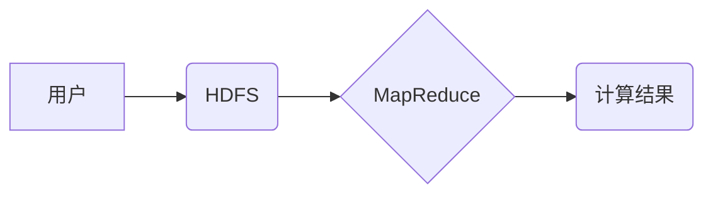

> Hadoop, MapReduce, 分布式计算, 并行处理, 数据处理, 编程模型, 算法原理, 代码实例

## 1. 背景介绍

随着互联网和移动互联网的蓬勃发展，海量数据量的产生和处理成为当今社会面临的重大挑战。传统的单机计算架构已难以满足大规模数据处理的需求。分布式计算技术应运而生，为处理海量数据提供了新的解决方案。

Hadoop是一个开源的分布式存储和处理框架，它基于MapReduce计算模型，能够高效地处理海量数据。MapReduce是一种编程模型，它将大型数据处理任务分解成多个小的任务，并并行执行这些任务，从而提高计算效率。

## 2. 核心概念与联系

**2.1 MapReduce计算模型**

MapReduce计算模型由两个核心阶段组成：Map阶段和Reduce阶段。

* **Map阶段:** 将输入数据划分为多个数据块，每个数据块由一个Mapper进程处理。Mapper进程对每个数据块进行处理，将数据转换为键值对，并将这些键值对输出到一个中间存储系统中。

* **Reduce阶段:** 从中间存储系统中读取所有键值对，根据键进行分组，每个分组由一个Reducer进程处理。Reducer进程对每个分组的数据进行聚合操作，生成最终的输出结果。

**2.2 Hadoop架构**

Hadoop框架由多个组件组成，包括：

* **HDFS (Hadoop Distributed File System):** 分布式文件系统，用于存储大规模数据。
* **YARN (Yet Another Resource Negotiator):** 资源管理系统，负责分配计算资源给MapReduce任务。
* **MapReduce:** 计算框架，负责执行MapReduce任务。

**2.3 关系图**



## 3. 核心算法原理 & 具体操作步骤

### 3.1  算法原理概述

MapReduce算法的核心思想是将大型数据处理任务分解成多个小的任务，并并行执行这些任务。通过将数据分片、并行处理和数据聚合，MapReduce算法能够高效地处理海量数据。

### 3.2  算法步骤详解

1. **数据分片:** 将输入数据划分为多个数据块，每个数据块的大小可以根据实际情况进行调整。
2. **Map阶段:** 每个数据块由一个Mapper进程处理，Mapper进程对每个数据块进行处理，将数据转换为键值对，并将这些键值对输出到一个中间存储系统中。
3. **数据分组:** 从中间存储系统中读取所有键值对，根据键进行分组，每个分组由一个Reducer进程处理。
4. **Reduce阶段:** 每个Reducer进程对每个分组的数据进行聚合操作，生成最终的输出结果。

### 3.3  算法优缺点

**优点:**

* **并行处理:** MapReduce算法能够并行处理多个数据块，提高计算效率。
* **容错性:** Hadoop框架具有高容错性，即使部分节点故障，也能保证任务的正常执行。
* **易于扩展:** Hadoop框架可以轻松扩展到更大的集群，以处理更大的数据量。

**缺点:**

* **数据倾斜问题:** 如果数据分布不均匀，可能会导致某些Reducer进程处理的数据量过大，影响整体性能。
* **编程复杂度:** 使用MapReduce编程模型需要一定的学习成本。

### 3.4  算法应用领域

MapReduce算法广泛应用于以下领域:

* **数据分析:** 对海量数据进行统计分析、模式识别等。
* **机器学习:** 对大规模数据集进行训练，构建机器学习模型。
* **搜索引擎:** 对网页进行索引和排名。
* **推荐系统:** 根据用户行为数据，推荐相关商品或服务。

## 4. 数学模型和公式 & 详细讲解 & 举例说明

### 4.1  数学模型构建

MapReduce算法可以抽象为一个图论模型，其中：

* **节点:** 代表数据块、Mapper进程、Reducer进程。
* **边:** 代表数据流向。

### 4.2  公式推导过程

MapReduce算法的执行时间可以表示为：

```latex
T = T_map + T_shuffle + T_reduce
```

其中：

* $T_map$: Map阶段执行时间。
* $T_shuffle$: 数据shuffle阶段执行时间。
* $T_reduce$: Reduce阶段执行时间。

### 4.3  案例分析与讲解

假设一个数据量为100GB的数据集，需要进行单词计数操作。

* **Map阶段:** 每个Mapper进程处理1GB的数据，将每个单词作为键，计数作为值输出到中间存储系统。
* **Shuffle阶段:** 将所有键值对根据键进行分组，并将每个分组的数据发送到相应的Reducer进程。
* **Reduce阶段:** 每个Reducer进程对每个分组的数据进行聚合，计算每个单词的总计数。

## 5. 项目实践：代码实例和详细解释说明

### 5.1  开发环境搭建

* 安装Hadoop环境。
* 配置Hadoop集群。

### 5.2  源代码详细实现

```java
import org.apache.hadoop.conf.Configuration;
import org.apache.hadoop.fs.Path;
import org.apache.hadoop.io.IntWritable;
import org.apache.hadoop.io.Text;
import org.apache.hadoop.mapreduce.Job;
import org.apache.hadoop.mapreduce.Mapper;
import org.apache.hadoop.mapreduce.Reducer;
import org.apache.hadoop.mapreduce.lib.input.FileInputFormat;
import org.apache.hadoop.mapreduce.lib.output.FileOutputFormat;

public class WordCount {

    public static class Map extends Mapper<Object, Text, Text, IntWritable> {
        private final IntWritable one = new IntWritable(1);
        private Text word = new Text();

        @Override
        protected void map(Object key, Text value, Context context) throws IOException, InterruptedException {
            String line = value.toString();
            String[] words = line.split("\\s+");
            for (String word : words) {
                this.word.set(word);
                context.write(this.word, one);
            }
        }
    }

    public static class Reduce extends Reducer<Text, IntWritable, Text, IntWritable> {
        private IntWritable result = new IntWritable();

        @Override
        protected void reduce(Text key, Iterable<IntWritable> values, Context context) throws IOException, InterruptedException {
            int sum = 0;
            for (IntWritable value : values) {
                sum += value.get();
            }
            result.set(sum);
            context.write(key, result);
        }
    }

    public static void main(String[] args) throws Exception {
        Configuration conf = new Configuration();
        Job job = Job.getInstance(conf, "WordCount");
        job.setJarByClass(WordCount.class);
        job.setMapperClass(Map.class);
        job.setReducerClass(Reduce.class);
        job.setOutputKeyClass(Text.class);
        job.setOutputValueClass(IntWritable.class);
        FileInputFormat.addInputPath(job, new Path(args[0]));
        FileOutputFormat.setOutputPath(job, new Path(args[1]));
        System.exit(job.waitForCompletion(true) ? 0 : 1);
    }
}
```

### 5.3  代码解读与分析

* **Map类:** 负责将输入数据转换为键值对。
* **Reduce类:** 负责对每个键进行聚合操作。
* **main方法:** 配置Hadoop作业，并提交作业到集群执行。

### 5.4  运行结果展示

运行完成后，会在输出目录下生成单词计数结果文件。

## 6. 实际应用场景

MapReduce算法广泛应用于以下实际场景:

* **电商平台:** 对用户行为数据进行分析，推荐商品和服务。
* **社交媒体:** 对用户帖子进行分类和分析，识别热点话题。
* **金融行业:** 对交易数据进行分析，识别欺诈行为。

### 6.4  未来应用展望

随着大数据和人工智能技术的不断发展，MapReduce算法将在更多领域得到应用，例如：

* **基因组学:** 对基因组数据进行分析，研究疾病的遗传机制。
* **气候变化:** 对气候数据进行分析，预测未来气候变化趋势。
* **自动驾驶:** 对传感器数据进行分析，提高自动驾驶系统的安全性。

## 7. 工具和资源推荐

### 7.1  学习资源推荐

* **Hadoop官方文档:** https://hadoop.apache.org/docs/
* **MapReduce编程指南:** https://hadoop.apache.org/docs/current/hadoop-mapreduce-client/hadoop-mapreduce-client-core/MapReduceTutorial.html

### 7.2  开发工具推荐

* **Eclipse:** https://www.eclipse.org/
* **IntelliJ IDEA:** https://www.jetbrains.com/idea/

### 7.3  相关论文推荐

* **MapReduce: Simplified Data Processing on Large Clusters:** https://static.googleusercontent.com/media/research.google.com/en//pubs/archive/40971.pdf

## 8. 总结：未来发展趋势与挑战

### 8.1  研究成果总结

MapReduce算法为大规模数据处理提供了有效的解决方案，并推动了分布式计算技术的进步。

### 8.2  未来发展趋势

* **更快的计算速度:** 通过优化算法和硬件，提高MapReduce的计算速度。
* **更灵活的编程模型:** 开发更灵活的编程模型，支持更复杂的计算任务。
* **更强大的数据分析能力:** 将机器学习和深度学习技术与MapReduce结合，增强数据分析能力。

### 8.3  面临的挑战

* **数据倾斜问题:** 如何有效解决数据倾斜问题，提高MapReduce的性能。
* **编程复杂度:** 如何降低MapReduce编程的复杂度，提高开发效率。
* **资源管理:** 如何更有效地管理集群资源，提高资源利用率。

### 8.4  研究展望

未来，MapReduce算法将继续朝着更快速、更灵活、更强大的方向发展，并将在更多领域发挥重要作用。


## 9. 附录：常见问题与解答

**问题:** MapReduce算法的性能如何？

**答案:** MapReduce算法的性能取决于多个因素，例如数据规模、数据分布、集群规模等。一般来说，MapReduce算法能够高效地处理海量数据。

**问题:** MapReduce算法有哪些缺点？

**答案:** MapReduce算法的缺点包括数据倾斜问题、编程复杂度等。

**问题:** 如何解决MapReduce算法中的数据倾斜问题？

**答案:** 可以通过数据切分、数据哈希等方法来解决数据倾斜问题。


作者：禅与计算机程序设计艺术 / Zen and the Art of Computer Programming 
<end_of_turn>