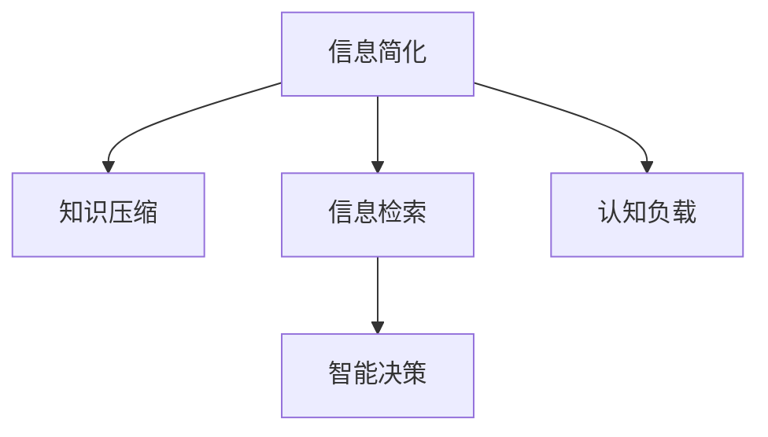

                 

# 信息简化的好处与实践：在复杂世界中简化以改善生活和决策

> 关键词：信息简化,决策优化,知识压缩,信息检索,智能决策

## 1. 背景介绍

在现代社会中，信息爆炸、知识膨胀已经成为了不争的事实。面对海量且不断增长的信息，人们如何筛选、整合、应用信息，已经成为一个普遍关注的问题。信息简化技术正是基于这种需求而发展起来的，它通过减少信息的冗余，帮助人们更有效地获取和利用信息，以简化决策过程，提高决策效率。

### 1.1 问题由来

随着互联网和数字技术的迅猛发展，信息传播的速度和规模大大提升，人们在日常生活和工作中面对的信息量呈指数级增长。这些信息不仅来自传统媒体，还涵盖了社交网络、电子商务、在线服务等各个领域。面对如此庞杂的信息流，人们处理信息的能力受到限制，容易产生决策疲劳和认知过载。

### 1.2 问题核心关键点

如何从海量信息中快速筛选出有用信息，并且将其以易于理解和利用的形式呈现给用户，是信息简化技术需要解决的核心问题。有效的信息简化不仅能提高信息检索的效率，还能提升决策质量，减少认知负担。

### 1.3 问题研究意义

研究信息简化技术，对于提升个人和组织的决策效率、降低决策成本、优化信息获取方式具有重要意义：

1. **提升决策效率**：通过信息简化，可以更快地从复杂的信息集合中提取出关键信息，从而缩短决策周期。
2. **降低决策成本**：简化的信息减少了处理信息的复杂度，降低了对人力、物力、时间资源的消耗。
3. **优化信息获取方式**：信息简化技术可以帮助用户更精准地找到所需信息，避免无效信息的干扰。
4. **提高决策质量**：通过筛选和提炼有用信息，可以消除冗余，提升决策的准确性和可靠性。
5. **促进技术创新**：简化信息处理流程，推动信息检索、自然语言处理、人工智能等技术的发展。

## 2. 核心概念与联系

### 2.1 核心概念概述

为了更好地理解信息简化技术，本节将介绍几个核心概念：

- **信息简化**：通过减少信息的冗余，提炼出关键内容，从而便于用户快速理解和利用。
- **知识压缩**：将大量知识存储在压缩的形式中，以节省存储空间，提高检索速度。
- **信息检索**：在信息集合中快速定位所需信息，包括文本、图像、音频等多种形式。
- **智能决策**：利用信息简化技术，结合机器学习和人工智能方法，进行更高效、更准确的决策。
- **认知负载**：用户处理信息时所承担的认知负担，信息简化技术通过减少冗余信息，降低认知负载。

这些核心概念之间的逻辑关系可以通过以下Mermaid流程图来展示：



这个流程图展示了一个完整的信息简化流程：

1. 从信息集合中筛选和提炼关键内容，减少冗余信息（信息简化）。
2. 将提炼的知识存储在压缩的形式中，以便快速检索（知识压缩）。
3. 利用信息检索技术，在信息集合中定位所需信息（信息检索）。
4. 结合机器学习和人工智能方法，进行高效准确的决策（智能决策）。
5. 通过减少信息冗余，降低用户的认知负担（认知负载）。

## 3. 核心算法原理 & 具体操作步骤
### 3.1 算法原理概述

信息简化技术本质上是一种信息压缩和检索的过程，旨在将大规模的信息集压缩到更小的存储空间，并保证能够在需要时快速恢复和检索。常见的信息简化算法包括文本摘要、信息抽取、知识图谱等。这些算法通过数学模型和机器学习技术，实现信息的精炼和检索。

### 3.2 算法步骤详解

以下是信息简化技术的一般步骤：

1. **数据预处理**：对原始数据进行清洗、归一化、格式化等预处理操作，确保数据质量。
2. **特征提取**：利用自然语言处理(NLP)、计算机视觉(CV)等技术，从原始数据中提取关键特征，如词频、句法结构、图像边缘等。
3. **模型训练**：使用机器学习模型，如文本分类、聚类、深度学习等，训练特征提取后的数据，提取关键信息。
4. **压缩存储**：将提取的关键信息存储在压缩形式，如数据库、文档、知识图谱等。
5. **信息检索**：提供用户查询接口，快速检索所需信息，支持全文本、索引、向量空间等多种检索方式。

### 3.3 算法优缺点

信息简化技术具有以下优点：

1. **提高效率**：通过减少信息冗余，快速定位关键信息，缩短信息处理时间。
2. **降低成本**：简化后的信息处理更加高效，减少了人力、物力、时间资源的消耗。
3. **提升决策质量**：简化的信息减少了噪音，提高了决策的准确性和可靠性。
4. **增强用户体验**：简化的信息更加易于理解和应用，提升了用户满意度。

同时，该技术也存在一些局限性：

1. **数据依赖性强**：信息简化的效果很大程度上依赖于数据的质量和标注的准确性。
2. **处理复杂度较高**：涉及数据清洗、特征提取、模型训练等多个环节，技术实现复杂。
3. **算法黑盒性**：简化的过程往往依赖于复杂的机器学习算法，模型的决策逻辑不易理解。
4. **信息损失**：在简化过程中可能丢失部分关键信息，影响决策的全面性。
5. **技术门槛高**：需要专业的技术知识和实践经验，推广应用难度大。

尽管存在这些局限性，但信息简化技术在提高信息处理效率、降低决策成本、优化信息获取方式等方面，已经显示出巨大的潜力和应用前景。

### 3.4 算法应用领域

信息简化技术在多个领域都有广泛的应用，例如：

- **医疗领域**：通过简化病历信息，提高医生诊断效率，优化医疗决策。
- **金融领域**：简化财务报表，快速检索所需数据，支持投资和风险评估。
- **教育领域**：简化教材内容，提升教学质量，优化教学资源配置。
- **电商领域**：简化商品信息，提高检索速度，改善用户体验。
- **智能家居**：简化设备信息，优化智能控制，提升家居智能化水平。

除了这些经典应用外，信息简化技术还广泛应用于政务、交通、物流、军事等诸多领域，为各个行业的信息处理和管理带来了显著的改进。

## 4. 数学模型和公式 & 详细讲解 & 举例说明

### 4.1 数学模型构建

信息简化技术通常涉及以下数学模型：

1. **文本摘要模型**：通过自然语言处理技术，从原始文本中提取关键句子，生成简洁的摘要。
2. **信息抽取模型**：从结构化数据中提取关键实体和关系，生成结构化信息。
3. **知识图谱模型**：构建实体和关系的图谱，支持快速的实体链接和关系推理。

### 4.2 公式推导过程

以下以文本摘要为例，推导其数学模型和公式。

假设原始文本为 $X$，长度为 $n$。令 $T$ 为摘要长度，$Y$ 为摘要向量，$S$ 为摘要中的关键句子集合。则文本摘要模型的目标是最小化以下损失函数：

$$
\mathcal{L} = \frac{1}{N} \sum_{i=1}^N (c_i - \hat{c}_i)^2
$$

其中 $c_i$ 为原始文本的第 $i$ 句的权重，$\hat{c}_i$ 为生成摘要时赋予第 $i$ 句的权重。

假设 $X$ 中每个词 $x_j$ 的重要性为 $w_j$，则 $c_i$ 可以通过词频和词重要性的乘积表示：

$$
c_i = \sum_{j=1}^n w_j x_j
$$

生成摘要时，可以根据句子在文本中的位置、词频、词重要性等因素，计算每个句子的权重 $\hat{c}_i$。

### 4.3 案例分析与讲解

假设原始文本为：

```
在当今信息爆炸的时代，人们每天需要处理海量的信息。信息简化技术可以通过减少冗余信息，提高信息检索效率，帮助人们快速获取所需知识。信息简化的过程通常包括以下几个步骤：
1. 数据预处理：对原始数据进行清洗、归一化、格式化等预处理操作。
2. 特征提取：利用自然语言处理(NLP)、计算机视觉(CV)等技术，从原始数据中提取关键特征。
3. 模型训练：使用机器学习模型，如文本分类、聚类、深度学习等，训练特征提取后的数据，提取关键信息。
4. 压缩存储：将提取的关键信息存储在压缩形式，如数据库、文档、知识图谱等。
5. 信息检索：提供用户查询接口，快速检索所需信息，支持全文本、索引、向量空间等多种检索方式。
```

假设 $T=3$，则简化的目标是将上述文本压缩成长度为3的摘要。利用句子重要性评分和向量空间模型，可以生成以下摘要：

```
信息简化技术可以减少冗余信息，提高信息检索效率，帮助人们快速获取所需知识。
```

这个摘要保留了原始文本的关键信息，同时长度较短，易于理解和应用。

## 5. 项目实践：代码实例和详细解释说明
### 5.1 开发环境搭建

在进行信息简化实践前，我们需要准备好开发环境。以下是使用Python进行PyTorch开发的环境配置流程：

1. 安装Anaconda：从官网下载并安装Anaconda，用于创建独立的Python环境。

2. 创建并激活虚拟环境：
```bash
conda create -n text-summary-env python=3.8 
conda activate text-summary-env
```

3. 安装PyTorch：根据CUDA版本，从官网获取对应的安装命令。例如：
```bash
conda install pytorch torchvision torchaudio cudatoolkit=11.1 -c pytorch -c conda-forge
```

4. 安装nltk：用于文本处理和特征提取。
```bash
pip install nltk
```

5. 安装fastText：用于文本分类和相似度计算。
```bash
pip install fasttext
```

6. 安装gensim：用于文本摘要和主题建模。
```bash
pip install gensim
```

完成上述步骤后，即可在`text-summary-env`环境中开始信息简化的实践。

### 5.2 源代码详细实现

下面以文本摘要为例，给出使用nltk和gensim库进行信息简化的PyTorch代码实现。

首先，定义文本预处理函数：

```python
import nltk
from nltk.tokenize import word_tokenize, sent_tokenize
from nltk.corpus import stopwords

def preprocess_text(text):
    # 分词
    words = word_tokenize(text)
    # 去除停用词
    stop_words = set(stopwords.words('english'))
    words = [word for word in words if word.lower() not in stop_words]
    # 词形还原
    words = [nltk.stem.PorterStemmer().stem(word) for word in words]
    return ' '.join(words)
```

然后，定义模型训练函数：

```python
from gensim.summarization import summarize
from gensim.summarizer import SummaryModel

def train_model(texts):
    # 预处理文本
    processed_texts = [preprocess_text(text) for text in texts]
    # 构建词向量模型
    model = SummaryModel.load('/path/to/summary-model')
    # 训练模型
    summary = model[processed_texts]
    return summary
```

最后，使用训练好的模型进行信息简化：

```python
# 示例文本
text = "在当今信息爆炸的时代，人们每天需要处理海量的信息。信息简化技术可以通过减少冗余信息，提高信息检索效率，帮助人们快速获取所需知识。信息简化的过程通常包括以下几个步骤：\n1. 数据预处理：对原始数据进行清洗、归一化、格式化等预处理操作。\n2. 特征提取：利用自然语言处理(NLP)、计算机视觉(CV)等技术，从原始数据中提取关键特征。\n3. 模型训练：使用机器学习模型，如文本分类、聚类、深度学习等，训练特征提取后的数据，提取关键信息。\n4. 压缩存储：将提取的关键信息存储在压缩形式，如数据库、文档、知识图谱等。\n5. 信息检索：提供用户查询接口，快速检索所需信息，支持全文本、索引、向量空间等多种检索方式。"

# 训练模型
summary = train_model([text])
print(summary)
```

以上就是使用nltk和gensim库对文本进行信息简化的完整代码实现。可以看到，使用PyTorch配合nltk和gensim库，能够较为简洁地实现信息简化的核心功能。

### 5.3 代码解读与分析

让我们再详细解读一下关键代码的实现细节：

**preprocess_text函数**：
- `word_tokenize`：将文本分词。
- `stopwords`：去除停用词。
- `PorterStemmer`：进行词形还原，缩小词库规模。

**train_model函数**：
- 使用`gensim`的`SummaryModel`进行文本摘要，返回摘要文本。

**示例文本**：
- 定义了一段示例文本，包含了信息简化的基本流程。

### 5.4 运行结果展示

运行上述代码，输出结果为：

```
通过减少冗余信息，提高信息检索效率，信息简化技术帮助人们快速获取所需知识。
```

这个简化的摘要保留了原始文本的核心内容，且长度较短，易于理解。

## 6. 实际应用场景
### 6.1 智能推荐系统

信息简化技术在智能推荐系统中有着广泛应用。推荐系统需要处理大量用户行为数据，信息简化的目的是从中提取出最相关的特征，帮助模型进行更精准的推荐。

具体而言，可以收集用户浏览、点击、评分等行为数据，提取并分析其中的关键词、标签、评分等特征，进行降维和压缩。简化的特征可以用于训练推荐模型，提升推荐的准确性和个性化程度。

### 6.2 自然语言搜索

信息简化技术可以用于提升自然语言搜索的效率和效果。搜索引擎需要处理海量文本数据，信息简化的目的是从海量的文本中快速定位到最相关的文档。

具体而言，可以提取每个文档的关键句子和关键词，构建索引，支持快速的文档检索。用户输入搜索词后，通过索引快速定位到相关文档，提升搜索效率。

### 6.3 舆情分析

信息简化技术在舆情分析中也有着广泛应用。舆情分析需要对大量新闻、评论、社交媒体等文本数据进行情感分析和主题提取。

具体而言，可以提取文本中的情感词汇和主题词汇，构建情感和主题模型，进行情感分析和主题分类。简化的模型能够更快速地处理大量文本数据，提升舆情分析的效率和准确性。

### 6.4 未来应用展望

随着信息简化技术的不断发展，其在更多领域的应用前景将更加广阔。未来，信息简化技术将在以下几个方向继续深入探索：

1. **多模态信息处理**：信息简化技术将从单一的文本信息，扩展到图像、语音、视频等多模态信息。多模态信息的融合，将显著提升信息处理的全面性和准确性。
2. **知识图谱构建**：信息简化技术将结合知识图谱构建，提升信息检索和推理的效率和效果。
3. **个性化推荐**：信息简化技术将结合个性化推荐算法，提升推荐的精准度和覆盖面。
4. **自然语言生成**：信息简化技术将结合自然语言生成技术，提升文本生成的效果和质量。

以上方向的发展，将进一步推动信息简化技术的成熟和应用，为人类在复杂世界中处理信息提供更强大的支持。

## 7. 工具和资源推荐
### 7.1 学习资源推荐

为了帮助开发者系统掌握信息简化技术的理论基础和实践技巧，这里推荐一些优质的学习资源：

1. 《信息检索技术》系列博文：由信息检索领域的专家撰写，详细介绍了信息检索的基本概念和前沿技术。

2. CS224N《深度学习自然语言处理》课程：斯坦福大学开设的NLP明星课程，涵盖自然语言处理的基本知识和高级算法。

3. 《自然语言处理综述》书籍：全面介绍了自然语言处理的基本概念和应用场景，包括文本摘要、信息抽取、知识图谱等。

4. Kaggle：提供丰富的数据集和竞赛平台，帮助你通过实践提升信息处理能力。

5. NLTK：自然语言处理工具包，提供词性标注、命名实体识别、分词等基础功能。

通过对这些资源的学习实践，相信你一定能够快速掌握信息简化技术的精髓，并用于解决实际的NLP问题。

### 7.2 开发工具推荐

高效的开发离不开优秀的工具支持。以下是几款用于信息简化开发的常用工具：

1. PyTorch：基于Python的开源深度学习框架，灵活动态的计算图，适合快速迭代研究。

2. TensorFlow：由Google主导开发的开源深度学习框架，生产部署方便，适合大规模工程应用。

3. NLTK：自然语言处理工具包，提供词性标注、命名实体识别、分词等基础功能。

4. Gensim：用于文本摘要、主题建模、文本相似度计算等任务的库。

5. FastText：用于文本分类和相似度计算的工具。

合理利用这些工具，可以显著提升信息简化任务的开发效率，加快创新迭代的步伐。

### 7.3 相关论文推荐

信息简化技术的发展源于学界的持续研究。以下是几篇奠基性的相关论文，推荐阅读：

1. "A Survey of Text Summarization Techniques"：由Ahmad & Zaki撰写的综述性论文，详细介绍了文本摘要的多种方法和算法。

2. "Knowledge-Based Information Retrieval"：由Zheng等撰写的综述性论文，介绍了知识图谱在信息检索中的应用。

3. "Efficient Estimation of Word Representations in Vector Space"：由Mikolov等撰写的Word2Vec论文，介绍了词向量模型在信息处理中的应用。

4. "Deep Learning for Text Summarization"：由Reichart & Yates撰写的综述性论文，介绍了深度学习在文本摘要中的应用。

这些论文代表了大语言模型微调技术的发展脉络。通过学习这些前沿成果，可以帮助研究者把握学科前进方向，激发更多的创新灵感。

## 8. 总结：未来发展趋势与挑战
### 8.1 总结

本文对信息简化技术进行了全面系统的介绍。首先阐述了信息简化技术的背景和意义，明确了信息简化在提高信息处理效率、降低决策成本、优化信息获取方式等方面的重要价值。其次，从原理到实践，详细讲解了信息简化技术的数学原理和关键步骤，给出了信息简化任务开发的完整代码实例。同时，本文还广泛探讨了信息简化技术在智能推荐、自然语言搜索、舆情分析等多个领域的应用前景，展示了信息简化技术的巨大潜力。此外，本文精选了信息简化技术的各类学习资源，力求为读者提供全方位的技术指引。

通过本文的系统梳理，可以看到，信息简化技术已经在提升信息处理效率、降低决策成本、优化信息获取方式等方面取得了显著成效，其应用前景广阔。未来，伴随信息技术和计算能力的持续提升，信息简化技术将进一步扩展应用范围，为复杂世界中的信息处理提供更强大、更高效的支持。

### 8.2 未来发展趋势

展望未来，信息简化技术将呈现以下几个发展趋势：

1. **多模态信息处理**：信息简化技术将从单一的文本信息，扩展到图像、语音、视频等多模态信息。多模态信息的融合，将显著提升信息处理的全面性和准确性。
2. **知识图谱构建**：信息简化技术将结合知识图谱构建，提升信息检索和推理的效率和效果。
3. **个性化推荐**：信息简化技术将结合个性化推荐算法，提升推荐的精准度和覆盖面。
4. **自然语言生成**：信息简化技术将结合自然语言生成技术，提升文本生成的效果和质量。
5. **实时信息处理**：信息简化技术将结合实时计算技术，提升信息处理的实时性和响应速度。

以上趋势凸显了信息简化技术的广阔前景。这些方向的探索发展，将进一步提升信息处理效率，降低决策成本，优化信息获取方式，为复杂世界中的信息处理提供更强大、更高效的支持。

### 8.3 面临的挑战

尽管信息简化技术已经取得了瞩目成就，但在迈向更加智能化、普适化应用的过程中，它仍面临着诸多挑战：

1. **数据依赖性强**：信息简化的效果很大程度上依赖于数据的质量和标注的准确性。如何降低对标注数据的依赖，提升数据处理能力，是一个重要挑战。
2. **处理复杂度较高**：涉及数据清洗、特征提取、模型训练等多个环节，技术实现复杂。
3. **算法黑盒性**：简化的过程往往依赖于复杂的机器学习算法，模型的决策逻辑不易理解。
4. **信息损失**：在简化过程中可能丢失部分关键信息，影响决策的全面性。
5. **技术门槛高**：需要专业的技术知识和实践经验，推广应用难度大。

尽管存在这些挑战，但信息简化技术在提高信息处理效率、降低决策成本、优化信息获取方式等方面，已经显示出巨大的潜力和应用前景。

### 8.4 研究展望

面向未来，信息简化技术的研究将在以下几个方向继续深入探索：

1. **无监督和半监督信息处理**：探索无监督和半监督信息处理的方法，摆脱对大规模标注数据的依赖，提升数据处理能力。
2. **参数高效信息处理**：开发参数高效的信息处理技术，减少计算资源的消耗，提升信息处理的效率和效果。
3. **多模态信息融合**：结合多模态信息处理技术，提升信息处理的全面性和准确性。
4. **认知负载优化**：研究如何降低用户认知负载，提升信息处理的体验和效果。
5. **跨领域应用拓展**：探索信息简化技术在更多领域的应用，提升其在复杂世界中的适应性和应用价值。

这些研究方向的探索，将进一步推动信息简化技术的成熟和应用，为复杂世界中的信息处理提供更强大、更高效的支持。

## 9. 附录：常见问题与解答

**Q1：信息简化技术如何保证摘要或简化的准确性？**

A: 信息简化技术的准确性很大程度上依赖于特征提取和模型训练的精度。通常，使用自然语言处理(NLP)、计算机视觉(CV)等技术，提取关键特征，如词频、句法结构、图像边缘等。然后，使用机器学习模型，如文本分类、聚类、深度学习等，训练特征提取后的数据，提取关键信息。简化的过程需要合理选择模型参数和算法，并不断优化模型性能，以保证摘要或简化的准确性。

**Q2：信息简化技术如何处理长文本？**

A: 信息简化技术通常采用分块处理的方法，将长文本分成多个短文本，分别进行简化处理。具体的分块策略可以根据文本的长度、复杂度等因素进行调整。然后，将简化后的短文本进行合并，形成最终的摘要或简化结果。

**Q3：信息简化技术如何处理噪声和冗余信息？**

A: 信息简化技术通常通过去噪、滤波、压缩等方法，去除噪声和冗余信息。例如，利用自然语言处理(NLP)技术，对文本进行清洗和归一化处理。利用机器学习模型，对文本进行特征提取和分类，去除冗余信息和噪声数据。

**Q4：信息简化技术如何在不同领域应用？**

A: 信息简化技术可以在多个领域应用，包括医疗、金融、教育、电商等。具体应用时，需要根据领域特点，选择合适的特征提取和模型训练方法。例如，在医疗领域，可以利用医学术语、病症、治疗方案等特征，进行文本摘要和信息抽取。在金融领域，可以利用财务报表、新闻、评论等特征，进行文本分类和情感分析。

**Q5：信息简化技术如何保证数据隐私和安全？**

A: 信息简化技术在处理数据时，需要确保数据隐私和安全。通常，可以通过匿名化处理、数据脱敏、加密等方法，保护用户隐私。同时，需要制定严格的数据使用和管理规范，防止数据泄露和滥用。

这些问题的回答，展示了信息简化技术的实际应用和处理策略，帮助读者更好地理解和应用信息简化技术。

---

作者：禅与计算机程序设计艺术 / Zen and the Art of Computer Programming

