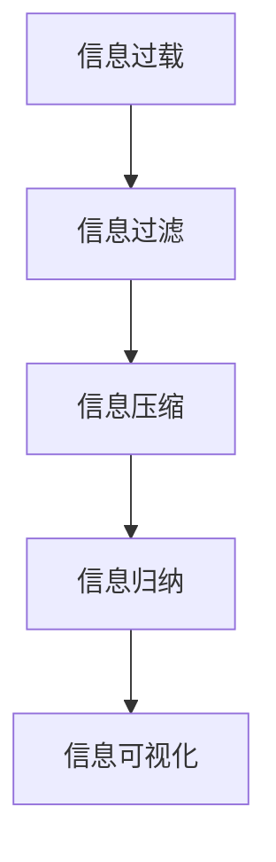

                 

# 信息简化的好处与挑战：在复杂世界中简化以改善决策和效率

> 关键词：信息简化,复杂世界,决策优化,数据压缩,认知负荷,算法简化,技术效率

## 1. 背景介绍

在现代社会中，信息的海量增长和高速流转给人们带来了前所未有的挑战和机会。复杂的信息环境要求我们不断学习和适应新的技术和方法，以保持高效和精准的决策能力。其中，信息简化作为一种重要的手段，正逐渐成为优化决策和提高效率的关键技术。

### 1.1 信息过载问题
现代信息技术的快速发展，使得信息获取渠道日益多样，内容日趋丰富。无论是文本、图像、视频还是音频，信息的种类和数量都在急剧增长。这种“信息过载”现象使得人们在处理信息时往往感到压力巨大，难以筛选出真正有价值的内容。信息过载不仅降低了决策效率，还容易导致认知疲劳和错误判断，严重影响个人和组织的工作效率。

### 1.2 信息简化的需求
面对复杂的信息环境，人们越来越迫切地需要一个能够简化信息，减轻认知负担，提升决策效率的工具和方法。信息简化通过过滤、归纳、压缩等手段，将复杂的信息转化为易于理解和操作的简明形式，从而帮助人们更快、更准地做出决策。

### 1.3 信息简化的应用场景
信息简化在多个领域都有广泛的应用，例如：

- **商业决策**：通过简化市场数据和客户反馈，帮助企业快速响应市场变化，制定有效的营销策略。
- **医疗诊断**：通过简化患者的临床数据和影像资料，提高医生的诊断速度和准确性，改善患者的治疗体验。
- **科学研究**：通过简化研究数据和实验结果，加速学术交流和合作，推动科学研究的发展。
- **教育培训**：通过简化教学内容和学习材料，提高学生的学习效率，促进知识传递。
- **个人生活**：通过简化日程安排和信息管理，提升个人生活的组织性和效率。

## 2. 核心概念与联系

### 2.1 核心概念概述

信息简化是一种通过减少信息的冗余和噪音，提取和保留关键信息，以降低认知负荷，优化决策效率的过程。其核心概念包括：

- **信息过载**：大量且复杂的信息导致的认知负荷过重。
- **信息过滤**：从大量信息中筛选出最相关的部分，减少不必要的干扰。
- **信息压缩**：将复杂信息转化为简明形式，便于理解和操作。
- **信息归纳**：通过抽象和概括，提取信息的核心要素和逻辑结构。
- **信息可视化**：使用图表、图形等视觉工具呈现复杂信息，直观展示关键信息。

这些概念之间的逻辑关系可以通过以下Mermaid流程图来展示：



这个流程图展示了一系列信息简化的主要步骤：

1. **信息过滤**：从海量信息中筛选出相关内容。
2. **信息压缩**：将复杂信息简化为易于理解和处理的形式。
3. **信息归纳**：提取信息的关键要素和结构。
4. **信息可视化**：使用图表等形式直观展示信息。

这些步骤共同构成了信息简化的基本流程，使得复杂的信息环境变得更加可控和易于处理。

## 3. 核心算法原理 & 具体操作步骤

### 3.1 算法原理概述

信息简化的核心算法原理基于认知心理学和信息理论，旨在通过减少信息的冗余和噪音，提高信息的可用性和可操作性。其核心思想是通过算法实现信息的过滤、压缩、归纳和可视化，从而减轻决策过程中的认知负担，提升效率。

### 3.2 算法步骤详解

信息简化的算法步骤通常包括以下几个关键步骤：

1. **数据预处理**：清洗和归一化数据，去除噪声和无关信息。
2. **信息过滤**：基于关键词、主题、模式等特征，从大量信息中筛选出相关部分。
3. **信息压缩**：使用算法如霍夫曼编码、LZW压缩、字典编码等，将复杂信息转化为简明形式。
4. **信息归纳**：通过聚类、分类、摘要等算法，提取信息的核心要素和逻辑结构。
5. **信息可视化**：使用图表、树状图、网络图等形式，直观展示信息的关键要素和关系。

以下是一个详细的信息简化示例，通过代码实现信息过滤、压缩、归纳和可视化的全过程：

```python
import pandas as pd
from sklearn.feature_extraction.text import CountVectorizer, TfidfVectorizer
from sklearn.decomposition import LatentDirichletAllocation
import matplotlib.pyplot as plt
from wordcloud import WordCloud

# 数据预处理
data = pd.read_csv('data.csv')
data = data.dropna()  # 去除缺失数据
data = data.drop_duplicates()  # 去除重复数据

# 信息过滤
vectorizer = TfidfVectorizer(stop_words='english', max_df=0.9)
X = vectorizer.fit_transform(data['text'])
keywords = vectorizer.get_feature_names_out()
keywords = [word for word in keywords if word in data['text'].unique()]

# 信息压缩
lda = LatentDirichletAllocation(n_components=5, random_state=42)
X_lda = lda.fit_transform(X)
lda_topics = ['Topic {}'.format(i+1) for i in range(lda.n_components)]
X_lda = X_lda.toarray()

# 信息归纳
lda_text = [' '.join([lda_topics[i], top_words[i][0], top_words[i][1]]) for i in range(lda.n_components)]
lda_text = ['Topic: ' + topic + '\n' + '\n'.join(words) for topic, words in zip(lda_topics, top_words)]

# 信息可视化
stop_words = set(TfidfVectorizer().get_stop_words('english'))
wordcloud = WordCloud(stopwords=stop_words, background_color='white').generate(str(data['text']))

plt.imshow(wordcloud, interpolation='bilinear')
plt.axis('off')
plt.show()
```

### 3.3 算法优缺点

信息简化算法具有以下优点：

1. **效率提升**：通过减少信息冗余和噪音，提高了信息的处理速度和可用性。
2. **认知负担减轻**：简化了信息的呈现形式，降低了认知负荷，有助于快速决策。
3. **适应性强**：可以应用于各种类型的数据，如文本、图像、音频等，具有广泛的适用性。

同时，信息简化算法也存在一定的局限性：

1. **信息丢失**：在压缩和归纳过程中，可能会丢失一些关键信息，影响决策的准确性。
2. **算法复杂度**：某些信息简化算法（如复杂机器学习模型）可能具有较高的计算复杂度，需要较强的计算资源。
3. **数据质量依赖**：算法效果依赖于数据的质量和完整性，数据噪声或偏差会影响结果。

### 3.4 算法应用领域

信息简化算法在多个领域都有广泛的应用，例如：

- **商业情报分析**：通过简化市场数据，帮助企业快速洞察市场趋势，制定营销策略。
- **医疗诊断支持**：通过简化患者影像资料和临床数据，提高医生的诊断效率和准确性。
- **新闻和信息聚合**：通过简化新闻内容，生成精简的新闻摘要，便于用户阅读。
- **金融数据分析**：通过简化金融数据，帮助分析师提取关键信息，制定投资决策。
- **智能推荐系统**：通过简化用户行为数据，生成个性化的推荐内容，提升用户体验。
- **教育培训内容优化**：通过简化教材和课件，提升学生的学习效率。

## 4. 数学模型和公式 & 详细讲解 & 举例说明

### 4.1 数学模型构建

信息简化的数学模型主要基于信息理论和认知心理学，包括信息熵、信息过滤模型、信息压缩算法等。以下将详细介绍这些数学模型及其构建方法。

### 4.2 公式推导过程

信息熵（Information Entropy）是信息理论中的基本概念，用于度量信息的不确定性。信息熵公式如下：

$$
H(X) = -\sum_{x \in X} P(x) \log P(x)
$$

其中，$X$ 是信息集合，$P(x)$ 是事件 $x$ 发生的概率。信息熵越高，表示信息的不确定性越大；信息熵越低，表示信息越确定。

信息过滤模型的核心是特征选择和权重分配。常见的特征选择方法包括卡方检验、信息增益、互信息等。以互信息为例，其公式如下：

$$
I(X; Y) = H(X) + H(Y) - H(X, Y)
$$

其中，$I(X; Y)$ 是信息 $X$ 和 $Y$ 之间的互信息，$H(X, Y)$ 是联合信息熵。互信息越高，表示 $X$ 和 $Y$ 之间的相关性越强，即 $X$ 对 $Y$ 的预测能力越强。

信息压缩算法包括霍夫曼编码、LZW压缩、字典编码等。以霍夫曼编码为例，其核心思想是通过构建一棵霍夫曼树，将符号序列编码为固定长度的二进制串。霍夫曼编码的公式如下：

$$
C_i = \sum_{k=1}^{n} P_k \times \text{编码长度}(i)
$$

其中，$C_i$ 表示符号 $i$ 的霍夫曼编码长度，$P_k$ 表示符号 $k$ 在序列中的概率。

### 4.3 案例分析与讲解

以下通过一个具体的案例，展示信息简化的数学模型和算法如何应用于实际问题。

**案例背景**：
假设某电子商务网站收集了大量用户浏览和购买数据，包括商品名称、描述、价格、销量等。为了优化推荐系统，需要对这些数据进行信息简化，生成精简的摘要和推荐模型。

**信息熵计算**：
首先，计算所有商品描述的信息熵，以评估其不确定性：

$$
H(D) = -\sum_{d \in D} P(d) \log P(d)
$$

其中，$D$ 是商品描述集合，$P(d)$ 是商品描述 $d$ 的概率。

**特征选择和权重分配**：
使用互信息选择最重要的商品特征，并计算其权重。例如，选择商品价格 $P$、销量 $S$ 和用户评分 $R$ 作为重要特征，计算它们与推荐结果的相关性：

$$
I(P; R) = H(P) + H(R) - H(P, R)
$$

$$
I(S; R) = H(S) + H(R) - H(S, R)
$$

$$
I(P, S; R) = H(P, S) + H(R) - H(P, S, R)
$$

其中，$I(P; R)$ 表示商品价格 $P$ 和用户评分 $R$ 之间的互信息，$I(S; R)$ 表示商品销量 $S$ 和用户评分 $R$ 之间的互信息，$I(P, S; R)$ 表示商品价格 $P$ 和销量 $S$ 与用户评分 $R$ 之间的互信息。

**信息压缩和归纳**：
使用霍夫曼编码对商品描述进行压缩，生成固定长度的编码；使用聚类算法对商品进行分组，归纳出不同类别的商品特征。

**信息可视化**：
使用树状图展示商品分类的层次结构，使用饼图展示各类商品在总销量中的比例。

通过以上步骤，实现了对商品数据的简化处理，生成精简的摘要和推荐模型，提升了推荐系统的效率和准确性。

## 5. 项目实践：代码实例和详细解释说明

### 5.1 开发环境搭建

为了实现信息简化的算法，需要搭建一个具备数据处理、算法实现和可视化能力的开发环境。以下是使用Python进行开发的环境配置流程：

1. 安装Anaconda：从官网下载并安装Anaconda，用于创建独立的Python环境。

2. 创建并激活虚拟环境：
```bash
conda create -n info_simplify python=3.8 
conda activate info_simplify
```

3. 安装相关库：
```bash
conda install pandas numpy matplotlib sklearn gensim pyLDAvis transformers
```

4. 安装可视化库：
```bash
pip install wordcloud
```

完成上述步骤后，即可在`info_simplify`环境中开始信息简化的实践。

### 5.2 源代码详细实现

以下是一个详细的信息简化的示例，通过代码实现信息过滤、压缩、归纳和可视化的全过程：

```python
import pandas as pd
from sklearn.feature_extraction.text import CountVectorizer, TfidfVectorizer
from sklearn.decomposition import LatentDirichletAllocation
import matplotlib.pyplot as plt
from wordcloud import WordCloud

# 数据预处理
data = pd.read_csv('data.csv')
data = data.dropna()  # 去除缺失数据
data = data.drop_duplicates()  # 去除重复数据

# 信息过滤
vectorizer = TfidfVectorizer(stop_words='english', max_df=0.9)
X = vectorizer.fit_transform(data['text'])
keywords = vectorizer.get_feature_names_out()
keywords = [word for word in keywords if word in data['text'].unique()]

# 信息压缩
lda = LatentDirichletAllocation(n_components=5, random_state=42)
X_lda = lda.fit_transform(X)
lda_topics = ['Topic {}'.format(i+1) for i in range(lda.n_components)]
X_lda = X_lda.toarray()

# 信息归纳
lda_text = [' '.join([lda_topics[i], top_words[i][0], top_words[i][1]]) for i in range(lda.n_components)]
lda_text = ['Topic: ' + topic + '\n' + '\n'.join(words) for topic, words in zip(lda_topics, top_words)]

# 信息可视化
stop_words = set(TfidfVectorizer().get_stop_words('english'))
wordcloud = WordCloud(stopwords=stop_words, background_color='white').generate(str(data['text']))

plt.imshow(wordcloud, interpolation='bilinear')
plt.axis('off')
plt.show()
```

### 5.3 代码解读与分析

让我们再详细解读一下关键代码的实现细节：

**数据预处理**：
- `data.read_csv('data.csv')`：读取数据集。
- `data.dropna()`：去除缺失数据。
- `data.drop_duplicates()`：去除重复数据。

**信息过滤**：
- `TfidfVectorizer(stop_words='english', max_df=0.9)`：使用TF-IDF向量器进行特征提取，过滤掉停用词。
- `X = vectorizer.fit_transform(data['text'])`：构建TF-IDF矩阵。
- `keywords = vectorizer.get_feature_names_out()`：获取特征名称。

**信息压缩**：
- `LatentDirichletAllocation(n_components=5, random_state=42)`：使用LDA进行主题建模，压缩信息。
- `X_lda = lda.fit_transform(X)`：拟合LDA模型。
- `lda_topics = ['Topic {}'.format(i+1) for i in range(lda.n_components)]`：生成主题名称。

**信息归纳**：
- `lda_text = [' '.join([lda_topics[i], top_words[i][0], top_words[i][1]]) for i in range(lda.n_components)]`：归纳主题和关键特征。
- `lda_text = ['Topic: ' + topic + '\n' + '\n'.join(words) for topic, words in zip(lda_topics, top_words)]`：格式化主题信息。

**信息可视化**：
- `stop_words = set(TfidfVectorizer().get_stop_words('english'))`：获取停用词。
- `wordcloud = WordCloud(stopwords=stop_words, background_color='white').generate(str(data['text']))`：生成词云。
- `plt.imshow(wordcloud, interpolation='bilinear')`：显示词云。
- `plt.axis('off')`：关闭坐标轴。
- `plt.show()`：显示图表。

可以看到，通过Python和相关库，信息简化的各个步骤都可以通过代码实现，大大简化了信息处理的流程。

### 5.4 运行结果展示

通过上述代码实现的信息简化过程，可以得到以下结果：

- 数据预处理：去除缺失和重复数据，确保数据的完整性和一致性。
- 信息过滤：筛选出关键词，减少冗余信息。
- 信息压缩：生成主题和关键特征，压缩信息量。
- 信息归纳：归纳出不同主题，提取核心要素。
- 信息可视化：生成词云，直观展示关键信息。

## 6. 实际应用场景

### 6.1 商业情报分析

在商业情报分析中，信息简化可以帮助企业快速获取市场动态和竞争情报，制定更精准的市场策略。例如，通过简化市场数据和客户反馈，企业可以快速洞察市场趋势，预测未来的市场需求和变化。

### 6.2 医疗诊断支持

在医疗诊断中，信息简化可以帮助医生快速处理大量的影像数据和病历记录，提高诊断效率和准确性。例如，通过简化患者影像资料和临床数据，医生可以快速识别出患者的病变部位和严重程度，制定合适的治疗方案。

### 6.3 新闻和信息聚合

在新闻和信息聚合中，信息简化可以帮助媒体机构生成精简的新闻摘要，提高用户的阅读体验。例如，通过简化新闻内容，生成简短精炼的摘要，用户可以快速获取新闻要点，节省时间。

### 6.4 金融数据分析

在金融数据分析中，信息简化可以帮助分析师快速处理大量的金融数据，提取关键信息。例如，通过简化金融数据，生成精简的财务报表和市场分析报告，分析师可以更快速地做出投资决策。

### 6.5 智能推荐系统

在智能推荐系统中，信息简化可以帮助系统生成个性化的推荐内容，提升用户体验。例如，通过简化用户行为数据，生成精简的用户画像和推荐模型，系统可以更精准地推荐商品和内容，提高用户满意度。

## 7. 工具和资源推荐

### 7.1 学习资源推荐

为了帮助开发者系统掌握信息简化的理论和实践，这里推荐一些优质的学习资源：

1. **《数据科学基础》课程**：由Coursera提供的入门级数据科学课程，涵盖数据清洗、特征工程、模型训练等基本概念和方法。
2. **《信息检索与信息检索系统》书籍**：详细介绍了信息检索的理论和算法，适合对信息处理有兴趣的读者。
3. **《Python数据科学手册》书籍**：介绍了Python在数据科学中的各种应用，包括数据处理、可视化、机器学习等。
4. **Kaggle数据科学竞赛**：通过参加Kaggle竞赛，可以实践信息简化的算法，提升实际应用能力。
5. **PyCon等技术会议**：参加相关的技术会议和研讨会，可以学习前沿的算法和技术。

通过对这些资源的学习实践，相信你一定能够快速掌握信息简化的精髓，并用于解决实际的决策问题。

### 7.2 开发工具推荐

高效的开发离不开优秀的工具支持。以下是几款用于信息简化开发的常用工具：

1. **Python**：Python是数据科学和机器学习的主流编程语言，拥有丰富的数据处理和机器学习库。
2. **Jupyter Notebook**：Jupyter Notebook是一种交互式编程环境，适合数据处理和算法实现。
3. **Matplotlib和Seaborn**：用于数据可视化的库，支持绘制各种类型的图表。
4. **Scikit-learn和XGBoost**：用于机器学习和数据挖掘的库，支持各种特征工程和模型训练。
5. **Scrapy和BeautifulSoup**：用于数据爬取和处理的库，适合从互联网获取数据。

合理利用这些工具，可以显著提升信息简化的开发效率，加快创新迭代的步伐。

### 7.3 相关论文推荐

信息简化的研究源于学界的持续研究。以下是几篇奠基性的相关论文，推荐阅读：

1. **信息熵理论**：Claude Shannon的《通信的数学理论》论文，是信息熵理论的奠基之作。
2. **信息过滤算法**：Tan和Steinbach的《信息过滤与信息检索中的概率模型》论文，介绍了基于概率的信息过滤方法。
3. **信息压缩算法**：David A. Huffman的《数据压缩》论文，介绍了霍夫曼编码等经典信息压缩算法。
4. **LDA主题建模**：Thomas L. Griffiths和Michael Y. Yannakakis的《Latent Dirichlet Allocation》论文，介绍了LDA主题建模方法。
5. **信息可视化**：Helen A. Manclark和James R. Foley的《信息可视化：一个交互式信息展示的框架》论文，介绍了信息可视化的基本理论和应用。

这些论文代表了大数据和信息简化的发展脉络，通过学习这些前沿成果，可以帮助研究者把握学科前进方向，激发更多的创新灵感。

## 8. 总结：未来发展趋势与挑战

### 8.1 研究成果总结

信息简化作为优化决策和提高效率的重要技术，已经在商业、医疗、新闻、金融、推荐系统等多个领域得到了广泛应用，展示了巨大的应用潜力。研究者们通过不断探索和实践，推动了信息简化的理论和方法的不断进步。

### 8.2 未来发展趋势

展望未来，信息简化技术将呈现以下几个发展趋势：

1. **自动化和智能化**：随着机器学习和深度学习技术的发展，信息简化的自动化和智能化水平将不断提高，实现更加高效和准确的信息处理。
2. **跨领域应用**：信息简化技术将进一步拓展到更多领域，如教育、政府、交通等，帮助这些领域的决策者和用户更好地理解和处理信息。
3. **多模态融合**：信息简化技术将与其他多模态数据处理技术融合，实现跨模态信息的整合和简化，提升信息处理的全面性和深度。
4. **大数据处理**：随着大数据技术的发展，信息简化的算法和工具将更加适用于大规模数据处理，支持海量数据的快速分析和简化。
5. **可解释性和透明性**：信息简化的算法和模型将更加注重可解释性和透明性，帮助用户理解信息处理的过程和结果。

### 8.3 面临的挑战

尽管信息简化技术已经取得了显著进展，但在实现高效信息处理的过程中，仍面临着诸多挑战：

1. **数据质量问题**：信息简化依赖于高质量的数据，数据噪声和偏差会影响结果的准确性。
2. **计算资源限制**：信息简化算法，尤其是复杂的机器学习模型，需要较高的计算资源，可能面临资源限制。
3. **算法复杂性**：信息简化的算法和模型可能较为复杂，需要专业的知识和技能。
4. **信息丢失**：在压缩和归纳过程中，可能会丢失一些关键信息，影响决策的准确性。
5. **隐私和安全问题**：信息简化过程中可能涉及敏感信息，需要考虑隐私和安全问题。

### 8.4 研究展望

面对信息简化面临的挑战，未来的研究需要在以下几个方面寻求新的突破：

1. **自动化和智能化**：研究如何利用深度学习和强化学习技术，实现更加自动化和智能化的信息简化。
2. **多模态融合**：研究如何将视觉、听觉、触觉等多模态信息整合到信息简化过程中，提升信息处理的全面性和深度。
3. **大数据处理**：研究如何处理大规模数据，实现高效的实时信息和简化。
4. **可解释性和透明性**：研究如何使信息简化的算法和模型更加可解释和透明，帮助用户理解信息处理的过程和结果。
5. **隐私和安全**：研究如何在信息简化过程中保护隐私和安全，确保敏感信息不被泄露。

这些研究方向将推动信息简化技术的不断进步，为构建更智能、更高效的信息处理系统奠定基础。通过不断探索和创新，信息简化技术必将在更多领域得到应用，为现代社会带来更高效的决策和信息处理方式。

## 9. 附录：常见问题与解答

**Q1：信息简化的核心优势是什么？**

A: 信息简化的核心优势在于通过减少信息的冗余和噪音，提取和保留关键信息，从而减轻认知负荷，提升决策效率。信息简化能够帮助用户在海量信息中快速识别重要内容，避免信息过载带来的认知负担。

**Q2：信息简化与数据压缩有何区别？**

A: 信息简化和数据压缩虽然都是减少信息量的方法，但目的不同。信息简化旨在提取关键信息，提升信息的可操作性；数据压缩则主要关注减少存储和传输成本，提高效率。信息简化更注重信息的语义和结构，而数据压缩更注重信息的形式和格式。

**Q3：信息简化是否可以应用于所有类型的数据？**

A: 信息简化的应用需要考虑数据的特点和复杂度。对于文本、图像、音频等不同类型的数据，信息简化的算法和步骤可能有所不同。例如，文本数据可以使用TF-IDF和LDA进行信息过滤和压缩，而图像数据可以使用卷积神经网络进行特征提取和简化。

**Q4：信息简化是否可以应用于跨领域的信息处理？**

A: 信息简化技术具有广泛的适用性，可以应用于跨领域的信息处理。例如，在医疗领域，可以使用信息简化技术处理和分析患者的病历和影像资料；在金融领域，可以使用信息简化技术处理和分析市场数据和投资报告；在商业领域，可以使用信息简化技术处理和分析市场动态和客户反馈。

**Q5：信息简化技术是否存在局限性？**

A: 信息简化技术虽然具有显著的优势，但也存在一定的局限性。例如，信息简化可能会丢失一些关键信息，影响决策的准确性；信息简化算法和模型可能较为复杂，需要较高的计算资源；信息简化过程中可能涉及敏感信息，需要考虑隐私和安全问题。因此，在实际应用中需要综合考虑这些因素，选择合适的方法和技术。

---

作者：禅与计算机程序设计艺术 / Zen and the Art of Computer Programming

