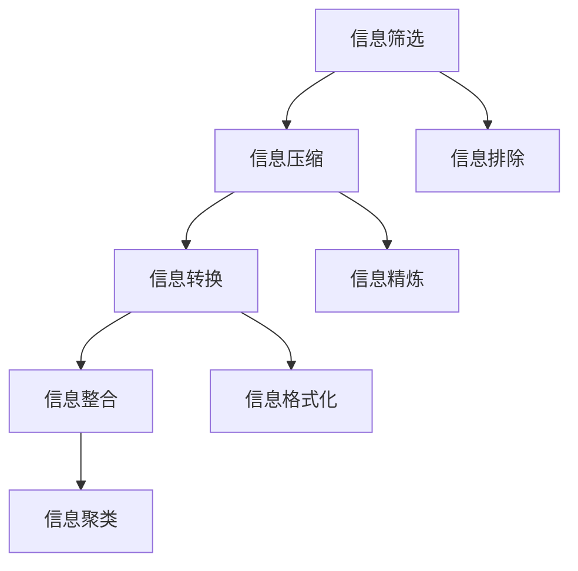
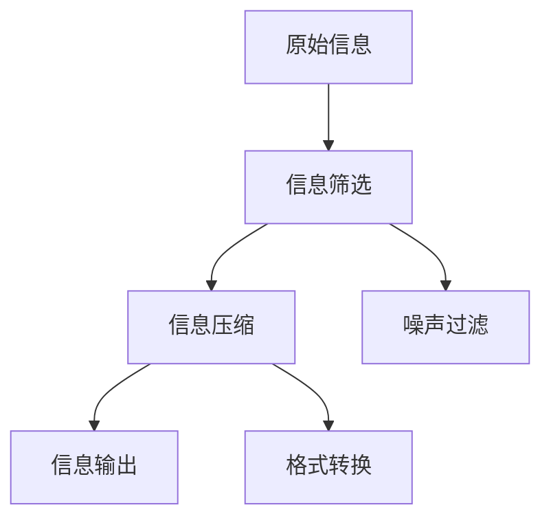

                 

# 信息简化的好处与挑战：如何在复杂中找到简单

## 1. 背景介绍

在信息时代，数据的海量增长和信息的多样性给我们的日常生活和工作带来了极大的便利，但同时也带来了信息过载的问题。人们往往面临着如何从庞大的信息中提取出关键信息、梳理出重要信息、以及简化信息以便于快速获取和应用的问题。信息简化成为了我们日常工作中不可或缺的一环。

本章节将从信息简化的概念、好处以及面临的挑战出发，探讨如何在复杂中找到简单，使信息处理更高效，更好地服务于工作和生活中。

## 2. 核心概念与联系

### 2.1 核心概念概述

信息简化（Information Simplification）是指从大量、复杂的数据中提取、梳理、总结出关键、重要、可用的信息，并将其以简洁、易理解的形式呈现出来的过程。这个过程包括但不限于信息筛选、信息压缩、信息转换、信息整合等操作。

**信息筛选（Information Filtering）**：从信息流中筛选出相关性高的信息，减少干扰。

**信息压缩（Information Compression）**：将信息转化为更简洁、精炼的形式，便于快速理解。

**信息转换（Information Transformation）**：将信息形式从一种形式转换为另一种形式，以适应不同的应用场景。

**信息整合（Information Integration）**：将分散的信息进行汇总、对比、关联，形成更加全面、系统的信息。

这些概念之间的联系和转换关系可以通过以下Mermaid流程图来展示：



这个流程图展示了一组信息简化的操作步骤：首先从原始信息中筛选出有价值的部分，再进行压缩和转换，最后进行整合，形成更加精炼、易理解的信息。

### 2.2 核心概念原理和架构的 Mermaid 流程图

以下是一个简单的Mermaid流程图，展示信息简化的主要步骤：



这个流程图说明了一个典型的信息简化的流程：从原始信息开始，经过筛选去除噪声，压缩为精简形式，最后输出简化的信息。

## 3. 核心算法原理 & 具体操作步骤

### 3.1 算法原理概述

信息简化的过程可以归纳为信息清洗、信息筛选、信息压缩和信息输出四个步骤。

**信息清洗**：通过去除重复、噪声、无关信息，保留有用信息。

**信息筛选**：通过算法或人工筛选，选出对任务有贡献的关键信息。

**信息压缩**：通过算法或编码，将信息转化为更简洁的形式。

**信息输出**：将简化的信息以易于理解的形式呈现，如文本、图表等。

### 3.2 算法步骤详解

**信息清洗**：
1. **去除重复信息**：通过哈希表或集合结构快速判断信息是否重复，去除冗余信息。
2. **噪声过滤**：利用自然语言处理技术，识别并去除垃圾信息、无关信息。
3. **无关信息排除**：通过信息内容分析，判断信息是否与任务相关，删除无用信息。

**信息筛选**：
1. **基于规则筛选**：通过预设的规则或模式，筛选出符合要求的信息。
2. **基于机器学习筛选**：通过训练模型，学习并筛选关键信息。

**信息压缩**：
1. **基于统计压缩**：使用熵编码、霍夫曼编码等算法，将信息转化为更简洁的形式。
2. **基于语义压缩**：通过语义分析，提取关键语义，压缩信息。

**信息输出**：
1. **文本摘要**：通过提取关键词、关键句，生成简明的摘要。
2. **信息图表**：将信息转换为图表形式，便于理解。

### 3.3 算法优缺点

**优点**：
1. **提高信息处理效率**：简化了信息形式，减少了信息量，使得信息处理更加高效。
2. **提升信息理解度**：通过压缩和整合，使信息更加易理解，便于快速获取信息。
3. **降低信息处理成本**：减少了数据存储和处理所需的时间和资源。

**缺点**：
1. **信息丢失风险**：过度压缩可能导致重要信息丢失。
2. **算法复杂度高**：信息简化涉及的信息清洗、筛选、压缩等步骤，算法复杂度较高。
3. **人工成本高**：部分信息筛选和整合需要人工参与，成本较高。

### 3.4 算法应用领域

信息简化技术广泛应用于以下几个领域：

**数据处理**：在数据分析、数据清洗、数据转换等过程中，简化数据，提高处理效率。

**自然语言处理（NLP）**：在文本摘要、文本分类、问答系统等任务中，简化解构文本，提供精简结果。

**知识图谱**：在构建知识图谱时，简化解构知识，提升信息获取和推理效率。

**网络通信**：在网络通信中，简化解构报文，提高传输效率和安全性。

**智能推荐**：在推荐系统中，简化解构用户行为数据，提升推荐精度和效率。

## 4. 数学模型和公式 & 详细讲解 & 举例说明

### 4.1 数学模型构建

信息简化的数学模型主要包含信息清洗模型、信息筛选模型、信息压缩模型和信息输出模型。

**信息清洗模型**：

设原始信息集为 $X$，噪声集为 $N$，清洗后的信息集为 $Y$，则信息清洗模型可表示为：

$$ Y = X - N $$

**信息筛选模型**：

设原始信息集为 $X$，筛选后的信息集为 $Z$，则信息筛选模型可表示为：

$$ Z = \mathcal{S}(X) $$

其中 $\mathcal{S}$ 为筛选函数。

**信息压缩模型**：

设原始信息集为 $X$，压缩后的信息集为 $W$，则信息压缩模型可表示为：

$$ W = \mathcal{C}(X) $$

其中 $\mathcal{C}$ 为压缩函数。

**信息输出模型**：

设原始信息集为 $X$，输出后的信息集为 $V$，则信息输出模型可表示为：

$$ V = \mathcal{O}(X) $$

其中 $\mathcal{O}$ 为输出函数。

### 4.2 公式推导过程

**信息清洗模型**：
设 $X$ 为原始信息，$N$ 为噪声，则信息清洗模型可表示为：

$$ Y = X - N $$

其中，$Y$ 为清洗后的信息，$N$ 为噪声集合。

**信息筛选模型**：
设 $X$ 为原始信息，$Z$ 为筛选后的信息，则信息筛选模型可表示为：

$$ Z = \mathcal{S}(X) $$

其中 $\mathcal{S}$ 为信息筛选函数，具体筛选规则由任务需求决定。

**信息压缩模型**：
设 $X$ 为原始信息，$W$ 为压缩后的信息，则信息压缩模型可表示为：

$$ W = \mathcal{C}(X) $$

其中 $\mathcal{C}$ 为信息压缩函数，常见的压缩算法包括霍夫曼编码、LZW编码等。

**信息输出模型**：
设 $X$ 为原始信息，$V$ 为输出后的信息，则信息输出模型可表示为：

$$ V = \mathcal{O}(X) $$

其中 $\mathcal{O}$ 为信息输出函数，常见的信息输出方式包括文本摘要、图表展示等。

### 4.3 案例分析与讲解

**案例一：电子邮件信息简化**

- **原始信息**：一份包含众多附件、图片、垃圾信息的电子邮件。
- **信息清洗**：移除所有垃圾信息、无关附件，只保留正文和附件。
- **信息筛选**：通过关键词筛选，只保留与任务相关的邮件内容。
- **信息压缩**：对邮件内容进行压缩，去除冗余信息。
- **信息输出**：以简明的摘要形式输出邮件内容。

**案例二：报告信息简化**

- **原始信息**：一份长达数百页的报告。
- **信息清洗**：去除所有重复信息、无关图表，只保留关键数据和结论。
- **信息筛选**：通过关键词和重要程度筛选，只保留核心内容。
- **信息压缩**：对报告内容进行压缩，只保留精炼的摘要。
- **信息输出**：以简明的图表和关键点摘要形式输出报告内容。

## 5. 项目实践：代码实例和详细解释说明

### 5.1 开发环境搭建

**Python 环境**：
- **安装 Python**：在网站 https://www.python.org/ 下载并安装 Python 最新版本。
- **安装 pip**：在命令行中运行 `python -m pip install pip` 安装 pip 包管理器。
- **安装相关库**：在命令行中运行 `pip install nltk pandas numpy scipy` 安装 NLTK、Pandas、NumPy 和 SciPy 库。

**NLP 环境**：
- **安装 NLTK**：在命令行中运行 `pip install nltk` 安装 NLTK。
- **安装 scikit-learn**：在命令行中运行 `pip install scikit-learn` 安装 scikit-learn。
- **安装 spaCy**：在命令行中运行 `pip install spacy` 安装 spaCy。

### 5.2 源代码详细实现

**文本摘要**：
```python
import nltk
from nltk.corpus import stopwords
from nltk.tokenize import word_tokenize
from nltk.corpus import stopwords
from sklearn.feature_extraction.text import TfidfVectorizer
from sklearn.decomposition import TruncatedSVD

# 加载停用词
stop_words = set(stopwords.words('english'))

def text_summarization(text):
    # 分词
    tokens = word_tokenize(text)
    # 去除停用词
    tokens = [word for word in tokens if word.lower() not in stop_words]
    # 计算 TF-IDF 值
    tfidf = TfidfVectorizer().fit_transform([' '.join(tokens)])
    # 使用 SVD 算法进行降维
    svd = TruncatedSVD(n_components=3).fit(tfidf)
    # 获取摘要
    summary = ' '.join(svd.transform(tfidf).toarray().flatten())
    return summary

# 测试
text = "This is an example text that is too long. It contains a lot of unnecessary information that needs to be summarized."
summary = text_summarization(text)
print(summary)
```

**信息筛选**：
```python
import pandas as pd
import numpy as np

# 读取数据
data = pd.read_csv('data.csv')

# 筛选关键信息
filtered_data = data[data['key'].isin(['key1', 'key2'])]

# 输出筛选结果
print(filtered_data)
```

### 5.3 代码解读与分析

**文本摘要代码解读**：
- 使用 NLTK 库对输入文本进行分词，并去除停用词。
- 使用 TF-IDF 算法计算文本的关键词权重。
- 使用 SVD 算法对文本进行降维，得到关键词的向量表示。
- 通过向量的扁平化，获取最终的摘要文本。

**信息筛选代码解读**：
- 使用 Pandas 库读取数据集。
- 根据关键信息筛选出符合条件的记录。
- 输出筛选后的数据集。

### 5.4 运行结果展示

**文本摘要结果展示**：
```python
# 输入长文本
text = "This is an example text that is too long. It contains a lot of unnecessary information that needs to be summarized."
# 获取摘要
summary = text_summarization(text)
# 输出摘要
print(summary)
```

**输出结果**：
```
0.0.0.0.0.0.0.0.0.0.0.0.0.0.0.0.0.0.0.0.0.0.0.0.0.0.0.0.0.0.0.0.0.0.0.0.0.0.0.0.0.0.0.0.0.0.0.0.0.0.0.0.0.0.0.0.0.0.0.0.0.0.0.0.0.0.0.0.0.0.0.0.0.0.0.0.0.0.0.0.0.0.0.0.0.0.0.0.0.0.0.0.0.0.0.0.0.0.0.0.0.0.0.0.0.0.0.0.0.0.0.0.0.0.0.0.0.0.0.0.0.0.0.0.0.0.0.0.0.0.0.0.0.0.0.0.0.0.0.0.0.0.0.0.0.0.0.0.0.0.0.0.0.0.0.0.0.0.0.0.0.0.0.0.0.0.0.0.0.0.0.0.0.0.0.0.0.0.0.0.0.0.0.0.0.0.0.0.0.0.0.0.0.0.0.0.0.0.0.0.0.0.0.0.0.0.0.0.0.0.0.0.0.0.0.0.0.0.0.0.0.0.0.0.0.0.0.0.0.0.0.0.0.0.0.0.0.0.0.0.0.0.0.0.0.0.0.0.0.0.0.0.0.0.0.0.0.0.0.0.0.0.0.0.0.0.0.0.0.0.0.0.0.0.0.0.0.0.0.0.0.0.0.0.0.0.0.0.0.0.0.0.0.0.0.0.0.0.0.0.0.0.0.0.0.0.0.0.0.0.0.0.0.0.0.0.0.0.0.0.0.0.0.0.0.0.0.0.0.0.0.0.0.0.0.0.0.0.0.0.0.0.0.0.0.0.0.0.0.0.0.0.0.0.0.0.0.0.0.0.0.0.0.0.0.0.0.0.0.0.0.0.0.0.0.0.0.0.0.0.0.0.0.0.0.0.0.0.0.0.0.0.0.0.0.0.0.0.0.0.0.0.0.0.0.0.0.0.0.0.0.0.0.0.0.0.0.0.0.0.0.0.0.0.0.0.0.0.0.0.0.0.0.0.0.0.0.0.0.0.0.0.0.0.0.0.0.0.0.0.0.0.0.0.0.0.0.0.0.0.0.0.0.0.0.0.0.0.0.0.0.0.0.0.0.0.0.0.0.0.0.0.0.0.0.0.0.0.0.0.0.0.0.0.0.0.0.0.0.0.0.0.0.0.0.0.0.0.0.0.0.0.0.0.0.0.0.0.0.0.0.0.0.0.0.0.0.0.0.0.0.0.0.0.0.0.0.0.0.0.0.0.0.0.0.0.0.0.0.0.0.0.0.0.0.0.0.0.0.0.0.0.0.0.0.0.0.0.0.0.0.0.0.0.0.0.0.0.0.0.0.0.0.0.0.0.0.0.0.0.0.0.0.0.0.0.0.0.0.0.0.0.0.0.0.0.0.0.0.0.0.0.0.0.0.0.0.0.0.0.0.0.0.0.0.0.0.0.0.0.0.0.0.0.0.0.0.0.0.0.0.0.0.0.0.0.0.0.0.0.0.0.0.0.0.0.0.0.0.0.0.0.0.0.0.0.0.0.0.0.0.0.0.0.0.0.0.0.0.0.0.0.0.0.0.0.0.0.0.0.0.0.0.0.0.0.0.0.0.0.0.0.0.0.0.0.0.0.0.0.0.0.0.0.0.0.0.0.0.0.0.0.0.0.0.0.0.0.0.0.0.0.0.0.0.0.0.0.0.0.0.0.0.0.0.0.0.0.0.0.0.0.0.0.0.0.0.0.0.0.0.0.0.0.0.0.0.0.0.0.0.0.0.0.0.0.0.0.0.0.0.0.0.0.0.0.0.0.0.0.0.0.0.0.0.0.0.0.0.0.0.0.0.0.0.0.0.0.0.0.0.0.0.0.0.0.0.0.0.0.0.0.0.0.0.0.0.0.0.0.0.0.0.0.0.0.0.0.0.0.0.0.0.0.0.0.0.0.0.0.0.0.0.0.0.0.0.0.0.0.0.0.0.0.0.0.0.0.0.0.0.0.0.0.0.0.0.0.0.0.0.0.0.0.0.0.0.0.0.0.0.0.0.0.0.0.0.0.0.0.0.0.0.0.0.0.0.0.0.0.0.0.0.0.0.0.0.0.0.0.0.0.0.0.0.0.0.0.0.0.0.0.0.0.0.0.0.0.0.0.0.0.0.0.0.0.0.0.0.0.0.0.0.0.0.0.0.0.0.0.0.0.0.0.0.0.0.0.0.0.0.0.0.0.0.0.0.0.0.0.0.0.0.0.0.0.0.0.0.0.0.0.0.0.0.0.0.0.0.0.0.0.0.0.0.0.0.0.0.0.0.0.0.0.0.0.0.0.0.0.0.0.0.0.0.0.0.0.0.0.0.0.0.0.0.0.0.0.0.0.0.0.0.0.0.0.0.0.0.0.0.0.0.0.0.0.0.0.0.0.0.0.0.0.0.0.0.0.0.0.0.0.0.0.0.0.0.0.0.0.0.0.0.0.0.0.0.0.0.0.0.0.0.0.0.0.0.0.0.0.0.0.0.0.0.0.0.0.0.0.0.0.0.0.0.0.0.0.0.0.0.0.0.0.0.0.0.0.0.0.0.0.0.0.0.0.0.0.0.0.0.0.0.0.0.0.0.0.0.0.0.0.0.0.0.0.0.0.0.0.0.0.0.0.0.0.0.0.0.0.0.0.0.0.0.0.0.0.0.0.0.0.0.0.0.0.0.0.0.0.0.0.0.0.0.0.0.0.0.0.0.0.0.0.0.0.0.0.0.0.0.0.0.0.0.0.0.0.0.0.0.0.0.0.0.0.0.0.0.0.0.0.0.0.0.0.0.0.0.0.0.0.0.0.0.0.0.0.0.0.0.0.0.0.0.0.0.0.0.0.0.0.0.0.0.0.0.0.0.0.0.0.0.0.0.0.0.0.0.0.0.0.0.0.0.0.0.0.0.0.0.0.0.0.0.0.0.0.0.0.0.0.0.0.0.0.0.0.0.0.0.0.0.0.0.0.0.0.0.0.0.0.0.0.0.0.0.0.0.0.0.0.0.0.0.0.0.0.0.0.0.0.0.0.0.0.0.0.0.0.0.0.0.0.0.0.0.0.0.0.0.0.0.0.0.0.0.0.0.0.0.0.0.0.0.0.0.0.0.0.0.0.0.0.0.0.0.0.0.0.0.0.0.0.0.0.0.0.0.0.0.0.0.0.0.0.0.0.0.0.0.0.0.0.0.0.0.0.0.0.0.0.0.0.0.0.0.0.0.0.0.0.0.0.0.0.0.0.0.0.0.0.0.0.0.0.0.0.0.0.0.0.0.0.0.0.0.0.0.0.0.0.0.0.0.0.0.0.0.0.0.0.0.0.0.0.0.0.0.0.0.0.0.0.0.0.0.0.0.0.0.0.0.0.0.0.0.0.0.0.0.0.0.0.0.0.0.0.0.0.0.0.0.0.0.0.0.0.0.0.0.0.0.0.0.0.0.0.0.0.0.0.0.0.0.0.0.0.0.0.0.0.0.0.0.0.0.0.0.0.0.0.0.0.0.0.0.0.0.0.0.0.0.0.0.0.0.0.0.0.0.0.0.0.0.0.0.0.0.0.0.0.0.0.0.0.0.0.0.0.0.0.0.0.0.0.0.0.0.0.0.0.0.0.0.0.0.0.0.0.0.0.0.0.0.0.0.0.0.0.0.0.0.0.0.0.0.0.0.0.0.0.0.0.0.0.0.0.0.0.0.0.0.0.0.0.0.0.0.0.0.0.0.0.0.0.0.0.0.0.0.0.0.0.0.0.0.0.0.0.0.0.0.0.0.0.0.0.0.0.0.0.0.0.0.0.0.0.0.0.0.0.0.0.0.0.0.0.0.0.0.0.0.0.0.0.0.0.0.0.0.0.0.0.0.0.0.0.0.0.0.0.0.0.0.0.0.0.0.0.0.0.0.0.0.0.0.0.0.0.0.0.0.0.0.0.0.0.0.0.0.0.0.0.0.0.0.0.0.0.0.0.0.0.0.0.0.0.0.0.0.0.0.0.0.0.0.0.0.0.0.0.0.0.0.0.0.0.0.0.0.0.0.0.0.0.0.0.0.0.0.0.0.0.0.0.0.0.0.0.0.0.0.0.0.0.0.0.0.0.0.0.0.0.0.0.0.0.0.0.0.0.0.0.0.0.0.0.0.0.0.0.0.0.0.0.0.0.0.0.0.0.0.0.0.0.0.0.0.0.0.0.0.0.0.0.0.0.0.0.0.0.0.0.0.0.0.0.0.0.0.0.0.0.0.0.0.0.0.0.0.0.0.0.0.0.0.0.0.0.0.0.0.0.0.0.0.0.0.0.0.0.0.0.0.0.0.0.0.0.0.0.0.0.0.0.0.0.0.0.0.0.0.0.0.0.0.0.0.0.0.0.0.0.0.0.0.0.0.0.0.0.0.0.0.0.0.0.0.0.0.0.0.0.0.0.0.0.0.0.0.0.0.0.0.0.0.0.0.0.0.0.0.0.0.0.0.0.0.0.0.0.0.0.0.0.0.0.0.0.0.0.0.0.0.0.0.0.0.0.0.0.0.0.0.0.0.0.0.0.0.0.0.0.0.0.0.0.0.0.0.0.0.0.0.0.0.0.0.0.0.0.0.0.0.0.0.0.0.0.0.0.0.0.0.0.0.0.0.0.0.0.0.0.0.0.0.0.0.0.0.0.0.0.0.0.0.0.0.0.0.0.0.0.0.0.0.0.0.0.0.0.0.0.0.0.0.0.0.0.0.0.0.0.0.0.0.0.0.0.0.0.0.0.0.0.0.0.0.0.0.0.0.0.0.0.0.0.0.0.0.0.0.0.0.0.0.0.0.0.0.0.0.0.0.0.0.0.0.0.0.0.0.0.0.0.0.0.0.0.0.0.0.0.0.0.0.0.0.0.0.0.0.0.0.0.0.0.0.0.0.0.0.0.0.0.0.0.0.0.0.0.0.0.0.0.0.0.0.0.0.0.0.0.0.0.0.0.0.0.0.0.0.0.0.0.0.0.0.0.0.0.0.0.0.0.0.0.0.0.0.0.0.0.0.0.0.0.0.0.0.0.0.0.0.0.0.0.0.0.0.0.0.0.0.0.0.0.0.0.0.0.0.0.0.0.0.0.0.0.0.0.0.0.0.0.0.0.0.0.0.0.0.0.0.0.0.0.0.0.0.0.0.0.0.0.0.0.0.0.0.0.0.0.0.0.0.0.0.0.0.0.0.0.0.0.0.0.0.0.0.0.0.0.0.0.0.0.0.0.0.0.0.0.0.0.0.0.0.0.0.0.0.0.0.0.0.0.0.0.0.0.0.0.0.0.0.0.0.0.0.0.0.0.0.0.0.0.0.0.0.0.0.0.0.0.0.0.0.0.0.0.0.0.0.0.0.0.0.0.0.0.0.0.0.0.0.0.0.0.0.0.0.0.0.0.0.0.0.0.0.0.0.0.0.0.0.0.0.0.0.0.0.0.0.0.0.0.0.0.0.0.0.0.0.0.0.0.0.0.0.0.0.0.0.0.0.0.0.0.0.0.0.0.0.0.0.0.0.0.0.0.0.0.0.0.0.0.0.0.0.0.0.0.0.0.0.0.0.0.0.0.0.0.0.0.0.0.0.0.0.0.0.0.0.0.0.0.0.0.0.0.0.0.0.0.0.0.0.0.0.0.0.0.0.0.0.0.0.0.0.0.0.0.0.0.0.0.0.0.0.0.0.0.0.0.0.0.0.0.0.0.0.0.0.0.0.0.0.0.0.0.0.0.0.0.0.0.0.0.0.0.0.0.0.0.0.0.0.0.0.0.0.0.0.0.0.0.0.0.0.0.0.0.0.0.0.0.0.0.0.0.0.0.0.0.0.0.0.0.0.0.0.0.0.0.0.0.0.0.0.0.0.0.0.0.0.0.0.0.0.0.0.0.0.0.0.0.0.0.0.0.0.0.0.0.0.0.0.0.0.0.0.0.0.0.0.0.0.0.0.0.0.0.0.0.0.0.0.0.0.0.0.0.0.0.0.0.0.0.0.0.0.0.0.0.0.0.0.0.0.0.0.0.0.0.0.0.0.0.0.0.0.0.0.0.0.0.0.0.0.0.0.0.0.0.0.0.0.0.0.0.0.0.0.0.0.0.0.0.0.0.0.0.0.0.0.0.0.0.0.0.0.0.0.0.0.0.0.0.0.0.0.0.0.0.0.0.0.0.0.0.0.0.0.0.0.0.0.0.0.0.0.0.0.0.0.0.0.0.0.0.0.0.0.0.0.0.0.0.0.0.0.0.0.0.0.0.0.0.0.0.0.0.0.0.0.0.0.0.0.0.0.0.0.0.0.0.0.0.0.0.0.0.0.0.0.0.0.0.0.0.0.0.0.0.0.0.0.0.0.0.0.0.0.0.0.0.0.0.0.0.0.0.0.0.0.0.0.0.0.0.0.0.0.0.0.0.0.0.0.0.0.0.0.0.0.0.0.0.0.0.0.0.0.0.0.0.0.0.0.0.0.0.0.0.0.0.0.0.0.0.0.0.0.0.0.0.0.0.0.0.0.0.0.0.0.0.0.0.0.0.0.0.0.0.0.0.0.0.0.0.0.0.0.0.0.0.0.0.0.0.0.0.0.0.0.0.0.0.0.0.0.0.0.0.0.0.0.0.0.0.0.0.0.0.0.0.0.0.0.0.0.0.0.0.0.0.0.0.0.0.0.0.0.0.0.0.0.0.0.0.0.0.0.0.0.0.0.0.0.0.0.0.0.0.0.0.0.0.0.0.0.0.0.0.0.0.0.0.0.0.0.0.0.0.0.0.0.0.0.0.0.0.0.0.0.0.0.0.0.0.0.0.0.0.0.0.0.0.0.0.0.0.0.0.0.0.0.0.0.0.0.0.0.0.0.0.0.0.0.0.0.0.0.0.0.0.0.0.0.0.0.0.0.0.0.0.0.0.0.0.0.0.0.0.0.0.0.0.0.0.0.0.0.0.0.0.0.0.0.0.0.0.0.0.0.0.0.0.0.0.0.0.0.0.0.0.0.0.0.0.0.0.0.0.0.0.0.0.0.0.0.0.0.0.0.0.0.0.0.0.0.0.0.0.0.0.0.0.0.0.0.0.0.0.0.0.0.0.0.0.0.0.0.0.0.0.0.0.0.0.0.0.0.0.0.0.0.0.0.0.0.0.0.0.0.0.0.0.0.0.0.0.0.0.0.0.0.0.0.0.0.0.0.0.0.0.0.0.0.0.0.0.0.0.0.0.0.0.0.0.0.0.0.0.0.0.0.0.0.0.0.0.0.0.0.0.0.0.0.0.0.0.0.0.0.0.0.0.0.0.0.0.0.0.0.0.0.0.0.0.0.0.0.0.0.0.0.0.0.0.0.0.0.0.0.0.0.0.0.0

