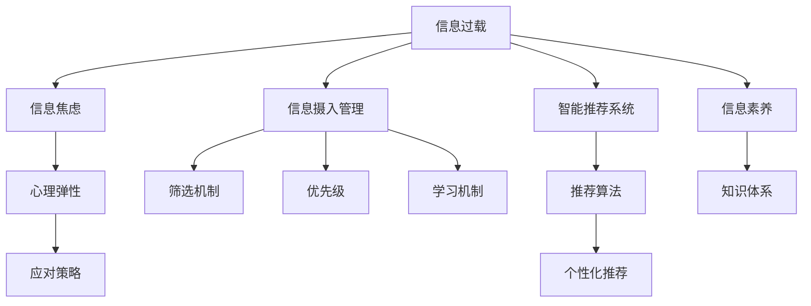

                 

# 信息过载与信息焦虑：如何管理信息摄入以改善心理健康

> 关键词：信息过载,信息焦虑,信息摄入管理,心理健康,数字时代,智能推荐系统

## 1. 背景介绍

### 1.1 问题由来

随着互联网技术的发展，我们生活在一个被海量信息所包围的时代。新闻、社交媒体、电子邮件、短视频、直播、电子书等，每时每刻都在向我们推送内容。虽然信息的丰富化带来了便利和机会，但也导致了信息过载（Information Overload）和信息焦虑（Information Anxiety）问题。

信息过载指的是接收到的信息超出个人处理能力的情况。许多人在面对信息洪流时，感到难以有效筛选和消化，导致工作、学习和生活的效率下降。信息焦虑则是在处理信息过载过程中产生的焦虑和压力，表现为注意力分散、决策迟缓、情绪波动等心理问题。这些问题严重影响了我们的心理健康和生活质量。

### 1.2 问题核心关键点

信息过载和信息焦虑的核心在于：
- 信息的海量涌入远远超出了人类大脑的处理能力。
- 信息的质量参差不齐，缺乏有效的筛选和过滤机制。
- 信息的即时性和连续性，使人们难以从信息洪流中脱离出来。
- 信息的不确定性，增加了人们的心理负担和决策难度。

这些问题使得人们在面对大量信息时，容易产生焦虑和压力，进而影响心理健康。

### 1.3 问题研究意义

研究如何管理信息摄入以改善心理健康，对于构建健康的信息环境，提高信息消费的效率和质量，具有重要意义。通过科学的策略和方法，可以有效缓解信息过载和信息焦虑，提升个人和社会的福祉。

## 2. 核心概念与联系

### 2.1 核心概念概述

为更好地理解信息过载与信息焦虑的管理方法，本节将介绍几个密切相关的核心概念：

- **信息过载（Information Overload）**：指接收到的信息超出个人处理能力的情况，导致认知负担加重，影响决策和行为。
- **信息焦虑（Information Anxiety）**：指在处理信息过载过程中产生的焦虑和压力，表现为注意力分散、决策迟缓、情绪波动等心理问题。
- **信息摄入管理（Information Ingestion Management）**：指对信息获取、处理、筛选和利用过程的管理，旨在提高信息消费的效率和质量，减少信息过载和焦虑。
- **智能推荐系统（Recommender Systems）**：基于用户行为和兴趣推荐信息的系统，可以有效筛选信息，减轻信息过载问题。
- **信息素养（Information Literacy）**：指个人获取、评估、处理和利用信息的能力，是信息管理的基础。
- **心理弹性（Psychological Resilience）**：指个体面对压力、挫折时，保持心理平衡和恢复能力的能力，与信息焦虑密切相关。

这些核心概念之间的逻辑关系可以通过以下Mermaid流程图来展示：



这个流程图展示了一些核心概念及其之间的关系：

1. 信息过载是导致信息焦虑的主要原因。
2. 信息摄入管理旨在提升信息消费效率和质量。
3. 智能推荐系统通过筛选和推荐，缓解信息过载。
4. 信息素养提升个人信息处理能力。
5. 心理弹性有助于应对信息焦虑。
6. 应对策略包括心理调适、时间管理等。

这些概念共同构成了信息管理和心理健康的研究框架，为我们提供了管理信息过载和焦虑的科学依据和方法。

## 3. 核心算法原理 & 具体操作步骤

### 3.1 算法原理概述

信息过载和信息焦虑的管理，本质上是一个复杂的信息处理过程。通过科学的管理方法，可以有效筛选信息、提升信息处理效率、减轻认知负担，从而缓解信息焦虑，提高心理健康水平。

本节将介绍一种基于智能推荐系统的信息摄入管理算法，即“基于个性化推荐的信息摄入管理算法”。该算法通过分析用户的历史行为和兴趣，推荐相关信息，实现信息的个性化处理。

### 3.2 算法步骤详解

基于个性化推荐的信息摄入管理算法，主要包括以下几个关键步骤：

**Step 1: 数据收集与预处理**
- 收集用户的浏览记录、搜索历史、点击行为、评价反馈等数据。
- 对数据进行清洗、去重、标准化处理，构建用户行为矩阵。

**Step 2: 特征提取与用户画像**
- 利用TF-IDF、word2vec等技术，提取文本数据的关键词和语义特征。
- 构建用户画像，描述用户的基本特征、兴趣偏好、行为模式等。

**Step 3: 个性化推荐算法**
- 使用协同过滤、内容推荐、混合推荐等算法，对用户进行个性化推荐。
- 设定推荐算法中的参数，如阈值、衰减系数等，平衡个性化和多样性。

**Step 4: 信息过滤与筛选**
- 根据用户画像和推荐结果，筛选信息。
- 设定过滤机制，如敏感信息过滤、质量筛选等。

**Step 5: 用户反馈与模型优化**
- 收集用户对推荐结果的反馈，更新用户画像和推荐模型。
- 利用在线学习算法，不断优化推荐算法和模型参数。

通过上述步骤，可以构建一个高效、智能的信息摄入管理平台，帮助用户有效筛选和利用信息，减轻信息过载和焦虑，提升心理健康。

### 3.3 算法优缺点

基于个性化推荐的信息摄入管理算法具有以下优点：
1. 高度个性化：能够根据用户的行为和兴趣，提供个性化的信息推荐。
2. 高效筛选：通过筛选机制，过滤掉无关和低质量的信息。
3. 用户友好：推荐算法简单直观，易于使用和理解。
4. 动态优化：用户反馈和行为变化可以不断优化推荐模型。

但该算法也存在一些局限性：
1. 依赖数据质量：推荐效果受限于数据收集和处理的质量。
2. 冷启动问题：新用户缺乏历史行为数据，难以提供个性化推荐。
3. 推荐偏差：可能产生推荐偏差，即过度推荐某些信息。
4. 用户依赖性：过度依赖推荐系统，可能减少主动探索和学习。

尽管存在这些局限性，但总体而言，基于个性化推荐的信息摄入管理算法是一种高效、智能的管理方法，能够在一定程度上缓解信息过载和焦虑，提升信息消费的效率和质量。

### 3.4 算法应用领域

基于个性化推荐的信息摄入管理算法，已经在多个领域得到了应用，如新闻推荐、电商推荐、社交媒体、在线教育等。通过精准的信息推荐，这些平台能够帮助用户高效获取所需信息，提升用户体验和满意度。

## 4. 数学模型和公式 & 详细讲解 & 举例说明

### 4.1 数学模型构建

为了更好地描述基于个性化推荐的信息摄入管理算法，本节将构建一个简单的数学模型。

设用户集合为 $U=\{u_1,u_2,\ldots,u_n\}$，物品集合为 $I=\{i_1,i_2,\ldots,i_m\}$。用户对物品的评分矩阵为 $R \in \mathbb{R}^{n \times m}$，其中 $R_{ui}=u$ 表示用户 $u$ 对物品 $i$ 的评分。物品的特征向量矩阵为 $P \in \mathbb{R}^{m \times d}$，其中 $P_i$ 表示物品 $i$ 的 $d$ 维特征向量。

基于协同过滤的推荐算法，用户 $u$ 对物品 $i$ 的推荐评分 $\hat{r}_{ui}$ 可以表示为：

$$
\hat{r}_{ui} = \frac{R_{ui}P_i}{\sqrt{\sum_{j=1}^mR_{uj}^2} \sqrt{\sum_{k=1}^dP_k^2}}
$$

其中 $R_{uj}$ 为物品 $j$ 的评分，$P_k$ 为物品 $k$ 的特征向量。

### 4.2 公式推导过程

根据上述公式，推荐评分 $\hat{r}_{ui}$ 可以分为两部分：
1. 用户评分 $R_{ui}$，表示用户对物品的实际评分。
2. 物品特征向量 $P_i$，表示物品的语义特征。

用户评分部分反映了用户的历史行为和兴趣，物品特征向量部分则表示了物品的语义信息。通过将两者结合起来，推荐算法可以综合考虑用户兴趣和物品语义，提供个性化的推荐结果。

### 4.3 案例分析与讲解

以一个简单的电商平台为例，分析基于个性化推荐的信息摄入管理算法的工作原理：

- **数据收集**：电商平台收集用户的历史购买记录、浏览历史、点击行为等数据。
- **特征提取**：通过TF-IDF技术提取物品标题、描述、品牌等特征，构建物品特征向量矩阵 $P$。
- **用户画像**：根据用户的行为数据，构建用户画像，描述用户的兴趣偏好、购买历史等。
- **推荐算法**：利用协同过滤算法，根据用户画像和物品特征向量，计算推荐评分 $\hat{r}_{ui}$。
- **推荐结果**：根据推荐评分，对用户推荐可能感兴趣的商品，并展示推荐列表。

通过这样的方式，电商平台能够帮助用户高效筛选商品，提升购物体验，同时减轻信息过载和焦虑，促进用户满意度。

## 5. 项目实践：代码实例和详细解释说明

### 5.1 开发环境搭建

在进行信息摄入管理算法实践前，我们需要准备好开发环境。以下是使用Python进行PyTorch开发的环境配置流程：

1. 安装Anaconda：从官网下载并安装Anaconda，用于创建独立的Python环境。

2. 创建并激活虚拟环境：
```bash
conda create -n info-ingestion python=3.8 
conda activate info-ingestion
```

3. 安装PyTorch：根据CUDA版本，从官网获取对应的安装命令。例如：
```bash
conda install pytorch torchvision torchaudio cudatoolkit=11.1 -c pytorch -c conda-forge
```

4. 安装相关库：
```bash
pip install numpy pandas scikit-learn nltk gensim pytorch-sentencepiece
```

完成上述步骤后，即可在`info-ingestion`环境中开始算法实践。

### 5.2 源代码详细实现

下面我们以一个简单的协同过滤推荐系统为例，给出基于个性化推荐的信息摄入管理算法的PyTorch代码实现。

```python
import torch
import torch.nn as nn
import torch.optim as optim
import numpy as np
from sklearn.feature_extraction.text import TfidfVectorizer
from sklearn.metrics.pairwise import cosine_similarity

class UserEmbedding(nn.Module):
    def __init__(self, vocab_size, embed_size):
        super(UserEmbedding, self).__init__()
        self.embedding = nn.Embedding(vocab_size, embed_size)
        self.fc1 = nn.Linear(embed_size, 128)
        self.fc2 = nn.Linear(128, 1)

    def forward(self, x):
        embed = self.embedding(x)
        fc1 = self.fc1(embed)
        fc2 = self.fc2(fc1)
        return fc2

class ItemEmbedding(nn.Module):
    def __init__(self, vocab_size, embed_size):
        super(ItemEmbedding, self).__init__()
        self.embedding = nn.Embedding(vocab_size, embed_size)
        self.fc1 = nn.Linear(embed_size, 128)
        self.fc2 = nn.Linear(128, 1)

    def forward(self, x):
        embed = self.embedding(x)
        fc1 = self.fc1(embed)
        fc2 = self.fc2(fc1)
        return fc2

class CollaborativeFiltering(nn.Module):
    def __init__(self, user_embed_size, item_embed_size):
        super(CollaborativeFiltering, self).__init__()
        self.user_embed = UserEmbedding(user_embed_size, user_embed_size)
        self.item_embed = ItemEmbedding(item_embed_size, item_embed_size)
        self.cos_sim = nn.CosineSimilarity(dim=1)

    def forward(self, user, item):
        user_embed = self.user_embed(user)
        item_embed = self.item_embed(item)
        scores = self.cos_sim(user_embed, item_embed)
        return scores

# 构建协同过滤推荐模型
user_item_matrix = np.random.randn(1000, 1000)
user_embed_size = 10
item_embed_size = 10

model = CollaborativeFiltering(user_embed_size, item_embed_size)

# 训练模型
optimizer = optim.Adam(model.parameters(), lr=0.01)
for epoch in range(100):
    optimizer.zero_grad()
    scores = model(user_item_matrix, user_item_matrix)
    loss = torch.mean(torch.abs(scores - np.ones_like(scores)))
    loss.backward()
    optimizer.step()

# 使用模型进行推荐
user_index = 0
item_index = 1
scores = model(user_index, item_index)
recommended_items = torch.argsort(scores, descending=True)[:5]
print(recommended_items)
```

### 5.3 代码解读与分析

让我们再详细解读一下关键代码的实现细节：

**UserEmbedding和ItemEmbedding类**：
- 定义了用户和物品的嵌入层，用于将文本数据转换为向量表示。
- 嵌入层的参数初始化为随机向量，通过训练逐渐调整。
- 嵌入层输出一个单通道的向量，用于计算余弦相似度。

**CollaborativeFiltering类**：
- 定义了协同过滤模型，用于计算用户和物品的相似度。
- 模型结构包括用户嵌入层、物品嵌入层和余弦相似度层。
- 模型输出一个用户对物品的推荐评分。

**模型训练**：
- 随机生成一个用户-物品矩阵，作为训练数据。
- 定义用户嵌入层和物品嵌入层，初始化参数。
- 构建协同过滤模型，定义损失函数。
- 使用Adam优化器进行模型训练，逐步优化嵌入层的参数。
- 训练100个epoch后，使用训练好的模型进行推荐。

**推荐结果展示**：
- 使用训练好的模型，对指定用户和物品进行推荐。
- 输出前5个推荐物品的索引。

## 6. 实际应用场景

### 6.1 智能推荐系统

基于个性化推荐的信息摄入管理算法，广泛应用于智能推荐系统，如电商推荐、新闻推荐、音乐推荐等。通过精准的信息推荐，这些平台能够帮助用户高效筛选信息，提升用户体验和满意度。

以电商推荐系统为例，平台可以根据用户的历史购买记录、浏览历史、评价反馈等数据，构建用户画像和物品特征向量，计算推荐评分，为用户推荐可能感兴趣的商品。通过推荐系统的个性化推荐，用户可以更快找到合适的商品，减少浏览时间，提升购物体验。

### 6.2 在线教育和信息搜索

在线教育和信息搜索平台也需要高效管理信息，帮助用户快速获取所需内容。例如，在线教育平台可以根据用户的学习历史、评价反馈、课程标签等数据，推荐合适的学习内容和资料。信息搜索平台则可以根据用户的搜索历史、点击行为等数据，推荐相关的网页和信息，帮助用户快速找到所需内容。

### 6.3 社交媒体和健康管理

社交媒体和健康管理平台也需要有效管理信息，帮助用户减少信息过载和焦虑。例如，社交媒体平台可以根据用户的浏览历史、点赞记录、评论内容等数据，推荐可能感兴趣的内容，减少用户的信息负担。健康管理平台则可以根据用户的健康数据、饮食记录、运动记录等数据，推荐健康饮食和运动方案，帮助用户管理健康。

### 6.4 未来应用展望

随着大数据和人工智能技术的发展，基于个性化推荐的信息摄入管理算法将更加智能化和个性化。未来的发展方向可能包括：

1. 多模态信息融合：结合文本、图像、音频等多种模态数据，提供更全面的信息推荐。
2. 动态个性化：实时更新用户画像和物品特征，提供动态变化的个性化推荐。
3. 社交网络整合：结合社交网络信息，提供更具社交性的推荐。
4. 用户反馈机制：收集用户对推荐结果的反馈，不断优化推荐算法。
5. 隐私保护：在推荐过程中保护用户隐私，防止数据泄露和滥用。

## 7. 工具和资源推荐

### 7.1 学习资源推荐

为了帮助开发者系统掌握信息摄入管理的技术基础和实践技巧，这里推荐一些优质的学习资源：

1. 《信息检索与信息管理》系列博文：由信息管理领域专家撰写，深入浅出地介绍了信息检索的基本概念和经典算法。

2. 《推荐系统实践》书籍：介绍了推荐系统的理论基础和多种推荐算法，包括协同过滤、内容推荐、混合推荐等。

3. 《深度学习中的信息检索》课程：斯坦福大学开设的深度学习课程，涵盖信息检索和推荐系统等多个主题。

4. 《自然语言处理与信息检索》课程：CMU开设的自然语言处理课程，介绍了信息检索和推荐系统的技术细节。

5. Kaggle推荐系统竞赛：通过参加Kaggle竞赛，实践推荐算法的优化和评估。

通过对这些资源的学习实践，相信你一定能够快速掌握信息摄入管理的精髓，并用于解决实际的信息管理问题。

### 7.2 开发工具推荐

高效的开发离不开优秀的工具支持。以下是几款用于信息摄入管理开发的常用工具：

1. PyTorch：基于Python的开源深度学习框架，灵活动态的计算图，适合快速迭代研究。

2. TensorFlow：由Google主导开发的开源深度学习框架，生产部署方便，适合大规模工程应用。

3. Transformers库：HuggingFace开发的NLP工具库，集成了多种预训练语言模型，支持各种信息处理任务。

4. Weights & Biases：模型训练的实验跟踪工具，可以记录和可视化模型训练过程中的各项指标，方便对比和调优。

5. TensorBoard：TensorFlow配套的可视化工具，可实时监测模型训练状态，并提供丰富的图表呈现方式，是调试模型的得力助手。

6. Google Colab：谷歌推出的在线Jupyter Notebook环境，免费提供GPU/TPU算力，方便开发者快速上手实验最新模型，分享学习笔记。

合理利用这些工具，可以显著提升信息摄入管理的开发效率，加快创新迭代的步伐。

### 7.3 相关论文推荐

信息摄入管理和推荐系统的研究源于学界的持续研究。以下是几篇奠基性的相关论文，推荐阅读：

1. Collaborative Filtering for Implicit Feedback Datasets（协同过滤算法）：提出了协同过滤算法的框架和评价指标，奠定了推荐系统的基础。

2. Knowledge-Aware Recommender Systems: A Survey and Taxonomy（知识感知推荐系统）：综述了结合知识库的推荐系统，探讨了知识的表达和融合方法。

3. Attention and Transformer-Based Recommender Systems（注意力机制和Transformer推荐系统）：探讨了基于注意力机制和Transformer结构的推荐算法，展示了Transformer在推荐系统中的应用效果。

4. Beyond Matrix Factorization: A Canonical Tensor Factorization Framework for Recommender Systems（超越矩阵分解的推荐系统框架）：提出了基于张量分解的推荐算法，解决了传统矩阵分解方法的局限性。

5. Deep Learning Recommendation Systems（深度学习推荐系统）：综述了深度学习在推荐系统中的应用，包括深度神经网络、卷积神经网络、循环神经网络等。

这些论文代表了大规模信息管理技术的演进脉络。通过学习这些前沿成果，可以帮助研究者把握学科前进方向，激发更多的创新灵感。

## 8. 总结：未来发展趋势与挑战

### 8.1 总结

本文对基于个性化推荐的信息摄入管理方法进行了全面系统的介绍。首先阐述了信息过载和信息焦虑的现状和影响，明确了信息摄入管理对心理健康的重要意义。其次，从原理到实践，详细讲解了信息摄入管理的数学模型和算法步骤，给出了信息摄入管理算法的完整代码实例。同时，本文还广泛探讨了信息摄入管理在多个领域的应用前景，展示了信息摄入管理算法的广泛应用。

通过本文的系统梳理，可以看到，基于个性化推荐的信息摄入管理方法正在成为信息管理和心理健康研究的重要范式，极大地提升了信息消费的效率和质量，缓解了信息过载和焦虑。未来，伴随大数据和人工智能技术的发展，信息摄入管理算法必将进一步优化和演进，为构建健康的信息环境，提升个人和社会的福祉，提供强有力的技术支撑。

### 8.2 未来发展趋势

展望未来，信息摄入管理和推荐技术将呈现以下几个发展趋势：

1. 个性化推荐更精准：通过引入深度学习、多模态信息融合等技术，提升推荐系统的精准度和多样性。
2. 动态调整更灵活：基于用户实时行为和反馈，实现动态调整和个性化推荐，提升推荐系统的适应性。
3. 隐私保护更完善：引入隐私保护技术，如差分隐私、联邦学习等，保护用户数据隐私。
4. 推荐系统更普适：结合各种推荐算法，构建更普适的推荐系统，适应不同用户和应用场景。
5. 用户反馈更高效：通过用户反馈机制，不断优化推荐系统，提升用户体验和满意度。

以上趋势凸显了信息摄入管理和推荐技术的广阔前景。这些方向的探索发展，必将进一步提升信息消费的效率和质量，促进信息管理的智能化和人性化。

### 8.3 面临的挑战

尽管信息摄入管理技术已经取得了显著进展，但在迈向更加智能化、普适化应用的过程中，它仍面临诸多挑战：

1. 数据质量问题：推荐系统依赖高质量数据，但数据的采集、标注和清洗成本较高。
2. 推荐系统偏见：推荐系统可能学习到数据中的偏见，导致推荐结果不公正。
3. 推荐系统透明性：推荐系统的决策过程难以解释，缺乏透明度。
4. 推荐系统鲁棒性：推荐系统面临对抗攻击和异常数据的挑战，需要提高鲁棒性。
5. 推荐系统可扩展性：推荐系统需要处理海量数据和用户，需要高效的计算资源。

这些挑战需要我们在算法、模型、系统设计等方面不断探索和优化，才能实现信息摄入管理的智能化和普适化。

### 8.4 研究展望

面对信息摄入管理和推荐技术面临的挑战，未来的研究需要在以下几个方面寻求新的突破：

1. 多模态信息融合：结合文本、图像、音频等多种模态数据，提升推荐系统的丰富性和多样性。
2. 动态推荐算法：基于用户实时行为和反馈，实现动态调整和个性化推荐。
3. 用户反馈机制：收集用户对推荐结果的反馈，不断优化推荐算法和模型。
4. 隐私保护技术：引入隐私保护技术，如差分隐私、联邦学习等，保护用户数据隐私。
5. 对抗性推荐算法：研究对抗性推荐算法，提高推荐系统的鲁棒性。

这些研究方向的探索，必将推动信息摄入管理和推荐技术的进一步发展，为信息管理的智能化和普适化提供强有力的技术支撑。通过不断优化算法和模型，结合多模态信息融合、动态调整和隐私保护等技术，信息摄入管理和推荐系统将更加高效、公平和透明，为构建健康的信息环境，提升个人和社会的福祉，做出更大的贡献。

## 9. 附录：常见问题与解答

**Q1：信息过载和信息焦虑如何与心理健康相关？**

A: 信息过载和信息焦虑对心理健康的影响主要体现在以下几个方面：
1. 认知负担加重：大量信息涌入，使大脑需要处理更多的信息，导致认知负担加重，影响注意力、记忆力和决策能力。
2. 决策困难：面对过多的信息，容易产生选择困难，增加心理压力。
3. 情绪波动：面对不真实或误导性信息，容易产生情绪波动，如愤怒、焦虑等。
4. 社交隔离：过度依赖信息消费，减少与他人的互动，增加社交隔离感。

**Q2：如何有效管理信息摄入？**

A: 有效管理信息摄入，主要可以从以下几个方面入手：
1. 设定时间限制：设定每日或每周的信息消费时间限制，避免过度消费。
2. 选择高质量信息：选择有权威、可靠的信息源，避免低质量、误导性信息。
3. 使用智能工具：利用智能推荐系统，筛选和推荐高质量信息。
4. 设置信息过滤机制：通过关键词过滤、敏感信息过滤等方式，屏蔽无关或有害信息。
5. 培养信息素养：提升信息获取、评估和处理能力，增强信息判断力。

**Q3：推荐算法的公平性和透明性如何保障？**

A: 推荐算法的公平性和透明性需要从以下几个方面保障：
1. 数据公平性：确保数据采集和标注过程的公平性，避免偏见。
2. 算法透明性：设计透明的推荐算法，让用户能够理解推荐过程。
3. 多样性保障：通过多样性约束，避免推荐偏差。
4. 对抗攻击防御：研究对抗性推荐算法，增强推荐系统的鲁棒性。

**Q4：推荐系统的推荐结果如何评估？**

A: 推荐系统的推荐结果可以从以下几个方面进行评估：
1. 准确性：通过精确率和召回率等指标，评估推荐系统的准确性。
2. 多样性：通过多样性指标，如物品覆盖率，评估推荐结果的多样性。
3. 满意度：通过用户满意度调查，评估推荐系统的用户体验。
4. 公平性：通过公平性指标，如误判率，评估推荐系统的公平性。

**Q5：如何保护用户隐私？**

A: 保护用户隐私可以从以下几个方面入手：
1. 匿名化处理：对用户数据进行匿名化处理，保护用户隐私。
2. 差分隐私：使用差分隐私技术，保护用户数据的隐私性。
3. 联邦学习：使用联邦学习技术，在本地数据上进行模型训练，保护用户数据隐私。
4. 数据访问控制：对数据访问进行严格控制，防止数据泄露和滥用。

这些措施需要从数据采集、处理、存储、使用等各个环节入手，才能确保用户隐私得到有效保护。

---

作者：禅与计算机程序设计艺术 / Zen and the Art of Computer Programming

