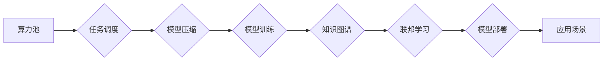

> Lepton AI, AI基础设施, 高效计算, 异构计算, 算力池, 模型压缩, 知识图谱, 联邦学习,  AI新基建

## 1. 背景介绍

人工智能（AI）正以惊人的速度发展，其应用领域不断拓展，从自动驾驶到医疗诊断，从金融风控到个性化推荐，AI正在深刻地改变着我们的生活。然而，随着AI模型规模的不断增长和训练需求的激增，传统的计算基础设施面临着巨大的挑战。

现有的AI基础设施主要依赖于集中式数据中心，其特点是：

* **资源利用率低:**  AI训练任务通常具有高并发性和短时性，导致资源利用率低，造成能源浪费和成本过高。
* **数据孤岛问题:** 数据分散在不同的机构和平台，难以进行共享和协同训练，限制了AI模型的训练效果。
* **安全性和隐私性问题:**  集中式数据中心容易成为攻击目标，数据泄露和隐私侵犯风险较高。

为了应对这些挑战，Lepton AI 提出了一种全新的AI基础设施架构，旨在构建高效、灵活、安全、可扩展的AI新基建。

## 2. 核心概念与联系

Lepton AI 的核心概念包括：

* **算力池:**  将分散的计算资源整合到一个统一的平台，实现资源共享和动态调度，提高资源利用率。
* **模型压缩:**  通过算法优化和数据结构转换，将大型AI模型压缩到更小的规模，降低模型部署和推理成本。
* **知识图谱:**  构建一个统一的知识表示体系，将不同领域的知识进行整合和关联，为AI模型提供更丰富的语义理解能力。
* **联邦学习:**  将模型训练分散到多个数据拥有者本地，避免数据中心化，保护数据隐私和安全。

Lepton AI 的架构设计遵循以下原则：

* **分布式计算:**  将任务分解成多个子任务，并行执行，提高计算效率。
* **异构计算:**  支持多种类型的计算资源，例如CPU、GPU、FPGA等，根据任务需求进行灵活调度。
* **弹性伸缩:**  根据实际需求动态调整资源规模，实现高效的资源利用。
* **安全可靠:**  采用多层安全机制，保障数据安全和系统稳定性。

**Lepton AI 架构流程图:**

## 3. 核心算法原理 & 具体操作步骤

### 3.1  算法原理概述

Lepton AI 的核心算法包括模型压缩、知识图谱构建和联邦学习等。

* **模型压缩:**  通过量化、剪枝、知识蒸馏等技术，将模型参数规模压缩，降低模型大小和计算复杂度。
* **知识图谱构建:**  通过文本挖掘、知识抽取和关系推理等技术，构建一个包含实体、关系和属性的知识图谱，为AI模型提供语义理解能力。
* **联邦学习:**  将模型训练分散到多个数据拥有者本地，通过参数更新协议进行模型联合训练，避免数据中心化，保护数据隐私。

### 3.2  算法步骤详解

**模型压缩算法步骤:**

1. **选择压缩方法:**  根据模型类型和应用场景选择合适的压缩方法，例如量化、剪枝、知识蒸馏等。
2. **模型量化:**  将模型参数从高精度浮点数转换为低精度整数，例如8位整数或4位整数。
3. **模型剪枝:**  移除模型中不重要的权重参数，减少模型参数数量。
4. **知识蒸馏:**  训练一个小型学生模型，使其模仿大型教师模型的输出结果，从而实现模型压缩。

**知识图谱构建算法步骤:**

1. **数据收集:**  收集包含实体、关系和属性的文本数据。
2. **实体识别:**  使用自然语言处理技术识别文本中的实体。
3. **关系抽取:**  使用规则匹配、机器学习等技术抽取实体之间的关系。
4. **知识表示:**  将实体、关系和属性表示为知识图谱的形式。

**联邦学习算法步骤:**

1. **模型初始化:**  每个数据拥有者都训练一个初始模型。
2. **参数更新:**  每个数据拥有者在本地训练模型，并更新模型参数。
3. **参数聚合:**  所有数据拥有者的模型参数进行聚合，生成一个全局模型。
4. **模型迭代:**  重复步骤2和3，直到模型收敛。

### 3.3  算法优缺点

**模型压缩算法:**

* **优点:**  可以有效降低模型大小和计算复杂度，提高模型部署效率。
* **缺点:**  可能会导致模型精度下降。

**知识图谱构建算法:**

* **优点:**  可以为AI模型提供更丰富的语义理解能力，提高模型的准确性和鲁棒性。
* **缺点:**  知识图谱构建需要大量的数据和计算资源。

**联邦学习算法:**

* **优点:**  可以保护数据隐私和安全，避免数据中心化。
* **缺点:**  训练速度较慢，模型性能可能不如集中式训练。

### 3.4  算法应用领域

Lepton AI 的核心算法在多个领域都有广泛的应用，例如：

* **自动驾驶:**  模型压缩可以降低自动驾驶系统的计算成本，提高实时性。
* **医疗诊断:**  知识图谱可以帮助AI模型理解医学知识，提高诊断准确率。
* **金融风控:**  联邦学习可以保护金融数据的隐私，提高风控模型的安全性。

## 4. 数学模型和公式 & 详细讲解 & 举例说明

### 4.1  数学模型构建

Lepton AI 的核心算法可以抽象为数学模型，例如：

* **模型压缩:**  可以使用量化误差函数来衡量模型压缩后的精度损失。
* **知识图谱构建:**  可以使用图论和机器学习算法来构建知识图谱。
* **联邦学习:**  可以使用凸优化理论来设计参数更新协议。

### 4.2  公式推导过程

例如，模型压缩中的量化误差函数可以定义为：

$$
E = \sum_{i=1}^{N} ||x_i - \hat{x}_i||^2
$$

其中：

* $x_i$ 是原始模型参数的第i个元素。
* $\hat{x}_i$ 是量化后的模型参数的第i个元素。
* $N$ 是模型参数的总数。

### 4.3  案例分析与讲解

例如，在自动驾驶领域，Lepton AI 可以使用模型压缩技术将大型深度学习模型压缩到更小的规模，从而降低自动驾驶系统的计算成本，提高实时性。

## 5. 项目实践：代码实例和详细解释说明

### 5.1  开发环境搭建

Lepton AI 的开发环境需要包含以下软件：

* Python 3.x
* TensorFlow 或 PyTorch
* CUDA 和 cuDNN

### 5.2  源代码详细实现

Lepton AI 的源代码可以从GitHub等平台获取。

### 5.3  代码解读与分析

Lepton AI 的源代码主要包含以下模块：

* **算力池管理模块:**  负责管理计算资源和任务调度。
* **模型压缩模块:**  提供模型量化、剪枝和知识蒸馏等压缩算法。
* **知识图谱构建模块:**  提供实体识别、关系抽取和知识表示等功能。
* **联邦学习模块:**  提供参数更新协议和模型聚合算法。

### 5.4  运行结果展示

Lepton AI 的运行结果可以展示在终端或图形界面中，例如：

* 算力池资源利用率
* 模型压缩后的模型大小和精度
* 知识图谱的规模和结构
* 联邦学习模型的训练效果

## 6. 实际应用场景

Lepton AI 可以应用于多个实际场景，例如：

* **自动驾驶:**  Lepton AI 可以帮助自动驾驶系统进行实时决策，提高安全性。
* **医疗诊断:**  Lepton AI 可以帮助医生进行疾病诊断，提高诊断准确率。
* **金融风控:**  Lepton AI 可以帮助金融机构进行风险评估，降低风险损失。

### 6.4  未来应用展望

Lepton AI 的未来应用前景广阔，例如：

* **工业自动化:**  Lepton AI 可以帮助工业企业进行智能化生产，提高生产效率。
* **智能家居:**  Lepton AI 可以帮助智能家居设备进行智能化控制，提高生活品质。
* **教育培训:**  Lepton AI 可以帮助教育机构进行个性化教学，提高学习效果。

## 7. 工具和资源推荐

### 7.1  学习资源推荐

* **Lepton AI 官方文档:**  https://www.lepton.ai/docs
* **TensorFlow 官方文档:**  https://www.tensorflow.org/
* **PyTorch 官方文档:**  https://pytorch.org/

### 7.2  开发工具推荐

* **Jupyter Notebook:**  https://jupyter.org/
* **VS Code:**  https://code.visualstudio.com/

### 7.3  相关论文推荐

* **Federated Learning: Strategies for Improving Communication Efficiency**
* **Knowledge Graph Embedding: A Survey**
* **Model Compression and Optimization Techniques for Deep Learning**

## 8. 总结：未来发展趋势与挑战

### 8.1  研究成果总结

Lepton AI 提出了一种全新的AI基础设施架构，旨在构建高效、灵活、安全、可扩展的AI新基建。Lepton AI 的核心算法包括模型压缩、知识图谱构建和联邦学习等，在多个领域都有广泛的应用前景。

### 8.2  未来发展趋势

Lepton AI 的未来发展趋势包括：

* **更强大的算力池:**  Lepton AI 将继续探索更强大的算力资源，例如量子计算和光子计算。
* **更智能的模型压缩:**  Lepton AI 将继续研究更智能的模型压缩算法，例如自动模型压缩和动态模型压缩。
* **更丰富的知识图谱:**  Lepton AI 将继续构建更丰富的知识图谱，涵盖更多领域和知识类型。
* **更安全的联邦学习:**  Lepton AI 将继续研究更安全的联邦学习算法，例如隐私保护和攻击防御。

### 8.3  面临的挑战

Lepton AI 还面临着一些挑战，例如：

* **算力资源的获取和管理:**  Lepton AI 需要获取大量的算力资源，并对其进行高效管理。
* **模型压缩的精度损失:**  模型压缩可能会导致模型精度损失，需要找到平衡点。
* **知识图谱的构建和维护:**  知识图谱的构建和维护需要大量的数据和计算资源。
* **联邦学习的安全性:**  联邦学习需要保证模型训练过程的安全性，防止数据泄露和模型攻击。

### 8.4  研究展望

Lepton AI 将继续致力于构建高效、灵活、安全、可扩展的AI新基建，为AI时代的发展贡献力量。

## 9. 附录：常见问题与解答

**Q1: Lepton AI 的开源程度如何？**

A1: Lepton AI 的部分代码和模型是开源的，用户可以根据自己的需求进行修改和使用。

**Q2: Lepton AI 的部署方式有哪些？**

A2: Lepton AI 可以部署在云端、边缘设备或本地服务器上。

**Q3: Lepton AI 的成本如何？**

A3: Lepton AI 的成本取决于用户的算力需求、模型规模和应用场景。

**Q4: Lepton AI 的安全性如何保证？**

A4: Lepton AI 采用多层安全机制，包括数据加密、身份认证和访问控制，保障数据安全和系统稳定性。

作者：禅与计算机程序设计艺术 / Zen and the Art of Computer Programming 
<end_of_turn>