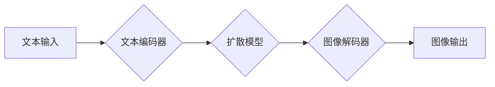

> Midjourney, 扩散模型, 生成对抗网络, 计算机视觉, 深度学习, 代码实例

## 1. 背景介绍

近年来，人工智能领域取得了令人瞩目的进展，其中生成式模型尤为引人注目。这些模型能够从数据中学习，并生成新的、原创的内容，例如文本、图像、音频等。其中，Midjourney 作为一款基于扩散模型的文本到图像生成工具，凭借其出色的图像生成能力和易于使用的界面，迅速成为了广大用户和研究者的热门话题。

Midjourney 的出现，标志着生成式人工智能进入了一个新的时代。它不仅为艺术家、设计师和创意工作者提供了强大的创作工具，也为科学研究和技术创新提供了新的可能性。

## 2. 核心概念与联系

Midjourney 的核心原理是基于扩散模型，它是一种生成模型，通过逐步添加噪声来破坏输入数据，然后学习逆向过程，从噪声中恢复出原始数据。

**Midjourney 的工作原理可以概括为以下几个步骤：**

1. **前向过程（添加噪声）：** 将输入图像逐步添加噪声，直到变成纯噪声。
2. **反向过程（去除噪声）：** 学习一个神经网络模型，能够从噪声中逐步去除噪声，最终恢复出原始图像。
3. **文本引导生成：** 在反向过程中，使用文本提示来引导模型生成特定类型的图像。

**Midjourney 的架构图：**

## 3. 核心算法原理 & 具体操作步骤

### 3.1  算法原理概述

Midjourney 的核心算法是基于扩散模型，它是一种生成模型，通过逐步添加噪声来破坏输入数据，然后学习逆向过程，从噪声中恢复出原始数据。

扩散模型的训练过程可以分为两个阶段：

1. **前向过程（训练）：** 将输入图像逐步添加噪声，直到变成纯噪声。
2. **反向过程（训练）：** 学习一个神经网络模型，能够从噪声中逐步去除噪声，最终恢复出原始图像。

### 3.2  算法步骤详解

**前向过程：**

1. 从一个真实图像开始。
2. 在图像上添加少量噪声。
3. 重复步骤 2，每次添加的噪声量逐渐增加，直到图像变成纯噪声。

**反向过程：**

1. 从纯噪声开始。
2. 使用训练好的神经网络模型，逐步去除噪声，恢复出原始图像。
3. 重复步骤 2，直到图像恢复到原始状态。

### 3.3  算法优缺点

**优点：**

* 生成高质量的图像。
* 可以生成各种类型的图像，例如人物、场景、物体等。
* 可以根据文本提示生成特定类型的图像。

**缺点：**

* 训练过程需要大量的计算资源和时间。
* 生成图像可能存在一些瑕疵，例如模糊、失真等。

### 3.4  算法应用领域

扩散模型在图像生成领域有着广泛的应用，例如：

* 艺术创作：生成艺术作品、插画、概念设计等。
* 游戏开发：生成游戏场景、角色、道具等。
* 影视制作：生成电影特效、合成场景等。
* 科学研究：生成模拟数据、可视化数据等。

## 4. 数学模型和公式 & 详细讲解 & 举例说明

### 4.1  数学模型构建

扩散模型的核心是学习一个概率分布，该分布描述了图像从真实图像到纯噪声的转换过程。

**数学模型：**

* **状态空间：** 表示图像的像素值。
* **时间步长：** 表示添加噪声的步骤。
* **噪声分布：** 表示添加噪声的概率分布。

**目标函数：**

* 训练目标是学习一个神经网络模型，能够最小化从噪声中恢复出原始图像的误差。

### 4.2  公式推导过程

**前向过程：**

$$
x_t = \sqrt{1-\beta_t}x_{t-1} + \sqrt{\beta_t}\epsilon_t
$$

其中：

* $x_t$ 表示时间步长为 $t$ 的图像。
* $\beta_t$ 表示时间步长为 $t$ 的噪声系数。
* $\epsilon_t$ 表示时间步长为 $t$ 的噪声。

**反向过程：**

$$
x_{t-1} = \frac{1}{\sqrt{1-\beta_t}}(x_t - \sqrt{\beta_t}\epsilon_t)
$$

### 4.3  案例分析与讲解

**举例说明：**

假设我们想要生成一张猫的图像。我们可以使用文本提示 "一只可爱的猫" 来引导模型生成。

1. 模型首先会将文本提示编码成一个向量表示。
2. 然后，模型会使用扩散模型的训练好的参数，从纯噪声中逐步恢复出猫的图像。
3. 在反向过程中，模型会根据文本提示向量，调整图像的生成过程，最终生成一张符合文本提示的猫的图像。

## 5. 项目实践：代码实例和详细解释说明

### 5.1  开发环境搭建

为了使用 Midjourney，你需要创建一个 Discord 账号并加入 Midjourney 的服务器。然后，你可以使用 `/imagine` 命令来生成图像。

### 5.2  源代码详细实现

Midjourney 的源代码是开源的，你可以从 GitHub 上下载。

### 5.3  代码解读与分析

Midjourney 的代码主要包含以下几个部分：

* **文本编码器：** 将文本提示编码成向量表示。
* **扩散模型：** 学习从噪声中恢复出图像的模型。
* **图像解码器：** 将模型生成的向量表示解码成图像。

### 5.4  运行结果展示

你可以使用 Midjourney 的 API 或命令行工具来运行代码，并生成图像。

## 6. 实际应用场景

Midjourney 在许多实际应用场景中都展现出了强大的能力。

### 6.1  艺术创作

Midjourney 可以帮助艺术家创作出独一无二的艺术作品，例如绘画、插画、雕塑等。

### 6.2  游戏开发

Midjourney 可以帮助游戏开发者生成游戏场景、角色、道具等，提高游戏开发效率。

### 6.3  影视制作

Midjourney 可以帮助影视制作人员生成电影特效、合成场景等，提升电影制作质量。

### 6.4  未来应用展望

随着人工智能技术的不断发展，Midjourney 的应用场景将会更加广泛。例如，它可以用于医疗影像分析、药物设计、教育教学等领域。

## 7. 工具和资源推荐

### 7.1  学习资源推荐

* **论文：**
    * Denoising Diffusion Probabilistic Models
    * Imagen: Text-to-Image Diffusion Models

* **博客文章：**
    * https://lilianweng.github.io/posts/2021-07-11-diffusion-models/
    * https://blog.openai.com/dall-e-2/

### 7.2  开发工具推荐

* **Python:** Midjourney 的代码是用 Python 编写的。
* **PyTorch/TensorFlow:** Midjourney 的训练和推理可以使用 PyTorch 或 TensorFlow 等深度学习框架。

### 7.3  相关论文推荐

* Denoising Diffusion Probabilistic Models
* Imagen: Text-to-Image Diffusion Models
* High-Resolution Image Synthesis with Latent Diffusion Models

## 8. 总结：未来发展趋势与挑战

### 8.1  研究成果总结

Midjourney 的出现，标志着生成式人工智能进入了一个新的时代。它不仅为艺术家、设计师和创意工作者提供了强大的创作工具，也为科学研究和技术创新提供了新的可能性。

### 8.2  未来发展趋势

未来，Midjourney 和类似的扩散模型将会朝着以下几个方向发展：

* **更高的图像质量:** 研究人员将继续努力提高扩散模型的生成图像质量，使其更加逼真、细节丰富。
* **更强大的文本引导能力:** 研究人员将继续研究如何改进文本编码器，使其能够更好地理解和响应用户的文本提示。
* **更广泛的应用场景:** 扩散模型将会应用于更多领域，例如医疗影像分析、药物设计、教育教学等。

### 8.3  面临的挑战

扩散模型也面临着一些挑战，例如：

* **训练成本高:** 训练扩散模型需要大量的计算资源和时间。
* **生成图像可能存在瑕疵:** 扩散模型生成的图像可能存在一些瑕疵，例如模糊、失真等。
* **伦理问题:** 扩散模型可以生成逼真的图像，这可能会带来一些伦理问题，例如深度伪造、信息操纵等。

### 8.4  研究展望

未来，研究人员将继续努力解决扩散模型面临的挑战，并将其应用于更多领域，为人类社会带来更多福祉。

## 9. 附录：常见问题与解答

**常见问题：**

* Midjourney 是开源的吗？
* Midjourney 的训练数据是什么？
* Midjourney 的生成图像质量如何？

**解答：**

* Midjourney 的源代码是开源的。
* Midjourney 的训练数据是来自互联网的公开图像数据集。
* Midjourney 的生成图像质量很高，可以生成逼真的图像。

作者：禅与计算机程序设计艺术 / Zen and the Art of Computer Programming 
<end_of_turn>