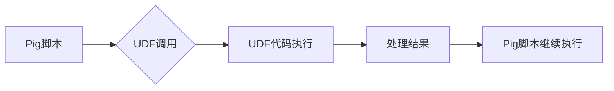

> Pig UDF, Apache Pig, 用户自定义函数, 数据处理, MapReduce, Java, Python

## 1. 背景介绍

Apache Pig是一个基于数据流的脚本语言，用于处理大型数据集。它提供了一种高层次的接口，可以方便地执行复杂的 ETL (Extract, Transform, Load) 任务。Pig UDF (User Defined Function) 是Pig的一个重要特性，它允许用户自定义函数，扩展Pig的处理能力，实现更灵活的数据处理逻辑。

Pig UDF可以用于各种场景，例如：

* **自定义数据转换:** 对数据进行特定的格式转换、数据清洗、数据聚合等操作。
* **集成外部系统:** 与外部数据库、API等系统进行交互，获取或处理外部数据。
* **实现业务逻辑:** 将业务逻辑封装成UDF，提高代码复用性和可维护性。

## 2. 核心概念与联系

Pig UDF的核心概念是将用户自定义的代码封装成Pig可以识别的函数，并将其集成到Pig脚本中执行。

**Pig UDF的架构:**



**Pig UDF与MapReduce的关系:**

Pig UDF最终会被翻译成MapReduce任务执行。Pig会将UDF代码包装成Java或Python程序，并将其作为MapReduce任务的处理逻辑。

## 3. 核心算法原理 & 具体操作步骤

### 3.1  算法原理概述

Pig UDF的执行原理基于函数调用和数据流处理。

1. Pig脚本中调用UDF时，Pig会将UDF的名称和参数传递给UDF执行引擎。
2. UDF执行引擎会根据UDF的类型和参数，加载相应的UDF代码并执行。
3. UDF代码执行过程中，会对输入数据进行处理，并生成输出数据。
4. Pig会将UDF的输出数据作为后续脚本处理的输入数据。

### 3.2  算法步骤详解

1. **定义UDF:** 使用Pig提供的语法定义UDF，包括UDF名称、输入参数类型、输出类型和UDF代码。
2. **注册UDF:** 将UDF注册到Pig的UDF注册表中，以便Pig脚本可以调用该UDF。
3. **调用UDF:** 在Pig脚本中使用UDF名称和参数调用UDF，将数据传递给UDF执行。
4. **处理结果:** Pig会将UDF的输出数据作为后续脚本处理的输入数据。

### 3.3  算法优缺点

**优点:**

* **扩展性:** 可以扩展Pig的功能，实现自定义数据处理逻辑。
* **可复用性:** 可以将业务逻辑封装成UDF，提高代码复用性和可维护性。
* **易用性:** Pig脚本语法简单易懂，方便用户编写UDF。

**缺点:**

* **性能:** UDF的执行效率可能不如Pig内置函数。
* **复杂性:** 编写复杂的UDF可能需要较高的编程经验。

### 3.4  算法应用领域

* **数据清洗:** 对数据进行格式转换、缺失值处理、异常值处理等操作。
* **数据聚合:** 对数据进行分组、统计、排序等操作。
* **数据分析:** 对数据进行挖掘、预测、建模等操作。
* **机器学习:** 将机器学习算法封装成UDF，用于数据预处理、模型训练等操作。

## 4. 数学模型和公式 & 详细讲解 & 举例说明

### 4.1  数学模型构建

Pig UDF的数学模型可以抽象为一个函数映射关系：

$$
f: D \rightarrow R
$$

其中：

* $D$ 表示UDF的输入数据域。
* $R$ 表示UDF的输出数据域。
* $f$ 表示UDF的函数映射关系。

### 4.2  公式推导过程

UDF的具体实现逻辑取决于用户的需求和算法设计。

例如，一个简单的UDF用于将输入数据转换为大写字母，其数学模型可以表示为：

$$
f(x) = x.toUpperCase()
$$

其中：

* $x$ 表示输入数据。
* $toUpperCase()` 表示将字符串转换为大写字母的函数。

### 4.3  案例分析与讲解

**案例:** 计算输入数据集中每个元素的平方和。

**数学模型:**

$$
f(x) = \sum_{i=1}^{n} x_i^2
$$

其中：

* $x$ 表示输入数据集合。
* $n$ 表示集合中元素的个数。
* $x_i$ 表示集合中的第 $i$ 个元素。

**UDF代码实现 (Java):**

```java
public class SquareSumUDF extends PigUDF {
    @Override
    public Tuple exec(Tuple input) throws IOException {
        double sum = 0;
        for (int i = 0; i < input.size(); i++) {
            sum += Math.pow(Double.parseDouble(input.get(i).toString()), 2);
        }
        return new Tuple(sum);
    }
}
```

## 5. 项目实践：代码实例和详细解释说明

### 5.1  开发环境搭建

* **Java开发环境:** JDK 8 或以上版本。
* **Apache Pig环境:** 下载并安装Apache Pig。

### 5.2  源代码详细实现

**UDF代码 (Java):**

```java
public class ReverseStringUDF extends PigUDF {
    @Override
    public Tuple exec(Tuple input) throws IOException {
        String str = input.get(0).toString();
        String reversedStr = new StringBuilder(str).reverse().toString();
        return new Tuple(reversedStr);
    }
}
```

**Pig脚本:**

```pig
A = LOAD 'input.txt' USING PigStorage(',') AS (line:chararray);
B = FOREACH A GENERATE ReverseStringUDF(line);
STORE B INTO 'output.txt';
```

### 5.3  代码解读与分析

* **UDF代码:**

```java
public class ReverseStringUDF extends PigUDF {
    @Override
    public Tuple exec(Tuple input) throws IOException {
        String str = input.get(0).toString();
        String reversedStr = new StringBuilder(str).reverse().toString();
        return new Tuple(reversedStr);
    }
}
```

* **Pig脚本:**

```pig
A = LOAD 'input.txt' USING PigStorage(',') AS (line:chararray);
B = FOREACH A GENERATE ReverseStringUDF(line);
STORE B INTO 'output.txt';
```

### 5.4  运行结果展示

运行Pig脚本后，将生成一个名为`output.txt`的文件，其中包含了输入文件中每一行的反转后的字符串。

## 6. 实际应用场景

Pig UDF在实际应用场景中具有广泛的应用价值，例如：

* **数据清洗:** 使用UDF实现数据格式转换、缺失值处理、异常值处理等操作，提高数据质量。
* **数据分析:** 使用UDF实现数据聚合、统计、排序等操作，方便进行数据分析。
* **机器学习:** 将机器学习算法封装成UDF，用于数据预处理、模型训练等操作，提高机器学习效率。

### 6.4  未来应用展望

随着大数据技术的不断发展，Pig UDF将发挥越来越重要的作用。未来，Pig UDF可能会朝着以下方向发展：

* **更强大的功能:** 提供更多类型的UDF，支持更复杂的业务逻辑。
* **更优的性能:** 优化UDF的执行效率，提高数据处理速度。
* **更易于使用:** 提供更友好的开发环境和工具，降低UDF开发门槛。

## 7. 工具和资源推荐

### 7.1  学习资源推荐

* **Apache Pig官方文档:** https://pig.apache.org/docs/r0.16.0/
* **Pig UDF官方文档:** https://pig.apache.org/docs/r0.16.0/PigUDF.html
* **Pig UDF示例代码:** https://github.com/apache/pig/tree/master/contrib/udf

### 7.2  开发工具推荐

* **Eclipse:** https://www.eclipse.org/
* **IntelliJ IDEA:** https://www.jetbrains.com/idea/

### 7.3  相关论文推荐

* **Pig: A Platform for Analyzing Large Datasets:** https://www.usenix.org/system/files/conference/osdi06/osdi06-paper-chu.pdf

## 8. 总结：未来发展趋势与挑战

### 8.1  研究成果总结

Pig UDF是Apache Pig的重要特性，它提供了强大的扩展性，可以满足各种数据处理需求。

### 8.2  未来发展趋势

Pig UDF将朝着更强大、更易用、更高效的方向发展。

### 8.3  面临的挑战

* **性能优化:** 提高UDF的执行效率，降低数据处理时间。
* **开发门槛降低:** 提供更友好的开发环境和工具，降低UDF开发门槛。
* **安全性和可靠性:** 确保UDF的安全性，防止恶意代码攻击。

### 8.4  研究展望

未来，我们将继续研究和开发Pig UDF，使其成为更强大、更易用、更安全的工具，为大数据分析提供更有效的解决方案。

## 9. 附录：常见问题与解答

* **如何注册UDF?**

可以使用Pig的`REGISTER`命令注册UDF。

* **UDF的输入和输出类型是什么?**

UDF的输入和输出类型取决于用户的需求和算法设计。

* **UDF的性能如何?**

UDF的性能取决于UDF的实现逻辑和数据规模。

* **如何调试UDF?**

可以使用Pig的调试工具进行UDF调试。


作者：禅与计算机程序设计艺术 / Zen and the Art of Computer Programming 
<end_of_turn>