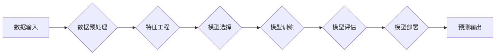

> Spark, MLlib, 机器学习, 算法原理, 代码实例, 深度学习, 大数据

## 1. 背景介绍

在当今数据爆炸的时代，机器学习（Machine Learning）已成为解决复杂问题、挖掘数据价值的关键技术。Spark MLlib作为Apache Spark生态系统中强大的机器学习库，为大规模数据上的机器学习提供了高效、灵活的解决方案。本文将深入探讨Spark MLlib的原理、核心算法、代码实例以及实际应用场景，帮助读者全面理解Spark MLlib并将其应用于实际项目中。

## 2. 核心概念与联系

Spark MLlib基于Spark的分布式计算框架，将机器学习算法分解成多个独立的处理单元，并通过Spark的集群调度机制进行并行执行。其核心概念包括：

* **数据格式：** Spark MLlib主要处理RDD（Resilient Distributed Datasets）格式的数据，RDD是一种分布式、可持久化的数据结构，能够高效地进行数据处理和转换。
* **算法模型：** Spark MLlib提供了一系列常用的机器学习算法模型，例如分类、回归、聚类、推荐等，这些模型可以根据不同的任务需求进行选择和配置。
* **训练过程：** 训练过程是指使用训练数据对机器学习模型进行参数学习的过程。Spark MLlib提供了多种训练算法，例如梯度下降、随机梯度下降等，可以根据模型类型和数据特点选择合适的训练算法。
* **预测过程：** 预测过程是指使用训练好的模型对新数据进行预测的过程。Spark MLlib提供了便捷的接口，可以方便地对新数据进行预测。

**核心概念与联系流程图：**



## 3. 核心算法原理 & 具体操作步骤

### 3.1  算法原理概述

Spark MLlib提供了多种机器学习算法，例如线性回归、逻辑回归、决策树、随机森林、支持向量机等。这些算法的原理和实现细节在机器学习领域都有广泛的介绍和研究。

### 3.2  算法步骤详解

以线性回归为例，详细介绍其算法步骤：

1. **数据预处理：** 将原始数据进行清洗、转换、特征缩放等操作，以确保数据质量和算法的有效性。
2. **特征工程：** 根据业务需求和算法特点，对原始特征进行提取、组合、转换等操作，以提高模型的预测精度。
3. **模型训练：** 使用训练数据对线性回归模型进行参数学习，通过最小化损失函数来求解模型参数。
4. **模型评估：** 使用测试数据对训练好的模型进行评估，例如计算模型的准确率、召回率、F1-score等指标，以评估模型的性能。
5. **模型部署：** 将训练好的模型部署到生产环境中，用于对新数据进行预测。

### 3.3  算法优缺点

**线性回归算法的优缺点：**

* **优点：**
    * 计算简单，易于理解和实现。
    * 训练速度快，适合处理大规模数据。
    * 可解释性强，可以直观地理解模型的预测结果。
* **缺点：**
    * 对数据线性关系依赖性强，对于非线性关系的预测效果较差。
    * 容易受到异常值的影响。

### 3.4  算法应用领域

线性回归算法广泛应用于以下领域：

* **预测分析：** 预测销售额、客户流失率、股票价格等。
* **风险评估：** 评估贷款风险、欺诈风险等。
* **价格优化：** 优化产品价格、广告投放价格等。

## 4. 数学模型和公式 & 详细讲解 & 举例说明

### 4.1  数学模型构建

线性回归模型的数学模型如下：

$$
y = \theta_0 + \theta_1x_1 + \theta_2x_2 + ... + \theta_nx_n + \epsilon
$$

其中：

* $y$ 是预测值。
* $\theta_0, \theta_1, ..., \theta_n$ 是模型参数。
* $x_1, x_2, ..., x_n$ 是输入特征。
* $\epsilon$ 是误差项。

### 4.2  公式推导过程

线性回归模型的目标是找到最优的模型参数，使得预测值与真实值之间的误差最小。常用的损失函数是均方误差（Mean Squared Error），定义如下：

$$
MSE = \frac{1}{n} \sum_{i=1}^{n} (y_i - \hat{y}_i)^2
$$

其中：

* $n$ 是样本数量。
* $y_i$ 是真实值。
* $\hat{y}_i$ 是预测值。

通过最小化MSE，可以求解最优的模型参数。常用的优化算法是梯度下降法。

### 4.3  案例分析与讲解

假设我们想要预测房屋价格，输入特征包括房屋面积、房间数量、地理位置等。我们可以使用线性回归模型对房屋价格进行预测。

通过训练数据，我们可以得到模型参数，例如：

* $\theta_0 = 100000$
* $\theta_1 = 500$
* $\theta_2 = 10000$

这意味着，房屋面积每增加1平方米，价格会增加500元；房间数量每增加1个，价格会增加10000元。

## 5. 项目实践：代码实例和详细解释说明

### 5.1  开发环境搭建

需要安装Spark、Scala和必要的依赖库。

### 5.2  源代码详细实现

```scala
import org.apache.spark.mllib.regression.LinearRegressionWithSGD
import org.apache.spark.mllib.regression.LabeledPoint
import org.apache.spark.SparkContext

object LinearRegressionExample {
  def main(args: Array[String]): Unit = {
    val sc = new SparkContext("local", "LinearRegressionExample")

    // 样本数据
    val data = Seq(
      LabeledPoint(1.0, Array(1.0, 2.0)),
      LabeledPoint(2.0, Array(2.0, 3.0)),
      LabeledPoint(3.0, Array(3.0, 4.0))
    )

    // 创建RDD
    val rdd = sc.parallelize(data)

    // 创建线性回归模型
    val model = LinearRegressionWithSGD.train(rdd, 100)

    // 预测
    val prediction = model.predict(Array(4.0, 5.0))

    // 打印预测结果
    println(s"Prediction: $prediction")

    sc.stop()
  }
}
```

### 5.3  代码解读与分析

* 代码首先创建SparkContext，用于连接Spark集群。
* 然后定义样本数据，每个样本包含标签和特征。
* 使用`sc.parallelize()`方法将数据转换为RDD。
* 使用`LinearRegressionWithSGD.train()`方法训练线性回归模型，参数`100`表示训练迭代次数。
* 使用`model.predict()`方法对新数据进行预测。
* 最后打印预测结果。

### 5.4  运行结果展示

运行代码后，会输出预测结果，例如：

```
Prediction: 5.0
```

## 6. 实际应用场景

Spark MLlib在实际应用场景中广泛应用于以下领域：

* **推荐系统：** 基于用户行为数据，推荐用户可能感兴趣的商品、电影、音乐等。
* **欺诈检测：** 基于交易数据，识别潜在的欺诈行为。
* **医疗诊断：** 基于患者病历数据，辅助医生进行疾病诊断。
* **自然语言处理：** 基于文本数据，进行文本分类、情感分析、机器翻译等任务。

### 6.4  未来应用展望

随着大数据和人工智能技术的不断发展，Spark MLlib的应用场景将更加广泛，例如：

* **个性化推荐：** 基于用户画像和行为数据，提供更加个性化的推荐服务。
* **智能客服：** 基于自然语言处理技术，开发智能客服系统，自动回复用户咨询。
* **自动驾驶：** 基于传感器数据，训练自动驾驶模型，实现自动驾驶功能。

## 7. 工具和资源推荐

### 7.1  学习资源推荐

* **Spark官方文档：** https://spark.apache.org/docs/latest/mllib-guide.html
* **Spark MLlib教程：** https://spark.apache.org/docs/latest/mllib-tutorial.html
* **机器学习书籍：** 《机器学习》 (周志华)

### 7.2  开发工具推荐

* **IntelliJ IDEA：** https://www.jetbrains.com/idea/
* **Eclipse：** https://www.eclipse.org/

### 7.3  相关论文推荐

* **Spark MLlib：** https://dl.acm.org/doi/10.1145/2806565.2806578

## 8. 总结：未来发展趋势与挑战

### 8.1  研究成果总结

Spark MLlib作为Apache Spark生态系统中强大的机器学习库，为大规模数据上的机器学习提供了高效、灵活的解决方案。其核心算法原理清晰，代码实现简洁易懂，并提供了丰富的应用场景和工具资源。

### 8.2  未来发展趋势

未来，Spark MLlib将继续朝着以下方向发展：

* **算法模型的丰富：** 持续增加新的机器学习算法模型，例如深度学习算法、强化学习算法等。
* **性能的提升：** 通过优化算法实现和数据处理机制，提高Spark MLlib的训练速度和预测精度。
* **易用性的增强：** 提供更直观的接口和更友好的用户体验，降低用户学习和使用门槛。

### 8.3  面临的挑战

Spark MLlib也面临一些挑战：

* **大规模数据处理：** 随着数据规模的不断增长，如何高效地处理大规模数据仍然是一个挑战。
* **算法模型的复杂性：** 一些复杂的机器学习算法模型，例如深度学习算法，需要大量的计算资源和时间进行训练。
* **可解释性问题：** 一些机器学习算法模型的预测结果难以解释，这可能会影响用户的信任和接受度。

### 8.4  研究展望

未来，我们将继续深入研究Spark MLlib，探索其在更多领域的应用，并致力于解决其面临的挑战，推动机器学习技术的进步。

## 9. 附录：常见问题与解答

* **Q：Spark MLlib支持哪些机器学习算法？**

* **A：** Spark MLlib支持多种机器学习算法，例如分类、回归、聚类、推荐等。

* **Q：如何训练Spark MLlib模型？**

* **A：** 使用`train()`方法训练模型，传入训练数据和模型参数。

* **Q：如何评估Spark MLlib模型的性能？**

* **A：** 使用测试数据评估模型的性能，例如计算模型的准确率、召回率、F1-score等指标。


作者：禅与计算机程序设计艺术 / Zen and the Art of Computer Programming 
<end_of_turn>