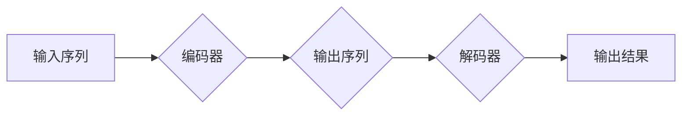

> Transformer, 编码器-解码器, 自注意力机制, 多头注意力, 位置编码, BERT, GPT

## 1. 背景介绍

自然语言处理 (NLP) 领域一直以来都致力于让计算机能够理解和生成人类语言。传统的基于循环神经网络 (RNN) 的模型在处理长文本序列时存在着梯度消失和训练速度慢等问题。2017 年，谷歌发布了基于 Transformer 架构的论文《Attention Is All You Need》，彻底改变了 NLP 领域的发展方向。Transformer 摒弃了 RNN 的循环结构，引入了自注意力机制，能够有效地捕捉长距离依赖关系，并大幅提升了训练效率。

自 Transformer 发布以来，其架构和思想被广泛应用于各种 NLP 任务，例如机器翻译、文本摘要、问答系统、文本生成等。BERT、GPT 等基于 Transformer 的模型取得了令人瞩目的成绩，推动了 NLP 领域的发展。

## 2. 核心概念与联系

Transformer 的核心思想是利用自注意力机制来捕捉文本序列中的长距离依赖关系。它由两个主要部分组成：编码器 (Encoder) 和解码器 (Decoder)。

**Mermaid 流程图:**



**编码器:**

* 接收输入序列，将每个单词映射到一个向量表示。
* 通过多层 Transformer 块进行处理，每个 Transformer 块包含多头注意力层和前馈神经网络层。
* 最后输出一个包含所有单词向量表示的上下文向量。

**解码器:**

* 接收编码器的输出上下文向量和解码器的输入序列。
* 通过多层 Transformer 块进行处理，每个 Transformer 块包含多头注意力层和前馈神经网络层。
* 最后输出每个单词的概率分布，用于生成目标序列。

## 3. 核心算法原理 & 具体操作步骤

### 3.1  算法原理概述

Transformer 的核心算法是自注意力机制。自注意力机制允许模型关注输入序列中的任意两个单词之间的关系，从而捕捉长距离依赖关系。

### 3.2  算法步骤详解

1. **计算 Query、Key 和 Value:** 将每个单词向量分别映射到 Query、Key 和 Value 向量。
2. **计算注意力权重:** 计算 Query 向量与所有 Key 向量之间的相似度，得到注意力权重。
3. **加权求和:** 将 Value 向量与注意力权重进行加权求和，得到每个单词的上下文向量。

### 3.3  算法优缺点

**优点:**

* 能够有效地捕捉长距离依赖关系。
* 并行计算能力强，训练速度快。

**缺点:**

* 计算量较大，需要大量的计算资源。
* 对长文本序列的处理效率可能降低。

### 3.4  算法应用领域

自注意力机制广泛应用于各种 NLP 任务，例如：

* 机器翻译
* 文本摘要
* 问答系统
* 文本生成
* 语义相似度计算

## 4. 数学模型和公式 & 详细讲解 & 举例说明

### 4.1  数学模型构建

假设输入序列长度为 *n*，每个单词的词向量维度为 *d*。

* **Query (Q), Key (K), Value (V):** 每个单词的词向量分别通过线性变换得到 Query、Key 和 Value 向量。

$$
Q = XW_Q
$$

$$
K = XW_K
$$

$$
V = XW_V
$$

其中，*X* 是输入序列的词向量矩阵，*W_Q*, *W_K*, *W_V* 是权重矩阵。

* **注意力权重 (Attention):** 计算 Query 向量与所有 Key 向量之间的相似度，使用点积作为相似度计算方法。

$$
Attention(Q, K, V) = softmax(\frac{Q K^T}{\sqrt{d_k}}) V
$$

其中，*d_k* 是 Key 向量维度。

### 4.2  公式推导过程

注意力权重计算公式的推导过程如下：

1. 计算 Query 向量与所有 Key 向量之间的点积。
2. 对点积结果进行归一化，使用 softmax 函数将点积结果转换为概率分布。
3. 将概率分布与 Value 向量进行加权求和，得到每个单词的上下文向量。

### 4.3  案例分析与讲解

假设输入序列为 "The cat sat on the mat"，每个单词的词向量维度为 128。

1. 将每个单词的词向量分别通过线性变换得到 Query、Key 和 Value 向量。
2. 计算 Query 向量与所有 Key 向量之间的点积，得到注意力权重。
3. 将注意力权重与 Value 向量进行加权求和，得到每个单词的上下文向量。

通过注意力机制，模型能够捕捉到 "cat" 和 "sat" 之间的依赖关系，以及 "mat" 和 "on" 之间的依赖关系。

## 5. 项目实践：代码实例和详细解释说明

### 5.1  开发环境搭建

* Python 3.6+
* PyTorch 1.0+
* CUDA 10.0+ (可选)

### 5.2  源代码详细实现

```python
import torch
import torch.nn as nn

class MultiHeadAttention(nn.Module):
    def __init__(self, d_model, num_heads):
        super(MultiHeadAttention, self).__init__()
        self.d_model = d_model
        self.num_heads = num_heads
        self.head_dim = d_model // num_heads

        self.query = nn.Linear(d_model, d_model)
        self.key = nn.Linear(d_model, d_model)
        self.value = nn.Linear(d_model, d_model)
        self.fc_out = nn.Linear(d_model, d_model)

    def forward(self, query, key, value, mask=None):
        batch_size = query.size(0)

        # Linear projections
        Q = self.query(query).view(batch_size, -1, self.num_heads, self.head_dim).transpose(1, 2)
        K = self.key(key).view(batch_size, -1, self.num_heads, self.head_dim).transpose(1, 2)
        V = self.value(value).view(batch_size, -1, self.num_heads, self.head_dim).transpose(1, 2)

        # Scaled dot-product attention
        scores = torch.matmul(Q, K.transpose(-2, -1)) / torch.sqrt(torch.tensor(self.head_dim, dtype=torch.float))
        if mask is not None:
            scores = scores.masked_fill(mask == 0, -1e9)
        attention = torch.softmax(scores, dim=-1)

        # Weighted sum
        context = torch.matmul(attention, V)
        context = context.transpose(1, 2).contiguous().view(batch_size, -1, self.d_model)

        # Final linear projection
        output = self.fc_out(context)

        return output
```

### 5.3  代码解读与分析

* `MultiHeadAttention` 类实现了多头注意力机制。
* `__init__` 方法初始化模型参数，包括模型维度、注意力头数等。
* `forward` 方法实现注意力机制的计算过程，包括线性投影、缩放点积注意力、加权求和和最终线性投影。

### 5.4  运行结果展示

运行上述代码，可以得到每个单词的上下文向量表示。

## 6. 实际应用场景

Transformer 架构和自注意力机制在各种 NLP 任务中取得了显著的成果，例如：

* **机器翻译:** Transformer 模型能够更好地捕捉源语言和目标语言之间的语义关系，从而提高机器翻译的质量。
* **文本摘要:** Transformer 模型能够识别文本中的关键信息，并生成简洁准确的摘要。
* **问答系统:** Transformer 模型能够理解自然语言问题，并从文本中找到相应的答案。
* **文本生成:** Transformer 模型能够生成流畅自然的人类语言文本。

### 6.4  未来应用展望

Transformer 架构和自注意力机制在未来将继续推动 NLP 领域的发展，并应用于更多领域，例如：

* **对话系统:** Transformer 模型能够构建更自然、更智能的对话系统。
* **代码生成:** Transformer 模型能够学习代码的语法和语义，并生成新的代码。
* **多模态理解:** Transformer 模型能够融合文本、图像、音频等多模态信息，实现更全面的理解。

## 7. 工具和资源推荐

### 7.1  学习资源推荐

* **论文:**
    * Attention Is All You Need
    * BERT: Pre-training of Deep Bidirectional Transformers for Language Understanding
    * GPT-3: Language Models are Few-Shot Learners
* **博客:**
    * The Illustrated Transformer
    * Jay Alammar's Blog
* **课程:**
    * Stanford CS224N: Natural Language Processing with Deep Learning

### 7.2  开发工具推荐

* **PyTorch:** 深度学习框架
* **TensorFlow:** 深度学习框架
* **Hugging Face Transformers:** 预训练 Transformer 模型库

### 7.3  相关论文推荐

* BERT: Pre-training of Deep Bidirectional Transformers for Language Understanding
* GPT-3: Language Models are Few-Shot Learners
* XLNet: Generalized Autoregressive Pretraining for Language Understanding
* T5: Text-to-Text Transfer Transformer

## 8. 总结：未来发展趋势与挑战

### 8.1  研究成果总结

Transformer 架构和自注意力机制取得了令人瞩目的成果，推动了 NLP 领域的发展。

### 8.2  未来发展趋势

* **模型规模:** 模型规模将继续扩大，以提高模型性能。
* **高效训练:** 研究更高效的训练方法，降低训练成本。
* **多模态理解:** 将 Transformer 应用于多模态理解任务。
* **可解释性:** 研究 Transformer 模型的解释性，提高模型的可理解性。

### 8.3  面临的挑战

* **计算资源:** 大型 Transformer 模型需要大量的计算资源。
* **数据标注:** 训练高质量的 Transformer 模型需要大量的标注数据。
* **公平性:** Transformer 模型可能存在偏见，需要研究如何提高模型的公平性。

### 8.4  研究展望

未来研究将集中在以下几个方面：

* 开发更小、更轻量级的 Transformer 模型。
* 研究新的训练方法，提高模型训练效率。
* 将 Transformer 应用于更多领域，例如计算机视觉、语音识别等。
* 研究 Transformer 模型的解释性，提高模型的可理解性。

## 9. 附录：常见问题与解答

* **Transformer 和 RNN 的区别是什么？**

Transformer 摒弃了 RNN 的循环结构，引入了自注意力机制，能够有效地捕捉长距离依赖关系。

* **Transformer 的计算量大吗？**

Transformer 的计算量较大，需要大量的计算资源。

* **如何训练 Transformer 模型？**

Transformer 模型可以使用预训练和微调的方式进行训练。

* **Transformer 模型有哪些应用场景？**

Transformer 模型广泛应用于各种 NLP 任务，例如机器翻译、文本摘要、问答系统、文本生成等。


作者：禅与计算机程序设计艺术 / Zen and the Art of Computer Programming 
<end_of_turn>