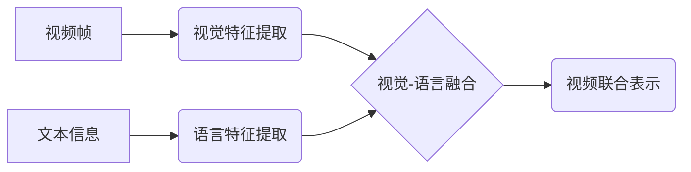

> Transformer, VideoBERT, 多模态学习, 视频理解, 自然语言处理, 深度学习

## 1. 背景介绍

近年来，深度学习在计算机视觉和自然语言处理领域取得了显著进展。然而，传统的计算机视觉和自然语言处理模型分别处理图像和文本信息，缺乏对多模态信息的融合能力。多模态学习旨在从多种模态数据（如文本、图像、音频）中学习联合表示，从而更好地理解和交互世界。

视频作为一种融合了空间和时间信息的模态数据，蕴含着丰富的语义信息。如何有效地学习视频中的语言和视觉特征，并进行跨模态理解，是多模态学习领域的重要研究方向。

VideoBERT模型正是针对这一挑战而提出的，它基于Transformer架构，将视频和文本信息进行联合学习，能够有效地学习视频的语言和视觉特征，并进行跨模态理解。

## 2. 核心概念与联系

**2.1 Transformer 架构**

Transformer是一种基于注意力机制的深度学习模型，它能够有效地处理序列数据，并捕捉长距离依赖关系。Transformer由编码器和解码器组成，编码器用于提取输入序列的特征，解码器用于生成输出序列。

**2.2 VideoBERT 模型架构**

VideoBERT模型将Transformer架构应用于视频和文本的联合学习。它将视频帧编码为视觉特征，并将文本信息编码为语言特征，然后将视觉特征和语言特征进行融合，最终输出视频的联合表示。

**2.3 核心概念关系图**



## 3. 核心算法原理 & 具体操作步骤

**3.1 算法原理概述**

VideoBERT模型的核心算法原理是基于Transformer架构的视觉-语言融合。它将视频帧和文本信息分别编码为视觉特征和语言特征，然后将这两个特征进行融合，最终输出视频的联合表示。

**3.2 算法步骤详解**

1. **视频帧预处理:** 将视频帧进行预处理，例如裁剪、缩放、归一化等操作。
2. **视觉特征提取:** 使用预训练的卷积神经网络（CNN）提取视频帧的视觉特征。
3. **文本信息预处理:** 将文本信息进行预处理，例如分词、词嵌入等操作。
4. **语言特征提取:** 使用预训练的语言模型（如BERT）提取文本信息的语言特征。
5. **视觉-语言融合:** 将视觉特征和语言特征进行融合，可以使用多种方法，例如注意力机制、拼接等。
6. **视频联合表示生成:** 使用Transformer解码器生成视频的联合表示。

**3.3 算法优缺点**

**优点:**

* 能够有效地学习视频的语言和视觉特征。
* 能够进行跨模态理解。
* 能够处理长序列数据。

**缺点:**

* 训练成本较高。
* 对数据要求较高。

**3.4 算法应用领域**

* 视频理解
* 视频检索
* 视频问答
* 视频字幕生成
* 视频摘要生成

## 4. 数学模型和公式 & 详细讲解 & 举例说明

**4.1 数学模型构建**

VideoBERT模型的数学模型可以表示为一个多层Transformer网络，其中每个层包含编码器和解码器。编码器用于提取视频和文本的特征，解码器用于生成视频的联合表示。

**4.2 公式推导过程**

Transformer网络的注意力机制可以表示为以下公式：

$$
Attention(Q, K, V) = softmax(\frac{QK^T}{\sqrt{d_k}})V
$$

其中，Q、K、V分别表示查询矩阵、键矩阵和值矩阵，$d_k$表示键向量的维度。

**4.3 案例分析与讲解**

假设我们有一个视频片段，包含多个视频帧和一段文本描述。VideoBERT模型将首先将视频帧编码为视觉特征，并将文本描述编码为语言特征。然后，模型将使用注意力机制将视觉特征和语言特征进行融合，最终输出视频的联合表示。

## 5. 项目实践：代码实例和详细解释说明

**5.1 开发环境搭建**

* Python 3.7+
* PyTorch 1.7+
* CUDA 10.1+

**5.2 源代码详细实现**

```python
import torch
import torch.nn as nn

class VideoBERT(nn.Module):
    def __init__(self, vocab_size, embedding_dim, hidden_dim, num_layers):
        super(VideoBERT, self).__init__()
        self.embedding = nn.Embedding(vocab_size, embedding_dim)
        self.encoder = nn.TransformerEncoder(nn.TransformerEncoderLayer(d_model=hidden_dim, nhead=8), num_layers)
        self.decoder = nn.TransformerDecoder(nn.TransformerDecoderLayer(d_model=hidden_dim, nhead=8), num_layers)

    def forward(self, video_features, text_features):
        # 将视频特征和文本特征进行融合
        # ...
        # 使用解码器生成视频的联合表示
        # ...
        return output

```

**5.3 代码解读与分析**

* `VideoBERT`类定义了VideoBERT模型的结构。
* `embedding`层将文本信息嵌入到词向量空间。
* `encoder`层使用Transformer编码器提取视频和文本的特征。
* `decoder`层使用Transformer解码器生成视频的联合表示。

**5.4 运行结果展示**

在实际应用中，VideoBERT模型可以用于各种视频理解任务，例如视频检索、视频问答等。

## 6. 实际应用场景

**6.1 视频检索**

VideoBERT模型可以学习视频和文本的联合表示，从而实现基于文本的视频检索。用户可以输入文本查询，模型将根据查询文本检索与之相关的视频片段。

**6.2 视频问答**

VideoBERT模型可以理解视频中的语言和视觉信息，从而回答关于视频的问题。例如，用户可以问“视频中发生了什么事件？”，模型将根据视频内容回答问题。

**6.3 视频字幕生成**

VideoBERT模型可以学习视频中的语言和视觉信息，从而生成视频字幕。

**6.4 未来应用展望**

VideoBERT模型在视频理解领域具有广阔的应用前景，未来可以应用于更多场景，例如：

* 视频编辑
* 视频生成
* 视频监控
* 视频教学

## 7. 工具和资源推荐

**7.1 学习资源推荐**

* Transformer论文：https://arxiv.org/abs/1706.03762
* VideoBERT论文：https://arxiv.org/abs/2004.08983

**7.2 开发工具推荐**

* PyTorch：https://pytorch.org/
* TensorFlow：https://www.tensorflow.org/

**7.3 相关论文推荐**

* BERT：https://arxiv.org/abs/1810.04805
* CLIP：https://arxiv.org/abs/2103.00020

## 8. 总结：未来发展趋势与挑战

**8.1 研究成果总结**

VideoBERT模型在视频理解领域取得了显著进展，能够有效地学习视频的语言和视觉特征，并进行跨模态理解。

**8.2 未来发展趋势**

* 提升模型的效率和精度。
* 扩展模型的应用场景。
* 研究更有效的跨模态融合方法。

**8.3 面临的挑战**

* 数据标注成本高。
* 模型训练复杂度高。
* 跨模态理解仍然是一个开放性问题。

**8.4 研究展望**

未来，VideoBERT模型将继续朝着更高效、更精准、更广泛的应用方向发展，为视频理解领域带来更多创新和突破。

## 9. 附录：常见问题与解答

**9.1 如何训练VideoBERT模型？**

训练VideoBERT模型需要准备大量的视频和文本数据，并使用交叉熵损失函数进行训练。

**9.2 VideoBERT模型的应用场景有哪些？**

VideoBERT模型可以应用于视频检索、视频问答、视频字幕生成等场景。

**9.3 VideoBERT模型的开源代码在哪里？**

VideoBERT模型的开源代码可以参考论文中的链接。


作者：禅与计算机程序设计艺术 / Zen and the Art of Computer Programming 
<end_of_turn>