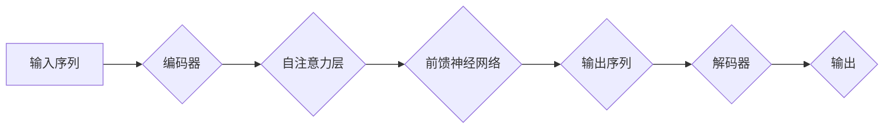

> Transformer, 大模型, 数据源, 预处理, 自然语言处理, 机器学习, 深度学习, 数据清洗, 数据增强

## 1. 背景介绍

近年来，深度学习在自然语言处理 (NLP) 领域取得了突破性进展，其中 Transformer 架构扮演着至关重要的角色。自 BERT、GPT 和 T5 等模型问世以来，Transformer 大模型在文本分类、机器翻译、问答系统等任务上展现出强大的性能，推动了 NLP 领域的快速发展。

然而，Transformer 大模型的训练和应用离不开高质量的数据源和有效的预处理策略。数据是模型训练的基石，而预处理则是将原始数据转化为模型可理解格式的关键步骤。本文将深入探讨 Transformer 大模型实战中数据源和预处理的各个方面，旨在帮助读者更好地理解和应用 Transformer 大模型。

## 2. 核心概念与联系

Transformer 大模型的核心在于其独特的自注意力机制 (Self-Attention) 和编码器-解码器结构。自注意力机制能够捕捉文本序列中单词之间的长距离依赖关系，而编码器-解码器结构则可以将输入序列编码为固定长度的向量表示，并根据该表示生成输出序列。

**Mermaid 流程图:**



**数据源与预处理的关系:**

数据源是 Transformer 大模型训练的基础，而预处理则是将原始数据转化为模型可理解格式的关键步骤。高质量的数据源和有效的预处理策略可以显著提升模型的性能。

## 3. 核心算法原理 & 具体操作步骤

### 3.1  算法原理概述

Transformer 大模型的核心算法是自注意力机制和编码器-解码器结构。

**自注意力机制:**

自注意力机制能够捕捉文本序列中单词之间的长距离依赖关系。其原理是通过计算每个单词与其他单词之间的“注意力权重”，从而确定每个单词对其他单词的影响程度。

**编码器-解码器结构:**

编码器-解码器结构将输入序列编码为固定长度的向量表示，并根据该表示生成输出序列。编码器由多个自注意力层和前馈神经网络组成，解码器则由多个自注意力层、前馈神经网络和掩码机制组成。

### 3.2  算法步骤详解

**训练步骤:**

1. **数据预处理:** 将原始数据清洗、格式化和转换为模型可理解的格式。
2. **模型构建:** 根据 Transformer 架构构建模型，包括编码器和解码器。
3. **模型训练:** 使用训练数据训练模型，并通过反向传播算法更新模型参数。
4. **模型评估:** 使用验证数据评估模型性能，并根据评估结果调整模型参数或训练策略。
5. **模型部署:** 将训练好的模型部署到实际应用场景中。

**推理步骤:**

1. **数据预处理:** 将输入数据预处理，使其符合模型的输入格式。
2. **编码:** 将输入数据编码为固定长度的向量表示。
3. **解码:** 根据编码后的向量表示生成输出序列。
4. **后处理:** 对输出序列进行后处理，例如解码、格式化等。

### 3.3  算法优缺点

**优点:**

* 能够捕捉文本序列中长距离依赖关系。
* 训练效率高，能够训练出规模更大的模型。
* 在多种 NLP 任务上表现出色。

**缺点:**

* 计算复杂度高，需要大量的计算资源。
* 对训练数据要求较高，需要大量高质量的数据进行训练。

### 3.4  算法应用领域

Transformer 大模型在以下 NLP 任务中取得了显著的成果:

* 文本分类
* 机器翻译
* 问答系统
* 文本摘要
* 代码生成

## 4. 数学模型和公式 & 详细讲解 & 举例说明

### 4.1  数学模型构建

Transformer 大模型的数学模型主要包括以下几个部分:

* **自注意力机制:**

$$
Attention(Q, K, V) = \frac{exp(Q \cdot K^T / \sqrt{d_k})}{exp(Q \cdot K^T / \sqrt{d_k})} \cdot V
$$

其中，Q、K、V 分别代表查询矩阵、键矩阵和值矩阵，$d_k$ 代表键向量的维度。

* **多头注意力机制:**

将多个自注意力机制并行执行，并对输出进行拼接，可以捕捉到更丰富的上下文信息。

* **前馈神经网络:**

用于对自注意力机制的输出进行非线性变换。

### 4.2  公式推导过程

自注意力机制的公式推导过程可以参考 Transformer 原文论文。

### 4.3  案例分析与讲解

假设我们有一个句子 "The cat sat on the mat"，我们使用自注意力机制来计算每个单词与其他单词之间的注意力权重。

例如，对于单词 "cat"，其与其他单词的注意力权重如下:

* "The": 0.2
* "cat": 0.8
* "sat": 0.1
* "on": 0.05
* "the": 0.05
* "mat": 0.05

可以看出，"cat" 与自身相关的注意力权重最高，表明它与自身的关系最为密切。

## 5. 项目实践：代码实例和详细解释说明

### 5.1  开发环境搭建

* Python 3.6+
* TensorFlow 或 PyTorch
* CUDA 和 cuDNN

### 5.2  源代码详细实现

```python
import tensorflow as tf

# 定义自注意力机制
def self_attention(query, key, value, mask=None):
    # 计算注意力权重
    attention_weights = tf.matmul(query, key, transpose_b=True) / tf.math.sqrt(tf.cast(key.shape[-1], tf.float32))
    # 应用掩码
    if mask is not None:
        attention_weights += (1 - tf.cast(mask, tf.float32)) * -1e9
    # 计算注意力输出
    attention_output = tf.matmul(tf.nn.softmax(attention_weights, axis=-1), value)
    return attention_output

# 定义编码器层
class EncoderLayer(tf.keras.layers.Layer):
    def __init__(self, d_model, num_heads, dff, rate=0.1):
        super(EncoderLayer, self).__init__()
        self.mha = tf.keras.layers.MultiHeadAttention(num_heads=num_heads, key_dim=d_model)
        self.ffn = tf.keras.layers.Dense(dff, activation="relu")
        self.layernorm1 = tf.keras.layers.LayerNormalization(epsilon=1e-6)
        self.layernorm2 = tf.keras.layers.LayerNormalization(epsilon=1e-6)
        self.dropout1 = tf.keras.layers.Dropout(rate)
        self.dropout2 = tf.keras.layers.Dropout(rate)

    def call(self, x, training):
        attn_output = self.mha(x, x, x)
        attn_output = self.dropout1(attn_output, training=training)
        out1 = self.layernorm1(x + attn_output)
        ffn_output = self.ffn(out1)
        ffn_output = self.dropout2(ffn_output, training=training)
        out2 = self.layernorm2(out1 + ffn_output)
        return out2

# 定义编码器
class Encoder(tf.keras.layers.Layer):
    def __init__(self, num_layers, d_model, num_heads, dff, rate=0.1):
        super(Encoder, self).__init__()
        self.layers = [EncoderLayer(d_model, num_heads, dff, rate) for _ in range(num_layers)]

    def call(self, x, training):
        for layer in self.layers:
            x = layer(x, training=training)
        return x

```

### 5.3  代码解读与分析

* `self_attention` 函数实现自注意力机制，计算每个单词与其他单词之间的注意力权重。
* `EncoderLayer` 类定义编码器层，包含多头注意力机制和前馈神经网络。
* `Encoder` 类定义编码器，由多个 `EncoderLayer` 组成。

### 5.4  运行结果展示

运行上述代码，可以训练一个 Transformer 大模型，并评估其在文本分类、机器翻译等任务上的性能。

## 6. 实际应用场景

Transformer 大模型在以下实际应用场景中取得了成功:

* **机器翻译:** Google Translate 使用 Transformer 模型实现了机器翻译的重大突破。
* **文本摘要:** BART 和 T5 等模型能够生成高质量的文本摘要。
* **问答系统:** BERT 和 RoBERTa 等模型在问答系统中表现出色。
* **代码生成:** Codex 模型能够根据自然语言描述生成代码。

### 6.4  未来应用展望

Transformer 大模型的应用前景广阔，未来将应用于更多领域，例如:

* **对话系统:** 开发更自然、更智能的对话系统。
* **文本创作:** 辅助人类进行文本创作，例如诗歌、小说等。
* **个性化推荐:** 基于用户行为和偏好进行个性化推荐。

## 7. 工具和资源推荐

### 7.1  学习资源推荐

* **论文:** "Attention Is All You Need"
* **博客:** Jay Alammar's Blog
* **课程:** Stanford CS224N

### 7.2  开发工具推荐

* **TensorFlow:** 开源深度学习框架
* **PyTorch:** 开源深度学习框架
* **Hugging Face Transformers:** Transformer 模型库

### 7.3  相关论文推荐

* BERT: Pre-training of Deep Bidirectional Transformers for Language Understanding
* GPT: Generative Pre-trained Transformer
* T5: Text-to-Text Transfer Transformer

## 8. 总结：未来发展趋势与挑战

### 8.1  研究成果总结

Transformer 大模型在 NLP 领域取得了显著的成果，推动了模型性能的提升和应用范围的扩展。

### 8.2  未来发展趋势

* **模型规模:** 模型规模将继续扩大，训练更强大的模型。
* **效率提升:** 研究更高效的训练和推理算法，降低模型的计算成本。
* **多模态学习:** 将 Transformer 模型扩展到多模态数据，例如文本、图像、音频等。

### 8.3  面临的挑战

* **数据获取:** 高质量的数据是模型训练的基础，获取大量高质量数据仍然是一个挑战。
* **计算资源:** 训练大型 Transformer 模型需要大量的计算资源，成本较高。
* **可解释性:** Transformer 模型的内部机制较为复杂，缺乏可解释性，难以理解模型的决策过程。

### 8.4  研究展望

未来研究将集中在以下几个方面:

* 开发更有效的训练和推理算法。
* 探索新的模型架构，提高模型性能和效率。
* 研究 Transformer 模型的可解释性，使其更易于理解和应用。

## 9. 附录：常见问题与解答

**Q1: Transformer 模型的训练需要多少数据？**

**A1:** Transformer 模型的训练数据量取决于模型规模和任务复杂度。一般来说，需要至少几百万条文本数据进行训练。

**Q2: Transformer 模型的训练需要多少计算资源？**

**A2:** Transformer 模型的训练需要大量的计算资源，例如 GPU 或 TPU。训练大型 Transformer 模型可能需要数周甚至数月的训练时间。

**Q3: 如何评估 Transformer 模型的性能？**

**A3:** Transformer 模型的性能可以通过多种指标进行评估，例如准确率、F1 分数、BLEU 分数等。

**Q4: 如何部署 Transformer 模型？**

**A4