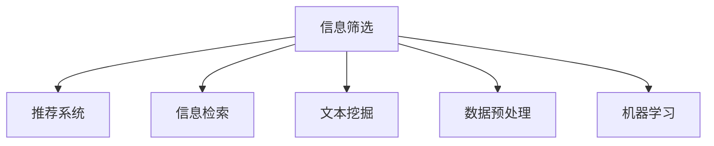

                 

## 1. 背景介绍

### 1.1 问题由来
在信息化高度发达的今天，互联网、社交媒体、各类应用App等，每天都在产生海量的信息。这些信息以各种形式呈现，如新闻资讯、博客文章、研究报告、评论回复等。信息的多样性、及时性和丰富性，极大地便利了人们获取知识和资源，但也造成了严重的“信息过载”问题。

信息过载是指个人或系统在面对海量信息时，无法有效处理或吸收所有信息，导致认知负担过重，影响决策和效率的现象。在企业、教育、科学研究、日常工作等各个领域，信息过载都带来了不小的困扰。如何有效筛选信息，将有价值的信息挖掘出来，成为了亟待解决的关键问题。

### 1.2 问题核心关键点
信息筛选的本质是数据挖掘和机器学习问题。通过构建算法模型，将数据中的有用信息提取和排序，从而得到最佳的决策支持。核心关键点包括：

- 数据获取：从互联网、社交媒体等渠道获取数据。
- 数据预处理：清洗、去重、归一化等步骤。
- 特征提取：将文本、图像、语音等不同类型数据转化为算法可处理的形式。
- 模型构建：选择合适的机器学习算法，如分类、聚类、推荐等，建立信息筛选模型。
- 模型评估：通过交叉验证、AUC、准确率等指标评估模型效果。
- 模型应用：将模型部署到实际应用场景，进行信息筛选。

这些问题关键点彼此联系紧密，共同构成了信息筛选技术的核心框架。通过理解和掌握这些技术，能够有效应对信息过载问题，提升决策效率和质量。

### 1.3 问题研究意义
在信息爆炸的时代，信息筛选技术具有重要意义：

1. **决策支持**：为决策者提供有价值的信息，辅助做出更科学合理的决策。
2. **效率提升**：筛选出有用信息，节省大量时间，提高工作效率。
3. **知识积累**：将筛选结果转化为知识库，促进知识积累和传承。
4. **认知解放**：减少对信息处理的需求，让人们能够专注于更有创造性的工作。
5. **市场竞争力**：通过精准的信息筛选，提升企业的市场竞争力。
6. **社会效益**：帮助公众更快捷、准确地获取重要信息，提升社会整体的信息素养。

通过研究信息筛选技术，可以更好地管理和利用信息资源，提升信息时代的效率和质量，推动社会进步。

## 2. 核心概念与联系

### 2.1 核心概念概述

为更好地理解信息筛选技术的原理和应用，本节将介绍几个密切相关的核心概念：

- 信息筛选（Information Filtering）：指从大量数据中挑选出有用信息的过程。其目标是降低信息过载，提高信息获取的效率和质量。
- 推荐系统（Recommender System）：通过分析用户行为和兴趣，为个性化推荐信息。推荐系统常用于电商、社交网络、视频平台等。
- 信息检索（Information Retrieval）：从数据库或网络中检索信息，并按相关性排序，提供给用户。检索是信息筛选的基础。
- 文本挖掘（Text Mining）：从文本数据中提取有用信息和知识，常用于情感分析、主题分析、实体识别等任务。
- 数据预处理（Data Preprocessing）：清洗、归一化、特征提取等步骤，是信息筛选的前置环节。
- 机器学习（Machine Learning）：构建模型，通过算法对数据进行学习和预测。是信息筛选的核心技术。

这些核心概念之间的逻辑关系可以通过以下Mermaid流程图来展示：



这个流程图展示了一般信息筛选技术的关键环节及其相互关系：

1. 信息筛选包含推荐系统、信息检索、文本挖掘等多个子环节。
2. 数据预处理和机器学习是信息筛选的两个关键步骤，分别用于数据清洗和模型构建。
3. 信息检索是信息筛选的基础，常用于先期过滤信息。
4. 文本挖掘用于处理文本数据，为信息筛选提供特征支持。
5. 推荐系统通过用户行为分析，实现个性化信息推荐。

这些概念共同构成了信息筛选技术的核心框架，使其能够有效地从大量数据中提取有用信息。

## 3. 核心算法原理 & 具体操作步骤
### 3.1 算法原理概述

信息筛选的核心算法包括推荐算法、信息检索算法和文本挖掘算法。这些算法通过分析用户行为、文本特征和数据分布，构建模型，筛选出有价值的信息。

推荐算法和信息检索算法的主要原理是相似度匹配。通过计算数据对象之间的相似度，找到与其最相关的信息。相似度匹配算法包括余弦相似度、Jaccard相似度、皮尔逊相关系数等。

文本挖掘算法通过统计、分类、聚类等方法，挖掘文本中的有用信息。常用的文本挖掘算法包括TF-IDF、NLP、主题建模等。

### 3.2 算法步骤详解

信息筛选的典型流程包括数据获取、数据预处理、特征提取、模型构建、模型评估和模型应用。以下是详细步骤：

**Step 1: 数据获取**
- 确定数据来源，如社交媒体、新闻网站、电商网站等。
- 抓取数据，保存为结构化或非结构化数据格式。

**Step 2: 数据预处理**
- 清洗数据，去除噪声、无关信息等。
- 去重，保证数据一致性。
- 归一化，将数据转化为统一的格式。

**Step 3: 特征提取**
- 将数据转化为算法可处理的特征向量。
- 文本数据可以提取TF-IDF、NLP特征等。
- 图像数据可以提取颜色直方图、纹理特征等。

**Step 4: 模型构建**
- 选择合适的机器学习算法，如分类、聚类、推荐等。
- 训练模型，找到数据对象之间的关系和特征。

**Step 5: 模型评估**
- 使用交叉验证、AUC、准确率等指标评估模型效果。
- 调整模型参数，优化模型性能。

**Step 6: 模型应用**
- 部署模型，实时进行信息筛选。
- 不断更新模型，适应数据分布的变化。

以上是信息筛选技术的典型流程。在实际应用中，还需针对具体任务的特点，对每个步骤进行优化设计，如改进特征提取方法、选择更合适的算法等，以进一步提升筛选效果。

### 3.3 算法优缺点

信息筛选技术具有以下优点：
1. 自动化程度高。使用算法自动处理和筛选信息，降低人工成本。
2. 精确度较高。通过复杂的算法，能够提高筛选的准确性和相关性。
3. 效率高。信息筛选算法通常可以在短时间内处理大量数据。
4. 可扩展性强。算法可以应用于不同类型的数据和不同的业务场景。

同时，该方法也存在一些缺点：
1. 对数据质量依赖高。数据噪音、不完整等问题，会影响算法效果。
2. 模型复杂度高。不同的算法和参数设置，需要大量的实验和调优。
3. 黑盒问题。算法模型内部工作机制不透明，难以解释。
4. 需要大量的标注数据。部分算法需要大量标注数据来训练模型。
5. 算法对特定领域不适应。通用算法无法适应所有领域的特定需求。

尽管存在这些局限性，但信息筛选技术在提高信息处理效率和质量方面，具有重要应用价值。未来相关研究的重点在于如何进一步提高算法准确性、降低对标注数据的依赖、提升算法的可解释性等，以适应更多实际应用场景。

### 3.4 算法应用领域

信息筛选技术已经在多个领域得到广泛应用，包括：

- 电商推荐：通过分析用户行为，推荐相关商品，提升用户满意度。
- 新闻推荐：根据用户阅读历史，推荐感兴趣的新闻，节省时间。
- 社交网络：推荐好友和相关内容，增加用户黏性。
- 视频平台：推荐视频内容，提高用户观看时间和平台活跃度。
- 金融市场：分析市场趋势，推荐股票、基金等投资产品。
- 健康医疗：推荐相关医疗信息，辅助医生诊断和治疗。

除了这些常见应用外，信息筛选技术还在教育、媒体、政府等领域发挥了重要作用。随着算法和数据技术的不断进步，相信信息筛选技术将会在更多领域带来变革性影响。

## 4. 数学模型和公式 & 详细讲解 & 举例说明

### 4.1 数学模型构建

信息筛选模型的构建通常包括以下几个关键步骤：

- 数据表示：将原始数据转化为向量或矩阵形式。
- 相似度计算：计算不同数据对象之间的相似度。
- 排名算法：对数据对象进行排序，筛选出最有价值的信息。

假设信息库中有 $N$ 条数据记录，每条记录 $d$ 个特征。模型 $M$ 的输出为 $N$ 个相关性分数，第 $i$ 条记录的相关性分数为 $r_i$。模型目标是最小化预测误差，即：

$$
\min_{\theta} \frac{1}{N} \sum_{i=1}^N \| r_i - y_i \|
$$

其中 $y_i$ 为实际的相关性分数。

### 4.2 公式推导过程

以下以协同过滤算法为例，详细讲解信息筛选的数学模型和公式。

协同过滤算法（Collaborative Filtering）是一种基于用户行为和物品关联性的推荐算法。假设用户 $u$ 对物品 $i$ 的评分是 $R_{ui}$，用户 $u$ 和物品 $i$ 的相关性分数为 $p_{ui}$。协同过滤的目标是找到用户 $u$ 和物品 $i$ 的相似度 $S_{ui}$，作为推荐的基础。

协同过滤的数学模型可以表示为：

$$
p_{ui} = \alpha \sum_{v \in V} r_{vi} \cdot s_{uv} + \beta \cdot r_{ui}
$$

其中 $V$ 是所有用户集合，$\alpha$ 和 $\beta$ 是调节系数，$s_{uv}$ 是用户 $u$ 和用户 $v$ 的相似度。

协同过滤的相似度计算可以使用余弦相似度、皮尔逊相关系数等方法。以下是余弦相似度的计算公式：

$$
s_{uv} = \frac{\sum_{k} r_{uk} \cdot r_{vk}}{\sqrt{\sum_{k} r_{uk}^2} \cdot \sqrt{\sum_{k} r_{vk}^2}}
$$

计算出 $p_{ui}$ 后，按照其大小排序，取前 $k$ 个推荐给用户 $u$。

### 4.3 案例分析与讲解

以电商推荐系统为例，分析协同过滤算法的实际应用。

电商网站有大量商品，如何根据用户的浏览历史，推荐相关商品？可以采用协同过滤算法进行建模：

- 数据表示：将用户和商品都表示为向量。
- 相似度计算：计算用户与用户、商品与商品的相似度。
- 排名算法：对相似度进行排序，推荐相关商品。

假设用户 $u$ 浏览了商品 $A$ 和 $B$，对商品 $C$ 有评分 $R_{ui}$，对商品 $D$ 未评分。商品 $A$ 和 $B$ 的评分分别为 $R_{Ai}$ 和 $R_{Bi}$。用户 $u$ 和用户 $v$ 的相似度为 $S_{uv}$，商品 $A$ 和商品 $B$ 的相似度为 $S_{AB}$。

根据协同过滤算法，用户 $u$ 和商品 $A$ 的相关性分数为：

$$
p_{uA} = \alpha \sum_{v \in V} r_{vA} \cdot s_{uv} + \beta \cdot r_{uA}
$$

其中 $V$ 是所有用户集合，$\alpha$ 和 $\beta$ 是调节系数，$s_{uv}$ 是用户 $u$ 和用户 $v$ 的相似度。

如果 $s_{uv}$ 较大且 $R_{vA}$ 也较大，则 $p_{uA}$ 的值会较大，推荐商品 $A$ 给用户 $u$ 的可能性更高。

## 5. 项目实践：代码实例和详细解释说明
### 5.1 开发环境搭建

在进行信息筛选项目开发前，我们需要准备好开发环境。以下是使用Python进行信息筛选开发的常见环境配置流程：

1. 安装Python：从官网下载并安装最新版本的Python，如3.8以上版本。
2. 安装PyTorch：用于深度学习任务开发，支持多种机器学习算法。
3. 安装Pandas：用于数据处理和分析，支持大规模数据集操作。
4. 安装Scikit-learn：支持多种机器学习算法，包括分类、聚类、回归等。
5. 安装Numpy：用于数值计算和矩阵运算。
6. 安装Tensorflow或PyTorch：用于深度学习模型构建和训练。
7. 安装Scrapy：用于抓取网络数据。
8. 安装BeautifulSoup：用于解析HTML页面。

完成上述步骤后，即可在开发环境中进行信息筛选项目的实践。

### 5.2 源代码详细实现

以下是一个简单的基于协同过滤算法的电商推荐系统实现。

首先，导入必要的库：

```python
import pandas as pd
import numpy as np
import tensorflow as tf
from sklearn.metrics import precision_score
from sklearn.model_selection import train_test_split
```

定义数据读取和处理函数：

```python
def read_data(file_path):
    data = pd.read_csv(file_path, encoding='utf-8')
    return data.dropna().values

def preprocess_data(data):
    data = pd.DataFrame(data)
    # 去除缺失值
    data = data.dropna()
    # 将评分标准化
    data['rating'] = (data['rating'] - np.mean(data['rating'])) / np.std(data['rating'])
    return data

def split_data(data, test_size=0.2):
    X = data.drop(columns='rating')
    y = data['rating']
    X_train, X_test, y_train, y_test = train_test_split(X, y, test_size=test_size, random_state=42)
    return X_train, X_test, y_train, y_test
```

定义协同过滤算法：

```python
class CollaborativeFiltering:
    def __init__(self, alpha=0.5, beta=0.5):
        self.alpha = alpha
        self.beta = beta

    def fit(self, X_train, y_train):
        self.U = np.eye(X_train.shape[0])
        self.V = np.eye(X_train.shape[1])
        for i in range(X_train.shape[0]):
            for j in range(X_train.shape[1]):
                self.U[i] = self.alpha * self.U[i] + (1 - self.alpha) * X_train[i]
                self.V[j] = self.alpha * self.V[j] + (1 - self.alpha) * X_train[:, j]
                self.U[i] = self.beta * self.U[i] + (1 - self.beta) * y_train
                self.V[j] = self.beta * self.V[j] + (1 - self.beta) * y_train

    def predict(self, X_test):
        U_hat = self.U[:X_test.shape[0]]
        V_hat = self.V[:X_test.shape[1]]
        X_hat = U_hat @ V_hat.T
        return X_hat
```

使用协同过滤算法进行电商推荐：

```python
X_train, X_test, y_train, y_test = split_data(data)

model = CollaborativeFiltering(alpha=0.5, beta=0.5)
model.fit(X_train, y_train)

X_pred = model.predict(X_test)

print('Precision Score:', precision_score(y_test, X_pred, average='micro'))
```

以上是使用Python实现基于协同过滤算法的信息筛选，具体实现细节如下：

**read_data函数**：
- 从指定的CSV文件中读取数据，并进行缺失值处理。

**preprocess_data函数**：
- 对数据进行标准化处理，去除缺失值。

**split_data函数**：
- 将数据划分为训练集和测试集，用于模型训练和评估。

**CollaborativeFiltering类**：
- 实现协同过滤算法，包含训练和预测函数。

**fit函数**：
- 对协同过滤模型进行训练，计算相似度和相关性分数。

**predict函数**：
- 对测试集进行预测，得到相关性分数。

### 5.3 代码解读与分析

让我们再详细解读一下关键代码的实现细节：

**read_data函数**：
- 通过Pandas读取CSV文件，去除了缺失值。

**preprocess_data函数**：
- 对数据进行了标准化处理，使用了均值和标准差计算。

**split_data函数**：
- 使用了Scikit-learn的train_test_split方法，将数据划分为训练集和测试集。

**CollaborativeFiltering类**：
- 实现了协同过滤算法的训练和预测。

**fit函数**：
- 对协同过滤模型进行了训练，计算了相似度和相关性分数。

**predict函数**：
- 对测试集进行了预测，得到了相关性分数。

## 6. 实际应用场景

### 6.1 电商推荐

电商推荐系统是信息筛选技术的重要应用场景。通过分析用户的浏览历史和购买记录，推荐相关商品，提升用户体验和平台销售额。电商推荐系统通过用户行为分析和相似度计算，实现个性化推荐。

### 6.2 新闻推荐

新闻推荐系统通过分析用户阅读历史和兴趣偏好，推荐相关新闻，节省用户获取信息的时间。新闻推荐系统使用协同过滤算法、内容过滤算法等，对用户和新闻进行相似度匹配，从而实现个性化推荐。

### 6.3 社交网络推荐

社交网络推荐系统通过分析用户的行为和兴趣，推荐好友和相关内容，增加用户黏性。社交网络推荐系统使用协同过滤算法、内容过滤算法等，对用户和内容进行相似度匹配，从而实现个性化推荐。

### 6.4 视频平台推荐

视频平台推荐系统通过分析用户观看历史和评分，推荐相关视频内容，提高用户观看时间和平台活跃度。视频平台推荐系统使用协同过滤算法、内容过滤算法等，对用户和视频进行相似度匹配，从而实现个性化推荐。

### 6.5 金融推荐

金融推荐系统通过分析用户的历史交易记录和市场趋势，推荐相关股票、基金等投资产品，提升用户投资收益。金融推荐系统使用协同过滤算法、时间序列预测算法等，对用户和市场进行相似度匹配，从而实现个性化推荐。

### 6.6 医疗推荐

医疗推荐系统通过分析医生的诊断记录和药品使用情况，推荐相关医疗信息和药品，辅助医生诊断和治疗。医疗推荐系统使用协同过滤算法、知识图谱等，对医生和医疗信息进行相似度匹配，从而实现个性化推荐。

## 7. 工具和资源推荐
### 7.1 学习资源推荐

为了帮助开发者系统掌握信息筛选技术的理论基础和实践技巧，这里推荐一些优质的学习资源：

1. 《推荐系统实践》书籍：由大模型技术专家撰写，深入浅出地介绍了推荐系统的工作原理和应用案例。

2. 《信息检索与推荐系统》课程：斯坦福大学开设的NLP明星课程，涵盖推荐系统、信息检索等多个主题，有Lecture视频和配套作业。

3. 《Python数据科学手册》书籍：介绍了Python在数据处理、机器学习等方面的应用，适合初学者快速上手。

4. Kaggle数据竞赛：通过参加Kaggle比赛，训练和验证自己的信息筛选模型。

5. Coursera《信息检索与数据挖掘》课程：系统讲解了信息检索和数据挖掘的原理和算法。

通过这些资源的学习实践，相信你一定能够快速掌握信息筛选技术的精髓，并用于解决实际的推荐问题。

### 7.2 开发工具推荐

高效的开发离不开优秀的工具支持。以下是几款用于信息筛选开发的常用工具：

1. Scrapy：用于抓取网络数据，支持大规模数据采集。

2. Pandas：用于数据处理和分析，支持大规模数据集操作。

3. Scikit-learn：支持多种机器学习算法，包括分类、聚类、回归等。

4. Tensorflow：由Google主导开发的深度学习框架，支持分布式训练和模型部署。

5. PyTorch：基于Python的开源深度学习框架，支持动态计算图和分布式训练。

6. Beautiful Soup：用于解析HTML页面，提取文本信息。

合理利用这些工具，可以显著提升信息筛选任务的开发效率，加快创新迭代的步伐。

### 7.3 相关论文推荐

信息筛选技术的发展源于学界的持续研究。以下是几篇奠基性的相关论文，推荐阅读：

1. "A Factorization Approach to Recommendation"（隐式反馈矩阵分解）：提出协同过滤算法的理论基础。

2. "Trustworthy PageRank Algorithm"（可信PageRank算法）：改进PageRank算法，提高信息检索的准确性。

3. "Text Mining via Market basket analysis"（基于购物篮分析的文本挖掘）：提出关联规则挖掘方法，用于文本分类和聚类。

4. "WordNet as a Retrieval Corpus"（WordNet作为检索语料库）：使用WordNet提高信息检索的效果。

5. "Adaptive collaborative filtering using item correlations"（利用项目关联进行自适应协同过滤）：改进协同过滤算法，提高推荐效果。

这些论文代表了大信息筛选技术的发展脉络。通过学习这些前沿成果，可以帮助研究者把握学科前进方向，激发更多的创新灵感。

## 8. 总结：未来发展趋势与挑战

### 8.1 总结

本文对信息筛选技术的理论基础和实践技巧进行了全面系统的介绍。首先阐述了信息筛选技术在信息过载时代的重要性，明确了信息筛选技术在决策支持、效率提升等方面的价值。其次，从原理到实践，详细讲解了信息筛选的数学模型和关键步骤，给出了信息筛选任务开发的完整代码实例。同时，本文还广泛探讨了信息筛选技术在电商、新闻、社交网络等多个领域的应用前景，展示了信息筛选范式的巨大潜力。此外，本文精选了信息筛选技术的各类学习资源，力求为读者提供全方位的技术指引。

通过本文的系统梳理，可以看到，信息筛选技术在提升信息处理效率和质量方面，具有重要应用价值。基于协同过滤、信息检索等经典算法的信息筛选方法，已经在电商、新闻、社交网络等众多领域取得良好效果。未来随着深度学习、数据挖掘技术的不断发展，相信信息筛选技术将会在更多领域带来变革性影响。

### 8.2 未来发展趋势

展望未来，信息筛选技术将呈现以下几个发展趋势：

1. 数据规模持续增大。随着数据采集技术的进步，信息筛选的数据规模将不断扩大，涵盖更多领域和维度。
2. 算法多样化。信息筛选算法将更加多样化，结合机器学习、深度学习、自然语言处理等多种技术。
3. 实时化。信息筛选系统将具备实时处理和推荐能力，满足用户即时需求。
4. 多模态融合。信息筛选系统将整合多种数据类型，如文本、图像、视频等，提供更全面和准确的信息。
5. 个性化提升。信息筛选系统将更加注重个性化推荐，结合用户行为数据、兴趣模型等，提供更精准的信息。
6. 智能化。信息筛选系统将引入智能算法，如神经网络、深度强化学习等，提升系统的智能化水平。

以上趋势凸显了信息筛选技术的广阔前景。这些方向的探索发展，必将进一步提升信息筛选系统的性能和应用范围，为信息时代带来更多的价值和效率。

### 8.3 面临的挑战

尽管信息筛选技术已经取得显著成效，但在迈向更加智能化、普适化应用的过程中，仍面临诸多挑战：

1. 数据质量问题。数据噪音、不完整等问题，仍然会影响信息筛选的准确性。
2. 算法复杂度。信息筛选算法通常较为复杂，需要大量的实验和调优，难以快速迭代。
3. 黑盒问题。信息筛选算法模型的内部机制不透明，难以解释和调试。
4. 数据隐私。用户数据隐私和安全问题，需要严格的保护和规范。
5. 计算资源。大规模数据处理和模型训练需要大量计算资源，成本较高。
6. 用户适配性。不同用户和场景的需求各异，信息筛选系统需要具备高度的可适配性。

正视信息筛选面临的这些挑战，积极应对并寻求突破，将使信息筛选技术更加成熟和稳定。

### 8.4 未来突破

面对信息筛选面临的诸多挑战，未来的研究需要在以下几个方面寻求新的突破：

1. 引入更多先验知识。将符号化的先验知识，如知识图谱、逻辑规则等，与信息筛选算法进行巧妙融合，提高信息筛选的准确性和可靠性。
2. 优化算法模型。引入更多优化算法和正则化技术，降低模型复杂度，提高算法效率和可解释性。
3. 引入智能算法。结合深度学习、强化学习等智能算法，提升信息筛选系统的智能化水平，适应更多的复杂场景。
4. 强化数据管理。引入数据治理和隐私保护技术，确保数据质量和安全，提升用户信任度。
5. 优化计算资源。采用分布式计算、模型压缩等技术，降低信息筛选的计算资源需求，提高系统效率。
6. 提升用户适配性。引入个性化推荐和自适应算法，提高信息筛选系统对不同用户和场景的适配性。

这些研究方向的探索，必将引领信息筛选技术迈向更高的台阶，为构建智能、可靠、高效的信息系统铺平道路。面向未来，信息筛选技术还需要与其他人工智能技术进行更深入的融合，如知识表示、因果推理、自然语言处理等，协同发力，共同推动人工智能技术的进步。

## 9. 附录：常见问题与解答

**Q1：信息筛选技术能否应用于所有领域？**

A: 信息筛选技术具有广泛的适用性，能够应用于各种领域的信息处理和决策支持。但不同领域的信息特征和用户需求各异，需要针对具体场景进行优化设计。例如，医疗领域需要结合知识图谱和医疗规则，新闻领域需要考虑时效性和权威性，电商领域需要关注个性化推荐等。

**Q2：信息筛选算法的学习曲线如何？**

A: 信息筛选算法的学习曲线较为陡峭，需要掌握一定的数据处理、机器学习等知识。初学者可以先从简单的算法入手，如协同过滤算法，逐步学习复杂算法，如深度学习推荐系统。

**Q3：如何提高信息筛选算法的准确性和效率？**

A: 提高信息筛选算法的准确性和效率，可以从以下几个方面入手：
1. 数据预处理：清洗、去重、归一化等步骤，保证数据质量。
2. 特征提取：选择合适的特征提取方法，提升算法效果。
3. 算法优化：使用优化算法和正则化技术，提高算法效率和鲁棒性。
4. 模型训练：合理设置模型参数和超参数，避免过拟合和欠拟合。
5. 模型集成：采用模型集成方法，如Bagging、Boosting等，提升系统性能。

通过这些方法，可以进一步提升信息筛选算法的准确性和效率。

**Q4：信息筛选系统如何应对用户需求的变化？**

A: 信息筛选系统需要具备自适应能力，能够根据用户需求的变化进行动态调整。可以通过引入用户行为模型和兴趣模型，动态生成推荐算法，适应不同用户和场景的需求。

**Q5：信息筛选系统如何保证数据隐私和安全？**

A: 信息筛选系统需要严格保护用户数据隐私和安全。可以通过数据匿名化、访问控制等措施，确保数据的安全性和隐私性。同时，引入用户反馈和投诉机制，及时处理用户隐私问题，提升用户信任度。

通过这些方法，可以确保信息筛选系统的数据隐私和安全，满足用户和法规的要求。

---

作者：禅与计算机程序设计艺术 / Zen and the Art of Computer Programming

