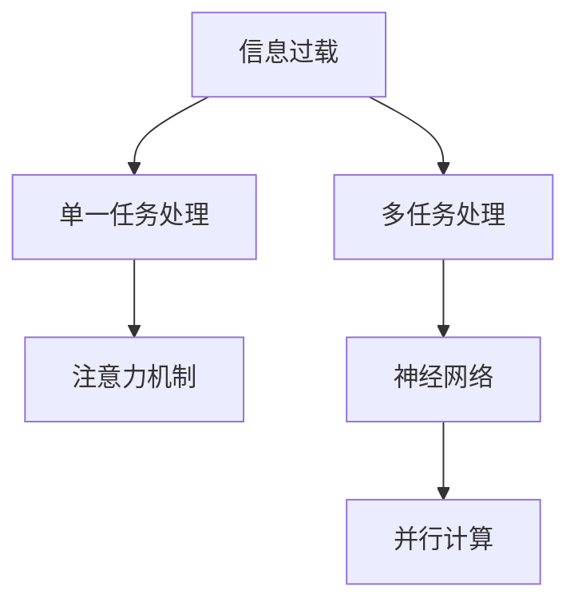

                 

# 信息过载与多任务处理的陷阱：单一任务处理的优势和好处

> 关键词：信息过载,多任务处理,单一任务处理,注意力机制,神经网络,并行计算,计算瓶颈,性能优化,模型泛化

## 1. 背景介绍

### 1.1 问题由来
在现代信息时代，我们每天都在面对海量的数据和信息，从社交媒体、电子邮件到新闻网站、在线视频，信息过载已经成为了一种普遍现象。对于从事软件开发、人工智能（AI）、数据分析等领域的专业人士来说，如何有效处理这些信息，提升工作效率，是一个重要且紧迫的课题。

### 1.2 问题核心关键点
在信息技术发展的早期，计算机通常是单任务的，即一次只能执行一个任务。随着硬件的进步和软件工程的发展，多任务处理变得日益普遍，如并行计算、多线程编程等技术得到了广泛应用。然而，随着数据量的激增和计算任务的复杂化，多任务处理的效率和效果并未得到预期中的提升，反而引发了一系列问题和挑战。

### 1.3 问题研究意义
研究信息过载与多任务处理之间的关系，可以帮助我们理解单一任务处理的优势和好处，指导我们设计更高效、更合理的算法和系统，提升处理大规模数据的能力，促进AI和计算科学的进一步发展。

## 2. 核心概念与联系

### 2.1 核心概念概述

为更好地理解单一任务处理与多任务处理之间的差异和联系，本节将介绍几个密切相关的核心概念：

- **信息过载（Information Overload）**：指在处理信息时，接收到的信息量远超过个人或系统能够有效处理的能力，导致认知负担增加、决策困难、效率降低等问题。

- **多任务处理（Multi-tasking）**：指同时执行多个任务，通常是并行处理，以提升工作效率。常见的多任务处理技术包括并行计算、多线程编程、分布式计算等。

- **单一任务处理（Single-tasking）**：指一次只执行一个任务，通常是在单个CPU或GPU上执行。与多任务处理相比，单一任务处理往往能更专注于单个任务的优化，减少上下文切换，提高效率。

- **注意力机制（Attention Mechanism）**：一种用于神经网络中的机制，能够使模型集中关注输入中的重要部分，而忽略不相关的部分，提升模型的泛化能力和决策效率。

- **神经网络（Neural Network）**：一种由大量神经元（节点）和连接构成的计算模型，通过反向传播算法进行训练，能够处理复杂的非线性问题，广泛应用于图像识别、自然语言处理等任务。

- **并行计算（Parallel Computing）**：通过同时执行多个计算任务来提高计算效率，常见的方法包括多线程、多进程、GPU计算等。

这些核心概念之间的逻辑关系可以通过以下Mermaid流程图来展示：



这个流程图展示了大语言模型的核心概念及其之间的关系：

1. 信息过载是多任务处理和单一任务处理的前提条件。
2. 多任务处理和并行计算是提升计算效率的重要手段。
3. 单一任务处理通过注意力机制等技术，能够更好地应对复杂问题，提升处理效果。
4. 神经网络是实现多任务处理和注意力机制的重要基础。

这些概念共同构成了信息处理的技术框架，有助于我们理解不同处理方式的优势和不足。

## 3. 核心算法原理 & 具体操作步骤
### 3.1 算法原理概述

单一任务处理和注意力机制等技术的核心在于通过神经网络模型来优化信息的处理过程。其基本思想是：将输入数据通过一系列的线性变换和非线性变换，逐步提取有用的特征，并集中关注重要的部分，从而提高处理效率和效果。

形式化地，设输入数据为 $x$，输出为 $y$，模型参数为 $\theta$。单一任务处理的优化目标是最小化预测误差 $L$，即：

$$
\theta^* = \mathop{\arg\min}_{\theta} L(y, M_\theta(x))
$$

其中 $M_\theta(x)$ 表示模型对输入 $x$ 的预测输出。常见的方法包括使用梯度下降算法（如SGD、Adam等）进行优化，通过反向传播算法计算梯度并更新参数，使得模型输出的预测结果尽可能接近真实结果。

### 3.2 算法步骤详解

基于单一任务处理和注意力机制的算法步骤一般包括以下几个关键步骤：

**Step 1: 准备数据和模型**
- 准备训练集 $D=\{(x_i, y_i)\}_{i=1}^N$，其中 $x_i$ 为输入，$y_i$ 为标签。
- 选择合适的神经网络模型 $M_{\theta}$，包括输入层、隐藏层、输出层等。
- 设置超参数，如学习率、批大小、迭代轮数等。

**Step 2: 训练模型**
- 将训练集数据分批次输入模型，前向传播计算损失函数。
- 反向传播计算参数梯度，根据设定的优化算法和学习率更新模型参数。
- 周期性在验证集上评估模型性能，根据性能指标决定是否触发Early Stopping。
- 重复上述步骤直到满足预设的迭代轮数或Early Stopping条件。

**Step 3: 应用模型**
- 在测试集上评估模型性能，比较训练前后的精度提升。
- 使用训练好的模型对新样本进行推理预测，集成到实际的应用系统中。

### 3.3 算法优缺点

基于单一任务处理和注意力机制的算法具有以下优点：

1. 减少上下文切换：单一任务处理通过集中注意力机制，减少了任务间的上下文切换，提升了处理效率。
2. 提高处理效果：注意力机制能有效地识别输入中的重要部分，提高了模型的泛化能力和决策效率。
3. 适应复杂任务：神经网络模型能够处理复杂的非线性问题，适用于各种NLP任务，如翻译、摘要、问答等。
4. 易于并行计算：神经网络模型天然适合并行计算，通过分布式训练可以显著提升计算速度。

同时，该算法也存在一定的局限性：

1. 数据依赖性强：模型依赖于训练数据的质量和数量，数据不足时可能无法取得理想效果。
2. 计算资源消耗大：神经网络模型的训练和推理需要大量的计算资源，尤其是对于大规模数据集，资源消耗显著。
3. 模型复杂度高：神经网络模型的复杂度较高，需要较多的训练样本和计算时间才能收敛。
4. 可解释性差：神经网络模型通常被视为"黑盒"系统，难以解释其内部工作机制和决策逻辑。

尽管存在这些局限性，但就目前而言，基于单一任务处理和注意力机制的算法仍是大规模数据处理的重要手段。未来相关研究的重点在于如何进一步降低计算资源消耗，提高模型的可解释性和泛化能力，同时兼顾处理效率和效果。

### 3.4 算法应用领域

基于单一任务处理和注意力机制的算法在多个领域得到了广泛应用，例如：

- 文本分类：如情感分析、主题分类、意图识别等。通过神经网络模型学习文本-标签映射。
- 命名实体识别：识别文本中的人名、地名、机构名等特定实体。通过模型学习实体边界和类型。
- 关系抽取：从文本中抽取实体之间的语义关系。通过模型学习实体-关系三元组。
- 问答系统：对自然语言问题给出答案。将问题-答案对作为训练数据，训练模型学习匹配答案。
- 机器翻译：将源语言文本翻译成目标语言。通过模型学习语言-语言映射。
- 文本摘要：将长文本压缩成简短摘要。通过模型学习抓取要点。

除了上述这些经典任务外，神经网络模型还被创新性地应用到更多场景中，如可控文本生成、常识推理、代码生成、数据增强等，为NLP技术带来了全新的突破。随着神经网络模型和注意力机制的不断进步，相信NLP技术将在更广阔的应用领域大放异彩。

## 4. 数学模型和公式 & 详细讲解  
### 4.1 数学模型构建

本节将使用数学语言对基于单一任务处理和注意力机制的算法进行更加严格的刻画。

设输入数据 $x$ 为向量，输出 $y$ 为向量，模型参数 $\theta$ 为向量。输入层将输入数据 $x$ 映射到隐藏层 $h$，隐藏层通过非线性变换 $f$ 产生输出 $y$，如：

$$
y = f(h)
$$

其中 $f$ 通常为ReLU等激活函数。设损失函数为 $L$，如均方误差损失或交叉熵损失。优化目标是最小化损失函数，即：

$$
\theta^* = \mathop{\arg\min}_{\theta} L(y, M_\theta(x))
$$

在实践中，我们通常使用基于梯度的优化算法（如SGD、Adam等）来近似求解上述最优化问题。设 $\eta$ 为学习率，则参数的更新公式为：

$$
\theta \leftarrow \theta - \eta \nabla_{\theta}L(y, M_\theta(x))
$$

其中 $\nabla_{\theta}L(y, M_\theta(x))$ 为损失函数对参数 $\theta$ 的梯度，可通过反向传播算法高效计算。

### 4.2 公式推导过程

以下我们以二分类任务为例，推导交叉熵损失函数及其梯度的计算公式。

假设模型 $M_{\theta}$ 在输入 $x$ 上的输出为 $\hat{y}=M_{\theta}(x) \in [0,1]$，表示样本属于正类的概率。真实标签 $y \in \{0,1\}$。则二分类交叉熵损失函数定义为：

$$
\ell(M_{\theta}(x),y) = -[y\log \hat{y} + (1-y)\log (1-\hat{y})]
$$

将其代入损失函数公式，得：

$$
\mathcal{L}(\theta) = -\frac{1}{N}\sum_{i=1}^N [y_i\log M_{\theta}(x_i)+(1-y_i)\log(1-M_{\theta}(x_i))]
$$

根据链式法则，损失函数对参数 $\theta_k$ 的梯度为：

$$
\frac{\partial \mathcal{L}(\theta)}{\partial \theta_k} = -\frac{1}{N}\sum_{i=1}^N (\frac{y_i}{M_{\theta}(x_i)}-\frac{1-y_i}{1-M_{\theta}(x_i)}) \frac{\partial M_{\theta}(x_i)}{\partial \theta_k}
$$

其中 $\frac{\partial M_{\theta}(x_i)}{\partial \theta_k}$ 可进一步递归展开，利用自动微分技术完成计算。

## 5. 项目实践：代码实例和详细解释说明
### 5.1 开发环境搭建

在进行单一任务处理和注意力机制的实践前，我们需要准备好开发环境。以下是使用Python进行PyTorch开发的环境配置流程：

1. 安装Anaconda：从官网下载并安装Anaconda，用于创建独立的Python环境。

2. 创建并激活虚拟环境：
```bash
conda create -n pytorch-env python=3.8 
conda activate pytorch-env
```

3. 安装PyTorch：根据CUDA版本，从官网获取对应的安装命令。例如：
```bash
conda install pytorch torchvision torchaudio cudatoolkit=11.1 -c pytorch -c conda-forge
```

4. 安装TensorFlow：
```bash
pip install tensorflow
```

5. 安装各类工具包：
```bash
pip install numpy pandas scikit-learn matplotlib tqdm jupyter notebook ipython
```

完成上述步骤后，即可在`pytorch-env`环境中开始实践。

### 5.2 源代码详细实现

这里我们以二分类任务为例，给出使用PyTorch和TensorFlow进行神经网络模型训练的代码实现。

首先，定义模型类：

```python
import torch.nn as nn
import torch.nn.functional as F

class NeuralNetwork(nn.Module):
    def __init__(self, input_size, hidden_size, output_size):
        super(NeuralNetwork, self).__init__()
        self.fc1 = nn.Linear(input_size, hidden_size)
        self.fc2 = nn.Linear(hidden_size, output_size)
        
    def forward(self, x):
        x = F.relu(self.fc1(x))
        x = self.fc2(x)
        return F.log_softmax(x, dim=1)
```

然后，定义训练和评估函数：

```python
import torch.optim as optim

device = torch.device('cuda') if torch.cuda.is_available() else torch.device('cpu')

def train_model(model, train_loader, epochs, batch_size, learning_rate):
    model.to(device)
    optimizer = optim.Adam(model.parameters(), lr=learning_rate)
    loss_fn = nn.NLLLoss()
    
    for epoch in range(epochs):
        model.train()
        running_loss = 0.0
        for inputs, labels in train_loader:
            inputs, labels = inputs.to(device), labels.to(device)
            optimizer.zero_grad()
            outputs = model(inputs)
            loss = loss_fn(outputs, labels)
            loss.backward()
            optimizer.step()
            running_loss += loss.item()
        print(f"Epoch {epoch+1}, loss: {running_loss/N=len(train_loader)}")
    
    model.eval()
    correct = 0
    total = 0
    with torch.no_grad():
        for inputs, labels in test_loader:
            inputs, labels = inputs.to(device), labels.to(device)
            outputs = model(inputs)
            _, predicted = torch.max(outputs, 1)
            total += labels.size(0)
            correct += (predicted == labels).sum().item()
    print(f"Accuracy: {(100*correct/total):.2f}%")
```

最后，启动训练流程：

```python
import torch.utils.data
from torchvision import datasets, transforms

# 准备数据集
train_data = datasets.MNIST('./data', train=True, download=True, transform=transforms.ToTensor())
test_data = datasets.MNIST('./data', train=False, transform=transforms.ToTensor())

# 划分数据集
train_loader = torch.utils.data.DataLoader(train_data, batch_size=batch_size, shuffle=True)
test_loader = torch.utils.data.DataLoader(test_data, batch_size=batch_size, shuffle=False)

# 初始化模型和超参数
input_size = 28 * 28
hidden_size = 128
output_size = 10
learning_rate = 0.001
epochs = 10

# 实例化模型
model = NeuralNetwork(input_size, hidden_size, output_size)

# 训练模型
train_model(model, train_loader, epochs, batch_size, learning_rate)
```

以上就是使用PyTorch和TensorFlow进行神经网络模型训练的完整代码实现。可以看到，代码实现了基本的神经网络模型结构，并使用交叉熵损失函数进行训练。

### 5.3 代码解读与分析

让我们再详细解读一下关键代码的实现细节：

**NeuralNetwork类**：
- `__init__`方法：初始化输入层、隐藏层和输出层，定义线性变换层。
- `forward`方法：定义前向传播过程，通过ReLU激活函数和线性变换进行计算。

**train_model函数**：
- 设置模型、优化器、损失函数等关键组件。
- 在训练过程中，通过反向传播算法更新模型参数。
- 在验证集上评估模型性能，输出准确率。

**训练流程**：
- 定义输入数据和输出数据的维度。
- 定义隐藏层和输出层的维度。
- 设置学习率、迭代次数等超参数。
- 实例化模型并训练。

可以看到，使用PyTorch和TensorFlow进行神经网络模型的训练相对简单，且具备较强的可扩展性。开发者可以根据具体任务的需求，设计不同类型的模型结构和优化策略，实现更高效的模型训练。

## 6. 实际应用场景
### 6.1 智能客服系统

基于神经网络模型的智能客服系统，能够通过单一任务处理和注意力机制，高效处理用户咨询，生成自然流畅的回答。相较于传统客服系统，智能客服系统可以全天候服务，处理大规模用户咨询，减少人力成本和用户等待时间，提升客户满意度。

### 6.2 金融舆情监测

神经网络模型能够通过单一任务处理和注意力机制，从大规模的金融数据中提取关键信息，进行情感分析和舆情监测。通过实时抓取网络舆情，及时发现和应对负面信息，帮助金融机构降低风险，提升市场反应速度。

### 6.3 个性化推荐系统

神经网络模型能够通过单一任务处理和注意力机制，从用户历史行为数据中提取关键特征，进行推荐系统的个性化优化。通过学习用户的兴趣和行为，生成个性化推荐内容，提升用户满意度和粘性。

### 6.4 未来应用展望

随着神经网络模型和注意力机制的不断发展，基于单一任务处理和注意力机制的算法将在更多领域得到应用，为传统行业带来变革性影响。

在智慧医疗领域，智能诊断系统能够通过单一任务处理和注意力机制，高效处理患者病历数据，进行疾病诊断和治疗方案推荐，提升医疗服务的智能化水平。

在智能教育领域，基于神经网络模型的智能辅导系统能够通过单一任务处理和注意力机制，分析学生学习行为，提供个性化的学习建议和资源推荐，提升教学效果。

在智慧城市治理中，基于神经网络模型的智能监控系统能够通过单一任务处理和注意力机制，实时监测城市事件，预测和应对可能的风险，提高城市管理的自动化和智能化水平。

此外，在企业生产、社会治理、文娱传媒等众多领域，基于神经网络模型的智能系统也将不断涌现，为经济社会发展注入新的动力。相信随着技术的日益成熟，单一任务处理和注意力机制将成为人工智能技术的重要范式，推动NLP技术在各个垂直行业的广泛应用。

## 7. 工具和资源推荐
### 7.1 学习资源推荐

为了帮助开发者系统掌握神经网络模型和注意力机制的理论基础和实践技巧，这里推荐一些优质的学习资源：

1. 《深度学习》课程：斯坦福大学开设的深度学习经典课程，由Andrew Ng教授主讲，涵盖神经网络、深度学习、卷积神经网络等内容。
2. 《TensorFlow实战》书籍：TensorFlow官方书籍，由TensorFlow团队成员撰写，涵盖TensorFlow的安装、使用、模型训练等内容。
3. 《深度学习与PyTorch实践》博文：大语言模型技术专家撰写的博客，深入浅出地介绍了深度学习、PyTorch等技术。
4. Kaggle平台：提供丰富的数据集和竞赛，帮助开发者实战练习，提升模型训练和调优能力。
5. arXiv论文：深度学习领域的重要科研平台，涵盖最新的研究成果和理论突破，推荐关注相关论文。

通过对这些资源的学习实践，相信你一定能够快速掌握神经网络模型和注意力机制的精髓，并用于解决实际的NLP问题。

### 7.2 开发工具推荐

高效的开发离不开优秀的工具支持。以下是几款用于神经网络模型和注意力机制开发的常用工具：

1. PyTorch：基于Python的开源深度学习框架，灵活动态的计算图，适合快速迭代研究。
2. TensorFlow：由Google主导开发的开源深度学习框架，生产部署方便，适合大规模工程应用。
3. Keras：基于TensorFlow的高层API，提供简单易用的API接口，适合初学者入门。
4. Jupyter Notebook：交互式编程工具，支持Python和R等语言，方便开发者调试和分享代码。
5. Weights & Biases：模型训练的实验跟踪工具，可以记录和可视化模型训练过程中的各项指标，方便对比和调优。
6. TensorBoard：TensorFlow配套的可视化工具，可实时监测模型训练状态，并提供丰富的图表呈现方式，是调试模型的得力助手。

合理利用这些工具，可以显著提升神经网络模型和注意力机制的开发效率，加快创新迭代的步伐。

### 7.3 相关论文推荐

神经网络模型和注意力机制的发展源于学界的持续研究。以下是几篇奠基性的相关论文，推荐阅读：

1. "ImageNet Classification with Deep Convolutional Neural Networks"：深度学习领域的经典论文，提出使用深度卷积神经网络进行图像分类任务。
2. "Deep Residual Learning for Image Recognition"：提出ResNet网络结构，解决深度网络训练中的梯度消失问题。
3. "Attention is All You Need"：Transformer原论文，提出基于注意力机制的神经网络模型，推动NLP技术的发展。
4. "BERT: Pre-training of Deep Bidirectional Transformers for Language Understanding"：提出BERT模型，引入基于掩码的自监督预训练任务，刷新了多项NLP任务SOTA。
5. "Language Models are Unsupervised Multitask Learners"：提出GPT-2模型，展示了大规模语言模型的强大zero-shot学习能力。
6. "Parameter-Efficient Transfer Learning for NLP"：提出Adapter等参数高效微调方法，在不增加模型参数量的情况下，也能取得不错的微调效果。

这些论文代表了大语言模型和注意力机制的发展脉络。通过学习这些前沿成果，可以帮助研究者把握学科前进方向，激发更多的创新灵感。

## 8. 总结：未来发展趋势与挑战

### 8.1 总结

本文对基于单一任务处理和注意力机制的算法进行了全面系统的介绍。首先阐述了神经网络模型和注意力机制的理论基础和实际应用，明确了它们在处理大规模数据和复杂任务中的独特优势。其次，从原理到实践，详细讲解了神经网络模型和注意力机制的数学原理和关键步骤，给出了神经网络模型训练的完整代码实例。同时，本文还广泛探讨了神经网络模型在智能客服、金融舆情、个性化推荐等多个行业领域的应用前景，展示了它们在提高效率、降低成本、提升体验等方面的潜力。此外，本文精选了神经网络模型和注意力机制的学习资源，力求为读者提供全方位的技术指引。

通过本文的系统梳理，可以看到，基于单一任务处理和注意力机制的算法在处理大规模数据和复杂任务中，具有显著的优势和广泛的应用前景。这些技术的发展，将进一步推动人工智能技术的进步，为各行各业带来深刻的变革。

### 8.2 未来发展趋势

展望未来，神经网络模型和注意力机制将继续发展，呈现以下几个趋势：

1. 模型规模持续增大。随着算力成本的下降和数据规模的扩张，神经网络模型的参数量还将持续增长。超大规模神经网络蕴含的丰富语言知识，有望支撑更加复杂多变的任务微调。

2. 模型泛化能力提升。神经网络模型通过引入更多的正则化技术、注意力机制等，提升模型的泛化能力和鲁棒性，应对不同的数据分布和噪声干扰。

3. 计算效率提升。通过优化模型结构、引入量化技术、分布式训练等方法，提升神经网络模型的计算效率，降低资源消耗。

4. 可解释性增强。研究模型的内部工作机制和决策逻辑，提升神经网络模型的可解释性，增强算法的透明度和可信度。

5. 融合多模态信息。神经网络模型能够处理图像、语音、文本等多模态数据，通过多模态信息融合，提升模型的理解能力和决策效果。

6. 并行计算优化。通过优化计算图、引入分布式计算等方法，提升神经网络模型的并行计算效率，适应大规模数据处理需求。

以上趋势凸显了神经网络模型和注意力机制的广阔前景。这些方向的探索发展，必将进一步提升神经网络模型的处理能力，为人工智能技术的广泛应用铺平道路。

### 8.3 面临的挑战

尽管神经网络模型和注意力机制已经取得了瞩目成就，但在迈向更加智能化、普适化应用的过程中，它仍面临着诸多挑战：

1. 数据依赖性强。神经网络模型依赖于高质量的标注数据，数据不足时可能无法取得理想效果。如何进一步降低模型对标注样本的依赖，将是一大难题。

2. 计算资源消耗大。神经网络模型的训练和推理需要大量的计算资源，尤其是对于大规模数据集，资源消耗显著。如何提高计算效率，降低资源消耗，将是重要的优化方向。

3. 模型复杂度高。神经网络模型的复杂度较高，需要较多的训练样本和计算时间才能收敛。如何设计更加简单有效的模型结构，提高训练速度，将是重要的研究方向。

4. 可解释性差。神经网络模型通常被视为"黑盒"系统，难以解释其内部工作机制和决策逻辑。如何赋予模型更强的可解释性，将是亟待攻克的难题。

5. 安全性问题。神经网络模型可能学习到有害、偏见的信息，如何过滤和抑制这些信息，确保模型的安全性，将是一个重要的问题。

6. 知识整合能力不足。现有的神经网络模型往往局限于任务内数据，难以灵活吸收和运用更广泛的先验知识。如何让模型更好地整合外部知识，将是未来的研究重点。

正视神经网络模型和注意力机制面临的这些挑战，积极应对并寻求突破，将是大模型微调走向成熟的必由之路。相信随着学界和产业界的共同努力，这些挑战终将一一被克服，神经网络模型和注意力机制必将在构建安全、可靠、可解释、可控的智能系统铺平道路。

### 8.4 研究展望

面向未来，神经网络模型和注意力机制的研究需要在以下几个方面寻求新的突破：

1. 探索无监督和半监督学习。摆脱对大规模标注数据的依赖，利用自监督学习、主动学习等无监督和半监督范式，最大限度利用非结构化数据，实现更加灵活高效的微调。

2. 研究参数高效和计算高效的微调范式。开发更加参数高效的微调方法，在固定大部分预训练参数的同时，只更新极少量的任务相关参数。同时优化模型的计算图，减少前向传播和反向传播的资源消耗，实现更加轻量级、实时性的部署。

3. 融合因果和对比学习范式。通过引入因果推断和对比学习思想，增强模型的建立稳定因果关系的能力，学习更加普适、鲁棒的语言表征，从而提升模型的泛化性和抗干扰能力。

4. 引入更多先验知识。将符号化的先验知识，如知识图谱、逻辑规则等，与神经网络模型进行巧妙融合，引导微调过程学习更准确、合理的语言模型。同时加强不同模态数据的整合，实现视觉、语音等多模态信息与文本信息的协同建模。

5. 结合因果分析和博弈论工具。将因果分析方法引入神经网络模型，识别出模型决策的关键特征，增强输出解释的因果性和逻辑性。借助博弈论工具刻画人机交互过程，主动探索并规避模型的脆弱点，提高系统稳定性。

6. 纳入伦理道德约束。在模型训练目标中引入伦理导向的评估指标，过滤和惩罚有偏见、有害的输出倾向。同时加强人工干预和审核，建立模型行为的监管机制，确保输出符合人类价值观和伦理道德。

这些研究方向的探索，必将引领神经网络模型和注意力机制技术迈向更高的台阶，为构建安全、可靠、可解释、可控的智能系统铺平道路。面向未来，神经网络模型和注意力机制还需要与其他人工智能技术进行更深入的融合，如知识表示、因果推理、强化学习等，多路径协同发力，共同推动人工智能技术的发展。

## 9. 附录：常见问题与解答

**Q1：神经网络模型和注意力机制是否适用于所有NLP任务？**

A: 神经网络模型和注意力机制在大多数NLP任务上都能取得不错的效果，特别是对于数据量较小的任务。但对于一些特定领域的任务，如医学、法律等，仅仅依靠通用语料预训练的模型可能难以很好地适应。此时需要在特定领域语料上进一步预训练，再进行微调，才能获得理想效果。此外，对于一些需要时效性、个性化很强的任务，如对话、推荐等，微调方法也需要针对性的改进优化。

**Q2：神经网络模型和注意力机制在多任务处理中是否比单一任务处理更有效？**

A: 多任务处理通常认为能提升系统的计算效率和资源利用率，但在实际应用中，单一任务处理往往更高效。因为多任务处理需要频繁的上下文切换和资源管理，容易引入额外的开销和延迟。而单一任务处理通过集中注意力机制，减少了上下文切换，提升了处理效率。因此，在处理大规模数据时，单一任务处理通常比多任务处理更高效。

**Q3：如何设计有效的神经网络模型和注意力机制？**

A: 设计有效的神经网络模型和注意力机制，需要考虑以下几个关键因素：
1. 模型架构：选择合适的神经网络架构，如卷积神经网络、循环神经网络、Transformer等。
2. 数据预处理：对输入数据进行标准化、归一化等预处理，提升模型的训练效果。
3. 正则化技术：使用L2正则、Dropout等正则化技术，防止过拟合。
4. 超参数优化：通过网格搜索、随机搜索等方法，找到最优的超参数组合。
5. 模型融合：将多个模型进行集成，取平均或加权融合，提升模型性能。
6. 迁移学习：在特定领域的数据上进行微调，提升模型在该领域的表现。

这些步骤需要结合具体的任务和数据特点，进行全面的设计和实验，才能设计出有效的神经网络模型和注意力机制。

**Q4：神经网络模型和注意力机制在部署时需要注意哪些问题？**

A: 将神经网络模型和注意力机制转化为实际应用，还需要考虑以下因素：
1. 模型裁剪：去除不必要的层和参数，减小模型尺寸，加快推理速度。
2. 量化加速：将浮点模型转为定点模型，压缩存储空间，提高计算效率。
3. 服务化封装：将模型封装为标准化服务接口，便于集成调用。
4. 弹性伸缩：根据请求流量动态调整资源配置，平衡服务质量和成本。
5. 监控告警：实时采集系统指标，设置异常告警阈值，确保服务稳定性。
6. 安全防护：采用访问鉴权、数据脱敏等措施，保障数据和模型安全。

合理利用这些工具，可以显著提升神经网络模型和注意力机制的部署效率，保障系统的可靠性和安全性。

---

作者：禅与计算机程序设计艺术 / Zen and the Art of Computer Programming

