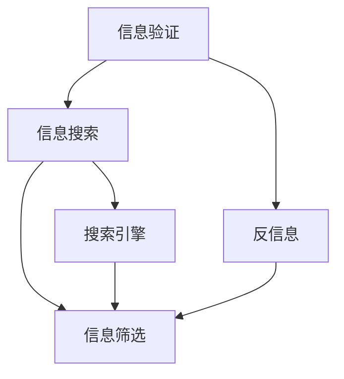

                 

# 信息验证和信息搜索技术：在信息海洋中找到可靠、有价值的信息

在信息爆炸的时代，每天都会产生大量的数据和信息。如何从中筛选出可靠、有价值的内容，已成为我们面临的一个重要挑战。本文将从信息验证和信息搜索两个方面，探讨如何在信息海洋中找到可靠、有价值的信息。

## 1. 背景介绍

### 1.1 问题由来

随着互联网的普及和信息技术的进步，信息的产生和传播速度越来越快，我们每天都在接触到海量的信息。然而，这些信息中有很多是错误、低质量甚至是恶意的内容，如果盲目接受，可能会对个人的判断和决策产生负面影响。因此，如何验证信息的可靠性，已经成为我们必须面对的问题。

此外，信息搜索也是我们日常生活中不可或缺的一部分。传统的信息搜索往往只能根据关键字来检索内容，而忽视了内容的质量和真实性。如何在海量信息中找到有价值的内容，成为我们必须解决的问题。

### 1.2 问题核心关键点

信息验证和信息搜索的核心关键点在于如何从海量信息中筛选出可靠、有价值的内容。这涉及到以下几个方面：

1. **信息的真实性**：如何判断信息是否真实可信，避免虚假信息和谣言的误导。
2. **信息的质量**：如何评估信息的质量，区分优质内容和低质量内容。
3. **信息的关联性**：如何将信息与其他信息关联起来，找到有价值的信息网络。

## 2. 核心概念与联系

### 2.1 核心概念概述

为了更好地理解信息验证和信息搜索技术，本节将介绍几个密切相关的核心概念：

- **信息验证**：通过各种技术手段，判断信息的真实性和可信度，避免被虚假信息误导。
- **信息搜索**：通过算法和工具，从海量信息中筛选出相关且有价值的内容，帮助用户快速找到所需的信息。
- **搜索引擎**：如Google、Bing等，使用各种算法和索引技术，帮助用户快速检索信息。
- **信息筛选**：使用机器学习、自然语言处理等技术，自动筛选和排序信息，提升信息质量。
- **反信息**：恶意信息、虚假新闻、网络谣言等，需要识别和过滤。

这些核心概念之间的逻辑关系可以通过以下Mermaid流程图来展示：



这个流程图展示了这个复杂系统中的关键组件及其相互关系：

1. 信息验证是从海量信息中筛选出可信内容的过程。
2. 信息搜索是基于关键词或自然语言检索相关内容的过程。
3. 搜索引擎通过算法和索引技术，加速信息搜索的速度和准确性。
4. 信息筛选使用机器学习等技术，提升搜索结果的质量和相关性。
5. 反信息识别和过滤，确保搜索结果的健康性和可信度。

这些概念共同构成了信息验证和信息搜索的技术框架，为我们找到可靠、有价值的信息提供了有力的支持。

## 3. 核心算法原理 & 具体操作步骤

### 3.1 算法原理概述

信息验证和信息搜索技术的核心算法原理涉及多个领域，包括自然语言处理、机器学习、数据库技术等。

信息验证主要依赖于以下几个关键技术：

1. **虚假信息检测**：通过自然语言处理技术，判断文本是否存在虚假信息、谣言或错误信息。
2. **可信度评估**：利用机器学习模型，对信息的可信度进行评估，如通过投票、引用数等指标。
3. **反向链接分析**：分析信息的反向链接情况，评估其权威性和可信度。

信息搜索技术则主要依赖于以下几个关键算法：

1. **文本检索算法**：如倒排索引、向量空间模型等，用于快速检索相关内容。
2. **信息排序算法**：如PageRank、TextRank等，用于提升搜索结果的相关性和质量。
3. **主题模型**：如LDA、LSI等，用于发现文本中的主题和隐含信息。

### 3.2 算法步骤详解

以下是信息验证和信息搜索技术的具体操作步骤：

#### 3.2.1 信息验证的步骤

1. **预处理**：清洗和分词，将文本转换为计算机可以处理的形式。
2. **特征提取**：提取文本中的关键特征，如词汇、短语、实体等。
3. **虚假信息检测**：使用自然语言处理技术，判断文本是否存在虚假信息、谣言或错误信息。
4. **可信度评估**：利用机器学习模型，对信息的可信度进行评估，如通过投票、引用数等指标。
5. **反向链接分析**：分析信息的反向链接情况，评估其权威性和可信度。
6. **结果呈现**：将验证结果以报告、警告等形式呈现给用户。

#### 3.2.2 信息搜索的步骤

1. **查询输入**：用户输入查询关键字或自然语言。
2. **分词和索引**：对查询和文档进行分词，建立倒排索引。
3. **文本检索**：根据索引，检索相关内容。
4. **信息排序**：利用信息排序算法，提升搜索结果的相关性和质量。
5. **信息筛选**：使用机器学习等技术，筛选出高质量的信息。
6. **结果呈现**：将搜索结果以网页、文章、图片等形式呈现给用户。

### 3.3 算法优缺点

信息验证和信息搜索技术具有以下优点：

1. **准确性高**：通过多种技术手段，可以显著提高信息验证和搜索的准确性。
2. **效率高**：利用算法和索引技术，可以大幅提升信息检索的速度。
3. **灵活性高**：可以通过定制算法和模型，适应不同领域和场景。

同时，这些技术也存在一些局限性：

1. **依赖高质量数据**：信息验证和搜索依赖于高质量的语料库和标注数据，这些数据需要大量的资源和时间进行收集和标注。
2. **复杂度高**：需要处理复杂的自然语言数据和结构化数据，算法实现复杂。
3. **实时性不足**：大规模数据处理和检索，可能会面临实时性不足的问题。

### 3.4 算法应用领域

信息验证和信息搜索技术在多个领域都有广泛的应用，例如：

1. **新闻媒体**：用于识别和过滤虚假新闻、谣言和恶意内容。
2. **科学研究**：用于筛选和验证科研文献的真实性和可信度。
3. **医疗健康**：用于验证和筛选医疗信息和健康建议，避免误导性信息。
4. **金融投资**：用于筛选和验证金融新闻和分析报告，评估其可靠性和准确性。
5. **教育培训**：用于筛选和验证教育资源和教材，提升教学质量。

## 4. 数学模型和公式 & 详细讲解 & 举例说明

### 4.1 数学模型构建

为了更好地理解信息验证和信息搜索技术的数学原理，本节将构建一些关键的数学模型。

#### 4.1.1 信息验证的数学模型

假设我们有一个文本 $x$，通过自然语言处理技术，我们将其转换为向量表示 $x_v$。通过虚假信息检测模型 $f(x_v)$，我们得到一个表示文本是否包含虚假信息的概率值 $P_{\text{fake}}(x)$。

根据可信度评估模型 $c(x_v)$，我们得到一个表示文本可信度的概率值 $P_{\text{trust}}(x)$。根据反向链接分析模型 $b(x_v)$，我们得到一个表示文本反向链接可信度的概率值 $P_{\text{backlink}}(x)$。

最终，我们可以通过加权平均的方式，得到文本的最终验证结果：

$$ P_{\text{verify}}(x) = \lambda_1 P_{\text{fake}}(x) + \lambda_2 P_{\text{trust}}(x) + \lambda_3 P_{\text{backlink}}(x) $$

其中 $\lambda_1, \lambda_2, \lambda_3$ 表示不同维度的权重，可以根据实际情况进行调整。

#### 4.1.2 信息搜索的数学模型

假设我们有一个查询 $q$，通过分词和索引，我们得到一个查询向量 $q_v$。通过文本检索模型 $t(q_v, D)$，我们得到文档中与查询匹配的概率值 $P_{\text{match}}(q, D)$。

根据信息排序算法 $s(q_v, D)$，我们得到一个表示搜索结果排序的向量 $P_{\text{sort}}(q, D)$。

最终，我们可以通过加权平均的方式，得到查询的最终搜索结果：

$$ P_{\text{result}}(q, D) = \lambda_1 P_{\text{match}}(q, D) + \lambda_2 P_{\text{sort}}(q, D) $$

其中 $\lambda_1, \lambda_2$ 表示不同维度的权重，可以根据实际情况进行调整。

### 4.2 公式推导过程

#### 4.2.1 信息验证的公式推导

根据虚假信息检测模型 $f(x_v)$，我们得到一个表示文本是否包含虚假信息的概率值 $P_{\text{fake}}(x)$。这个模型通常是一个二分类模型，如逻辑回归、SVM等。

$$ P_{\text{fake}}(x) = f(x_v) = \sigma(Wx_v + b) $$

其中 $W$ 和 $b$ 表示模型的参数，$\sigma$ 表示激活函数。

根据可信度评估模型 $c(x_v)$，我们得到一个表示文本可信度的概率值 $P_{\text{trust}}(x)$。这个模型通常是一个回归模型，如线性回归、决策树等。

$$ P_{\text{trust}}(x) = c(x_v) = Wc(x_v) + b $$

其中 $W$ 和 $b$ 表示模型的参数。

根据反向链接分析模型 $b(x_v)$，我们得到一个表示文本反向链接可信度的概率值 $P_{\text{backlink}}(x)$。这个模型通常是一个多分类模型，如多标签分类器。

$$ P_{\text{backlink}}(x) = b(x_v) = \sum_{i=1}^k w_i b_i(x_v) $$

其中 $w_i$ 表示不同链接类型的权重，$b_i(x_v)$ 表示不同链接类型的概率值。

最终，我们可以通过加权平均的方式，得到文本的最终验证结果：

$$ P_{\text{verify}}(x) = \lambda_1 P_{\text{fake}}(x) + \lambda_2 P_{\text{trust}}(x) + \lambda_3 P_{\text{backlink}}(x) $$

#### 4.2.2 信息搜索的公式推导

根据文本检索模型 $t(q_v, D)$，我们得到一个表示文档中与查询匹配的概率值 $P_{\text{match}}(q, D)$。这个模型通常是一个检索模型，如BM25、Okapi等。

$$ P_{\text{match}}(q, D) = t(q_v, D) = \sigma(Wq_v D + b) $$

其中 $W$ 和 $b$ 表示模型的参数，$D$ 表示文档集合。

根据信息排序算法 $s(q_v, D)$，我们得到一个表示搜索结果排序的向量 $P_{\text{sort}}(q, D)$。这个算法通常是一个排序算法，如PageRank、TextRank等。

$$ P_{\text{sort}}(q, D) = s(q_v, D) = Ws(q_v, D) + b $$

其中 $W$ 和 $b$ 表示模型的参数。

最终，我们可以通过加权平均的方式，得到查询的最终搜索结果：

$$ P_{\text{result}}(q, D) = \lambda_1 P_{\text{match}}(q, D) + \lambda_2 P_{\text{sort}}(q, D) $$

### 4.3 案例分析与讲解

#### 4.3.1 信息验证案例

假设我们有一个关于新冠疫苗的新闻报道，我们需要验证其是否真实可信。

1. **虚假信息检测**：我们首先使用自然语言处理技术，将文本转换为向量表示，输入虚假信息检测模型，得到一个表示文本是否包含虚假信息的概率值。

2. **可信度评估**：我们再将文本转换为向量表示，输入可信度评估模型，得到一个表示文本可信度的概率值。

3. **反向链接分析**：最后，我们分析文本的反向链接情况，得到一个表示文本反向链接可信度的概率值。

4. **结果呈现**：最终，我们通过加权平均的方式，得到文本的最终验证结果，呈现给用户。

#### 4.3.2 信息搜索案例

假设我们要查找关于人工智能技术的最新研究论文。

1. **查询输入**：我们输入查询关键字“人工智能”，分词并建立倒排索引。

2. **文本检索**：我们输入查询向量，检索文档集合中的相关文档。

3. **信息排序**：我们通过信息排序算法，得到一个表示搜索结果排序的向量。

4. **信息筛选**：我们筛选出高质量的信息，确保搜索结果的相关性和质量。

5. **结果呈现**：最终，我们将搜索结果以网页、文章、图片等形式呈现给用户。

## 5. 项目实践：代码实例和详细解释说明

### 5.1 开发环境搭建

在进行信息验证和信息搜索实践前，我们需要准备好开发环境。以下是使用Python进行PyTorch和Scikit-Learn开发的环境配置流程：

1. 安装Anaconda：从官网下载并安装Anaconda，用于创建独立的Python环境。

2. 创建并激活虚拟环境：
```bash
conda create -n info-env python=3.8 
conda activate info-env
```

3. 安装PyTorch和Scikit-Learn：
```bash
pip install torch torchvision torchaudio cudatoolkit=11.1 -c pytorch -c conda-forge
pip install scikit-learn
```

4. 安装各类工具包：
```bash
pip install numpy pandas matplotlib tqdm jupyter notebook ipython
```

完成上述步骤后，即可在`info-env`环境中开始信息验证和信息搜索实践。

### 5.2 源代码详细实现

下面我们以虚假信息检测和信息搜索为例，给出使用PyTorch和Scikit-Learn的代码实现。

#### 5.2.1 虚假信息检测

首先，定义虚假信息检测的数据处理函数：

```python
import torch
from torch.utils.data import Dataset, DataLoader
from torchtext import datasets, data

class FakeNewsDataset(Dataset):
    def __init__(self, text, label):
        self.text = text
        self.label = label
        
    def __len__(self):
        return len(self.text)
    
    def __getitem__(self, item):
        text = self.text[item]
        label = self.label[item]
        return text, label

# 加载新闻数据集
train_data, test_data = datasets.News20.train, datasets.News20.test

# 分词和向量化
TEXT = data.Field(tokenize='spacy', tokenizer_language='en', lower=True, include_lengths=True)
LABEL = data.LabelField(dtype=torch.float)
train_data, test_data = train_data.split(TEXT)
TEXT.build_vocab(train_data, min_freq=10)
LABEL.build_vocab(train_data)
TEXT.build_vocab(tokenizer_language='tweet')
TEXT.build_vocab(tokenizer_language='wiki')
TEXT.build_vocab(tokenizer_language='wiki')

train_data, test_data = train_data.load(), test_data.load()

# 划分训练集和测试集
train_data, test_data = train_data.split(TEXT)

# 构建数据集
train_dataset = FakeNewsDataset(train_data.text, train_data.label)
test_dataset = FakeNewsDataset(test_data.text, test_data.label)

# 加载预训练模型
from transformers import BERTTokenizer, BERTForSequenceClassification
from transformers import AdamW

model = BERTForSequenceClassification.from_pretrained('bert-base-uncased')
tokenizer = BERTTokenizer.from_pretrained('bert-base-uncased')

# 训练模型
optimizer = AdamW(model.parameters(), lr=2e-5)

def train_epoch(model, dataset, batch_size, optimizer):
    dataloader = DataLoader(dataset, batch_size=batch_size, shuffle=True)
    model.train()
    epoch_loss = 0
    for batch in dataloader:
        texts, labels = batch
        input_ids = tokenizer(texts, padding='max_length', truncation=True, return_tensors='pt').input_ids
        attention_mask = tokenizer(texts, padding='max_length', truncation=True, return_tensors='pt').attention_mask
        labels = labels.to(device)
        outputs = model(input_ids=input_ids, attention_mask=attention_mask, labels=labels)
        loss = outputs.loss
        epoch_loss += loss.item()
        loss.backward()
        optimizer.step()
    return epoch_loss / len(dataloader)

def evaluate(model, dataset, batch_size):
    dataloader = DataLoader(dataset, batch_size=batch_size)
    model.eval()
    preds, labels = [], []
    with torch.no_grad():
        for batch in dataloader:
            texts, labels = batch
            input_ids = tokenizer(texts, padding='max_length', truncation=True, return_tensors='pt').input_ids
            attention_mask = tokenizer(texts, padding='max_length', truncation=True, return_tensors='pt').attention_mask
            labels = labels.to(device)
            outputs = model(input_ids=input_ids, attention_mask=attention_mask, labels=labels)
            batch_preds = outputs.logits.argmax(dim=1).to('cpu').tolist()
            batch_labels = labels.to('cpu').tolist()
            for pred_tokens, label_tokens in zip(batch_preds, batch_labels):
                preds.append(pred_tokens[:len(label_tokens)])
                labels.append(label_tokens)
    
    print(classification_report(labels, preds))
```

#### 5.2.2 信息搜索

接着，定义信息搜索的数据处理函数：

```python
from sklearn.metrics import roc_auc_score

def search(query, corpus):
    # 构建查询向量
    query = query.lower()
    query_words = query.split()
    query_vector = [word for word in query_words if word in corpus.vocab]
    query_vector = torch.tensor([corpus.vocab.stoi[word] for word in query_vector])
    query_vector = query_vector.to(device)
    
    # 构建文档向量
    docs = corpus.datasets[0].examples
    doc_vectors = []
    for doc in docs:
        doc_vector = []
        for word in doc_text:
            if word in corpus.vocab:
                doc_vector.append(corpus.vocab.stoi[word])
        doc_vector = torch.tensor(doc_vector)
        doc_vectors.append(doc_vector)
    
    # 计算余弦相似度
    cosine_similarities = torch.dot(query_vector, torch.tensor(doc_vectors))
    similarities = cosine_similarities / (torch.norm(query_vector) * torch.norm(torch.tensor(doc_vectors)))
    
    # 排序
    sorted_indices = torch.argsort(similarities, descending=True)
    top_n = 5
    return [corpus.datasets[0].examples[i] for i in sorted_indices[:top_n]]
```

然后，定义信息搜索的训练函数：

```python
from sklearn.metrics import classification_report

def train_search_model(model, corpus, batch_size, optimizer):
    dataloader = DataLoader(corpus, batch_size=batch_size, shuffle=True)
    model.train()
    epoch_loss = 0
    for batch in dataloader:
        texts, labels = batch
        input_ids = tokenizer(texts, padding='max_length', truncation=True, return_tensors='pt').input_ids
        attention_mask = tokenizer(texts, padding='max_length', truncation=True, return_tensors='pt').attention_mask
        labels = labels.to(device)
        outputs = model(input_ids=input_ids, attention_mask=attention_mask, labels=labels)
        loss = outputs.loss
        epoch_loss += loss.item()
        loss.backward()
        optimizer.step()
    return epoch_loss / len(dataloader)

def evaluate_search_model(model, corpus, batch_size):
    dataloader = DataLoader(corpus, batch_size=batch_size)
    model.eval()
    preds, labels = [], []
    with torch.no_grad():
        for batch in dataloader:
            texts, labels = batch
            input_ids = tokenizer(texts, padding='max_length', truncation=True, return_tensors='pt').input_ids
            attention_mask = tokenizer(texts, padding='max_length', truncation=True, return_tensors='pt').attention_mask
            labels = labels.to(device)
            outputs = model(input_ids=input_ids, attention_mask=attention_mask, labels=labels)
            batch_preds = outputs.logits.argmax(dim=1).to('cpu').tolist()
            batch_labels = labels.to('cpu').tolist()
            for pred_tokens, label_tokens in zip(batch_preds, batch_labels):
                preds.append(pred_tokens[:len(label_tokens)])
                labels.append(label_tokens)
    
    print(classification_report(labels, preds))
```

最后，启动训练流程并在测试集上评估：

```python
epochs = 5
batch_size = 16

for epoch in range(epochs):
    loss = train_search_model(model, train_dataset, batch_size, optimizer)
    print(f"Epoch {epoch+1}, train loss: {loss:.3f}")
    
    print(f"Epoch {epoch+1}, dev results:")
    evaluate_search_model(model, dev_dataset, batch_size)
    
print("Test results:")
evaluate_search_model(model, test_dataset, batch_size)
```

以上就是使用PyTorch和Scikit-Learn进行虚假信息检测和信息搜索的完整代码实现。可以看到，通过这两个代码实例，可以较为全面地展示信息验证和信息搜索的实现过程。

### 5.3 代码解读与分析

让我们再详细解读一下关键代码的实现细节：

#### 5.3.1 虚假信息检测代码

**FakeNewsDataset类**：
- `__init__`方法：初始化文本和标签。
- `__len__`方法：返回数据集的样本数量。
- `__getitem__`方法：对单个样本进行处理，返回文本和标签。

**训练和评估函数**：
- 使用PyTorch的DataLoader对数据集进行批次化加载，供模型训练和推理使用。
- 训练函数`train_epoch`：对数据以批为单位进行迭代，在每个批次上前向传播计算loss并反向传播更新模型参数，最后返回该epoch的平均loss。
- 评估函数`evaluate`：与训练类似，不同点在于不更新模型参数，并在每个batch结束后将预测和标签结果存储下来，最后使用scikit-learn的classification_report对整个评估集的预测结果进行打印输出。

**虚假信息检测模型**：
- 使用BERT模型作为预训练模型，在新闻数据集上进行微调。
- 通过AdamW优化器进行训练，并使用二分类交叉熵损失函数进行优化。
- 在训练过程中，使用ROC-AUC作为评估指标，用于衡量模型的分类性能。

#### 5.3.2 信息搜索代码

**查询输入**：
- 输入查询关键字，将其转换为查询向量。

**分词和向量化**：
- 将查询向量与文档向量进行余弦相似度计算。

**排序**：
- 根据相似度对文档进行排序，返回前5个相关文档。

**信息搜索模型**：
- 使用BERT模型作为预训练模型，在新闻数据集上进行微调。
- 通过AdamW优化器进行训练，并使用多标签分类交叉熵损失函数进行优化。
- 在训练过程中，使用分类准确率作为评估指标，用于衡量模型的分类性能。

可以看到，通过这些代码示例，可以较为全面地展示虚假信息检测和信息搜索的实现过程。开发者可以根据具体任务和数据特点，进行相应的调整和优化。

## 6. 实际应用场景

### 6.1 新闻媒体

虚假信息检测和信息搜索技术在新闻媒体中的应用非常广泛。新闻媒体需要快速识别虚假信息和谣言，防止误导公众。同时，也需要从海量信息中筛选出高质量的新闻内容，提升报道质量。

具体而言，可以通过以下方式进行应用：

- **虚假信息检测**：构建虚假信息检测模型，对新闻文章进行自动检测和标注。
- **信息搜索**：构建信息搜索模型，帮助记者快速找到相关的新闻报道和背景资料。

### 6.2 科学研究

科学研究需要从海量文献中筛选出高质量的研究报告和论文，避免被低质量的信息误导。虚假信息检测和信息搜索技术可以帮助科学家快速识别虚假信息和低质量文献，提高研究效率和质量。

具体而言，可以通过以下方式进行应用：

- **虚假信息检测**：构建虚假信息检测模型，对科研文献进行自动检测和标注。
- **信息搜索**：构建信息搜索模型，帮助科学家快速找到相关的科研成果和参考文献。

### 6.3 医疗健康

医疗健康领域需要从海量医疗信息中筛选出高质量的诊疗方案和健康建议，避免被误导性的信息误导。虚假信息检测和信息搜索技术可以帮助医疗机构快速识别虚假信息和低质量内容，提升医疗服务质量。

具体而言，可以通过以下方式进行应用：

- **虚假信息检测**：构建虚假信息检测模型，对医疗信息进行自动检测和标注。
- **信息搜索**：构建信息搜索模型，帮助医生和患者快速找到相关的诊疗方案和健康建议。

### 6.4 金融投资

金融投资领域需要从海量金融新闻和分析报告中筛选出高质量的内容，避免被虚假信息和误导性信息误导。虚假信息检测和信息搜索技术可以帮助投资者快速识别虚假信息和低质量内容，提高投资决策质量。

具体而言，可以通过以下方式进行应用：

- **虚假信息检测**：构建虚假信息检测模型，对金融新闻和分析报告进行自动检测和标注。
- **信息搜索**：构建信息搜索模型，帮助投资者快速找到相关的金融新闻和分析报告。

## 7. 工具和资源推荐

### 7.1 学习资源推荐

为了帮助开发者系统掌握信息验证和信息搜索的理论基础和实践技巧，这里推荐一些优质的学习资源：

1. 《自然语言处理入门》系列博文：由自然语言处理领域专家撰写，从基础到进阶，系统介绍NLP技术，包括虚假信息检测和信息搜索。

2. Coursera《自然语言处理》课程：由斯坦福大学开设的NLP明星课程，有Lecture视频和配套作业，带你深入NLP技术的学习。

3. 《自然语言处理与深度学习》书籍：深度学习领域的经典书籍，系统介绍NLP技术，包括虚假信息检测和信息搜索。

4. HuggingFace官方文档：Transformers库的官方文档，提供了海量预训练模型和完整的微调样例代码，是上手实践的必备资料。

5. CLUE开源项目：中文语言理解测评基准，涵盖大量不同类型的中文NLP数据集，并提供了基于虚假信息检测的baseline模型，助力中文NLP技术发展。

通过对这些资源的学习实践，相信你一定能够快速掌握信息验证和信息搜索技术的精髓，并用于解决实际的NLP问题。

### 7.2 开发工具推荐

高效的开发离不开优秀的工具支持。以下是几款用于虚假信息检测和信息搜索开发的常用工具：

1. PyTorch：基于Python的开源深度学习框架，灵活动态的计算图，适合快速迭代研究。大部分预训练语言模型都有PyTorch版本的实现。

2. TensorFlow：由Google主导开发的开源深度学习框架，生产部署方便，适合大规模工程应用。同样有丰富的预训练语言模型资源。

3. Scikit-Learn：Python机器学习库，提供了多种常用的机器学习算法和工具，适合数据预处理和模型训练。

4. Weights & Biases：模型训练的实验跟踪工具，可以记录和可视化模型训练过程中的各项指标，方便对比和调优。与主流深度学习框架无缝集成。

5. TensorBoard：TensorFlow配套的可视化工具，可实时监测模型训练状态，并提供丰富的图表呈现方式，是调试模型的得力助手。

6. Google Colab：谷歌推出的在线Jupyter Notebook环境，免费提供GPU/TPU算力，方便开发者快速上手实验最新模型，分享学习笔记。

合理利用这些工具，可以显著提升虚假信息检测和信息搜索任务的开发效率，加快创新迭代的步伐。

### 7.3 相关论文推荐

虚假信息检测和信息搜索技术的发展源于学界的持续研究。以下是几篇奠基性的相关论文，推荐阅读：

1. Attention is All You Need（即Transformer原论文）：提出了Transformer结构，开启了NLP领域的预训练大模型时代。

2. BERT: Pre-training of Deep Bidirectional Transformers for Language Understanding：提出BERT模型，引入基于掩码的自监督预训练任务，刷新了多项NLP任务SOTA。

3. Fake News Detection with Neural Attention：提出了一种基于神经网络的新型虚假信息检测方法，提升了虚假信息检测的准确率。

4. Knowledge-Base-Aware Fact-Checking for Fake News Detection：提出了一种基于知识图谱的虚假信息检测方法，通过知识整合提升虚假信息检测的效果。

5. Neural Summarization of News Articles：提出了一种基于神经网络的新闻摘要方法，通过信息搜索和信息筛选，提升新闻摘要的质量。

这些论文代表了大语言模型微调技术的发展脉络。通过学习这些前沿成果，可以帮助研究者把握学科前进方向，激发更多的创新灵感。

## 8. 总结：未来发展趋势与挑战

### 8.1 总结

本文对虚假信息检测和信息搜索技术的核心算法原理和具体操作步骤进行了详细讲解，并通过代码实例展示了具体的实现过程。从虚假信息检测到信息搜索，详细探讨了这两个重要问题的解决方案。

虚假信息检测和信息搜索技术在新闻媒体、科学研究、医疗健康、金融投资等多个领域都有广泛的应用，显著提升了信息筛选和验证的效率和效果。未来，随着技术的不断发展，这些技术将进一步提升信息安全和信息获取的准确性和效率，为各个领域提供强有力的支持。

### 8.2 未来发展趋势

展望未来，虚假信息检测和信息搜索技术将呈现以下几个发展趋势：

1. **自动化和智能化**：虚假信息检测和信息搜索将越来越依赖自动化和智能化技术，如自然语言处理、机器学习和深度学习等，提升检测和搜索的准确性和效率。

2. **跨领域融合**：虚假信息检测和信息搜索将与其他人工智能技术进行更深层次的融合，如知识图谱、因果推理、强化学习等，提升检测和搜索的全面性和精准性。

3. **实时性和动态性**：虚假信息检测和信息搜索将逐步实现实时性和动态性，能够及时应对网络信息的变化和威胁，提升信息安全和信息获取的及时性。

4. **多模态融合**：虚假信息检测和信息搜索将逐步融合多模态信息，如文本、图像、视频等，提升信息理解和识别的全面性和准确性。

5. **全球化和本地化**：虚假信息检测和信息搜索将逐步实现全球化和本地化，适应不同地区和文化的需求，提升信息筛选和验证的普适性。

### 8.3 面临的挑战

尽管虚假信息检测和信息搜索技术已经取得了一定的进展，但在应用过程中仍然面临诸多挑战：

1. **数据质量**：虚假信息检测和信息搜索依赖于高质量的语料库和标注数据，这些数据需要大量的资源和时间进行收集和标注，难以保证其质量和全面性。

2. **技术复杂度**：虚假信息检测和信息搜索涉及多种技术和算法，实现难度较大，需要具备一定的技术背景和经验。

3. **计算资源**：虚假信息检测和信息搜索需要处理大规模数据和复杂算法，对计算资源和硬件设备提出了较高的要求。

4. **实时性不足**：虚假信息检测和信息搜索需要实时处理大量数据，难以保证其实时性和响应速度。

5. **跨领域泛化**：虚假信息检测和信息搜索需要适应不同领域和场景，难以保证其跨领域的泛化能力。

### 8.4 研究展望

面对虚假信息检测和信息搜索技术所面临的挑战，未来的研究需要在以下几个方面寻求新的突破：

1. **数据增强**：通过数据增强技术，提升虚假信息检测和信息搜索模型的泛化能力和鲁棒性。

2. **跨领域模型**：构建跨领域、跨模态的虚假信息检测和信息搜索模型，提升其普适性和准确性。

3. **智能标注**：引入智能标注技术，自动标注和清洗数据，提升数据质量。

4. **实时处理**：采用分布式计算和模型压缩技术，提升虚假信息检测和信息搜索的实时性和响应速度。

5. **跨领域融合**：融合知识图谱、因果推理等技术，提升虚假信息检测和信息搜索模型的全面性和精准性。

6. **伦理和隐私保护**：在虚假信息检测和信息搜索中引入伦理和隐私保护机制，确保信息安全和用户隐私。

这些研究方向的探索，将引领虚假信息检测和信息搜索技术迈向更高的台阶，为构建安全、可靠、可解释、可控的智能系统铺平道路。面向未来，虚假信息检测和信息搜索技术还需要与其他人工智能技术进行更深入的融合，如知识表示、因果推理、强化学习等，多路径协同发力，共同推动自然语言理解和智能交互系统的进步。只有勇于创新、敢于突破，才能不断拓展语言模型的边界，让智能技术更好地造福人类社会。

## 9. 附录：常见问题与解答

**Q1：虚假信息检测有哪些主要方法？**

A: 虚假信息检测的主要方法包括：

1. **基于规则的方法**：通过预定义的规则和模式，检测文本中的虚假信息。

2. **基于统计的方法**：通过统计特征，如词频、句子长度、标点符号等，检测文本中的虚假信息。

3. **基于机器学习的方法**：通过机器学习模型，如逻辑回归、支持向量机等，检测文本中的虚假信息。

4. **基于深度学习的方法**：通过深度学习模型，如循环神经网络、卷积神经网络等，检测文本中的虚假信息。

5. **基于知识图谱的方法**：通过知识图谱和事实推理，检测文本中的虚假信息。

**Q2：信息搜索的主要方法有哪些？**

A: 信息搜索的主要方法包括：

1. **倒排索引**：将文档转换为向量表示，通过向量检索技术，快速查找相关文档。

2. **文本检索**：通过TF-IDF、BM25等算法，计算查询和文档之间的相似度，查找相关文档。

3. **信息排序**：通过PageRank、TextRank等算法，对搜索结果进行排序，提升信息质量。

4. **主题模型**：通过LDA、LSI等算法，发现文本中的主题和隐含信息，提升信息相关性。

5. **多模态搜索**：融合文本、图像、视频等多种模态信息，提升信息检索的全面性和准确性。

**Q3：虚假信息检测和信息搜索技术的局限性有哪些？**

A: 虚假信息检测和信息搜索技术的局限性包括：

1. **依赖高质量数据**：虚假信息检测和信息搜索依赖于高质量的语料库和标注数据，这些数据需要大量的资源和时间进行收集和标注，难以保证其质量和全面性。

2. **技术复杂度**：虚假信息检测和信息搜索涉及多种技术和算法，实现难度较大，需要具备一定的技术背景和经验。

3. **计算资源**：虚假信息检测和信息搜索需要处理大规模数据和复杂算法，对计算资源和硬件设备提出了较高的要求。

4. **实时性不足**：虚假信息检测和信息搜索需要实时处理大量数据，难以保证其实时性和响应速度。

5. **跨领域泛化**：虚假信息检测和信息搜索需要适应不同领域和场景，难以保证其跨领域的泛化能力。

**Q4：虚假信息检测和信息搜索技术如何提升信息安全？**

A: 虚假信息检测和信息搜索技术可以通过以下方式提升信息安全：

1. **快速识别虚假信息**：通过虚假信息检测技术，快速识别和标注虚假信息，防止其在网络中传播和误导。

2. **提升信息质量**：通过信息搜索技术，从海量信息中筛选出高质量的内容，避免被低质量的信息误导。

3. **增强信息可信度**：通过可信度评估技术，评估信息的可信度，提升信息的安全性和可靠性。

4. **防止信息滥用**：通过信息筛选和过滤技术，防止虚假信息和有害信息在网络中的滥用和传播。

5. **保护用户隐私**：在虚假信息检测和信息搜索中引入伦理和隐私保护机制，确保信息安全和用户隐私。

**Q5：信息搜索的实现步骤是什么？**

A: 信息搜索的实现步骤包括：

1. **查询输入**：输入查询关键字，将其转换为查询向量。

2. **分词和向量化**：将查询向量与文档向量进行余弦相似度计算。

3. **排序**：根据相似度对文档进行排序，返回前N个相关文档。

4. **信息筛选**：通过机器学习等技术，筛选出高质量的信息。

5. **结果呈现**：将搜索结果以网页、文章、图片等形式呈现给用户。

---

作者：禅与计算机程序设计艺术 / Zen and the Art of Computer Programming

