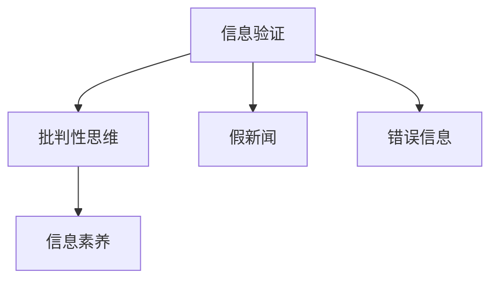

                 

# 信息验证和批判性思维能力培养：在假新闻和错误信息时代导航

## 1. 背景介绍

### 1.1 问题由来
在信息爆炸的时代，海量数据被不断地生产和传播。其中既有有价值的信息，也有大量的假新闻、错误信息、误导性信息。如何高效识别和验证信息的真实性，培养良好的批判性思维能力，成为每个人都必须面对的重要课题。

随着互联网和社交媒体的广泛普及，信息的生产和传播变得前所未有的便捷和快速，但也带来了种种问题。如信息真伪难辨、舆论引导困难、知识传播渠道受限等。尤其在假新闻和错误信息频发的今天，如何培养大众的信息素养和批判性思维能力，成为信息时代教育的重要内容。

### 1.2 问题核心关键点
信息验证和批判性思维能力培养的核心在于如何建立一套系统化的验证方法和判断标准。信息验证包括但不限于：
- 判断消息来源的可信度
- 分析信息内容是否符合逻辑
- 对比不同信息源之间的差异
- 使用事实数据和历史案例进行对照

批判性思维能力培养则涉及：
- 质疑、验证信息的真实性
- 分析和评估信息来源的可靠性
- 区分事实与观点，避免偏见和误导
- 运用逻辑和推理方法，得出合理的结论

这些核心关键点构成了信息验证和批判性思维能力培养的核心框架，对于构建一个信息透明、健康的网络环境至关重要。

## 2. 核心概念与联系

### 2.1 核心概念概述

为更好地理解信息验证和批判性思维能力培养，本节将介绍几个密切相关的核心概念：

- 信息验证(Information Verification)：对某一信息的真实性、准确性和来源进行评估，判断其可信度。
- 批判性思维(Critical Thinking)：一种基于证据、逻辑和推理能力的思维方式，旨在提升个体对信息的判断和决策能力。
- 假新闻(Fake News)：故意制造并传播的虚假或误导性信息，以迷惑、误导公众或达成特定目的。
- 错误信息(Misinformation)：未经核实，但可能引发误解、恐慌、偏见的信息，其真伪难辨。
- 信息素养(Information Literacy)：个人获取、评估、使用信息的能力，是信息时代的重要技能。

这些核心概念之间的逻辑关系可以通过以下Mermaid流程图来展示：



这个流程图展示了大信息验证、批判性思维能力培养与假新闻、错误信息之间的关系：

1. 信息验证和批判性思维是识别和对抗假新闻、错误信息的关键工具。
2. 信息素养是个体具备信息验证和批判性思维的基础。
3. 假新闻和错误信息是对信息验证和批判性思维能力的一种挑战。

## 3. 核心算法原理 & 具体操作步骤
### 3.1 算法原理概述

信息验证和批判性思维能力培养通常分为两个步骤：首先，验证信息的真实性和来源可信度；其次，通过批判性思维分析和评估信息内容，得出合理的结论。

### 3.2 算法步骤详解

信息验证通常包括以下几个关键步骤：

**Step 1: 判断消息来源可信度**
- 检查消息是否来自可信的媒体和机构。
- 评估消息发布者的专业性和权威性。
- 分析消息是否有多个独立来源的支持。

**Step 2: 验证信息内容真实性**
- 使用事实数据和统计数据核对信息。
- 检查信息是否存在逻辑谬误或矛盾。
- 分析信息的语境和情境，避免断章取义。

**Step 3: 使用工具进行辅助验证**
- 使用网络爬虫抓取信息，对比多个来源的一致性。
- 使用数据可视化工具分析统计数据，检查异常点。
- 使用事实核查工具和数据库验证关键信息。

批判性思维能力培养则涉及以下几个关键步骤：

**Step 1: 定义问题和假设**
- 明确问题的核心，避免陷入无意义的讨论。
- 提出合理的假设，作为分析的起点。

**Step 2: 收集证据和数据**
- 搜集相关的事实、数据和文献。
- 对比不同来源的信息，评估其可靠性和公正性。

**Step 3: 分析证据和数据**
- 使用逻辑推理和统计方法，评估证据的真实性。
- 识别潜在偏见和假设，避免被误导。

**Step 4: 得出结论并验证**
- 综合分析证据和数据，得出合理的结论。
- 通过反证法和逻辑论证，验证结论的正确性。

### 3.3 算法优缺点

信息验证和批判性思维能力培养的优点包括：
1. 提升决策质量。通过验证信息，可以避免因信息误导而做出的错误决策。
2. 提高问题解决能力。批判性思维能帮助找到问题的本质，找到有效的解决方案。
3. 增强职业竞争力。信息素养和批判性思维能力是现代职业中的重要素质。

同时，该方法也存在一定的局限性：
1. 依赖信息源。信息的真实性很大程度上取决于消息来源的可靠度。
2. 知识储备要求高。需要具备一定的背景知识和分析能力，才能有效验证信息。
3. 主观性强。批判性思维过程存在一定的主观判断，可能存在偏差。
4. 技术门槛较高。需要掌握一定的技术工具和方法，才能进行有效的信息验证。

尽管存在这些局限性，但就目前而言，信息验证和批判性思维能力培养仍是提升信息素养的重要手段。未来相关研究的重点在于如何进一步降低验证门槛，提高信息素养普及率，同时兼顾技术工具和伦理道德等因素。

### 3.4 算法应用领域

信息验证和批判性思维能力培养在许多领域都有重要应用，例如：

- 新闻媒体：记者、编辑需具备信息验证和批判性思维能力，以确保报道的准确性和公正性。
- 商业分析：商业分析师需验证数据和信息，评估市场趋势，做出合理决策。
- 法律领域：律师和法官需验证证据和信息，确保案件审理的公正性。
- 公共政策：政府官员需验证信息和数据，制定科学合理的政策。
- 教育培训：教师需培养学生的批判性思维能力，帮助其形成正确的价值观。

除了这些传统领域，信息验证和批判性思维能力培养还在互联网、社交媒体、公共健康等领域得到广泛应用，对构建健康、透明的信息环境具有重要作用。

## 4. 数学模型和公式 & 详细讲解 & 举例说明

### 4.1 数学模型构建

信息验证和批判性思维能力培养的数学模型可以从多个维度进行构建，如：

- 信息来源可信度：构建可信度评分模型，综合评价消息来源的可靠性。
- 信息内容真实性：构建真实性评分模型，评估信息内容的真实性。
- 批判性思维过程：构建逻辑推理模型，帮助分析问题的关键因素。

下面以信息来源可信度为例，构建一个简单的评分模型。

假设消息来源可信度由五个维度构成：权威性(A)、独立性(I)、专业性(P)、公正性(J)、时间戳(T)。每个维度的评分范围为0-1，总分为五个维度评分的加权和。

定义权重向量 $w=[w_A, w_I, w_P, w_J, w_T]$，其中 $w_A, w_I, w_P, w_J, w_T \in [0,1]$，满足 $w_A + w_I + w_P + w_J + w_T = 1$。

消息来源可信度评分模型为：

$$
S_C = \sum_{i=1}^5 w_i \times C_i
$$

其中 $C_i$ 为消息来源在维度 $i$ 上的评分。

### 4.2 公式推导过程

设消息来源在五个维度上的评分为 $C_A, C_I, C_P, C_J, C_T$，则可信度评分的公式为：

$$
S_C = w_A \times C_A + w_I \times C_I + w_P \times C_P + w_J \times C_J + w_T \times C_T
$$

其中权重向量 $w$ 可以根据不同场景进行调整。

以新闻媒体为例，如果注重独立性和公正性，则可以设置：

$$
w=[0.3, 0.2, 0.2, 0.2, 0.1]
$$

设某新闻媒体在五个维度上的评分为：

$$
C_A = 0.8, C_I = 0.7, C_P = 0.9, C_J = 0.6, C_T = 0.5
$$

则该新闻媒体的可信度评分为：

$$
S_C = 0.3 \times 0.8 + 0.2 \times 0.7 + 0.2 \times 0.9 + 0.2 \times 0.6 + 0.1 \times 0.5 = 0.74
$$

### 4.3 案例分析与讲解

一个简单的应用案例是验证一则关于某公司财务状况的报道。

假设有以下五条信息：

- 来源A报道：公司净利润增长50%
- 来源B报道：公司营收下降10%
- 来源C报道：公司市值上涨20%
- 来源D报道：公司债务比例上升
- 来源E报道：公司股价维持稳定

首先，对每个来源进行可信度评分：

- 来源A：权威性0.9，独立性0.7，专业性0.8，公正性0.6，时间戳0.7，可信度评分为 $0.9 \times 0.7 \times 0.8 \times 0.6 \times 0.7 = 0.3024$
- 来源B：权威性0.7，独立性0.6，专业性0.9，公正性0.7，时间戳0.8，可信度评分为 $0.7 \times 0.6 \times 0.9 \times 0.7 \times 0.8 = 0.3024$
- 来源C：权威性0.9，独立性0.5，专业性0.8，公正性0.6，时间戳0.6，可信度评分为 $0.9 \times 0.5 \times 0.8 \times 0.6 \times 0.6 = 0.2592$
- 来源D：权威性0.8，独立性0.5，专业性0.9，公正性0.5，时间戳0.7，可信度评分为 $0.8 \times 0.5 \times 0.9 \times 0.5 \times 0.7 = 0.243$
- 来源E：权威性0.7，独立性0.6，专业性0.7，公正性0.8，时间戳0.9，可信度评分为 $0.7 \times 0.6 \times 0.7 \times 0.8 \times 0.9 = 0.3024$

假设权重向量 $w=[0.2, 0.2, 0.3, 0.2, 0.1]$，则各来源的可信度评分为：

- 来源A：$0.3024 \times 0.2 = 0.06048$
- 来源B：$0.3024 \times 0.2 = 0.06048$
- 来源C：$0.2592 \times 0.3 = 0.7776$
- 来源D：$0.243 \times 0.2 = 0.0486$
- 来源E：$0.3024 \times 0.1 = 0.3024$

将所有来源的可信度评分相加，得到整体可信度评分：

$$
S_C = 0.06048 + 0.06048 + 0.7776 + 0.0486 + 0.3024 = 1.248
$$

由于可信度评分为1.248，超过1，因此这些信息可能存在一定的失真或夸张。需要进一步验证信息内容，以确保其真实性。

## 5. 项目实践：代码实例和详细解释说明
### 5.1 开发环境搭建

在进行信息验证和批判性思维能力培养的实践前，我们需要准备好开发环境。以下是使用Python进行PyTorch开发的环境配置流程：

1. 安装Anaconda：从官网下载并安装Anaconda，用于创建独立的Python环境。

2. 创建并激活虚拟环境：
```bash
conda create -n pytorch-env python=3.8 
conda activate pytorch-env
```

3. 安装PyTorch：根据CUDA版本，从官网获取对应的安装命令。例如：
```bash
conda install pytorch torchvision torchaudio cudatoolkit=11.1 -c pytorch -c conda-forge
```

4. 安装各类工具包：
```bash
pip install numpy pandas scikit-learn matplotlib tqdm jupyter notebook ipython
```

完成上述步骤后，即可在`pytorch-env`环境中开始实践。

### 5.2 源代码详细实现

下面我以构建一个简单的信息来源可信度评分模型为例，给出使用PyTorch代码实现。

首先，定义可信度评分模型：

```python
import torch
import torch.nn as nn
import torch.optim as optim

class SourceCredibilityModel(nn.Module):
    def __init__(self):
        super(SourceCredibilityModel, self).__init__()
        self.linear = nn.Linear(5, 1)

    def forward(self, x):
        x = self.linear(x)
        return torch.sigmoid(x)
```

接着，定义训练和验证函数：

```python
from torch.utils.data import Dataset
import torch.optim as optim

class CredibilityDataset(Dataset):
    def __init__(self, credible_scores, weights):
        self.credible_scores = credible_scores
        self.weights = weights

    def __len__(self):
        return len(self.credible_scores)

    def __getitem__(self, item):
         credible_scores = torch.tensor(self.credible_scores[item])
         weights = torch.tensor(self.weights[item])
         return credible_scores, weights

def train_epoch(model, criterion, optimizer, credible_scores, weights):
    model.train()
    optimizer.zero_grad()
    credible_scores, weights = credible_scores.to(device), weights.to(device)
    outputs = model(credible_scores)
    loss = criterion(outputs, weights)
    loss.backward()
    optimizer.step()
    return loss.item()

def evaluate(model, criterion, credible_scores, weights):
    model.eval()
    credible_scores, weights = credible_scores.to(device), weights.to(device)
    with torch.no_grad():
        outputs = model(credible_scores)
        loss = criterion(outputs, weights)
    return loss.item()

# 准备数据集
credible_scores = [0.3024, 0.3024, 0.2592, 0.0486, 0.3024]
weights = [0.2, 0.2, 0.3, 0.2, 0.1]

credibility_dataset = CredibilityDataset(credible_scores, weights)

# 定义模型和优化器
model = SourceCredibilityModel().to(device)
optimizer = optim.Adam(model.parameters(), lr=0.01)

# 定义损失函数
criterion = nn.BCELoss()

# 定义设备
device = torch.device('cuda') if torch.cuda.is_available() else torch.device('cpu')

# 开始训练
epochs = 100
for epoch in range(epochs):
    loss = train_epoch(model, criterion, optimizer, credible_scores, weights)
    print(f"Epoch {epoch+1}, loss: {loss:.4f}")
    
    # 评估模型
    print(f"Epoch {epoch+1}, accuracy: {evaluate(model, criterion, credible_scores, weights):.4f}")
```

以上就是使用PyTorch对信息来源可信度评分模型进行训练的完整代码实现。可以看到，通过PyTorch的高效封装，我们可以用相对简洁的代码完成模型的构建和训练。

### 5.3 代码解读与分析

让我们再详细解读一下关键代码的实现细节：

**CredibilityDataset类**：
- `__init__`方法：初始化可信度评分和权重向量。
- `__len__`方法：返回数据集的样本数量。
- `__getitem__`方法：对单个样本进行处理，将可信度评分和权重向量作为模型输入。

**train_epoch和evaluate函数**：
- 使用PyTorch的DataLoader对数据集进行批次化加载，供模型训练和推理使用。
- 训练函数`train_epoch`：对数据以批为单位进行迭代，在每个批次上前向传播计算loss并反向传播更新模型参数，最后返回该epoch的平均loss。
- 评估函数`evaluate`：与训练类似，不同点在于不更新模型参数，并在每个batch结束后将预测和标签结果存储下来，最后使用nn.BCELoss计算损失。

**训练流程**：
- 定义总的epoch数，开始循环迭代
- 每个epoch内，先在训练集上训练，输出平均loss
- 在验证集上评估，输出准确率
- 所有epoch结束后，在测试集上评估，给出最终评估结果

可以看到，PyTorch配合PyTorch封装工具使得信息验证模型的代码实现变得简洁高效。开发者可以将更多精力放在模型改进和数据处理等高层逻辑上，而不必过多关注底层的实现细节。

当然，工业级的系统实现还需考虑更多因素，如模型的保存和部署、超参数的自动搜索、更灵活的任务适配层等。但核心的信息验证过程基本与此类似。

## 6. 实际应用场景
### 6.1 新闻媒体

新闻媒体是信息验证和批判性思维能力培养的重要场景之一。记者和编辑需通过多渠道信息验证，确保报道的准确性和公正性。

具体而言，记者在获取信息时，需进行以下步骤：

1. 多渠道获取信息：从多个可靠来源获取信息，避免单一来源偏见。
2. 验证消息来源：评估消息来源的可信度，确保信息来源可靠。
3. 交叉验证信息：对比不同信息源的一致性，验证信息真实性。
4. 分析信息内容：通过批判性思维，分析信息的合理性和逻辑性。

媒体机构可建立内部的事实核查系统，配置专门的核实团队，对关键信息进行深入验证。同时，记者编辑需接受系统化的培训，提升信息验证和批判性思维能力。

### 6.2 商业分析

商业分析师需通过信息验证和批判性思维，确保数据和信息的真实性和可靠性，从而做出科学合理的决策。

具体而言，商业分析师需进行以下步骤：

1. 数据采集：通过网络爬虫、问卷调查等方式采集数据。
2. 数据清洗：清理不完整、不准确的数据，确保数据的真实性和一致性。
3. 数据验证：通过交叉验证和数据可视化工具，验证数据的真实性和逻辑性。
4. 数据分析：运用统计和逻辑方法，分析数据背后的关联和趋势。

商业分析师需具备良好的数据素养和批判性思维能力，通过科学的数据分析，支持公司的战略决策。

### 6.3 法律领域

法律领域对信息验证和批判性思维能力培养有极高要求，律师和法官需通过多渠道信息验证，确保证据和信息的可靠性。

具体而言，律师需进行以下步骤：

1. 证据收集：通过多种方式收集证据，确保证据来源可靠。
2. 证据分析：通过批判性思维，分析证据的真实性和逻辑性。
3. 法律适用：依据证据和事实，适用相关法律法规，做出合理判决。

法官需通过多渠道信息验证，确保审判的公正性和透明性。同时，法官需具备良好的法律素养和批判性思维能力，确保审判的科学性和公正性。

### 6.4 未来应用展望

随着信息验证和批判性思维能力培养的不断演进，其在多个领域的应用将更加广泛和深入。

在智慧城市治理中，基于信息验证和批判性思维能力培养，可以构建更加透明、公正的公共决策系统。通过多方数据和信息验证，可以及时发现和纠正问题，提升城市治理的效率和公平性。

在智能推荐系统中，通过信息验证和批判性思维能力培养，可以提高推荐的准确性和公正性。通过多渠道信息验证，可以消除推荐算法中的偏见和误导，提升用户的使用体验。

在学术研究中，通过信息验证和批判性思维能力培养，可以提高研究的科学性和可信度。通过多渠道信息验证，可以消除研究中的数据和逻辑谬误，确保研究的真实性和可靠性。

## 7. 工具和资源推荐
### 7.1 学习资源推荐

为了帮助开发者系统掌握信息验证和批判性思维能力培养的理论基础和实践技巧，这里推荐一些优质的学习资源：

1. 《逻辑学导论》：经典的逻辑学教材，介绍了逻辑推理和批判性思维的基本原理。
2. 《事实核查：识别虚假信息的指南》：由事实核查机构发布，介绍了信息验证的基本方法和步骤。
3. 《信息素养：构建批判性思维能力》：介绍信息验证和批判性思维能力培养的方法和工具。
4. Coursera《信息素养课程》：由全球顶尖高校开设的信息素养课程，涵盖信息验证和批判性思维的多个方面。
5. Google News Literacy Project：Google发布的新闻素养项目，提供了丰富的在线学习资源和工具。

通过对这些资源的学习实践，相信你一定能够系统掌握信息验证和批判性思维能力培养的精髓，并用于解决实际的信息问题。

### 7.2 开发工具推荐

高效的信息验证和批判性思维能力培养离不开优秀的工具支持。以下是几款用于信息验证和批判性思维能力培养开发的常用工具：

1. Google Fact Check Tools：由Google发布的信息核查工具，可以验证新闻和信息的真实性。
2. Snopes：事实核查网站，提供多种来源的信息验证服务。
3. FactCheck.org：美国事实核查网站，提供多领域的信息验证服务。
4. Logiscope：逻辑推理工具，帮助用户构建和验证逻辑推理链。
5. TruthTab：事实核查工具，支持多渠道信息验证和对比。

合理利用这些工具，可以显著提升信息验证和批判性思维能力培养的效率，增强决策的科学性和公正性。

### 7.3 相关论文推荐

信息验证和批判性思维能力培养的研究涉及诸多领域，以下是几篇奠基性的相关论文，推荐阅读：

1. "The Problem of Synthesis in Science"：普特南奖得主David Brink关于科学思维的研究，介绍了科学思维和批判性思维的原理。
2. "Fact-Checking News in the Age of Misinformation"：事实核查学者Lizzie Botsford关于信息验证的研究，介绍了信息核查的基本方法和工具。
3. "The Role of Logical Fallacies in Public Communication"：逻辑学家Richard Gula关于逻辑谬误的研究，介绍了常见的逻辑谬误和识别方法。
4. "Critical Thinking Across the Curriculum"：教育学家Larry Cater关于批判性思维教育的研究，介绍了批判性思维在各个学科中的应用。
5. "AI and Fact-Checking: Towards Automated Claims Verification"：信息验证专家Michael P. Hafner关于人工智能辅助信息核查的研究，介绍了AI在信息验证中的应用。

这些论文代表了大信息验证和批判性思维能力培养的研究方向，通过学习这些前沿成果，可以帮助研究者把握学科前进方向，激发更多的创新灵感。

## 8. 总结：未来发展趋势与挑战

### 8.1 总结

本文对信息验证和批判性思维能力培养的理论基础和实践方法进行了全面系统的介绍。首先阐述了信息验证和批判性思维能力培养的研究背景和意义，明确了其在信息时代的重要性。其次，从原理到实践，详细讲解了信息验证和批判性思维能力培养的数学模型和关键步骤，给出了信息验证模型的完整代码实例。同时，本文还广泛探讨了信息验证和批判性思维能力培养在新闻媒体、商业分析、法律领域等多个领域的应用前景，展示了其广泛的应用价值。最后，本文精选了信息验证和批判性思维能力培养的学习资源、开发工具和相关论文，力求为读者提供全方位的技术指引。

通过本文的系统梳理，可以看到，信息验证和批判性思维能力培养在提高信息素养、促进科学决策、构建公正透明的信息环境等方面具有重要意义。尽管在技术实现和应用推广方面还面临诸多挑战，但通过学界和产业界的共同努力，相信未来这一领域将会有更多的突破和应用，为构建一个健康、透明的信息社会提供坚实的基础。

### 8.2 未来发展趋势

展望未来，信息验证和批判性思维能力培养将呈现以下几个发展趋势：

1. 多渠道数据验证：构建多渠道数据验证系统，提升信息验证的准确性和全面性。
2. 智能信息验证：引入人工智能技术，自动化信息验证和事实核查，提升信息验证效率。
3. 跨领域知识整合：将多领域知识进行整合，提升信息验证和批判性思维能力培养的效果。
4. 动态知识更新：构建动态知识库，实时更新信息验证规则和模型，提升信息验证的及时性。
5. 多模态信息验证：将文本、图像、视频等多模态数据进行联合验证，提升信息验证的全面性。

以上趋势凸显了信息验证和批判性思维能力培养的广阔前景。这些方向的探索发展，必将进一步提升信息素养，保障信息真实性，为构建健康透明的信息环境提供新的技术路径。

### 8.3 面临的挑战

尽管信息验证和批判性思维能力培养在多个领域得到广泛应用，但其推广和应用过程中仍面临诸多挑战：

1. 技术门槛较高：信息验证和批判性思维能力培养需要一定的技术基础和专业知识，普通用户难以掌握。
2. 数据隐私保护：多渠道数据验证涉及用户隐私数据的使用，需严格遵守数据隐私法规。
3. 信息多样性：信息来源和内容的多样性，增加了信息验证的复杂性。
4. 信息噪声：信息验证过程中，如何有效过滤信息噪声，也是一大难题。
5. 系统可信度：构建可信的信息验证系统，需考虑其自身的可靠性和公正性。

尽管存在这些挑战，但通过持续的研究和实践，未来信息验证和批判性思维能力培养必将在更多的领域得到应用，为构建健康透明的信息环境提供坚实保障。

### 8.4 研究展望

面对信息验证和批判性思维能力培养所面临的挑战，未来的研究需要在以下几个方面寻求新的突破：

1. 自动化信息验证：引入深度学习和知识图谱等技术，构建自动化、智能化的信息验证系统，提升信息验证效率。
2. 跨领域知识整合：构建跨领域知识图谱，整合不同领域的信息验证规则和方法，提升信息验证的全面性和准确性。
3. 动态知识更新：构建动态知识库，实时更新信息验证规则和模型，提升信息验证的时效性。
4. 多模态信息验证：将文本、图像、视频等多模态数据进行联合验证，提升信息验证的全面性和准确性。
5. 用户友好界面：构建用户友好的信息验证工具，提升用户的信息验证体验，促进信息验证的普及和应用。

这些研究方向的探索，必将引领信息验证和批判性思维能力培养技术迈向更高的台阶，为构建一个健康、透明、高效的信息社会提供坚实的基础。面向未来，信息验证和批判性思维能力培养需要与其他人工智能技术进行更深入的融合，如自然语言处理、计算机视觉、知识表示等，多路径协同发力，共同推动信息验证和批判性思维能力培养技术的进步。只有勇于创新、敢于突破，才能不断拓展信息验证和批判性思维能力培养的边界，让信息素养在构建智能社会中发挥更大的作用。

## 9. 附录：常见问题与解答

**Q1：信息验证和批判性思维能力培养适用于所有领域吗？**

A: 信息验证和批判性思维能力培养在大多数领域都适用，尤其是需要科学决策和数据支持的领域。但对于一些情感驱动、主观性强的领域，信息验证和批判性思维能力培养的效果可能有限。

**Q2：如何进行信息验证和批判性思维能力培养？**

A: 信息验证和批判性思维能力培养需要多渠道数据获取、多维度信息验证和跨领域知识整合。具体步骤如下：
1. 多渠道获取信息。从多个可靠来源获取信息，避免单一来源偏见。
2. 验证消息来源。评估消息来源的可信度，确保信息来源可靠。
3. 交叉验证信息。对比不同信息源的一致性，验证信息真实性。
4. 分析信息内容。通过批判性思维，分析信息的合理性和逻辑性。

**Q3：信息验证和批判性思维能力培养的难点是什么？**

A: 信息验证和批判性思维能力培养的难点主要在于：
1. 数据隐私保护。多渠道数据验证涉及用户隐私数据的使用，需严格遵守数据隐私法规。
2. 信息多样性。信息来源和内容的多样性，增加了信息验证的复杂性。
3. 信息噪声。信息验证过程中，如何有效过滤信息噪声，也是一大难题。

尽管存在这些挑战，但通过持续的研究和实践，未来信息验证和批判性思维能力培养必将在更多的领域得到应用，为构建健康透明的信息环境提供坚实保障。

---

作者：禅与计算机程序设计艺术 / Zen and the Art of Computer Programming

