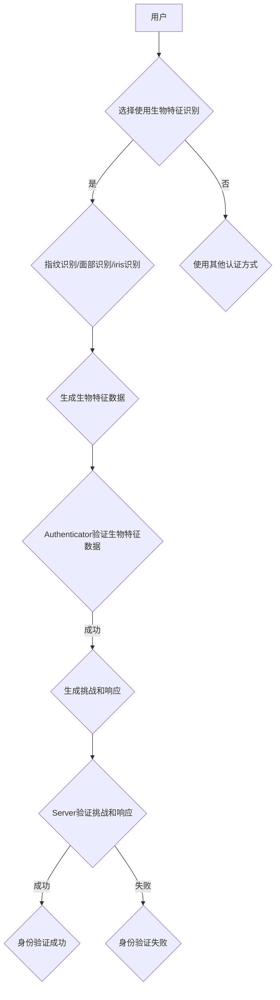

> WebAuthn, 生物特征识别, 指纹识别, 面部识别, iris识别, 安全认证, 密码替代, 隐私保护

## 1. 背景介绍

随着互联网的快速发展和数字化转型，用户数据安全问题日益突出。传统的密码认证方式存在着诸多缺陷，例如易被破解、遗忘和共享等问题。为了提升用户身份验证的安全性和便捷性，Web Authentication（WebAuthn）标准应运而生。WebAuthn是一种基于强认证的开放标准，旨在为用户提供更安全、更便捷的在线身份验证体验。

生物特征识别技术作为一种基于用户自身独特的生理特征进行身份识别的技术，在WebAuthn中扮演着越来越重要的角色。它能够提供更强的身份验证能力，并有效地解决传统密码认证方式的不足。

## 2. 核心概念与联系

WebAuthn 标准定义了一套基于强认证的协议，允许用户使用硬件安全模块（如指纹传感器、面部识别传感器等）进行身份验证。

**WebAuthn 核心概念：**

* **Authenticator:**  负责存储和生成用户的私钥的硬件设备，例如指纹识别器、面部识别器等。
* **Credential:** 用户在Authenticator上存储的数字证书，包含用户的公钥和相关信息。
* **Server:**  网站或应用程序，需要验证用户的身份。

**WebAuthn 与生物特征识别的联系：**

WebAuthn 标准本身并不强制要求使用生物特征识别技术，但它为生物特征识别技术提供了良好的应用场景。

**Mermaid 流程图：**



## 3. 核心算法原理 & 具体操作步骤

### 3.1  算法原理概述

生物特征识别算法的核心原理是提取用户的生物特征特征，并将其转换为数字特征向量。然后，将提取的特征向量与数据库中的已知特征向量进行比较，判断用户身份。

常见的生物特征识别算法包括：

* **指纹识别算法:**  利用指纹的纹理特征进行识别。
* **面部识别算法:**  利用面部特征，如眼睛、鼻子、嘴巴等进行识别。
* **iris识别算法:**  利用虹膜的独特纹理特征进行识别。

### 3.2  算法步骤详解

**指纹识别算法为例:**

1. **指纹采集:** 使用指纹传感器采集用户的指纹图像。
2. **指纹预处理:** 对采集到的指纹图像进行预处理，例如去噪、增强对比度等。
3. **指纹特征提取:** 使用指纹特征提取算法，提取指纹图像的特征向量。
4. **特征匹配:** 将提取的特征向量与数据库中的已知特征向量进行比较，判断用户身份。

### 3.3  算法优缺点

**优点:**

* **安全性高:** 生物特征信息是独一无二的，不易被伪造。
* **便捷性强:** 用户无需记忆密码，只需使用生物特征即可进行身份验证。
* **用户体验好:** 生物特征识别速度快，操作简单。

**缺点:**

* **隐私问题:** 生物特征信息一旦泄露，难以恢复。
* **技术复杂度高:** 生物特征识别算法的开发和部署需要较高的技术水平。
* **成本较高:** 生物特征识别硬件设备的成本较高。

### 3.4  算法应用领域

生物特征识别技术广泛应用于以下领域:

* **身份验证:**  银行、机场、政府机构等场所的身份验证。
* **支付安全:**  手机支付、在线支付等场景的安全认证。
* **人脸识别:**  安防监控、人脸搜索等应用。
* **医疗保健:**  患者身份识别、病历管理等。

## 4. 数学模型和公式 & 详细讲解 & 举例说明

### 4.1  数学模型构建

生物特征识别算法通常使用数学模型来描述特征提取和匹配的过程。例如，指纹识别算法可以使用傅里叶变换来提取指纹纹理特征，并使用欧氏距离来计算特征之间的相似度。

### 4.2  公式推导过程

**指纹特征提取的傅里叶变换公式:**

$$F(\omega) = \int_{-\infty}^{\infty} f(t) e^{-i\omega t} dt$$

其中:

* $F(\omega)$ 是指纹图像的傅里叶变换结果。
* $f(t)$ 是指纹图像的时域信号。
* $\omega$ 是频率。

**特征相似度的欧氏距离公式:**

$$d = \sqrt{\sum_{i=1}^{n} (x_i - y_i)^2}$$

其中:

* $d$ 是特征之间的欧氏距离。
* $x_i$ 和 $y_i$ 分别是两个特征向量的第 $i$ 个元素。
* $n$ 是特征向量的维度。

### 4.3  案例分析与讲解

假设我们有两个指纹特征向量，分别为 $x = [1, 2, 3, 4]$ 和 $y = [2, 3, 4, 5]$. 使用欧氏距离公式计算这两个特征向量的相似度:

$$d = \sqrt{(1-2)^2 + (2-3)^2 + (3-4)^2 + (4-5)^2} = \sqrt{1 + 1 + 1 + 1} = 2$$

欧氏距离为 2，表明这两个特征向量之间的相似度较低。

## 5. 项目实践：代码实例和详细解释说明

### 5.1  开发环境搭建

* 操作系统: Ubuntu 20.04
* 编程语言: Python 3.8
* 依赖库:

```
pip install webauthn-client
```

### 5.2  源代码详细实现

```python
import webauthn

# 配置Authenticator
authenticator = webauthn.Authenticator(
    "your_authenticator_id",
    "your_authenticator_secret",
)

# 生成挑战
challenge = authenticator.generate_challenge()

# 用户选择使用生物特征识别进行身份验证
# ...

# 身份验证成功后，Authenticator返回响应
response = authenticator.get_response(challenge)

# Server验证响应
server.verify_response(challenge, response)

# 身份验证成功
```

### 5.3  代码解读与分析

* `webauthn` 库提供了WebAuthn标准的Python接口，方便开发者进行身份验证操作。
* `Authenticator` 对象负责管理用户的生物特征识别设备和私钥。
* `generate_challenge()` 方法生成一个随机挑战，用于身份验证。
* `get_response()` 方法获取用户使用生物特征识别设备进行身份验证后的响应。
* `verify_response()` 方法验证用户的身份，确保响应的有效性。

### 5.4  运行结果展示

如果身份验证成功，则Server会收到用户的身份验证响应，并允许用户访问网站或应用程序。

## 6. 实际应用场景

### 6.1  金融领域

* **银行账户登录:** 使用指纹或面部识别进行银行账户登录，提高账户安全性和用户体验。
* **移动支付:** 使用生物特征识别进行移动支付，防止账户被盗用。

### 6.2  企业内部管理

* **员工身份验证:** 使用指纹或面部识别进行员工身份验证，控制员工对敏感数据的访问权限。
* **设备访问控制:** 使用生物特征识别控制员工对设备的访问权限，提高设备安全性和数据保护。

### 6.3  个人信息安全

* **手机解锁:** 使用指纹或面部识别解锁手机，提高手机安全性和用户体验。
* **密码管理:** 使用生物特征识别代替密码，管理用户的密码信息，提高密码安全性和便捷性。

### 6.4  未来应用展望

随着生物特征识别技术的不断发展，WebAuthn 将在更多领域得到应用，例如：

* **医疗保健:** 使用生物特征识别进行患者身份识别，提高医疗安全性和数据隐私保护。
* **教育:** 使用生物特征识别进行学生身份验证，提高考试公平性和数据安全。
* **智能家居:** 使用生物特征识别控制智能家居设备，提高家居安全性和用户体验。

## 7. 工具和资源推荐

### 7.1  学习资源推荐

* **WebAuthn 规范:** https://www.w3.org/TR/webauthn/
* **WebAuthn Python 库:** https://github.com/webauthn/webauthn-client
* **生物特征识别技术书籍:**

### 7.2  开发工具推荐

* **FIDO Alliance:** https://fidoalliance.org/
* **WebAuthn 测试工具:** https://www.webauthn.org/tools/

### 7.3  相关论文推荐

* **Web Authentication (WebAuthn):** https://www.w3.org/TR/webauthn/
* **Biometric Authentication: A Survey:** https://ieeexplore.ieee.org/document/7907708

## 8. 总结：未来发展趋势与挑战

### 8.1  研究成果总结

WebAuthn 标准和生物特征识别技术的发展，为用户提供了一种更安全、更便捷的在线身份验证方式。

### 8.2  未来发展趋势

* **更广泛的应用场景:** WebAuthn 将在更多领域得到应用，例如医疗保健、教育、智能家居等。
* **更强大的生物特征识别技术:** 生物特征识别技术的精度和可靠性将不断提高，并应用于更复杂的场景。
* **更安全的身份验证体系:** WebAuthn 将与其他安全技术结合，构建更安全的身份验证体系。

### 8.3  面临的挑战

* **隐私保护:** 生物特征信息一旦泄露，难以恢复，需要加强隐私保护措施。
* **技术复杂度:** 生物特征识别算法的开发和部署需要较高的技术水平。
* **成本较高:** 生物特征识别硬件设备的成本较高，需要降低成本，使其更易于普及。

### 8.4  研究展望

未来，我们需要继续研究和开发更安全、更便捷、更隐私保护的生物特征识别技术，并将其应用于WebAuthn标准，为用户提供更优质的在线身份验证体验。

## 9. 附录：常见问题与解答

**常见问题:**

* **生物特征识别技术是否安全可靠？**

**解答:** 生物特征识别技术安全性高，但并非绝对安全。需要采取相应的安全措施，例如数据加密、身份验证等，以防止生物特征信息被盗用。

* **生物特征识别技术是否会侵犯用户的隐私？**

**解答:** 生物特征识别技术可能会涉及用户的隐私信息，需要采取相应的隐私保护措施，例如数据匿名化、数据加密等，以保护用户的隐私。

* **生物特征识别技术是否适用于所有场景？**

**解答:** 生物特征识别技术并非适用于所有场景，例如在光线不足或环境嘈杂的情况下，生物特征识别效果可能会下降。

* **如何选择合适的生物特征识别技术？**

**解答:** 选择合适的生物特征识别技术需要根据具体的应用场景和需求进行考虑，例如安全性、便捷性、成本等因素。


作者：禅与计算机程序设计艺术 / Zen and the Art of Computer Programming 
<end_of_turn>