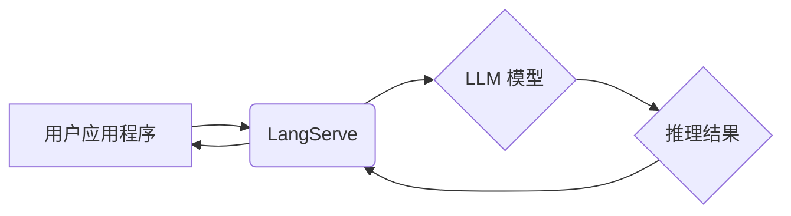

> LangChain, LangServe,  LLM,  应用程序,  API,  Python,  自然语言处理

## 1. 背景介绍

近年来，大型语言模型（LLM）的快速发展掀起了人工智能领域的革命。这些强大的模型能够理解和生成人类语言，为各种应用场景提供了无限可能。然而，将这些模型应用于实际场景并非易事，需要克服诸多技术挑战。

LangChain 作为一款开源框架，旨在简化 LLM 的开发和部署，帮助开发者将 LLM 的强大功能融入到自己的应用程序中。其中，LangServe 是 LangChain 的一个重要组件，它提供了一种高效的机制，将 LLM 作为服务（API）暴露出来，方便其他应用程序调用。

## 2. 核心概念与联系

LangServe 的核心概念是将 LLM 作为服务提供，通过 API 接口进行调用。它将 LLM 的推理过程封装成一个独立的进程，并通过 gRPC 或 HTTP 等协议提供服务接口。

**LangServe 架构图:**



**核心概念:**

* **LLM 模型:**  大型语言模型，例如 GPT-3、BERT 等。
* **LangServe:**  将 LLM 作为服务的框架，提供 API 接口。
* **用户应用程序:**  需要调用 LLM 功能的应用程序。
* **API 接口:**  用于调用 LLM 的接口，支持多种协议，例如 gRPC 和 HTTP。
* **推理结果:**  LLM 对输入的处理结果。

## 3. 核心算法原理 & 具体操作步骤

### 3.1  算法原理概述

LangServe 的核心算法原理是将 LLM 的推理过程封装成一个独立的进程，并通过 API 接口进行调用。

**具体步骤:**

1. **启动 LangServe 服务:**  启动 LangServe 进程，加载 LLM 模型。
2. **用户应用程序发送请求:**  用户应用程序通过 API 接口发送请求，包含输入文本和模型参数。
3. **LangServe 处理请求:**  LangServe 接收请求，将输入文本传递给 LLM 模型进行推理。
4. **LLM 模型推理:**  LLM 模型对输入文本进行处理，生成推理结果。
5. **LangServe 返回结果:**  LangServe 将推理结果返回给用户应用程序。

### 3.2  算法步骤详解

1. **启动 LangServe 服务:**  使用 `langchain serve` 命令启动 LangServe 服务，指定 LLM 模型路径和 API 接口地址。
2. **用户应用程序发送请求:**  使用 HTTP 或 gRPC 协议发送请求到 LangServe 的 API 接口。请求包含以下信息:
    * **输入文本:**  需要进行推理的文本内容。
    * **模型参数:**  例如温度、最大长度等。
3. **LangServe 处理请求:**  LangServe 接收请求，将输入文本和模型参数传递给 LLM 模型。
4. **LLM 模型推理:**  LLM 模型对输入文本进行处理，生成推理结果。
5. **LangServe 返回结果:**  LangServe 将推理结果返回给用户应用程序，结果通常包含文本内容和一些元数据，例如推理时间等。

### 3.3  算法优缺点

**优点:**

* **简化开发流程:**  将 LLM 作为服务提供，简化了应用程序的开发流程。
* **提高效率:**  将 LLM 的推理过程封装成独立进程，提高了推理效率。
* **易于部署:**  LangServe 支持多种部署方式，例如 Docker 和 Kubernetes。

**缺点:**

* **网络延迟:**  调用 LLM 服务需要网络传输，可能会导致延迟。
* **资源消耗:**  启动和运行 LLM 服务需要一定的资源，例如 CPU 和内存。

### 3.4  算法应用领域

LangServe 的应用领域非常广泛，例如:

* **聊天机器人:**  构建智能聊天机器人，提供自然语言交互。
* **文本生成:**  生成各种类型的文本内容，例如文章、故事、代码等。
* **问答系统:**  构建问答系统，回答用户的问题。
* **文本摘要:**  生成文本摘要，提取关键信息。
* **机器翻译:**  实现机器翻译，将文本从一种语言翻译成另一种语言。

## 4. 数学模型和公式 & 详细讲解 & 举例说明

LangServe 的核心算法原理并不依赖于复杂的数学模型，主要基于 LLM 模型的推理过程。

**4.1  数学模型构建**

LLM 模型的训练过程本质上是一个优化问题，目标是找到一个模型参数，使得模型在训练数据上表现最佳。

**4.2  公式推导过程**

LLM 模型的训练通常使用交叉熵损失函数，公式如下:

$$
Loss = -\sum_{i=1}^{N} y_i \log(p_i)
$$

其中:

* $N$ 是样本数量。
* $y_i$ 是真实标签。
* $p_i$ 是模型预测的概率。

**4.3  案例分析与讲解**

例如，在文本生成任务中，LLM 模型需要预测下一个词。模型会根据输入文本序列和训练数据中的统计信息，计算每个词的预测概率。然后，模型选择概率最高的词作为下一个词。

## 5. 项目实践：代码实例和详细解释说明

### 5.1  开发环境搭建

* Python 3.8+
* LangChain 0.0.20+
* gRPC 或 HTTP 客户端库

### 5.2  源代码详细实现

```python
from langchain.serving.llms import LangChainLLM
from langchain.llms import OpenAI

# 初始化 OpenAI LLM
llm = OpenAI(temperature=0.7)

# 创建 LangChainLLM 实例
langchain_llm = LangChainLLM(llm=llm)

# 启动 LangServe 服务
langchain_llm.serve(port=8000)
```

### 5.3  代码解读与分析

* 首先，我们导入必要的库，包括 LangChain 和 OpenAI。
* 然后，我们初始化 OpenAI LLM 模型，并设置温度参数。
* 接着，我们创建 LangChainLLM 实例，将 OpenAI LLM 模型作为参数传递。
* 最后，我们使用 `serve()` 方法启动 LangServe 服务，指定端口号为 8000。

### 5.4  运行结果展示

启动 LangServe 服务后，我们可以使用 HTTP 或 gRPC 客户端发送请求到端口 8000，调用 LLM 模型进行推理。

## 6. 实际应用场景

LangServe 的应用场景非常广泛，例如:

* **聊天机器人:**  构建智能聊天机器人，提供自然语言交互。
* **文本生成:**  生成各种类型的文本内容，例如文章、故事、代码等。
* **问答系统:**  构建问答系统，回答用户的问题。
* **文本摘要:**  生成文本摘要，提取关键信息。
* **机器翻译:**  实现机器翻译，将文本从一种语言翻译成另一种语言。

### 6.4  未来应用展望

随着 LLM 技术的不断发展，LangServe 将会有更广泛的应用场景。例如:

* **个性化推荐:**  根据用户的喜好和行为，提供个性化的推荐。
* **自动写作:**  帮助用户自动生成各种类型的文本内容。
* **代码生成:**  根据用户需求，自动生成代码。

## 7. 工具和资源推荐

### 7.1  学习资源推荐

* **LangChain 官方文档:** https://python.langchain.com/docs/
* **LangChain GitHub 仓库:** https://github.com/langchain-ai/langchain

### 7.2  开发工具推荐

* **Python:** https://www.python.org/
* **Docker:** https://www.docker.com/
* **Kubernetes:** https://kubernetes.io/

### 7.3  相关论文推荐

* **Attention Is All You Need:** https://arxiv.org/abs/1706.03762
* **BERT: Pre-training of Deep Bidirectional Transformers for Language Understanding:** https://arxiv.org/abs/1810.04805

## 8. 总结：未来发展趋势与挑战

### 8.1  研究成果总结

LangServe 作为一款开源框架，为将 LLM 应用于实际场景提供了便捷的工具。它简化了开发流程，提高了推理效率，并支持多种部署方式。

### 8.2  未来发展趋势

未来，LangServe 将会朝着以下方向发展:

* **更强大的模型支持:**  支持更多类型的 LLM 模型，例如多模态模型。
* **更丰富的功能:**  提供更多功能，例如模型管理、监控和日志记录。
* **更易于使用:**  提供更友好的用户界面和更简单的 API。

### 8.3  面临的挑战

LangServe 也面临一些挑战，例如:

* **网络延迟:**  调用 LLM 服务需要网络传输，可能会导致延迟。
* **资源消耗:**  启动和运行 LLM 服务需要一定的资源，例如 CPU 和内存。
* **安全问题:**  LLM 模型可能存在安全漏洞，需要进行安全防护。

### 8.4  研究展望

未来，我们将继续致力于 LangServe 的开发和完善，使其成为更强大、更易用、更安全的 LLM 应用平台。

## 9. 附录：常见问题与解答

**常见问题:**

* **如何选择合适的 LLM 模型？**

**解答:**  选择合适的 LLM 模型取决于具体的应用场景。例如，对于文本生成任务，可以选择 GPT-3 等生成式模型；对于问答系统，可以选择 BERT 等理解式模型。

* **如何部署 LangServe？**

**解答:**  LangServe 支持多种部署方式，例如 Docker 和 Kubernetes。

* **如何监控 LangServe 的运行状态？**

**解答:**  LangServe 提供了监控和日志记录功能，可以方便地查看运行状态。


作者：禅与计算机程序设计艺术 / Zen and the Art of Computer Programming 
<end_of_turn>