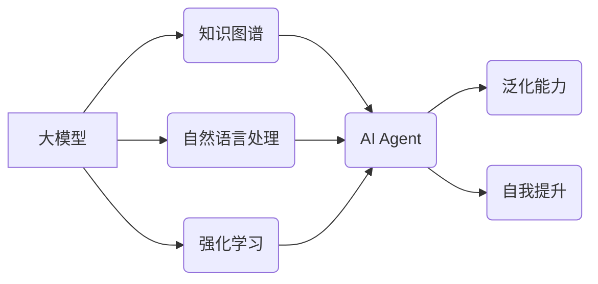

> 大模型、AI Agent、知识图谱、自然语言处理、深度学习、强化学习、泛化能力、自我提升

## 1. 背景介绍

近年来，深度学习技术取得了飞速发展，大模型的出现标志着人工智能领域迈入了一个新的时代。大模型拥有海量参数和强大的学习能力，能够在自然语言处理、计算机视觉、语音识别等领域取得突破性进展。然而，仅仅拥有强大的计算能力还不够，将大模型应用于实际场景，构建能够真正理解和交互的AI Agent，才是人工智能发展的终极目标。

传统的AI Agent通常基于规则或模板，缺乏灵活性和泛化能力。而大模型的出现为构建更智能、更灵活的AI Agent提供了新的可能性。通过训练大模型，使其能够理解和生成自然语言、处理复杂信息、进行推理和决策，我们可以构建出更接近人类智能的AI Agent。

## 2. 核心概念与联系

**2.1 AI Agent**

AI Agent是指能够感知环境、做出决策并与环境交互的智能体。它可以是软件程序、机器人或其他形式的智能系统。

**2.2 大模型**

大模型是指参数量巨大、训练数据海量的人工智能模型。它们通常基于深度学习架构，例如Transformer，能够学习复杂的模式和关系。

**2.3 知识图谱**

知识图谱是一种结构化的知识表示形式，它将实体和关系以图的形式表示。知识图谱可以帮助AI Agent理解和推理世界知识。

**2.4 自然语言处理 (NLP)**

自然语言处理是指让计算机能够理解、生成和处理人类语言的技术。NLP是构建AI Agent的关键技术之一，它使AI Agent能够与人类进行自然流畅的对话。

**2.5 强化学习 (RL)**

强化学习是一种机器学习方法，它通过奖励和惩罚机制训练AI Agent，使其能够在特定环境中学习最优策略。

**2.6 泛化能力**

泛化能力是指AI Agent能够将从训练数据中学到的知识应用到新的、未见过的场景的能力。

**2.7 自我提升**

自我提升是指AI Agent能够不断学习和改进自身的能力，使其在不断演进和完善。

**2.8 核心概念关系图**



## 3. 核心算法原理 & 具体操作步骤

### 3.1 算法原理概述

构建AI Agent的核心算法通常包括以下几个方面：

* **知识表示和推理:** 利用知识图谱等方法表示世界知识，并设计推理算法，使AI Agent能够理解和推理知识关系。
* **自然语言理解和生成:** 利用自然语言处理技术，使AI Agent能够理解人类语言，并生成自然流畅的文本。
* **强化学习:** 利用强化学习算法，训练AI Agent在特定环境中学习最优策略，使其能够做出合理的决策。

### 3.2 算法步骤详解

1. **数据收集和预处理:** 收集海量文本数据、知识图谱数据等，并进行预处理，例如清洗、标注等。
2. **模型训练:** 利用深度学习框架，训练大模型，例如BERT、GPT等，使其能够理解和生成自然语言，并进行知识推理。
3. **知识图谱构建:** 利用文本数据和结构化数据，构建知识图谱，表示世界知识。
4. **强化学习训练:** 设计奖励函数和惩罚函数，训练AI Agent在特定环境中学习最优策略。
5. **系统集成:** 将训练好的模型、知识图谱和强化学习算法集成到一起，构建完整的AI Agent系统。

### 3.3 算法优缺点

**优点:**

* 强大的学习能力：大模型能够学习复杂的模式和关系，使其能够理解和处理更复杂的信息。
* 灵活性和泛化能力：大模型能够适应不同的任务和场景，并具有较强的泛化能力。
* 自我提升能力：通过不断学习和改进，AI Agent能够不断提升自身的能力。

**缺点:**

* 计算资源需求高：训练大模型需要大量的计算资源和时间。
* 数据依赖性强：大模型的性能取决于训练数据的质量和数量。
* 缺乏可解释性：大模型的决策过程难以解释，这可能会导致信任问题。

### 3.4 算法应用领域

* **聊天机器人:** 构建能够进行自然流畅对话的聊天机器人。
* **虚拟助理:** 帮助用户完成各种任务，例如日程安排、信息查询等。
* **教育机器人:** 为学生提供个性化的学习体验。
* **医疗诊断:** 辅助医生进行疾病诊断和治疗方案制定。
* **金融分析:** 分析市场数据，预测股票价格等。

## 4. 数学模型和公式 & 详细讲解 & 举例说明

### 4.1 数学模型构建

大模型的训练通常基于深度学习框架，例如TensorFlow或PyTorch。这些框架提供了一系列数学模型和算法，用于训练大模型。

**4.1.1 Transformer模型**

Transformer模型是一种基于注意力机制的深度学习模型，它能够有效地处理长序列数据，例如文本。

**4.1.2 损失函数**

损失函数用于衡量模型预测结果与真实值的差异。常用的损失函数包括交叉熵损失函数和均方误差损失函数。

### 4.2 公式推导过程

**4.2.1 注意力机制**

注意力机制是一种用于学习数据中重要信息的机制。它通过计算每个词与其他词之间的相关性，来确定每个词的重要性。

**公式:**

$$
Attention(Q, K, V) = softmax(\frac{QK^T}{\sqrt{d_k}})V
$$

其中：

* Q：查询矩阵
* K：键矩阵
* V：值矩阵
* $d_k$：键向量的维度

**4.2.2 反向传播算法**

反向传播算法用于计算模型参数的梯度，并更新模型参数。

**公式:**

$$\Delta w = -\eta \frac{\partial L}{\partial w}$$

其中：

* $\Delta w$：参数更新量
* $\eta$：学习率
* $L$：损失函数

### 4.3 案例分析与讲解

**4.3.1 文本分类**

利用Transformer模型和交叉熵损失函数，可以训练一个文本分类模型，例如判断文本的正负情感。

**4.3.2 机器翻译**

利用Transformer模型和BLEU评分，可以训练一个机器翻译模型，例如将英文翻译成中文。

## 5. 项目实践：代码实例和详细解释说明

### 5.1 开发环境搭建

* Python 3.7+
* TensorFlow 2.0+
* PyTorch 1.0+
* CUDA Toolkit 10.2+

### 5.2 源代码详细实现

```python
# 导入必要的库
import tensorflow as tf

# 定义模型结构
model = tf.keras.Sequential([
    tf.keras.layers.Embedding(input_dim=vocab_size, output_dim=embedding_dim),
    tf.keras.layers.LSTM(units=hidden_size),
    tf.keras.layers.Dense(units=num_classes, activation='softmax')
])

# 编译模型
model.compile(optimizer='adam',
              loss='sparse_categorical_crossentropy',
              metrics=['accuracy'])

# 训练模型
model.fit(x_train, y_train, epochs=10)

# 评估模型
loss, accuracy = model.evaluate(x_test, y_test)
print('Loss:', loss)
print('Accuracy:', accuracy)
```

### 5.3 代码解读与分析

* **Embedding层:** 将单词映射到低维向量空间。
* **LSTM层:** 学习文本序列中的长期依赖关系。
* **Dense层:** 将LSTM输出映射到分类结果。
* **Adam优化器:** 用于更新模型参数。
* **交叉熵损失函数:** 用于衡量模型预测结果与真实值的差异。
* **Accuracy指标:** 用于评估模型的分类准确率。

### 5.4 运行结果展示

训练完成后，可以将模型应用于新的文本数据进行分类。

## 6. 实际应用场景

### 6.1 聊天机器人

大模型可以训练出能够进行自然流畅对话的聊天机器人，例如客服机器人、陪伴机器人等。

### 6.2 虚拟助理

大模型可以训练出能够帮助用户完成各种任务的虚拟助理，例如日程安排、信息查询、音乐播放等。

### 6.3 教育机器人

大模型可以训练出能够为学生提供个性化学习体验的教育机器人，例如辅导机器人、游戏机器人等。

### 6.4 未来应用展望

随着大模型技术的不断发展，其应用场景将更加广泛，例如：

* **个性化医疗:** 根据患者的基因信息和病史，提供个性化的医疗建议。
* **自动驾驶:** 训练自动驾驶汽车，使其能够安全可靠地行驶。
* **科学研究:** 帮助科学家进行数据分析和模型构建，加速科学发现。

## 7. 工具和资源推荐

### 7.1 学习资源推荐

* **课程:**
    * 深度学习 Specialization (Coursera)
    * 自然语言处理 Specialization (Coursera)
* **书籍:**
    * 深度学习 (Ian Goodfellow)
    * 自然语言处理 (Jurafsky & Martin)
* **博客:**
    * The Gradient
    * Towards Data Science

### 7.2 开发工具推荐

* **深度学习框架:** TensorFlow, PyTorch
* **自然语言处理库:** NLTK, spaCy
* **云计算平台:** AWS, Google Cloud, Azure

### 7.3 相关论文推荐

* Attention Is All You Need (Vaswani et al., 2017)
* BERT: Pre-training of Deep Bidirectional Transformers for Language Understanding (Devlin et al., 2018)
* GPT-3: Language Models are Few-Shot Learners (Brown et al., 2020)

## 8. 总结：未来发展趋势与挑战

### 8.1 研究成果总结

近年来，大模型技术取得了显著进展，在自然语言处理、计算机视觉等领域取得了突破性成果。构建能够理解和交互的AI Agent成为人工智能领域的重要研究方向。

### 8.2 未来发展趋势

* **模型规模和能力的提升:** 未来大模型的规模和能力将继续提升，能够处理更复杂的任务。
* **多模态学习:** 大模型将能够处理多种模态数据，例如文本、图像、音频等，从而构建更全面的AI Agent。
* **可解释性和安全性:** 研究将更加注重大模型的可解释性和安全性，使其能够更好地服务于人类。

### 8.3 面临的挑战

* **计算资源需求:** 训练大模型需要大量的计算资源，这仍然是一个挑战。
* **数据获取和标注:** 大模型的训练需要海量数据，数据获取和标注仍然是一个难题。
* **伦理和社会影响:** 大模型的应用可能带来伦理和社会问题，需要进行深入研究和探讨。

### 8.4 研究展望

未来，大模型技术将继续发展，为构建更智能、更灵活的AI Agent提供强大的工具。我们需要加强对大模型的理解和研究，并积极应对其带来的挑战，使其更好地服务于人类社会。

## 9. 附录：常见问题与解答

**9.1 如何选择合适的深度学习框架？**

TensorFlow和PyTorch是目前最流行的深度学习框架，它们各有优缺点。TensorFlow更适合于生产环境，而PyTorch更适合于研究和开发。

**9.2 如何处理大规模文本数据？**

可以使用分词、词向量化等技术对大规模文本数据进行预处理，并使用分布式训练