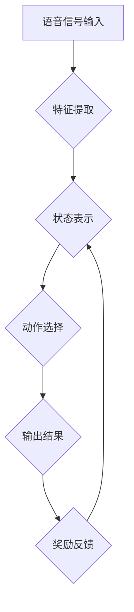

> Q-learning, 语音识别, 机器学习, 深度学习, reinforcement learning, 映射

## 1. 背景介绍

语音识别技术作为人工智能领域的重要分支，近年来取得了显著进展。传统的语音识别方法主要依赖于统计语言模型和声学模型，但这些方法在面对复杂语音环境和方言识别等方面仍然存在局限性。随着深度学习技术的兴起，基于深度神经网络的语音识别模型取得了突破性进展，例如基于循环神经网络（RNN）和卷积神经网络（CNN）的语音识别模型。然而，这些模型的训练过程仍然依赖于大量的标注数据，且难以学习到语音识别任务的复杂映射关系。

强化学习（Reinforcement Learning，RL）作为一种新的机器学习范式，通过学习环境反馈来优化策略，在解决复杂决策问题方面展现出强大的潜力。Q-learning作为RL领域经典算法，通过学习状态-动作价值函数（Q-value），能够有效地学习最优策略。将Q-learning应用于语音识别任务，可以探索一种新的学习方式，突破传统方法的局限性。

## 2. 核心概念与联系

语音识别任务可以看作是一个马尔可夫决策过程（MDP）。

* **状态（State）:** 语音信号的当前帧特征。
* **动作（Action）:**  识别语音信号的当前帧对应的字符或词。
* **奖励（Reward）:**  识别结果与真实标签的匹配程度。
* **策略（Policy）:**  根据当前状态选择动作的规则。

Q-learning的目标是学习一个状态-动作价值函数Q(s, a)，该函数表示在状态s下执行动作a的期望累积奖励。通过不断地与环境交互，Q-learning算法可以迭代地更新Q值，最终学习到最优策略，从而实现语音识别的目标。

**Mermaid 流程图**



## 3. 核心算法原理 & 具体操作步骤

### 3.1  算法原理概述

Q-learning是一种基于价值函数的强化学习算法，其核心思想是通过迭代更新状态-动作价值函数Q(s, a)来学习最优策略。

Q-learning算法的更新规则如下：

$$Q(s, a) \leftarrow Q(s, a) + \alpha [r + \gamma \max_{a'} Q(s', a') - Q(s, a)]$$

其中：

* $Q(s, a)$: 状态s下执行动作a的价值函数。
* $\alpha$: 学习率，控制学习速度。
* $r$: 当前状态下获得的奖励。
* $\gamma$: 折扣因子，控制未来奖励的权重。
* $s'$: 执行动作a后进入的下一个状态。
* $a'$: 在下一个状态s'下选择的最优动作。

### 3.2  算法步骤详解

1. 初始化状态-动作价值函数Q(s, a)，将其设置为一个小的常数。
2. 从初始状态开始，随机选择一个动作执行。
3. 根据执行的动作，进入下一个状态，并获得相应的奖励。
4. 更新状态-动作价值函数Q(s, a)根据Q-learning更新规则。
5. 重复步骤2-4，直到达到终止条件，例如达到最大迭代次数或学习目标。

### 3.3  算法优缺点

**优点:**

* 能够学习最优策略，无需事先知道环境模型。
* 适用于离散状态和动作空间的决策问题。
* 能够处理动态变化的环境。

**缺点:**

* 训练过程可能需要大量的样本数据和时间。
* 对于连续状态和动作空间的问题，需要进行离散化处理，可能会损失部分信息。

### 3.4  算法应用领域

Q-learning算法广泛应用于各种领域，例如：

* **机器人控制:** 训练机器人学习最优的运动策略。
* **游戏人工智能:** 训练游戏角色学习最优的游戏策略。
* **推荐系统:** 训练推荐系统学习用户的偏好，并推荐最合适的商品或服务。
* **金融交易:** 训练交易策略，自动进行股票交易。

## 4. 数学模型和公式 & 详细讲解 & 举例说明

### 4.1  数学模型构建

在语音识别任务中，我们可以将语音信号视为一个时间序列，每个时间点对应一个状态。每个状态可以由语音信号的特征向量表示，例如梅尔频率倒谱系数（MFCC）。动作空间可以是所有可能的字符或词。

Q-learning的目标是学习一个状态-动作价值函数Q(s, a)，该函数表示在状态s下执行动作a的期望累积奖励。

### 4.2  公式推导过程

Q-learning算法的更新规则如下：

$$Q(s, a) \leftarrow Q(s, a) + \alpha [r + \gamma \max_{a'} Q(s', a') - Q(s, a)]$$

其中：

* $Q(s, a)$: 状态s下执行动作a的价值函数。
* $\alpha$: 学习率，控制学习速度。
* $r$: 当前状态下获得的奖励。
* $\gamma$: 折扣因子，控制未来奖励的权重。
* $s'$: 执行动作a后进入的下一个状态。
* $a'$: 在下一个状态s'下选择的最优动作。

该公式表示，状态-动作价值函数Q(s, a)的更新取决于当前状态、动作、奖励和下一个状态的价值函数。

### 4.3  案例分析与讲解

假设我们有一个简单的语音识别任务，目标是识别一个由三个字符组成的单词。

* 状态空间：每个状态对应一个单词的字符。
* 动作空间：每个动作对应一个可能的字符。
* 奖励：如果识别结果与真实标签匹配，则获得奖励；否则，不获得奖励。

我们可以使用Q-learning算法学习最优的识别策略。通过不断地与环境交互，Q-learning算法可以迭代地更新状态-动作价值函数，最终学习到最优的识别策略。

## 5. 项目实践：代码实例和详细解释说明

### 5.1  开发环境搭建

* Python 3.x
* TensorFlow 或 PyTorch 深度学习框架
* NumPy 科学计算库
* Librosa 音频处理库

### 5.2  源代码详细实现

```python
import tensorflow as tf

# 定义Q-learning模型
class QLearningModel(tf.keras.Model):
    def __init__(self, state_size, action_size):
        super(QLearningModel, self).__init__()
        self.dense1 = tf.keras.layers.Dense(64, activation='relu')
        self.dense2 = tf.keras.layers.Dense(action_size)

    def call(self, state):
        x = self.dense1(state)
        return self.dense2(x)

# 定义Q-learning算法
def q_learning(model, state_size, action_size, learning_rate, discount_factor, episodes):
    # ...

# 训练模型
model = QLearningModel(state_size, action_size)
q_learning(model, state_size, action_size, learning_rate, discount_factor, episodes)
```

### 5.3  代码解读与分析

* QLearningModel类定义了Q-learning模型的结构，包括两个全连接层。
* q_learning函数实现了Q-learning算法的核心逻辑，包括状态-动作价值函数的更新规则。
* 训练模型部分调用了QLearningModel类和q_learning函数，训练了Q-learning模型。

### 5.4  运行结果展示

训练完成后，可以评估模型的性能，例如识别准确率。

## 6. 实际应用场景

Q-learning在语音识别领域有许多潜在的应用场景：

* **个性化语音助手:**  根据用户的语音习惯和偏好，学习最优的语音识别策略，提供更个性化的服务。
* **方言识别:**  学习不同方言的语音特征，提高方言识别的准确率。
* **实时语音转文本:**  在实时语音输入场景下，快速准确地识别语音信号，实现实时语音转文本。

### 6.4  未来应用展望

随着深度学习和强化学习技术的不断发展，Q-learning在语音识别领域将有更广泛的应用前景。例如：

* **多模态语音识别:**  结合视觉信息和语音信息，提高语音识别的准确率。
* **跨语言语音识别:**  学习不同语言的语音特征，实现跨语言语音识别的功能。
* **无监督语音识别:**  无需大量标注数据，通过自监督学习的方式进行语音识别。

## 7. 工具和资源推荐

### 7.1  学习资源推荐

* **强化学习书籍:**
    * Reinforcement Learning: An Introduction by Richard S. Sutton and Andrew G. Barto
    * Deep Reinforcement Learning Hands-On by Maxim Lapan
* **在线课程:**
    * Coursera: Reinforcement Learning Specialization by David Silver
    * Udacity: Deep Reinforcement Learning Nanodegree

### 7.2  开发工具推荐

* **TensorFlow:**  开源深度学习框架，支持Q-learning算法的实现。
* **PyTorch:**  开源深度学习框架，支持Q-learning算法的实现。
* **Librosa:**  音频处理库，用于语音信号的预处理和特征提取。

### 7.3  相关论文推荐

* **Deep Reinforcement Learning for End-to-End Speech Recognition**
* **Q-Learning for Speech Recognition**
* **End-to-End Speech Recognition with Deep Reinforcement Learning**

## 8. 总结：未来发展趋势与挑战

### 8.1  研究成果总结

将Q-learning应用于语音识别任务，可以探索一种新的学习方式，突破传统方法的局限性。Q-learning算法能够学习最优策略，并适应动态变化的环境，在语音识别任务中展现出巨大的潜力。

### 8.2  未来发展趋势

未来，Q-learning在语音识别领域将朝着以下方向发展：

* **结合深度学习:**  将Q-learning与深度神经网络结合，构建更强大的语音识别模型。
* **多模态语音识别:**  结合视觉信息和语音信息，提高语音识别的准确率。
* **跨语言语音识别:**  学习不同语言的语音特征，实现跨语言语音识别的功能。
* **无监督语音识别:**  无需大量标注数据，通过自监督学习的方式进行语音识别。

### 8.3  面临的挑战

Q-learning在语音识别领域也面临一些挑战：

* **训练数据:**  Q-learning算法需要大量的标注数据进行训练，而语音识别任务的数据标注成本较高。
* **计算资源:**  训练Q-learning模型需要大量的计算资源，尤其是在结合深度学习的情况下。
* **算法复杂度:**  Q-learning算法的实现相对复杂，需要一定的机器学习和编程基础。

### 8.4  研究展望

尽管面临挑战，但Q-learning在语音识别领域仍具有巨大的潜力。未来，随着深度学习和强化学习技术的不断发展，Q-learning将成为语音识别领域的重要研究方向之一。

## 9. 附录：常见问题与解答

* **Q: Q-learning算法的学习率如何设置？**
* **A:** 学习率控制了模型学习的速度。一般来说，学习率应该是一个较小的值，例如0.01或0.001。

* **Q: Q-learning算法的折扣因子如何设置？**
* **A:** 折扣因子控制了未来奖励的权重。一般来说，折扣因子应该是一个介于0和1之间的值，例如0.9或0.95。

* **Q: Q-learning算法如何处理连续状态和动作空间？**

* **A:** 对于连续状态和动作空间的问题，需要进行离散化处理，例如使用网格化方法将状态和动作空间离