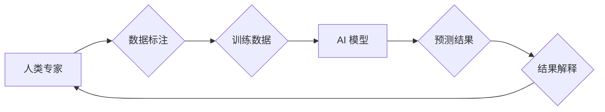

> 人类计算，AI，神经网络，深度学习，自然语言处理，计算机视觉，机器学习，数据分析

## 1. 背景介绍

人工智能（AI）正以惊人的速度发展，深刻地改变着我们生活的方方面面。从自动驾驶汽车到智能语音助手，从医疗诊断到金融交易，AI 的应用场景日益广泛。然而，在推动 AI 发展进程的背后，有一个重要的概念——“人类计算”。

人类计算是指利用人类的智慧和认知能力，辅助或增强人工智能系统的性能。它强调了人类和机器之间的协同作用，认为只有将人类的优势与机器的优势相结合，才能真正实现 AI 的强大潜力。

## 2. 核心概念与联系

人类计算的核心概念是将人类的认知能力融入到 AI 系统中，从而提升 AI 的智能水平。这可以通过多种方式实现，例如：

* **数据标注：** 人类专家对数据进行标注和分类，为 AI 模型提供训练数据。
* **算法设计：** 人类专家设计和优化 AI 算法，使其能够更好地处理复杂问题。
* **结果解释：** 人类专家解释 AI 模型的决策结果，帮助人们理解 AI 的工作原理。
* **反馈机制：** 人类专家提供反馈信息，帮助 AI 模型不断改进和优化。

**Mermaid 流程图：**



## 3. 核心算法原理 & 具体操作步骤

### 3.1  算法原理概述

人类计算的核心算法原理是将人类的认知能力抽象成数学模型，并将其融入到 AI 系统中。例如，自然语言处理领域，人类计算算法可以模拟人类的语言理解和生成能力，从而实现更准确、更自然的对话交互。

### 3.2  算法步骤详解

具体操作步骤如下：

1. **数据收集和预处理：** 收集与目标任务相关的原始数据，并进行清洗、格式化等预处理操作。
2. **特征提取：** 从原始数据中提取关键特征，例如文本中的关键词、图像中的物体等。
3. **模型构建：** 根据目标任务选择合适的 AI 模型，并利用提取的特征进行模型训练。
4. **模型评估：** 使用测试数据评估模型的性能，并根据评估结果进行模型调优。
5. **模型部署：** 将训练好的模型部署到实际应用场景中，并进行持续监控和维护。

### 3.3  算法优缺点

**优点：**

* 可以模拟人类的认知能力，解决传统 AI 算法难以处理的复杂问题。
* 可以提高 AI 系统的智能水平和应用场景的广泛性。

**缺点：**

* 需要大量的标注数据和专家知识，成本较高。
* 模型训练和优化过程复杂，需要专业的技术人员。

### 3.4  算法应用领域

人类计算算法在多个领域都有广泛的应用，例如：

* **自然语言处理：** 语音识别、机器翻译、文本摘要、情感分析等。
* **计算机视觉：** 图像识别、物体检测、场景理解等。
* **医疗诊断：** 病理图像分析、疾病预测、个性化治疗等。
* **金融分析：** 风险评估、欺诈检测、投资决策等。

## 4. 数学模型和公式 & 详细讲解 & 举例说明

### 4.1  数学模型构建

人类计算算法通常基于神经网络模型，其结构和参数可以模拟人类大脑的神经元和突触连接。

**神经网络模型：**

* **输入层：**接收原始数据，例如图像像素值或文本单词。
* **隐藏层：**对输入数据进行多层处理，提取特征和表示。
* **输出层：**输出最终结果，例如分类标签或预测值。

### 4.2  公式推导过程

神经网络模型的训练过程基于反向传播算法，其核心公式为：

$$
\Delta w = \eta \frac{\partial E}{\partial w}
$$

其中：

* $\Delta w$：权重更新量
* $\eta$：学习率
* $\frac{\partial E}{\partial w}$：误差函数对权重的梯度

### 4.3  案例分析与讲解

例如，在图像识别任务中，神经网络模型可以学习到图像中不同物体特征的表示，并将其与预先定义的类别标签进行匹配，从而实现图像分类。

## 5. 项目实践：代码实例和详细解释说明

### 5.1  开发环境搭建

使用 Python 语言和 TensorFlow 或 PyTorch 等深度学习框架进行开发。

### 5.2  源代码详细实现

```python
import tensorflow as tf

# 定义神经网络模型
model = tf.keras.models.Sequential([
    tf.keras.layers.Conv2D(32, (3, 3), activation='relu', input_shape=(28, 28, 1)),
    tf.keras.layers.MaxPooling2D((2, 2)),
    tf.keras.layers.Conv2D(64, (3, 3), activation='relu'),
    tf.keras.layers.MaxPooling2D((2, 2)),
    tf.keras.layers.Flatten(),
    tf.keras.layers.Dense(10, activation='softmax')
])

# 编译模型
model.compile(optimizer='adam',
              loss='sparse_categorical_crossentropy',
              metrics=['accuracy'])

# 训练模型
model.fit(x_train, y_train, epochs=5)

# 评估模型
loss, accuracy = model.evaluate(x_test, y_test)
print('Test loss:', loss)
print('Test accuracy:', accuracy)
```

### 5.3  代码解读与分析

这段代码定义了一个简单的卷积神经网络模型，用于手写数字识别任务。

* `tf.keras.layers.Conv2D`：卷积层，用于提取图像特征。
* `tf.keras.layers.MaxPooling2D`：最大池化层，用于降维和提高模型鲁棒性。
* `tf.keras.layers.Flatten`：将多维数据转换为一维向量。
* `tf.keras.layers.Dense`：全连接层，用于分类。

### 5.4  运行结果展示

训练完成后，模型可以用于识别新的手写数字图像。

## 6. 实际应用场景

### 6.1  医疗诊断

人类计算算法可以辅助医生进行疾病诊断，例如分析病理图像识别肿瘤细胞，预测患者的疾病风险。

### 6.2  金融分析

人类计算算法可以帮助金融机构进行风险评估、欺诈检测、投资决策等。

### 6.3  教育领域

人类计算算法可以个性化学习方案，为学生提供定制化的教学内容和学习体验。

### 6.4  未来应用展望

随着人工智能技术的不断发展，人类计算将在更多领域得到应用，例如：

* **自动驾驶：** 人类计算算法可以帮助自动驾驶汽车更好地理解道路环境和交通规则。
* **机器人技术：** 人类计算算法可以赋予机器人更强的感知能力和决策能力。
* **个性化服务：** 人类计算算法可以为用户提供更个性化的产品和服务。

## 7. 工具和资源推荐

### 7.1  学习资源推荐

* **书籍：**
    * 《深度学习》
    * 《人工智能：一种现代方法》
* **在线课程：**
    * Coursera
    * edX
    * Udacity

### 7.2  开发工具推荐

* **Python:** 
* **TensorFlow:** 
* **PyTorch:** 
* **Keras:** 

### 7.3  相关论文推荐

* **《ImageNet Classification with Deep Convolutional Neural Networks》**
* **《Attention Is All You Need》**

## 8. 总结：未来发展趋势与挑战

### 8.1  研究成果总结

人类计算是人工智能发展的重要方向，它将人类的智慧与机器的计算能力相结合，推动人工智能技术向更高层次发展。

### 8.2  未来发展趋势

未来，人类计算将朝着以下方向发展：

* **更强大的计算能力：** 随着硬件技术的进步，人工智能模型将拥有更强大的计算能力，能够处理更复杂的任务。
* **更智能的算法：** 研究人员将开发更智能的算法，能够更好地模拟人类的认知能力。
* **更广泛的应用场景：** 人类计算将应用于更多领域，例如医疗、教育、金融等。

### 8.3  面临的挑战

人类计算也面临一些挑战：

* **数据隐私和安全：** 人类计算算法需要大量的数据进行训练，如何保护数据隐私和安全是一个重要问题。
* **算法可解释性：** 人类难以理解复杂的 AI 算法是如何工作的，如何提高算法的可解释性是一个重要的研究方向。
* **伦理问题：** 人类计算的应用可能会带来一些伦理问题，例如算法偏见、工作岗位替代等，需要认真思考和解决。

### 8.4  研究展望

未来，人类计算的研究将继续深入，探索人类认知的奥秘，并将其应用于更多领域，为人类社会带来更多福祉。

## 9. 附录：常见问题与解答

**Q1：人类计算和传统 AI 的区别是什么？**

**A1：** 传统 AI 算法通常基于数学模型和算法设计，而人类计算则更加注重模拟人类的认知能力，例如语言理解、图像识别等。

**Q2：人类计算的应用场景有哪些？**

**A2：** 人类计算的应用场景非常广泛，例如医疗诊断、金融分析、教育领域、自动驾驶等。

**Q3：人类计算面临哪些挑战？**

**A3：** 人类计算面临的数据隐私和安全、算法可解释性和伦理问题等挑战。


作者：禅与计算机程序设计艺术 / Zen and the Art of Computer Programming 
<end_of_turn>