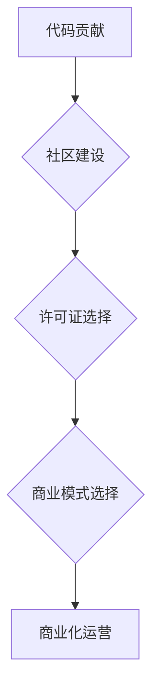

> 开源软件, 商业化, 代码贡献, 许可证, 社区, 盈利模式, 价值创造

## 1. 背景介绍

开源软件已经成为现代软件开发的基石，其灵活、透明和协作的特性推动着技术进步和创新。然而，开源软件的商业化之路并非一帆风顺，如何将代码贡献转化为商业价值，是开源社区和开发者面临的共同挑战。

开源软件的商业化模式多种多样，从商业支持到服务提供，从软件定制到培训咨询，都有其独特的价值链。本文将深入探讨开源软件的商业化路径，分析其核心概念、技术原理、实践案例以及未来发展趋势，为开发者和企业提供参考和启示。

## 2. 核心概念与联系

开源软件商业化的核心概念包括：

* **代码贡献:** 开发者将自己的代码开源，供他人免费使用、修改和分发。
* **社区建设:** 开源项目通常由一个活跃的社区支撑，社区成员共同维护、改进和推广开源软件。
* **许可证:** 开源软件的许可证规定了软件的使用、修改和分发的权利和限制，不同的许可证类型对商业化有不同的影响。
* **商业模式:** 开源软件的商业化模式是指通过开源软件创造价值并获得收益的方式，常见的模式包括商业支持、服务提供、软件定制、培训咨询等。

**开源软件商业化流程图:**



## 3. 核心算法原理 & 具体操作步骤

开源软件商业化涉及到多种算法和技术，例如：

* **版本控制:** Git 等版本控制系统帮助开发者管理代码变更，追踪历史记录，并协作开发。
* **持续集成:** Jenkins 等持续集成工具自动构建、测试和部署代码，提高开发效率和软件质量。
* **数据分析:** Google Analytics 等数据分析工具帮助开发者了解用户行为，优化软件功能和商业策略。

**3.1 算法原理概述**

版本控制算法的核心是跟踪代码变更历史，并提供高效的代码合并和冲突解决机制。持续集成算法则通过自动化构建、测试和部署流程，提高软件开发效率和可靠性。数据分析算法则通过统计和挖掘用户行为数据，为软件开发和商业决策提供 insights。

**3.2 算法步骤详解**

* **版本控制:**

    1. 创建一个新的 Git 仓库。
    2. 添加代码文件到仓库。
    3. 提交代码变更，并添加描述信息。
    4. 推送代码到远程仓库。
    5. 克隆远程仓库到本地，并进行代码修改和提交。
    6. 合并分支，解决冲突。

* **持续集成:**

    1. 配置 Jenkins 构建脚本，定义构建步骤和测试用例。
    2. 将代码仓库连接到 Jenkins。
    3. 触发构建，Jenkins 自动执行构建、测试和部署流程。
    4. 监控构建结果，并及时解决问题。

* **数据分析:**

    1. 安装 Google Analytics 或其他数据分析工具。
    2. 配置网站或应用程序的跟踪代码。
    3. 收集用户行为数据，例如页面访问、点击事件、用户停留时间等。
    4. 使用数据分析工具分析数据，并生成报表和图表。
    5. 根据数据 insights 优化软件功能和商业策略。

**3.3 算法优缺点**

* **版本控制:**

    * 优点: 跟踪代码变更历史，方便协作开发，提高代码质量。
    * 缺点: 需要学习 Git 等工具，管理复杂项目时可能存在性能问题。

* **持续集成:**

    * 优点: 自动化构建、测试和部署流程，提高开发效率和软件质量。
    * 缺点: 需要配置和维护 Jenkins 等工具，可能需要调整开发流程。

* **数据分析:**

    * 优点: 通过数据 insights 优化软件功能和商业策略，提高用户体验和商业效益。
    * 缺点: 需要收集和分析大量数据，需要专业的分析技能。

**3.4 算法应用领域**

* **版本控制:** 软件开发、网站维护、文档管理等领域。
* **持续集成:** 软件开发、网站部署、自动化测试等领域。
* **数据分析:** 用户行为分析、市场营销、产品优化等领域。

## 4. 数学模型和公式 & 详细讲解 & 举例说明

开源软件商业化涉及到多种数学模型和公式，例如：

* **用户增长模型:** 描述开源软件用户数量随时间的增长趋势。
* **收入预测模型:** 预估开源软件的潜在收入，例如商业支持、服务提供等。
* **成本分析模型:** 计算开源软件开发和运营的成本，例如人员成本、服务器成本等。

**4.1 数学模型构建**

用户增长模型可以采用指数增长模型或Logistic增长模型来描述开源软件的用户增长趋势。收入预测模型可以采用线性回归模型或时间序列模型来预测开源软件的潜在收入。成本分析模型可以采用成本核算方法来计算开源软件的开发和运营成本。

**4.2 公式推导过程**

* **指数增长模型:**

    $$
    N(t) = N_0 * e^{rt}
    $$

    其中:

    * $N(t)$:  t时刻的用户数量
    * $N_0$: 初始用户数量
    * $r$:  增长率
    * $t$:  时间

* **Logistic增长模型:**

    $$
    N(t) = \frac{K}{1 + e^{-r(t-t_0)}}
    $$

    其中:

    * $K$:  最终用户数量
    * $r$:  增长率
    * $t_0$:  拐点时间

**4.3 案例分析与讲解**

假设一个开源软件项目初始用户数量为 1000 人，增长率为 10% per month，则使用指数增长模型可以预测该软件在 12 个月后的用户数量为:

$$
N(12) = 1000 * e^{0.1 * 12} \approx 3320 人
$$

## 5. 项目实践：代码实例和详细解释说明

开源软件商业化需要结合实际项目进行实践，以下是一个简单的代码实例，演示如何使用开源软件构建一个简单的商业应用。

**5.1 开发环境搭建**

* 安装 Python 3.x
* 安装 Django 框架
* 创建一个新的 Django 项目

**5.2 源代码详细实现**

```python
# models.py
from django.db import models

class Product(models.Model):
    name = models.CharField(max_length=255)
    price = models.DecimalField(max_digits=10, decimal_places=2)

# views.py
from django.shortcuts import render
from .models import Product

def product_list(request):
    products = Product.objects.all()
    return render(request, 'product_list.html', {'products': products})
```

**5.3 代码解读与分析**

* models.py 文件定义了 Product 模型，用于存储产品名称和价格。
* views.py 文件定义了 product_list 函数，用于展示所有产品列表。

**5.4 运行结果展示**

运行 Django 项目，访问 http://127.0.0.1:8000/，即可看到产品列表页面。

## 6. 实际应用场景

开源软件商业化在各个领域都有广泛的应用场景，例如：

* **企业级软件:** 使用开源软件构建企业级应用，例如 CRM、ERP、协同办公等。
* **云计算平台:** 使用开源软件构建云计算平台，例如 Kubernetes、OpenStack等。
* **物联网:** 使用开源软件构建物联网应用，例如传感器数据采集、设备管理等。

**6.4 未来应用展望**

随着人工智能、大数据、云计算等技术的快速发展，开源软件商业化将迎来新的机遇和挑战。未来，开源软件将更加注重用户体验、数据安全和可扩展性，并与新兴技术深度融合，为企业和个人提供更加智能、高效和便捷的解决方案。

## 7. 工具和资源推荐

**7.1 学习资源推荐**

* **开源社区:** GitHub, GitLab, Bitbucket
* **开源软件基金会:** Apache Software Foundation, Linux Foundation
* **在线课程:** Coursera, Udemy, edX

**7.2 开发工具推荐**

* **版本控制:** Git, GitHub Desktop
* **持续集成:** Jenkins, Travis CI
* **数据分析:** Google Analytics, Apache Spark

**7.3 相关论文推荐**

* The Economics of Open Source Software
* Open Source Software Licensing: A Survey
* The Impact of Open Source Software on Innovation

## 8. 总结：未来发展趋势与挑战

开源软件商业化已经成为一种成熟的模式，但同时也面临着新的挑战。

**8.1 研究成果总结**

开源软件商业化模式多样，从商业支持到服务提供，从软件定制到培训咨询，都有其独特的价值链。开源软件商业化需要结合实际项目进行实践，并不断探索新的商业模式和技术解决方案。

**8.2 未来发展趋势**

开源软件将更加注重用户体验、数据安全和可扩展性，并与新兴技术深度融合，为企业和个人提供更加智能、高效和便捷的解决方案。

**8.3 面临的挑战**

开源软件商业化面临着以下挑战:

* 如何平衡开源精神和商业利益
* 如何吸引和留住优秀开发者
* 如何建立可持续的商业模式

**8.4 研究展望**

未来研究方向包括:

* 开源软件商业化模式的创新
* 开源软件社区建设的优化
* 开源软件与新兴技术的融合

## 9. 附录：常见问题与解答

* **Q: 如何选择合适的开源许可证？**

* **A:** 选择开源许可证需要根据项目的具体情况和商业目标，常见的许可证包括 GPL、MIT、Apache 等，每个许可证都有其不同的条款和限制。

* **Q: 如何吸引开发者贡献代码？**

* **A:** 可以通过提供良好的开发环境、清晰的代码规范、活跃的社区氛围、以及合理的激励机制来吸引开发者贡献代码。

* **Q: 如何建立可持续的开源商业模式？**

* **A:** 可以通过商业支持、服务提供、软件定制、培训咨询等多种方式来建立可持续的开源商业模式。


作者：禅与计算机程序设计艺术 / Zen and the Art of Computer Programming 
<end_of_turn>