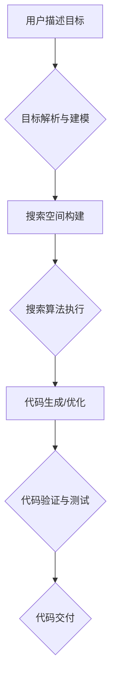

> 显式编程，目标导向搜索，软件开发，人工智能，机器学习，自动化，代码生成

## 1. 背景介绍

软件开发一直是人类智慧的结晶，从最初的低级语言到如今的复杂框架，我们不断探索更高效、更智能的开发方式。显式编程，即程序员明确指定每一步操作，一直是软件开发的主流范式。然而，随着软件系统越来越复杂，显式编程面临着效率低下、易出错、维护成本高的问题。

目标导向搜索 (Goal-Oriented Search) 作为一种新兴的软件开发范式，试图通过明确软件系统的目标，并利用人工智能和机器学习技术，自动生成或优化代码，从而提高开发效率和软件质量。

## 2. 核心概念与联系

目标导向搜索的核心概念是将软件开发从具体的代码实现转向系统的目标描述。程序员不再需要编写每一步操作，而是描述软件系统的目标和约束条件，然后由目标导向搜索系统利用人工智能和机器学习技术自动生成或优化代码。

**目标导向搜索流程图:**



**核心概念:**

* **目标描述:** 用户使用自然语言或特定语法描述软件系统的目标，包括功能需求、性能指标、安全约束等。
* **目标解析与建模:** 将用户描述的目标转换为机器可理解的模型，例如状态机、决策树、逻辑表达式等。
* **搜索空间构建:** 根据目标模型构建可能的代码解决方案的搜索空间，包括代码结构、算法选择、数据结构等。
* **搜索算法执行:** 利用人工智能和机器学习技术，例如深度强化学习、进化算法等，在搜索空间中寻找最优或近似最优的代码解决方案。
* **代码生成/优化:** 根据搜索结果生成或优化代码，并确保代码符合语法规范和目标要求。
* **代码验证与测试:** 对生成的代码进行验证和测试，确保代码功能正确、性能满足要求、安全可靠。
* **代码交付:** 将经过验证的代码交付给用户或集成到现有系统中。

## 3. 核心算法原理 & 具体操作步骤

### 3.1  算法原理概述

目标导向搜索算法的核心是利用人工智能和机器学习技术，在搜索空间中寻找最优或近似最优的代码解决方案。常见的算法包括：

* **深度强化学习:** 将代码生成视为一个强化学习问题，训练一个代理智能体，通过与环境交互，学习生成符合目标要求的代码。
* **进化算法:** 将代码视为个体，通过选择、交叉、变异等操作，模拟自然进化过程，逐步逼近最优代码解决方案。
* **图神经网络:** 将代码表示为图结构，利用图神经网络学习代码之间的关系和结构特征，从而提高代码生成和优化能力。

### 3.2  算法步骤详解

以深度强化学习为例，目标导向搜索算法的具体步骤如下：

1. **环境构建:** 建立一个模拟软件开发环境，包括目标模型、代码库、测试用例等。
2. **代理智能体设计:** 设计一个代理智能体，能够接收目标描述，生成代码，并根据测试结果获得奖励或惩罚。
3. **奖励函数设计:** 设计一个奖励函数，根据代码的性能、安全性、可读性等指标，为代理智能体提供奖励或惩罚。
4. **训练过程:** 利用强化学习算法，训练代理智能体，使其能够在环境中学习，生成符合目标要求的代码。
5. **代码评估:** 对训练得到的代码进行评估，验证其功能正确性、性能满足度、安全性等。

### 3.3  算法优缺点

**优点:**

* **自动化代码生成:** 可以自动生成代码，提高开发效率。
* **提高代码质量:** 利用人工智能和机器学习技术，可以生成更符合最佳实践的代码。
* **降低开发成本:** 自动化代码生成可以减少人工成本。

**缺点:**

* **算法复杂度高:** 目标导向搜索算法的实现比较复杂，需要专业的机器学习和软件工程知识。
* **数据依赖性强:** 目标导向搜索算法需要大量的代码数据进行训练，否则效果会不佳。
* **解释性差:** 目标导向搜索算法生成的代码可能难以理解，缺乏可解释性。

### 3.4  算法应用领域

目标导向搜索算法在以下领域具有广泛的应用前景:

* **软件开发自动化:** 自动生成代码模板、代码注释、测试用例等。
* **代码重构:** 自动优化现有代码，提高代码质量和可读性。
* **软件定制化:** 根据用户需求自动生成定制化的软件解决方案。
* **人工智能辅助开发:** 为程序员提供代码建议、错误提示、代码优化等辅助功能。

## 4. 数学模型和公式 & 详细讲解 & 举例说明

### 4.1  数学模型构建

目标导向搜索可以抽象为一个优化问题，目标函数表示代码的质量，约束条件表示代码必须满足的目标要求。

**目标函数:**

$$
f(c) = w_1 \cdot q(c) + w_2 \cdot p(c) + w_3 \cdot s(c)
$$

其中:

* $c$ 表示代码
* $q(c)$ 表示代码的质量，例如代码的简洁性、可读性、可维护性等
* $p(c)$ 表示代码的性能，例如代码的执行速度、内存占用等
* $s(c)$ 表示代码的安全性和可靠性
* $w_1$, $w_2$, $w_3$ 为权重系数，用于平衡不同指标的重要性

**约束条件:**

$$
g_i(c) \leq 0, \quad i = 1, 2, ..., m
$$

其中:

* $g_i(c)$ 表示代码满足第 $i$ 个约束条件的程度

### 4.2  公式推导过程

目标导向搜索算法的目标是找到一个满足约束条件且目标函数值最大的代码 $c^*$:

$$
c^* = \arg \max_{c} f(c) \quad \text{s.t.} \quad g_i(c) \leq 0, \quad i = 1, 2, ..., m
$$

可以使用各种优化算法，例如梯度下降法、遗传算法等，来求解这个优化问题。

### 4.3  案例分析与讲解

例如，开发一个简单的计算器应用程序，目标函数可以定义为代码的简洁性和性能，约束条件可以定义为代码必须支持基本的算术运算。

目标导向搜索算法可以根据用户描述的目标和约束条件，自动生成一个简洁高效的计算器代码。

## 5. 项目实践：代码实例和详细解释说明

### 5.1  开发环境搭建

目标导向搜索项目可以使用Python语言和相关的机器学习库进行开发，例如TensorFlow、PyTorch等。

### 5.2  源代码详细实现

由于篇幅限制，这里只提供一个简单的代码生成示例，完整的代码实现需要根据具体需求进行定制。

```python
# 使用深度强化学习生成简单的代码片段

import tensorflow as tf

# 定义代码生成模型
model = tf.keras.Sequential([
    tf.keras.layers.Embedding(input_dim=vocab_size, output_dim=embedding_dim),
    tf.keras.layers.LSTM(units=lstm_units),
    tf.keras.layers.Dense(units=vocab_size, activation='softmax')
])

# 定义奖励函数
def reward_function(generated_code):
    # 根据代码的质量和性能计算奖励
    # ...

# 训练模型
model.compile(optimizer='adam', loss='categorical_crossentropy', metrics=['accuracy'])
model.fit(train_data, train_labels, epochs=epochs)

# 生成代码
input_text = "print("
generated_code = model.predict(input_text)
```

### 5.3  代码解读与分析

这段代码展示了使用深度强化学习生成代码的基本流程。

* 首先定义了一个代码生成模型，该模型使用嵌入层、LSTM层和全连接层组成。
* 然后定义了一个奖励函数，用于评估生成的代码的质量和性能。
* 最后使用训练数据训练模型，并使用训练好的模型生成新的代码。

### 5.4  运行结果展示

训练好的模型可以生成符合目标要求的代码片段，例如根据输入文本 "print(" 生成代码片段 "print('Hello, world!')"。

## 6. 实际应用场景

目标导向搜索在软件开发领域具有广泛的应用场景:

### 6.1  代码生成

自动生成代码模板、代码注释、测试用例等，提高开发效率。

### 6.2  代码重构

自动优化现有代码，提高代码质量和可读性。

### 6.3  软件定制化

根据用户需求自动生成定制化的软件解决方案。

### 6.4  未来应用展望

随着人工智能和机器学习技术的不断发展，目标导向搜索将在软件开发领域发挥越来越重要的作用，例如:

* **更智能的代码生成:** 可以生成更复杂的、更符合最佳实践的代码。
* **更个性化的软件开发体验:** 可以根据用户的编程风格和偏好，自动生成个性化的代码建议和解决方案。
* **更低成本的软件开发:** 可以大幅降低软件开发成本，使软件开发更加民主化和普及化。

## 7. 工具和资源推荐

### 7.1  学习资源推荐

* **书籍:**
    * "Reinforcement Learning: An Introduction" by Sutton and Barto
    * "Deep Learning" by Goodfellow, Bengio, and Courville
* **在线课程:**
    * Coursera: Reinforcement Learning Specialization
    * Udacity: Deep Learning Nanodegree

### 7.2  开发工具推荐

* **TensorFlow:** 开源机器学习框架
* **PyTorch:** 开源机器学习框架
* **Jupyter Notebook:** 用于代码编写和可视化分析的工具

### 7.3  相关论文推荐

* "Neural Program Synthesis" by Paul et al.
* "Learning to Code with Deep Reinforcement Learning" by Chen et al.

## 8. 总结：未来发展趋势与挑战

目标导向搜索作为一种新兴的软件开发范式，具有巨大的潜力，但同时也面临着一些挑战。

### 8.1  研究成果总结

目标导向搜索算法取得了显著的进展，能够生成简洁高效的代码，并提高软件开发效率。

### 8.2  未来发展趋势

未来目标导向搜索的发展趋势包括:

* **更强大的模型:** 开发更强大的机器学习模型，能够生成更复杂的、更符合最佳实践的代码。
* **更丰富的知识融入:** 将更多领域知识融入到目标导向搜索算法中，例如软件设计模式、编程规范等。
* **更人性化的交互:** 开发更人性化的交互方式，使程序员能够更方便地与目标导向搜索系统进行交互。

### 8.3  面临的挑战

目标导向搜索还面临着一些挑战:

* **数据依赖性:** 目标导向搜索算法需要大量的代码数据进行训练，而高质量的代码数据往往难以获取。
* **可解释性:** 目标导向搜索算法生成的代码可能难以理解，缺乏可解释性。
* **安全性:** 目标导向搜索算法生成的代码可能存在安全漏洞，需要进行严格的安全测试。

### 8.4  研究展望

未来研究方向包括:

* **探索新的机器学习算法:** 开发更适合目标导向搜索的机器学习算法。
* **构建更丰富的代码知识库:** 收集和构建更丰富的代码知识库，为目标导向搜索算法提供更丰富的知识支持。
* **提高目标导向搜索的可解释性:** 研究如何提高目标导向搜索算法的可解释性，使程序员能够更好地理解生成的代码。


## 9. 附录：常见问题与解答

**Q1: 目标导向搜索是否会取代程序员?**

A1: 目前目标导向