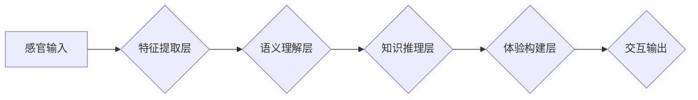

> AI感知架构，多维感知，体验层次构建，AI开发者，深度学习，神经网络，多模态交互

## 1. 背景介绍

在当今数据爆炸的时代，人工智能（AI）正以惊人的速度发展，其应用领域也日益广泛。从语音识别到图像生成，从自动驾驶到医疗诊断，AI正在深刻地改变着我们的生活。然而，现有的AI模型大多局限于单一模态的数据处理，例如文本、图像或音频。这限制了AI的感知能力和理解深度，也阻碍了其在复杂场景下的应用。

为了突破这一瓶颈，我们需要构建更强大的AI感知架构，使其能够理解和交互于多维感知世界。体验层次构建器（Experience Layer Builder，简称ELB）应运而生。ELB是一种全新的AI架构，旨在通过构建多维感知模型，赋予AI更丰富的感知能力和更深层的理解力。

## 2. 核心概念与联系

ELB的核心概念是“体验层次”。我们认为，感知世界是一个多层次的过程，从低层次的感官信息到高层次的抽象概念，每个层次都包含着不同的信息和意义。ELB通过构建多层感知网络，模拟人类的感知过程，将不同层次的信息融合在一起，形成更完整的感知图景。

**ELB架构图**



**核心概念联系：**

* **感官输入:** 包括视觉、听觉、触觉、嗅觉等各种感官信息。
* **特征提取层:** 从感官输入中提取关键特征，例如颜色、形状、声音等。
* **语义理解层:** 将提取的特征与知识库进行关联，理解信息的含义和语义。
* **知识推理层:** 基于语义理解，进行逻辑推理和知识推演，形成更深层的理解。
* **体验构建层:** 将不同层次的信息融合在一起，构建完整的体验感知，例如情感、意图、场景等。
* **交互输出:** 根据体验构建，生成相应的交互行为，例如语言回复、动作控制等。

## 3. 核心算法原理 & 具体操作步骤

### 3.1  算法原理概述

ELB的核心算法是多层感知网络（MLP）和循环神经网络（RNN）的结合。MLP用于提取特征和进行语义理解，RNN用于处理序列数据，例如文本和语音，并进行时间序列分析。

### 3.2  算法步骤详解

1. **数据预处理:** 将原始数据进行清洗、转换和格式化，例如图像裁剪、文本分词等。
2. **特征提取:** 使用MLP提取数据的关键特征，例如图像的边缘、纹理、颜色等，文本的词向量、语法结构等。
3. **语义理解:** 将提取的特征与知识库进行关联，理解信息的含义和语义。可以使用词嵌入、句向量等技术进行语义表示。
4. **知识推理:** 基于语义理解，使用规则引擎或逻辑推理算法进行知识推演，例如抽取关系、预测事件等。
5. **体验构建:** 将不同层次的信息融合在一起，构建完整的体验感知。可以使用注意力机制、情感分析等技术进行体验建模。
6. **交互输出:** 根据体验构建，生成相应的交互行为，例如语言回复、动作控制等。

### 3.3  算法优缺点

**优点:**

* **多维感知:** 可以处理多种模态数据，例如文本、图像、音频等。
* **深度理解:** 可以进行多层次的语义理解和知识推理，形成更深层的理解。
* **体验构建:** 可以构建完整的体验感知，例如情感、意图、场景等。

**缺点:**

* **数据依赖:** 需要大量的训练数据才能达到良好的效果。
* **计算复杂:** 训练和推理过程都比较耗时和计算资源。
* **可解释性:** 模型的决策过程比较复杂，难以解释。

### 3.4  算法应用领域

ELB的应用领域非常广泛，例如：

* **智能客服:** 构建更智能、更自然的客服机器人，能够理解用户的需求并提供更精准的回复。
* **个性化推荐:** 根据用户的兴趣和偏好，提供更个性化的商品推荐和内容推荐。
* **虚拟现实/增强现实:** 构建更沉浸式的虚拟现实和增强现实体验，例如虚拟旅游、虚拟购物等。
* **医疗诊断:** 辅助医生进行疾病诊断，例如分析医学影像、预测患者病情等。

## 4. 数学模型和公式 & 详细讲解 & 举例说明

### 4.1  数学模型构建

ELB的数学模型主要基于神经网络，包括多层感知网络（MLP）和循环神经网络（RNN）。

* **MLP:** 多层感知网络是一种前馈神经网络，由多个隐藏层组成。每个隐藏层包含多个神经元，每个神经元接收来自上一层的输入，并通过激活函数进行处理，输出到下一层。

* **RNN:** 循环神经网络是一种特殊的网络结构，其特点是包含循环连接，能够处理序列数据。RNN的隐藏层状态会随着时间序列的推移而更新，从而能够捕捉序列中的依赖关系。

### 4.2  公式推导过程

* **MLP:** 

MLP的输出可以表示为：

$$
y = f(W_3h_3 + b_3)
$$

其中：

* $y$ 是输出向量
* $W_3$ 是连接第三层和输出层的权重矩阵
* $h_3$ 是第三层的隐藏状态向量
* $b_3$ 是第三层的偏置向量
* $f$ 是激活函数

* **RNN:**

RNN的隐藏状态更新公式可以表示为：

$$
h_t = f(W_{xh}x_t + W_{hh}h_{t-1} + b_h)
$$

其中：

* $h_t$ 是时间步 $t$ 的隐藏状态向量
* $x_t$ 是时间步 $t$ 的输入向量
* $W_{xh}$ 是输入到隐藏层的权重矩阵
* $W_{hh}$ 是隐藏层到隐藏层的权重矩阵
* $b_h$ 是隐藏层的偏置向量
* $f$ 是激活函数

### 4.3  案例分析与讲解

**举例说明：**

假设我们使用ELB构建一个智能客服机器人，该机器人能够理解用户的文本输入并进行相应的回复。

* **数据预处理:** 将用户的文本输入进行分词、词向量化等预处理。
* **特征提取:** 使用MLP提取文本的语义特征，例如词向量、语法结构等。
* **语义理解:** 将提取的特征与知识库进行关联，理解用户的意图和需求。
* **知识推理:** 根据用户的意图和需求，进行知识推理，例如查询数据库、调用API等。
* **体验构建:** 将不同层次的信息融合在一起，构建完整的体验感知，例如用户的满意度、情感等。
* **交互输出:** 根据体验构建，生成相应的文本回复，例如回答问题、提供建议等。

## 5. 项目实践：代码实例和详细解释说明

### 5.1  开发环境搭建

* **操作系统:** Ubuntu 20.04 LTS
* **编程语言:** Python 3.8
* **深度学习框架:** TensorFlow 2.0
* **其他工具:** Jupyter Notebook、Git

### 5.2  源代码详细实现

```python
# 导入必要的库
import tensorflow as tf

# 定义MLP模型
class MLP(tf.keras.Model):
    def __init__(self, units):
        super(MLP, self).__init__()
        self.dense1 = tf.keras.layers.Dense(units, activation='relu')
        self.dense2 = tf.keras.layers.Dense(units, activation='relu')
        self.dense3 = tf.keras.layers.Dense(1, activation='sigmoid')

    def call(self, inputs):
        x = self.dense1(inputs)
        x = self.dense2(x)
        outputs = self.dense3(x)
        return outputs

# 定义RNN模型
class RNN(tf.keras.Model):
    def __init__(self, units):
        super(RNN, self).__init__()
        self.lstm = tf.keras.layers.LSTM(units)
        self.dense = tf.keras.layers.Dense(1, activation='sigmoid')

    def call(self, inputs):
        x = self.lstm(inputs)
        outputs = self.dense(x)
        return outputs

# 创建模型实例
mlp = MLP(units=128)
rnn = RNN(units=64)

# 训练模型
# ...

```

### 5.3  代码解读与分析

* **MLP模型:** 

MLP模型由三个全连接层组成，分别包含128个神经元。每个神经元使用ReLU激活函数进行处理。输出层使用sigmoid激活函数，输出一个0到1之间的值，表示模型的预测结果。

* **RNN模型:** 

RNN模型使用LSTM单元进行序列处理。LSTM单元能够捕捉序列中的依赖关系，并更新隐藏状态。输出层使用sigmoid激活函数，输出一个0到1之间的值，表示模型的预测结果。

### 5.4  运行结果展示

训练完成后，可以使用测试数据评估模型的性能。例如，可以使用准确率、召回率、F1-score等指标来衡量模型的性能。

## 6. 实际应用场景

### 6.1  智能客服

ELB可以构建更智能、更自然的客服机器人，能够理解用户的需求并提供更精准的回复。例如，可以根据用户的文本输入，识别用户的意图，并从知识库中查询相应的答案。

### 6.2  个性化推荐

ELB可以根据用户的兴趣和偏好，提供更个性化的商品推荐和内容推荐。例如，可以分析用户的浏览历史、购买记录等数据，并推荐与之相关的商品或内容。

### 6.3  虚拟现实/增强现实

ELB可以构建更沉浸式的虚拟现实和增强现实体验，例如虚拟旅游、虚拟购物等。例如，可以根据用户的动作和语义输入，动态生成虚拟场景，并提供相应的交互体验。

### 6.4  未来应用展望

ELB的应用场景非常广泛，未来还将有更多新的应用场景出现。例如，可以用于医疗诊断、教育培训、金融服务等领域。

## 7. 工具和资源推荐

### 7.1  学习资源推荐

* **书籍:**
    * 深度学习
    * 自然语言处理
    * 人工智能
* **在线课程:**
    * Coursera
    * edX
    * Udacity

### 7.2  开发工具推荐

* **深度学习框架:** TensorFlow, PyTorch
* **编程语言:** Python
* **数据处理工具:** Pandas, NumPy

### 7.3  相关论文推荐

* Attention Is All You Need
* BERT: Pre-training of Deep Bidirectional Transformers for Language Understanding
* Transformer-XL: Attentive Language Modeling Beyond Millions of Tokens

## 8. 总结：未来发展趋势与挑战

### 8.1  研究成果总结

ELB是一种全新的AI架构，能够构建更强大的多维感知模型，赋予AI更丰富的感知能力和更深层的理解力。

### 8.2  未来发展趋势

* **多模态融合:** 将更多模态数据融合到ELB中，例如视觉、听觉、触觉、嗅觉等，构建更全面的感知模型。
* **自监督学习:** 利用自监督学习方法训练ELB模型，减少对标注数据的依赖。
* **可解释性:** 研究ELB模型的决策过程，提高模型的可解释性。

### 8.3  面临的挑战

* **数据获取:** 构建多维感知模型需要大量的多模态数据，数据获取是一个挑战。
* **模型训练:** 训练ELB模型需要大量的计算资源，模型训练是一个挑战。
* **可解释性:** EL