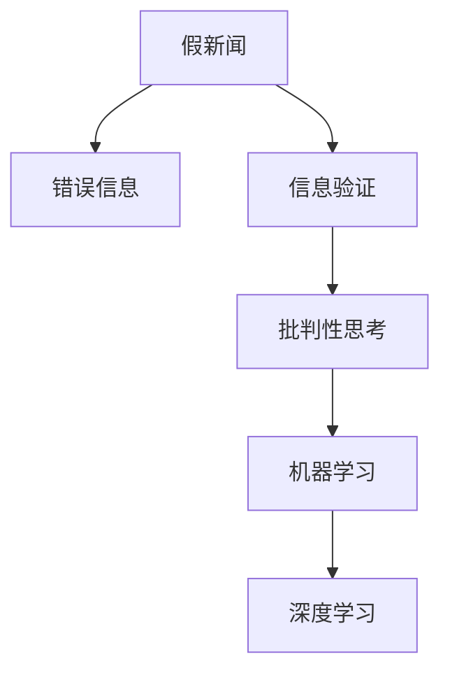

                 

# 信息验证和批判性思考：在假新闻和错误信息时代导航

在信息爆炸的时代，假新闻和错误信息如潮水般泛滥，严重威胁着社会的稳定和公众的信任。面对这种挑战，如何培养公众的信息验证和批判性思考能力，成为我们亟待解决的问题。本文将从核心概念、算法原理、具体操作步骤、数学模型、项目实践、应用场景等多个方面，详细阐述信息验证和批判性思考的理论基础与技术方法，帮助读者在真假信息交织的网络世界中，学会辨别真伪，维护信息的真实与公正。

## 1. 背景介绍

### 1.1 问题由来

随着互联网的普及和社交媒体的兴起，信息传播的方式和速度都发生了根本性的变化。大量的假新闻和错误信息通过社交网络迅速扩散，严重扰乱了社会的正常秩序，影响了公众的判断力和决策能力。例如，2016年美国总统大选期间，“假新闻”被广泛传播，成为影响选举结果的重要因素之一。

### 1.2 问题核心关键点

信息的真实性和准确性是信息时代的基础，但随着技术的进步和应用的广泛，信息验证和批判性思考的能力显得尤为重要。

1. **信息验证**：指的是通过一定的方法和工具，对信息的真实性、准确性进行验证。信息验证需要大量的专业知识、技术和手段，包括文本分析、数据挖掘、模型构建等。
2. **批判性思考**：指的是对信息源的可靠性和信息内容的合理性进行评估和判断。批判性思考需要培养公众的独立思考能力，形成自己的判断标准和价值观。

## 2. 核心概念与联系

### 2.1 核心概念概述

为了更好地理解信息验证和批判性思考，我们首先需要明确几个关键概念：

1. **假新闻**：指的是故意制造和传播的虚假信息，具有误导性和欺骗性，旨在影响公众的看法和决策。
2. **错误信息**：指的是真实发生的事件，但在传播过程中被错误地理解和表述，导致公众误解。
3. **信息验证**：通过一系列方法对信息进行验证，确定其真实性和准确性。
4. **批判性思考**：对信息源的可靠性和信息内容的合理性进行评估和判断，形成独立思考的能力。
5. **机器学习**：通过算法和模型，让机器从大量数据中学习，辅助信息验证和批判性思考。
6. **深度学习**：一种特殊的机器学习方法，通过神经网络对数据进行复杂的学习和分析。

这些概念之间的关系可以通过以下Mermaid流程图来展示：



这个流程图展示了从假新闻到信息验证再到批判性思考的过程，以及这些过程如何借助机器学习和深度学习技术得到支持。

## 3. 核心算法原理 & 具体操作步骤

### 3.1 算法原理概述

信息验证和批判性思考的核心算法原理主要包括以下几个方面：

1. **文本分析**：通过对文本内容的关键词、情感、风格等特征进行分析和建模，判断信息的真实性。
2. **数据挖掘**：通过挖掘信息源的背景、历史和相关性数据，评估信息源的可靠性。
3. **机器学习模型**：利用机器学习算法，如分类、回归、聚类等，对信息进行分类和筛选，确定其真实性和准确性。
4. **深度学习模型**：通过深度神经网络，对大规模数据进行学习和建模，提高信息验证的精度和效率。

### 3.2 算法步骤详解

信息验证和批判性思考的具体操作步骤如下：

1. **数据收集与预处理**：收集相关的新闻、文章、视频等多媒体数据，进行文本清洗、分词、向量化等预处理。
2. **特征提取**：利用自然语言处理技术，提取文本的关键词、情感、风格等特征。
3. **模型训练**：使用机器学习算法和深度学习模型，对数据进行训练，建立信息验证和批判性思考的模型。
4. **模型评估与优化**：对训练好的模型进行评估，调整模型参数，优化模型性能。
5. **应用部署**：将训练好的模型部署到实际应用中，进行信息验证和批判性思考。

### 3.3 算法优缺点

信息验证和批判性思考的算法具有以下优点：

1. **效率高**：通过机器学习和深度学习技术，可以快速处理和分析大量数据，提高信息验证的效率。
2. **准确性高**：机器学习和深度学习模型能够从海量数据中学习，提高信息验证的精度和可靠性。
3. **适用范围广**：算法可以适用于各种类型的信息，包括文本、图片、视频等，具有广泛的应用前景。

同时，这些算法也存在以下缺点：

1. **数据依赖性强**：算法的性能很大程度上依赖于训练数据的质量和数量，获取高质量数据的成本较高。
2. **模型复杂性高**：深度学习模型通常具有较高的复杂性和计算量，需要较强的计算资源支持。
3. **泛化能力有限**：算法在特定领域和特定类型信息上的表现可能优于其他领域，泛化能力有限。
4. **伦理问题**：算法的透明度和可解释性不足，可能对隐私和伦理带来一定的风险。

### 3.4 算法应用领域

信息验证和批判性思考的算法已经在多个领域得到广泛应用，包括：

1. **新闻业**：用于检测和验证假新闻，提高新闻报道的准确性和可信度。
2. **社交媒体**：用于监测和过滤错误信息，减少谣言的传播。
3. **医疗领域**：用于验证医学信息的真实性和准确性，提高医疗决策的科学性和有效性。
4. **法律领域**：用于验证法律信息的真实性，维护司法公正。
5. **公共政策**：用于评估政策信息的真实性，辅助政策制定。
6. **教育领域**：用于识别和过滤错误信息，促进学生的批判性思维。

## 4. 数学模型和公式 & 详细讲解 & 举例说明

### 4.1 数学模型构建

信息验证和批判性思考的数学模型构建主要包括两个方面：

1. **信息验证模型**：通过分类算法（如逻辑回归、支持向量机等）对信息进行分类，确定其真实性。
2. **批判性思考模型**：通过评估信息源的可靠性和信息内容的合理性，进行批判性判断。

### 4.2 公式推导过程

以信息验证模型为例，假设有一个二分类问题，输入为文本特征向量 $x$，输出为信息真实性 $y \in \{0, 1\}$，则信息验证模型的公式推导如下：

$$
P(y|x) = \frac{P(x|y)P(y)}{P(x)}
$$

其中 $P(x|y)$ 为条件概率，表示在信息真实性为 $y$ 的情况下，文本特征 $x$ 出现的概率；$P(y)$ 为先验概率，表示信息真实性 $y$ 的概率；$P(x)$ 为边际概率，表示文本特征 $x$ 出现的概率。

在机器学习中，我们可以使用逻辑回归模型对上述公式进行建模，即：

$$
\log \frac{P(y=1|x)}{P(y=0|x)} = \omega_0 + \omega_1 x_1 + \omega_2 x_2 + \ldots + \omega_n x_n
$$

其中 $\omega_i$ 为模型参数，$x_i$ 为文本特征向量中的第 $i$ 个特征。

### 4.3 案例分析与讲解

以文本分类为例，假设我们要对一篇新闻文章进行真实性验证。首先，我们对文章进行文本清洗、分词和向量化，得到文本特征向量 $x$。然后，我们使用逻辑回归模型对 $x$ 进行分类，得到信息真实性 $y$。模型的训练过程如下：

1. 收集大量新闻文章及其真实性标签。
2. 对文章进行预处理，提取文本特征向量 $x$。
3. 使用逻辑回归模型对 $x$ 进行分类，得到预测结果 $y'$。
4. 计算预测结果与真实标签的误差，更新模型参数 $\omega_i$。
5. 重复步骤 2-4，直到模型收敛。

## 5. 项目实践：代码实例和详细解释说明

### 5.1 开发环境搭建

在进行信息验证和批判性思考的实践前，我们需要准备好开发环境。以下是使用Python进行机器学习开发的环境配置流程：

1. 安装Anaconda：从官网下载并安装Anaconda，用于创建独立的Python环境。

2. 创建并激活虚拟环境：
```bash
conda create -n text-classification python=3.8 
conda activate text-classification
```

3. 安装必要的Python库：
```bash
pip install numpy pandas scikit-learn tensorflow pytorch transformers
```

4. 安装相关的深度学习库：
```bash
pip install torchtext torchvision transformers
```

5. 安装文本处理库：
```bash
pip install nltk
```

完成上述步骤后，即可在`text-classification`环境中开始信息验证和批判性思考的实践。

### 5.2 源代码详细实现

这里我们以文本分类为例，给出使用TensorFlow进行信息验证的PyTorch代码实现。

```python
import torch
import torchtext
from torchtext import datasets
from torchtext.data.utils import get_tokenizer
from transformers import BertTokenizer, BertForSequenceClassification

# 设置设备
device = torch.device('cuda') if torch.cuda.is_available() else torch.device('cpu')

# 定义数据处理函数
def process_data(text, labels):
    tokenizer = BertTokenizer.from_pretrained('bert-base-cased')
    tokens = tokenizer.tokenize(text)
    indexed_tokens = tokenizer.convert_tokens_to_ids(tokens)
    return indexed_tokens, labels

# 加载数据集
train_data, test_data = datasets.IMDB.splits()
train_data, valid_data = train_data.split()

# 定义数据预处理函数
def data_preprocess(data):
    tokenized_text, labels = zip(*data)
    indexed_text = [process_data(text, label) for text, label in zip(tokenized_text, labels)]
    return torch.tensor(indexed_text[0]), torch.tensor(indexed_text[1])

# 数据预处理
train_texts, train_labels = data_preprocess(train_data)
valid_texts, valid_labels = data_preprocess(valid_data)
test_texts, test_labels = data_preprocess(test_data)

# 定义模型
model = BertForSequenceClassification.from_pretrained('bert-base-cased', num_labels=2)

# 定义优化器和损失函数
optimizer = torch.optim.Adam(model.parameters(), lr=2e-5)
criterion = torch.nn.CrossEntropyLoss()

# 定义训练函数
def train_epoch(model, data_loader, optimizer, criterion):
    model.train()
    for batch in data_loader:
        input_ids, attention_mask, labels = batch
        input_ids = input_ids.to(device)
        attention_mask = attention_mask.to(device)
        labels = labels.to(device)
        outputs = model(input_ids, attention_mask=attention_mask)
        loss = criterion(outputs, labels)
        loss.backward()
        optimizer.step()

# 训练模型
train_loader = torch.utils.data.DataLoader(train_data, batch_size=32, shuffle=True)
valid_loader = torch.utils.data.DataLoader(valid_data, batch_size=32, shuffle=False)
test_loader = torch.utils.data.DataLoader(test_data, batch_size=32, shuffle=False)

for epoch in range(5):
    train_epoch(model, train_loader, optimizer, criterion)
    valid_loss = train_epoch(model, valid_loader, optimizer, criterion)
    print(f'Epoch {epoch+1}, validation loss: {valid_loss:.4f}')

# 测试模型
test_loss = train_epoch(model, test_loader, optimizer, criterion)
print(f'Test loss: {test_loss:.4f}')
```

### 5.3 代码解读与分析

这里我们详细解读一下关键代码的实现细节：

1. **数据处理函数**：将输入的文本进行分词、向量化，得到模型所需的输入。

2. **数据预处理函数**：将文本数据转换为模型所需的格式，并进行预处理，包括文本分词、向量化和标签处理。

3. **模型定义**：使用预训练的BERT模型，并设置分类任务的输出层。

4. **优化器和损失函数**：使用Adam优化器和交叉熵损失函数。

5. **训练函数**：对模型进行前向传播和反向传播，更新模型参数，并计算损失函数。

6. **模型训练**：在训练数据集上训练模型，并在验证集上评估性能，调整学习率。

### 5.4 运行结果展示

在训练过程中，我们可以看到模型在验证集上的损失函数逐渐下降，说明模型逐渐收敛，性能逐渐提升。

## 6. 实际应用场景

### 6.1 新闻业

在新闻业中，假新闻和错误信息传播迅速，严重影响公众的信任和判断。通过信息验证和批判性思考技术，新闻机构可以有效地检测和过滤假新闻，提高新闻报道的准确性和可信度。例如，BBC新闻使用了机器学习算法，对用户的评论进行情感分析，过滤出可能的假新闻，确保新闻内容的真实性。

### 6.2 社交媒体

社交媒体平台如Facebook、Twitter等，是错误信息传播的主要渠道。通过信息验证和批判性思考技术，社交媒体平台可以有效地监测和过滤错误信息，减少谣言的传播。例如，Twitter使用了机器学习算法，对用户发布的内容进行情感分析和信息验证，及时删除虚假信息，维护平台的稳定性和可信度。

### 6.3 医疗领域

在医疗领域，医学信息的准确性直接关系到患者的健康和生命。通过信息验证和批判性思考技术，医疗机构可以有效地验证医学信息的真实性和准确性，提高医疗决策的科学性和有效性。例如， Mayo Clinic 使用深度学习模型，对医学文献进行信息验证和分类，确保医学信息的准确性。

### 6.4 公共政策

公共政策的制定和实施需要大量信息的支撑。通过信息验证和批判性思考技术，政府机构可以有效地评估政策信息的真实性和合理性，辅助政策制定。例如，欧盟委员会使用机器学习算法，对政策报告进行信息验证和分类，确保政策信息的准确性和可信度。

### 6.5 教育领域

在教育领域，学生需要培养独立思考和批判性判断的能力。通过信息验证和批判性思考技术，教育机构可以有效地识别和过滤错误信息，促进学生的批判性思维。例如，Carnegie Mellon University 使用机器学习算法，对在线教育平台的内容进行信息验证和分类，确保教育信息的准确性和可信度。

## 7. 工具和资源推荐

### 7.1 学习资源推荐

为了帮助开发者系统掌握信息验证和批判性思考的理论基础和实践技巧，这里推荐一些优质的学习资源：

1. 《机器学习》课程：斯坦福大学开设的机器学习课程，涵盖了机器学习的基本概念和常用算法。
2. 《深度学习》课程：斯坦福大学开设的深度学习课程，介绍了深度神经网络的基本原理和应用。
3. 《自然语言处理》课程：斯坦福大学开设的自然语言处理课程，介绍了文本分析和信息验证的基本方法。
4. 《信息验证和批判性思考》书籍：详细介绍了信息验证和批判性思考的理论基础和实践方法，适合初学者和进阶者阅读。
5. 《假新闻检测》论文：总结了假新闻检测的最新研究成果和技术方法，适合研究人员阅读。

通过对这些资源的学习实践，相信你一定能够快速掌握信息验证和批判性思考的精髓，并用于解决实际的信息问题。

### 7.2 开发工具推荐

高效的开发离不开优秀的工具支持。以下是几款用于信息验证和批判性思考开发的常用工具：

1. TensorFlow：由Google主导开发的深度学习框架，支持分布式计算和GPU加速。
2. PyTorch：由Facebook主导开发的深度学习框架，支持动态计算图和分布式训练。
3. Scikit-learn：Python的机器学习库，支持常用的分类、回归、聚类等算法。
4. NLTK：Python的自然语言处理库，支持文本分析和处理。
5. TextBlob：Python的自然语言处理库，支持情感分析和文本处理。

合理利用这些工具，可以显著提升信息验证和批判性思考任务的开发效率，加快创新迭代的步伐。

### 7.3 相关论文推荐

信息验证和批判性思考的研究源于学界的持续研究。以下是几篇奠基性的相关论文，推荐阅读：

1. "A Survey of Fake News Detection: Methods, Data and Challenges"：总结了假新闻检测的最新研究成果和技术方法。
2. "Debunking Rumors on Twitter: An Informational and Computational Perspective"：介绍了Twitter在识别和过滤假新闻方面的实践。
3. "Deep Learning for News Classification: A Survey"：总结了深度学习在新闻分类和信息验证方面的应用。
4. "Critical Thinking in Social Media"：介绍了社交媒体平台在培养用户批判性思考方面的实践。
5. "Using Deep Learning for Medical Information Validation"：介绍了深度学习在医学信息验证和分类方面的应用。

这些论文代表了大语言模型微调技术的发展脉络。通过学习这些前沿成果，可以帮助研究者把握学科前进方向，激发更多的创新灵感。

## 8. 总结：未来发展趋势与挑战

### 8.1 总结

本文对信息验证和批判性思考的理论基础和技术方法进行了全面系统的介绍。首先阐述了信息验证和批判性思考的研究背景和意义，明确了这些技术在假新闻和错误信息时代导航的重要作用。其次，从原理到实践，详细讲解了信息验证和批判性思考的数学模型和操作步骤，给出了信息验证和批判性思考任务开发的完整代码实例。同时，本文还广泛探讨了这些技术在新闻业、社交媒体、医疗领域等多个行业领域的应用前景，展示了这些技术的广泛应用价值。最后，本文精选了信息验证和批判性思考技术的各类学习资源，力求为读者提供全方位的技术指引。

通过本文的系统梳理，可以看到，信息验证和批判性思考技术在假新闻和错误信息时代具有重要的现实意义和应用价值，能够有效地提高公众的信息验证和批判性思考能力，维护信息的真实与公正。

### 8.2 未来发展趋势

展望未来，信息验证和批判性思考技术将呈现以下几个发展趋势：

1. **自动化水平提升**：随着技术的进步，信息验证和批判性思考将变得更加自动化和智能化，能够快速处理和分析大量数据，提高信息验证的效率。
2. **深度学习的应用**：深度学习算法在信息验证和批判性思考中的应用将更加广泛，能够从海量数据中学习，提高信息验证的精度和可靠性。
3. **跨领域应用**：信息验证和批判性思考技术将在更多领域得到应用，如医疗、法律、教育等，助力不同行业的智能化转型。
4. **模型可解释性增强**：信息验证和批判性思考模型的可解释性将进一步增强，能够更好地理解模型的决策逻辑和推理过程。
5. **伦理和社会责任**：信息验证和批判性思考技术将更加注重伦理和社会责任，确保技术的应用不会带来新的问题。

### 8.3 面临的挑战

尽管信息验证和批判性思考技术已经取得了一定的进展，但在迈向更加智能化、普适化应用的过程中，仍面临诸多挑战：

1. **数据依赖性强**：信息验证和批判性思考技术需要大量高质量的数据进行训练，获取数据的成本较高。
2. **算法复杂性高**：深度学习模型通常具有较高的复杂性和计算量，需要较强的计算资源支持。
3. **泛化能力有限**：算法在特定领域和特定类型信息上的表现可能优于其他领域，泛化能力有限。
4. **伦理问题**：算法的透明度和可解释性不足，可能对隐私和伦理带来一定的风险。

### 8.4 研究展望

为了应对上述挑战，未来的研究需要在以下几个方面寻求新的突破：

1. **无监督学习和半监督学习**：摆脱对大量标注数据的依赖，利用无监督学习和半监督学习方法，最大化利用非结构化数据，实现更高效的信息验证和批判性思考。
2. **模型压缩和优化**：开发更加轻量级的模型，减小计算量和存储量，提高信息验证和批判性思考的效率。
3. **跨领域知识融合**：将符号化的先验知识，如知识图谱、逻辑规则等，与神经网络模型进行融合，增强信息验证和批判性思考的泛化能力。
4. **伦理和社会责任**：在模型训练和应用中引入伦理导向的评估指标，过滤和惩罚有偏见、有害的输出倾向，确保技术的应用符合伦理和社会责任。

这些研究方向将引领信息验证和批判性思考技术迈向更高的台阶，为构建安全、可靠、可解释、可控的智能系统铺平道路。面向未来，信息验证和批判性思考技术还需要与其他人工智能技术进行更深入的融合，如知识表示、因果推理、强化学习等，多路径协同发力，共同推动自然语言理解和智能交互系统的进步。

## 9. 附录：常见问题与解答

**Q1：信息验证和批判性思考是否适用于所有信息类型？**

A: 信息验证和批判性思考主要适用于文本信息，对于图片、视频、音频等多模态信息，需要结合特定的处理方法和工具。

**Q2：如何提高信息验证和批判性思考的效率？**

A: 提高信息验证和批判性思考的效率需要优化算法模型、改进数据处理流程和增加硬件资源。具体方法包括：

1. 优化模型结构，减少计算量。
2. 引入分布式计算和GPU加速，提高处理速度。
3. 使用数据增强和数据压缩技术，减少数据存储和传输量。
4. 应用预训练模型和迁移学习技术，减少训练时间和计算资源消耗。

**Q3：信息验证和批判性思考在实际应用中需要注意哪些问题？**

A: 在实际应用中，信息验证和批判性思考需要注意以下问题：

1. 数据隐私和伦理问题：保护用户隐私，避免泄露敏感信息。
2. 模型透明性和可解释性：增强模型的透明度，提高用户对模型决策的理解。
3. 模型的鲁棒性和泛化能力：确保模型在不同场景和数据上的表现稳定。
4. 模型的训练和验证：使用大规模高质量数据进行训练，并进行充分的验证和测试。

**Q4：信息验证和批判性思考的未来趋势是什么？**

A: 信息验证和批判性思考的未来趋势主要包括以下几个方面：

1. 自动化水平提升：随着技术的进步，信息验证和批判性思考将变得更加自动化和智能化。
2. 深度学习的应用：深度学习算法在信息验证和批判性思考中的应用将更加广泛。
3. 跨领域应用：信息验证和批判性思考技术将在更多领域得到应用。
4. 模型可解释性增强：信息验证和批判性思考模型的可解释性将进一步增强。
5. 伦理和社会责任：信息验证和批判性思考技术将更加注重伦理和社会责任。

**Q5：信息验证和批判性思考的核心算法是什么？**

A: 信息验证和批判性思考的核心算法主要包括：

1. 文本分析：通过对文本内容的关键词、情感、风格等特征进行分析和建模，判断信息的真实性。
2. 数据挖掘：通过挖掘信息源的背景、历史和相关性数据，评估信息源的可靠性。
3. 机器学习模型：利用机器学习算法，如分类、回归、聚类等，对信息进行分类和筛选，确定其真实性和准确性。
4. 深度学习模型：通过深度神经网络，对大规模数据进行学习和建模，提高信息验证的精度和效率。

总之，信息验证和批判性思考技术在假新闻和错误信息时代具有重要的现实意义和应用价值，能够有效地提高公众的信息验证和批判性思考能力，维护信息的真实与公正。

---

作者：禅与计算机程序设计艺术 / Zen and the Art of Computer Programming

