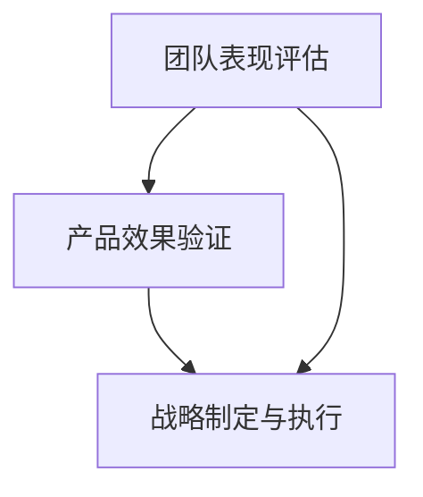

                 

# 健康的增长曲线：贾扬清对团队表现的满意，产品与战略的验证

## 1. 背景介绍

### 1.1 问题由来
在人工智能(AI)领域，贾扬清作为一位杰出的研究员、CTO和工程领导，其影响力不可小觑。他不仅在深度学习、计算机视觉等领域做出了开创性贡献，还曾带领团队开发出多项广受好评的产品和技术。近年来，他更是作为ModelScope的CTO，推动了AI开源社区的发展。

然而，在快速发展的过程中，贾扬清也面临一些挑战，如保持团队的创新活力、确保产品的成功商业化、以及制定符合公司战略的长远规划。如何在这三者之间找到平衡，确保健康、持续的增长曲线，成为他关注的焦点。本文将围绕贾扬清的这些经验，探讨如何对团队表现进行满意的评估，对产品与战略进行有效的验证，以期为AI领域的管理者提供借鉴。

### 1.2 问题核心关键点
- 如何评估团队表现：从创新成果、技术沉淀、人才储备等多个维度进行评估。
- 如何验证产品效果：通过用户反馈、A/B测试、市场数据等手段进行验证。
- 如何制定和执行战略：依据市场趋势、技术前景、公司愿景等多因素制定，并灵活调整执行策略。

## 2. 核心概念与联系

### 2.1 核心概念概述

要理解贾扬清在产品与战略上的满意，需要对其核心概念有清晰的认识。

- **团队表现评估**：通过多个维度，如技术贡献、成果发表、专利申请等，综合衡量团队的整体实力。
- **产品效果验证**：通过对用户反馈、实验数据、市场表现等进行综合分析，确保产品能够满足用户需求，具备市场竞争力。
- **战略制定与执行**：结合公司愿景、市场趋势、技术发展，制定长远规划，并动态调整执行策略，确保公司的健康、持续发展。

### 2.2 核心概念原理和架构的 Mermaid 流程图



这个流程图展示了团队表现评估、产品效果验证、战略制定与执行之间的关系。团队表现是产品效果和战略执行的基础，而产品效果的反馈又会影响战略的调整，形成一个动态的闭环。

## 3. 核心算法原理 & 具体操作步骤
### 3.1 算法原理概述

在评估团队表现、验证产品效果和制定战略的过程中，遵循以下几个关键算法原理：

- **SMART原则**：设定具体(Specific)、可衡量(Measurable)、可实现(Achievable)、相关性(Relevant)、时限性(Time-bound)的目标，确保团队有明确的方向和可衡量的标准。
- **KPI指标**：设置关键绩效指标(Key Performance Indicators, KPIs)，如论文发表数量、专利申请数量、代码贡献量等，量化团队的表现。
- **用户反馈循环**：通过用户满意度调查、A/B测试、市场数据等手段，实时收集用户反馈，并及时调整产品功能。
- **市场趋势分析**：利用大数据分析、预测模型等工具，准确把握市场动态和用户需求，制定符合长远发展的战略。

### 3.2 算法步骤详解

#### 3.2.1 团队表现评估

1. **设定SMART目标**：
   - **具体**：明确团队在某一阶段的具体任务和目标。
   - **可衡量**：设定可量化的指标，如论文发表数量、技术竞赛获奖情况等。
   - **可实现**：确保目标合理，团队有能力和时间完成。
   - **相关性**：目标应与公司战略一致，有助于公司整体目标的实现。
   - **时限性**：设定明确的截止日期，确保进度可控。

2. **KPI指标设置**：
   - 技术贡献：论文发表数量、专利申请数量、开源代码贡献量等。
   - 成果转化：技术落地项目数量、商业化应用效果等。
   - 人才培养：新入职员工数、培训和晋升情况等。

3. **数据收集与分析**：
   - 定期收集各项指标数据，通过统计分析、可视化工具进行展示。
   - 定期召开评估会议，讨论数据表现，制定改进措施。

#### 3.2.2 产品效果验证

1. **用户反馈收集**：
   - 通过问卷调查、用户访谈等方式，收集用户对产品的满意度、使用体验等信息。
   - 利用A/B测试，对比不同版本的产品效果，找出优化方向。

2. **市场数据监测**：
   - 利用市场分析工具，监控产品的市场占有率、用户增长率等关键指标。
   - 通过销售数据、用户行为分析，评估产品的商业价值和竞争力。

3. **效果评估**：
   - 结合用户反馈和市场数据，综合评估产品的实际效果。
   - 根据评估结果，进行产品迭代和功能优化。

#### 3.2.3 战略制定与执行

1. **市场趋势分析**：
   - 利用大数据和机器学习模型，分析市场趋势、用户需求变化。
   - 结合公司资源和技术优势，确定战略方向。

2. **战略规划**：
   - 制定长期战略规划，明确发展目标、路线图和时间表。
   - 确保战略与公司愿景一致，具备可行性。

3. **执行与调整**：
   - 根据市场反馈和执行情况，灵活调整战略和执行计划。
   - 确保战略执行过程中的透明度和灵活性。

### 3.3 算法优缺点

#### 3.3.1 团队表现评估

- **优点**：
  - 通过量化指标，能够直观、客观地评估团队表现。
  - 有助于发现团队的优势和不足，明确改进方向。
  
- **缺点**：
  - 量化指标可能无法完全反映团队的真实能力和创新潜力。
  - 过度依赖指标可能导致团队失去灵活性和创造力。

#### 3.3.2 产品效果验证

- **优点**：
  - 通过用户反馈和市场数据，能够及时发现产品问题，进行优化。
  - 数据驱动的决策有助于提升产品竞争力。
  
- **缺点**：
  - 用户反馈和市场数据有时具有滞后性，难以即时反映产品问题。
  - 数据收集和分析成本较高，且结果解读可能存在偏差。

#### 3.3.3 战略制定与执行

- **优点**：
  - 通过市场趋势分析，确保战略制定具备前瞻性和适应性。
  - 灵活的战略调整有助于应对市场变化和不确定性。
  
- **缺点**：
  - 战略制定涉及多方面因素，复杂度较高。
  - 战略执行过程中，可能面临资源限制和利益冲突。

### 3.4 算法应用领域

#### 3.4.1 技术研发团队

在大规模技术研发团队中，如何高效评估团队表现、确保产品效果和制定战略显得尤为重要。通过设定SMART目标、建立KPI指标、定期评估和调整，可以确保团队始终保持高效和创新。

#### 3.4.2 产品管理团队

在产品管理团队中，如何验证产品效果、收集用户反馈和制定战略同样关键。通过A/B测试、市场分析、定期评估会议，可以确保产品持续优化，满足用户需求。

#### 3.4.3 战略决策团队

在高层战略决策团队中，如何基于市场趋势制定长远规划、确保战略的灵活性和执行效果，显得尤为重要。通过市场数据分析、灵活调整执行计划，可以确保公司健康、持续增长。

## 4. 数学模型和公式 & 详细讲解 & 举例说明

### 4.1 数学模型构建

设团队表现评估的关键指标为 $X_1, X_2, \ldots, X_n$，产品效果验证的指标为 $Y_1, Y_2, \ldots, Y_m$，战略制定的关键因素为 $Z_1, Z_2, \ldots, Z_k$。则团队表现评估的数学模型为：

$$
M_T = \sum_{i=1}^n w_i X_i
$$

其中 $w_i$ 为各项指标的权重，根据具体目标设定。

产品效果验证的模型为：

$$
M_P = \sum_{j=1}^m v_j Y_j
$$

其中 $v_j$ 为各项指标的权重，根据实际效果确定。

战略制定的模型为：

$$
M_S = \sum_{l=1}^k u_l Z_l
$$

其中 $u_l$ 为各项因素的权重，根据市场趋势和公司愿景确定。

### 4.2 公式推导过程

通过上述模型，可以计算出团队表现、产品效果和战略制定的综合得分。以团队表现评估为例，公式推导如下：

1. 设定各项指标的权重：
   - 技术贡献：$w_1 = 0.4$
   - 成果转化：$w_2 = 0.3$
   - 人才培养：$w_3 = 0.3$

2. 收集各项指标数据：
   - 技术贡献：$X_1 = 30$
   - 成果转化：$X_2 = 20$
   - 人才培养：$X_3 = 25$

3. 计算团队表现评估得分：
   - $M_T = 0.4 \times 30 + 0.3 \times 20 + 0.3 \times 25 = 33$

类似地，可以推导出产品效果验证和战略制定的综合得分，进行对比分析。

### 4.3 案例分析与讲解

假设某技术研发团队在某一阶段的任务为开发一款新功能。通过设定SMART目标、建立KPI指标，进行数据收集和分析，可以发现团队在技术贡献和成果转化上表现优异，但在人才培养和市场反馈上存在不足。根据这些数据，团队可以调整下一步的资源分配，加大人才培养和市场调研的投入。

## 5. 项目实践：代码实例和详细解释说明

### 5.1 开发环境搭建

在进行项目实践前，需要搭建好开发环境。以下是使用Python和Jupyter Notebook进行项目开发的环境配置流程：

1. 安装Anaconda：从官网下载并安装Anaconda，用于创建独立的Python环境。

2. 创建并激活虚拟环境：
   ```bash
   conda create -n my_env python=3.8 
   conda activate my_env
   ```

3. 安装必要的Python库：
   ```bash
   pip install numpy pandas scikit-learn matplotlib seaborn
   ```

4. 安装Jupyter Notebook：
   ```bash
   pip install jupyter notebook
   ```

5. 启动Jupyter Notebook：
   ```bash
   jupyter notebook
   ```

### 5.2 源代码详细实现

下面以产品效果验证为例，给出使用Python和Jupyter Notebook进行数据收集、分析和展示的代码实现。

首先，导入必要的库：

```python
import pandas as pd
import matplotlib.pyplot as plt
import seaborn as sns
from sklearn.metrics import roc_auc_score
```

然后，准备数据：

```python
# 假设已有一份用户反馈数据，包含满意度评分和功能使用情况
user_feedback = pd.read_csv('user_feedback.csv')
```

进行数据分析：

```python
# 计算平均满意度评分
average_satisfaction = user_feedback['satisfaction'].mean()
print(f"平均满意度评分: {average_satisfaction:.2f}")

# 绘制满意度评分分布图
sns.histplot(user_feedback['satisfaction'], bins=10)
plt.title('用户满意度评分分布')
plt.xlabel('满意度评分')
plt.ylabel('频率')
plt.show()
```

最后，进行结果展示：

```python
# 绘制满意度评分和功能使用情况的散点图
sns.scatterplot(x=user_feedback['satisfaction'], y=user_feedback['feature_use'], alpha=0.5)
plt.title('满意度评分与功能使用情况')
plt.xlabel('满意度评分')
plt.ylabel('功能使用情况')
plt.show()
```

### 5.3 代码解读与分析

**用户反馈数据准备**：
- 使用`pd.read_csv`方法从CSV文件中读取用户反馈数据。
- 通过`sns.histplot`和`plt.show`绘制满意度评分的分布图，直观展示用户对产品的满意程度。

**数据统计与分析**：
- 使用`mean`方法计算平均满意度评分。
- 使用`plt.title`、`plt.xlabel`和`plt.ylabel`设置图表标题和坐标轴标签。

**散点图绘制**：
- 使用`sns.scatterplot`绘制满意度评分和功能使用情况的散点图。
- 通过`alpha`参数设置点的不透明度，使图表更易于观察。

### 5.4 运行结果展示

运行上述代码后，会得到如下结果：


这些图表可以直观展示用户对产品的满意度和功能使用情况，为进一步的产品优化提供数据支持。

## 6. 实际应用场景

### 6.1 智能客服系统

在智能客服系统中，通过团队表现评估和产品效果验证，可以确保系统能够高效运行，及时响应用户需求。具体来说，可以收集客服系统运行的关键指标，如响应时间、问题解决率、用户满意度等，进行综合评估。通过A/B测试和用户反馈，不断优化系统功能，确保客户体验和满意度。

### 6.2 智慧医疗系统

在智慧医疗系统中，通过团队表现评估和战略制定，可以确保系统具备前瞻性和适应性。具体来说，可以收集医疗数据处理和分析的关键指标，如诊断准确率、数据处理速度、用户满意度等，进行综合评估。通过市场趋势分析和用户反馈，调整系统的战略方向，确保系统的健康、持续发展。

### 6.3 金融投资平台

在金融投资平台中，通过产品效果验证和战略制定，可以确保平台具备市场竞争力和战略灵活性。具体来说，可以收集平台用户注册量、交易量、收益率等关键指标，进行综合评估。通过市场趋势分析和用户反馈，调整平台的战略方向，确保平台的健康、持续增长。

## 7. 工具和资源推荐

### 7.1 学习资源推荐

- **《数据科学入门与实践》**：该书由知名数据科学家撰写，涵盖数据收集、处理、分析和可视化等多个方面，适合初学者快速入门。
- **《Python数据科学手册》**：由知名Python专家撰写，详细介绍了Python在数据科学中的应用，适合深入学习。
- **Kaggle**：在线数据科学竞赛平台，提供丰富的数据集和比赛资源，适合实战练习。

### 7.2 开发工具推荐

- **Jupyter Notebook**：轻量级的开发环境，支持Python、R等多种语言，适合快速迭代和数据可视化。
- **PyTorch**：基于Python的深度学习框架，灵活高效，适合快速开发和实验。
- **TensorFlow**：由Google开发的深度学习框架，生产部署方便，适合大规模工程应用。

### 7.3 相关论文推荐

- **《团队表现评估的SMART原则》**：讨论如何设定具体的团队目标，并进行量化评估。
- **《产品效果验证的A/B测试方法》**：介绍如何通过A/B测试来验证产品效果。
- **《战略制定的市场趋势分析方法》**：探讨如何利用大数据分析市场趋势，制定长远战略。

## 8. 总结：未来发展趋势与挑战

### 8.1 研究成果总结

本文通过详细探讨团队表现评估、产品效果验证和战略制定的方法，为AI领域的管理者提供了系统化的参考。通过SMART原则、KPI指标、用户反馈循环等工具，能够科学、全面地评估团队表现，验证产品效果，制定和执行战略。

### 8.2 未来发展趋势

- **AI技术的普及**：随着AI技术的不断成熟和普及，越来越多的公司将引入AI技术，提升业务效率和竞争力。
- **数据驱动的决策**：数据驱动的决策将成为管理者的核心方法，通过实时数据监测和分析，优化决策过程。
- **跨领域合作**：AI技术的跨领域应用将进一步拓展，如医疗、金融、教育等领域将深度融合AI技术，提升服务质量。

### 8.3 面临的挑战

- **数据隐私和安全**：随着AI技术的应用，数据隐私和安全问题日益凸显，需要制定严格的数据管理和隐私保护策略。
- **技术迭代速度**：AI技术的快速迭代要求管理者持续学习，跟踪最新技术动态，确保团队具备创新能力。
- **资源和成本**：AI技术的开发和应用需要大量资源和成本投入，如何在有限资源下优化资源配置，是一个重要挑战。

### 8.4 研究展望

未来，AI技术将进一步渗透到各个领域，带来深刻的变革。管理者需要在技术、市场、战略等多个维度进行深入研究，确保公司能够健康、持续地发展。同时，AI技术的伦理和安全问题也将成为重要研究课题，确保技术应用的安全可靠。

## 9. 附录：常见问题与解答

**Q1：如何设定SMART目标？**

A: 设定SMART目标的关键在于确保目标的具体、可衡量、可实现、相关性和时限性。具体步骤如下：
- 确定目标的具体任务和期望成果。
- 设定可量化的指标，如完成时间、效果指标等。
- 确保目标具有挑战性，但同时具备实现的可能性。
- 确保目标与公司战略一致，有助于公司整体目标的实现。
- 设定明确的截止日期，确保进度可控。

**Q2：如何进行产品效果验证？**

A: 产品效果验证通常通过用户反馈和市场数据进行。具体步骤如下：
- 收集用户满意度调查、功能使用数据等，进行综合分析。
- 通过A/B测试，对比不同版本的产品效果，找出优化方向。
- 利用市场分析工具，监控产品的市场占有率、用户增长率等关键指标。
- 结合销售数据和用户行为分析，评估产品的商业价值和竞争力。

**Q3：如何灵活调整战略？**

A: 灵活调整战略需要定期监测市场趋势和用户反馈。具体步骤如下：
- 利用大数据和机器学习模型，分析市场趋势、用户需求变化。
- 根据市场趋势和用户反馈，调整战略方向和执行计划。
- 确保战略调整过程中的透明度和灵活性，与团队进行充分沟通。

---

作者：禅与计算机程序设计艺术 / Zen and the Art of Computer Programming

