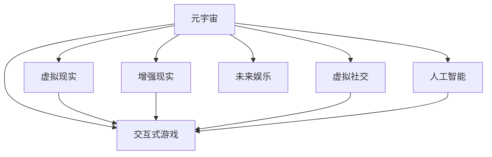

                 

# 元宇宙娱乐：沉浸式体验的极致追求

> 关键词：元宇宙,沉浸式体验,虚拟现实(VR),增强现实(AR),交互式游戏,虚拟社交,未来娱乐,人工智能

## 1. 背景介绍

### 1.1 问题由来
随着技术进步和消费需求的变化，数字娱乐行业正经历着一场深刻的变革。传统的视频游戏、电影和音乐等娱乐形式，逐渐被更加互动、沉浸、社交化的体验所取代。这一趋势与元宇宙（Metaverse）概念的兴起不谋而合，为新一代数字娱乐形式提供了新的发展方向。

元宇宙是一个共享的虚拟空间，用户可以通过虚拟现实（VR）、增强现实（AR）等技术，在其中自由探索、互动和创作。它不仅仅是一个虚拟空间，更是一个充满可能性的未来社交和娱乐平台。元宇宙娱乐的沉浸式体验，使得用户在虚拟世界中能够获得超越现实生活的全新体验，为数字娱乐行业带来了前所未有的机遇和挑战。

### 1.2 问题核心关键点
元宇宙娱乐的核心在于其沉浸式体验，这要求技术平台必须具备高度的真实感和交互性。同时，元宇宙的社交属性决定了其需要不断进化，以满足用户的社交需求，提供新的互动方式和内容。

- **技术挑战**：如何构建高互动性的虚拟环境，为用户提供真实感和沉浸感？
- **内容挑战**：如何在虚拟空间中不断创造高质量的娱乐内容，满足用户的多样化需求？
- **社交挑战**：如何构建高效的社交网络，促进用户间的互动和协作？

### 1.3 问题研究意义
研究元宇宙娱乐的沉浸式体验，对于推动数字娱乐行业的发展、激发技术创新、促进社会交流等方面具有重要意义：

1. **技术创新**：元宇宙娱乐的沉浸式体验需要跨学科的技术支持，包括VR/AR技术、人工智能、云计算、区块链等。研究这些技术的融合应用，将促进新一轮技术革新浪潮。
2. **用户体验提升**：元宇宙提供了一个全新的娱乐体验方式，通过高度互动和沉浸，提升用户满意度和粘性。
3. **社交互动增强**：元宇宙的社交属性，将为用户提供更多互动和协作的机会，构建更紧密的社会网络。
4. **产业升级**：元宇宙娱乐将催生新的商业模式和产业链，推动数字娱乐产业的全面升级。

## 2. 核心概念与联系

### 2.1 核心概念概述

为更好地理解元宇宙娱乐的核心原理和架构，本节将介绍几个关键概念及其相互关系：

- **元宇宙(Metaverse)**：一个由多个虚拟世界构成的共享空间，用户在其中可以自由交互和创造内容。
- **虚拟现实(Virtual Reality, VR)**：通过计算机模拟创建一个逼真的虚拟环境，使用户能够沉浸其中。
- **增强现实(Augmented Reality, AR)**：将虚拟信息叠加到现实环境中，增强用户的现实体验。
- **交互式游戏(Interactive Games)**：一种通过用户输入和环境反馈实现互动的游戏形式，通常结合VR/AR技术。
- **虚拟社交(Virtual Social)**：用户可以在虚拟世界中建立社交关系，进行沟通和协作。
- **未来娱乐(Future Entertainment)**：利用最新技术，提供超越传统娱乐形式的全新体验。
- **人工智能(Artificial Intelligence, AI)**：赋予虚拟世界以智能，实现更丰富的互动和创造。

这些核心概念之间的逻辑关系可以通过以下Mermaid流程图来展示：



这个流程图展示了一些核心概念及其之间的关系：

1. 元宇宙通过VR和AR技术，为用户提供沉浸式体验。
2. 交互式游戏是元宇宙的主要内容形式之一，能够实现高度互动。
3. 虚拟社交是元宇宙的社交属性，促进用户之间的交流。
4. 未来娱乐结合了最新技术，提供了超越传统娱乐形式的新体验。
5. 人工智能赋予虚拟世界以智能，增强了互动和创造性。

这些概念共同构成了元宇宙娱乐的核心框架，为用户提供了丰富多样的沉浸式体验。

## 3. 核心算法原理 & 具体操作步骤

### 3.1 算法原理概述

元宇宙娱乐的沉浸式体验，主要依赖于以下几个核心技术：

- **三维渲染**：通过图形渲染引擎，生成逼真的三维场景。
- **物理引擎**：模拟现实世界的物理属性，如重力、碰撞、光线等，增强虚拟环境的真实感。
- **自然语言处理(NLP)**：实现用户与虚拟环境之间的自然语言互动。
- **强化学习(Reinforcement Learning, RL)**：使虚拟角色具备智能行为，提升用户体验。
- **分布式系统**：实现多用户同时在线互动，保持系统的稳定性和扩展性。

元宇宙娱乐的沉浸式体验，通常包括以下几个关键步骤：

1. **内容创作**：用户在虚拟世界中进行内容创作，如构建场景、设计道具等。
2. **交互体验**：用户通过VR/AR设备，与虚拟世界进行互动，如移动、操作、沟通等。
3. **社交互动**：用户之间进行社交互动，如加入群组、创建活动、参与游戏等。
4. **技术支持**：通过三维渲染、物理引擎、自然语言处理等技术，实现高质量的沉浸式体验。

### 3.2 算法步骤详解

**Step 1: 内容创作**

元宇宙的内容创作主要通过两个阶段实现：

- **设计和构建**：用户通过虚拟编辑器，设计场景布局、角色造型、道具设置等。
- **合成和导出**：使用渲染引擎，将设计好的元素进行合成，并导出成可交互的虚拟场景。

**Step 2: 交互体验**

用户通过VR/AR设备，与虚拟世界进行互动。这一过程通常包括以下几个步骤：

1. **定位和移动**：用户可以通过VR头盔或手柄，在虚拟环境中进行自由移动和定位。
2. **操作和控制**：用户通过手柄、手势等控制方式，操作虚拟环境中的物体。
3. **视觉和听觉反馈**：通过高质量的渲染和音效，增强用户的沉浸感。

**Step 3: 社交互动**

元宇宙的社交互动主要通过以下几个途径实现：

1. **群组和社区**：用户可以加入不同的群组或社区，进行社交活动。
2. **活动和游戏**：用户可以参与各种虚拟活动和游戏，与其他用户互动。
3. **聊天和沟通**：通过虚拟聊天窗口或语音聊天，实现实时沟通。

**Step 4: 技术支持**

为了实现高质量的沉浸式体验，元宇宙需要以下几个技术支持：

1. **三维渲染引擎**：如Unity、Unreal Engine等，能够生成逼真的三维场景和效果。
2. **物理引擎**：如PhysX、Unity Physics等，能够模拟现实世界的物理属性。
3. **自然语言处理**：如GPT-3、BERT等，实现用户与虚拟环境之间的自然语言互动。
4. **分布式系统**：如AWS、Google Cloud等，实现多用户同时在线互动，保持系统的稳定性和扩展性。

### 3.3 算法优缺点

元宇宙娱乐的沉浸式体验具有以下优点：

1. **高度真实感**：通过VR/AR技术，实现高度逼真的虚拟环境，增强用户的沉浸感。
2. **高互动性**：用户能够与虚拟环境进行高度互动，实现丰富多样的体验。
3. **灵活性**：用户可以根据自己的需求，自由设计和创作内容，实现个性化体验。

同时，元宇宙娱乐也存在一些局限：

1. **设备依赖**：目前设备成本较高，普及率较低，限制了用户的体验。
2. **技术门槛**：内容创作和交互体验需要较高的技术门槛，用户学习成本较高。
3. **社交风险**：元宇宙中可能存在网络欺诈、虚拟暴力等问题，需要加强监管和防护。

### 3.4 算法应用领域

元宇宙娱乐已经在多个领域得到应用，涵盖了娱乐、教育、社交等多个方面：

- **娱乐领域**：虚拟现实游戏、虚拟演唱会、虚拟旅游等。
- **教育领域**：虚拟实验室、虚拟课堂、虚拟博物馆等。
- **社交领域**：虚拟社交平台、虚拟活动、虚拟商业展示等。
- **企业领域**：虚拟培训、虚拟会议、虚拟设计等。

随着技术的不断进步，元宇宙娱乐的应用领域将不断扩展，为用户提供更多沉浸式体验。

## 4. 数学模型和公式 & 详细讲解 & 举例说明

### 4.1 数学模型构建

元宇宙娱乐的沉浸式体验，可以通过数学模型进行量化分析。这里主要介绍几个常用的数学模型及其构建过程。

**三维渲染模型**：三维渲染过程通常涉及以下几个步骤：

1. **几何建模**：构建三维场景的几何模型，如几何体、网格等。
2. **材质渲染**：为场景添加材质和纹理，实现逼真的视觉效果。
3. **光照计算**：计算光源对场景的影响，实现逼真的光影效果。

三维渲染模型通常使用光线追踪算法进行渲染，其基本流程如下：

- **光线追踪**：从摄像机位置发出光线，依次穿过场景中的各个表面，计算每个表面的反射和折射。
- **逐像素计算**：对每个像素进行光线追踪，计算其反射和折射结果，并输出最终的颜色值。

**物理引擎模型**：物理引擎通过模拟现实世界的物理属性，增强虚拟环境的真实感。物理模拟通常涉及以下几个步骤：

1. **刚体物理**：模拟物体的刚体运动，如碰撞、旋转等。
2. **软体物理**：模拟物体的弹性、变形等。
3. **流体模拟**：模拟流体的流动和变形。

物理引擎通常使用粒子系统、刚体动力学等算法进行模拟，其基本流程如下：

- **粒子系统**：将物体划分为多个粒子，模拟物体的运动和变形。
- **刚体动力学**：通过牛顿力学方程，模拟物体的运动和受力。
- **流体模拟**：通过流体动力学方程，模拟流体的流动和变形。

**自然语言处理模型**：自然语言处理模型通过理解用户的自然语言输入，实现与虚拟环境之间的互动。常见模型包括：

1. **序列到序列模型**：如Seq2Seq模型，实现文本到文本的转换。
2. **注意力机制模型**：如Transformer模型，实现更高效的文本处理。
3. **情感分析模型**：如BERT模型，实现用户情感的自动识别。

### 4.2 公式推导过程

以下是几个常用模型的公式推导过程：

**三维渲染模型**：

- **光线追踪算法**：
$$
L_i = \sum_{j=1}^{N_j} f_j \cdot \mathrm{BRDF}_j \cdot L_j \cdot V_{ij} + \mathrm{Dirac}\delta(0) \cdot L_e
$$
其中，$L_i$为像素点的反射光强，$N_j$为场景中的光线数量，$f_j$为光线的衰减系数，$\mathrm{BRDF}_j$为BRDF函数，$L_j$为光线在场景中的传播光强，$V_{ij}$为像素点到光线的视角向量，$\mathrm{Dirac}\delta(0)$为光源的Dirac delta函数，$L_e$为光源的光强。

**物理引擎模型**：

- **刚体动力学方程**：
$$
m \cdot \frac{d^2\mathbf{r}}{dt^2} = \mathbf{F}
$$
其中，$m$为物体的质量，$\mathbf{r}$为物体的位向量，$d^2\mathbf{r}/dt^2$为物体的加速度向量，$\mathbf{F}$为物体所受的合力。

**自然语言处理模型**：

- **序列到序列模型**：
$$
y = f(x) = \prod_{i=1}^{T_y} \mathrm{softmax}(\mathbf{W}_y \cdot \mathrm{softmax}(\mathbf{W}_x \cdot x))
$$
其中，$y$为输出的序列，$T_y$为序列长度，$\mathbf{W}_x$和$\mathbf{W}_y$为转换矩阵，$x$为输入序列，$\mathrm{softmax}$为softmax函数。

### 4.3 案例分析与讲解

这里以虚拟现实游戏《Beat Saber》为例，进行详细的案例分析：

**三维渲染模型**：

- **几何建模**：游戏场景由多个几何体组成，如地面、墙面、道具等。
- **材质渲染**：场景中的道具和环境添加材质和纹理，实现逼真的视觉效果。
- **光照计算**：场景中的光源对周围物体产生光照效果，实现逼真的光影效果。

**物理引擎模型**：

- **刚体物理**：游戏角色和道具采用刚体物理模型，实现碰撞和旋转等效果。
- **软体物理**：场景中的布料和流体采用软体物理模型，实现变形和流动效果。

**自然语言处理模型**：

- **序列到序列模型**：游戏内聊天界面通过序列到序列模型，实现文本输入和输出的转换。
- **注意力机制模型**：游戏内的智能敌人通过Transformer模型，实现对玩家动作的识别和响应。
- **情感分析模型**：通过BERT模型，自动识别玩家的情感状态，调整游戏难度和内容。

## 5. 项目实践：代码实例和详细解释说明

### 5.1 开发环境搭建

在进行元宇宙娱乐的沉浸式体验开发前，我们需要准备好开发环境。以下是使用Python进行Unity开发的配置流程：

1. 安装Unity Hub：从官网下载并安装Unity Hub，用于管理Unity项目。
2. 创建Unity项目：打开Unity Hub，创建新的Unity项目。
3. 配置开发环境：安装必要的插件和资源包，如VR SDK、物理引擎等。
4. 配置脚本环境：安装Visual Studio Code等IDE，配置Python环境，支持Unity中的Python脚本开发。

完成上述步骤后，即可在Unity环境中开始开发实践。

### 5.2 源代码详细实现

这里我们以虚拟现实游戏《Beat Saber》为例，给出使用Unity和Python进行开发的具体实现步骤。

**Unity工程设置**：

1. 导入VR SDK：在Unity项目中导入VR SDK，实现虚拟现实体验。
2. 导入物理引擎：导入Unity Physics等物理引擎，实现游戏物体的物理效果。
3. 导入Python脚本：通过Python插件，将Python脚本引入Unity项目，支持Python代码的开发和运行。

**Python脚本实现**：

1. 导入相关库：在Python脚本中导入Unity Python库，以及常用的Python库，如Numpy、Pandas等。
2. 定义游戏逻辑：通过Python脚本来定义游戏逻辑，包括游戏界面、角色控制、物理计算等。
3. 实现自然语言处理：使用Python的自然语言处理库，实现游戏中的聊天和情感分析功能。

以下是Python脚本的部分代码实现：

```python
import unity
import numpy as np

# 定义游戏逻辑函数
def game_logic():
    # 处理用户输入
    user_input = unity.input.get_user_input()
    # 处理用户聊天消息
    chat_message = handle_chat_message(user_input)
    # 处理用户情感状态
    emotion_state = detect_emotion_state(user_input)
    # 更新游戏状态
    update_game_state(chat_message, emotion_state)

# 处理用户聊天消息
def handle_chat_message(user_input):
    # 使用序列到序列模型
    sequence_to_sequence(user_input)
    return chat_message

# 处理用户情感状态
def detect_emotion_state(user_input):
    # 使用BERT模型
    sentiment_analysis(user_input)
    return emotion_state

# 更新游戏状态
def update_game_state(chat_message, emotion_state):
    # 根据聊天内容和情感状态，调整游戏难度和内容
    adjust_game_state(chat_message, emotion_state)
```

**Unity实现**：

1. 定义游戏界面：使用Unity的UI系统，定义游戏界面，包括主界面、聊天界面等。
2. 实现用户控制：通过Unity的VR SDK，实现用户在虚拟环境中的移动和操作。
3. 实现物理计算：使用Unity的物理引擎，实现场景中物体的物理效果，如碰撞、变形等。

以下是Unity工程的实现示例：

```csharp
using UnityEngine;
using UnityPython;

public class GameManager : MonoBehaviour
{
    // 定义游戏逻辑函数
    public void GameLogic()
    {
        // 处理用户输入
        string userInput = Input.GetText();
        // 处理用户聊天消息
        string chatMessage = HandleChatMessage(userInput);
        // 处理用户情感状态
        string emotionState = DetectEmotionState(userInput);
        // 更新游戏状态
        UpdateGameState(chatMessage, emotionState);
    }

    // 处理用户聊天消息
    public string HandleChatMessage(string userInput)
    {
        // 调用Python脚本
        UnityPython python = new UnityPython();
        string result = python.Execute("handle_chat_message('{}')".format(userInput));
        return result;
    }

    // 处理用户情感状态
    public string DetectEmotionState(string userInput)
    {
        // 调用Python脚本
        UnityPython python = new UnityPython();
        string result = python.Execute("detect_emotion_state('{}')".format(userInput));
        return result;
    }

    // 更新游戏状态
    public void UpdateGameState(string chatMessage, string emotionState)
    {
        // 根据聊天内容和情感状态，调整游戏难度和内容
        AdjustGameState(chatMessage, emotionState);
    }

    // 调整游戏难度和内容
    public void AdjustGameState(string chatMessage, string emotionState)
    {
        // 实现逻辑
    }
}
```

### 5.3 代码解读与分析

让我们再详细解读一下关键代码的实现细节：

**Unity工程设置**：
- 导入VR SDK：通过Unity Hub导入VR SDK，实现虚拟现实体验。
- 导入物理引擎：导入Unity Physics等物理引擎，实现游戏物体的物理效果。
- 导入Python脚本：通过Python插件，将Python脚本引入Unity项目，支持Python代码的开发和运行。

**Python脚本实现**：
- 导入相关库：使用Python的Numpy库和Unity Python库，支持Python脚本的开发。
- 定义游戏逻辑函数：使用Python脚本来定义游戏逻辑，包括游戏界面、角色控制、物理计算等。
- 实现自然语言处理：使用Python的自然语言处理库，实现游戏中的聊天和情感分析功能。

**Unity实现**：
- 定义游戏界面：使用Unity的UI系统，定义游戏界面，包括主界面、聊天界面等。
- 实现用户控制：通过Unity的VR SDK，实现用户在虚拟环境中的移动和操作。
- 实现物理计算：使用Unity的物理引擎，实现场景中物体的物理效果，如碰撞、变形等。

可以看到，通过Unity和Python的结合，我们能够快速实现元宇宙娱乐的沉浸式体验开发。Python脚本的灵活性使得游戏逻辑的实现更加便捷，而Unity的强大功能则提供了丰富的开发工具和资源。

## 6. 实际应用场景

### 6.1 虚拟现实游戏

虚拟现实游戏是元宇宙娱乐的主要应用场景之一。通过VR设备，用户可以进入逼真的虚拟世界，进行互动和体验。虚拟现实游戏具有高度的真实感和沉浸感，能够提供独特的娱乐体验。

**应用场景**：
- **体验式游戏**：如《Beat Saber》、《The Elder Scrolls V: Skyrim VR》等，用户可以在虚拟世界中自由探索和体验。
- **动作冒险游戏**：如《Half-Life: Alyx》、《The Witness VR》等，用户可以通过VR设备进行动作冒险。
- **生存类游戏**：如《Doom VR》、《Resident Evil VR》等，用户可以在虚拟环境中进行生存挑战。

**未来展望**：
- **社交互动**：虚拟现实游戏将支持更多的社交互动功能，如多人游戏、虚拟聚会等，增强用户的沉浸感。
- **实时反馈**：通过增强现实技术，实现游戏内元素的实时反馈，提升用户体验。
- **个性化体验**：通过用户行为数据，实现游戏内容的个性化推荐和适配，提升用户粘性。

### 6.2 虚拟社交平台

虚拟社交平台是元宇宙娱乐的另一个重要应用场景。通过虚拟社交平台，用户可以在虚拟世界中自由交流和互动，构建新的社交网络。

**应用场景**：
- **虚拟社区**：如《Roblox》、《Second Life》等，用户可以在虚拟社区中自由交流和互动。
- **虚拟游戏**：如《Among Us VR》、《Halo Infinite VR》等，用户可以在虚拟游戏中进行互动和合作。
- **虚拟会议**：如《MeetMe VR》、《VRChat》等，用户可以在虚拟会议中进行远程沟通和协作。

**未来展望**：
- **虚拟商品**：虚拟社交平台将支持虚拟商品的交易和交换，丰富用户的互动方式。
- **虚拟现实体验**：虚拟社交平台将支持更多的虚拟现实体验，如虚拟旅游、虚拟音乐会等。
- **用户定制**：通过个性化设置，用户可以自由定制自己的虚拟形象和环境，提升用户体验。

### 6.3 虚拟教育和培训

虚拟教育和培训是元宇宙娱乐的重要应用方向之一。通过虚拟教育平台，用户可以在虚拟环境中进行学习和培训，实现更加丰富和灵活的教育方式。

**应用场景**：
- **虚拟课堂**：如《Google Expeditions VR》、《Google Arts & Culture VR》等，用户可以在虚拟课堂中进行学习。
- **虚拟实验室**：如《Unity VR Lab》、《VR Chemistry Lab》等，用户可以在虚拟实验室中进行实验和研究。
- **虚拟模拟**：如《The Sims VR》、《Skyscrapers VR》等，用户可以在虚拟模拟中进行技能训练。

**未来展望**：
- **虚拟导师**：虚拟教育平台将支持虚拟导师的引导，提升用户的学习效果。
- **虚拟协作**：虚拟教育平台将支持用户之间的虚拟协作，实现更加灵活的学习方式。
- **个性化学习**：通过用户行为数据，实现个性化学习内容的推荐和适配，提升学习效果。

## 7. 工具和资源推荐

### 7.1 学习资源推荐

为了帮助开发者系统掌握元宇宙娱乐的开发技术，这里推荐一些优质的学习资源：

1. **《Unity VR开发指南》**：官方文档，详细介绍了Unity在VR开发中的应用，包括VR SDK、物理引擎、自然语言处理等。
2. **《Unity Python脚本开发》**：官方教程，介绍了如何使用Python在Unity中进行脚本开发。
3. **《Unity AR开发手册》**：官方文档，详细介绍了Unity在AR开发中的应用，包括AR SDK、物理引擎、自然语言处理等。
4. **《Unity游戏编程》**：经典书籍，全面介绍了Unity在游戏开发中的应用，包括游戏逻辑、物理计算、用户输入等。
5. **《虚拟现实游戏开发》**：经典书籍，详细介绍了虚拟现实游戏的开发流程，包括VR SDK、物理引擎、自然语言处理等。

通过对这些资源的学习实践，相信你一定能够快速掌握元宇宙娱乐的开发技术，并用于解决实际的娱乐问题。

### 7.2 开发工具推荐

高效的开发离不开优秀的工具支持。以下是几款用于元宇宙娱乐开发常用的工具：

1. **Unity**：全球领先的3D游戏引擎，支持VR/AR开发，具有强大的3D渲染和物理引擎。
2. **Unreal Engine**：另一款流行的3D游戏引擎，支持VR/AR开发，具有高度逼真的渲染效果。
3. **Python**：通用的编程语言，具有强大的自然语言处理能力，适用于元宇宙娱乐开发。
4. **Unity Python插件**：支持Python在Unity中的脚本开发，方便开发者进行逻辑实现。
5. **Google Colab**：谷歌提供的在线Jupyter Notebook环境，免费提供GPU/TPU算力，方便开发者快速实验最新技术。

合理利用这些工具，可以显著提升元宇宙娱乐的开发效率，加快创新迭代的步伐。

### 7.3 相关论文推荐

元宇宙娱乐的沉浸式体验研究涉及多学科的交叉应用，以下是几篇奠基性的相关论文，推荐阅读：

1. **《Virtual Reality: A Survey》**：综述了虚拟现实技术的最新进展，涵盖VR/AR技术、物理引擎、自然语言处理等。
2. **《Virtual Reality in Education: A Review of the Research》**：综述了虚拟现实在教育领域的应用，涵盖了虚拟课堂、虚拟实验室、虚拟模拟等。
3. **《Social Interactions in Virtual Environments》**：综述了虚拟社交平台的研究进展，涵盖了虚拟社区、虚拟游戏、虚拟会议等。
4. **《Real-Time 3D Rendering with Real-Time Path Tracing》**：介绍了实时3D渲染技术，涵盖几何建模、材质渲染、光照计算等。
5. **《Interactive Characters in Virtual Environments》**：介绍了虚拟角色和物理引擎的研究进展，涵盖刚体物理、软体物理、流体模拟等。

这些论文代表了大元宇宙娱乐沉浸式体验的研究方向，通过学习这些前沿成果，可以帮助研究者把握学科前进方向，激发更多的创新灵感。

## 8. 总结：未来发展趋势与挑战

### 8.1 总结

本文对元宇宙娱乐的沉浸式体验进行了全面系统的介绍。首先阐述了元宇宙娱乐的研究背景和意义，明确了沉浸式体验在数字娱乐行业的发展潜力。其次，从原理到实践，详细讲解了沉浸式体验的数学模型和关键步骤，给出了元宇宙娱乐的开发实践代码实例。同时，本文还广泛探讨了沉浸式体验在虚拟现实游戏、虚拟社交平台、虚拟教育等各个领域的应用前景，展示了沉浸式体验的巨大潜力。此外，本文精选了元宇宙娱乐的相关学习资源，力求为读者提供全方位的技术指引。

通过本文的系统梳理，可以看到，元宇宙娱乐的沉浸式体验为数字娱乐行业带来了新的发展机遇，正逐步成为未来娱乐的重要方向。基于VR/AR技术的高质量渲染和物理模拟，通过自然语言处理和人工智能技术的融合应用，实现了用户与虚拟世界的深度互动和沉浸体验。

### 8.2 未来发展趋势

展望未来，元宇宙娱乐的沉浸式体验将呈现以下几个发展趋势：

1. **技术进步**：随着VR/AR设备性能的提升和3D渲染技术的进步，沉浸式体验将更加逼真和流畅。
2. **内容创新**：元宇宙将支持更加丰富和多样化的内容形式，如虚拟音乐会、虚拟现实剧场等。
3. **社交深化**：元宇宙的社交属性将进一步深化，用户可以在虚拟世界中建立更加紧密的社交网络。
4. **跨领域应用**：元宇宙将拓展到更多领域，如医疗、教育、设计等，提供全新的应用场景。
5. **数据驱动**：元宇宙将借助大数据和人工智能技术，实现更加个性化和智能化的体验。

以上趋势凸显了元宇宙娱乐的广泛应用前景，未来元宇宙将成为数字娱乐行业的重要组成部分，为用户带来全新的沉浸式体验。

### 8.3 面临的挑战

尽管元宇宙娱乐的沉浸式体验发展前景广阔，但在实现过程中，仍面临诸多挑战：

1. **技术瓶颈**：当前设备性能和渲染技术仍存在限制，难以实现完美的沉浸式体验。
2. **内容供给**：高质量的内容创作需要大量时间和资源，难以满足市场需求。
3. **用户教育**：用户对元宇宙的接受度较低，需要进一步教育和推广。
4. **社交风险**：虚拟社交平台可能存在网络欺诈、虚拟暴力等问题，需要加强监管和防护。
5. **成本问题**：当前设备成本较高，普及率较低，限制了用户的使用。

### 8.4 研究展望

面对元宇宙娱乐的沉浸式体验所面临的挑战，未来的研究需要在以下几个方面寻求新的突破：

1. **技术突破**：提升设备性能和渲染技术，实现更加逼真和流畅的沉浸式体验。
2. **内容创新**：开发更多的高质量内容和互动形式，满足用户多样化需求。
3. **用户教育**：通过教育和推广，提升用户对元宇宙的接受度和使用率。
4. **安全防护**：加强虚拟社交平台的安全防护，防止网络欺诈和虚拟暴力。
5. **经济激励**：开发经济激励机制，促进用户创作和互动，提升内容供给。

这些研究方向的探索，必将引领元宇宙娱乐的沉浸式体验迈向更高的台阶，为数字娱乐行业带来更广阔的发展空间。

## 9. 附录：常见问题与解答

**Q1：元宇宙娱乐与传统虚拟现实游戏有何区别？**

A: 元宇宙娱乐与传统虚拟现实游戏在沉浸式体验上有显著区别：

- **社交属性**：元宇宙娱乐强调社交互动和社区构建，而传统虚拟现实游戏更注重单人或合作的游戏体验。
- **开放性**：元宇宙娱乐更开放，用户可以自由创作和探索，而传统虚拟现实游戏通常具有固定剧情和目标。
- **虚拟内容**：元宇宙娱乐强调虚拟内容的丰富性和多样性，而传统虚拟现实游戏通常依赖固定的3D建模。

**Q2：如何构建高质量的虚拟世界？**

A: 构建高质量的虚拟世界需要以下步骤：

- **详细规划**：在构建虚拟世界之前，需要进行详细规划，确定场景布局、角色造型、道具设置等。
- **三维建模**：使用专业的3D建模软件，构建逼真的三维场景和模型。
- **材质渲染**：为场景中的物体添加材质和纹理，实现逼真的视觉效果。
- **物理引擎**：使用专业的物理引擎，模拟物体的碰撞、变形、流体等效果。
- **光照计算**：使用光线追踪等技术，实现逼真的光影效果。

**Q3：元宇宙娱乐在虚拟社交平台中的应用前景如何？**

A: 元宇宙娱乐在虚拟社交平台中的应用前景广阔：

- **虚拟社区**：用户可以在虚拟社区中自由交流和互动，构建新的社交网络。
- **虚拟游戏**：用户可以在虚拟游戏中进行互动和合作，提升社交体验。
- **虚拟会议**：用户可以在虚拟会议中进行远程沟通和协作，增强社交互动。

**Q4：如何提高用户对元宇宙娱乐的接受度？**

A: 提高用户对元宇宙娱乐的接受度需要以下几个步骤：

- **教育和推广**：通过教育和推广，让用户了解元宇宙的基本概念和应用场景。
- **用户定制**：通过个性化设置，提升用户的沉浸感和互动体验。
- **经济激励**：开发经济激励机制，促进用户创作和互动，提升内容供给。

**Q5：如何保证元宇宙娱乐的安全性？**

A: 保证元宇宙娱乐的安全性需要以下几个措施：

- **技术防护**：加强虚拟社交平台的安全防护，防止网络欺诈和虚拟暴力。
- **内容监管**：通过内容监管机制，过滤和惩罚有害内容。
- **用户教育**：加强用户教育，提升用户的安全意识和防范能力。

通过这些措施，可以有效保障元宇宙娱乐的安全性和用户体验，确保技术应用的可持续发展。

