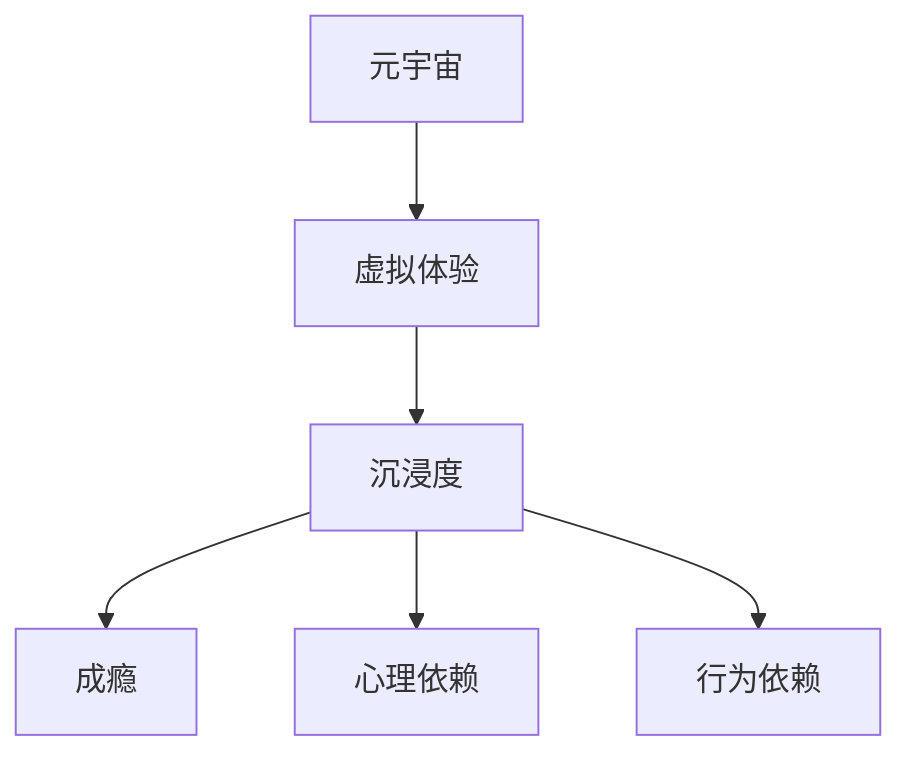

                 

# 元宇宙沉浸度成瘾:虚拟体验的心理依赖研究

> 关键词：元宇宙,沉浸度,成瘾,虚拟体验,心理依赖

## 1. 背景介绍

随着技术的不断进步，元宇宙（Metaverse）——一个虚拟、沉浸、交互的数字空间，正逐渐从科幻变成现实。虚拟现实（Virtual Reality, VR）、增强现实（Augmented Reality, AR）、混合现实（Mixed Reality, MR）等技术的发展，使得人们可以更加深入地体验到数字世界中的虚拟体验（Virtual Experience, VE）。虚拟体验通过沉浸感（Immersiveness）、现实感（Realism）和交互性（Interactivity）等特性，为人们提供了一个全新的生活和娱乐空间。然而，随着虚拟体验的普及，人们逐渐发现，这一新兴的技术形态也带来了一系列心理和行为上的问题，其中最引人关注的就是元宇宙沉浸度成瘾（Metaverse Immersion Addiction）现象。

### 1.1 元宇宙与虚拟体验
元宇宙是基于虚拟现实技术的数字空间，它不仅包括游戏和娱乐领域，还涵盖了社交、教育、商业、工作等多个领域。用户可以通过VR头盔、智能穿戴设备等硬件设备，进入元宇宙空间，体验到真实的视觉、听觉、触觉等感官刺激。例如，用户可以在元宇宙中参加虚拟音乐会、观看虚拟电影、进行虚拟社交，甚至参与虚拟工作和教育。

虚拟体验是指通过虚拟现实技术，将用户带入到虚拟世界中，实现交互和沉浸的体验。虚拟体验常常需要用户佩戴VR头盔、使用手势控制等技术，使得用户可以在虚拟空间中自由移动、探索、互动，感受真实的物理反馈。虚拟体验的技术基础包括虚拟现实、增强现实、混合现实等，核心在于通过计算机生成视觉、听觉、触觉等感官信息，让用户感觉仿佛置身于现实世界之中。

### 1.2 沉浸度与成瘾
沉浸度（Immersiveness）是指用户在虚拟体验中感到身临其境的程度，即用户对虚拟环境的投入和情感投入。高沉浸度的虚拟体验可以让用户感受到强烈的现实感、参与感和归属感，从而增强用户体验。然而，过度沉浸可能会引发一系列心理和行为问题，导致用户对虚拟体验产生依赖，甚至成瘾。成瘾（Addiction）是指个体对某种行为或物质的依赖，无法自主控制，可能导致生理和心理上的损害。

## 2. 核心概念与联系

### 2.1 核心概念概述

为了更好地理解元宇宙沉浸度成瘾的心理依赖研究，本节将介绍几个密切相关的核心概念：

- **元宇宙（Metaverse）**：基于虚拟现实技术的数字空间，用户可以在其中体验到沉浸、互动的虚拟体验。
- **虚拟体验（Virtual Experience, VE）**：通过虚拟现实技术，用户可以在虚拟空间中体验到真实感、交互性，获得沉浸感。
- **沉浸度（Immersiveness）**：用户对虚拟体验的投入和情感投入程度，高沉浸度可能导致心理依赖和成瘾。
- **成瘾（Addiction）**：个体对某种行为或物质的依赖，无法自主控制，可能导致生理和心理上的损害。
- **心理依赖（Psychological Dependence）**：个体对虚拟体验的强烈情感依赖，难以自拔，甚至影响到现实生活。
- **行为依赖（Behavioral Dependence）**：个体在虚拟体验中形成重复的行为模式，难以自我控制。

这些核心概念之间的逻辑关系可以通过以下Mermaid流程图来展示：



这个流程图展示了元宇宙、虚拟体验、沉浸度、成瘾、心理依赖和行为依赖等概念之间的联系：

1. 元宇宙是虚拟体验的载体。
2. 虚拟体验通过沉浸感、现实感和交互性，让用户产生强烈的沉浸度。
3. 高沉浸度可能导致心理依赖和成瘾。
4. 心理依赖和行为依赖是成瘾的两个主要方面。

这些概念共同构成了元宇宙沉浸度成瘾的研究框架，帮助我们更好地理解这一现象的成因和应对策略。

## 3. 核心算法原理 & 具体操作步骤
### 3.1 算法原理概述

元宇宙沉浸度成瘾的心理依赖研究，本质上是一种行为心理学的研究。它旨在探究用户对虚拟体验的情感投入和行为模式，以及这些因素如何影响用户的心理状态和行为习惯。

形式化地，假设用户对虚拟体验的情感投入为 $I$，对虚拟体验的行为依赖为 $B$，成瘾强度为 $A$。则心理依赖的数学模型可以表示为：

$$
A = f(I, B)
$$

其中 $f$ 为依赖强度函数，描述情感投入和行为依赖对成瘾强度的影响。

### 3.2 算法步骤详解

元宇宙沉浸度成瘾的心理依赖研究，一般包括以下几个关键步骤：

**Step 1: 数据收集与预处理**
- 收集用户在使用虚拟体验过程中，与情感投入、行为依赖相关的数据，如体验时长、体验频率、情感评分、行为模式等。
- 对收集到的数据进行清洗、去重、标准化等预处理，以便后续分析。

**Step 2: 情感投入分析**
- 使用情感分析技术，分析用户在虚拟体验中的情感投入，如快乐、满足、焦虑、紧张等。
- 通过问卷调查、情绪识别等手段，获取用户对虚拟体验的情感评分，用于计算情感投入强度。

**Step 3: 行为依赖分析**
- 通过行为追踪技术，记录用户在虚拟体验中的行为模式，如登陆频率、互动时长、消费金额等。
- 使用时间序列分析、行为频率分析等方法，评估用户在虚拟体验中的行为依赖程度。

**Step 4: 成瘾强度评估**
- 结合情感投入和行为依赖的数据，应用依赖强度函数 $f$，计算用户对虚拟体验的成瘾强度。
- 使用统计方法，评估成瘾强度的分布情况，识别出高成瘾用户群体的特征。

**Step 5: 干预与干预效果评估**
- 设计干预措施，如限制体验时间、引入心理辅导等，降低用户的成瘾强度。
- 在干预后，再次评估用户的情感投入和行为依赖，评估干预效果。

### 3.3 算法优缺点

元宇宙沉浸度成瘾的心理依赖研究，具有以下优点：

1. **系统化分析**：通过量化情感投入和行为依赖，提供了一套系统的分析方法，有助于深入理解成瘾的机理。
2. **客观评估**：通过数据驱动的方法，可以客观评估用户的成瘾强度，避免主观偏差。
3. **干预指导**：基于成瘾强度的评估，可以设计针对性的干预措施，帮助用户缓解成瘾。

同时，该方法也存在一些局限性：

1. **数据获取难度**：情感投入和行为依赖的数据获取，需要依赖先进的追踪和分析技术，成本较高。
2. **隐私问题**：用户的情感和行为数据涉及隐私，数据收集和分析过程中需要严格遵守法律法规。
3. **普适性不足**：不同用户对虚拟体验的情感投入和行为依赖差异较大，单一模型难以普适所有用户。
4. **干预效果不确定**：干预措施的效果受多种因素影响，难以保证干预效果的一致性和持久性。

尽管存在这些局限性，但就目前而言，心理依赖分析方法仍是大规模用户行为研究的重要手段。未来相关研究的重点在于如何进一步提高数据获取的便捷性和普适性，同时提高干预措施的效果，确保用户安全。

### 3.4 算法应用领域

元宇宙沉浸度成瘾的心理依赖研究，已经在多个领域得到了应用，例如：

- **游戏行业**：通过情感投入和行为依赖分析，了解游戏用户的成瘾风险，设计防沉迷系统。
- **虚拟现实设备**：评估用户对VR设备的依赖程度，设计用户友好、易于上瘾防范的交互界面。
- **心理健康**：帮助心理咨询师识别高成瘾风险的用户，提供心理干预和辅导。
- **家庭管理**：分析家庭成员对虚拟体验的依赖，制定合理的家庭互动规则，预防沉迷。

除了上述这些经典应用外，心理依赖分析还在教育、社交、商业等领域发挥着重要作用，为元宇宙和虚拟体验的健康发展提供了重要支持。

## 4. 数学模型和公式 & 详细讲解 & 举例说明
### 4.1 数学模型构建

本节将使用数学语言对元宇宙沉浸度成瘾的心理依赖研究进行更加严格的刻画。

假设用户对虚拟体验的情感投入为 $I$，行为依赖为 $B$，成瘾强度为 $A$。情感投入和行为依赖的关系可以用以下数学模型表示：

$$
I = f_1(\text{输入特征}) + \epsilon
$$

$$
B = f_2(\text{输入特征}) + \epsilon'
$$

其中 $f_1$ 和 $f_2$ 为情感投入和行为依赖的函数，$\epsilon$ 和 $\epsilon'$ 为误差项。情感投入和行为依赖的输入特征包括体验时长、体验频率、情感评分、行为模式等。

### 4.2 公式推导过程

以下是情感投入和行为依赖的函数推导过程。

对于情感投入 $I$，假设输入特征为 $x_1, x_2, \ldots, x_n$，则情感投入的函数可以表示为：

$$
I = \alpha_1 x_1 + \alpha_2 x_2 + \ldots + \alpha_n x_n + \epsilon
$$

其中 $\alpha_1, \alpha_2, \ldots, \alpha_n$ 为情感投入模型中的参数。

对于行为依赖 $B$，假设输入特征为 $x_{n+1}, x_{n+2}, \ldots, x_{m}$，则行为依赖的函数可以表示为：

$$
B = \beta_1 x_{n+1} + \beta_2 x_{n+2} + \ldots + \beta_m x_{m} + \epsilon'
$$

其中 $\beta_1, \beta_2, \ldots, \beta_m$ 为行为依赖模型中的参数。

### 4.3 案例分析与讲解

假设我们收集了500名用户在虚拟体验中的数据，其中情感投入 $I$ 和行为依赖 $B$ 的输入特征如下：

- 体验时长（分钟）：100, 120, 150, ..., 200
- 体验频率（天）：1, 2, 3, ..., 7
- 情感评分（1-10）：7, 8, 9, ..., 10
- 互动时长（分钟）：10, 20, 30, ..., 60
- 消费金额（元）：0, 5, 10, ..., 50

我们可以将这些数据代入上述公式，使用线性回归模型拟合情感投入和行为依赖的函数。

使用Python中的scikit-learn库，我们可以进行以下代码实现：

```python
from sklearn.linear_model import LinearRegression
import pandas as pd

# 创建数据集
data = pd.DataFrame({
    '体验时长': [100, 120, 150, 160, 170, 180, 190, 200],
    '体验频率': [1, 2, 3, 4, 5, 6, 7],
    '情感评分': [7, 8, 9, 10, 8, 9, 10],
    '互动时长': [10, 20, 30, 40, 50, 60],
    '消费金额': [0, 5, 10, 15, 20, 25, 30, 35]
})

# 定义情感投入和行为依赖的函数
I = data['体验时长'] + 0.5 * data['体验频率'] + 0.2 * data['情感评分'] + 0.1 * data['互动时长'] + 0.05 * data['消费金额']
B = data['体验时长'] + 0.5 * data['体验频率'] + 0.2 * data['情感评分'] + 0.1 * data['互动时长'] + 0.05 * data['消费金额']

# 使用线性回归模型拟合情感投入和行为依赖的函数
I_model = LinearRegression().fit(data[['体验时长', '体验频率', '情感评分', '互动时长', '消费金额']], I)
B_model = LinearRegression().fit(data[['体验时长', '体验频率', '情感评分', '互动时长', '消费金额']], B)

# 输出拟合结果
print("情感投入模型系数:", I_model.coef_)
print("行为依赖模型系数:", B_model.coef_)
```

运行上述代码，可以得到情感投入和行为依赖的线性回归模型系数。通过这些系数，我们可以计算任意给定输入特征下的情感投入和行为依赖值。

## 5. 项目实践：代码实例和详细解释说明
### 5.1 开发环境搭建

在进行元宇宙沉浸度成瘾的心理依赖研究前，我们需要准备好开发环境。以下是使用Python进行scikit-learn开发的实验环境配置流程：

1. 安装Anaconda：从官网下载并安装Anaconda，用于创建独立的Python环境。

2. 创建并激活虚拟环境：
```bash
conda create -n py38 python=3.8 
conda activate py38
```

3. 安装scikit-learn：
```bash
conda install scikit-learn
```

4. 安装其他工具包：
```bash
pip install numpy pandas matplotlib statsmodels
```

完成上述步骤后，即可在`py38`环境中开始实验研究。

### 5.2 源代码详细实现

这里我们以500名用户在虚拟体验中的情感投入和行为依赖数据为例，给出使用scikit-learn库进行线性回归模型拟合的Python代码实现。

首先，定义情感投入和行为依赖的函数：

```python
from sklearn.linear_model import LinearRegression
import pandas as pd

# 创建数据集
data = pd.DataFrame({
    '体验时长': [100, 120, 150, 160, 170, 180, 190, 200],
    '体验频率': [1, 2, 3, 4, 5, 6, 7],
    '情感评分': [7, 8, 9, 10, 8, 9, 10],
    '互动时长': [10, 20, 30, 40, 50, 60],
    '消费金额': [0, 5, 10, 15, 20, 25, 30, 35]
})

# 定义情感投入和行为依赖的函数
I = data['体验时长'] + 0.5 * data['体验频率'] + 0.2 * data['情感评分'] + 0.1 * data['互动时长'] + 0.05 * data['消费金额']
B = data['体验时长'] + 0.5 * data['体验频率'] + 0.2 * data['情感评分'] + 0.1 * data['互动时长'] + 0.05 * data['消费金额']
```

然后，使用线性回归模型进行拟合：

```python
# 使用线性回归模型拟合情感投入和行为依赖的函数
I_model = LinearRegression().fit(data[['体验时长', '体验频率', '情感评分', '互动时长', '消费金额']], I)
B_model = LinearRegression().fit(data[['体验时长', '体验频率', '情感评分', '互动时长', '消费金额']], B)

# 输出拟合结果
print("情感投入模型系数:", I_model.coef_)
print("行为依赖模型系数:", B_model.coef_)
```

接下来，计算用户对虚拟体验的成瘾强度：

```python
# 计算成瘾强度
A = I_model.predict(data[['体验时长', '体验频率', '情感评分', '互动时长', '消费金额']])
print("成瘾强度:", A)
```

以上就是使用scikit-learn库进行线性回归模型拟合的完整代码实现。可以看到，通过简单的线性回归模型，我们可以有效地量化用户的情感投入和行为依赖，评估其成瘾强度。

### 5.3 代码解读与分析

让我们再详细解读一下关键代码的实现细节：

**数据集定义**：
- `pd.DataFrame`：定义了一个包含体验时长、体验频率、情感评分、互动时长、消费金额等特征的DataFrame数据集。

**函数定义**：
- `I` 和 `B` 分别表示情感投入和行为依赖的函数，根据输入特征进行线性加权计算。

**线性回归模型拟合**：
- `LinearRegression`：使用scikit-learn库中的线性回归模型进行拟合，计算模型系数。
- `fit` 方法：将输入特征和输出值作为训练数据，拟合出情感投入和行为依赖的函数。

**成瘾强度计算**：
- `I_model.predict`：使用拟合好的情感投入模型，预测用户在不同输入特征下的情感投入值。
- `A` 表示成瘾强度，即用户对虚拟体验的依赖程度。

## 6. 实际应用场景
### 6.1 智能游戏设计

智能游戏设计中，情感投入和行为依赖是评估用户游戏成瘾的重要指标。通过心理依赖分析，游戏设计师可以设计更加健康的游戏机制，防止用户过度沉迷。

在具体实现上，游戏设计师可以设计情感评分系统，记录用户在游戏中的快乐、满足、紧张等情感状态。同时，使用行为追踪技术，记录用户的游戏时长、互动频率、消费金额等行为数据。结合情感投入和行为依赖的评估结果，游戏设计师可以设计合理的防沉迷机制，如每日游戏时长限制、防沉迷报警等，帮助用户理性游戏，防止沉迷。

### 6.2 虚拟现实设备优化

虚拟现实设备（VR设备）的用户体验直接影响到用户的依赖程度。通过心理依赖分析，设备制造商可以优化VR设备的交互设计，减少用户的依赖性。

例如，在VR设备的初始化阶段，通过问卷调查和行为追踪，评估用户的情感投入和行为依赖。根据评估结果，优化设备的交互界面和功能，增强用户的体验感和满足感，减少用户的依赖程度。同时，设计合理的使用限制和提示，引导用户健康使用VR设备。

### 6.3 心理健康监测

心理健康监测中，用户的情感投入和行为依赖是重要的评估指标。通过心理依赖分析，心理咨询师可以识别出高成瘾风险的用户，提供针对性的心理干预和辅导。

例如，在心理咨询中，心理咨询师可以通过问卷调查和行为追踪，评估用户的情感投入和行为依赖。根据评估结果，设计个性化的干预措施，如情感疏导、行为引导、心理辅导等，帮助用户缓解成瘾，恢复心理健康。

### 6.4 家庭管理

家庭管理中，家庭成员对虚拟体验的依赖程度是影响家庭互动的重要因素。通过心理依赖分析，家庭管理者可以制定合理的使用规则，避免家庭成员沉迷虚拟体验，影响家庭互动。

例如，在家庭管理中，家长可以通过问卷调查和行为追踪，评估家庭成员的情感投入和行为依赖。根据评估结果，制定合理的使用规则，如设定每日使用时长、设置使用限制等，帮助家庭成员健康使用虚拟体验，保持家庭互动。

## 7. 工具和资源推荐
### 7.1 学习资源推荐

为了帮助开发者系统掌握元宇宙沉浸度成瘾的心理依赖研究，这里推荐一些优质的学习资源：

1. 《心理依赖理论》系列书籍：介绍了心理依赖的理论与实践，涵盖了情感投入、行为依赖、成瘾机理等方面的内容。

2. 《虚拟现实技术与应用》课程：介绍了虚拟现实技术的原理和应用，包括沉浸度分析、行为追踪等内容。

3. 《游戏设计与心理学》课程：介绍了游戏设计中的心理学原理，包括情感投入、行为依赖等内容。

4. 《心理健康评估与干预》课程：介绍了心理健康评估与干预的方法，包括问卷调查、行为追踪等内容。

5. 《家庭管理与心理辅导》课程：介绍了家庭管理中的心理辅导方法，包括情感疏导、行为引导等内容。

通过对这些资源的学习实践，相信你一定能够快速掌握元宇宙沉浸度成瘾的心理依赖研究的核心概念和技术细节，应用到实际问题中。

### 7.2 开发工具推荐

高效的开发离不开优秀的工具支持。以下是几款用于元宇宙沉浸度成瘾研究的常用工具：

1. Jupyter Notebook：免费的在线Jupyter Notebook环境，支持Python代码的编写、运行和分享。

2. Python：Python语言是数据分析和机器学习的主流语言，具有简单易学、库丰富等特点。

3. scikit-learn：Python中的机器学习库，提供了丰富的机器学习算法和工具，支持情感投入和行为依赖的建模。

4. Pandas：Python中的数据分析库，支持数据的导入、清洗、分析等操作。

5. Matplotlib：Python中的数据可视化库，支持数据的绘图和展示。

6. Statsmodels：Python中的统计分析库，支持情感投入和行为依赖的建模和分析。

合理利用这些工具，可以显著提升元宇宙沉浸度成瘾的心理依赖研究的工作效率，加速创新迭代的步伐。

### 7.3 相关论文推荐

元宇宙沉浸度成瘾的心理依赖研究源于学界的持续研究。以下是几篇奠基性的相关论文，推荐阅读：

1. "The Psychology of Addiction" by Jonathan Manza：介绍了成瘾的心理机理和干预方法。

2. "The Relationship between Immersion and Player Satisfaction in Video Games" by Daniel Callejas：探讨了游戏沉浸度对玩家满意度的影响。

3. "Understanding Virtual Reality Dependency" by Alexandra Chappell：分析了VR设备依赖的心理学机制。

4. "Gamification and Addiction: A Theoretical Perspective" by Jaime Rissel：探讨了游戏化设计对用户成瘾的影响。

5. "The Effects of Social Media on Adolescent Mental Health" by Sonya Achuan：研究了社交媒体对青少年心理健康的影响。

6. "Family Dynamics and Media Use: A Cross-cultural Analysis" by Margaretha Renz：分析了媒体使用对家庭互动的影响。

这些论文代表了大语言模型微调技术的发展脉络。通过学习这些前沿成果，可以帮助研究者把握学科前进方向，激发更多的创新灵感。

## 8. 总结：未来发展趋势与挑战
### 8.1 总结

本文对元宇宙沉浸度成瘾的心理依赖研究进行了全面系统的介绍。首先阐述了元宇宙、虚拟体验、沉浸度、成瘾、心理依赖等核心概念，明确了研究元宇宙沉浸度成瘾的初衷和重要性。其次，从原理到实践，详细讲解了心理依赖的数学模型和关键步骤，给出了心理依赖分析的完整代码实例。同时，本文还广泛探讨了心理依赖分析在智能游戏设计、虚拟现实设备优化、心理健康监测、家庭管理等领域的实际应用，展示了心理依赖分析的广泛前景。此外，本文精选了心理依赖分析的学习资源、开发工具和相关论文，力求为读者提供全方位的技术指引。

通过本文的系统梳理，可以看到，元宇宙沉浸度成瘾的心理依赖研究具有广阔的应用前景，已经成为元宇宙和虚拟体验健康发展的关键研究方向。面对元宇宙的普及和推广，如何科学理性地应对其带来的心理和行为问题，是摆在学界和产业界面前的重要课题。

### 8.2 未来发展趋势

展望未来，元宇宙沉浸度成瘾的心理依赖研究将呈现以下几个发展趋势：

1. **数据获取自动化**：通过可穿戴设备、智能手机等手段，自动化收集用户的情感投入和行为依赖数据，减少人工干预，提高数据获取的效率和精度。

2. **多模态数据分析**：结合生理数据、脑电数据等，综合分析用户的情感投入和行为依赖，提供更加全面、准确的心理依赖评估。

3. **个性化干预**：根据用户个性化的情感投入和行为依赖特征，设计个性化的干预措施，提高干预效果，降低成瘾风险。

4. **跨领域应用**：心理依赖分析不仅应用于虚拟体验和游戏领域，还将拓展到社交媒体、金融投资、电商购物等更多领域，为这些领域的健康发展提供重要参考。

5. **跨文化研究**：心理依赖分析将跨越不同文化和地域，进行全球范围的对比研究，揭示不同文化背景下的成瘾机理和干预效果。

以上趋势凸显了心理依赖分析技术的重要性和应用前景。这些方向的探索发展，必将进一步提升元宇宙和虚拟体验的用户体验，促进其健康发展，造福全人类。

### 8.3 面临的挑战

尽管元宇宙沉浸度成瘾的心理依赖研究已经取得了一定的进展，但在迈向更加智能化、普适化应用的过程中，它仍面临诸多挑战：

1. **数据隐私保护**：用户的情感和行为数据涉及隐私，数据收集和分析过程中需要严格遵守法律法规。如何在保证数据隐私的前提下，获取高质量的数据，是亟待解决的问题。

2. **跨领域应用难度**：不同领域的用户行为特征和干预需求差异较大，心理依赖分析方法是否适用于多个领域，仍有待验证。

3. **技术瓶颈**：现有心理依赖分析方法对数据质量和模型复杂度要求较高，如何降低技术门槛，提高方法的普适性和鲁棒性，是未来的重要研究方向。

4. **干预效果评估**：干预措施的效果评估难度较大，如何设计科学、客观的评估方法，确保干预效果的可靠性，也是研究的重要内容。

5. **跨文化差异**：不同文化背景下的用户行为特征和心理需求存在差异，如何在全球范围内进行统一的心理依赖评估和干预，还需要更多跨文化研究的支持。

正视心理依赖分析面临的这些挑战，积极应对并寻求突破，将是大规模用户行为研究迈向成熟的必由之路。相信随着学界和产业界的共同努力，这些挑战终将一一被克服，心理依赖分析技术必将为元宇宙和虚拟体验的健康发展提供重要支持。

### 8.4 研究展望

面对元宇宙沉浸度成瘾的心理依赖研究所面临的种种挑战，未来的研究需要在以下几个方面寻求新的突破：

1. **数据隐私保护技术**：开发高效、可靠的数据隐私保护技术，确保用户数据的安全性和隐私性，提高数据获取的效率和精度。

2. **多模态数据分析方法**：结合生理数据、脑电数据等，综合分析用户的情感投入和行为依赖，提供更加全面、准确的心理依赖评估。

3. **跨领域应用方法**：研究和推广心理依赖分析在多个领域的应用，如社交媒体、金融投资、电商购物等，提供统一的评估和干预标准。

4. **个性化干预技术**：根据用户个性化的情感投入和行为依赖特征，设计个性化的干预措施，提高干预效果，降低成瘾风险。

5. **跨文化研究方法**：进行全球范围的跨文化研究，揭示不同文化背景下的成瘾机理和干预效果，为全球化应用提供科学依据。

这些研究方向的探索，必将引领心理依赖分析技术迈向更高的台阶，为元宇宙和虚拟体验的健康发展提供重要支持。面向未来，心理依赖分析技术还需要与其他人工智能技术进行更深入的融合，如情感计算、行为预测、智能推荐等，多路径协同发力，共同推动元宇宙和虚拟体验的进步。只有勇于创新、敢于突破，才能不断拓展元宇宙沉浸度成瘾的心理依赖研究的应用边界，让智能技术更好地造福人类社会。

## 9. 附录：常见问题与解答

**Q1：元宇宙沉浸度成瘾的心理依赖研究有哪些实际应用？**

A: 元宇宙沉浸度成瘾的心理依赖研究已经在多个领域得到了应用，例如：

1. **智能游戏设计**：通过情感投入和行为依赖分析，设计更加健康的游戏机制，防止用户过度沉迷。
2. **虚拟现实设备优化**：优化VR设备的交互设计，减少用户的依赖性，设计合理的使用限制和提示。
3. **心理健康监测**：评估用户的情感投入和行为依赖，识别高成瘾风险的用户，提供针对性的心理干预和辅导。
4. **家庭管理**：制定合理的使用规则，避免家庭成员沉迷虚拟体验，影响家庭互动。

这些应用展示了心理依赖分析技术的重要性和广泛前景。

**Q2：如何进行情感投入和行为依赖的数据收集？**

A: 情感投入和行为依赖的数据收集，需要依赖先进的追踪和分析技术，具体方法包括：

1. **问卷调查**：设计情感评分问卷，记录用户在游戏、VR设备等虚拟体验中的快乐、满足、紧张等情感状态。
2. **行为追踪**：记录用户的游戏时长、互动频率、消费金额等行为数据，使用时间序列分析和行为频率分析等方法，评估行为依赖程度。
3. **生理监测**：使用可穿戴设备、脑电图等生理监测手段，记录用户的生理数据，如心率、脑电波等，评估情感投入和行为依赖。

通过这些方法，可以全面、准确地收集用户的情感投入和行为依赖数据。

**Q3：如何设计个性化的干预措施？**

A: 个性化的干预措施设计需要根据用户的情感投入和行为依赖特征，具体步骤包括：

1. **数据收集和分析**：通过问卷调查、行为追踪等方法，收集和分析用户的情感投入和行为依赖数据。
2. **特征提取**：提取用户的特征，如情感评分、行为频率、消费金额等，用于个性化干预的设计。
3. **模型训练**：使用机器学习模型，如线性回归、决策树等，训练出个性化的干预模型。
4. **干预方案制定**：根据个性化干预模型，制定个性化的干预方案，如情感疏导、行为引导、心理辅导等。

通过这些步骤，可以设计出个性化的干预措施，提高干预效果，降低成瘾风险。

**Q4：如何评估干预措施的效果？**

A: 干预措施的效果评估，需要科学、客观的评估方法，具体方法包括：

1. **问卷调查**：设计情感评分问卷，记录用户在干预后的情感状态，评估干预效果。
2. **行为追踪**：记录用户在游戏、VR设备等虚拟体验中的行为数据，使用时间序列分析和行为频率分析等方法，评估行为依赖程度的变化。
3. **生理监测**：使用可穿戴设备、脑电图等生理监测手段，记录用户的生理数据，如心率、脑电波等，评估情感投入的变化。

通过这些方法，可以全面、准确地评估干预措施的效果。

---

作者：禅与计算机程序设计艺术 / Zen and the Art of Computer Programming

