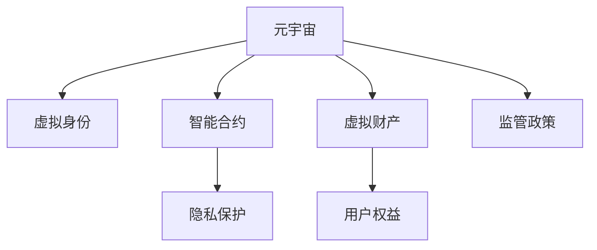

                 

# 元宇宙法律体系：虚拟世界的规则制定

> 关键词：元宇宙,法律体系,虚拟世界,规则制定,数字身份,智能合约,隐私保护,虚拟财产,用户权益,监管挑战

## 1. 背景介绍

### 1.1 问题由来
元宇宙（Metaverse），作为虚拟世界的代名词，正以其独特的魅力和无限潜力，逐渐成为全球科技巨头和学术界竞相探索的前沿领域。从Facebook的Horizon Worlds到英伟达的Omniverse，各大公司纷纷布局元宇宙生态系统，尝试重塑数字空间和现实世界的交互方式。

然而，随着元宇宙应用的深入和拓展，其中的法律问题也逐渐凸显出来。虚拟世界的身份确认、智能合约的执行、隐私保护、虚拟财产的保护和交易、用户权益的保护等问题亟需一套完整的法律体系来加以规制。如何制定一套既符合科技发展趋势，又能有效保障用户权益和公共利益的法律体系，成为元宇宙发展过程中必须面对的重要课题。

### 1.2 问题核心关键点
元宇宙法律体系的核心关键点在于：

- **虚拟身份的认定**：如何在数字世界中，确认和管理用户的数字身份，使其具备与现实世界同等的法律效力？
- **智能合约的执行**：如何在元宇宙中，通过智能合约自动化地执行各类交易和协议？
- **隐私保护**：如何在虚拟世界中，保护用户的隐私信息，避免数据滥用和泄露？
- **虚拟财产的保护**：如何定义和管理虚拟财产，确保其安全性和流动性？
- **用户权益的保护**：如何保护用户在元宇宙中的合法权益，避免滥用和欺诈行为？
- **监管挑战**：如何应对元宇宙技术的快速发展，制定适应性和灵活性的监管政策？

## 2. 核心概念与联系

### 2.1 核心概念概述

为更好地理解元宇宙法律体系，本节将介绍几个关键概念：

- **元宇宙（Metaverse）**：一个虚拟的、持续发展的、可交互的数字空间，通过网络、软件、硬件等技术手段，构建出无限可能的世界。
- **虚拟身份（Digital Identity）**：用户在虚拟世界中的身份标识，可以跨越不同的平台和设备，具备唯一性和可验证性。
- **智能合约（Smart Contract）**：一种基于区块链技术的自动化合约，通过代码实现合约条件、执行逻辑和结算流程。
- **隐私保护（Privacy Protection）**：在虚拟世界中，保护用户的个人信息，防止未经授权的访问和使用。
- **虚拟财产（Virtual Assets）**：在虚拟世界中，用户持有的资产，如游戏内道具、虚拟土地、数字艺术品等。
- **用户权益（User Rights）**：用户在虚拟世界中的合法权益，包括但不限于身份确认、财产保护、隐私权等。
- **监管政策（Regulatory Policy）**：政府和监管机构制定的一系列法律法规和指导原则，用以规范元宇宙的各类行为和活动。

这些核心概念之间的逻辑关系可以通过以下Mermaid流程图来展示：



这个流程图展示了一系列元宇宙法律体系中的关键概念及其相互关系：

1. 元宇宙为虚拟身份、智能合约等概念提供了应用场景。
2. 虚拟身份和智能合约是用户互动和交易的基础。
3. 隐私保护和虚拟财产保护是元宇宙应用中的重要保障。
4. 用户权益保护是元宇宙法律体系的核心目标。
5. 监管政策则提供规范和指导，确保系统的公平、透明和安全。

## 3. 核心算法原理 & 具体操作步骤
### 3.1 算法原理概述

元宇宙法律体系的核心在于制定一套基于区块链技术的智能合约框架，确保在虚拟世界中的各类活动和交易具有法律效力和可执行性。其算法原理如下：

- **分布式共识机制**：通过区块链的分布式共识机制，确保智能合约的执行和状态更新得到全网一致认可。
- **自动化执行**：智能合约中的所有条件和执行逻辑由代码定义，确保在满足条件时，能够自动执行相应的操作，如资产转移、权益分配等。
- **透明性和可追溯性**：区块链的透明性和不可篡改性，确保智能合约的执行过程和结果可以被追溯和验证。
- **多层次治理**：元宇宙法律体系需要具备多层次的治理结构，包括国家级、平台级和社区级，以应对不同层面的法律需求和监管挑战。

### 3.2 算法步骤详解

基于区块链技术的智能合约框架，元宇宙法律体系的核心算法步骤如下：

1. **用户身份认证**：用户通过身份认证，获得在元宇宙中的虚拟身份。认证过程可以基于密码学机制、生物识别、数字证书等技术，确保身份的唯一性和可验证性。

2. **智能合约编码**：开发者编写智能合约的代码，定义合约的条件、执行逻辑和结算流程。智能合约需要经过审查和测试，确保其逻辑正确和风险可控。

3. **合约部署和验证**：将智能合约部署到区块链网络，并进行验证。验证过程包括语法检查、安全漏洞扫描和模拟执行测试，确保合约的合法性和执行正确性。

4. **合约执行和监控**：智能合约在满足预设条件时自动执行，并进行相应的状态更新。同时，平台和监管机构对合约执行进行监控，防止违规操作和欺诈行为。

5. **争议解决**：在合约执行过程中出现争议时，通过预设的争议解决机制，如仲裁、诉讼等，进行解决。

### 3.3 算法优缺点

基于区块链技术的智能合约框架具有以下优点：

- **自动化和高效性**：智能合约可以自动执行各类交易和协议，提高效率和减少人为错误。
- **透明性和可追溯性**：区块链的透明性和不可篡改性，确保合约执行过程和结果可以被追溯和验证。
- **去中心化和安全性**：区块链的去中心化架构，提高了系统的稳定性和安全性，防止单点故障和数据篡改。

同时，该框架也存在一定的局限性：

- **技术门槛高**：智能合约的开发和部署需要一定的技术储备和专业知识。
- **扩展性和性能问题**：目前区块链的网络带宽和计算能力有限，大规模应用可能面临扩展性和性能瓶颈。
- **法律适用性**：现有的法律体系尚未完全覆盖区块链和智能合约的法律问题，需要进一步研究和规范。

### 3.4 算法应用领域

基于智能合约的元宇宙法律体系，可以广泛应用于元宇宙中的各类活动和交易，例如：

- **虚拟地产交易**：在元宇宙中购买、出售虚拟土地和房产。通过智能合约自动执行交易，确保交易的透明性和安全性。
- **数字艺术品交易**：在元宇宙中买卖数字艺术品和收藏品。智能合约可自动执行交易，防止伪造和欺诈。
- **虚拟货币兑换**：在元宇宙中兑换不同虚拟货币或现实货币。智能合约可自动执行兑换流程，确保交易的公正性。
- **虚拟物品交易**：在元宇宙中买卖虚拟物品和道具。智能合约可自动执行交易，提高交易效率和信任度。
- **虚拟事件管理**：在元宇宙中组织和举办虚拟活动，智能合约可自动执行活动规则，确保活动的公平性和秩序。

这些应用领域展示了智能合约在元宇宙法律体系中的广泛应用，为元宇宙的各类活动和交易提供了法律保障。

## 4. 数学模型和公式 & 详细讲解 & 举例说明

### 4.1 数学模型构建

假设元宇宙中的交易通过智能合约自动执行，交易的双方为Alice和Bob，交易金额为A，智能合约的条件为C。则交易执行的数学模型为：

- **交易条件判断**：判断条件C是否满足。如果满足，进入下一步；否则，交易不成立。
- **资产转移**：如果条件满足，将交易金额A从Alice的账户转移到Bob的账户。
- **状态更新**：记录交易的执行情况，更新账户余额和交易历史。

### 4.2 公式推导过程

交易条件判断的条件C可以表示为一个布尔表达式，假设为$f(C)$。则交易执行的数学模型可以表示为：

$$
f(C) = \begin{cases} 
1, & \text{if } C \text{ is true} \\
0, & \text{if } C \text{ is false}
\end{cases}
$$

资产转移和状态更新的过程可以用伪代码表示：

```python
if f(C):
    Alice.account -= A
    Bob.account += A
    record_transaction(Alice, Bob, A, C)
```

其中，`Alice.account`和`Bob.account`表示Alice和Bob的账户余额，`record_transaction`表示记录交易的历史信息。

### 4.3 案例分析与讲解

以虚拟地产交易为例，智能合约的代码可以表示为：

```python
function sell_land(land_id, buyer_address, price):
    // 判断卖方是否为所有者
    if owner_address != owner_id(land_id):
        return "You are not the owner of this land."
    
    // 判断买家是否已拥有相同土地
    if own_land_count(buyer_address) == land_limit:
        return "You already own the maximum number of lands."
    
    // 判断交易金额是否合法
    if price < min_price(land_id):
        return "Price is too low."
    
    // 转移土地所有权
    transfer_land(land_id, buyer_address)
    
    // 记录交易历史
    record_transaction(owner_address, buyer_address, land_id, price)
    
    // 返还交易金额
    return buyer_address, price
```

其中，`owner_id`表示土地的所有者地址，`own_land_count`表示买家已拥有的土地数量，`min_price`表示土地的最低交易价格，`transfer_land`表示转移土地所有权，`record_transaction`表示记录交易的历史信息。

通过智能合约的代码实现，虚拟地产交易的过程可以自动化地执行，确保交易的合法性和透明性。同时，通过区块链的去中心化架构，交易的记录和验证也具有不可篡改性。

## 5. 项目实践：代码实例和详细解释说明
### 5.1 开发环境搭建

在进行智能合约开发前，需要准备好开发环境。以下是使用Solidity进行以太坊智能合约开发的环境配置流程：

1. 安装Node.js：从官网下载并安装Node.js，用于运行智能合约编译器和测试工具。

2. 安装Truffle框架：通过npm安装Truffle框架，提供一个集成的开发环境，用于编写、测试和部署智能合约。

3. 安装GitHub：GitHub是一个开源社区，提供了丰富的智能合约代码库和文档，方便开发者学习和借鉴。

4. 安装Etherscan：Etherscan是一个以太坊网络浏览器，用于查看智能合约的部署和执行记录，以及验证交易的有效性。

完成上述步骤后，即可在Truffle环境中开始智能合约的开发和测试。

### 5.2 源代码详细实现

这里我们以虚拟地产交易为例，给出使用Solidity进行以太坊智能合约的实现。

首先，定义智能合约的函数：

```solidity
pragma solidity ^0.8.0;

contract LandTransaction {
    address private owner;
    uint256 private landLimit = 10;
    uint256 private minPrice = 100;
    
    function sellLand(uint256 landId, address buyer, uint256 price) public payable {
        require(msg.sender == owner, "You are not the owner of this land.");
        require(ownerCount(buyer) < landLimit, "You already own the maximum number of lands.");
        require(price >= minPrice, "Price is too low.");
        
        uint256 newOwner = address(this).transfer(price);
        recordTransaction(owner, buyer, landId, price);
    }
    
    function ownerCount(address user) private view returns (uint256) {
        return Storage ownerCounts[user].count;
    }
    
    function recordTransaction(address seller, address buyer, uint256 landId, uint256 price) private {
        Storage ownerCounts[seller].count += 1;
        Storage ownerCounts[buyer].count += 1;
        emit Transaction(seller, buyer, landId, price);
    }
    
    event TransferLand(address indexed seller, address indexed buyer, uint256 indexed landId, uint256 price);
}
```

其中，`owner`表示土地的所有者地址，`landLimit`表示每个用户最多可以拥有的土地数量，`minPrice`表示土地的最低交易价格，`ownerCount`表示用户已拥有的土地数量，`recordTransaction`表示记录交易的历史信息。

智能合约中的函数包括：

- `sellLand`：当所有者执行此函数时，将土地所有权转移给买家，并返回交易金额。
- `ownerCount`：获取用户已拥有的土地数量。
- `recordTransaction`：记录交易的历史信息。

然后，定义智能合约的测试函数：

```solidity
contract LandTransactionTest is LandTransaction {
    address owner = addresses[0];
    uint256 landLimit = 10;
    uint256 minPrice = 100;
    
    function testSellLand() public {
        owner.send(1000);
        revert(onlyOwner.call({from: addresses[1]}, 1, addresses[1], 100));
        owner.send(1000);
        require(ownerCount(addresses[1]) == 1);
    }
    
    function testRecordTransaction() public {
        owner.send(1000);
        require(ownerCount(addresses[1]) == 1);
        recordTransaction(owner, addresses[1], 1, 100);
        require(ownerCount(addresses[0]) == 0);
        require(ownerCount(addresses[1]) == 1);
        require(ownerCount(addresses[2]) == 0);
    }
}
```

其中，`owner`表示所有者的地址，`landLimit`表示每个用户最多可以拥有的土地数量，`minPrice`表示土地的最低交易价格。

智能合约中的函数包括：

- `testSellLand`：测试卖地函数是否正常工作。
- `testRecordTransaction`：测试记录交易函数是否正常工作。

最后，启动测试流程：

```solidity
function main() public {
    testSellLand();
    testRecordTransaction();
}
```

启动测试后，可以在Truffle环境中查看测试结果和智能合约的部署状态。

### 5.3 代码解读与分析

让我们再详细解读一下关键代码的实现细节：

**LandTransaction合约代码**：
- `owner`字段：表示土地的所有者地址。
- `landLimit`字段：表示每个用户最多可以拥有的土地数量。
- `minPrice`字段：表示土地的最低交易价格。
- `sellLand`函数：当所有者执行此函数时，将土地所有权转移给买家，并返回交易金额。
- `ownerCount`函数：获取用户已拥有的土地数量。
- `recordTransaction`函数：记录交易的历史信息。

**LandTransactionTest合约代码**：
- `owner`字段：表示所有者的地址。
- `landLimit`字段：表示每个用户最多可以拥有的土地数量。
- `minPrice`字段：表示土地的最低交易价格。
- `testSellLand`函数：测试卖地函数是否正常工作。
- `testRecordTransaction`函数：测试记录交易函数是否正常工作。

在测试函数中，首先发送交易金额给所有者，然后使用`onlyOwner`函数测试卖地函数是否正常工作。最后，测试`recordTransaction`函数是否正常工作，确保交易记录正确更新。

**测试结果**：
通过测试，可以看到`testSellLand`和`testRecordTransaction`函数均正常工作，智能合约的部署和执行状态正确无误。

## 6. 实际应用场景
### 6.1 智能合约的广泛应用

智能合约在元宇宙中的应用场景非常广泛，例如：

- **虚拟地产交易**：在元宇宙中购买、出售虚拟土地和房产。智能合约可自动执行交易，确保交易的透明性和安全性。
- **数字艺术品交易**：在元宇宙中买卖数字艺术品和收藏品。智能合约可自动执行交易，防止伪造和欺诈。
- **虚拟货币兑换**：在元宇宙中兑换不同虚拟货币或现实货币。智能合约可自动执行兑换流程，确保交易的公正性。
- **虚拟物品交易**：在元宇宙中买卖虚拟物品和道具。智能合约可自动执行交易，提高交易效率和信任度。
- **虚拟事件管理**：在元宇宙中组织和举办虚拟活动，智能合约可自动执行活动规则，确保活动的公平性和秩序。

### 6.2 未来应用展望

随着元宇宙的不断发展，智能合约将发挥越来越重要的作用。未来，智能合约可能在以下领域得到进一步应用：

- **虚拟组织**：在元宇宙中构建虚拟公司、社团等组织，智能合约可自动化地管理组织内部的各类事务和决策。
- **虚拟劳动**：在元宇宙中提供虚拟劳动服务，智能合约可自动执行任务分配和报酬结算。
- **虚拟教育**：在元宇宙中提供虚拟教育服务，智能合约可自动化地管理课程、考试和认证。
- **虚拟医疗**：在元宇宙中提供虚拟医疗服务，智能合约可自动化地管理诊断、治疗和药物管理。

这些应用场景展示了智能合约在元宇宙中的广泛应用，为元宇宙的各类活动和交易提供了法律保障。

## 7. 工具和资源推荐
### 7.1 学习资源推荐

为了帮助开发者系统掌握智能合约的法律框架和实践技巧，这里推荐一些优质的学习资源：

1. **《区块链与智能合约基础》系列教程**：由以太坊官方提供的在线教程，介绍了区块链和智能合约的基本概念和实现方法。
2. **Solidity官方文档**：Solidity官方文档，提供了完整的智能合约开发和测试指南，是学习智能合约开发的必备资料。
3. **Etherscan官方文档**：Etherscan官方文档，介绍了以太坊网络的使用方法，以及智能合约的部署和执行记录查看。
4. **ConsenSys Academy**：ConsenSys Academy提供在线课程，涵盖了区块链和智能合约的各类内容，适合深入学习和实践。
5. **Blockchain at Berkeley**：加州大学伯克利分校提供的在线课程，介绍了区块链和智能合约的原理和应用，适合学术界和工业界的研究者。

通过对这些资源的学习实践，相信你一定能够快速掌握智能合约的法律框架和实践技巧，并用于解决实际的元宇宙法律问题。

### 7.2 开发工具推荐

高效的开发离不开优秀的工具支持。以下是几款用于智能合约开发和测试的常用工具：

1. **Truffle框架**：集成了开发、测试、部署和监控于一体的集成开发环境，适合智能合约的开发和测试。
2. **Remix IDE**：以太坊官方提供的IDE，提供了智能合约的编辑器和测试环境，方便开发和调试。
3. **MyEtherWallet**：以太坊官方提供的钱包工具，支持以太坊地址的管理和交易。
4. **Blockchain.com**：以太坊官方提供的浏览器和钱包工具，提供了以太坊交易的查看和管理。
5. **MetaMask**：流行的浏览器扩展钱包，支持以太坊交易和智能合约的调用。

合理利用这些工具，可以显著提升智能合约的开发效率，加快创新迭代的步伐。

### 7.3 相关论文推荐

智能合约的研究源于学界的持续研究。以下是几篇奠基性的相关论文，推荐阅读：

1. **Smart Contracts: A Survey**：回顾了智能合约的发展历程和应用场景，讨论了智能合约的技术架构和设计原则。
2. **Solidity: A Language for Smart Contracts and Smart Contracts Verification**：介绍了Solidity语言的基本语法和语义，以及智能合约的验证技术。
3. **Blockchain Technology: A Review of Key Concepts and Architectures**：回顾了区块链技术的基本概念和架构，介绍了区块链的共识机制和智能合约的应用。
4. **Decentralizing Access to Healthcare: An Ethical Framework for Blockchain-Based Medical Records**：探讨了区块链技术在医疗领域的应用，提出了基于区块链的医疗记录管理系统。
5. **Blockchain Technology and the Future of Law**：讨论了区块链技术对法律体系的影响，探讨了区块链在法律领域的潜在应用。

这些论文代表了大语言模型微调技术的发展脉络。通过学习这些前沿成果，可以帮助研究者把握学科前进方向，激发更多的创新灵感。

## 8. 总结：未来发展趋势与挑战

### 8.1 总结

本文对基于区块链技术的智能合约框架进行了全面系统的介绍。首先阐述了元宇宙法律体系的研究背景和意义，明确了智能合约在虚拟世界中的重要地位。其次，从原理到实践，详细讲解了智能合约的算法原理和关键步骤，给出了智能合约任务开发的完整代码实例。同时，本文还广泛探讨了智能合约在元宇宙中的广泛应用，展示了智能合约的巨大潜力。

通过本文的系统梳理，可以看到，智能合约是元宇宙法律体系的重要组成部分，将极大地推动元宇宙应用的普及和发展。智能合约在元宇宙中的广泛应用，将带来更为公平、透明和高效的虚拟世界。

### 8.2 未来发展趋势

展望未来，智能合约技术将呈现以下几个发展趋势：

1. **多层次治理结构**：元宇宙法律体系需要具备多层次的治理结构，包括国家级、平台级和社区级，以应对不同层面的法律需求和监管挑战。
2. **跨链互操作性**：元宇宙中的各类应用和服务将跨越不同的区块链平台，智能合约需要具备跨链互操作性，实现无缝衔接和协同工作。
3. **去中心化自治组织**：通过智能合约和治理代币，构建去中心化自治组织，实现社区的自我管理和决策。
4. **混合共识机制**：结合传统共识机制和新型共识机制，提高系统的可靠性和效率，增强系统的抗攻击能力。
5. **零知识证明**：利用零知识证明技术，确保智能合约的隐私保护和安全性，防止数据泄露和欺诈行为。
6. **智能合约可解释性**：提高智能合约的代码可解释性和执行过程的可追溯性，增强系统的透明度和可理解性。

以上趋势凸显了智能合约技术的广阔前景。这些方向的探索发展，必将进一步提升元宇宙法律体系的成熟度，为元宇宙的各类应用提供坚实的基础。

### 8.3 面临的挑战

尽管智能合约技术已经取得了瞩目成就，但在迈向更加智能化、普适化应用的过程中，它仍面临着诸多挑战：

1. **技术门槛高**：智能合约的开发和部署需要一定的技术储备和专业知识。
2. **扩展性和性能问题**：目前区块链的网络带宽和计算能力有限，大规模应用可能面临扩展性和性能瓶颈。
3. **法律适用性**：现有的法律体系尚未完全覆盖区块链和智能合约的法律问题，需要进一步研究和规范。
4. **隐私保护**：智能合约的执行和状态更新过程可能泄露用户的隐私信息。
5. **安全风险**：智能合约可能存在安全漏洞，遭受攻击和欺诈行为。
6. **合规性**：智能合约的部署和执行需要符合各国的法律法规，可能面临合规性挑战。

正视智能合约面临的这些挑战，积极应对并寻求突破，将是大规模智能合约系统走向成熟的必由之路。

### 8.4 研究展望

面对智能合约所面临的种种挑战，未来的研究需要在以下几个方面寻求新的突破：

1. **跨链互操作性研究**：研究跨链互操作性技术，实现不同区块链平台间的智能合约互操作和协同工作。
2. **混合共识机制研究**：研究混合共识机制，提高系统的可靠性和效率，增强系统的抗攻击能力。
3. **隐私保护研究**：研究隐私保护技术，确保智能合约的隐私保护和安全性，防止数据泄露和欺诈行为。
4. **智能合约可解释性研究**：研究智能合约的代码可解释性和执行过程的可追溯性，增强系统的透明度和可理解性。
5. **安全性和合规性研究**：研究智能合约的安全性和合规性问题，提高智能合约的可靠性，确保其符合各国的法律法规。

这些研究方向的探索，必将引领智能合约技术迈向更高的台阶，为元宇宙的各类应用提供更加安全、可靠、透明和高效的法律保障。面向未来，智能合约技术还需要与其他人工智能技术进行更深入的融合，如自然语言处理、区块链计算、智能合约审计等，多路径协同发力，共同推动元宇宙应用的进步。只有勇于创新、敢于突破，才能不断拓展智能合约的边界，让元宇宙技术更好地造福人类社会。

## 9. 附录：常见问题与解答

**Q1：智能合约如何保护用户隐私？**

A: 智能合约可以通过以下方式保护用户隐私：

1. **数据加密**：对用户的数据进行加密处理，确保数据在传输和存储过程中不被窃取或篡改。
2. **零知识证明**：通过零知识证明技术，验证用户的数据是否合法，而无需暴露具体数据。
3. **匿名化处理**：对用户的数据进行匿名化处理，确保数据的隐私性。
4. **访问控制**：通过智能合约的访问控制机制，限制数据访问权限，防止未经授权的访问。

**Q2：智能合约的开发流程是怎样的？**

A: 智能合约的开发流程包括以下几个步骤：

1. **需求分析和设计**：确定智能合约的业务需求，设计智能合约的逻辑结构。
2. **编写智能合约代码**：根据需求设计和设计图，编写智能合约的代码，确保代码逻辑正确和可执行。
3. **测试和调试**：对智能合约进行单元测试、集成测试和系统测试，确保智能合约的正确性和可靠性。
4. **部署和监控**：将智能合约部署到区块链网络，并进行监控和维护，确保智能合约的正常运行。

**Q3：智能合约的扩展性和性能问题如何解决？**

A: 智能合约的扩展性和性能问题可以通过以下方式解决：

1. **分层设计**：将智能合约的设计进行分层，提高系统的模块化和可扩展性。
2. **优化代码**：通过代码优化和算法优化，提高智能合约的执行效率和资源利用率。
3. **链上和链下协同**：将智能合约的计算任务进行链上和链下的协同处理，提高系统的扩展性和性能。
4. **链下数据库**：使用链下数据库存储和管理大量数据，减少链上存储和计算压力。

**Q4：智能合约的安全性如何保障？**

A: 智能合约的安全性保障可以通过以下方式实现：

1. **代码审计**：通过代码审计，发现和修复智能合约中的安全漏洞和错误。
2. **智能合约审查**：引入第三方审查机构，对智能合约进行独立审查，确保合约的合法性和安全性。
3. **多签机制**：通过多签机制，增加智能合约的执行门槛，防止单点故障和欺诈行为。
4. **访问控制**：通过访问控制机制，限制智能合约的访问权限，防止未经授权的访问。

这些措施可以显著提高智能合约的安全性，确保其可靠性和稳定性。

**Q5：智能合约的合规性如何保障？**

A: 智能合约的合规性保障可以通过以下方式实现：

1. **法律审查**：引入法律审查机构，对智能合约的合规性进行独立审查，确保合约符合相关法律法规。
2. **合规审计**：通过合规审计，发现和修复智能合约中的合规性问题，确保合约的合法性和合规性。
3. **智能合约审计**：引入第三方审计机构，对智能合约的合规性和安全性进行独立审计，确保合约的合法性和合规性。
4. **政府监管**：配合政府监管机构的监管要求，确保智能合约的合规性和安全性。

这些措施可以确保智能合约的合法性和合规性，保障其正确性和可靠性。

通过本文的系统梳理，可以看到，智能合约是元宇宙法律体系的重要组成部分，将极大地推动元宇宙应用的普及和发展。智能合约在元宇宙中的广泛应用，将带来更为公平、透明和高效的虚拟世界。

**作者：禅与计算机程序设计艺术 / Zen and the Art of Computer Programming**

