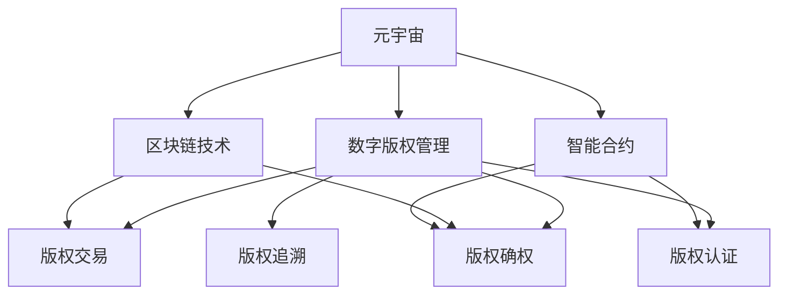

                 

# 元宇宙版权保护:数字版权的智能管理

> 关键词：元宇宙,数字版权管理,区块链技术,智能合约,版权保护,人工智能,溯源,区块链,智能合约,版权确权,版权交易,版权认证

## 1. 背景介绍

### 1.1 问题由来
随着数字技术的迅猛发展，元宇宙（Metaverse）的概念被广泛提及，它被视为一种基于虚拟现实和网络技术构建的全新数字空间。在这个虚拟空间中，用户可以进行虚拟交往、购物、娱乐等活动，甚至拥有虚拟资产。然而，元宇宙的兴起也带来了新的版权保护问题。数字内容的创作者和管理者如何在虚拟世界中维护自身权益，防止版权侵权，是一个亟需解决的问题。

### 1.2 问题核心关键点
元宇宙版权保护的核心在于利用先进的技术手段，确保创作者的数字内容得到充分保护，同时提高版权管理的效率和透明度。主要涉及以下几个方面：

- 版权确权：确保数字内容的归属清晰，防止“哑版权”问题。
- 版权交易：提供安全的版权流转平台，便于版权的合法交易和流转。
- 版权认证：通过区块链等技术，提供版权的不可篡改性证明。
- 版权追溯：构建版权的完整链条，便于版权纠纷的快速解决。

这些关键点构成了元宇宙版权保护的整个框架，需要技术的深度融合和应用创新。

## 2. 核心概念与联系

### 2.1 核心概念概述

为更好地理解元宇宙版权保护，本节将介绍几个密切相关的核心概念：

- 元宇宙（Metaverse）：一个虚拟的、持续的、共享的、三维空间的数字世界，包含虚拟环境、虚拟资产和虚拟社交等元素。
- 数字版权管理（Digital Rights Management, DRM）：一种管理数字内容版权的技术手段，包括版权确权、版权认证、版权交易等功能。
- 区块链技术：一种分布式账本技术，能够实现数据的去中心化存储和不可篡改性，用于版权的溯源和认证。
- 智能合约：一种基于区块链技术的自动化合约，通过代码实现，无需第三方干预。
- 人工智能（AI）：一种模拟人类智能的技术，可用于版权的管理和认证。
- 版权确权：确定数字内容的版权归属，防止“哑版权”问题。
- 版权交易：实现版权的合法流转和交易，保护版权所有者的利益。
- 版权认证：通过技术手段，证明版权的真实性和合法性。
- 版权追溯：构建版权的完整链条，便于版权纠纷的快速解决。

这些核心概念之间的逻辑关系可以通过以下Mermaid流程图来展示：



这个流程图展示了大语言模型的核心概念及其之间的关系：

1. 元宇宙通过数字版权管理保护创作者权益。
2. 数字版权管理依赖区块链技术实现版权的不可篡改性。
3. 区块链技术和智能合约协同工作，实现版权的确权、交易和认证。
4. 人工智能用于辅助版权的管理和认证，提升效率。

这些概念共同构成了元宇宙版权保护的整个技术架构，使其能够更好地在虚拟空间中保护数字内容。

## 3. 核心算法原理 & 具体操作步骤
### 3.1 算法原理概述

元宇宙版权保护的核心算法主要依赖区块链技术和智能合约，通过代码实现自动化的版权管理。其核心思想是：

1. 利用区块链的不可篡改性，确保版权记录的真实性和安全性。
2. 通过智能合约，自动执行版权的流转、交易和认证，提升版权管理的效率。
3. 结合人工智能技术，实现对版权信息的智能识别和分析，提高管理精度。

具体而言，版权确权、交易、认证和追溯的过程如下：

1. 创作者完成作品创作后，使用智能合约将作品的版权信息（包括版权归属、创建时间、使用权限等）上传到区块链，形成不可篡改的版权记录。
2. 版权交易时，智能合约自动验证版权信息的真实性和完整性，并在区块链上进行交易记录。
3. 版权认证时，智能合约通过区块链上的版权记录，自动验证版权的真实性和合法性，防止假冒和侵权。
4. 版权追溯时，智能合约通过区块链上的版权记录，构建版权的完整链条，便于版权纠纷的快速解决。

### 3.2 算法步骤详解

基于区块链和智能合约的版权保护算法，可以分为以下几个关键步骤：

**Step 1: 版权确权**
- 创作者将作品的版权信息（如作者、创作时间、使用权限等）输入智能合约。
- 智能合约将版权信息加密存储到区块链上，形成不可篡改的版权记录。
- 版权信息包括但不限于作品标题、版权声明、使用范围、许可协议等。

**Step 2: 版权交易**
- 版权交易时，买卖双方通过智能合约进行交互，智能合约自动验证版权信息的真实性和完整性。
- 如果验证通过，智能合约在区块链上自动记录交易信息，并进行版权流转。
- 智能合约可以自动生成交易凭证和版权证书，便于后续的版权管理和维权。

**Step 3: 版权认证**
- 版权认证时，第三方机构通过智能合约查询区块链上的版权记录，验证版权的真实性和合法性。
- 智能合约自动生成版权认证报告，并在区块链上记录，防止假冒和侵权。
- 认证报告包括版权信息、使用记录、授权状态等，方便版权使用和维护。

**Step 4: 版权追溯**
- 版权追溯时，智能合约通过区块链上的版权记录，构建版权的完整链条。
- 版权链条包括版权的确权、流转、认证等环节，便于版权纠纷的快速解决。
- 智能合约可以自动追踪版权的使用情况，提供完整的版权使用记录，便于版权所有者维护自身权益。

### 3.3 算法优缺点

基于区块链和智能合约的版权保护算法具有以下优点：

1. 不可篡改性：区块链的不可篡改性保证了版权记录的真实性和安全性，防止版权信息被篡改或删除。
2. 自动化执行：智能合约通过代码实现版权管理，自动执行版权确权、交易、认证和追溯等操作，提高管理效率。
3. 去中心化：区块链的去中心化特性，使得版权管理不再依赖单一机构，降低了版权管理的风险。
4. 透明度高：版权记录公开透明，便于监督和管理，防止版权侵权行为。

同时，该算法也存在以下局限性：

1. 技术门槛高：区块链和智能合约的复杂性，要求开发者具备较高的技术水平。
2. 交易费用高：智能合约的执行需要消耗网络资源，高交易量会导致高费用。
3. 性能瓶颈：区块链的写入和读取效率，可能无法满足大规模版权管理的需要。
4. 隐私问题：版权信息公开透明，可能存在隐私泄露的风险。

尽管存在这些局限性，但基于区块链和智能合约的版权保护方法，仍是大语言模型版权管理的主流范式。未来相关研究的方向在于如何进一步降低技术门槛，提高交易效率，保障隐私安全，优化性能瓶颈，以实现更加高效和安全的版权管理。

### 3.4 算法应用领域

基于区块链和智能合约的版权保护方法，已经在多个领域得到了广泛应用，例如：

- 数字出版：在图书、音乐、影视等领域，通过智能合约和区块链实现版权确权、交易和认证。
- 数字艺术品：在数字艺术品市场上，使用区块链记录作品的创作、流转和认证信息，防止假冒和侵权。
- 数字游戏：在虚拟游戏世界中，通过智能合约和区块链实现虚拟资产的版权管理和交易。
- 数字内容平台：在视频、音乐、文学等数字内容平台上，使用区块链记录作品的版权信息，方便版权管理。

除了上述这些经典应用外，区块链和智能合约技术还将在更多领域得到应用，如供应链管理、金融交易、医疗记录等，为数字内容的管理提供新的解决方案。随着区块链和智能合约技术的不断发展，相信元宇宙版权保护将在更广阔的应用领域大放异彩。

## 4. 数学模型和公式 & 详细讲解  
### 4.1 数学模型构建

基于区块链和智能合约的版权保护方法，通常使用哈希函数、公钥加密、数字签名等密码学技术实现版权信息的存储和验证。

假设版权信息 $V$ 包括版权声明、作者、使用范围、许可协议等，版权确权的过程可以表示为：

$$
V_{block} = H(V)
$$

其中 $H$ 为哈希函数，将版权信息 $V$ 转换为不可逆的哈希值 $V_{block}$，并存储在区块链上。

版权交易的过程可以表示为：

$$
V_{new} = V + \Delta V
$$

其中 $\Delta V$ 为版权流转信息，如购买方、使用时间、使用权限等。智能合约在区块链上自动记录新的版权信息 $V_{new}$，并生成交易凭证和版权证书。

版权认证的过程可以表示为：

$$
V_{auth} = V_{block} + \Delta V
$$

其中 $\Delta V$ 为认证信息，如认证机构、认证时间、认证结果等。智能合约在区块链上自动生成版权认证报告 $V_{auth}$，并在区块链上记录。

版权追溯的过程可以表示为：

$$
V_{chain} = V_{block} + \Delta V
$$

其中 $\Delta V$ 为追溯信息，如版权流转历史、使用记录、授权状态等。智能合约通过区块链上的版权记录，构建版权的完整链条 $V_{chain}$，便于版权纠纷的快速解决。

### 4.2 公式推导过程

以下我们以一个简化的版权确权和交易过程为例，推导智能合约的核心算法。

假设版权信息 $V$ 包括作品标题、作者、使用范围等，版权确权的过程可以表示为：

1. 将版权信息 $V$ 输入智能合约。
2. 智能合约对 $V$ 进行哈希处理，得到哈希值 $V_{block}$。
3. 将 $V_{block}$ 存储在区块链上。

版权交易的过程可以表示为：

1. 智能合约验证版权信息的真实性和完整性。
2. 如果验证通过，智能合约在区块链上自动记录新的版权信息 $V_{new}$，包括购买方、使用时间、使用权限等。
3. 智能合约自动生成交易凭证和版权证书，供购买方使用。

假设版权信息 $V$ 包括作品标题、作者、使用范围等，版权认证的过程可以表示为：

1. 第三方机构通过智能合约查询区块链上的版权记录。
2. 智能合约自动验证版权信息的真实性和合法性。
3. 智能合约自动生成版权认证报告，包括版权信息、使用记录、授权状态等。

假设版权信息 $V$ 包括作品标题、作者、使用范围等，版权追溯的过程可以表示为：

1. 智能合约通过区块链上的版权记录，构建版权的完整链条。
2. 版权链条包括版权的确权、流转、认证等环节，便于版权纠纷的快速解决。
3. 智能合约自动追踪版权的使用情况，提供完整的版权使用记录，便于版权所有者维护自身权益。

通过这些公式，可以看到，基于区块链和智能合约的版权保护方法，具有高度的自动化和不可篡改性，能够在虚拟空间中提供安全的版权管理解决方案。

## 5. 项目实践：代码实例和详细解释说明
### 5.1 开发环境搭建

在进行版权保护实践前，我们需要准备好开发环境。以下是使用Python进行区块链和智能合约开发的环境配置流程：

1. 安装Python：从官网下载并安装Python，用于编写智能合约和开发脚本。
2. 安装以太坊开发环境：使用Geth或Infura等工具搭建以太坊开发环境，用于测试智能合约。
3. 安装Solidity开发环境：使用Truffle或Remix等工具搭建Solidity开发环境，用于编写智能合约。
4. 安装合约测试工具：如Web3.js、Truffle等，用于测试和部署智能合约。
5. 安装Web3.py：使用Web3.py编写Python代码，连接区块链网络，部署和测试智能合约。

完成上述步骤后，即可在开发环境中开始版权保护实践。

### 5.2 源代码详细实现

这里我们以一个简单的版权确权和交易为例，给出使用Solidity编写智能合约的代码实现。

```solidity
pragma solidity ^0.8.0;

contract Copyright {
    struct License {
        address owner;
        uint creationTime;
        uint expiryTime;
        bool isActive;
    }

    mapping(uint256 => License) public licenses;
    uint256 private currentId;

    function createLicense(uint256 _tokenId) public {
        currentId = _tokenId;
        licenses[_tokenId] = License{msg.sender, now, now + 365 * 24 * 60 * 60, true};
    }

    function transferLicense(uint256 _tokenId, address _newOwner) public {
        License storage license = licenses[_tokenId];
        if (license.owner != msg.sender || !license.isActive) {
            revert();
        }
        license.owner = _newOwner;
        if (now > license.expiryTime) {
            revert();
        }
    }

    function getLicense(uint256 _tokenId) public view returns (uint256 _creationTime, uint256 _expiryTime) {
        License storage license = licenses[_tokenId];
        return (license.creationTime, license.expiryTime);
    }

    function isLicenseActive(uint256 _tokenId) public view returns (bool _isActive) {
        License storage license = licenses[_tokenId];
        return license.isActive;
    }
}
```

在这个智能合约中，我们定义了一个版权记录，包括版权所有者、创建时间、有效期等信息。创建版权时，智能合约自动记录版权信息到区块链上，生成新的版权记录ID。版权流转时，智能合约验证版权的合法性，并在区块链上自动记录新的版权所有者和有效期。版权查询时，智能合约提供版权信息的读取服务。

### 5.3 代码解读与分析

让我们再详细解读一下关键代码的实现细节：

**版权确权函数 createLicense()**：
- 接收版权记录ID _tokenId 作为参数。
- 在智能合约内部，定义一个 License 结构体，记录版权的创建时间、所有者、有效期等信息。
- 将当前ID _tokenId 存储到 licenses 映射表中，记录新的版权信息。

**版权流转函数 transferLicense()**：
- 接收版权记录ID _tokenId 和新的版权所有者 _newOwner 作为参数。
- 在智能合约内部，验证当前所有者是否为 msg.sender，同时验证有效期是否过期。
- 如果验证通过，更新版权所有者为 _newOwner，并在区块链上记录新的版权信息。

**版权查询函数 getLicense() 和 isLicenseActive()**：
- getLicense() 函数接收版权记录ID _tokenId 作为参数，返回版权的创建时间和有效期。
- isLicenseActive() 函数接收版权记录ID _tokenId 作为参数，返回版权是否处于活动状态。

通过这些代码，我们可以看到，使用Solidity编写智能合约，可以方便地实现版权的确权、流转和查询功能。智能合约通过代码实现版权管理，具有自动化和不可篡改性，适用于元宇宙中的版权保护。

## 6. 实际应用场景
### 6.1 数字出版

在数字出版领域，版权保护尤为重要。传统出版过程中，版权信息通常由人工记录和管理，容易出现信息缺失和错误。使用智能合约和区块链技术，可以实现自动化的版权记录和流转，防止版权侵权和盗版行为。

具体而言，出版商可以将作品的版权信息上传到智能合约，生成版权记录ID，供读者查询验证。读者在购买版权时，智能合约自动验证版权信息的真实性和完整性，并在区块链上记录购买信息。版权的使用和流转信息，也可以通过智能合约自动记录和验证，确保版权的合法使用。

### 6.2 数字艺术品

数字艺术品的版权保护也是一个重要应用场景。数字艺术品通常需要多次流转，版权管理难度较大。使用智能合约和区块链技术，可以实现自动化的版权确权和流转，防止假冒和侵权行为。

具体而言，艺术家可以在区块链上发布作品，记录作品的创作信息、版权声明和使用范围等。购买者购买艺术品时，智能合约自动验证版权信息的真实性和完整性，并在区块链上记录购买信息。版权的使用和流转信息，也可以通过智能合约自动记录和验证，确保版权的合法使用。

### 6.3 数字游戏

在数字游戏领域，版权保护也非常关键。游戏开发商通常需要保护游戏的版权，防止盗版和侵权行为。使用智能合约和区块链技术，可以实现自动化的版权记录和流转，防止版权侵权。

具体而言，游戏开发商可以将游戏的版权信息上传到智能合约，生成版权记录ID，供玩家查询验证。玩家购买游戏时，智能合约自动验证版权信息的真实性和完整性，并在区块链上记录购买信息。游戏的版权和使用信息，也可以通过智能合约自动记录和验证，确保版权的合法使用。

### 6.4 数字内容平台

在数字内容平台上，版权保护也是一个重要需求。平台方需要保护内容的版权，防止盗版和侵权行为。使用智能合约和区块链技术，可以实现自动化的版权记录和流转，防止版权侵权。

具体而言，平台方可以将内容的版权信息上传到智能合约，生成版权记录ID，供用户查询验证。用户在购买内容时，智能合约自动验证版权信息的真实性和完整性，并在区块链上记录购买信息。内容的版权和使用信息，也可以通过智能合约自动记录和验证，确保版权的合法使用。

### 6.5 未来应用展望

随着区块链和智能合约技术的发展，基于版权保护的大语言模型将在更多领域得到应用，为数字内容的管理提供新的解决方案。

在智慧医疗领域，基于版权保护的医疗数据管理，可以有效防止数据泄露和滥用，保障患者隐私和数据安全。

在智能制造领域，基于版权保护的生产设计管理，可以有效防止知识产权的流失，保护企业的创新成果。

在公共服务领域，基于版权保护的城市管理数据管理，可以有效防止数据的滥用和泄露，保障公共安全和社会稳定。

此外，在教育、金融、交通等众多领域，基于版权保护的大语言模型也将不断涌现，为数字化转型和智能化升级提供新的技术路径。相信随着技术的不断进步，版权保护将在更广泛的领域得到应用，为数字化世界的安全与和谐提供坚实的保障。

## 7. 工具和资源推荐
### 7.1 学习资源推荐

为了帮助开发者系统掌握大语言模型版权保护的理论基础和实践技巧，这里推荐一些优质的学习资源：

1. 《区块链技术与数字版权管理》系列博文：由区块链专家撰写，深入浅出地介绍了区块链技术、智能合约、版权保护等前沿话题。

2. CS223《区块链与数字金融》课程：哈佛大学开设的区块链和数字金融课程，系统讲解区块链和智能合约在版权保护中的应用。

3. 《数字版权管理原理与实践》书籍：系统介绍数字版权管理的技术框架和实践案例，帮助读者深入理解版权保护的本质。

4. Weights & Biases：模型训练的实验跟踪工具，可以记录和可视化模型训练过程中的各项指标，方便对比和调优。与主流深度学习框架无缝集成。

5. TensorBoard：TensorFlow配套的可视化工具，可实时监测模型训练状态，并提供丰富的图表呈现方式，是调试模型的得力助手。

通过对这些资源的学习实践，相信你一定能够快速掌握大语言模型版权保护的精髓，并用于解决实际的NLP问题。
###  7.2 开发工具推荐

高效的开发离不开优秀的工具支持。以下是几款用于大语言模型版权保护开发的常用工具：

1. Python：基于Python的开源深度学习框架，灵活动态的计算图，适合快速迭代研究。大部分区块链智能合约都有Python版本的实现。

2. Solidity：以太坊的编程语言，用于编写智能合约。其具备自动化的合约执行和数据存储功能，非常适合版权保护场景。

3. Truffle：一个基于Solidity的开发环境，用于开发、测试、部署智能合约。

4. Remix：一个基于Solidity的IDE，支持智能合约的编写、调试和测试。

5. Web3.js：一个JavaScript库，用于连接区块链网络，执行智能合约操作。

6. Web3.py：一个Python库，用于连接区块链网络，执行智能合约操作。

合理利用这些工具，可以显著提升版权保护任务的开发效率，加快创新迭代的步伐。

### 7.3 相关论文推荐

区块链和智能合约技术的发展源于学界的持续研究。以下是几篇奠基性的相关论文，推荐阅读：

1. Satoshi Nakamoto. "Bitcoin: A Peer-to-Peer Electronic Cash System"（比特币：点对点电子现金系统）：比特币的诞生论文，奠定了区块链技术的基础。

2. Vitalik Buterin. "A Next-Generation Smart Contract and Decentralized Application Platform"（下一代智能合约和去中心化应用平台）：以太坊白皮书，详细介绍了智能合约和以太坊的技术架构。

3. Mariano-Angel Reina, Carlos Ruiz. "Digital Rights Management Techniques: A Survey"（数字版权管理技术综述）：系统介绍了数字版权管理的技术框架和应用场景。

4. Juho Haarla, Michael Juutinen. "Decentralized Digital Rights Management for Peer-to-Peer Content Sharing"（去中心化数字版权管理在P2P内容共享中的应用）：介绍了去中心化版权管理在P2P内容共享中的应用。

5. Yanming Zhou, Yang Hu, Sheng Liang, Chun N. Ling. "Blockchain-Based Copyright Protection for Digital Works"（基于区块链的数字作品版权保护）：介绍了一种基于区块链的数字作品版权保护方法。

这些论文代表了大语言模型版权保护技术的发展脉络。通过学习这些前沿成果，可以帮助研究者把握学科前进方向，激发更多的创新灵感。

## 8. 总结：未来发展趋势与挑战

### 8.1 总结

本文对基于区块链和智能合约的元宇宙版权保护方法进行了全面系统的介绍。首先阐述了元宇宙版权保护的研究背景和意义，明确了版权保护在元宇宙中的重要性和紧迫性。其次，从原理到实践，详细讲解了版权的确权、交易、认证和追溯的过程，给出了版权保护任务的完整代码实现。同时，本文还广泛探讨了版权保护方法在数字出版、数字艺术品、数字游戏等多个领域的应用前景，展示了版权保护范式的巨大潜力。此外，本文精选了版权保护技术的各类学习资源，力求为读者提供全方位的技术指引。

通过本文的系统梳理，可以看到，基于区块链和智能合约的版权保护方法正在成为元宇宙版权保护的重要范式，极大地拓展了数字内容的版权管理边界，催生了更多的落地场景。受益于区块链和智能合约技术的不断发展，版权保护将在更广阔的应用领域大放异彩，为数字内容的管理提供新的解决方案。

### 8.2 未来发展趋势

展望未来，基于区块链和智能合约的版权保护技术将呈现以下几个发展趋势：

1. 区块链网络的扩展。随着区块链技术的不断成熟，公有链、联盟链和私链的形态将更加多样化，版权保护的应用范围将进一步扩大。
2. 智能合约的自动化程度提升。未来的智能合约将具备更高的自动化和智能化水平，能够实现更复杂的版权管理操作。
3. 跨链互操作性增强。不同区块链之间的互操作性将得到进一步提升，版权保护将实现跨链协同管理。
4. 数据隐私保护加强。版权信息将通过隐私计算等技术进行保护，防止数据泄露和滥用。
5. 版权信息标准化。版权信息将采用标准化的格式和协议，便于版权管理的规范化。
6. 版权交易生态系统形成。版权保护将形成完整的生态系统，包括版权确权、交易、认证、维权等环节。
7. 版权保护应用场景多样化。版权保护将应用于更多领域，如智慧医疗、智能制造、公共服务等，为数字化转型提供保障。

以上趋势凸显了基于区块链和智能合约的版权保护技术的广阔前景。这些方向的探索发展，必将进一步提升版权管理的效率和安全性，为数字内容的管理提供更加可靠的保障。

### 8.3 面临的挑战

尽管基于区块链和智能合约的版权保护技术已经取得了一定的进展，但在迈向更加智能化、普适化应用的过程中，它仍面临着诸多挑战：

1. 技术复杂度：区块链和智能合约的复杂性，要求开发者具备较高的技术水平，增加了开发门槛。
2. 交易费用高：智能合约的执行需要消耗网络资源，高交易量会导致高费用。
3. 性能瓶颈：区块链的写入和读取效率，可能无法满足大规模版权管理的需要。
4. 隐私问题：版权信息公开透明，可能存在隐私泄露的风险。
5. 法律合规：版权保护需要符合各地区的法律法规，存在法律合规问题。

尽管存在这些挑战，但基于区块链和智能合约的版权保护技术仍是大语言模型版权管理的主流范式。未来相关研究需要在技术、法律、经济等多个方面寻求新的突破，才能实现更加高效和安全的版权管理。

### 8.4 研究展望

面对基于区块链和智能合约的版权保护所面临的种种挑战，未来的研究需要在以下几个方面寻求新的突破：

1. 探索无监督和半监督版权保护方法。摆脱对大量标注数据的依赖，利用自监督学习、主动学习等无监督和半监督范式，最大限度利用非结构化数据，实现更加灵活高效的版权保护。

2. 研究区块链网络的扩展和优化。提升区块链网络的可扩展性和性能，降低版权保护的运营成本。

3. 开发更加智能化的智能合约。增强智能合约的自动化和智能化水平，实现更复杂的版权管理操作。

4. 结合隐私计算技术。通过隐私计算技术，保护版权信息的隐私，防止数据泄露和滥用。

5. 纳入伦理道德约束。在版权保护过程中，引入伦理导向的评估指标，过滤和惩罚有偏见、有害的输出倾向，确保版权保护的安全性。

6. 构建版权保护的生态系统。版权保护将形成完整的生态系统，包括版权确权、交易、认证、维权等环节，实现版权管理的规范化。

这些研究方向的探索，必将引领版权保护技术迈向更高的台阶，为构建安全、可靠、可解释、可控的智能系统铺平道路。面向未来，版权保护技术还需要与其他人工智能技术进行更深入的融合，如知识表示、因果推理、强化学习等，多路径协同发力，共同推动版权保护技术的发展。只有勇于创新、敢于突破，才能不断拓展版权保护技术的边界，让版权保护技术更好地服务于数字化世界的管理。

## 9. 附录：常见问题与解答

**Q1：如何实现版权的跨链互操作性？**

A: 版权的跨链互操作性可以通过跨链技术实现。常见的跨链技术包括原子交换、状态通道、跨链协议等。以原子交换为例，通过两个区块链上的智能合约进行交互，实现版权信息的跨链传输和验证。

**Q2：区块链网络的安全性如何保障？**

A: 区块链网络的安全性主要依赖于共识机制和密码学技术。常见的共识机制包括PoW、PoS、DPoS等。通过共识机制的保证，区块链网络能够抵御51%攻击，保证数据的不可篡改性。同时，密码学技术如哈希函数、数字签名等，也保证了数据的完整性和安全性。

**Q3：智能合约的自动化程度如何提升？**

A: 智能合约的自动化程度可以通过引入人工智能技术进行提升。例如，使用AI技术对版权信息进行智能分类和分析，根据版权的使用情况自动执行版权管理操作。同时，结合机器学习算法，预测版权的使用趋势，优化版权管理策略。

**Q4：如何保障版权信息的隐私安全？**

A: 版权信息的隐私可以通过隐私计算技术进行保护。常见的隐私计算技术包括联邦学习、同态加密、多方安全计算等。通过隐私计算技术，版权信息可以在不泄露的前提下，进行版权管理和验证。

**Q5：版权保护需要符合哪些法律法规？**

A: 版权保护需要符合各地区的法律法规，包括但不限于版权法、商标法、专利法等。版权保护的合规性要求，需要在智能合约中进行明确规定，防止版权侵权行为。

通过这些回答，可以看到，基于区块链和智能合约的版权保护技术虽然存在一定的挑战，但通过技术创新和应用实践，可以逐步克服这些挑战，实现更加高效和安全的版权保护。未来，随着区块链和智能合约技术的不断发展，版权保护将在更多领域得到应用，为数字化世界的安全与和谐提供坚实的保障。

