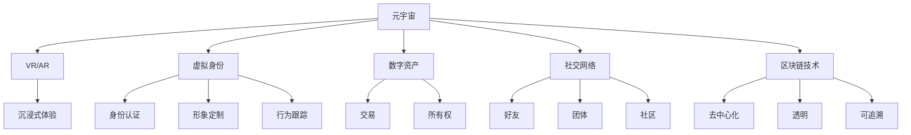

                 

# 元宇宙社交:重塑人际交往的数字平台

## 1. 背景介绍

### 1.1 问题由来
随着科技的迅猛发展，人类逐渐迈入数字化时代，社交方式正在悄然发生着深刻变化。传统的面对面交流受到物理距离的限制，而虚拟空间提供的沉浸式互动体验，则突破了这一限制。特别是在新冠疫情的推动下，人们对于数字社交的接受度进一步提高，虚拟世界中的互动变得更加普遍。

在这一背景下，元宇宙社交应运而生，成为连接虚拟与现实、线上与线下的全新社交形态。它不仅打破了传统社交的种种限制，还通过虚拟现实、增强现实等技术手段，为人类提供了一个全新的交互空间。

### 1.2 问题核心关键点
元宇宙社交的核心关键点在于其如何通过数字技术实现沉浸式、交互式的社交体验，如何构建虚拟身份与现实身份的映射，以及如何在保护用户隐私和数据安全的同时，实现开放、互联的社交网络。

以下将从技术、应用、伦理、治理等多个角度，全面探讨元宇宙社交的构建与运行机制。

## 2. 核心概念与联系

### 2.1 核心概念概述

为更好地理解元宇宙社交的构建与运行机制，本节将介绍几个关键概念：

- **元宇宙**：由虚拟与现实、线上与线下相结合的空间构成的数字世界，提供沉浸式体验，包含丰富的互动、娱乐、社交等功能。
- **虚拟现实(VR)与增强现实(AR)**：通过虚拟现实头盔或增强现实眼镜，为使用者提供沉浸式、交互式体验，模拟真实世界的感官信息。
- **虚拟身份**：用户在元宇宙中的数字化身，具备身份认证、形象定制、行为跟踪等功能。
- **数字资产**：用户在元宇宙中拥有的虚拟物品、土地、代币等，具备所有权、交易性。
- **社交网络**：元宇宙中用户之间的互动关系，包括好友、团体、社区等。
- **区块链技术**：用于记录元宇宙中的交易、资产、行为等，提供去中心化、透明、可追溯的社交生态。

这些核心概念之间的逻辑关系可以通过以下Mermaid流程图来展示：



这个流程图展示了大语言模型的核心概念及其之间的关系：

1. 元宇宙通过VR/AR技术，提供沉浸式体验。
2. 用户通过虚拟身份，与元宇宙互动。
3. 数字资产代表了用户在元宇宙中的拥有物。
4. 社交网络建立用户间的互动关系。
5. 区块链技术保证元宇宙的透明、可追溯。

这些概念共同构成了元宇宙社交的基础架构，为构建开放、互联、安全的社交平台提供了技术支撑。

## 3. 核心算法原理 & 具体操作步骤
### 3.1 算法原理概述

元宇宙社交的构建涉及多个技术领域，包括虚拟现实、增强现实、分布式计算、区块链等。以下将介绍这些技术的核心算法原理，以及元宇宙社交的基本操作步骤。

### 3.2 算法步骤详解

**Step 1: 环境构建**
- 选择适合的VR/AR硬件设备，如Oculus Rift、HTC Vive等，为元宇宙体验提供硬件基础。
- 搭建虚拟现实场景，包括虚拟环境和虚拟身份的创建。

**Step 2: 身份与资产管理**
- 设计虚拟身份系统，为用户提供角色创建、身份验证、行为记录等功能。
- 实现数字资产管理系统，允许用户在元宇宙中拥有、交易虚拟物品。

**Step 3: 社交网络构建**
- 设计社交网络结构，包括好友关系、群组、论坛等功能模块。
- 引入区块链技术，确保用户身份和资产的透明、不可篡改。

**Step 4: 应用集成**
- 集成虚拟现实应用，如游戏、教育、商务等，丰富元宇宙社交体验。
- 引入NLP技术，实现自然语言处理，提升互动体验。

**Step 5: 部署与维护**
- 部署元宇宙社交平台，并进行优化和维护。
- 收集用户反馈，不断迭代改进平台功能。

### 3.3 算法优缺点

元宇宙社交的构建涉及多种技术，以下是其主要优缺点：

#### 优点：
1. **沉浸式体验**：通过VR/AR技术，为用户提供身临其境的体验，打破物理限制。
2. **交互式互动**：支持多人在线互动，实现实时沟通、协作、娱乐等功能。
3. **开放性**：基于区块链技术，保证元宇宙生态的开放、透明、可追溯。
4. **多元化应用**：集成多种应用，丰富用户体验，提升平台吸引力。
5. **个性化定制**：提供虚拟身份、数字资产的个性化定制，满足用户需求。

#### 缺点：
1. **技术门槛高**：构建元宇宙需要多种复杂技术支持，技术门槛较高。
2. **硬件设备限制**：目前VR/AR设备的普及率较低，用户体验受限。
3. **隐私与数据安全**：虚拟身份和数字资产的隐私保护及数据安全面临挑战。
4. **技术标准化**：不同厂商的产品和技术标准不统一，用户体验不一致。
5. **可持续性**：元宇宙生态的长期可持续性仍需探索，存在未知风险。

### 3.4 算法应用领域

元宇宙社交技术可以应用于多个领域，如游戏、教育、商务、娱乐等，具体包括：

- **游戏社交**：用户在虚拟游戏中进行互动、竞技、合作，提升游戏体验。
- **远程教育**：虚拟教室、虚拟实验室等，提供沉浸式学习体验。
- **商务会议**：虚拟会议室、虚拟展览等，支持远程协作与展示。
- **社交娱乐**：虚拟演唱会、虚拟社交、虚拟旅游等，丰富娱乐体验。
- **数字艺术**：虚拟博物馆、数字艺术品等，提供沉浸式欣赏和互动。

以上仅是元宇宙社交的部分应用领域，未来随着技术的不断演进，元宇宙社交将拓展到更多场景，带来全新的体验和价值。

## 4. 数学模型和公式 & 详细讲解 & 举例说明
### 4.1 数学模型构建

本节将通过数学语言对元宇宙社交的基本框架进行刻画。

设元宇宙社交平台为 $S$，用户数量为 $U$，社交网络为 $G=(V,E)$，其中 $V$ 为节点集合，$E$ 为边集合。用户的虚拟身份为 $I$，数字资产为 $A$，社交关系为 $R$。

### 4.2 公式推导过程

以社交网络的构建为例，设社交网络为图结构 $G=(V,E)$，用户 $u \in V$，其好友关系为 $f_u \subseteq V$，好友数目为 $d_u$。

社交网络的目标是通过用户 $u$ 及其好友 $f_u$ 的关系，构建一个平衡的社交生态。

**公式1: 好友关系定义**：

$$
f_u = \{v \in V | (u,v) \in E\}
$$

**公式2: 好友数目定义**：

$$
d_u = |f_u|
$$

**公式3: 社交平衡条件**：

$$
\sum_{u \in V} \frac{1}{d_u} = \frac{|V|}{2}
$$

上式表明，社交网络中每个用户的平均好友数目应该为社交网络规模的一半。

### 4.3 案例分析与讲解

**案例1: 社交网络构建**
- 通过公式1和公式2，可以定义每个用户的好友关系和好友数目。
- 使用公式3，可以保证社交网络中用户好友数目的均衡，防止出现过度集中或孤立的现象。

**案例2: 数字资产管理**
- 数字资产管理系统 $A$ 记录每个用户在元宇宙中的虚拟物品、土地、代币等。
- 使用区块链技术，保证数字资产的透明、不可篡改。

**案例3: 虚拟身份认证**
- 虚拟身份系统 $I$ 记录用户的虚拟身份信息，包括头像、个性、行为记录等。
- 使用密码学技术，保护用户隐私和数据安全。

通过以上案例，可以看到元宇宙社交技术在不同领域的应用，以及相关的数学模型和公式。

## 5. 项目实践：代码实例和详细解释说明
### 5.1 开发环境搭建

在进行元宇宙社交项目实践前，需要准备好开发环境。以下是使用Python进行开发的环境配置流程：

1. 安装Anaconda：从官网下载并安装Anaconda，用于创建独立的Python环境。

2. 创建并激活虚拟环境：
```bash
conda create -n metaverse-env python=3.8 
conda activate metaverse-env
```

3. 安装必要的Python库，如PyTorch、TensorFlow、Flask等：
```bash
pip install torch tensorflow flask numpy scikit-learn
```

4. 安装Unity或Unreal Engine等游戏引擎：
- Unity：使用Unity Hub进行安装。
- Unreal Engine：使用Unreal Engine官网下载和安装。

完成上述步骤后，即可在`metaverse-env`环境中开始元宇宙社交项目的开发。

### 5.2 源代码详细实现

以下是使用Python和Unity引擎实现元宇宙社交的代码实现：

```python
import numpy as np
from flask import Flask, request, jsonify

app = Flask(__name__)

# 虚拟身份系统
class VirtualIdentity:
    def __init__(self, name, avatar):
        self.name = name
        self.avatar = avatar
        self.actions = []

    def add_action(self, action):
        self.actions.append(action)

    def get_info(self):
        return {"name": self.name, "avatar": self.avatar, "actions": self.actions}

# 数字资产系统
class DigitalAsset:
    def __init__(self, type, owner):
        self.type = type
        self.owner = owner
        self.price = 0

    def set_price(self, price):
        self.price = price

    def get_info(self):
        return {"type": self.type, "owner": self.owner, "price": self.price}

# 社交网络系统
class SocialNetwork:
    def __init__(self):
        self.nodes = {}
        self.edges = {}

    def add_node(self, node):
        self.nodes[node.id] = node

    def add_edge(self, u, v):
        self.edges[(u, v)] = 1
        self.edges[(v, u)] = 1

    def get_friends(self, u):
        return [v for v in self.nodes if (u, v) in self.edges]

# 元宇宙社交平台
class Metaverse:
    def __init__(self):
        self.identities = []
        self.assets = []
        self.network = SocialNetwork()

    def add_identity(self, identity):
        self.identities.append(identity)
        self.network.add_node(identity)

    def add_asset(self, asset):
        self.assets.append(asset)
        self.network.add_node(asset)

    def add_edge(self, u, v):
        self.network.add_edge(u, v)

# 创建虚拟身份
def create_identity(name, avatar):
    identity = VirtualIdentity(name, avatar)
    return identity

# 创建数字资产
def create_asset(type, owner):
    asset = DigitalAsset(type, owner)
    return asset

# 展示虚拟身份信息
def show_identity_info(identity):
    return identity.get_info()

# 展示数字资产信息
def show_asset_info(asset):
    return asset.get_info()

# 创建元宇宙社交平台
def create_metaverse():
    metaverse = Metaverse()
    return metaverse

# 运行服务
if __name__ == "__main__":
    metaverse = create_metaverse()
    metaverse.add_identity(create_identity("Alice", "https://example.com/avatar1.png"))
    metaverse.add_identity(create_identity("Bob", "https://example.com/avatar2.png"))
    metaverse.add_asset(create_asset("土地", "Alice"))
    metaverse.add_asset(create_asset("艺术品", "Bob"))
    metaverse.add_edge("Alice", "Bob")

    # 展示虚拟身份信息
    identity1 = metaverse.identities[0]
    identity2 = metaverse.identities[1]
    print("Alice的虚拟身份信息：", show_identity_info(identity1))
    print("Bob的虚拟身份信息：", show_identity_info(identity2))

    # 展示数字资产信息
    asset1 = metaverse.assets[0]
    asset2 = metaverse.assets[1]
    print("Alice的数字资产信息：", show_asset_info(asset1))
    print("Bob的数字资产信息：", show_asset_info(asset2))

    # 展示社交关系
    friends = metaverse.network.get_friends("Alice")
    print("Alice的好友：", [f.name for f in friends])
```

### 5.3 代码解读与分析

**VirtualIdentity类**：
- 定义了虚拟身份的基本属性，包括名称、头像、行为记录等。
- 提供了添加行为记录和展示信息的方法。

**DigitalAsset类**：
- 定义了数字资产的基本属性，包括类型、拥有者、价格等。
- 提供了设置价格和展示信息的方法。

**SocialNetwork类**：
- 定义了社交网络的基本结构，包括节点和边。
- 提供了添加节点、添加边和展示好友关系的方法。

**Metaverse类**：
- 定义了元宇宙社交平台的基本结构，包括虚拟身份、数字资产、社交网络等。
- 提供了添加身份、添加资产、添加边和展示信息的方法。

通过以上代码，可以看到元宇宙社交平台的基本构建过程。开发者可以根据具体需求，不断扩展和优化平台功能。

## 6. 实际应用场景
### 6.1 虚拟游戏社交
元宇宙社交在虚拟游戏中的应用，已经展现出巨大的潜力。玩家可以通过虚拟身份，在虚拟世界中与其他玩家互动、竞技、合作，获得更丰富的游戏体验。

例如，在《堡垒之夜》中，玩家可以在游戏中创建虚拟角色，与其他玩家进行多人对战。游戏内的社交网络系统记录玩家的游戏行为，并根据行为生成好友关系。玩家还可以在游戏中交易虚拟物品，构建个性化的虚拟资产。

### 6.2 远程教育
元宇宙社交在远程教育中的应用，为传统教育注入了新的活力。通过虚拟教室、虚拟实验室等，学生和教师可以进行实时互动，提升教学效果。

例如，在《Meshlab》中，学生可以通过虚拟教室，与教师和其他同学进行互动。教师可以在虚拟教室中展示实验设备，让学生进行远程实验操作。学生还可以通过虚拟实验室，进行自主实验，并与教师和同学交流实验结果。

### 6.3 虚拟商务
元宇宙社交在虚拟商务中的应用，为远程办公和商业活动提供了新的解决方案。通过虚拟会议室、虚拟展览等，企业可以高效进行远程协作和展示。

例如，在《Slack》中，企业可以在虚拟会议室中进行视频会议、协作讨论等。企业还可以通过虚拟展览，展示产品和服务，吸引潜在客户。虚拟社交网络系统还可以记录商务互动信息，提供智能推荐和客户管理。

### 6.4 未来应用展望
随着技术的不断演进，元宇宙社交将拓展到更多场景，带来全新的体验和价值。

- **虚拟旅游**：用户可以在虚拟旅游平台中，进行虚拟旅游、体验景点。虚拟旅游平台可以提供丰富的虚拟环境、景点介绍、互动体验等。
- **虚拟购物**：用户可以在虚拟购物平台中，进行虚拟购物、体验商品。虚拟购物平台可以提供虚拟试穿、虚拟展览等功能。
- **虚拟医疗**：用户可以在虚拟医疗平台中，进行虚拟诊疗、体验健康服务。虚拟医疗平台可以提供虚拟体检、虚拟诊疗等功能。

未来，随着技术的进一步成熟，元宇宙社交将为人类带来更多全新的体验和价值，改变人们的生活方式和社会结构。

## 7. 工具和资源推荐
### 7.1 学习资源推荐

为帮助开发者系统掌握元宇宙社交技术，以下推荐一些优质的学习资源：

1. **《元宇宙社交与虚拟现实》书籍**：全面介绍元宇宙社交技术，涵盖VR/AR、区块链、分布式计算等核心技术。

2. **Unity官方文档**：Unity引擎的官方文档，提供详细的VR/AR开发指南和示例。

3. **Unreal Engine官方文档**：Unreal Engine引擎的官方文档，提供详细的AR/VR开发指南和示例。

4. **Flask官方文档**：Flask框架的官方文档，提供详细的Web开发指南和示例。

5. **NLP技术书籍**：如《深度学习与自然语言处理》，涵盖自然语言处理的基本原理和应用。

6. **区块链技术书籍**：如《区块链技术入门》，涵盖区块链的基本概念和应用。

通过学习这些资源，相信开发者可以系统掌握元宇宙社交技术，实现高效、优质的元宇宙社交应用。

### 7.2 开发工具推荐

高效开发元宇宙社交应用，离不开优秀的工具支持。以下是几款常用工具：

1. **Unity引擎**：由Unity Technologies开发，支持VR/AR开发，提供丰富的编辑器、脚本、资产库等。

2. **Unreal Engine引擎**：由Epic Games开发，支持AR/VR开发，提供强大的图形渲染和物理引擎。

3. **Flask框架**：基于Python的Web框架，适合开发元宇宙社交平台的后端服务。

4. **TensorFlow**：由Google开发的深度学习框架，支持NLP、机器学习等。

5. **Fluentd**：开源日志收集工具，适合监控元宇宙社交平台的运行状态。

6. **Grafana**：开源数据可视化工具，适合展示元宇宙社交平台的各类指标。

合理利用这些工具，可以显著提升元宇宙社交应用的开发效率，加快创新迭代的步伐。

### 7.3 相关论文推荐

元宇宙社交技术的发展源于学界的持续研究。以下是几篇奠基性的相关论文，推荐阅读：

1. **《元宇宙社交系统设计与实现》**：提出元宇宙社交系统的架构设计，详细描述了虚拟身份、数字资产、社交网络等核心组件。

2. **《虚拟现实与社会交互》**：探讨虚拟现实技术对社交行为的影响，提出基于VR/AR的社交互动模型。

3. **《区块链技术在元宇宙中的应用》**：详细介绍了区块链技术在元宇宙中的应用场景，包括身份认证、资产管理等。

4. **《NLP技术在元宇宙社交中的应用》**：讨论自然语言处理技术在元宇宙社交中的应用，提升用户互动体验。

5. **《元宇宙社交系统的安全性与隐私保护》**：提出元宇宙社交系统的安全策略和隐私保护方案，保障用户数据安全。

这些论文代表了大语言模型微调技术的发展脉络，通过学习这些前沿成果，可以帮助研究者把握学科前进方向，激发更多的创新灵感。

## 8. 总结：未来发展趋势与挑战
### 8.1 总结

本文对元宇宙社交技术的构建与运行机制进行了全面系统的介绍。首先阐述了元宇宙社交的现实背景和意义，明确了其如何通过数字技术实现沉浸式、交互式的社交体验，以及如何构建虚拟身份与现实身份的映射，并介绍了虚拟身份、数字资产、社交网络等核心概念。其次，从技术、应用、伦理、治理等多个角度，详细讲解了元宇宙社交的构建与运行机制。最后，展望了元宇宙社交的未来发展趋势，并指出了其面临的挑战。

通过本文的系统梳理，可以看到，元宇宙社交技术正在成为连接虚拟与现实、线上与线下的全新社交形态，为人类提供了一个全新的交互空间。未来，随着技术的不断演进，元宇宙社交将拓展到更多场景，带来全新的体验和价值。

### 8.2 未来发展趋势

展望未来，元宇宙社交技术将呈现以下几个发展趋势：

1. **技术标准化**：随着技术的成熟，元宇宙社交平台将逐步实现标准化，不同平台之间的互操作性将进一步提升。

2. **元宇宙生态化**：元宇宙社交平台将逐步构建完整的生态系统，包括虚拟身份、数字资产、社交网络等核心组件，形成完整的闭环系统。

3. **多模态互动**：元宇宙社交将进一步融合视觉、听觉、触觉等多模态互动，提供更加丰富、真实的体验。

4. **个性化定制**：元宇宙社交平台将提供更加个性化、定制化的服务，满足用户的个性化需求。

5. **去中心化治理**：元宇宙社交平台将逐步实现去中心化治理，用户将拥有更多的自治权利，平台将更加开放、透明。

6. **全球化拓展**：元宇宙社交平台将逐步拓展到全球范围，连接不同地区、不同文化背景的用户，提升全球互联互通水平。

### 8.3 面临的挑战

尽管元宇宙社交技术已经取得了瞩目成就，但在迈向更加智能化、普适化应用的过程中，仍面临诸多挑战：

1. **技术复杂性**：元宇宙社交平台涉及多种复杂技术，包括VR/AR、区块链、分布式计算等，开发和维护难度较高。

2. **用户体验**：虚拟现实设备的普及率较低，用户的使用体验和接受度仍需提升。

3. **隐私与数据安全**：虚拟身份和数字资产的隐私保护及数据安全面临挑战，需要加强技术保障和政策监管。

4. **伦理与法律**：元宇宙社交平台面临伦理和法律问题，如虚拟财产权、虚拟身份认证等。

5. **生态系统**：元宇宙社交平台的生态系统仍需完善，需要更多的开发者、用户和合作伙伴共同建设。

6. **经济模型**：元宇宙社交平台需要构建合理的经济模型，激励开发者和用户，保持生态的可持续性。

### 8.4 研究展望

面对元宇宙社交面临的挑战，未来的研究需要在以下几个方面寻求新的突破：

1. **技术融合**：将多种技术进行融合，提升元宇宙社交平台的整体性能和用户体验。

2. **用户友好性**：开发更加易用、易懂的元宇宙社交平台，降低用户使用门槛。

3. **隐私保护**：加强用户隐私保护技术，提升数据安全保障水平。

4. **伦理合规**：建立元宇宙社交平台的伦理和法律框架，确保平台行为的合规性。

5. **经济激励**：设计合理的经济模型，激励开发者和用户参与平台建设。

6. **生态建设**：构建完整的元宇宙社交生态系统，实现开放、互联、共享。

这些研究方向将推动元宇宙社交技术的不断进步，为构建人机协同的智能时代提供新的技术路径。相信通过学界和产业界的共同努力，元宇宙社交技术必将在未来展现更加广阔的应用前景，改变人们的生活方式和社会结构。

## 9. 附录：常见问题与解答
### 9.1 元宇宙社交与虚拟现实的区别

**Q1: 元宇宙社交与虚拟现实的区别是什么？**

A: 虚拟现实主要指通过虚拟现实头盔或增强现实眼镜，为使用者提供沉浸式体验，模拟真实世界的感官信息。元宇宙社交则是在虚拟现实的基础上，通过构建虚拟身份、数字资产、社交网络等核心组件，提供沉浸式、交互式的社交体验，构建开放的社交生态。

### 9.2 元宇宙社交的应用场景

**Q2: 元宇宙社交可以应用于哪些场景？**

A: 元宇宙社交可以应用于虚拟游戏、远程教育、虚拟商务、虚拟旅游、虚拟购物、虚拟医疗等多个场景，为人类提供更加丰富、真实的社交体验。

### 9.3 元宇宙社交的潜在风险

**Q3: 元宇宙社交有哪些潜在风险？**

A: 元宇宙社交面临技术复杂性、用户体验、隐私与数据安全、伦理与法律、生态系统、经济模型等多方面的挑战，需要从多个维度进行综合优化。

### 9.4 元宇宙社交的技术发展方向

**Q4: 元宇宙社交的未来技术发展方向是什么？**

A: 元宇宙社交的未来发展方向包括技术标准化、元宇宙生态化、多模态互动、个性化定制、去中心化治理、全球化拓展等。同时，还需要解决技术复杂性、用户体验、隐私与数据安全、伦理与法律、生态系统、经济模型等挑战。

### 9.5 元宇宙社交的伦理和法律问题

**Q5: 元宇宙社交面临哪些伦理和法律问题？**

A: 元宇宙社交面临虚拟财产权、虚拟身份认证等伦理和法律问题，需要建立相应的法律法规和伦理框架，确保平台行为的合规性和用户权益的保护。

---

作者：禅与计算机程序设计艺术 / Zen and the Art of Computer Programming

