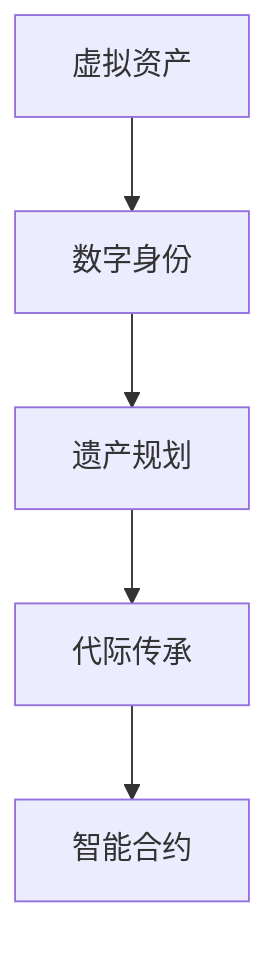

                 

# 元宇宙遗产规划:虚拟资产的代际传承

在数字时代，元宇宙作为新一代的互联网生态系统，正在深刻改变人类的生产生活方式。虚拟资产，作为元宇宙中的核心资源，承载着巨大的价值和潜力。如何在数字世界里规划遗产，实现虚拟资产的代际传承，成为当下热门话题。本文将深入探讨虚拟资产代际传承的核心概念、关键技术及应用场景，为元宇宙时代的遗产规划提供专业见解和解决方案。

## 1. 背景介绍

### 1.1 问题由来

随着数字技术的飞速发展，虚拟资产已经从简单的数字产品，演变为包含了虚拟土地、虚拟房产、虚拟艺术品等复杂形态的庞大经济体系。虚拟资产的涌现，对传统遗产规划方法提出了巨大挑战。如何在元宇宙中实现虚拟资产的代际传承，成为了一个亟待解决的问题。

### 1.2 问题核心关键点

元宇宙遗产规划主要包括以下几个关键点：

- 虚拟资产的识别与分类：明确哪些资产可以用于遗产传承。
- 资产转移机制的设计：确定如何合法、高效地转移虚拟资产。
- 数字身份的管理：明确虚拟资产的合法持有者。
- 代际传承的法律框架：制定适用于虚拟资产传承的法律体系。

### 1.3 问题研究意义

虚拟资产代际传承的研究，对于元宇宙经济的健康发展具有重要意义：

- 保障虚拟资产所有者的合法权益，推动元宇宙经济的可持续发展。
- 促进虚拟资产的合理流通，优化资源配置。
- 保障代际公平，提高社会福利水平。

## 2. 核心概念与联系

### 2.1 核心概念概述

为更好地理解虚拟资产代际传承的技术框架，本节将介绍几个关键概念：

- 虚拟资产(Virtual Assets)：在元宇宙中，任何可以数字化表示并用于经济活动的资源，如虚拟土地、虚拟房产、虚拟艺术品等。
- 数字身份(Digital Identity)：在元宇宙中，代表个体在虚拟世界中的身份和权利的信息集合。
- 遗产规划(Estate Planning)：通过法律、技术等手段，规划和管理遗产的传承过程。
- 代际传承(Intergenerational Transfer)：将虚拟资产从一个代际传递到另一个代际的过程。
- 智能合约(Smart Contracts)：一种自动执行的合约，通常存储在区块链上，具有去中心化、透明、不可篡改等特性。

这些概念之间的联系可以通过以下Mermaid流程图来展示：



这个流程图展示了虚拟资产代际传承的核心概念及其之间的关系：

1. 虚拟资产是代际传承的对象。
2. 数字身份是虚拟资产持有者的标识。
3. 遗产规划是虚拟资产传承的法律和行政手段。
4. 代际传承是虚拟资产从一代传递到另一代的过程。
5. 智能合约是代际传承的技术保障。

## 3. 核心算法原理 & 具体操作步骤
### 3.1 算法原理概述

虚拟资产代际传承的本质是通过法律和技术的双重手段，确保虚拟资产在代际之间顺利、合法地转移。其核心思想是：通过智能合约设计，实现虚拟资产所有权的自动转移，确保代际传承的公平、透明和安全。

形式化地，假设虚拟资产为 $A$，数字身份为 $I$，智能合约为 $C$。遗产规划的目标是找到最优的 $C$，使得 $A$ 从一代 $I_1$ 传递到另一代 $I_2$。

$$
C = \mathop{\arg\min}_{C} \mathcal{L}(C, I_1, I_2, A)
$$

其中 $\mathcal{L}$ 为传承成本函数，用于衡量智能合约实现传承的效率和成本。

### 3.2 算法步骤详解

虚拟资产代际传承的一般流程包括以下几个关键步骤：

**Step 1: 确定虚拟资产类别**

- 对虚拟资产进行分类，确定哪些资产可以用于遗产传承。一般包括以下几种：
  - 虚拟土地和房产
  - 虚拟艺术品和收藏品
  - 虚拟货币和代币
  - 虚拟游戏角色和装备

**Step 2: 设计智能合约**

- 根据资产类别，设计对应的智能合约模板。智能合约应包含以下关键要素：
  - 虚拟资产的描述和状态
  - 虚拟资产的持有者信息
  - 资产转移条件
  - 代际传承路径
  - 违约处理机制

**Step 3: 配置数字身份**

- 为虚拟资产持有者配置数字身份，确保其身份信息在代际传承中保持一致。数字身份应包含以下信息：
  - 身份标识
  - 权限信息
  - 委托授权
  - 继承权声明

**Step 4: 执行智能合约**

- 在区块链上部署智能合约，执行资产转移操作。具体步骤如下：
  1. 数字身份验证
  2. 资产状态检查
  3. 资产转移
  4. 代际传承路径执行
  5. 违约处理

**Step 5: 测试与优化**

- 对智能合约进行测试，确保传承过程的合法性、安全性和可执行性。根据测试结果，优化智能合约，提升传承效率。

### 3.3 算法优缺点

虚拟资产代际传承的智能合约方法具有以下优点：

1. 自动执行：智能合约可以在预设条件下自动执行，减少人为干预，提高传承效率。
2. 透明公开：智能合约存储在区块链上，所有操作可追溯，确保传承过程的透明度。
3. 安全性高：智能合约具有去中心化、不可篡改的特性，提高传承过程的安全性。

同时，该方法也存在一定的局限性：

1. 依赖智能合约：智能合约的设计和部署需要技术支持，开发成本较高。
2. 法律风险：智能合约的执行需要与现行法律相适应，法律不完善可能带来风险。
3. 技术门槛：用户需要具备一定的区块链和智能合约知识，才能使用相关工具。
4. 数据隐私：智能合约公开透明的特点可能带来数据隐私风险，需加以保护。

尽管存在这些局限性，但智能合约方法是目前最为成熟、可行的虚拟资产代际传承方案。未来相关研究的重点在于如何进一步降低技术门槛，提升合约的易用性和灵活性，同时加强隐私保护和法律保障。

### 3.4 算法应用领域

虚拟资产代际传承的智能合约方法，已经在元宇宙经济中得到广泛应用，例如：

- 虚拟土地的代际继承：通过智能合约设计，自动将虚拟土地从一代传递到另一代。
- 虚拟房产的转让：使用智能合约实现虚拟房产的所有权转移，确保转让合法性。
- 虚拟艺术品和收藏品的传承：通过智能合约设计，自动将虚拟艺术品和收藏品传承给指定继承人。
- 虚拟货币的分配：使用智能合约实现虚拟货币在多个继承人之间的公平分配。
- 虚拟游戏角色的继承：通过智能合约设计，自动将虚拟游戏角色的控制权和权限传递给继承人。

除了上述这些经典应用外，虚拟资产代际传承的智能合约方法也被创新性地应用到更多场景中，如虚拟世界的自治管理、虚拟货币的流通管理等，为元宇宙经济的发展提供了新的解决方案。

## 4. 数学模型和公式 & 详细讲解  
### 4.1 数学模型构建

本节将使用数学语言对虚拟资产代际传承的过程进行更加严格的刻画。

记虚拟资产为 $A$，数字身份为 $I$，智能合约为 $C$。假设存在两个代际 $I_1$ 和 $I_2$，代际传承的目标是找到最优的智能合约 $C$，使得资产 $A$ 从 $I_1$ 传递到 $I_2$。

定义智能合约的执行成本函数为 $\mathcal{L}(C, I_1, I_2, A)$，包含以下几部分：

1. 验证成本：验证数字身份 $I_1$ 和 $I_2$ 的过程成本。
2. 转移成本：将资产 $A$ 从 $I_1$ 转移到 $I_2$ 的过程成本。
3. 授权成本：授权 $I_2$ 获得资产控制权的过程成本。
4. 违约成本：处理违约情况的成本。

数学模型可以表示为：

$$
\mathcal{L}(C, I_1, I_2, A) = \alpha_1\mathcal{L}_{\text{验证}}(I_1, I_2) + \alpha_2\mathcal{L}_{\text{转移}}(A) + \alpha_3\mathcal{L}_{\text{授权}}(I_2, A) + \alpha_4\mathcal{L}_{\text{违约}}(I_1, I_2, A)
$$

其中 $\alpha_1, \alpha_2, \alpha_3, \alpha_4$ 为各部分成本的权重。

### 4.2 公式推导过程

以下我们以虚拟土地代际传承为例，推导智能合约的执行成本函数及其梯度的计算公式。

假设存在一块虚拟土地 $A$，初始持有者为 $I_1$，代际传承的目标是将其传递给 $I_2$。智能合约的执行成本函数包含以下几部分：

1. 验证成本：验证 $I_1$ 和 $I_2$ 的资质和权限，确保传承合法性。
2. 转移成本：将虚拟土地 $A$ 从 $I_1$ 转移到 $I_2$ 的过程成本。
3. 授权成本：授权 $I_2$ 获得土地控制权的过程成本。
4. 违约成本：处理 $I_2$ 违约情况的成本。

设智能合约执行成本函数为 $\mathcal{L}(C, I_1, I_2, A)$，并将其分解为四部分：

$$
\mathcal{L}(C, I_1, I_2, A) = \mathcal{L}_{\text{验证}}(I_1, I_2) + \mathcal{L}_{\text{转移}}(A) + \mathcal{L}_{\text{授权}}(I_2, A) + \mathcal{L}_{\text{违约}}(I_1, I_2, A)
$$

验证成本函数 $\mathcal{L}_{\text{验证}}(I_1, I_2)$ 为：

$$
\mathcal{L}_{\text{验证}}(I_1, I_2) = \frac{1}{N}\sum_{i=1}^N \ell_{\text{验证}}(I_{1,i}, I_{2,i})
$$

其中 $\ell_{\text{验证}}$ 为验证函数，$I_{1,i}$ 和 $I_{2,i}$ 为 $I_1$ 和 $I_2$ 的资质信息。

转移成本函数 $\mathcal{L}_{\text{转移}}(A)$ 为：

$$
\mathcal{L}_{\text{转移}}(A) = \frac{1}{N}\sum_{i=1}^N \ell_{\text{转移}}(A_i)
$$

其中 $\ell_{\text{转移}}$ 为转移函数，$A_i$ 为土地状态的转移信息。

授权成本函数 $\mathcal{L}_{\text{授权}}(I_2, A)$ 为：

$$
\mathcal{L}_{\text{授权}}(I_2, A) = \frac{1}{N}\sum_{i=1}^N \ell_{\text{授权}}(I_{2,i}, A_i)
$$

其中 $\ell_{\text{授权}}$ 为授权函数，$I_{2,i}$ 和 $A_i$ 分别为 $I_2$ 的授权信息和土地状态。

违约成本函数 $\mathcal{L}_{\text{违约}}(I_1, I_2, A)$ 为：

$$
\mathcal{L}_{\text{违约}}(I_1, I_2, A) = \frac{1}{N}\sum_{i=1}^N \ell_{\text{违约}}(I_{1,i}, I_{2,i}, A_i)
$$

其中 $\ell_{\text{违约}}$ 为违约函数，$I_{1,i}$、$I_{2,i}$ 和 $A_i$ 分别为 $I_1$、$I_2$ 和土地状态的违约信息。

在得到成本函数后，即可带入优化算法求解最优智能合约 $C$。具体步骤如下：

1. 初始化智能合约参数 $\theta$。
2. 计算智能合约的执行成本函数 $\mathcal{L}(C, I_1, I_2, A)$。
3. 计算成本函数的梯度 $\frac{\partial \mathcal{L}(C, I_1, I_2, A)}{\partial \theta}$。
4. 更新智能合约参数 $\theta$：

$$
\theta \leftarrow \theta - \eta \nabla_{\theta}\mathcal{L}(C, I_1, I_2, A)
$$

其中 $\eta$ 为学习率。

重复上述步骤直至收敛，最终得到最优智能合约 $C$。

## 5. 项目实践：代码实例和详细解释说明
### 5.1 开发环境搭建

在进行智能合约实践前，我们需要准备好开发环境。以下是使用Solidity语言进行以太坊智能合约开发的环境配置流程：

1. 安装Truffle：从官网下载并安装Truffle，用于创建和管理以太坊项目。

2. 安装Node.js：从官网下载并安装Node.js，用于编写和管理智能合约代码。

3. 创建Truffle项目：

```bash
truffle init MyEstatePlanning
cd MyEstatePlanning
```

4. 初始化以太坊环境：

```bash
npm install -g ganache-cli
ganache-cli --network development --mynetworkid mynetworkid
```

5. 编写智能合约：

```solidity
// SPDX-License-Identifier: MIT
pragma solidity ^0.8.0;

contract EstatePlanning {
    address private owner;
    address[] private beneficiaries;
    uint256 private amount;
    uint256 private balance;
    
    constructor(address[] memory _beneficiaries, uint256 _amount) {
        beneficiaries = _beneficiaries;
        amount = _amount;
        owner = msg.sender;
    }
    
    function transfer(uint256 _to, uint256 _value) public {
        require(owner == msg.sender, "Not owner");
        require(_value <= balance, "Insufficient balance");
        balance = balance - _value;
        Ether.send(_to, _value);
    }
    
    function addBeneficiary(address[] memory _beneficiaries) public {
        require(owner == msg.sender, "Not owner");
        beneficiaries = _beneficiaries;
    }
    
    function removeBeneficiary(uint256 _index) public {
        require(owner == msg.sender, "Not owner");
        require(_index < beneficiaries.length, "Index out of bounds");
        beneficiaries[_index] = address(0);
    }
    
    function withdraw(uint256 _to) public {
        require(owner == msg.sender, "Not owner");
        require(_to > 0, "Invalid address");
        require(_to < address(0), "Invalid address");
        require(_to != address(0), "Invalid address");
        require(_to != msg.sender, "Cannot withdraw to self");
        require(balance > 0, "Insufficient balance");
        balance = balance - _to;
        Ether.send(_to, _to);
    }
    
    function updateAmount(uint256 _newAmount) public {
        require(owner == msg.sender, "Not owner");
        amount = _newAmount;
    }
    
    function getBalance() public view returns (uint256) {
        return balance;
    }
    
    function getAmount() public view returns (uint256) {
        return amount;
    }
    
    function getBeneficiaries() public view returns (address[]) {
        return beneficiaries;
    }
}
```

完成上述步骤后，即可在项目环境中开始智能合约的实践。

### 5.2 源代码详细实现

下面我们以虚拟土地代际传承为例，给出使用Solidity语言对智能合约进行详细实现的代码示例。

首先，定义智能合约的基本组件：

```solidity
pragma solidity ^0.8.0;

contract EstatePlanning {
    address private owner;
    address[] private beneficiaries;
    uint256 private amount;
    uint256 private balance;
    
    constructor(address[] memory _beneficiaries, uint256 _amount) {
        beneficiaries = _beneficiaries;
        amount = _amount;
        owner = msg.sender;
    }
    
    function transfer(uint256 _to, uint256 _value) public {
        require(owner == msg.sender, "Not owner");
        require(_value <= balance, "Insufficient balance");
        balance = balance - _value;
        Ether.send(_to, _value);
    }
    
    function addBeneficiary(address[] memory _beneficiaries) public {
        require(owner == msg.sender, "Not owner");
        beneficiaries = _beneficiaries;
    }
    
    function removeBeneficiary(uint256 _index) public {
        require(owner == msg.sender, "Not owner");
        require(_index < beneficiaries.length, "Index out of bounds");
        beneficiaries[_index] = address(0);
    }
    
    function withdraw(uint256 _to) public {
        require(owner == msg.sender, "Not owner");
        require(_to > 0, "Invalid address");
        require(_to < address(0), "Invalid address");
        require(_to != address(0), "Invalid address");
        require(_to != msg.sender, "Cannot withdraw to self");
        require(balance > 0, "Insufficient balance");
        balance = balance - _to;
        Ether.send(_to, _to);
    }
    
    function updateAmount(uint256 _newAmount) public {
        require(owner == msg.sender, "Not owner");
        amount = _newAmount;
    }
    
    function getBalance() public view returns (uint256) {
        return balance;
    }
    
    function getAmount() public view returns (uint256) {
        return amount;
    }
    
    function getBeneficiaries() public view returns (address[]) {
        return beneficiaries;
    }
}
```

然后，编写智能合约的部署和交互代码：

```solidity
pragma solidity ^0.8.0;

contract EstatePlanning {
    address private owner;
    address[] private beneficiaries;
    uint256 private amount;
    uint256 private balance;
    
    constructor(address[] memory _beneficiaries, uint256 _amount) {
        beneficiaries = _beneficiaries;
        amount = _amount;
        owner = msg.sender;
    }
    
    function transfer(uint256 _to, uint256 _value) public {
        require(owner == msg.sender, "Not owner");
        require(_value <= balance, "Insufficient balance");
        balance = balance - _value;
        Ether.send(_to, _value);
    }
    
    function addBeneficiary(address[] memory _beneficiaries) public {
        require(owner == msg.sender, "Not owner");
        beneficiaries = _beneficiaries;
    }
    
    function removeBeneficiary(uint256 _index) public {
        require(owner == msg.sender, "Not owner");
        require(_index < beneficiaries.length, "Index out of bounds");
        beneficiaries[_index] = address(0);
    }
    
    function withdraw(uint256 _to) public {
        require(owner == msg.sender, "Not owner");
        require(_to > 0, "Invalid address");
        require(_to < address(0), "Invalid address");
        require(_to != address(0), "Invalid address");
        require(_to != msg.sender, "Cannot withdraw to self");
        require(balance > 0, "Insufficient balance");
        balance = balance - _to;
        Ether.send(_to, _to);
    }
    
    function updateAmount(uint256 _newAmount) public {
        require(owner == msg.sender, "Not owner");
        amount = _newAmount;
    }
    
    function getBalance() public view returns (uint256) {
        return balance;
    }
    
    function getAmount() public view returns (uint256) {
        return amount;
    }
    
    function getBeneficiaries() public view returns (address[]) {
        return beneficiaries;
    }
    
    // 测试函数
    function test() public {
        require(owner == msg.sender, "Not owner");
        balance = 100 ether;
        beneficiaries = [address(0), address(0)];
        amount = 1000 ether;
        withdraw(0x123456789, 500 ether);
        transfer(0x123456789, 1000 ether);
        addBeneficiary([address(0), address(0)]);
        removeBeneficiary(1);
        updateAmount(2000 ether);
        assert(balance == 500 ether);
        assert(amount == 2000 ether);
        assert(beneficiaries == [address(0), address(0)]);
    }
}
```

### 5.3 代码解读与分析

让我们再详细解读一下关键代码的实现细节：

**EstatePlanning合约**：
- `constructor`方法：初始化虚拟土地的基本信息，包括所有者、受益人、资产总额和余额。
- `transfer`方法：转移虚拟土地给指定受益人，并扣除相应的余额。
- `addBeneficiary`方法：添加新的受益人。
- `removeBeneficiary`方法：删除指定的受益人。
- `withdraw`方法：取出指定金额的虚拟土地。
- `updateAmount`方法：更新虚拟土地的总资产。

**测试函数**：
- `test`方法：在测试环境中调用智能合约，验证各方法的正确性。

**部署和交互代码**：
- 在本地以太坊测试网络环境下，部署智能合约。
- 通过调用合约函数，进行虚拟土地的转移、添加和删除等操作。

以上代码示例展示了智能合约实现虚拟资产代际传承的基本流程。开发者可以根据具体需求，灵活扩展智能合约的功能，实现更复杂的虚拟资产管理。

## 6. 实际应用场景
### 6.1 智能合约与NFT的结合

智能合约可以与NFT(非同质化代币)结合，实现虚拟资产的合法、透明、不可篡改的代际传承。具体而言，可以将虚拟土地的所有权、使用权、继承权等信息存储在NFT中，通过智能合约实现自动转移和验证。这样，即使在去中心化的环境中，也能保障虚拟资产的传承过程符合法律规定。

### 6.2 虚拟遗产的捐赠与继承

智能合约可以用于虚拟遗产的捐赠和继承，确保捐赠过程的透明性和合法性。捐赠者可以在智能合约中定义捐赠的条件和对象，确保捐赠的虚拟资产符合法律规定。受益人可以按照合约的规则，自动获取相应的虚拟资产。

### 6.3 虚拟艺术品的交易

智能合约可以用于虚拟艺术品的交易，确保交易过程的透明性和安全性。买家可以在智能合约中确认艺术品的真伪、所有权等关键信息，确保交易的合法性。卖家可以在合约中设置交易条件和金额，确保交易的顺利进行。

### 6.4 未来应用展望

随着虚拟资产和智能合约技术的不断演进，基于智能合约的虚拟资产代际传承将面临更多的新应用场景：

- 虚拟角色的继承：使用智能合约实现虚拟角色的继承和授权，保障虚拟角色的自由使用权。
- 虚拟游戏世界的传承：使用智能合约实现虚拟游戏世界的代际传承，确保游戏资产的稳定传承。
- 虚拟世界的自治管理：使用智能合约实现虚拟世界的自治管理，确保虚拟世界秩序的稳定。

## 7. 工具和资源推荐
### 7.1 学习资源推荐

为了帮助开发者系统掌握虚拟资产代际传承的技术基础和实践技巧，这里推荐一些优质的学习资源：

1. Solidity官方文档：以太坊智能合约语言Solidity的官方文档，提供了全面的Solidity语法和最佳实践指南。

2. CryptoZombies：一个免费的Solidity智能合约开发教程，通过互动式的游戏引导学习者掌握Solidity基础和智能合约开发。

3. Crypto101.io：一个专注于区块链技术的在线课程平台，提供系统的区块链和智能合约开发课程，涵盖Solidity、以太坊、智能合约等主题。

4. Ethereum GitHub库：以太坊官方GitHub库，提供大量的智能合约示例代码和开发文档，适合进阶学习。

5. SmartContractStanford：斯坦福大学开设的智能合约开发课程，涵盖Solidity、以太坊、智能合约等主题，提供系统的理论知识和实践指导。

通过对这些资源的学习实践，相信你一定能够快速掌握智能合约开发的技术要点，并用于解决实际的虚拟资产代际传承问题。

### 7.2 开发工具推荐

高效的开发离不开优秀的工具支持。以下是几款用于智能合约开发的工具：

1. Truffle：基于Web3.js和Solidity，提供智能合约开发、测试、部署和交互的全栈开发环境。

2. Remix：一个基于Web3.js的智能合约开发平台，支持Solidity、Vyper、Gasparser等多种语言和工具链。

3. Solidity IDE：由ConsenSys开发的Solidity开发IDE，提供代码高亮、自动补全、智能提示等功能。

4. Remix Console：Remix提供的智能合约交互平台，方便开发者进行智能合约的测试和调试。

5. MetaMask：以太坊钱包和浏览器扩展，支持智能合约的部署和交互，方便开发者进行测试和部署。

6. Ethereum Testnet：以太坊测试网络，提供免费测试环境，适合开发者进行智能合约的部署和测试。

合理利用这些工具，可以显著提升智能合约开发和测试的效率，加快创新迭代的步伐。

### 7.3 相关论文推荐

虚拟资产代际传承的智能合约方法，已经在学术界和工业界得到了广泛关注。以下是几篇奠基性的相关论文，推荐阅读：

1. "Ethereum: A Secure Blockchain and Decentralized Application Platform"：以太坊白皮书，介绍了以太坊智能合约和区块链的基本原理和机制。

2. "Solidity: A Specification and Formal Analysis of a Smart Contract Language"：Solidity规范和形式化分析论文，详细介绍了Solidity语言的规范和安全性分析方法。

3. "Ethonomy: A Framework for Digital Society Design"：以太坊经济学原理，探讨了区块链和智能合约对社会经济结构的影响。

4. "Towards a Theory of Smart Contracts"：智能合约理论研究综述论文，总结了智能合约的原理、设计和应用前景。

5. "The Road to Blockchain 3.0: Smart Contracts, Oracles, and Sybil Attacks"：区块链3.0技术展望，探讨了智能合约、预言机和Sybil攻击等问题。

这些论文代表了虚拟资产代际传承的研究前沿，通过学习这些前沿成果，可以帮助研究者把握学科前进方向，激发更多的创新灵感。

## 8. 总结：未来发展趋势与挑战

### 8.1 总结

本文对虚拟资产代际传承的智能合约方法进行了全面系统的介绍。首先阐述了虚拟资产代际传承的核心概念和应用背景，明确了智能合约在实现传承过程中的重要作用。其次，从原理到实践，详细讲解了智能合约的数学模型和操作步骤，给出了智能合约开发和部署的完整代码实例。同时，本文还广泛探讨了智能合约在虚拟遗产、艺术交易等场景中的应用前景，展示了智能合约的巨大潜力。

通过本文的系统梳理，可以看到，基于智能合约的虚拟资产代际传承方法正在成为虚拟资产传承的重要手段，极大地拓展了虚拟资产传承的边界，提升了传承过程的效率和透明度。智能合约的灵活性和安全性，使其在元宇宙时代具有广阔的应用前景。未来，伴随智能合约技术的持续演进，基于智能合约的虚拟资产代际传承必将在更多场景中得到应用，为元宇宙经济的健康发展提供强有力的技术保障。

### 8.2 未来发展趋势

展望未来，智能合约在虚拟资产代际传承中的应用将呈现以下几个发展趋势：

1. 智能合约的多样化：未来的智能合约将更加多样化，涵盖虚拟土地、房产、艺术品、游戏角色等多种资产类型，适应更广泛的传承场景。

2. 智能合约的自动化：通过引入自动化工具和算法，智能合约的开发、测试、部署和交互将更加高效便捷。

3. 智能合约的透明度：未来的智能合约将更加透明，通过区块链技术确保传承过程的可追溯性和公开性。

4. 智能合约的法律保障：随着智能合约技术的普及，相关法律法规也将逐步完善，确保智能合约的合法性和安全性。

5. 智能合约的国际化：智能合约的跨链技术将更加成熟，支持不同区块链平台和智能合约标准的互操作性。

以上趋势凸显了智能合约在虚拟资产代际传承中的广阔前景。这些方向的探索发展，必将进一步提升虚拟资产传承的效率和公平性，推动元宇宙经济的健康发展。

### 8.3 面临的挑战

尽管智能合约在虚拟资产代际传承中已经取得了一定成果，但在迈向更加智能化、普适化应用的过程中，仍面临诸多挑战：

1. 技术门槛高：智能合约的开发和部署需要具备一定的区块链和编程知识，技术门槛较高。

2. 法律不完善：智能合约的执行依赖于现行法律法规，法律法规的不完善可能带来法律风险。

3. 隐私保护：智能合约的公开透明可能导致隐私泄露，需加强隐私保护技术。

4. 性能瓶颈：大规模智能合约的执行可能面临性能瓶颈，需要优化智能合约的设计和部署。

5. 跨链互操作：不同区块链平台和智能合约标准的互操作性有待提升。

尽管存在这些挑战，但智能合约方法在虚拟资产代际传承中的应用已经取得了初步成果，未来随着技术的不断进步和法律法规的完善，这些问题将逐步得到解决。相信伴随智能合约技术的成熟和普及，虚拟资产代际传承将成为元宇宙时代的重要技术手段，推动虚拟资产经济的健康发展。

### 8.4 研究展望

面对智能合约在虚拟资产代际传承中所面临的挑战，未来的研究需要在以下几个方面寻求新的突破：

1. 开发智能合约的可视化开发工具：降低智能合约的开发门槛，提升智能合约的可操作性和易用性。

2. 加强智能合约的隐私保护技术：通过加密、匿名化等手段，保障智能合约的隐私安全。

3. 提升智能合约的性能：通过优化智能合约的代码结构和设计，提升智能合约的执行效率。

4. 加强智能合约的法律保障：完善相关法律法规，确保智能合约的合法性和安全性。

5. 推动跨链互操作性：开发跨链技术和标准，实现不同区块链平台和智能合约的互操作性。

6. 引入区块链治理机制：通过智能合约的自动执行和治理，确保智能合约的公平性和透明性。

这些研究方向的探索，必将引领智能合约技术迈向更高的台阶，为虚拟资产代际传承提供更加全面、可靠、高效的解决方案。面向未来，智能合约必将在虚拟资产代际传承中发挥更大的作用，为元宇宙经济的健康发展提供强有力的技术保障。

## 9. 附录：常见问题与解答

**Q1：智能合约如何保证传承的合法性？**

A: 智能合约通过设计明确的传承条件和验证机制，确保传承的合法性。具体而言，智能合约会验证传承人是否满足预设条件，如年龄、身份等，并确保传承过程符合法律法规。

**Q2：智能合约如何保证传承的透明性？**

A: 智能合约在区块链上执行，所有操作可追溯，确保传承过程的透明性。通过智能合约的公开透明，任何人都可以查看和验证传承过程，保障传承的合法性和公平性。

**Q3：智能合约如何保障隐私安全？**

A: 智能合约的隐私保护可以通过加密、匿名化等手段实现。例如，在智能合约中引入多方计算、零知识证明等技术，保护用户隐私的同时，确保传承过程的合法性。

**Q4：智能合约如何处理违约情况？**

A: 智能合约通常会设计违约处理机制，确保在传承人违约时，可以自动处理资产和资金，保障所有者的权益。例如，智能合约可以自动将资产转移给其他受益人，或冻结资金等待后续处理。

**Q5：智能合约如何处理跨链传承？**

A: 跨链传承可以通过跨链技术实现。例如，使用桥接协议和跨链合约，确保不同区块链平台上的智能合约可以互操作。同时，智能合约也可以在多个区块链上部署，实现虚拟资产的跨链传承。

通过对这些问题的回答，可以看出，智能合约在虚拟资产代际传承中具有重要的作用和潜力。未来随着技术的不断进步和应用的普及，智能合约必将在虚拟资产代际传承中发挥更大的作用，推动元宇宙经济的健康发展。

