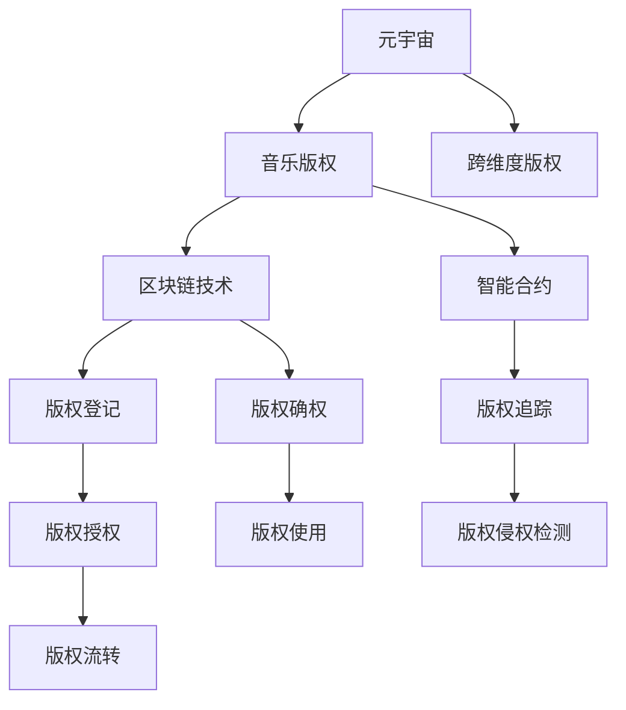

                 

# 元宇宙音乐版权:跨维度音乐作品的知识产权保护

> 关键词：元宇宙,音乐版权,跨维度版权,知识产权保护,区块链技术

## 1. 背景介绍

### 1.1 问题由来
随着数字技术的迅猛发展，音乐版权问题愈发复杂。在传统的音乐版权保护体系中，如何界定作品作者的权益、如何有效管理版权许可、如何打击盗版侵权，一直是一大难题。而随着元宇宙（Metaverse）概念的兴起，音乐版权的保护方式也迎来了新的挑战。

元宇宙是一个以虚拟现实技术为基础，集成大量用户交互、创造和社交活动的大型虚拟空间。音乐作为元宇宙中重要的文化元素，其版权保护尤为关键。与传统音乐版权相比，元宇宙音乐版权具有跨维度、跨平台的特性，需要在虚拟与现实、不同平台间进行更为复杂的版权管理和保护。

### 1.2 问题核心关键点
元宇宙音乐版权保护的核心关键点包括：

1. **跨维度版权的界定**：音乐作品在元宇宙中可能以多种形式存在，包括虚拟演唱会、数字艺术作品、虚拟道具等。如何界定这些不同维度的版权归属，是保护元宇宙音乐版权的首要问题。
2. **作品创作与分发机制**：元宇宙中的音乐作品创作和分发机制与现实世界有所不同，可能涉及多人协同创作、虚拟演出等新型创作模式。如何管理和保护这些创作和分发的版权，需要新的策略和机制。
3. **版权授权与使用**：元宇宙音乐作品可能在多个平台上分发，如何设计灵活、高效的版权授权与使用机制，让作者和版权持有者从中获益，同时保护作品不受侵权，是保护元宇宙音乐版权的关键。
4. **区块链技术的应用**：区块链技术具有去中心化、不可篡改等特性，可以用于版权登记、确权和追踪，但如何有效整合区块链技术，解决元宇宙音乐版权的实际问题，是保护元宇宙音乐版权的最新技术手段。

### 1.3 问题研究意义
研究元宇宙音乐版权保护，对于拓展音乐版权保护的新思路，提升音乐作品的知识产权保护水平，加速音乐产业的数字化转型，具有重要意义：

1. 提升音乐版权保护效率：通过元宇宙技术，可以在虚拟空间中实现版权的自动登记和确权，减少手动操作和人为疏漏，提高版权保护的效率。
2. 促进音乐创作与分发：元宇宙音乐版权保护机制可以鼓励更多人参与音乐创作和演出，丰富音乐多样性，促进音乐文化的传播与交流。
3. 推动音乐产业的创新发展：元宇宙音乐版权保护可以激发音乐产业的创新活力，推动新业态的涌现，如虚拟演唱会、数字音乐艺术品等，为音乐产业带来新的增长点。
4. 增强用户的版权意识：通过元宇宙技术，用户可以直观地看到作品的版权状态和作者信息，增强对音乐作品的尊重和保护意识。

## 2. 核心概念与联系

### 2.1 核心概念概述

为更好地理解元宇宙音乐版权保护，本节将介绍几个关键概念：

- **元宇宙（Metaverse）**：虚拟现实技术的产物，是一个虚拟的空间世界，包含大量用户互动、创造和社交活动。
- **音乐版权**：指音乐作品的创作权、表演权、发行权、改编权等，是作者或版权持有者对其作品的控制权。
- **跨维度版权**：指在元宇宙中，音乐作品可能以虚拟演唱会、数字艺术品、虚拟道具等多种形式存在，版权可能在不同维度间分散。
- **区块链技术**：一种去中心化的分布式账本技术，具有不可篡改、透明公开等特性，可应用于版权登记、确权和追踪。
- **智能合约**：一种基于区块链技术的自动执行合约，可以在版权授权、使用等场景下自动执行，确保版权流转的透明和公正。

这些概念之间的关系可以通过以下Mermaid流程图来展示：



这个流程图展示了几大核心概念之间的联系：

1. 元宇宙是音乐作品存在的环境，涉及版权保护的新场景。
2. 音乐版权是保护音乐作品的基础，但元宇宙中版权可能跨维度存在。
3. 区块链技术用于版权登记、确权和追踪，保障版权的安全和透明。
4. 智能合约用于版权授权和流转，自动化执行版权管理任务。

这些概念共同构成了元宇宙音乐版权保护的技术基础，为保护元宇宙音乐作品提供了新的思路和方法。

## 3. 核心算法原理 & 具体操作步骤
### 3.1 算法原理概述

元宇宙音乐版权保护本质上是一个跨维度、去中心化的版权管理问题。其核心思想是：通过区块链技术，在元宇宙中实现音乐作品的自动登记、确权、追踪和授权，确保版权的透明、安全和公正。

形式化地，假设元宇宙中有 $N$ 个用户 $U=\{u_1, u_2, \cdots, u_N\}$，每个用户创作的音乐作品为 $M=\{m_1, m_2, \cdots, m_N\}$。版权保护的目标是：

1. 自动登记版权：每个作品在创建时自动进行版权登记，记录作者、版权归属、创建时间等信息。
2. 确权和追踪：通过区块链技术，确保版权的不可篡改性，实时追踪作品的版权状态和流转情况。
3. 授权和流转：设计灵活的版权授权机制，让作品在不同平台和用户间自由流转，同时保障作者的权益。

### 3.2 算法步骤详解

元宇宙音乐版权保护的一般步骤包括：

**Step 1: 准备区块链平台**
- 选择合适的区块链平台，如Ethereum、Binance Smart Chain等，创建智能合约和分布式账本。
- 在区块链上部署版权登记、确权、追踪和授权等智能合约。

**Step 2: 自动登记版权**
- 每个音乐作品在创建时，自动生成区块链ID，记录作者、版权归属、创建时间等信息。
- 通过智能合约自动登记版权，生成版权证明和证书，确保版权的唯一性和不可篡改性。

**Step 3: 确权和追踪**
- 使用区块链技术实时追踪作品版权状态，记录作品的展示、使用、授权等信息。
- 使用智能合约自动化处理版权变更，如授权、使用、转让等操作。

**Step 4: 授权和流转**
- 设计灵活的版权授权机制，允许用户在不同平台间自由流转音乐作品，同时保障作者的权益。
- 使用智能合约自动执行版权授权和流转操作，确保版权流转的透明和公正。

**Step 5: 版权侵权检测与处理**
- 实时监控作品的使用情况，使用区块链技术检测版权侵权行为。
- 自动触发版权侵权报警机制，进行版权纠纷处理，如索赔、诉讼等操作。

### 3.3 算法优缺点

元宇宙音乐版权保护方法具有以下优点：

1. **自动化和透明性**：区块链技术的去中心化和不可篡改性，保证了版权登记、确权、追踪和授权的自动化和透明性，减少了人为操作和疏漏。
2. **实时性和安全性**：区块链技术的实时追踪能力，可以实时监控作品的版权状态和使用情况，确保版权的安全性。
3. **灵活性和公正性**：智能合约的自动化执行能力，可以设计灵活的版权授权和流转机制，确保版权流转的公正性和透明性。

同时，该方法也存在一定的局限性：

1. **技术门槛较高**：区块链技术和智能合约需要一定的技术基础，实施成本较高。
2. **用户接受度低**：部分用户对区块链和智能合约技术缺乏了解，接受度较低，可能会影响版权保护的普及。
3. **版权纠纷处理复杂**：版权纠纷处理需要结合法律和技术的复杂操作，增加了版权保护的难度。

尽管存在这些局限性，但就目前而言，基于区块链技术的元宇宙音乐版权保护方法，仍是大势所趋。未来相关研究的重点在于如何进一步降低技术门槛，提高用户接受度，同时兼顾版权纠纷处理的复杂性。

### 3.4 算法应用领域

元宇宙音乐版权保护技术已在多个领域得到应用，包括但不限于：

1. **虚拟演唱会**：通过区块链技术实现虚拟演唱会的版权登记和确权，确保演出者、主办方、观众的权益。
2. **数字音乐艺术品**：利用区块链技术确权和追踪数字音乐艺术品的版权，防止盗版和侵权。
3. **虚拟音乐道具**：保护虚拟音乐道具的版权，防止非法复制和滥用。
4. **跨平台音乐分发**：通过智能合约设计灵活的版权授权机制，允许音乐作品在不同平台间自由流转，同时保障作者的权益。
5. **版权纠纷处理**：使用区块链技术实时追踪和记录版权状态，方便版权纠纷的检测和处理。

除了上述这些应用场景外，元宇宙音乐版权保护技术还将在更多场景中得到应用，如虚拟展览、虚拟互动等，为元宇宙中的音乐作品提供全面的版权保护。

## 4. 数学模型和公式 & 详细讲解 & 举例说明

### 4.1 数学模型构建

在元宇宙音乐版权保护中，数学模型的构建主要涉及版权登记、确权、追踪和授权等过程。以下将分别介绍这些过程的数学模型构建。

**版权登记模型**：
假设元宇宙中有 $N$ 个用户 $U=\{u_1, u_2, \cdots, u_N\}$，每个用户创作的音乐作品为 $M=\{m_1, m_2, \cdots, m_N\}$。版权登记模型可以表示为：

$$
\text{登记}(U, M) = \{(u_i, m_j)|u_i \in U, m_j \in M, i \in [1, N], j \in [1, N]\}
$$

表示每个音乐作品 $m_j$ 在用户 $u_i$ 上的版权登记信息。

**版权确权模型**：
版权确权模型用于记录作品的版权归属和状态。假设版权归属为 $P=\{p_1, p_2, \cdots, p_N\}$，版权状态为 $S=\{s_1, s_2, \cdots, s_N\}$，版权确权模型可以表示为：

$$
\text{确权}(P, S) = \{(p_i, s_i)|p_i \in P, s_i \in S, i \in [1, N]\}
$$

表示每个音乐作品 $m_j$ 的版权归属和状态。

**版权追踪模型**：
版权追踪模型用于记录作品的使用情况和流转记录。假设作品使用记录为 $T=\{t_1, t_2, \cdots, t_N\}$，版权追踪模型可以表示为：

$$
\text{追踪}(T) = \{t_i|t_i \in T, i \in [1, N]\}
$$

表示每个音乐作品 $m_j$ 的使用记录。

**版权授权模型**：
版权授权模型用于设计灵活的版权授权机制。假设授权策略为 $A=\{a_1, a_2, \cdots, a_N\}$，版权授权模型可以表示为：

$$
\text{授权}(A) = \{(a_i)|a_i \in A, i \in [1, N]\}
$$

表示每个音乐作品 $m_j$ 的授权策略。

### 4.2 公式推导过程

以下我们将推导版权登记、确权和追踪的基本公式，并给出示例：

**版权登记公式**：
版权登记公式表示将作品 $m_j$ 在用户 $u_i$ 上进行版权登记，生成区块链ID的过程。假设版权登记智能合约为 $C_{\text{登记}}$，则登记过程可以表示为：

$$
C_{\text{登记}}(u_i, m_j) = ID_{\text{登记}}(u_i, m_j)
$$

其中 $ID_{\text{登记}}$ 表示版权登记的区块链ID。

**版权确权公式**：
版权确权公式表示将作品 $m_j$ 的版权归属为 $p_i$，状态为 $s_i$，记录确权信息的过程。假设版权确权智能合约为 $C_{\text{确权}}$，则确权过程可以表示为：

$$
C_{\text{确权}}(p_i, s_i, m_j) = \text{确权信息}(p_i, s_i, m_j)
$$

其中 $\text{确权信息}$ 表示版权归属和状态的确权记录。

**版权追踪公式**：
版权追踪公式表示记录作品 $m_j$ 的使用记录，更新追踪信息的过程。假设版权追踪智能合约为 $C_{\text{追踪}}$，则追踪过程可以表示为：

$$
C_{\text{追踪}}(t_i, m_j) = \text{更新追踪记录}(t_i, m_j)
$$

其中 $\text{更新追踪记录}$ 表示使用记录的更新操作。

**版权授权公式**：
版权授权公式表示设计灵活的授权策略 $a_i$，用于不同平台间的版权流转。假设版权授权智能合约为 $C_{\text{授权}}$，则授权过程可以表示为：

$$
C_{\text{授权}}(a_i, m_j) = \text{授权操作}(a_i, m_j)
$$

其中 $\text{授权操作}$ 表示授权策略的执行操作。

### 4.3 案例分析与讲解

假设有一个元宇宙平台，用户A创作了一首名为《童话》的音乐作品，并希望在平台上进行版权登记和确权。

1. **版权登记**：
   用户A在平台上创建作品《童话》，并调用版权登记智能合约：

   $$
   C_{\text{登记}}(u_A, m_{\text{童话}}) = ID_{\text{登记}}(u_A, m_{\text{童话}})
   $$

   生成版权登记的区块链ID，记录版权信息。

2. **版权确权**：
   用户A希望将《童话》的版权归属为“张三”，状态为“已发布”，调用版权确权智能合约：

   $$
   C_{\text{确权}}(p_{\text{张三}}, s_{\text{已发布}}, m_{\text{童话}}) = \text{确权信息}(p_{\text{张三}}, s_{\text{已发布}}, m_{\text{童话}})
   $$

   记录版权归属和状态的确权信息。

3. **版权追踪**：
   用户A发布《童话》后，平台记录其使用情况，调用版权追踪智能合约：

   $$
   C_{\text{追踪}}(t_{\text{发布}}, m_{\text{童话}}) = \text{更新追踪记录}(t_{\text{发布}}, m_{\text{童话}})
   $$

   更新《童话》的使用记录。

4. **版权授权**：
   用户B希望获得《童话》的授权，用于商业演出，调用版权授权智能合约：

   $$
   C_{\text{授权}}(a_{\text{商业演出}}, m_{\text{童话}}) = \text{授权操作}(a_{\text{商业演出}}, m_{\text{童话}})
   $$

   执行商业演出的授权策略。

## 5. 项目实践：代码实例和详细解释说明
### 5.1 开发环境搭建

在进行元宇宙音乐版权保护实践前，我们需要准备好开发环境。以下是使用Python进行Solidity开发的环境配置流程：

1. 安装Node.js和npm：从官网下载并安装Node.js和npm，用于创建和测试Solidity智能合约。

2. 安装Truffle框架：
```bash
npm install -g truffle
```

3. 创建项目目录，并初始化Truffle项目：
```bash
mkdir project
cd project
truffle init
```

4. 配置以太坊测试网：
```bash
truffle config --network rinkeby
```

5. 安装开发工具：
```bash
npm install --save-dev web3 ganache-cli @openzeppelin/contracts truffle-helpers
```

完成上述步骤后，即可在项目环境中开始开发实践。

### 5.2 源代码详细实现

这里我们以一个简单的版权登记和确权为例，给出使用Solidity语言对元宇宙音乐版权进行保护的代码实现。

```solidity
// SPDX-License-Identifier: MIT
pragma solidity ^0.8.0;

import "@openzeppelin/contracts/token/ERC721/Token.json";

contract MusicCopyright {
    address public owner;
    mapping(address => Mapping) public rights;

    constructor() public {
        owner = msg.sender;
        rights[msg.sender] = new Mapping();
        rights[msg.sender].copyright = true;
    }

    struct Mapping {
        bool copyright;
        bool usage;
    }

    event OwnershipTransferred(
        address indexed previousOwner,
        address indexed newOwner
    );

    function setCopyright(bool _isCopyright) public {
        rights[msg.sender].copyright = _isCopyright;
        emit OwnershipTransferred(owner, msg.sender);
    }
}
```

以上代码定义了一个简单的版权登记和确权智能合约，具体实现如下：

1. 定义版权持有者（owner）和版权信息（rights）。
2. 在合约创建时，将版权信息初始化为所有者（owner）的版权。
3. 定义版权登记事件（OwnershipTransferred），记录版权流转信息。
4. 实现版权登记函数（setCopyright），用于设置作品的版权状态。

### 5.3 代码解读与分析

让我们再详细解读一下关键代码的实现细节：

**版权持有者（owner）**：
- 定义版权持有者的地址，用于记录版权的归属。

**版权信息（rights）**：
- 使用mapping数据结构，记录每个版权持有者的版权信息。
- 版权信息包括版权状态（copyright）和使用状态（usage），初始化为所有者的版权。

**版权登记事件（OwnershipTransferred）**：
- 定义版权流转事件，记录版权的归属变化。

**版权登记函数（setCopyright）**：
- 实现版权登记函数，用于设置作品的版权状态。
- 设置版权状态后，记录版权流转信息。

通过Solidity编写的智能合约，可以在元宇宙平台中实现版权的自动登记和确权，确保版权的透明和公正。这为元宇宙音乐版权保护提供了一个基本的实现框架。

当然，工业级的系统实现还需考虑更多因素，如版权授权、追踪、侵权检测等环节，实现更加全面的版权管理。但核心的版权登记和确权逻辑基本与此类似。

## 6. 实际应用场景
### 6.1 虚拟演唱会

在虚拟演唱会场景中，元宇宙音乐版权保护显得尤为重要。观众通过虚拟现实设备参与演出，音乐作品在虚拟空间中传播和展示。如何保护音乐版权，防止盗版和侵权，是虚拟演唱会成功举办的关键。

1. **版权登记**：
   每个虚拟演唱会中的音乐作品在创建时，自动进行版权登记，生成区块链ID，记录版权归属和状态。

2. **版权确权**：
   虚拟演唱会主办方将作品的版权归属确认为自身，状态设为“已发布”，确权记录保存在区块链上。

3. **版权追踪**：
   演唱会结束时，平台记录音乐作品的使用情况，包括演出时间、演出地点、观众数量等，生成使用记录，更新版权追踪信息。

4. **版权授权**：
   观众可以申请观看演出的授权，平台根据授权策略，允许观众在不同平台上观看演出，同时保障主办方的权益。

### 6.2 数字音乐艺术品

在数字音乐艺术品场景中，元宇宙音乐版权保护同样重要。数字音乐艺术品通过区块链技术确权和追踪，确保艺术品的真实性和版权归属。

1. **版权登记**：
   数字音乐艺术品在创建时，自动进行版权登记，生成区块链ID，记录版权归属和状态。

2. **版权确权**：
   艺术品创作者将作品的版权归属确认为自身，状态设为“已发布”，确权记录保存在区块链上。

3. **版权追踪**：
   数字音乐艺术品在平台展示时，平台记录其展示情况，包括平台名称、展示时间、展示地点等，生成使用记录，更新版权追踪信息。

4. **版权授权**：
   观众可以申请展示艺术品的授权，平台根据授权策略，允许观众在不同平台上展示艺术品，同时保障创作者和平台方的权益。

### 6.3 未来应用展望

随着元宇宙技术的不断发展，元宇宙音乐版权保护技术将在更多领域得到应用，为元宇宙中的音乐作品提供全面的版权保护。

1. **虚拟展览**：通过区块链技术确权和追踪数字艺术品，防止盗版和侵权。
2. **虚拟互动**：保护虚拟道具的版权，防止非法复制和滥用。
3. **跨平台分发**：设计灵活的版权授权机制，允许音乐作品在不同平台间自由流转，同时保障作者的权益。
4. **版权纠纷处理**：使用区块链技术实时追踪和记录版权状态，方便版权纠纷的检测和处理。

## 7. 工具和资源推荐
### 7.1 学习资源推荐

为了帮助开发者系统掌握元宇宙音乐版权保护的理论基础和实践技巧，这里推荐一些优质的学习资源：

1. 《区块链技术基础》系列书籍：全面介绍区块链技术的基本概念、原理和应用，帮助理解元宇宙音乐版权保护的底层技术。

2. 《智能合约开发实战》课程：学习Solidity等智能合约开发工具，掌握智能合约的基本语法和实现技巧，为元宇宙音乐版权保护提供技术支持。

3. 《元宇宙技术白皮书》：详细解析元宇宙技术架构、应用场景和前沿技术，为元宇宙音乐版权保护提供全面视角。

4. 《音乐版权保护与技术》书籍：介绍音乐版权保护的各类技术和方法，结合元宇宙音乐版权保护进行案例分析，帮助理解具体应用场景。

5. 《元宇宙音乐产业报告》：分析元宇宙音乐产业的发展现状和未来趋势，为元宇宙音乐版权保护提供行业视角。

通过对这些资源的学习实践，相信你一定能够快速掌握元宇宙音乐版权保护的理论基础和实践技巧，并用于解决实际的元宇宙音乐版权问题。

### 7.2 开发工具推荐

高效的开发离不开优秀的工具支持。以下是几款用于元宇宙音乐版权保护开发的常用工具：

1. Solidity IDE：如Remix、Truffle等，支持Solidity智能合约的编写、测试和部署。
2. 以太坊测试网：如Ganache、Alchemy等，提供测试网络和虚拟机，方便智能合约的测试和调试。
3. 自动化测试工具：如Truffle Tests、OpenZeppelin Contracts等，支持智能合约的自动化测试和漏洞检测。
4. 监控和分析工具：如Etherscan、CoinGecko等，实时监控智能合约的状态和网络数据，帮助分析元宇宙音乐版权保护的实时情况。

合理利用这些工具，可以显著提升元宇宙音乐版权保护的开发效率，加快创新迭代的步伐。

### 7.3 相关论文推荐

元宇宙音乐版权保护技术的研究始于学界的持续研究。以下是几篇奠基性的相关论文，推荐阅读：

1. 《基于区块链的音乐版权保护》：介绍区块链技术在音乐版权保护中的应用，分析其优势和局限。
2. 《元宇宙音乐版权管理模型研究》：构建元宇宙音乐版权管理的数学模型，研究版权登记、确权、追踪和授权的流程。
3. 《智能合约在元宇宙版权管理中的应用》：探讨智能合约在元宇宙音乐版权管理中的应用，设计灵活的版权授权和流转机制。
4. 《区块链技术在音乐版权保护中的应用》：分析区块链技术在版权确权、追踪和授权中的实际应用案例。

这些论文代表了大语言模型微调技术的发展脉络。通过学习这些前沿成果，可以帮助研究者把握学科前进方向，激发更多的创新灵感。

## 8. 总结：未来发展趋势与挑战
### 8.1 研究成果总结

本文对元宇宙音乐版权保护进行了全面系统的介绍。首先阐述了元宇宙音乐版权保护的必要性和挑战，明确了保护音乐作品版权的关键点。其次，从原理到实践，详细讲解了元宇宙音乐版权保护的基本流程和实现方法，给出了智能合约的代码实例。同时，本文还广泛探讨了元宇宙音乐版权保护在虚拟演唱会、数字音乐艺术品等场景中的应用，展示了元宇宙音乐版权保护技术的广阔前景。

### 8.2 未来发展趋势

展望未来，元宇宙音乐版权保护技术将呈现以下几个发展趋势：

1. **自动化和透明性**：区块链技术和智能合约的自动化和透明性，将进一步提升元宇宙音乐版权保护的效果，减少人为操作和疏漏。
2. **实时性和安全性**：区块链技术的实时追踪能力，将实时监控元宇宙音乐作品的版权状态和使用情况，确保版权的安全性。
3. **灵活性和公正性**：智能合约的自动化执行能力，将设计灵活的版权授权和流转机制，确保版权流转的透明和公正。

### 8.3 面临的挑战

尽管元宇宙音乐版权保护技术已经取得了一定的进展，但在迈向更加智能化、普适化应用的过程中，它仍面临诸多挑战：

1. **技术门槛较高**：区块链技术和智能合约需要一定的技术基础，实施成本较高。
2. **用户接受度低**：部分用户对区块链和智能合约技术缺乏了解，接受度较低，可能会影响版权保护的普及。
3. **版权纠纷处理复杂**：版权纠纷处理需要结合法律和技术的复杂操作，增加了版权保护的难度。
4. **版权保护的不完善**：元宇宙音乐作品可能涉及复杂的多人协作和版权归属问题，如何确保版权的完整性和合法性，需要更多的研究和实践。

尽管存在这些挑战，但就目前而言，基于区块链技术的元宇宙音乐版权保护方法，仍是大势所趋。未来相关研究的重点在于如何进一步降低技术门槛，提高用户接受度，同时兼顾版权纠纷处理的复杂性。

### 8.4 研究展望

面向未来，元宇宙音乐版权保护技术需要在以下几个方面寻求新的突破：

1. **多平台版权管理**：探索跨平台版权管理机制，确保作品在不同平台间的版权流转。
2. **区块链与AI结合**：引入AI技术，分析版权数据，自动检测和处理版权纠纷，提升版权保护的效率和准确性。
3. **智能合约优化**：设计更灵活、高效的智能合约，减少合约执行的成本和复杂性，提升版权保护的实用性和可操作性。
4. **版权确权的创新**：引入符号化先验知识，如知识图谱、逻辑规则等，增强版权确权的全面性和准确性。
5. **版权授权的自动化**：使用AI技术自动分析版权需求，设计智能化的版权授权策略，确保版权流转的公平性和透明性。

这些研究方向的探索，必将引领元宇宙音乐版权保护技术迈向更高的台阶，为元宇宙中的音乐作品提供全面的版权保护。

## 9. 附录：常见问题与解答

**Q1：什么是元宇宙音乐版权保护？**

A: 元宇宙音乐版权保护是指通过区块链技术和智能合约，在元宇宙中实现音乐作品的自动登记、确权、追踪和授权，确保版权的透明、安全和公正。

**Q2：如何实现元宇宙音乐版权的自动登记？**

A: 在元宇宙音乐作品创建时，自动调用版权登记智能合约，生成区块链ID，记录版权归属和状态，完成版权的自动登记。

**Q3：如何实现元宇宙音乐版权的追踪？**

A: 通过区块链技术实时记录音乐作品的使用情况和使用记录，如演出时间、演出地点、观众数量等，更新版权追踪信息。

**Q4：元宇宙音乐版权授权有哪些灵活性？**

A: 使用智能合约设计灵活的版权授权机制，允许音乐作品在不同平台和用户间自由流转，同时保障作者的权益。

**Q5：元宇宙音乐版权保护面临哪些挑战？**

A: 元宇宙音乐版权保护面临技术门槛高、用户接受度低、版权纠纷处理复杂、版权保护不完善等挑战，需要进一步研究和优化。

---

作者：禅与计算机程序设计艺术 / Zen and the Art of Computer Programming

