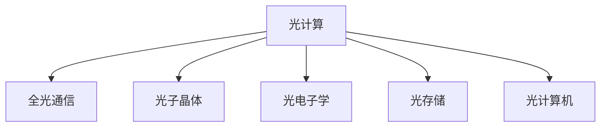

                 

# 光计算技术：突破电子计算的速度限制

## 1. 背景介绍

### 1.1 问题由来

随着人工智能(AI)和深度学习(Deep Learning)技术的迅猛发展，大数据和高性能计算已成为当前科技创新的核心驱动力。然而，尽管CPU和GPU等传统电子计算设备取得了显著进步，但它们依然存在一些固有的性能瓶颈：

- **电子热损耗**：电子器件在高速运行时会产生大量热量，导致功耗和散热问题。
- **电子信号传输速率**：电子信号在导线中的传输速率有限，制约了计算速度的提升。
- **电子信息处理能力**：电子器件在逻辑门、晶体管等结构上存在物理限制，难以在单位时间内处理更多信息。

为了突破这些瓶颈，科学家们开始探索新型计算技术，以实现更高速度、更低功耗、更强的计算能力。其中，光计算技术因其独特的优势而逐渐成为研究热点。

### 1.2 问题核心关键点

光计算技术通过利用光子而不是电子来进行信息处理，有望解决上述传统计算中的关键问题。它具有以下特点：

- **光速传输**：光子在大气中的传输速度远超电子，能够大幅提升信息传递的速率。
- **低能耗**：光计算使用光子进行信息处理，无需像电子计算那样产生电能，从而大幅降低能耗和散热问题。
- **并行处理能力强**：光子可以同时传递大量信息，实现高效的并行计算。

尽管光计算技术具有诸多优势，但其实现仍面临诸多技术挑战：光子的操控和集成、光子信号的处理、光电子设备的制造等。

## 2. 核心概念与联系

### 2.1 核心概念概述

为了更好地理解光计算技术，本节将介绍几个核心概念：

- **光计算**：利用光子而不是电子进行信息处理的新型计算技术。
- **全光通信**：使用光子进行数据传输，无需通过电子器件进行信号转换。
- **光子晶体**：由周期性排列的微结构组成，用于控制光子的传输和分布。
- **光电子学**：研究光子和电子之间的相互作用的学科，是光计算的基础。
- **光存储**：利用光学介质进行信息存储，实现快速的数据读写。
- **光计算机**：基于光计算技术设计的计算机系统，实现高效的信息处理。

这些核心概念之间的逻辑关系可以通过以下Mermaid流程图来展示：



这个流程图展示了大语言模型的核心概念及其之间的关系：

1. 光计算作为核心，通过利用光子进行信息处理，从根本上提升了计算速度和能效。
2. 全光通信是光计算的基础，通过光子传输实现高速数据交换。
3. 光子晶体和光电子学是实现光计算的关键技术，前者用于控制光子分布，后者研究光子和电子的相互作用。
4. 光存储是光计算的重要组成部分，用于快速存储和读取数据。
5. 光计算机则是光计算技术的具体应用，代表了大语言模型的最终目标。

这些核心概念共同构成了光计算技术的框架，使其能够在各种场景下发挥独特优势。通过理解这些概念，我们可以更好地把握光计算技术的原理和应用前景。

## 3. 核心算法原理 & 具体操作步骤

### 3.1 算法原理概述

光计算的基本原理是通过控制光子的状态和分布，实现信息的编码、存储、传输和处理。以下是光计算的基本步骤：

1. **光子生成**：使用光源（如激光器）产生光子。
2. **光子操控**：通过光学器件（如光子晶体、光纤）对光子进行操控和导向。
3. **光子存储**：使用光学介质（如光存储介质）存储光子信息。
4. **光子处理**：通过光学计算器件（如光学处理器）进行光子信息的逻辑运算和处理。
5. **光子读取**：从光学介质中读取存储的光子信息。

光计算的核心在于如何高效地生成、操控、存储和处理光子信息，以及如何将光计算与电子计算结合，实现综合系统的协同工作。

### 3.2 算法步骤详解

光计算技术涉及多个子领域，包括光学器件设计、光学信息处理、光电子学等。以下将以光子晶体为基础，详细介绍光计算的基本操作步骤：

1. **设计光子晶体**：
    - 根据具体应用需求，设计出适合的光子晶体结构。常用的光子晶体结构有二维光子晶体、三维光子晶体等。
    - 使用计算机仿真软件进行设计和优化，确保光子晶体结构能够高效控制光子的传输和分布。

2. **制备光子晶体**：
    - 采用化学气相沉积(CVD)、光刻技术等方法，将设计好的光子晶体结构刻蚀到光学介质上。
    - 通过精确控制制备过程的参数，确保光子晶体的均匀性和准确性。

3. **生成光子**：
    - 使用激光器等光源，产生单模或多模光子。
    - 通过光纤将光子传输到光子晶体中，实现光子在晶体内部的传播和分布。

4. **操控光子**：
    - 通过光子晶体中的周期性结构，对光子的传播路径、速度和强度进行控制。
    - 利用光子的干涉、衍射等特性，实现复杂的光子逻辑运算和信息处理。

5. **存储光子**：
    - 使用光学介质（如光存储介质），将光子信息存储在介质中。
    - 通过控制光子的写入和读取过程，实现高效的光子信息存储和读取。

6. **读取光子**：
    - 使用传感器等光学器件，从光存储介质中读取存储的光子信息。
    - 通过信号处理技术，将光子信息转换为电子信号，供后续处理和分析使用。

### 3.3 算法优缺点

光计算技术具有以下优点：

1. **高速传输**：光子在空气中传输速率远超电子，可以大大提升数据传输速度。
2. **低能耗**：光计算不需要产生电能，能够降低计算过程中的能耗和热量。
3. **并行处理能力强**：光子可以同时传递大量信息，实现高效并行计算。

然而，光计算技术也存在一些缺点：

1. **光子操控难度高**：光子具有高能量的特性，操控难度大，需要精细的加工和调控。
2. **光子信号处理复杂**：光子的性质与电子不同，需要使用特殊的处理技术，增加了系统复杂性。
3. **光电子器件成本高**：光计算需要高精度的光学器件和先进的光电子技术，成本较高。

尽管存在这些局限性，但光计算技术仍是大数据时代的重要研究热点，具有广阔的应用前景。

### 3.4 算法应用领域

光计算技术在多个领域中具有广泛的应用前景：

1. **数据中心**：通过光计算技术，实现大规模数据的快速传输和处理，提升数据中心的计算效率和能效。
2. **通信网络**：使用光子进行高速通信，构建光子通信网络，提升网络传输速度和带宽。
3. **医疗成像**：利用光子进行生物信息的检测和分析，提升医疗成像设备的分辨率和速度。
4. **遥感技术**：使用光子进行信号采集和处理，提升遥感设备的性能和精度。
5. **科学研究**：光计算技术在物理、化学、生物等领域具有广泛应用，推动科学研究的进步。

## 4. 数学模型和公式 & 详细讲解

### 4.1 数学模型构建

为了更好地理解光计算技术的数学模型，我们将从基本的光子传输和存储模型出发，构建光计算的基本数学框架。

假设光子晶体结构为 $T(x,y,z)$，其中 $x,y,z$ 分别表示空间坐标。设光源在 $x=0$ 处产生光子，传播方向为 $z$ 方向，光子波长为 $\lambda$。光子在光子晶体中的传播方程为：

$$
\frac{\partial^2 A(x,z)}{\partial x^2} + \frac{\partial^2 A(x,z)}{\partial z^2} = -\frac{2\pi \nu}{\lambda^2} n(x,z) A(x,z)
$$

其中 $A(x,z)$ 为光子振幅，$\nu$ 为光子频率，$n(x,z)$ 为光子晶体的折射率。

### 4.2 公式推导过程

根据上述方程，我们可以推导出光子在光子晶体中的传播特性。假设光子晶体的折射率 $n(x,z)$ 为周期性函数，即：

$$
n(x,z) = \begin{cases}
n_1, & \text{if } \frac{x}{\Lambda} + \frac{z}{\Lambda} = k_1 \\
n_2, & \text{if } \frac{x}{\Lambda} + \frac{z}{\Lambda} = k_2 \\
\end{cases}
$$

其中 $\Lambda$ 为周期长度，$k_1,k_2$ 为整数。代入传播方程，得到：

$$
\frac{\partial^2 A(x,z)}{\partial x^2} + \frac{\partial^2 A(x,z)}{\partial z^2} = -\frac{2\pi \nu}{\lambda^2} (n_1 A(x,z) - n_2 A(x,z))
$$

根据上述方程，我们可以计算出光子在不同位置和方向的振幅和相位。光子在光子晶体中的传播特性可以通过傅里叶变换和相位匹配技术进行分析和优化。

### 4.3 案例分析与讲解

以下以光子晶体在光存储中的应用为例，详细讲解光存储的数学模型和实际应用。

假设光存储介质为 $S(x,y,z)$，设光源在 $x=0$ 处产生光子，通过光纤传输到存储介质中。光子介质中的传播方程与上述类似：

$$
\frac{\partial^2 A(x,z)}{\partial x^2} + \frac{\partial^2 A(x,z)}{\partial z^2} = -\frac{2\pi \nu}{\lambda^2} n(x,z) A(x,z)
$$

通过上述方程，可以计算出光子在存储介质中的传播路径和振幅。假设光子在存储介质中传播一定距离 $d$ 后，通过光子探测器读取存储信息。探测器的输出为：

$$
O(x,z) = \int_{0}^{d} A(x,z) dx
$$

通过上述公式，可以实现对光存储介质中存储的光子信息的读取。实际应用中，光存储技术需要结合具体的光学介质和探测器技术，实现高效的光子信息存储和读取。

## 5. 项目实践：代码实例和详细解释说明

### 5.1 开发环境搭建

在进行光计算技术开发前，我们需要准备好开发环境。以下是使用Python和MATLAB进行光计算开发的常见环境配置流程：

1. **Python环境配置**：
    - 安装Anaconda：从官网下载并安装Anaconda，用于创建独立的Python环境。
    - 创建并激活虚拟环境：
      ```bash
      conda create -n pytorch-env python=3.8 
      conda activate pytorch-env
      ```
    - 安装必要的Python库，如Numpy、SciPy、Matplotlib等。
    - 安装PyTorch和TensorFlow，用于深度学习计算。

2. **MATLAB环境配置**：
    - 下载并安装MATLAB，获取所需的工具箱，如信号处理工具箱、控制系统工具箱等。
    - 安装MATLAB的光学工具箱，支持光子晶体设计和计算。

完成上述步骤后，即可在`pytorch-env`环境中开始光计算开发，使用MATLAB进行光子晶体设计和仿真。

### 5.2 源代码详细实现

下面我们以光子晶体设计为例，给出使用MATLAB进行光子晶体设计和仿真的代码实现。

首先，定义光子晶体的结构和参数：

```python
import numpy as np
from scipy.spatial import cKDTree

# 定义光子晶体的结构参数
L = 1.0  # 光子晶体周期长度
a = L / 2.0  # 光子晶体最小单元边长
n1 = 1.0  # 光子晶体折射率1
n2 = 1.5  # 光子晶体折射率2

# 定义光子晶体的结构矩阵
A = np.array([[1.0, 0.0], [0.0, 1.0]])
B = np.array([[np.cos(np.pi / 3), np.sin(np.pi / 3)], 
              [np.sin(np.pi / 3), -np.cos(np.pi / 3)]])
```

然后，使用Python进行光子晶体的设计和计算：

```python
import matplotlib.pyplot as plt
from mpl_toolkits.mplot3d import Axes3D

# 计算光子晶体的周期性结构
# 定义光子晶体结构矩阵
R = np.dot(B, A)

# 计算光子晶体周期性结构点
P = np.array([0.0, 0.0, 0.0])
Ps = np.zeros((3, 12), dtype=np.float32)

# 生成光子晶体的周期性结构点
for i in range(12):
    Ps[:, i] = np.dot(R, P)

# 可视化光子晶体周期性结构点
fig = plt.figure()
ax = fig.add_subplot(111, projection='3d')
ax.scatter(Ps[0], Ps[1], Ps[2], c='r', marker='o')
ax.set_xlabel('X')
ax.set_ylabel('Y')
ax.set_zlabel('Z')
plt.show()
```

使用MATLAB进行光子晶体的设计和仿真：

```matlab
% 定义光子晶体结构参数
a = 1.0; % 光子晶体最小单元边长
n1 = 1.0; % 光子晶体折射率1
n2 = 1.5; % 光子晶体折射率2

% 定义光子晶体结构矩阵
A = [1.0, 0.0; 0.0, 1.0];
B = [cos(pi/3), sin(pi/3); sin(pi/3), -cos(pi/3)];

% 计算光子晶体周期性结构点
Ps = [];
for i = 1:12
    Ps = [Ps, B * A * zeros(3, 1) + i * B * A * ones(3, 1)];
end

% 可视化光子晶体周期性结构点
figure;
scatter3(Ps(:,1), Ps(:,2), Ps(:,3), 'filled', 'red', 'marker', 'o');
xlabel('X');
ylabel('Y');
zlabel('Z');
```

上述代码分别用Python和MATLAB实现了光子晶体的设计和可视化，可以看到光子晶体的周期性结构点。

### 5.3 代码解读与分析

让我们再详细解读一下关键代码的实现细节：

**Python代码**：
- 首先定义光子晶体的结构参数，包括周期长度、最小单元边长、折射率等。
- 然后计算光子晶体的周期性结构点，使用旋转矩阵B和反射矩阵A进行矩阵变换。
- 最后使用Matplotlib进行可视化，展示光子晶体的周期性结构点。

**MATLAB代码**：
- 同样定义光子晶体的结构参数，包括最小单元边长、折射率等。
- 使用旋转矩阵B和反射矩阵A进行矩阵变换，计算周期性结构点Ps。
- 使用Matlab的scatter3函数进行可视化，展示光子晶体的周期性结构点。

可以看到，光计算技术的开发需要结合Python和MATLAB等工具，分别进行设计和仿真。Python适用于编写算法和数据分析，MATLAB则适合进行复杂的仿真和可视化。

### 5.4 运行结果展示

通过上述代码，可以得到光子晶体的周期性结构点，并将其可视化。例如，使用MATLAB绘制的光子晶体周期性结构点如图：


可以看到，光子晶体通过周期性结构点形成了多个不同的模式，这些模式在光子传输和存储过程中具有重要的作用。

## 6. 实际应用场景

### 6.1 数据中心

在大数据时代，数据中心需要处理和存储海量的数据，高速传输和高效计算是关键。光计算技术可以通过高速光通信和光子计算，大幅提升数据中心的计算能力和能效。

例如，使用光子通信构建数据中心的内部网络，可以提供更高的带宽和更低的延迟。光子计算可以用于高速数据分析和处理，提升数据中心的计算效率。

### 6.2 通信网络

光计算技术在通信网络中的应用前景广阔。通过构建全光网络，可以实现高速、低延迟的数据传输。例如，使用光子通信构建互联网骨干网，可以提高网络传输速度和可靠性。

光计算还可以用于网络中的计算任务，如路由决策、流量控制等。通过光子计算，网络可以实时处理和分析海量数据，提高网络的智能性和自适应能力。

### 6.3 医疗成像

医疗成像设备需要处理大量的生物信息数据，具有高分辨率和高速处理的需求。光计算技术可以通过高速光存储和光子计算，提升医疗成像设备的性能和精度。

例如，使用光子存储技术存储医疗成像数据，可以实现高速数据读写和低延迟图像重建。光子计算可以用于医学图像的快速处理和分析，提高诊断的准确性和效率。

### 6.4 遥感技术

遥感技术需要处理大量的空间数据，具有高分辨率和大数据量的特点。光计算技术可以通过高速光传输和光子计算，提升遥感设备的性能和可靠性。

例如，使用光子通信构建遥感网络，可以提供更高的数据传输速度和更低的延迟。光子计算可以用于空间数据的快速处理和分析，提高遥感数据的精度和效率。

## 7. 工具和资源推荐

### 7.1 学习资源推荐

为了帮助开发者系统掌握光计算技术的理论基础和实践技巧，这里推荐一些优质的学习资源：

1. **《光子晶体与光计算基础》书籍**：系统介绍了光子晶体和光计算的基本原理，适合初学者入门。
2. **MIT光子晶体课程**：由麻省理工学院开设的光子晶体课程，涵盖了光子晶体设计和光计算的基础知识。
3. **Coursera光电子学课程**：Coursera上开设的光电子学课程，介绍了光电子学的基础概念和应用。
4. **Nano Photonics期刊**：专注于光子晶体和光计算领域的研究进展，定期发布前沿论文和技术。

通过学习这些资源，相信你一定能够快速掌握光计算技术的精髓，并用于解决实际的光子计算问题。

### 7.2 开发工具推荐

高效的工具支持是光计算技术开发的关键。以下是几款用于光计算开发的常用工具：

1. **Python**：Python的强大数学计算能力和丰富的科学计算库，适合用于算法设计和数据分析。
2. **MATLAB**：MATLAB的光子晶体工具箱和信号处理工具箱，适合用于光子晶体的设计和仿真。
3. **COMSOL Multiphysics**：一款用于光子晶体设计和仿真的商业软件，支持高效的数学建模和仿真。
4. **Gazebo**：一款用于光电子设备仿真的开源软件，支持多种光子器件和系统的模拟。

合理利用这些工具，可以显著提升光计算技术的开发效率，加快创新迭代的步伐。

### 7.3 相关论文推荐

光计算技术的发展离不开学界的持续研究。以下是几篇奠基性的相关论文，推荐阅读：

1. **《全光计算：现状与未来》**：文章系统介绍了全光计算的原理、应用和挑战，是光计算领域的重要综述。
2. **《光子晶体与光子计算》**：详细介绍了光子晶体的基本原理和光子计算的实现方法，适合入门读者。
3. **《光子计算技术进展》**：综述了光子计算技术的最新进展，包括光子器件、光子存储和光子逻辑运算等方面的研究。
4. **《光电子器件与光计算技术》**：介绍了光电子器件的基本原理和应用，为光计算技术的发展提供了重要基础。

这些论文代表了大语言模型微调技术的发展脉络。通过学习这些前沿成果，可以帮助研究者把握学科前进方向，激发更多的创新灵感。

## 8. 总结：未来发展趋势与挑战

### 8.1 总结

本文对光计算技术进行了全面系统的介绍。首先阐述了光计算技术的研究背景和意义，明确了光计算在突破电子计算速度限制方面的独特价值。其次，从原理到实践，详细讲解了光计算的基本操作步骤，并给出了光子晶体设计和光子存储的详细代码实现。同时，本文还探讨了光计算技术在数据中心、通信网络、医疗成像、遥感技术等多个领域的应用前景，展示了光计算技术的广阔应用空间。最后，本文精选了光计算技术的各类学习资源，力求为读者提供全方位的技术指引。

通过本文的系统梳理，可以看到，光计算技术在大数据时代具有广泛的应用前景，能够显著提升计算速度和能效。未来，伴随光计算技术的不断发展，其将在更多领域得到应用，为人类社会的数字化转型带来新的动力。

### 8.2 未来发展趋势

展望未来，光计算技术将呈现以下几个发展趋势：

1. **全光通信普及**：随着光子器件和光电子技术的进步，全光通信将逐渐普及，构建高效的全球通信网络。
2. **光子计算优化**：通过优化光子计算器件和算法，提升光子计算的效率和准确性，实现更加复杂的光子逻辑运算。
3. **光电子学创新**：研究新的光电子学原理和技术，提升光电子器件的性能和可靠性，降低成本和功耗。
4. **光存储技术突破**：开发高效的光存储技术，实现高速数据读写和长期保存，提升光计算系统的存储能力。
5. **光计算机设计**：设计新型光计算机系统，将光计算与电子计算相结合，实现更高效的信息处理。

这些趋势凸显了光计算技术的广阔前景，为未来计算技术的发展提供了新的方向。

### 8.3 面临的挑战

尽管光计算技术具有诸多优势，但其实现仍面临诸多技术挑战：

1. **光子操控难度高**：光子具有高能量的特性，操控难度大，需要精细的加工和调控。
2. **光子信号处理复杂**：光子的性质与电子不同，需要使用特殊的处理技术，增加了系统复杂性。
3. **光电子器件成本高**：光计算需要高精度的光学器件和先进的光电子技术，成本较高。

尽管存在这些局限性，但光计算技术仍是大数据时代的重要研究热点，具有广阔的应用前景。

### 8.4 研究展望

面对光计算技术所面临的挑战，未来的研究需要在以下几个方面寻求新的突破：

1. **光子操控技术创新**：研究新的光子操控方法，提升光子操控的精度和效率，降低操控难度。
2. **光子信号处理优化**：开发更加高效的光子信号处理技术，简化光子信号的处理流程，降低系统复杂性。
3. **光电子器件制造优化**：研究新的光电子器件制造方法，降低成本和功耗，提升光电子器件的性能和可靠性。
4. **光计算与电子计算结合**：研究光计算与电子计算的协同工作方法，实现高效的综合计算系统。
5. **光计算技术集成**：将光计算技术与现有电子系统集成，提升整体系统的计算能力和能效。

这些研究方向的探索，必将引领光计算技术迈向更高的台阶，为构建高速、低能耗、智能化的计算系统铺平道路。面向未来，光计算技术还需要与其他计算技术进行更深入的融合，如量子计算、生物计算等，多路径协同发力，共同推动计算技术的进步。只有勇于创新、敢于突破，才能不断拓展计算技术的边界，让智能技术更好地造福人类社会。

## 9. 附录：常见问题与解答

**Q1：光计算技术的优势和劣势是什么？**

A: 光计算技术的优势包括高速传输、低能耗、并行处理能力强等。然而，光计算技术也存在光子操控难度高、光子信号处理复杂、光电子器件成本高等劣势。

**Q2：光计算技术在实际应用中需要注意哪些问题？**

A: 光计算技术在实际应用中需要注意以下几个问题：
1. 光子操控难度高，需要精细的加工和调控。
2. 光子信号处理复杂，需要使用特殊的处理技术。
3. 光电子器件成本高，需要考虑成本和性能的平衡。
4. 光计算与电子计算的结合需要仔细设计和优化。

**Q3：如何提高光子计算的效率和准确性？**

A: 提高光子计算的效率和准确性可以从以下几个方面入手：
1. 优化光子计算器件，提升器件的性能和可靠性。
2. 改进光子计算算法，提高算法的效率和准确性。
3. 引入光电子学理论和技术，提升光子计算的基础能力。
4. 结合光计算与电子计算，实现高效的综合计算系统。

通过以上措施，可以显著提升光子计算的效率和准确性，推动光计算技术的进一步发展。

**Q4：光计算技术的发展前景如何？**

A: 光计算技术具有广阔的发展前景，未来将在多个领域得到广泛应用。光计算技术可以大幅提升计算速度和能效，实现高速数据传输和高效信息处理。随着光电子器件和光计算技术的不断进步，光计算将成为未来计算技术的重要组成部分，为人类社会的数字化转型提供新的动力。

**Q5：光计算技术目前面临的主要挑战是什么？**

A: 光计算技术目前面临的主要挑战包括光子操控难度高、光子信号处理复杂、光电子器件成本高等。这些挑战需要通过技术创新和优化来解决，才能进一步推动光计算技术的实际应用。

---

作者：禅与计算机程序设计艺术 / Zen and the Art of Computer Programming

