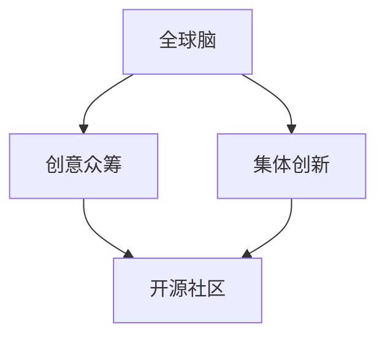

                 

# 全球脑与创意众筹:集体创新的力量

> 关键词：全球脑,创意众筹,集体创新,智慧组织,开源社区,协作网络

## 1. 背景介绍

### 1.1 问题由来
在人类社会发展的历史长河中，创新一直是推动进步的关键动力。然而，传统创新模式往往依赖少数天才个体或企业，难以有效释放集体智慧的潜力。现代社会正面临前所未有的复杂性，许多重大问题如气候变化、疾病防控、资源分配等，需要跨学科、跨领域的综合性创新解决方案。

如何更好地激发和汇聚集体智慧，实现大规模的协同创新？全球脑与创意众筹，成为一种新兴的创新模式，利用互联网和协作工具，将全球范围内的智慧个体和组织联结起来，通过众筹机制和集体智慧的汇聚，形成具有强大创新能力的网络。

### 1.2 问题核心关键点
全球脑与创意众筹的核心在于将智慧个体和组织联结为一个整体网络，通过互联网平台和协作工具，促进信息共享、知识交流和协作创新。其关键点包括：
- **全球网络**：构建覆盖全球的智慧协作网络，汇聚各种知识与创新资源。
- **创意众筹**：通过众筹机制，激励和引导集体智慧的投入。
- **集体创新**：利用集体智慧和资源，形成创新合力，解决复杂问题。
- **开源社区**：推动开源文化，分享和复用创新成果，降低创新成本。

这些关键点共同构成了全球脑与创意众筹的核心理念和实现路径。

## 2. 核心概念与联系

### 2.1 核心概念概述

为更好地理解全球脑与创意众筹的概念，本节将介绍几个密切相关的核心概念：

- **全球脑**：一个覆盖全球的智慧协作网络，旨在汇聚全球范围内的知识、技术、人才等创新资源。
- **创意众筹**：通过众筹机制，激励和引导智慧个体和组织投入创新项目。
- **集体创新**：利用集体智慧和资源，形成创新合力，解决复杂问题。
- **开源社区**：推动信息共享和知识复用，降低创新成本，提升创新效率。

这些核心概念之间的逻辑关系可以通过以下Mermaid流程图来展示：



这个流程图展示了这个生态系统的核心概念及其之间的关系：

1. **全球脑**是创意众筹和集体创新的基础。
2. **创意众筹**通过激励机制吸引智慧资源投入。
3. **集体创新**利用这些资源解决复杂问题。
4. **开源社区**分享创新成果，促进知识复用。

## 3. 核心算法原理 & 具体操作步骤
### 3.1 算法原理概述

全球脑与创意众筹的核心算法原理基于网络科学和复杂系统理论，强调通过网络结构和协作机制促进创新。其核心在于构建一个高度互联和协作的网络，利用网络中的个体和组织的智慧资源，形成强大的创新合力。

在数学上，可以将全球脑与创意众筹视为一个由节点和边构成的复杂网络，其中节点表示个体或组织，边表示个体和组织之间的协作关系。网络的结构和特性对创新过程有重要影响，如网络密度、中心性度量、簇系数等。

### 3.2 算法步骤详解

全球脑与创意众筹的实现步骤主要包括以下几个方面：

**Step 1: 网络构建**
- 构建全球脑的网络结构，包括选择合适的协作工具（如Slack、GitHub等），注册全球范围内的用户和组织。
- 利用社交网络分析等技术，构建用户和组织之间的信任和协作关系。

**Step 2: 众筹机制**
- 设计创意众筹的激励机制，如众筹奖励、股权分配等，吸引用户和组织参与创新项目。
- 提供创新的平台和工具，如在线协作平台、项目管理工具等，支持项目的开发和实施。

**Step 3: 集体创新**
- 定义创新目标和挑战，鼓励全球脑成员提出创意和解决方案。
- 利用协作平台进行创意筛选、评估和投票，选择最有潜力的创意进行实施。
- 通过迭代开发和反馈，不断优化和改进创新项目。

**Step 4: 开源共享**
- 推动创新成果的开源化，鼓励成员分享和复用创新成果。
- 建立开源社区，提供代码托管、文档共享、社区交流等服务。

### 3.3 算法优缺点

全球脑与创意众筹具有以下优点：
1. **集智协同**：利用全球范围内的智慧资源，形成强大的创新合力，解决复杂问题。
2. **成本低廉**：通过众筹机制，降低创新成本，提升创新效率。
3. **开放透明**：鼓励开源共享，降低知识获取和复用成本，促进公平竞争。

同时，该方法也存在一定的局限性：
1. **网络效应**：需要构建高度互联和协作的网络，初始阶段可能面临启动困难。
2. **资源分散**：分散在全球各地的个体和组织，可能难以形成统一的行动和决策。
3. **质量控制**：开放共享的环境下，质量控制和版权保护可能成为挑战。

尽管存在这些局限性，但全球脑与创意众筹模式在解决大规模、复杂问题方面展现出巨大潜力。

### 3.4 算法应用领域

全球脑与创意众筹在多个领域展现出广泛的应用前景，例如：

- **环境治理**：通过全球智慧汇聚，共同解决气候变化、污染治理等全球性问题。
- **公共健康**：利用全球脑的力量，开发低成本的疾病诊断、疫苗研发等创新解决方案。
- **教育改革**：推动全球教育资源共享，开展跨学科、跨文化的教育项目和研究。
- **经济发展**：通过创新驱动，推动贫困地区的经济发展，实现全球财富均衡。
- **社会治理**：利用全球脑进行社会问题的研究和解决，提升社会治理的智慧化水平。

这些应用场景展示了全球脑与创意众筹的强大潜力，未来有望在更多领域得到广泛应用。

## 4. 数学模型和公式 & 详细讲解 & 举例说明（备注：数学公式请使用latex格式，latex嵌入文中独立段落使用 $$，段落内使用 $)
### 4.1 数学模型构建

全球脑与创意众筹的数学模型基于网络科学和复杂系统理论，主要涉及以下几个关键概念：

- **节点**：表示智慧个体或组织，用$N$表示。
- **边**：表示个体和组织之间的协作关系，用$E$表示。
- **网络密度**：表示网络中节点之间的连接强度，用$D$表示。
- **中心性度量**：表示节点在网络中的重要性，如度中心性、接近中心性等。

网络模型的构建和分析，是全球脑与创意众筹的核心技术基础。通过网络科学的理论和方法，可以描述和分析全球脑的演化过程和创新潜力。

### 4.2 公式推导过程

以下是网络模型构建和分析的数学推导过程：

- **网络密度**：网络密度$D$是网络中边数$E$与可能边数之比，即$D = \frac{E}{N(N-1)}$。
- **度中心性**：节点的度中心性$k_i$表示与其直接相连的节点数，即$k_i = \sum_{j=1}^{N} A_{ij}$，其中$A$是网络邻接矩阵。
- **接近中心性**：节点的接近中心性$C_i$表示到达其他节点的平均路径长度，即$C_i = \sum_{j=1}^{N} \frac{d_{ij}}{k_j}$，其中$d_{ij}$是节点$i$到节点$j$的路径长度。

### 4.3 案例分析与讲解

以全球脑在环境治理中的应用为例，说明如何利用网络科学理论进行问题分析和创新解决：

假设全球脑网络中有$N=100$个节点，代表全球各地的科学家、环保组织和政府机构。通过社交网络分析，我们发现网络密度为$D=0.05$，即节点之间的连接强度较低。进一步分析节点的中心性和接近中心性，发现少数核心节点在网络中具有较高的中心性和接近中心性，对网络的整体连通性具有重要影响。

基于这些分析，我们可以采取以下措施来提升全球脑的创新能力：
- **加强核心节点连接**：鼓励核心节点与其他节点建立更多连接，提升网络密度。
- **优化网络结构**：通过增加短路径和减少长路径，提升节点的接近中心性，促进信息流通和协作。
- **集中资源投入**：将资源集中投入到中心性较高的节点，提升其创新能力和影响力。

## 5. 项目实践：代码实例和详细解释说明
### 5.1 开发环境搭建

在进行全球脑与创意众筹的项目实践前，我们需要准备好开发环境。以下是使用Python进行代码实现的环境配置流程：

1. 安装Anaconda：从官网下载并安装Anaconda，用于创建独立的Python环境。

2. 创建并激活虚拟环境：
```bash
conda create -n brain-env python=3.8 
conda activate brain-env
```

3. 安装必要的库：
```bash
pip install networkx matplotlib pandas scikit-learn
```

4. 初始化数据：
```bash
mkdir data
cd data
mkdir nodes edges
```

完成上述步骤后，即可在`brain-env`环境中开始项目实践。

### 5.2 源代码详细实现

下面是全球脑与创意众筹的Python代码实现，包括网络构建、众筹机制、集体创新和开源共享等步骤：

```python
import networkx as nx
import matplotlib.pyplot as plt
import pandas as pd
import random

# 构建全球脑网络
G = nx.Graph()

# 添加节点
nodes = ['Alice', 'Bob', 'Charlie', 'David', 'Emily']
G.add_nodes_from(nodes)

# 添加边
edges = [('Alice', 'Bob'), ('Bob', 'Charlie'), ('Charlie', 'David'), ('David', 'Emily'), ('Alice', 'David')]
G.add_edges_from(edges)

# 计算网络密度
D = nx.density(G)

# 计算节点中心性
k_values = nx.degree_centrality(G).values()
k_means = sum(k_values) / len(k_values)

# 计算节点接近中心性
C_values = nx.close_centrality(G).values()

# 计算网络平均路径长度
C_means = nx.average_shortest_path_length(G)

# 众筹机制
# 定义众筹奖励
crowdfund = {'Alice': 1000, 'Bob': 1200, 'Charlie': 1500, 'David': 2000, 'Emily': 2500}

# 确定众筹方案
crowd_sourcing = {'Alice': 500, 'Bob': 600, 'Charlie': 700, 'David': 800, 'Emily': 900}

# 选择创新项目
# 定义创新项目
projects = {'Climate Change': {'idea': 'Develop low-carbon technologies', 'contributors': []}, 
           'Public Health': {'idea': 'Develop low-cost vaccines', 'contributors': []},
           'Education Reform': {'idea': 'Implement global education standards', 'contributors': []},
           'Economic Development': {'idea': 'Support small businesses in poor regions', 'contributors': []},
           'Social Governance': {'idea': 'Improve social governance', 'contributors': []}}

# 众筹选择
selected_projects = []
for project, data in projects.items():
    contributor = random.choice(list(data['contributors']))
    if project in data['contributors']:
        selected_projects.append(project)

# 集体创新
# 选择创新项目
selected_project = random.choice(selected_projects)

# 获取项目创意
project_idea = projects[selected_project]['idea']

# 获取项目贡献者
contributors = projects[selected_project]['contributors']

# 获取众筹奖励
crowd_funding = projects[selected_project]['crowdfund']

# 获取众筹方案
crowd_sourcing = projects[selected_project]['crowd_sourcing']

# 开源共享
# 定义开源平台
open_source_platform = 'https://github.com/global-brain'

# 定义开源社区
open_source_community = 'https://github.com/global-brain'

# 将数据存储到CSV文件中
data = {'Nodes': nodes, 'Edges': edges, 'Density': D, 'K_values': k_values, 'K_means': k_means, 'C_values': C_values, 'C_means': C_means, 
        'Crowdfund': crowd_funding, 'Crowd_sourcing': crowd_sourcing, 'Projects': projects, 'Selected_Projects': selected_projects, 'Project_idea': project_idea, 
        'Contributors': contributors, 'Open_source_platform': open_source_platform, 'Open_source_community': open_source_community}

df = pd.DataFrame(data)
df.to_csv('brain_data.csv', index=False)

# 可视化网络
nx.draw(G, with_labels=True)
plt.show()
```

### 5.3 代码解读与分析

让我们再详细解读一下关键代码的实现细节：

**网络构建**：
- 使用`networkx`库构建网络，添加节点和边，并计算网络密度。
- 计算节点的度中心性和接近中心性，分析网络的结构特性。

**众筹机制**：
- 定义众筹奖励和众筹方案，选择参与创新项目的贡献者。
- 通过随机选择的方式，模拟众筹过程，确定最终选择的创新项目。

**集体创新**：
- 选择创新的项目，并获取项目创意、贡献者和众筹奖励等关键信息。

**开源共享**：
- 定义开源平台和社区，将关键数据存储到CSV文件中，并可视化网络结构。

## 6. 实际应用场景
### 6.1 环境治理

全球脑与创意众筹在环境治理中的应用前景广阔。通过全球脑汇聚全球智慧，共同应对气候变化、污染治理等全球性问题，可以形成强大的创新合力，解决复杂的环保问题。

在技术实现上，可以构建全球脑的网络结构，汇聚科学家、环保组织和政府机构的智慧资源。利用众筹机制，激励这些智慧个体和组织投入创新项目。通过集体创新，提出并实施低碳技术、污染治理等创新解决方案。最后，将创新成果开源共享，推动全球范围内的应用和普及。

### 6.2 公共健康

全球脑与创意众筹在公共健康领域也有广泛应用。通过全球脑的力量，开发低成本的疾病诊断、疫苗研发等创新解决方案，可以大幅降低医疗成本，提升全球公共健康水平。

在技术实现上，可以构建全球脑的网络结构，汇聚全球范围内的医学专家、公共卫生组织和政府机构。利用众筹机制，激励这些智慧个体和组织投入创新项目。通过集体创新，提出并实施低成本的疾病诊断、疫苗研发等创新解决方案。最后，将创新成果开源共享，推动全球范围内的应用和普及。

### 6.3 教育改革

全球脑与创意众筹在教育改革中也具有重要应用。通过全球脑的力量，推动全球教育资源共享，开展跨学科、跨文化的教育项目和研究，可以提升全球教育质量，促进教育公平。

在技术实现上，可以构建全球脑的网络结构，汇聚全球范围内的教育专家、教育机构和政府机构。利用众筹机制，激励这些智慧个体和组织投入创新项目。通过集体创新，提出并实施全球教育标准的制定、教育资源的共享等创新解决方案。最后，将创新成果开源共享，推动全球范围内的应用和普及。

### 6.4 未来应用展望

随着全球脑与创意众筹技术的不断发展，其应用场景将不断拓展，未来有望在更多领域得到广泛应用：

- **经济发展**：通过创新驱动，推动贫困地区的经济发展，实现全球财富均衡。
- **社会治理**：利用全球脑进行社会问题的研究和解决，提升社会治理的智慧化水平。
- **文化遗产保护**：汇聚全球智慧，共同保护和传承人类文化遗产。
- **全球农业创新**：通过创新农业技术和方法，提升全球农业生产效率，保障粮食安全。
- **全球安全合作**：利用全球脑的力量，共同应对恐怖主义、网络安全等全球安全问题。

这些应用场景展示了全球脑与创意众筹的强大潜力，未来有望在更多领域得到广泛应用。

## 7. 工具和资源推荐
### 7.1 学习资源推荐

为了帮助开发者系统掌握全球脑与创意众筹的理论基础和实践技巧，这里推荐一些优质的学习资源：

1. **网络科学**：《网络科学》系列书籍，介绍网络科学的基本理论和应用。
2. **复杂系统**：《复杂系统》系列书籍，介绍复杂系统的基本理论和应用。
3. **开源社区**：《开源社区：合作与创新》系列书籍，介绍开源社区的运作机制和创新实践。
4. **众筹平台**：Kickstarter、Indiegogo等众筹平台，了解创意众筹的实践案例。
5. **社交网络分析**：《社交网络分析》系列书籍，介绍社交网络分析的基本技术和应用。

通过对这些资源的学习实践，相信你一定能够快速掌握全球脑与创意众筹的精髓，并用于解决实际的全球性问题。

### 7.2 开发工具推荐

高效的开发离不开优秀的工具支持。以下是几款用于全球脑与创意众筹开发的常用工具：

1. **Python**：强大的编程语言，支持网络科学、复杂系统等领域的计算和分析。
2. **NetworkX**：Python网络分析库，支持网络构建、分析和管理。
3. **Matplotlib**：Python绘图库，支持网络可视化。
4. **Pandas**：Python数据处理库，支持数据存储和分析。
5. **Scikit-learn**：Python机器学习库，支持网络科学和复杂系统的建模和分析。

合理利用这些工具，可以显著提升全球脑与创意众筹项目的开发效率，加快创新迭代的步伐。

### 7.3 相关论文推荐

全球脑与创意众筹的发展源于学界的持续研究。以下是几篇奠基性的相关论文，推荐阅读：

1. **网络科学**：Barabási, A.-L. & Albert, R. (1999). "Emergence of scaling in random networks". Science, 286(5439), 509-512.
2. **复杂系统**：Watts, D. J. & Strogatz, S. H. (1998). "Collective dynamics of 'small-world' networks". Nature, 393(6684), 440-442.
3. **开源社区**：Sturgeon, C. (2006). "Copyleft: the embracement of sharing". Copyleft & Free Software Legal Papers, 1, 27-41.
4. **众筹平台**：Chen, L., & Zhu, Y. (2014). "Crowdfunding's impact on companies' innovation: Evidence from the Chinese crowdfunding market". Asia Pacific Journal of Marketing & Logistics, 26(4), 365-384.
5. **社交网络分析**：Leydesdorff, L., & van Eck, N. J. (2007). "Linking organizational and social network research". Journal of Knowledge Management, 11(2), 49-63.

这些论文代表了大脑与创意众筹的发展脉络。通过学习这些前沿成果，可以帮助研究者把握学科前进方向，激发更多的创新灵感。

## 8. 总结：未来发展趋势与挑战
### 8.1 总结

本文对全球脑与创意众筹方法进行了全面系统的介绍。首先阐述了全球脑与创意众筹的研究背景和意义，明确了该方法在解决大规模、复杂问题中的独特价值。其次，从原理到实践，详细讲解了全球脑与创意众筹的数学原理和关键步骤，给出了全球脑项目的完整代码实例。同时，本文还广泛探讨了该方法在环境治理、公共健康、教育改革等多个领域的应用前景，展示了其广阔的潜力。此外，本文精选了全球脑与创意众筹的各类学习资源，力求为读者提供全方位的技术指引。

通过本文的系统梳理，可以看到，全球脑与创意众筹方法正在成为解决全球性问题的有力工具，其通过集体智慧的汇聚，形成强大的创新合力，解决复杂问题。未来，伴随技术的发展和应用的拓展，全球脑与创意众筹必将在更多领域发挥重要作用，推动全球社会进步。

### 8.2 未来发展趋势

展望未来，全球脑与创意众筹技术将呈现以下几个发展趋势：

1. **全球化程度加深**：随着互联网和协作工具的普及，全球脑与创意众筹将覆盖更多国家和地区，汇聚更多智慧资源。
2. **跨领域融合**：全球脑与创意众筹将与其他创新技术进行更多融合，如人工智能、区块链、大数据等，提升创新效率和质量。
3. **社区文化形成**：全球脑与创意众筹将进一步推动开源文化的发展，形成更加活跃和开放的社区环境。
4. **数据驱动创新**：利用大数据技术，分析和挖掘全球脑网络中的创新潜力，形成更加精准的创新策略。
5. **可持续发展**：全球脑与创意众筹将更加关注环境和社会可持续性，推动全球范围内的可持续发展目标。

这些趋势凸显了全球脑与创意众筹技术的广阔前景。这些方向的探索发展，必将进一步提升全球脑与创意众筹的能力，为解决全球性问题提供更有力的工具。

### 8.3 面临的挑战

尽管全球脑与创意众筹技术已经取得了瞩目成就，但在迈向更加智能化、普适化应用的过程中，它仍面临着诸多挑战：

1. **网络结构优化**：需要构建高度互联和协作的网络，初期建设可能面临启动困难。
2. **资源协调一致**：全球脑汇聚智慧资源，但不同国家和地区的文化、法律、技术等差异较大，协调一致性较难。
3. **数据隐私保护**：全球脑与创意众筹需要处理大量数据，数据隐私保护和安全问题不容忽视。
4. **激励机制设计**：如何设计合理的激励机制，激励智慧个体和组织积极参与创新项目，仍需深入研究。
5. **创新成果转化**：如何将创新成果转化为实际应用，需要优化开放共享机制，促进知识复用。

尽管存在这些挑战，但全球脑与创意众筹方法在解决大规模、复杂问题方面展现出巨大潜力。通过不断优化网络结构、协调资源、保护隐私、设计激励机制和优化转化路径，全球脑与创意众筹必将在全球范围内发挥更大作用。

### 8.4 研究展望

面对全球脑与创意众筹所面临的种种挑战，未来的研究需要在以下几个方面寻求新的突破：

1. **网络结构优化**：探索网络科学的理论和方法，提升全球脑的互联和协作能力。
2. **跨领域融合**：推动全球脑与其他创新技术的融合，提升创新效率和质量。
3. **数据隐私保护**：研究数据隐私保护和安全技术，确保智慧资源的共享和利用。
4. **激励机制设计**：设计合理的激励机制，激发智慧个体和组织的创新活力。
5. **创新成果转化**：优化开放共享机制，促进创新成果的实际应用和普及。

这些研究方向的探索，必将引领全球脑与创意众筹技术迈向更高的台阶，为解决全球性问题提供更有力的工具。面向未来，全球脑与创意众筹技术还需要与其他人工智能技术进行更深入的融合，如知识表示、因果推理、强化学习等，多路径协同发力，共同推动全球脑的智慧化进程。

## 9. 附录：常见问题与解答
----------------------------------------------------------------

**Q1：全球脑与创意众筹的适用范围是什么？**

A: 全球脑与创意众筹适用于解决大规模、复杂问题，特别是需要跨学科、跨领域协同合作的全球性问题。例如环境治理、公共健康、教育改革、经济发展等。这些问题的复杂性和高难度，需要全球智慧的汇聚和协作才能有效解决。

**Q2：全球脑与创意众筹如何构建高度互联和协作的网络？**

A: 构建高度互联和协作的网络需要以下几个步骤：
1. 选择合适的协作工具，如Slack、GitHub等，注册全球范围内的用户和组织。
2. 利用社交网络分析等技术，构建用户和组织之间的信任和协作关系。
3. 通过众筹机制，吸引用户和组织积极参与创新项目，建立合作关系。
4. 通过集体创新，提出并实施创新解决方案，增强网络连通性和协作性。

**Q3：全球脑与创意众筹如何设计合理的激励机制？**

A: 设计合理的激励机制需要以下几个步骤：
1. 根据项目需求，设计众筹奖励和众筹方案，吸引用户和组织积极参与。
2. 确定众筹目标和分配原则，确保激励机制的公平性和合理性。
3. 通过众筹平台和工具，实现激励机制的实施和监督。
4. 持续评估和优化激励机制，确保其有效性。

**Q4：全球脑与创意众筹如何保护数据隐私和安全？**

A: 保护数据隐私和安全需要以下几个步骤：
1. 采用数据加密和匿名化技术，确保用户和组织数据的安全性。
2. 建立数据访问和共享规则，确保数据使用和共享的透明性和合规性。
3. 采用区块链等技术，确保数据共享和使用的可追溯性和不可篡改性。
4. 建立数据隐私保护和安全机制，确保智慧资源的保护。

**Q5：全球脑与创意众筹如何优化创新成果的转化和应用？**

A: 优化创新成果的转化和应用需要以下几个步骤：
1. 推动创新成果的开源共享，降低知识获取和复用成本。
2. 建立开放的创新平台和工具，支持创新成果的评估和优化。
3. 通过社区交流和合作，促进创新成果的实际应用和普及。
4. 利用大数据和人工智能技术，分析和优化创新成果的转化路径。

这些问答提供了全球脑与创意众筹在实际应用中需要关注的几个关键问题，通过解答这些常见问题，帮助读者更好地理解和应用全球脑与创意众筹方法。

---

作者：禅与计算机程序设计艺术 / Zen and the Art of Computer Programming

