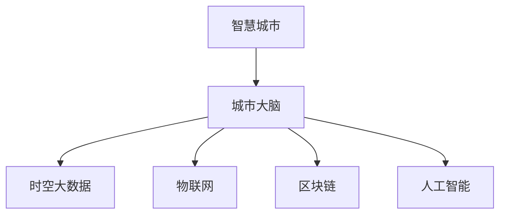

                 

# 全球脑与城市规划：智慧城市的终极形态

## 1. 背景介绍

随着全球城市化进程的加速，城市规划和智慧城市建设成为各国政府和社会各界关注的焦点。智能技术为城市治理带来了新契机，推动城市管理向智能化、精细化转型。如何构建一个高效、智能、可持续发展的智慧城市，成为当前技术研究和应用中的重大课题。

### 1.1 问题由来
智慧城市旨在通过物联网、大数据、云计算、人工智能等技术，实现对城市资源的精细化管理和智能化决策。然而，传统城市管理模式难以适应智能化需求，数据孤岛、信息不对称、管理低效等问题依然存在。探索一种新型的智慧城市形态，成为当务之急。

### 1.2 问题核心关键点
智慧城市的建设需要处理城市运行中产生的海量数据，涵盖交通、能源、环境、安全等多个领域。城市数据具有多样性、动态性和复杂性等特点，如何高效地收集、存储、分析和利用这些数据，是实现智慧城市目标的关键。

智慧城市涉及城市空间规划、基础设施建设、公共服务优化、市民生活品质提升等多个方面。从宏观的总体规划到微观的城市运营，每个环节都离不开信息技术的深度参与。

## 2. 核心概念与联系

### 2.1 核心概念概述

为了更好地理解智慧城市及其核心技术，本节将介绍几个关键概念：

- **智慧城市**：融合物联网、云计算、大数据、人工智能等技术，实现城市运行的智能化管理，提升市民生活品质和城市管理效率。
- **城市大脑**：通过数据融合、模型预测、智能决策等手段，对城市运行进行集中管理和优化，是实现智慧城市的重要引擎。
- **时空大数据**：指城市运行产生的时空分布数据，如交通流量、气象数据、能源消耗等，是智慧城市数据处理和分析的重要对象。
- **区块链**：一种分布式账本技术，通过去中心化、不可篡改的特性，为智慧城市的数据共享和安全提供保障。
- **物联网(IoT)**：通过传感器、智能设备等手段，实现城市各种基础设施和设备的互联互通，采集海量实时数据。
- **人工智能(AI)**：包括机器学习、深度学习等技术，通过智能算法处理城市数据，实现预测、决策和优化。

这些核心概念通过以下Mermaid流程图展示它们之间的联系：



这些概念通过数据流、控制流、业务流等多维度相互作用，共同构建智慧城市的运作体系。

## 3. 核心算法原理 & 具体操作步骤

### 3.1 算法原理概述

智慧城市的核心在于数据驱动的智能决策。智慧城市的构建需要从数据采集、存储、处理、分析到应用等多个环节进行系统设计和优化。以下是智慧城市建设中的核心算法原理：

1. **数据采集与处理**：通过物联网、传感器等技术采集城市数据，包括交通流量、空气质量、能源消耗等，采用边缘计算、分布式存储等技术处理海量数据。
2. **数据分析与建模**：采用机器学习、深度学习等算法分析时空大数据，构建城市运行模型，实现智能预测与决策。
3. **智能决策与优化**：通过城市大脑等系统，结合人工智能模型，对城市运行进行集中管理和优化，实现交通管理、能源调度、环境治理等目标。

### 3.2 算法步骤详解

智慧城市的构建涉及多个子任务，以下是具体步骤详解：

**Step 1: 数据采集与清洗**

- **物联网数据采集**：通过智能传感器、摄像头、车联网等技术，实时采集城市基础设施和公共设施的运行数据。
- **传感器数据采集**：利用温湿度传感器、空气质量传感器等设备，收集城市环境数据。
- **清洗与预处理**：对采集到的数据进行去噪、归一化、缺失值填充等预处理，保证数据质量。

**Step 2: 数据存储与管理**

- **分布式存储**：利用Hadoop、Spark等大数据平台，实现大规模数据的分布式存储和管理。
- **数据同步与更新**：采用ETL工具，如Apache Kafka，实现数据在不同系统间的同步更新。
- **数据备份与恢复**：定期备份关键数据，并实现数据的快速恢复。

**Step 3: 数据分析与建模**

- **特征提取与选择**：利用PCA、LDA等算法，提取数据的有效特征，并选择重要的特征进行建模。
- **模型训练与验证**：采用随机森林、神经网络等算法训练模型，并在验证集上进行性能评估。
- **模型部署与优化**：将训练好的模型部署到城市大脑等系统中，实现实时预测与决策。

**Step 4: 智能决策与执行**

- **决策引擎**：基于城市大脑等系统，实现智能决策，如交通流量控制、能源负荷调度等。
- **任务执行与反馈**：将决策指令下发到执行系统，如交通信号灯、智能电网等，并收集执行结果进行反馈优化。

**Step 5: 系统集成与运营**

- **接口与API设计**：设计统一的数据接口与API，实现系统间的互操作。
- **用户体验优化**：通过可视化、移动应用等手段，提升市民对智慧城市的参与感。
- **安全与隐私保护**：采用区块链、加密等技术，保障数据和隐私安全。

### 3.3 算法优缺点

智慧城市的构建过程中，涉及海量数据处理和复杂算法应用，其优缺点如下：

**优点**：

- **效率提升**：通过智能决策和优化，提升城市运行效率，降低运营成本。
- **数据驱动**：实现数据驱动的科学决策，避免传统管理模式中的主观偏见。
- **持续优化**：系统不断学习新数据，实现动态调整和优化。

**缺点**：

- **技术复杂**：涉及多学科技术的融合，技术复杂度高，开发和维护成本大。
- **数据安全**：海量数据集中存储和处理，面临隐私和安全风险。
- **资源消耗**：系统建设需要大量计算资源和存储空间，初期投入高。

### 3.4 算法应用领域

智慧城市的构建涉及多个应用领域，以下是具体领域的应用：

- **交通管理**：通过交通流量监控、智能信号灯控制等技术，实现交通拥堵的智能缓解。
- **能源管理**：采用智能电网、能源调度等技术，实现能源的高效利用和负荷平衡。
- **环境监测**：利用传感器、遥感技术，实现对空气质量、水质等的实时监测。
- **公共安全**：通过视频监控、智能分析等技术，提升城市公共安全水平。
- **市民服务**：通过智能客服、智能导览等技术，提升市民生活品质和城市服务体验。

## 4. 数学模型和公式 & 详细讲解 & 举例说明

### 4.1 数学模型构建

智慧城市的构建需要多学科知识支撑，涉及数学、统计、计算机科学等多个领域。以下是智慧城市构建中的核心数学模型：

1. **线性回归模型**：用于预测城市运行中的连续变量，如交通流量、能源消耗等。
2. **分类模型**：用于预测城市运行中的离散变量，如交通状态、环境质量等。
3. **聚类算法**：用于对城市数据进行分组，识别数据中的模式和异常。
4. **优化算法**：用于解决智慧城市中的优化问题，如交通流量控制、能源调度等。

### 4.2 公式推导过程

以线性回归模型为例，推导其公式如下：

设$y$为连续型变量，$x$为自变量，$n$为样本数。线性回归模型的最小二乘法公式为：

$$
\hat{y} = \beta_0 + \sum_{i=1}^{n}\beta_i x_i
$$

其中，$\beta_0$为截距，$\beta_i$为第$i$个自变量的系数。最小二乘法的目标是最小化预测值与真实值之间的平方误差，即：

$$
\sum_{i=1}^{n}(y_i - \hat{y}_i)^2
$$

对$\beta_0$和$\beta_i$求偏导，并令偏导为0，即可得到回归系数的求解公式：

$$
\beta_i = \frac{\sum_{j=1}^{n}(x_j - \overline{x})(y_j - \overline{y})}{\sum_{j=1}^{n}(x_j - \overline{x})^2}
$$

$$
\beta_0 = \overline{y} - \sum_{i=1}^{n}\beta_i \overline{x}
$$

其中，$\overline{x}$和$\overline{y}$分别为自变量和因变量的均值。

### 4.3 案例分析与讲解

以智能交通管理为例，分析线性回归模型在智慧城市中的应用：

设$y$为交通流量，$x_1$为时间，$x_2$为天气条件，$x_3$为节假日。采用线性回归模型预测交通流量，得到回归方程：

$$
\hat{y} = \beta_0 + \beta_1 x_1 + \beta_2 x_2 + \beta_3 x_3
$$

其中，$\beta_0$、$\beta_1$、$\beta_2$、$\beta_3$为回归系数。通过训练集数据，求解得到系数，并代入测试集数据，计算预测交通流量。

## 5. 项目实践：代码实例和详细解释说明

### 5.1 开发环境搭建

智慧城市的构建需要多种技术和工具的支持，以下是开发环境搭建的具体流程：

1. **安装Python**：从官网下载并安装Python 3.x版本，搭建开发环境。
2. **安装Docker**：安装Docker容器引擎，用于容器化部署应用。
3. **安装数据库**：安装MySQL、PostgreSQL等数据库，用于存储和管理数据。
4. **安装大数据平台**：安装Hadoop、Spark等大数据平台，用于数据处理和分析。
5. **安装云计算平台**：安装AWS、阿里云等云计算平台，提供计算和存储资源。
6. **安装API管理工具**：安装Swagger、Restlet等API管理工具，设计API接口。

### 5.2 源代码详细实现

以下是一个基于TensorFlow的智慧城市交通管理系统的代码实现示例：

```python
import tensorflow as tf
import pandas as pd
import numpy as np

# 加载数据
data = pd.read_csv('traffic_data.csv')

# 数据预处理
data = data.dropna()
X = data[['time', 'weather', 'holiday']].values
y = data['traffic流量'].values

# 训练模型
model = tf.keras.Sequential([
    tf.keras.layers.Dense(64, activation='relu', input_shape=(3,)),
    tf.keras.layers.Dense(1)
])

model.compile(optimizer=tf.keras.optimizers.Adam(0.001), loss='mse')
model.fit(X, y, epochs=100, batch_size=32)

# 预测交通流量
test_data = pd.read_csv('test_data.csv')
X_test = test_data[['time', 'weather', 'holiday']].values
y_pred = model.predict(X_test)
```

### 5.3 代码解读与分析

- **数据加载与预处理**：使用Pandas库加载和预处理数据，去除缺失值和异常值。
- **模型训练**：构建一个具有两个隐藏层的神经网络模型，并使用Adam优化器进行训练。
- **模型评估**：使用均方误差(MSE)作为损失函数，评估模型在测试集上的性能。
- **预测与分析**：利用训练好的模型，对新的测试数据进行交通流量预测，并可视化结果。

## 6. 实际应用场景

### 6.1 智能交通管理

智能交通管理系统通过物联网技术，实时采集交通流量、车速、交通事故等信息，并结合历史数据和预测模型，实现交通信号灯的智能控制、交通事故的快速响应和拥堵路段的智能疏导。

### 6.2 能源管理

智慧能源管理系统通过智能电表、光伏发电系统等设备，实时采集城市能源消耗数据，并结合历史数据和预测模型，优化能源调度，实现节能减排和能源平衡。

### 6.3 环境监测

智能环境监测系统通过传感器、遥感技术，实时采集空气质量、水质、噪音等环境数据，并结合历史数据和预测模型，实现环境质量监测和污染预警。

### 6.4 公共安全

智慧公共安全系统通过视频监控、智能分析等技术，实时监控城市公共安全事件，并结合历史数据和预测模型，快速响应和处置突发事件。

### 6.5 市民服务

智慧市民服务平台通过智能客服、智能导览等技术，提升市民对城市服务的体验，提供便捷的服务。

## 7. 工具和资源推荐

### 7.1 学习资源推荐

1. **智慧城市相关课程**：
   - 《智慧城市技术与应用》（北京航空航天大学公开课）
   - 《智慧城市设计与规划》（同济大学公开课）
2. **数据科学相关课程**：
   - 《Python数据科学手册》（Jake VanderPlas著）
   - 《数据科学与机器学习》（Coursera平台）

### 7.2 开发工具推荐

1. **编程语言**：
   - Python：数据科学和机器学习的首选语言。
2. **大数据平台**：
   - Hadoop：分布式计算平台。
   - Spark：大规模数据处理平台。
3. **云计算平台**：
   - AWS：亚马逊云计算平台。
   - Azure：微软云计算平台。
4. **容器引擎**：
   - Docker：容器化技术，方便部署和管理应用。
5. **API管理工具**：
   - Swagger：API设计和文档工具。
   - Restlet：API测试和管理工具。

### 7.3 相关论文推荐

1. **智慧城市建模与优化**：
   - 《A Survey on Smart City: From Concept to Applications》（IEEE Access）
   - 《Wisdom City Modeling: A Survey of Research Directions》（IEEE Journal on Selected Areas in Communications）
2. **数据驱动的智慧城市研究**：
   - 《Data-Driven Smart City: A Survey》（IEEE Transactions on Big Data）
   - 《Smart City Systems: Data-Driven Analysis and Design》（IEEE Transactions on Systems, Man, and Cybernetics: Systems）

## 8. 总结：未来发展趋势与挑战

### 8.1 研究成果总结

智慧城市建设是一项复杂而庞大的系统工程，需要跨学科知识的融合和技术手段的创新。本文从数据采集、存储、处理、分析到应用等多个环节，全面介绍了智慧城市的构建方法和关键技术，探讨了智慧城市在交通、能源、环境、公共安全等方面的应用。通过案例分析，展示了智慧城市建设的实际效果和应用价值。

### 8.2 未来发展趋势

智慧城市的未来发展趋势如下：

1. **数据融合与共享**：智慧城市的数据来源日益丰富，如何有效融合与共享数据成为关键问题。
2. **边缘计算与云边缘协同**：智慧城市的数据处理需要高效、低延迟的计算平台，边缘计算与云边缘的协同成为新的方向。
3. **智能化城市管理**：智慧城市将更加注重智能化管理，通过数据分析和智能决策，实现城市管理的精细化和智能化。
4. **市民参与与交互**：智慧城市将更加注重市民的参与和交互，通过移动应用、智能设备等手段，提升市民的生活体验和城市服务的可访问性。

### 8.3 面临的挑战

智慧城市建设面临以下挑战：

1. **数据隐私与安全**：海量数据集中存储和处理，面临隐私和安全风险。
2. **技术复杂度**：涉及多学科技术的融合，技术复杂度高，开发和维护成本大。
3. **资源消耗**：系统建设需要大量计算资源和存储空间，初期投入高。
4. **技术标准与互操作性**：不同系统和平台之间的技术标准和互操作性问题，仍需解决。

### 8.4 研究展望

智慧城市的未来研究展望如下：

1. **自适应智能系统**：开发能够自适应环境变化的智慧系统，提升城市的应急响应能力。
2. **跨领域知识融合**：将符号化的先验知识与神经网络模型进行融合，实现更加全面、准确的信息整合能力。
3. **普适化智慧系统**：开发适用于不同规模和类型城市的智慧系统，推动智慧城市的普适化发展。
4. **全球脑与城市互联**：实现全球脑与城市的互联互通，实现智慧城市之间的高效协同和数据共享。

## 9. 附录：常见问题与解答

**Q1: 智慧城市建设的主要挑战是什么？**

A: 智慧城市建设的主要挑战包括数据隐私与安全、技术复杂度、资源消耗和技术标准与互操作性等问题。

**Q2: 如何提升智慧城市数据融合与共享的效果？**

A: 通过数据治理、数据标注、数据标准化等手段，提升数据融合与共享的效果，建立跨部门、跨领域的数据共享机制。

**Q3: 智慧城市的数据安全和隐私保护有哪些措施？**

A: 采用区块链、加密等技术，保障数据和隐私安全。同时建立数据访问控制机制，限制数据的使用和共享。

**Q4: 如何提升智慧城市的智能化管理水平？**

A: 通过智能化城市大脑等系统，实现智能决策和优化，提升城市运行效率和公共服务水平。

**Q5: 如何实现智慧城市的多样化应用？**

A: 根据不同城市的特点和需求，设计定制化的智慧城市解决方案，推广智慧城市的应用场景和模式。

**Q6: 智慧城市的未来发展方向是什么？**

A: 未来智慧城市将更加注重数据融合与共享、智能化城市管理、市民参与与交互、跨领域知识融合和全球脑与城市互联。

---

作者：禅与计算机程序设计艺术 / Zen and the Art of Computer Programming

