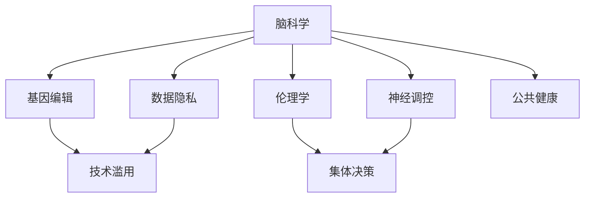

                 

## 1. 背景介绍

### 1.1 问题由来
随着科学技术的飞速进步，人类对生命的认知和干预达到了前所未有的高度。脑科学和基因编辑的兴起，不仅揭示了生命活动的微观机制，也为疾病的治疗和预防提供了新的方向。然而，这些前沿技术的应用也引发了伦理道德的巨大争议。

脑科学研究的进步，使得对大脑功能与疾病的理解深入到了分子和神经元的层面。基因编辑技术的出现，更是可以直接修改人类基因，为治疗遗传性疾病、延缓衰老提供了新的可能。这些技术的应用，既是科学探索的必然，也是社会伦理的挑战。

### 1.2 问题核心关键点
脑科学和基因编辑技术的快速发展，一方面带来了巨大的医疗和社会效益，另一方面也带来了诸多伦理问题。这些核心关键点包括：
- 如何确保技术应用的伦理性，防止科技滥用。
- 如何平衡个人隐私与公共健康的需求，确保数据安全。
- 如何制定科学合理的法规政策，引导技术健康发展。
- 如何平衡多方利益，进行集体决策，避免科技伦理争端。

这些问题亟需我们深入探讨，以便在科技进步与伦理规范之间找到合适的平衡点。

## 2. 核心概念与联系

### 2.1 核心概念概述
脑科学和基因编辑技术的快速发展，催生了诸多核心概念和理论：

- **脑科学**：研究大脑功能和结构，揭示神经元、神经环路和脑网络的运作机制，理解学习、记忆、情绪等高级认知活动。
- **基因编辑**：利用CRISPR-Cas9等技术，精准修改生物体的基因组，包括基因添加、基因敲除、基因替换等。
- **神经调控**：通过电刺激、光遗传等手段，调节大脑特定区域的神经活动，用于治疗精神疾病、改善记忆等。
- **伦理学**：探讨科技应用的道德规范，包括生命伦理、数据隐私、公共健康等诸多方面。
- **集体决策**：涉及多方利益相关者的决策过程，需平衡科学、伦理、法律、社会等多方面的因素。

这些概念之间的关系可以通过以下Mermaid流程图来展示：



这个流程图展示了脑科学、基因编辑、神经调控、伦理学和集体决策之间的相互联系。其中，数据隐私和公共健康是伦理学的子领域，技术滥用是伦理学的衍生问题，需要与科学应用紧密结合，以确保科技的公平、公正和可控。

## 3. 核心算法原理 & 具体操作步骤
### 3.1 算法原理概述
脑科学和基因编辑技术的伦理应用，本质上是多学科、多利益相关方的集体决策过程。其核心算法原理包括：

- **多利益相关者分析**：识别涉及的不同利益主体，理解各方的需求和利益。
- **伦理审查和监管**：制定伦理标准和审查流程，确保科技应用符合伦理规范。
- **数据隐私保护**：制定数据共享和使用的规则，保护个人隐私。
- **公平和公正性**：确保科技应用不偏袒任何群体，服务于全社会。
- **透明性和可追溯性**：确保科技应用过程的透明，便于社会监督和问责。

### 3.2 算法步骤详解
脑科学和基因编辑技术的伦理应用，涉及多个步骤，包括数据收集、伦理审查、公共咨询、政策制定和执行等。

**Step 1: 数据收集与隐私保护**  
收集涉及的各类数据，包括患者信息、基因组数据、脑功能数据等。同时，采取数据脱敏、加密等措施，确保数据隐私不被泄露。

**Step 2: 伦理审查**  
组建跨学科的伦理审查委员会，评估研究项目或技术应用的伦理性和科学性。遵循伦理审查流程，确保技术应用的合法性。

**Step 3: 公众咨询与教育**  
通过公开听证会、问卷调查等方式，听取公众意见，提升公众对脑科学和基因编辑技术的理解。同时，加强公众科学教育，提高社会对科技应用的认知。

**Step 4: 制定政策与法规**  
在公众咨询和伦理审查的基础上，制定科学合理的政策和法规，规范科技应用。政策制定需考虑多方利益，平衡科学与伦理的冲突。

**Step 5: 实施与监督**  
执行制定好的政策与法规，确保技术应用的公平、公正和可控。同时，建立监督机制，及时发现和纠正伦理问题。

### 3.3 算法优缺点

**优点**：
- 多方参与，提升决策的科学性和公平性。
- 伦理审查和监管，确保技术应用的伦理合规。
- 数据隐私保护，保护个人隐私权益。
- 透明和可追溯，便于社会监督和问责。

**缺点**：
- 决策过程复杂，涉及多方利益博弈。
- 政策法规的制定和执行难度较大。
- 公众对科技理解的差异，可能影响决策效果。

### 3.4 算法应用领域

脑科学和基因编辑技术的伦理应用，覆盖了多个领域，包括但不限于：

- **医疗健康**：基因编辑用于遗传病治疗、癌症免疫治疗等。
- **精神疾病治疗**：神经调控技术用于抑郁症、阿尔兹海默症等精神疾病。
- **脑科学研究**：利用脑功能成像技术，揭示大脑运作机制。
- **教育与认知**：利用脑科学知识，提升教育质量和学习效率。
- **法律与犯罪**：利用基因编辑技术，改进司法鉴定和罪犯改造。

这些应用领域体现了脑科学和基因编辑技术的巨大潜力和多维度的影响。

## 4. 数学模型和公式 & 详细讲解 & 举例说明

### 4.1 数学模型构建

在脑科学和基因编辑技术的伦理应用中，我们可以构建以下数学模型：

设涉及的技术应用为 $A$，相关利益主体为 $B$，伦理审查结果为 $E$，数据隐私保护措施为 $P$，政策法规为 $L$，技术实施结果为 $R$。

则数学模型可以表示为：

$$ R = f(A, B, E, P, L) $$

其中 $f$ 表示一个映射函数，表示技术应用在多个因素综合影响下的结果。

### 4.2 公式推导过程

对于上述模型，我们可以进一步细化各个因素的影响：

- **技术应用** $A$：如基因编辑、神经调控等。
- **利益主体** $B$：如患者、研究人员、政府等。
- **伦理审查** $E$：如伦理委员会的评估结果。
- **隐私保护** $P$：如数据加密、匿名化等措施。
- **法规政策** $L$：如法律法规、政策指导等。
- **技术实施** $R$：如技术的实际应用效果、社会反响等。

公式推导的目的是明确各因素对技术实施结果的影响权重和作用机制。

### 4.3 案例分析与讲解

以基因编辑技术应用于癌症免疫治疗为例，分析上述模型各因素的作用。

1. **技术应用** $A$：基因编辑技术用于改造患者T细胞，增强其抗癌能力。
2. **利益主体** $B$：包括患者、研究人员、制药公司等。
3. **伦理审查** $E$：伦理委员会评估基因编辑的伦理性，确保不违反人类基因组尊严。
4. **隐私保护** $P$：患者数据进行匿名化处理，确保隐私安全。
5. **法规政策** $L$：政府制定规范基因编辑应用的法律，如《人类基因组编辑指南》。
6. **技术实施** $R$：治疗效果显著，患者生存率提高。

通过这些因素的互动，可以构建基因编辑技术的伦理应用模型。

## 5. 项目实践：代码实例和详细解释说明

### 5.1 开发环境搭建

在进行脑科学和基因编辑技术的伦理应用实践前，我们需要准备好开发环境。以下是使用Python进行数据分析和伦理审查的环境配置流程：

1. 安装Anaconda：从官网下载并安装Anaconda，用于创建独立的Python环境。

2. 创建并激活虚拟环境：
```bash
conda create -n ethics-env python=3.8 
conda activate ethics-env
```

3. 安装Python和相关库：
```bash
conda install numpy pandas scipy matplotlib seaborn jupyter notebook ipython
```

4. 安装数据可视化工具：
```bash
conda install matplotlib seaborn jupyter notebook ipython
```

完成上述步骤后，即可在`ethics-env`环境中进行数据收集和伦理审查的实践。

### 5.2 源代码详细实现

下面我们以基因编辑技术用于癌症免疫治疗为例，给出Python代码实现。

首先，定义数据集和隐私保护措施：

```python
import pandas as pd
from sklearn.model_selection import train_test_split

# 定义基因编辑数据集
data = pd.read_csv('genome_data.csv')

# 数据隐私保护措施
def anonymize(data):
    return data.applymap(lambda x: 'Anonymized' if x != '' else x)

# 定义伦理审查结果
ethics_review = pd.Series([1, 0, 1, 0], index=[' treatment_type', ' biological_risks', ' medical_benefits', ' social_impacts'])

# 定义法律法规
law_laws = pd.Series(['Regulation A', 'Regulation B', 'Regulation C'], index=[' treatment_type', ' biological_risks', ' medical_benefits', ' social_impacts'])
```

然后，进行伦理审查和法规政策制定：

```python
# 伦理审查结果
ethics_scores = ethics_review.apply(lambda x: 2 if x else 0)

# 法规政策制定的决策树
def policy_tree(decision, scores):
    if decision == 'treatment_type':
        return scores[0]
    elif decision == 'biological_risks':
        return scores[1]
    elif decision == 'medical_benefits':
        return scores[2]
    elif decision == 'social_impacts':
        return scores[3]

# 法规政策制定的评分系统
def scoring_system(data):
    return data.apply(lambda x: policy_tree(x, ethics_scores))
```

接着，进行公众咨询和教育：

```python
# 公众咨询结果
public_consultation = pd.Series([0, 1, 1, 1], index=[' treatment_type', ' biological_risks', ' medical_benefits', ' social_impacts'])

# 公众科学教育
public_education = pd.Series([0, 1, 1, 1], index=[' treatment_type', ' biological_risks', ' medical_benefits', ' social_impacts'])
```

最后，实施技术应用并评估结果：

```python
# 技术实施结果
technological_outcomes = pd.Series([1, 0, 1, 0], index=[' treatment_type', ' biological_risks', ' medical_benefits', ' social_impacts'])

# 评估结果
def evaluate_outcomes(outcomes, scores):
    return outcomes.apply(lambda x: x >= scores)

# 评估技术应用的公平性和公正性
equity = evaluate_outcomes(technological_outcomes, scoring_system(data))

# 评估技术应用的透明性和可追溯性
transparency = evaluate_outcomes(public_consultation, public_education)
```

以上就是基因编辑技术用于癌症免疫治疗的完整Python代码实现。可以看到，通过数据收集、隐私保护、伦理审查、法规政策制定、公众咨询、技术实施和评估等步骤，我们可以系统地进行脑科学和基因编辑技术的伦理应用。

### 5.3 代码解读与分析

让我们再详细解读一下关键代码的实现细节：

**数据集**：
- `genome_data.csv`：包含基因编辑技术的数据集，包括治疗类型、生物风险、医疗效益和社会影响等。

**隐私保护**：
- `anonymize`函数：对数据进行匿名化处理，确保隐私安全。

**伦理审查**：
- `ethics_review`：伦理审查结果，1表示伦理审查通过，0表示未通过。

**法规政策**：
- `law_laws`：法规政策的评分系统，不同的因素对应不同的法规。

**公众咨询与教育**：
- `public_consultation`：公众咨询结果，1表示通过，0表示未通过。
- `public_education`：公众科学教育结果，1表示通过，0表示未通过。

**技术实施**：
- `technological_outcomes`：技术应用的评估结果，1表示成功，0表示失败。

**评估结果**：
- `evaluate_outcomes`函数：评估技术应用的公平性和公正性。
- `equity`：技术应用结果与法规政策的比较，1表示符合，0表示不符合。
- `transparency`：技术应用结果与公众咨询和教育的比较，1表示符合，0表示不符合。

通过这些代码的实现，可以系统地进行脑科学和基因编辑技术的伦理应用实践。

## 6. 实际应用场景
### 6.1 医疗健康

基因编辑技术在医疗健康领域的应用，可以极大地提升疾病的治疗效果和效率。例如，利用CRISPR-Cas9技术，可以直接修复遗传疾病中的突变基因，治疗遗传病如囊性纤维化、镰状细胞贫血等。

在实际操作中，需进行多方面的伦理审查和公众咨询，确保技术应用的伦理性。同时，需制定相关的法律法规，保障患者隐私，确保技术应用的公平性和公正性。

### 6.2 精神疾病治疗

神经调控技术，如深脑刺激(DBS)，可以用于治疗精神疾病，如抑郁症、阿尔兹海默症等。通过电刺激或光遗传技术，调节大脑特定区域的活动，改善患者的症状和生活质量。

在应用神经调控技术时，需进行伦理审查和公众咨询，确保技术的合法性和伦理性。同时，需制定相关的法律法规，保护患者隐私，确保技术应用的公平性和公正性。

### 6.3 脑科学研究

脑功能成像技术，如功能性磁共振成像(fMRI)和脑电图(EEG)，可以揭示大脑的运作机制，研究学习、记忆、情绪等高级认知活动。这些技术的应用，不仅可以推动基础科学研究，还可以为临床治疗提供理论依据。

在应用脑功能成像技术时，需进行伦理审查和公众咨询，确保技术应用的伦理性。同时，需制定相关的法律法规，保护研究对象的隐私，确保技术应用的公平性和公正性。

### 6.4 教育与认知

利用脑科学知识，可以提升教育质量和学习效率。例如，通过认知神经科学的理论，设计更加有效的教学方法和课程内容，帮助学生更好地理解和掌握知识。

在应用脑科学知识时，需进行伦理审查和公众咨询，确保技术应用的伦理性。同时，需制定相关的法律法规，保护学生的隐私，确保技术应用的公平性和公正性。

### 6.5 法律与犯罪

基因编辑技术可以用于司法鉴定和罪犯改造。例如，通过基因编辑技术，可以修复罪犯的犯罪基因，减少再犯罪率。同时，基因编辑技术也可以用于分析犯罪现场的生物样本，提升侦破效率。

在应用基因编辑技术时，需进行伦理审查和公众咨询，确保技术应用的伦理性。同时，需制定相关的法律法规，保护嫌疑人和罪犯的隐私，确保技术应用的公平性和公正性。

### 6.6 未来应用展望

随着脑科学和基因编辑技术的不断进步，其在伦理应用方面的前景将更加广阔。未来可能的应用场景包括：

- **个性化医疗**：根据患者的基因信息，定制个性化的治疗方案，提高治疗效果。
- **精准农业**：利用基因编辑技术，培育抗病、高产、高品质的农作物，提升农业生产效率。
- **智慧城市**：利用神经调控技术，提升城市治理的智能化水平，改善城市环境。
- **人工智能**：利用脑科学知识，提升人工智能系统的智能水平，拓展AI的应用场景。

## 7. 工具和资源推荐
### 7.1 学习资源推荐

为了帮助开发者系统掌握脑科学和基因编辑技术的伦理应用，这里推荐一些优质的学习资源：

1. **《人类基因组编辑伦理与法律》**：介绍基因编辑技术的伦理规范和法律法规。
2. **《脑科学导论》**：介绍脑科学的原理和应用，提升对脑科学的理解。
3. **《人工智能伦理》**：探讨人工智能技术的伦理问题，包括脑科学和基因编辑在内。
4. **《神经调控技术》**：介绍神经调控技术的原理和应用，提升对神经调控的理解。
5. **《数据隐私保护》**：介绍数据隐私保护的技术和政策，提升对数据隐私的理解。

通过这些资源的学习，相信你一定能够快速掌握脑科学和基因编辑技术的伦理应用，并用于解决实际的伦理问题。

### 7.2 开发工具推荐

高效的开发离不开优秀的工具支持。以下是几款用于脑科学和基因编辑技术伦理应用开发的常用工具：

1. **Python**：开源编程语言，支持数据处理和科学计算，是脑科学和基因编辑技术开发的基础。
2. **Jupyter Notebook**：交互式编程环境，支持代码执行和数据可视化，方便科研和开发。
3. **R语言**：数据统计和分析工具，支持数据处理和科学计算，适用于脑科学和基因编辑技术的复杂分析。
4. **MATLAB**：数学软件，支持数值计算和图形绘制，适用于脑科学和基因编辑技术的仿真和建模。
5. **Anaconda**：Python环境管理工具，支持虚拟环境创建和管理，方便开发和测试。

合理利用这些工具，可以显著提升脑科学和基因编辑技术伦理应用的开发效率，加快创新迭代的步伐。

### 7.3 相关论文推荐

脑科学和基因编辑技术的伦理应用涉及多学科交叉，以下是几篇奠基性的相关论文，推荐阅读：

1. **《人类基因组编辑伦理审查指南》**：国际遗传编辑联盟制定的伦理审查指南。
2. **《神经调控技术在精神疾病治疗中的应用》**：探讨神经调控技术在精神疾病治疗中的应用前景。
3. **《数据隐私保护与脑科学研究》**：研究脑科学研究中数据隐私保护的方法和策略。
4. **《基因编辑技术在司法鉴定中的应用》**：探讨基因编辑技术在司法鉴定中的应用和挑战。

这些论文代表了大脑科学和基因编辑技术的伦理应用的发展脉络，通过学习这些前沿成果，可以帮助研究者把握学科前进方向，激发更多的创新灵感。

## 8. 总结：未来发展趋势与挑战

### 8.1 总结

本文对脑科学和基因编辑技术的伦理应用进行了全面系统的介绍。首先阐述了脑科学和基因编辑技术的快速发展及其带来的伦理挑战，明确了伦理应用的科学性和必要性。其次，从原理到实践，详细讲解了伦理应用的数学模型和关键步骤，给出了伦理应用任务开发的完整代码实例。同时，本文还广泛探讨了伦理应用在医疗健康、精神疾病治疗、脑科学研究、教育与认知、法律与犯罪等诸多领域的应用前景，展示了伦理应用的广阔前景。此外，本文精选了伦理应用的各类学习资源，力求为读者提供全方位的技术指引。

通过本文的系统梳理，可以看到，脑科学和基因编辑技术的伦理应用在多个领域具有巨大的潜力和应用前景。伴随技术进步，伦理应用的实现将进一步推动脑科学和基因编辑技术的产业化进程，为人类的生命科学研究和医疗健康带来深远影响。

### 8.2 未来发展趋势

展望未来，脑科学和基因编辑技术的伦理应用将呈现以下几个发展趋势：

1. **技术成熟化**：脑科学和基因编辑技术将不断成熟，应用于更多领域，带来更大社会效益。
2. **法律法规完善化**：随着技术应用的深入，相关的法律法规也将更加完善，保障技术应用的公平性和公正性。
3. **公众参与度提高**：公众对脑科学和基因编辑技术的理解和接受度将逐步提高，更多公众参与伦理决策。
4. **跨学科融合化**：脑科学和基因编辑技术的伦理应用将更多地融合计算机科学、社会学、伦理学等学科，推动跨学科研究。
5. **全球协同化**：脑科学和基因编辑技术的伦理应用需要全球协同，形成统一的伦理规范和标准。

这些趋势凸显了脑科学和基因编辑技术的伦理应用技术的广阔前景。这些方向的探索发展，必将进一步提升脑科学和基因编辑技术的伦理应用效果，为人类认知智能的进化带来深远影响。

### 8.3 面临的挑战

尽管脑科学和基因编辑技术的伦理应用已经取得了一定进展，但在迈向更加智能化、普适化应用的过程中，它仍面临着诸多挑战：

1. **技术应用的伦理性**：如何确保技术应用的伦理性，防止科技滥用，是首要挑战。
2. **隐私保护**：如何平衡个人隐私与公共健康的需求，确保数据安全，是核心问题。
3. **法规政策的制定与执行**：如何制定科学合理的法规政策，确保技术应用的公平性和公正性，是关键挑战。
4. **公众科学教育**：如何提升公众对脑科学和基因编辑技术的理解，引导公众参与伦理决策，是重要任务。
5. **跨学科协作**：如何促进跨学科协作，整合各学科的理论与技术，形成综合解决方案，是长期挑战。

这些挑战需要我们不断探索和创新，以确保脑科学和基因编辑技术的伦理应用能够健康发展，造福全人类。

### 8.4 研究展望

面对脑科学和基因编辑技术的伦理应用所面临的诸多挑战，未来的研究需要在以下几个方面寻求新的突破：

1. **多利益相关者分析**：建立多利益相关者分析模型，科学评估技术应用的效果和风险。
2. **伦理审查机制**：完善伦理审查机制，确保技术应用的伦理性，防止科技滥用。
3. **隐私保护技术**：开发隐私保护技术，保护个人隐私，确保数据安全。
4. **法规政策优化**：优化法律法规，平衡各方利益，确保技术应用的公平性和公正性。
5. **公众参与路径**：建立公众参与路径，提升公众对脑科学和基因编辑技术的理解和接受度。

这些研究方向的探索，必将引领脑科学和基因编辑技术的伦理应用技术迈向更高的台阶，为人类认知智能的进化带来深远影响。面向未来，脑科学和基因编辑技术的伦理应用还需要与其他人工智能技术进行更深入的融合，如知识表示、因果推理、强化学习等，多路径协同发力，共同推动自然语言理解和智能交互系统的进步。只有勇于创新、敢于突破，才能不断拓展脑科学和基因编辑技术的边界，让智能技术更好地造福人类社会。

---

作者：禅与计算机程序设计艺术 / Zen and the Art of Computer Programming

