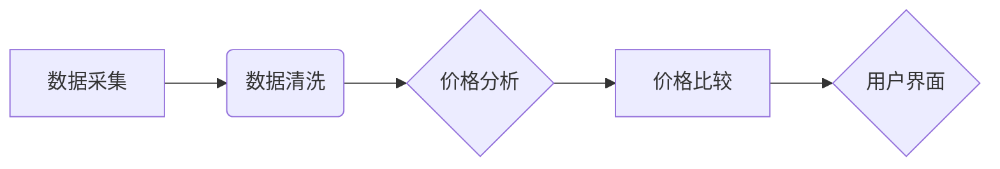

> 全网比价，AI算法，机器学习，深度学习，价格预测，电商平台，用户体验

## 1. 背景介绍

在当今数字经济时代，消费者在购买商品或服务时，往往需要比较多个电商平台的价格，以获得最优惠的交易方案。然而，手动搜索和比较价格不仅耗时费力，而且难以保证信息的准确性和及时性。随着人工智能技术的快速发展，全网比价系统逐渐成为解决这一痛点的有效解决方案。

全网比价系统利用人工智能算法，从海量电商平台的数据中提取商品信息，并进行价格分析和比较，为用户提供最优的价格选择。这种系统不仅可以节省用户的时间和精力，还可以帮助用户发现隐藏的优惠信息，提升购物体验。

## 2. 核心概念与联系

全网比价系统主要涉及以下核心概念：

* **数据采集**: 从电商平台抓取商品信息，包括商品名称、价格、规格、评价等。
* **数据清洗**: 对采集到的数据进行清洗和处理，去除无效信息，保证数据质量。
* **价格分析**: 利用机器学习算法分析商品价格趋势，识别价格波动规律。
* **价格比较**: 对不同平台的商品价格进行比较，提供最优惠的价格选项。
* **用户界面**: 提供简洁直观的界面，方便用户浏览和选择商品。

**核心架构流程图:**



## 3. 核心算法原理 & 具体操作步骤

### 3.1  算法原理概述

全网比价系统常用的算法包括：

* **价格预测**: 利用机器学习算法，预测商品未来价格变化趋势。常用的算法包括线性回归、支持向量机、神经网络等。
* **价格比较**: 利用规则引擎或机器学习算法，比较不同平台的商品价格，识别最优惠的价格选项。

### 3.2  算法步骤详解

**价格预测算法步骤:**

1. **数据收集**: 收集历史商品价格数据，包括时间、价格、商品属性等信息。
2. **数据预处理**: 对数据进行清洗、转换和特征工程，例如处理缺失值、归一化数据、提取特征等。
3. **模型训练**: 选择合适的机器学习算法，训练模型，并使用历史数据进行模型评估和调参。
4. **价格预测**: 利用训练好的模型，预测未来商品价格。

**价格比较算法步骤:**

1. **数据获取**: 从不同电商平台获取商品信息，包括价格、规格、评价等。
2. **数据匹配**: 根据商品属性进行匹配，找到相同或类似的商品。
3. **价格比较**: 对匹配到的商品价格进行比较，识别最优惠的价格选项。
4. **结果展示**: 将比较结果以图表或列表形式展示给用户。

### 3.3  算法优缺点

**价格预测算法:**

* **优点**: 可以预测未来价格趋势，帮助用户提前做出决策。
* **缺点**: 预测结果存在一定的误差，需要不断调整模型参数。

**价格比较算法:**

* **优点**: 可以快速比较不同平台的价格，帮助用户找到最优惠的选项。
* **缺点**: 算法需要考虑商品属性的匹配度，避免误判。

### 3.4  算法应用领域

全网比价系统广泛应用于以下领域：

* **电商平台**: 为用户提供商品价格比较服务，提升用户体验。
* **旅游平台**: 为用户提供机票、酒店、旅游套餐价格比较服务。
* **金融平台**: 为用户提供理财产品、贷款产品价格比较服务。

## 4. 数学模型和公式 & 详细讲解 & 举例说明

### 4.1  数学模型构建

价格预测模型通常采用回归模型，例如线性回归模型。

**线性回归模型**:

$$
y = \beta_0 + \beta_1x_1 + \beta_2x_2 + ... + \beta_nx_n + \epsilon
$$

其中：

* $y$ 是预测的价格
* $x_1, x_2, ..., x_n$ 是商品属性特征
* $\beta_0, \beta_1, ..., \beta_n$ 是模型参数
* $\epsilon$ 是误差项

### 4.2  公式推导过程

线性回归模型的参数可以通过最小二乘法估计。最小二乘法旨在找到使得模型预测值与实际值误差平方和最小的参数值。

### 4.3  案例分析与讲解

假设我们想要预测商品的价格，并已收集到以下数据：

* 商品属性特征：商品类别、品牌、尺寸、颜色
* 商品价格：100元、150元、200元、250元

我们可以使用线性回归模型对这些数据进行训练，并预测新商品的价格。

## 5. 项目实践：代码实例和详细解释说明

### 5.1  开发环境搭建

* Python 3.x
* Jupyter Notebook
* scikit-learn

### 5.2  源代码详细实现

```python
import pandas as pd
from sklearn.linear_model import LinearRegression
from sklearn.model_selection import train_test_split

# 加载数据
data = pd.read_csv('商品数据.csv')

# 提取特征和目标变量
X = data[['商品类别', '品牌', '尺寸', '颜色']]
y = data['价格']

# 将数据分为训练集和测试集
X_train, X_test, y_train, y_test = train_test_split(X, y, test_size=0.2, random_state=42)

# 创建线性回归模型
model = LinearRegression()

# 训练模型
model.fit(X_train, y_train)

# 预测测试集数据
y_pred = model.predict(X_test)

# 评估模型性能
from sklearn.metrics import mean_squared_error
mse = mean_squared_error(y_test, y_pred)
print(f'均方误差: {mse}')
```

### 5.3  代码解读与分析

* 首先，我们加载数据并提取特征和目标变量。
* 然后，我们将数据分为训练集和测试集，用于训练和评估模型。
* 接下来，我们创建线性回归模型并训练模型。
* 最后，我们使用训练好的模型预测测试集数据，并评估模型性能。

### 5.4  运行结果展示

运行代码后，会输出模型的均方误差值。均方误差值越小，模型的预测精度越高。

## 6. 实际应用场景

全网比价系统在电商平台、旅游平台、金融平台等领域都有广泛的应用场景。

### 6.1  电商平台

全网比价系统可以帮助电商平台用户快速比较商品价格，找到最优惠的选项。

### 6.2  旅游平台

全网比价系统可以帮助旅游平台用户比较机票、酒店、旅游套餐的价格，找到最适合自己的旅行方案。

### 6.3  金融平台

全网比价系统可以帮助金融平台用户比较理财产品、贷款产品的利率和费用，找到最适合自己的金融产品。

### 6.4  未来应用展望

随着人工智能技术的不断发展，全网比价系统将更加智能化、个性化。未来，全网比价系统将能够：

* 更准确地预测商品价格趋势。
* 更智能地识别用户需求，提供个性化的价格比较服务。
* 与其他服务平台进行整合，提供更全面的服务。

## 7. 工具和资源推荐

### 7.1  学习资源推荐

* **书籍**:
    * 《机器学习》 - 周志华
    * 《深度学习》 - Ian Goodfellow
* **在线课程**:
    * Coursera: Machine Learning
    * edX: Deep Learning

### 7.2  开发工具推荐

* **Python**: 
    * scikit-learn
    * TensorFlow
    * PyTorch

### 7.3  相关论文推荐

* **价格预测**:
    * "Price Prediction Using Machine Learning Techniques"
    * "Deep Learning for Price Forecasting"
* **价格比较**:
    * "A Comparative Study of Price Comparison Algorithms"
    * "Personalized Price Comparison Systems"

## 8. 总结：未来发展趋势与挑战

### 8.1  研究成果总结

全网比价系统是人工智能技术在电商领域的重要应用之一，它可以帮助用户节省时间和精力，找到最优惠的价格选项。

### 8.2  未来发展趋势

未来，全网比价系统将更加智能化、个性化，并与其他服务平台进行整合，提供更全面的服务。

### 8.3  面临的挑战

全网比价系统面临的主要挑战包括：

* 数据质量问题：全网比价系统需要依赖海量电商平台的数据，数据质量直接影响模型的预测精度。
* 价格波动问题：商品价格波动频繁，需要开发更 robust 的预测模型。
* 算法公平性问题：算法需要保证公平性，避免歧视性结果。

### 8.4  研究展望

未来，我们需要继续研究以下问题：

* 如何提高数据质量和数据获取效率。
* 如何开发更准确、更鲁棒的预测模型。
* 如何保证算法的公平性和透明性。


## 9. 附录：常见问题与解答

**常见问题**:

* 全网比价系统是否准确？

**解答**: 全网比价系统的准确性取决于模型的训练数据和算法的复杂度。一般来说，模型训练数据越丰富，算法越复杂，预测精度越高。

* 全网比价系统是否会泄露用户隐私？

**解答**: 好的全网比价系统会严格保护用户隐私，不会泄露用户的个人信息。

* 如何选择合适的全网比价系统？

**解答**: 选择全网比价系统时，需要考虑以下因素：

* 数据来源：系统的数据来源是否可靠？
* 算法精度：系统的预测精度如何？
* 用户体验：系统的界面是否友好？功能是否齐全？
* 安全性：系统是否能够保护用户隐私？


作者：禅与计算机程序设计艺术 / Zen and the Art of Computer Programming 
<end_of_turn>