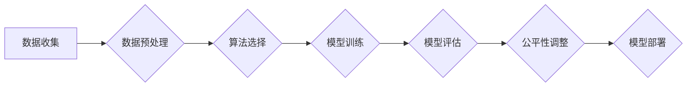

>  机器学习、公平性、偏见、算法、模型、代码实例、实践

## 1. 背景介绍

机器学习（Machine Learning）作为人工智能（Artificial Intelligence）的核心技术之一，在各个领域取得了显著的成就，例如图像识别、自然语言处理、推荐系统等。然而，随着机器学习模型在现实世界中的广泛应用，其潜在的公平性问题也日益受到关注。

机器学习模型的训练数据往往反映了社会中存在的偏见和不公平现象，导致模型在预测和决策时也可能产生不公平的结果，从而加剧社会不平等。例如，在招聘领域，如果训练数据中男性占据主导地位，那么模型可能会倾向于选择男性候选人，从而导致女性在招聘过程中处于劣势。

因此，公平机器学习（Fair Machine Learning）成为一个重要的研究方向，旨在通过算法设计、数据处理和模型评估等手段，确保机器学习模型在预测和决策时能够公平公正地对待所有个体。

## 2. 核心概念与联系

**2.1  公平性定义**

公平性是一个多方面概念，在机器学习领域，通常指机器学习模型在预测和决策时，对不同群体（例如性别、种族、年龄等）的个体应该给予平等的对待，避免产生不公平的结果。

**2.2  偏见来源**

机器学习模型的偏见主要来源于以下几个方面：

* **训练数据偏见:** 训练数据本身可能包含社会偏见，例如性别、种族、年龄等方面的偏见。
* **算法设计偏见:** 某些算法的设计本身可能导致对不同群体的个体产生不同的对待。
* **数据收集偏见:** 数据收集过程可能存在偏见，例如某些群体更容易被收集到数据，而另一些群体则更容易被忽略。

**2.3  公平性评估指标**

为了评估机器学习模型的公平性，需要使用一些专门的指标，例如：

* **均等机会指标 (Equal Opportunity):** 衡量模型对不同群体个体的预测结果是否具有相同的准确率。
* **差异化公平性指标 (Demographic Parity):** 衡量模型对不同群体个体的预测结果是否具有相同的分布。
* **因果公平性指标 (Causal Fairness):** 衡量模型在预测结果时是否考虑了个体的因果关系。

**2.4  公平性技术**

为了解决机器学习模型的公平性问题，可以采用以下一些技术手段：

* **数据预处理:** 对训练数据进行清洗和处理，消除数据中的偏见。
* **算法调整:** 设计新的算法，或者对现有算法进行调整，使其能够更加公平地对待不同群体个体。
* **模型解释:** 对机器学习模型进行解释，以便更好地理解模型的决策过程，并找出潜在的偏见。

**2.5  公平机器学习流程图**



## 3. 核心算法原理 & 具体操作步骤

### 3.1  算法原理概述

**3.1.1  敏感属性**

敏感属性是指与个体身份或特征相关的属性，例如性别、种族、年龄等。

**3.1.2  预测目标**

预测目标是指机器学习模型试图预测的属性，例如信用评分、招聘结果、医疗诊断等。

**3.1.3  公平约束**

公平约束是指在机器学习模型的训练过程中，需要满足一定的公平性要求，例如对不同群体个体的预测结果应该具有相同的准确率或分布。

### 3.2  算法步骤详解

**3.2.1  数据预处理**

* 识别敏感属性和预测目标。
* 清洗和处理数据，消除数据中的偏见。
* 对数据进行特征工程，提取有用的特征。

**3.2.2  算法选择**

选择合适的机器学习算法，例如逻辑回归、决策树、支持向量机等。

**3.2.3  模型训练**

使用训练数据训练机器学习模型，并根据公平约束进行优化。

**3.2.4  模型评估**

使用测试数据评估模型的性能，并使用公平性指标评估模型的公平性。

**3.2.5  模型部署**

将训练好的模型部署到生产环境中，并进行持续监控和评估。

### 3.3  算法优缺点

**优点:**

* 可以有效地减少机器学习模型的偏见。
* 可以提高模型的公平性，从而促进社会公平正义。

**缺点:**

* 算法设计复杂，需要专业的知识和经验。
* 难以完全消除数据中的偏见。
* 不同的公平性指标可能导致不同的模型结果。

### 3.4  算法应用领域

* **招聘:** 避免基于性别、种族等敏感属性进行招聘歧视。
* **金融:** 避免基于信用评分等敏感属性进行贷款歧视。
* **医疗:** 避免基于性别、种族等敏感属性进行医疗诊断歧视。
* **刑事司法:** 避免基于种族、年龄等敏感属性进行判刑歧视。

## 4. 数学模型和公式 & 详细讲解 & 举例说明

### 4.1  数学模型构建

假设我们有一个二分类问题，目标是预测个体是否属于某个特定群体。

* **X:** 个体特征向量
* **y:** 个体标签（0或1）
* **w:** 模型参数向量
* **f(X;w):** 模型预测函数

**4.1.1  损失函数:**

损失函数用于衡量模型预测结果与真实标签之间的差异。常用的损失函数包括交叉熵损失函数、平方损失函数等。

**4.1.2  正则化项:**

正则化项用于防止模型过拟合，并可以用来控制模型的复杂度。常用的正则化项包括L1正则化和L2正则化。

**4.1.3  公平约束:**

公平约束可以表示为以下形式：

$$
\sum_{i \in S_1} \left| f(X_i;w) - y_i \right| \leq \sum_{i \in S_2} \left| f(X_i;w) - y_i \right|
$$

其中，$S_1$和$S_2$分别代表两个不同的群体。

### 4.2  公式推导过程

通过优化损失函数和公平约束，可以得到模型参数w的最佳值。

**4.2.1  梯度下降法:**

梯度下降法是一种常用的优化算法，用于寻找损失函数的最小值。

**4.2.2  拉格朗日乘子法:**

拉格朗日乘子法是一种用于解决约束优化问题的数学方法。

### 4.3  案例分析与讲解

**4.3.1  案例描述:**

假设我们有一个预测信用卡申请是否成功的机器学习模型。

**4.3.2  公平性问题:**

如果模型训练数据中信用卡申请者的性别比例不均衡，那么模型可能会对女性申请者进行歧视。

**4.3.3  解决方案:**

可以使用公平约束来确保模型对不同性别申请者的预测结果具有相同的准确率。

## 5. 项目实践：代码实例和详细解释说明

### 5.1  开发环境搭建

* Python 3.x
* scikit-learn
* TensorFlow/PyTorch

### 5.2  源代码详细实现

```python
from sklearn.linear_model import LogisticRegression
from sklearn.model_selection import train_test_split
from sklearn.metrics import accuracy_score

# 加载数据
data = ...

# 分割数据
X_train, X_test, y_train, y_test = train_test_split(data.drop('target', axis=1), data['target'], test_size=0.2)

# 定义模型
model = LogisticRegression(penalty='l2', C=1.0)

# 训练模型
model.fit(X_train, y_train)

# 预测结果
y_pred = model.predict(X_test)

# 计算准确率
accuracy = accuracy_score(y_test, y_pred)

# 打印结果
print(f'Accuracy: {accuracy}')
```

### 5.3  代码解读与分析

* **数据加载和分割:** 加载数据并将其分割为训练集和测试集。
* **模型定义:** 使用逻辑回归模型进行分类。
* **模型训练:** 使用训练集训练模型。
* **模型预测:** 使用测试集预测结果。
* **结果评估:** 计算模型的准确率。

### 5.4  运行结果展示

运行代码后，会输出模型的准确率。

## 6. 实际应用场景

**6.1  医疗领域:**

* 预测患者的疾病风险，并根据患者的个人特征和医疗历史提供个性化的治疗方案。
* 辅助医生进行诊断，提高诊断的准确性和效率。

**6.2  金融领域:**

* 评估客户的信用风险，为贷款和保险等金融产品提供个性化的服务。
* 识别欺诈交易，保护金融机构和客户的利益。

**6.3  教育领域:**

* 预测学生的学习成绩，为学生提供个性化的学习建议。
* 辅助教师进行教学，提高教学效率和效果。

**6.4  未来应用展望:**

随着机器学习技术的不断发展，公平机器学习将在更多领域得到应用，例如自动驾驶、人脸识别、司法判决等。

## 7. 工具和资源推荐

### 7.1  学习资源推荐

* **书籍:**

    * "Fairness and Machine Learning" by  Sarah M. Bender, Timnit Gebru, Angelina McMillan-Major, and  Emily M. Bender
    * "Algorithmic Fairness" by  Virginia Eubanks

* **在线课程:**

    * Coursera: "Fairness in Machine Learning" by  Stanford University
    * edX: "Machine Learning Fairness" by  University of California, Berkeley

### 7.2  开发工具推荐

* **scikit-learn:** Python机器学习库，提供多种公平性算法和评估指标。
* **TensorFlow Fairness:** TensorFlow插件，用于构建和评估公平机器学习模型。
* **AIF360:** 开源工具包，用于公平性评估和算法调优。

### 7.3  相关论文推荐

* "On the Dangers of Stochastic Parrots: Can Language Models Be Too Big?" by  Bender et al. (2021)
* "Gender Shades: Intersectional Accuracy Disparities in Commercial Gender Classification" by  Buolamwini and Gebru (2018)

## 8. 总结：未来发展趋势与挑战

### 8.1  研究成果总结

近年来，公平机器学习领域取得了显著的进展，提出了多种算法和技术手段，并取得了一些成功案例。

### 8.2  未来发展趋势

* **更深入的理论研究:** 探索更有效的公平性算法和评估指标。
* **更广泛的应用场景:** 将公平机器学习应用到更多领域，例如自动驾驶、人脸识别等。
* **更强的解释性:** 开发更易于理解的公平机器学习模型，以便更好地解释模型的决策过程。

### 8.3  面临的挑战

* **数据偏见:** 数据中的偏见难以完全消除，需要不断探索新的数据处理方法。
* **公平性定义:** 公平性是一个多方面概念，缺乏统一的定义，需要进一步探讨和完善。
* **可解释性:** 许多公平机器学习算法难以解释，需要开发更易于理解的模型。

### 8.4  研究展望

公平机器学习是一个重要的研究方向，需要持续的努力和探索。未来，我们将继续关注公平机器学习的理论研究、算法开发、应用实践和伦理问题，努力构建更加公平、公正的智能世界。

## 9. 附录：常见问题与解答

**9.1  什么是公平机器学习？**

公平机器学习是指在机器学习模型的训练和应用过程中，确保模型对不同群体个体进行