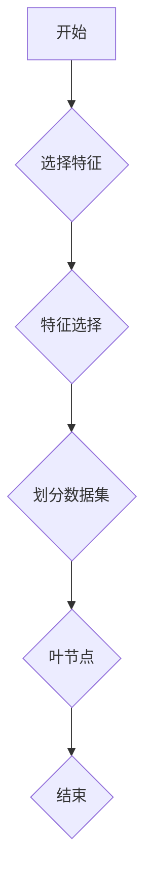

> 决策树、机器学习、分类、回归、特征选择、过拟合、剪枝、Python、scikit-learn

## 1. 背景介绍

决策树是一种常用的机器学习算法，它能够用于分类和回归任务。决策树的结构类似于人类的决策过程，通过一系列的判断条件，最终将数据分类或预测出一个数值。决策树算法易于理解和解释，并且能够处理各种类型的数据，包括连续型和离散型数据。

近年来，决策树算法在各个领域得到了广泛应用，例如：

* **医疗诊断:** 根据患者的症状和病史，预测疾病的类型。
* **金融风险评估:** 根据客户的信用记录和财务状况，评估贷款风险。
* **市场营销:** 根据客户的购买行为和偏好，预测客户的购买意愿。

## 2. 核心概念与联系

决策树的核心概念包括：

* **节点 (Node):** 代表一个决策变量或特征。
* **分支 (Branch):** 代表一个决策规则或条件。
* **叶节点 (Leaf Node):** 代表一个最终的决策结果或预测值。

决策树的构建过程可以看作是一个递归的过程，从根节点开始，不断地将数据分割成子集，直到每个子集包含了相同类型的样本或预测值。

**决策树构建流程图:**



## 3. 核心算法原理 & 具体操作步骤

### 3.1  算法原理概述

决策树算法的核心思想是通过选择最优的特征和划分阈值，将数据分割成尽可能纯净的子集。

**纯净度度量:**

常用的纯净度度量包括：

* **信息增益 (Information Gain):** 衡量特征选择后，数据集中信息的不确定性减少的程度。
* **基尼系数 (Gini Impurity):** 衡量数据集中不同类别的样本比例的差异程度。

**特征选择:**

决策树算法通常使用信息增益或基尼系数来选择最优的特征进行划分。

### 3.2  算法步骤详解

1. **选择初始数据集:** 从原始数据集中选择所有样本。
2. **选择最优特征:** 使用信息增益或基尼系数等度量，选择最优的特征进行划分。
3. **划分数据集:** 根据选择的特征和划分阈值，将数据集分割成子集。
4. **递归构建子树:** 对每个子集重复步骤 2-3，直到满足停止条件。
5. **生成叶节点:** 当子集中的样本属于同一类别或达到最大深度时，生成叶节点。

### 3.3  算法优缺点

**优点:**

* 易于理解和解释。
* 能够处理各种类型的数据。
* 训练速度快。

**缺点:**

* 容易过拟合。
* 对数据特征的顺序敏感。
* 对于高维数据，性能可能下降。

### 3.4  算法应用领域

决策树算法广泛应用于以下领域：

* **分类:** 识别邮件是否为垃圾邮件、预测客户是否会流失等。
* **回归:** 预测房价、股票价格等。
* **异常检测:** 识别网络攻击、欺诈交易等。

## 4. 数学模型和公式 & 详细讲解 & 举例说明

### 4.1  数学模型构建

决策树的数学模型可以看作是一个树形结构，其中每个节点代表一个决策变量或特征，每个分支代表一个决策规则或条件，每个叶节点代表一个最终的决策结果或预测值。

### 4.2  公式推导过程

**信息增益:**

$$
Gain(S,A) = Entropy(S) - \sum_{v \in Values(A)} \frac{|S_v|}{|S|} Entropy(S_v)
$$

其中:

* $S$ 是数据集。
* $A$ 是特征。
* $Values(A)$ 是特征 $A$ 的所有取值。
* $S_v$ 是特征 $A$ 取值为 $v$ 的子集。
* $Entropy(S)$ 是数据集 $S$ 的熵。

**熵:**

$$
Entropy(S) = - \sum_{c \in Classes} \frac{|S_c|}{|S|} log_2 \frac{|S_c|}{|S|}
$$

其中:

* $Classes$ 是数据集 $S$ 中所有类别的集合。
* $S_c$ 是类别 $c$ 的样本集合。

**基尼系数:**

$$
Gini(S) = 1 - \sum_{c \in Classes} \left( \frac{|S_c|}{|S|} \right)^2
$$

### 4.3  案例分析与讲解

假设我们有一个数据集，包含关于水果的特征，例如颜色、形状和大小，以及对应的类别，例如苹果、香蕉和橙子。

我们可以使用信息增益或基尼系数来选择最优的特征进行划分。例如，如果我们选择颜色作为特征，我们可以将数据集分割成红色、黄色和绿色三个子集。

然后，我们可以计算每个子集的熵或基尼系数，选择熵或基尼系数最低的子集作为最优划分。

## 5. 项目实践：代码实例和详细解释说明

### 5.1  开发环境搭建

* Python 3.x
* scikit-learn

### 5.2  源代码详细实现

```python
from sklearn.tree import DecisionTreeClassifier
from sklearn.datasets import load_iris
from sklearn.model_selection import train_test_split

# 加载鸢尾花数据集
iris = load_iris()
X = iris.data
y = iris.target

# 将数据分割成训练集和测试集
X_train, X_test, y_train, y_test = train_test_split(X, y, test_size=0.2, random_state=42)

# 创建决策树分类器
clf = DecisionTreeClassifier()

# 训练模型
clf.fit(X_train, y_train)

# 预测测试集
y_pred = clf.predict(X_test)

# 评估模型性能
from sklearn.metrics import accuracy_score
accuracy = accuracy_score(y_test, y_pred)
print(f"模型准确率: {accuracy}")
```

### 5.3  代码解读与分析

* **加载数据集:** 使用 `load_iris()` 函数加载鸢尾花数据集。
* **数据分割:** 使用 `train_test_split()` 函数将数据分割成训练集和测试集。
* **创建分类器:** 使用 `DecisionTreeClassifier()` 创建决策树分类器。
* **训练模型:** 使用 `fit()` 方法训练模型。
* **预测测试集:** 使用 `predict()` 方法预测测试集的类别。
* **评估模型性能:** 使用 `accuracy_score()` 函数计算模型的准确率。

### 5.4  运行结果展示

运行代码后，会输出模型的准确率。

## 6. 实际应用场景

### 6.1  医疗诊断

决策树算法可以用于预测疾病的类型，例如根据患者的症状和病史，预测是否患有糖尿病。

### 6.2  金融风险评估

决策树算法可以用于评估贷款风险，例如根据客户的信用记录和财务状况，预测是否会违约。

### 6.3  市场营销

决策树算法可以用于预测客户的购买意愿，例如根据客户的购买行为和偏好，预测是否会购买某个产品。

### 6.4  未来应用展望

随着机器学习技术的不断发展，决策树算法将在更多领域得到应用，例如：

* **个性化推荐:** 根据用户的兴趣和行为，推荐个性化的产品或服务。
* **自动驾驶:** 帮助自动驾驶汽车做出决策，例如判断是否需要刹车或转向。
* **自然语言处理:** 用于文本分类、情感分析等任务。

## 7. 工具和资源推荐

### 7.1  学习资源推荐

* **书籍:**
    * "The Elements of Statistical Learning" by Trevor Hastie, Robert Tibshirani, and Jerome Friedman
    * "Introduction to Machine Learning" by Ethem Alpaydin
* **在线课程:**
    * Coursera: Machine Learning by Andrew Ng
    * edX: Introduction to Artificial Intelligence

### 7.2  开发工具推荐

* **Python:** 
    * scikit-learn: 机器学习库
    * pandas: 数据处理库
    * matplotlib: 数据可视化库

### 7.3  相关论文推荐

* "Decision Trees" by J. Ross Quinlan
* "CART: Classification and Regression Trees" by Leo Breiman, Jerome Friedman, Charles Olshen, and Richard Stone

## 8. 总结：未来发展趋势与挑战

### 8.1  研究成果总结

决策树算法是一种简单易懂、易于实现的机器学习算法，在分类和回归任务中取得了不错的效果。

### 8.2  未来发展趋势

* **集成学习:** 将多个决策树组合起来，构建更强大的模型。
* **深度决策树:** 将深度学习技术应用于决策树算法，提高模型的表达能力。
* **可解释性:** 研究如何提高决策树模型的可解释性，使其更容易被理解和信任。

### 8.3  面临的挑战

* **过拟合:** 决策树算法容易过拟合，需要采用正则化技术来解决。
* **数据依赖性:** 决策树算法的性能依赖于数据的质量和特征选择。
* **高维数据:** 对于高维数据，决策树算法的性能可能下降。

### 8.4  研究展望

未来，决策树算法的研究将继续朝着更强大、更可解释的方向发展。


## 9. 附录：常见问题与解答

**1. 如何选择最优的特征进行划分？**

可以使用信息增益或基尼系数等度量来选择最优的特征。

**2. 如何防止决策树过拟合？**

可以使用正则化技术，例如剪枝，来防止决策树过拟合。

**3. 如何解释决策树的决策过程？**

可以通过查看决策树的结构，以及每个节点的特征和划分阈值，来理解决策树的决策过程。


作者：禅与计算机程序设计艺术 / Zen and the Art of Computer Programming 
<end_of_turn>