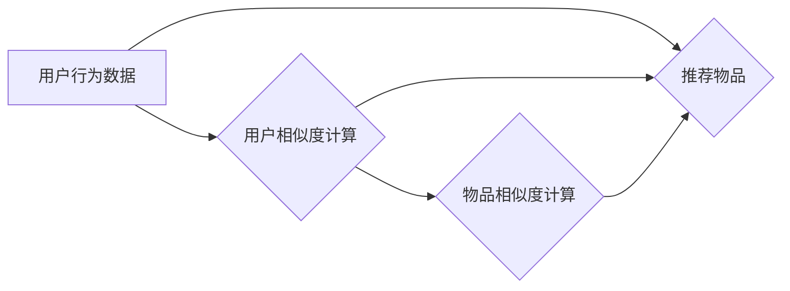

> 协同过滤，推荐系统，矩阵分解，用户相似度，物品相似度，协同过滤算法，代码实现

## 1. 背景介绍

在信息爆炸的时代，海量数据和信息涌现，如何有效地从其中筛选出用户感兴趣的内容成为了一个关键问题。推荐系统应运而生，它通过分析用户行为和物品特征，预测用户对特定物品的兴趣，从而提供个性化的推荐。协同过滤作为推荐系统中一种重要的算法，凭借其简单易懂、效果显著的特点，在电商、社交媒体、音乐平台等领域得到了广泛应用。

## 2. 核心概念与联系

协同过滤的核心思想是：**“用户相似，则喜好相似”。** 

它通过分析用户对物品的评分或行为数据，找出具有相似兴趣的用户或物品，并根据这些相似性来进行推荐。

**协同过滤的两种主要类型：**

* **基于用户相似度的协同过滤:** 
    * 寻找与目标用户兴趣相似的其他用户，并推荐这些用户喜欢的物品。
* **基于物品相似度的协同过滤:** 
    * 寻找与目标物品相关的其他物品，并推荐这些物品。

**协同过滤流程图:**



## 3. 核心算法原理 & 具体操作步骤

### 3.1  算法原理概述

协同过滤算法的核心是计算用户之间的相似度或物品之间的相似度。常用的相似度度量方法包括：

* **皮尔逊相关系数:** 衡量两个用户或物品评分之间的线性相关性。
* **余弦相似度:** 衡量两个用户或物品评分向量的夹角。
* **杰卡德相似度:** 衡量两个用户或物品共同喜欢的物品的比例。

### 3.2  算法步骤详解

**基于用户相似度的协同过滤算法步骤:**

1. **收集用户行为数据:** 收集用户对物品的评分、购买记录、浏览历史等数据。
2. **计算用户相似度:** 使用上述相似度度量方法计算用户之间的相似度。
3. **寻找与目标用户相似的用户:** 根据目标用户的兴趣，找到与其相似度最高的k个用户。
4. **推荐目标用户喜欢的物品:** 从相似用户的评分数据中，找出目标用户未评分或评分较低的物品，并根据这些物品的平均评分进行推荐。

**基于物品相似度的协同过滤算法步骤:**

1. **收集用户行为数据:** 收集用户对物品的评分、购买记录、浏览历史等数据。
2. **计算物品相似度:** 使用上述相似度度量方法计算物品之间的相似度。
3. **寻找与目标物品相似的物品:** 根据目标用户的兴趣，找到与其相似度最高的k个物品。
4. **推荐目标用户可能喜欢的物品:** 从相似物品中，找出目标用户未评分或评分较低的物品，并根据这些物品的平均评分进行推荐。

### 3.3  算法优缺点

**优点:**

* **效果显著:** 协同过滤算法能够根据用户的历史行为和物品的关联性，提供个性化的推荐，提高推荐的准确性和用户满意度。
* **易于理解和实现:** 协同过滤算法的原理相对简单，易于理解和实现。

**缺点:**

* **冷启动问题:** 当用户或物品数据不足时，协同过滤算法难以准确地计算相似度，导致推荐效果不佳。
* **数据稀疏性问题:** 用户对物品的评分数据往往是稀疏的，这会影响算法的准确性。
* **数据偏差问题:** 用户评分数据可能存在偏差，例如评分倾斜或虚假评分，这会影响算法的准确性。

### 3.4  算法应用领域

协同过滤算法广泛应用于以下领域:

* **电商推荐:** 推荐商品、优惠券、促销活动等。
* **社交媒体推荐:** 推荐好友、群组、内容等。
* **音乐平台推荐:** 推荐歌曲、专辑、艺术家等。
* **视频平台推荐:** 推荐视频、电影、电视剧等。

## 4. 数学模型和公式 & 详细讲解 & 举例说明

### 4.1  数学模型构建

协同过滤算法的核心是计算用户之间的相似度或物品之间的相似度。常用的数学模型包括：

* **皮尔逊相关系数:**

$$
r_{ij} = \frac{\sum_{k=1}^{n}(u_{ik} - \bar{u}_i)(v_{jk} - \bar{v}_j)}{\sqrt{\sum_{k=1}^{n}(u_{ik} - \bar{u}_i)^2}\sqrt{\sum_{k=1}^{n}(v_{jk} - \bar{v}_j)^2}}
$$

其中:

* $r_{ij}$: 用户 $i$ 和用户 $j$ 之间的皮尔逊相关系数。
* $u_{ik}$: 用户 $i$ 对物品 $k$ 的评分。
* $\bar{u}_i$: 用户 $i$ 的平均评分。
* $v_{jk}$: 用户 $j$ 对物品 $k$ 的评分。
* $\bar{v}_j$: 用户 $j$ 的平均评分。

* **余弦相似度:**

$$
sim_{ij} = \frac{u_i \cdot u_j}{||u_i|| ||u_j||}
$$

其中:

* $sim_{ij}$: 用户 $i$ 和用户 $j$ 之间的余弦相似度。
* $u_i$: 用户 $i$ 的评分向量。
* $u_j$: 用户 $j$ 的评分向量。
* $||u_i||$: 用户 $i$ 的评分向量的长度。
* $||u_j||$: 用户 $j$ 的评分向量的长度。

### 4.2  公式推导过程

上述公式的推导过程可以参考相关机器学习和数据挖掘教材。

### 4.3  案例分析与讲解

假设有两个用户 $A$ 和 $B$，他们对三部电影 $A$, $B$, $C$ 的评分如下:

| 用户 | 电影 $A$ | 电影 $B$ | 电影 $C$ |
|---|---|---|---|
| $A$ | 5 | 3 | 4 |
| $B$ | 4 | 5 | 3 |

我们可以使用皮尔逊相关系数计算用户 $A$ 和 $B$ 之间的相似度:

$$
r_{AB} = \frac{(5-4)(3-4) + (3-4)(5-4) + (4-4)(3-4)}{\sqrt{(5-4)^2 + (3-4)^2 + (4-4)^2}\sqrt{(4-4)^2 + (5-4)^2 + (3-4)^2}} = -0.5
$$

结果表明，用户 $A$ 和 $B$ 之间的相似度为 -0.5，说明他们兴趣相差较大。

## 5. 项目实践：代码实例和详细解释说明

### 5.1  开发环境搭建

* Python 3.x
* Pandas
* Scikit-learn

### 5.2  源代码详细实现

```python
import pandas as pd
from sklearn.metrics.pairwise import cosine_similarity

# 加载用户评分数据
ratings = pd.read_csv('ratings.csv')

# 计算用户之间的余弦相似度
user_similarity = cosine_similarity(ratings)

# 寻找与目标用户相似的用户
target_user = 1
similar_users = user_similarity[target_user].argsort()[:-6:-1]  # 取前5个相似用户

# 推荐目标用户可能喜欢的物品
recommended_items = []
for similar_user in similar_users:
    rated_items = ratings[ratings.user_id == similar_user].item_id.unique()
    for item in rated_items:
        if item not in ratings[ratings.user_id == target_user].item_id.unique():
            recommended_items.append(item)

# 打印推荐结果
print(f'推荐给用户 {target_user} 的物品: {recommended_items}')
```

### 5.3  代码解读与分析

* 代码首先加载用户评分数据，并使用 Scikit-learn 库的 `cosine_similarity` 函数计算用户之间的余弦相似度。
* 然后，代码根据目标用户的 ID 找到与其相似度最高的 k 个用户。
* 最后，代码遍历相似用户的评分数据，找出目标用户未评分的物品，并将其作为推荐结果。

### 5.4  运行结果展示

运行代码后，将输出目标用户可能喜欢的物品列表。

## 6. 实际应用场景

协同过滤算法在各种实际应用场景中发挥着重要作用，例如:

* **电商推荐:** 淘宝、京东等电商平台利用协同过滤算法推荐商品、优惠券、促销活动等，提高用户购物体验。
* **社交媒体推荐:** Facebook、Twitter 等社交媒体平台利用协同过滤算法推荐好友、群组、内容等，增强用户粘性。
* **音乐平台推荐:** Spotify、Apple Music 等音乐平台利用协同过滤算法推荐歌曲、专辑、艺术家等，帮助用户发现新音乐。

### 6.4  未来应用展望

随着人工智能技术的不断发展，协同过滤算法将更加智能化、个性化。未来，协同过滤算法可能应用于以下领域:

* **个性化教育:** 根据学生的学习行为和兴趣，推荐个性化的学习资源。
* **医疗保健:** 根据患者的病史和症状，推荐个性化的治疗方案。
* **金融服务:** 根据用户的投资行为和风险偏好，推荐个性化的投资产品。

## 7. 工具和资源推荐

### 7.1  学习资源推荐

* **书籍:**
    * 推荐系统实践
    * 协同过滤算法
* **在线课程:**
    * Coursera: Recommender Systems
    * Udacity: Machine Learning Engineer Nanodegree

### 7.2  开发工具推荐

* **Python:** 
    * Pandas
    * Scikit-learn
    * TensorFlow
    * PyTorch

### 7.3  相关论文推荐

* **Collaborative Filtering for Implicit Feedback Datasets**
* **Matrix Factorization Techniques for Recommender Systems**

## 8. 总结：未来发展趋势与挑战

### 8.1  研究成果总结

协同过滤算法在推荐系统领域取得了显著成果，为用户提供个性化的推荐服务，提高用户体验。

### 8.2  未来发展趋势

* **深度学习:** 将深度学习技术应用于协同过滤算法，提高算法的准确性和效率。
* **多模态推荐:** 将文本、图像、视频等多模态数据融合到协同过滤算法中，提供更丰富的推荐结果。
* **联邦学习:** 利用联邦学习技术，在保护用户隐私的前提下进行协同过滤算法训练。

### 8.3  面临的挑战

* **数据稀疏性:** 用户评分数据往往是稀疏的，如何有效地处理数据稀疏性问题仍然是一个挑战。
* **冷启动问题:** 当用户或物品数据不足时，协同过滤算法难以准确地计算相似度，如何解决冷启动问题也是一个挑战。
* **数据偏差:** 用户评分数据可能存在偏差，如何识别和处理数据偏差也是一个挑战。

### 8.4  研究展望

未来，协同过滤算法的研究将继续深入，探索更有效的算法模型、更强大的计算能力和更智能的推荐策略，为用户提供更个性化、更精准的推荐服务。

## 9. 附录：常见问题与解答

**Q1: 协同过滤算法的冷启动问题如何解决？**

**A1:** 

* **利用用户画像:** 通过用户 demographics、兴趣爱好等信息，构建用户画像，进行推荐。
* **利用物品属性:** 利用物品的类别、描述等属性信息，进行推荐。
* **利用内容过滤:** 将内容过滤算法与协同过滤算法结合，利用物品内容信息进行推荐。

**Q2: 协同过滤算法的数据稀疏性问题如何解决？**

**A2:** 

* **矩阵分解:** 将