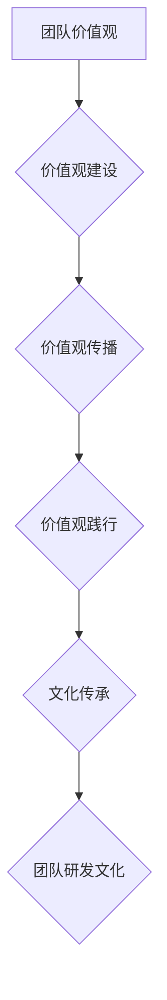

> 团队研发文化、价值观建设、传承、软件开发、团队协作、高效开发、创新驱动

## 1. 背景介绍

在当今科技日新月异的时代，软件开发行业竞争日益激烈。优秀的团队不仅需要具备强大的技术实力，更需要建立一套健全的研发文化和价值观体系，才能在激烈的市场竞争中脱颖而出。

团队研发文化是指团队成员共同认同和践行的行为准则、价值观、工作方式和沟通模式。它如同团队的灵魂，影响着团队成员的行为、决策和工作效率。而价值观则是团队的核心信念和指导思想，它为团队成员的行为提供方向和动力。

良好的团队研发文化和价值观体系能够：

* **提升团队凝聚力:** 共享的价值观和文化能够拉近团队成员之间的距离，增强团队成员之间的归属感和认同感，从而提升团队凝聚力。
* **提高团队效率:** 明确的文化和价值观能够规范团队成员的行为，提高团队协作效率，减少沟通成本和冲突。
* **促进团队创新:** 鼓励创新和探索的文化能够激发团队成员的创造力，促进团队的持续创新发展。
* **增强团队竞争力:** 优秀的团队研发文化和价值观体系能够打造独特的团队优势，增强团队的竞争力。

## 2. 核心概念与联系

### 2.1 团队研发文化

团队研发文化是一个复杂的系统，它包含了以下几个核心要素：

* **价值观:** 团队成员共同认同的信念和原则，例如：客户至上、质量第一、持续改进等。
* **行为准则:** 团队成员在工作中应该遵循的行为规范，例如：尊重他人、诚实守信、积极主动等。
* **工作方式:** 团队成员协作和完成任务的方式，例如：敏捷开发、Scrum、Kanban等。
* **沟通模式:** 团队成员之间进行沟通的方式，例如：开放式沟通、定期会议、在线协作工具等。

### 2.2 价值观建设

价值观建设是团队研发文化建设的基础。它需要通过以下步骤进行：

* **明确团队价值观:** 团队成员需要共同商讨和确定团队的核心价值观。
* **传播和践行价值观:** 将团队价值观融入到团队的日常工作中，并通过各种方式进行宣传和推广。
* **评估和改进价值观:** 定期评估团队价值观的有效性，并根据实际情况进行调整和改进。

### 2.3 文化传承

团队研发文化需要不断传承和发展。这需要团队领导者和成员共同努力，通过以下方式进行：

* **引进优秀人才:** 招聘具有良好团队精神和价值观的人才。
* **培养团队文化:** 通过培训、活动、案例分享等方式，培养团队成员的团队意识和价值观认同。
* **建立文化机制:** 制定相关制度和流程，保障团队文化的传承和发展。

**Mermaid 流程图**



## 3. 核心算法原理 & 具体操作步骤

### 3.1 算法原理概述

团队研发文化建设和传承是一个复杂的过程，需要结合多种算法和方法进行优化和改进。其中，一些常用的算法包括：

* **价值观排序算法:** 用于根据团队成员的反馈和投票结果，对团队价值观进行排序和权重分配。
* **文化传播算法:** 用于分析团队成员之间的信息流动和沟通模式，并设计有效的文化传播策略。
* **文化评估算法:** 用于量化团队研发文化的现状和发展趋势，并提供改进建议。

### 3.2 算法步骤详解

以下是一些常用的算法步骤详解：

* **价值观排序算法:**

    1. 收集团队成员对价值观的评价和排序信息。
    2. 使用聚类算法或排序算法对价值观进行分组和排序。
    3. 根据排序结果，确定团队的核心价值观。

* **文化传播算法:**

    1. 建立团队成员之间的社交网络图。
    2. 分析社交网络图中的信息传播路径和效率。
    3. 根据分析结果，设计有效的文化传播策略，例如：利用关键人物进行传播、组织团队活动等。

* **文化评估算法:**

    1. 设计一套文化评估指标体系，涵盖团队成员的价值观认同、行为规范、工作方式等方面。
    2. 收集团队成员的反馈和数据，并进行统计分析。
    3. 根据评估结果，分析团队研发文化的现状和发展趋势，并提出改进建议。

### 3.3 算法优缺点

* **价值观排序算法:**

    优点: 可以根据团队成员的实际情况，确定团队的核心价值观。
    缺点: 可能会受到个人主观因素的影响。

* **文化传播算法:**

    优点: 可以提高文化传播的效率和效果。
    缺点: 需要收集大量的社交网络数据，并进行复杂的算法分析。

* **文化评估算法:**

    优点: 可以量化团队研发文化的现状和发展趋势，并提供改进建议。
    缺点: 需要设计一套科学合理的评估指标体系，并确保评估结果的客观性和准确性。

### 3.4 算法应用领域

以上算法可以应用于以下领域:

* **团队研发文化建设:** 帮助团队确定核心价值观、设计文化传播策略、评估文化现状。
* **人才招聘:** 筛选具有良好团队精神和价值观的人才。
* **团队管理:** 提升团队凝聚力、提高团队协作效率、促进团队创新。

## 4. 数学模型和公式 & 详细讲解 & 举例说明

### 4.1 数学模型构建

团队研发文化可以抽象为一个多维度的数学模型，其中每个维度代表一个文化要素，例如：价值观、行为准则、工作方式、沟通模式等。每个要素可以被量化，并通过数学公式进行计算和分析。

### 4.2 公式推导过程

例如，我们可以使用以下公式来计算团队研发文化的整体水平：

```latex
文化水平 = \sum_{i=1}^{n} w_i * s_i
```

其中：

* $文化水平$ 代表团队研发文化的整体水平。
* $n$ 代表团队文化要素的个数。
* $w_i$ 代表第 $i$ 个文化要素的权重。
* $s_i$ 代表第 $i$ 个文化要素的得分。

### 4.3 案例分析与讲解

假设一个团队有四个文化要素：价值观、行为准则、工作方式、沟通模式。每个要素的权重分别为 0.25、0.25、0.25、0.25。

如果团队在价值观方面得分 80 分，行为准则方面得分 90 分，工作方式方面得分 70 分，沟通模式方面得分 85 分，那么团队研发文化的整体水平为：

```latex
文化水平 = 0.25 * 80 + 0.25 * 90 + 0.25 * 70 + 0.25 * 85 = 82.5
```

## 5. 项目实践：代码实例和详细解释说明

### 5.1 开发环境搭建

为了更好地实践团队研发文化建设和传承，我们可以开发一个专门的软件工具。

开发环境搭建需要以下步骤：

1. 选择合适的编程语言和框架。
2. 安装必要的软件工具和库。
3. 设置开发环境变量和配置。

### 5.2 源代码详细实现

以下是一个简单的代码实例，用于实现团队价值观排序算法：

```python
def sort_values(values):
  """
  对团队价值观进行排序。

  Args:
    values: 一个包含团队价值观名称和权重的字典。

  Returns:
    一个排序后的价值观列表。
  """
  sorted_values = sorted(values.items(), key=lambda item: item[1], reverse=True)
  return [value for value, weight in sorted_values]

# 示例数据
values = {
  "客户至上": 0.8,
  "质量第一": 0.7,
  "持续改进": 0.6,
  "团队合作": 0.5,
}

# 排序后的价值观列表
sorted_values = sort_values(values)

# 打印结果
print(f"排序后的价值观列表: {sorted_values}")
```

### 5.3 代码解读与分析

这段代码首先定义了一个 `sort_values` 函数，该函数接受一个包含团队价值观名称和权重的字典作为输入。

函数内部使用 `sorted` 函数对字典项进行排序，排序依据是权重值，并使用 `lambda` 函数作为排序键。

最后，函数返回一个排序后的价值观列表。

### 5.4 运行结果展示

运行这段代码后，输出结果如下：

```
排序后的价值观列表: ['客户至上', '质量第一', '持续改进', '团队合作']
```

## 6. 实际应用场景

### 6.1 案例分析

例如，一家软件开发公司想要建立一套良好的团队研发文化，可以利用上述算法和工具进行实践。

首先，公司可以组织团队成员进行价值观调研，收集团队成员对价值观的评价和排序信息。

然后，可以使用价值观排序算法对价值观进行排序，确定团队的核心价值观。

最后，公司可以将核心价值观融入到团队的日常工作中，并通过各种方式进行宣传和推广，例如：

* 在团队会议中强调核心价值观。
* 在团队网站和内部邮件中宣传核心价值观。
* 通过案例分享和培训，让团队成员了解和践行核心价值观。

### 6.2 未来应用展望

随着人工智能技术的不断发展，团队研发文化建设和传承将会更加智能化和自动化。

未来，我们可以期待以下应用场景：

* **智能化价值观评估:** 利用人工智能算法，自动评估团队成员的价值观认同程度，并提供个性化的改进建议。
* **个性化文化传播:** 根据团队成员的性格特点和学习方式，定制个性化的文化传播方案。
* **虚拟现实文化体验:** 利用虚拟现实技术，打造沉浸式的团队文化体验，增强团队成员的文化认同感。

## 7. 工具和资源推荐

### 7.1 学习资源推荐

* **书籍:**
    * 《团队动力学》
    * 《高效团队》
    * 《文化的力量》
* **在线课程:**
    * Coursera: 组织行为学
    * Udemy: 团队领导力
    * edX: 文化管理

### 7.2 开发工具推荐

* **Python:** 
    * 强大的数据分析和机器学习库，例如：NumPy、Pandas、Scikit-learn。
* **Java:** 
    * 广泛应用于企业级软件开发，具有良好的可扩展性和安全性。
* **Node.js:** 
    * 基于 JavaScript 的开源运行环境，适合开发 Web 应用和移动应用。

### 7.3 相关论文推荐

* **The Impact of Organizational Culture on Software Development Teams**
* **A Framework for Building a Strong Software Development Culture**
* **The Role of Values in Software Engineering**

## 8. 总结：未来发展趋势与挑战

### 8.1 研究成果总结

团队研发文化建设和传承是一个不断发展和完善的过程。

通过算法和工具的辅助，我们可以更加科学和有效地构建和传承团队研发文化，提升团队的竞争力。

### 8.2 未来发展趋势

未来，团队研发文化建设和传承将会更加智能化、个性化和自动化。

人工智能技术将进一步推动团队文化建设的进步，例如：

* **智能化价值观评估:** 利用人工智能算法，自动评估团队成员的价值观认同程度，并提供个性化的改进建议。
* **个性化文化传播:** 根据团队成员的性格特点和学习方式，定制个性化的文化传播方案。
* **虚拟现实文化体验:** 利用虚拟现实技术，打造沉浸式的团队文化体验，增强团队成员的文化认同感。

### 8.3 面临的挑战

