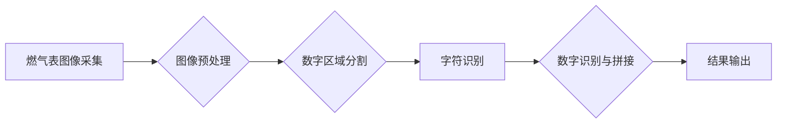

> 燃气表，图像识别，深度学习，OCR，计算机视觉，智能化

## 1. 背景介绍

随着智能化时代的到来，燃气行业也开始寻求数字化转型，以提高效率、降低成本和提升用户体验。燃气表作为燃气计量的重要设备，其读数一直依赖人工操作，存在效率低、易出错等问题。基于图像识别的燃气表示数读取技术，利用计算机视觉和深度学习技术，可以自动识别燃气表上的数字，实现燃气表读数的自动化和智能化。

燃气表读数的自动化不仅可以提高工作效率，还能减少人为错误，提高燃气计量数据的准确性。同时，还可以为燃气公司提供更精准的燃气使用数据，为制定燃气价格、优化燃气供应等方面提供决策支持。

## 2. 核心概念与联系

### 2.1 燃气表图像识别

燃气表图像识别是指利用计算机视觉技术，从燃气表图像中提取数字信息的过程。

### 2.2 深度学习

深度学习是一种机器学习的子领域，它利用多层神经网络来模拟人类大脑的学习过程，能够从海量数据中学习复杂的特征，并进行精准的预测和分类。

### 2.3 OCR（光学字符识别）

OCR技术是指利用计算机识别和转换图像中的文字信息为可编辑文本的过程。

**核心概念与架构流程图**



## 3. 核心算法原理 & 具体操作步骤

### 3.1 算法原理概述

基于图像识别的燃气表示数读取技术主要包括以下几个步骤：

1. **图像采集:** 使用摄像头或扫描仪采集燃气表图像。
2. **图像预处理:** 对采集到的图像进行预处理，例如灰度化、去噪、二值化等，以提高图像质量和识别精度。
3. **数字区域分割:** 从预处理后的图像中分割出数字区域，去除背景干扰。
4. **字符识别:** 利用OCR技术识别每个数字字符。
5. **数字识别与拼接:** 将识别出的数字字符拼接成完整的燃气表读数。

### 3.2 算法步骤详解

**1. 图像采集:**

可以使用摄像头或扫描仪采集燃气表图像。

* **摄像头采集:** 可以使用手机摄像头或工业相机进行采集，需要确保摄像头与燃气表保持适当的距离和角度，以保证图像清晰完整。
* **扫描仪采集:** 使用扫描仪可以获得更高分辨率的图像，但需要将燃气表放置在扫描仪上进行扫描。

**2. 图像预处理:**

图像预处理可以提高图像识别精度。常用的预处理方法包括：

* **灰度化:** 将彩色图像转换为灰度图像，减少图像信息量，提高识别速度。
* **去噪:** 去除图像中的噪声，例如椒盐噪声、高斯噪声等，以提高图像质量。
* **二值化:** 将图像转换为黑白图像，将数字区域与背景区分开来。

**3. 数字区域分割:**

数字区域分割是指从预处理后的图像中分割出数字区域，去除背景干扰。常用的分割方法包括：

* **阈值分割:** 根据图像灰度值设置阈值，将图像分割成前景和背景。
* **边缘检测:** 利用图像边缘信息进行分割，例如Canny边缘检测算法。
* **形态学操作:** 使用膨胀、腐蚀等形态学操作对图像进行分割。

**4. 字符识别:**

利用OCR技术识别每个数字字符。常用的OCR算法包括：

* **模板匹配:** 将图像中的数字字符与预先定义的模板进行匹配，识别出字符类型。
* **深度学习:** 利用深度学习模型，例如卷积神经网络（CNN），从图像中学习数字字符的特征，进行识别。

**5. 数字识别与拼接:**

将识别出的数字字符拼接成完整的燃气表读数。

### 3.3 算法优缺点

**优点:**

* 自动化程度高，提高工作效率。
* 减少人为错误，提高数据准确性。
* 可以为燃气公司提供更精准的燃气使用数据。

**缺点:**

* 对图像质量要求较高，图像模糊或角度不正确会导致识别精度下降。
* 不同类型的燃气表，数字样式可能不同，需要针对不同类型进行训练。
* 需要大量的训练数据，才能保证识别精度。

### 3.4 算法应用领域

* 燃气计量管理
* 燃气安全监测
* 燃气数据分析
* 智能家居

## 4. 数学模型和公式 & 详细讲解 & 举例说明

### 4.1 数学模型构建

燃气表图像识别可以看作是一个图像分类问题，目标是将输入的图像分类为不同的燃气表读数类别。可以使用深度学习模型，例如卷积神经网络（CNN），构建数学模型。

CNN模型由多个卷积层、池化层和全连接层组成。卷积层用于提取图像特征，池化层用于降低特征维度，全连接层用于分类。

### 4.2 公式推导过程

CNN模型的训练过程是通过反向传播算法来更新模型参数的。反向传播算法的核心是计算损失函数的梯度，并根据梯度更新模型参数。

损失函数通常使用交叉熵损失函数，其公式如下：

$$
L = -\sum_{i=1}^{N} y_i \log(p_i)
$$

其中：

* $L$ 是损失函数值
* $N$ 是样本数量
* $y_i$ 是真实标签
* $p_i$ 是模型预测的概率

### 4.3 案例分析与讲解

假设我们有一个训练数据集，包含1000张燃气表图像，每张图像对应一个燃气表读数。我们可以使用CNN模型对这些图像进行训练，学习燃气表读数的特征。

训练完成后，我们可以使用训练好的模型对新的燃气表图像进行识别。模型会将输入图像分类为不同的燃气表读数类别，并输出每个类别的概率。

## 5. 项目实践：代码实例和详细解释说明

### 5.1 开发环境搭建

* 操作系统：Windows/Linux/macOS
* Python版本：3.6+
* 深度学习框架：TensorFlow/PyTorch
* 图像处理库：OpenCV

### 5.2 源代码详细实现

```python
# 导入必要的库
import tensorflow as tf
from tensorflow.keras.models import Sequential
from tensorflow.keras.layers import Conv2D, MaxPooling2D, Flatten, Dense

# 定义CNN模型
model = Sequential()
model.add(Conv2D(32, (3, 3), activation='relu', input_shape=(image_height, image_width, 3)))
model.add(MaxPooling2D((2, 2)))
model.add(Conv2D(64, (3, 3), activation='relu'))
model.add(MaxPooling2D((2, 2)))
model.add(Flatten())
model.add(Dense(10, activation='softmax'))

# 编译模型
model.compile(optimizer='adam', loss='categorical_crossentropy', metrics=['accuracy'])

# 训练模型
model.fit(train_images, train_labels, epochs=10, batch_size=32)

# 评估模型
loss, accuracy = model.evaluate(test_images, test_labels)
print('Loss:', loss)
print('Accuracy:', accuracy)

# 使用模型预测
predictions = model.predict(new_image)
```

### 5.3 代码解读与分析

* **模型定义:** 代码定义了一个简单的CNN模型，包含两个卷积层、两个池化层、一个全连接层和一个输出层。
* **模型编译:** 使用Adam优化器、交叉熵损失函数和准确率作为评估指标编译模型。
* **模型训练:** 使用训练数据训练模型，设置训练轮数和批处理大小。
* **模型评估:** 使用测试数据评估模型的性能，输出损失值和准确率。
* **模型预测:** 使用训练好的模型对新的图像进行预测，输出每个类别的概率。

### 5.4 运行结果展示

训练完成后，可以将模型应用于实际场景，例如对燃气表图像进行识别，并输出燃气表读数。

## 6. 实际应用场景

### 6.1 燃气计量管理

燃气表读数自动化可以提高燃气计量管理的效率，减少人工成本，并提高数据准确性。

### 6.2 燃气安全监测

燃气表读数可以用于监测燃气使用情况，例如识别异常燃气使用情况，及时进行安全预警。

### 6.3 燃气数据分析

燃气表读数数据可以用于分析燃气使用趋势，例如识别高峰期和低谷期，优化燃气供应。

### 6.4 未来应用展望

随着人工智能技术的不断发展，燃气表读数技术将更加智能化和自动化。未来，燃气表读数技术可能应用于以下领域：

* 智能家居：燃气表读数可以与智能家居系统集成，实现燃气使用情况的实时监控和控制。
* 燃气泄漏检测：燃气表读数可以用于检测燃气泄漏，及时报警。
* 燃气价格优化：燃气表读数数据可以用于优化燃气价格，根据燃气使用情况进行动态调整。

## 7. 工具和资源推荐

### 7.1 学习资源推荐

* **书籍:**
    * 深度学习
    * 计算机视觉
* **在线课程:**
    * Coursera
    * edX
    * Udacity

### 7.2 开发工具推荐

* **Python:** 
* **TensorFlow:** 
* **PyTorch:** 
* **OpenCV:**

### 7.3 相关论文推荐

* **基于深度学习的燃气表读数识别方法**
* **图像识别技术在燃气计量中的应用**

## 8. 总结：未来发展趋势与挑战

### 8.1 研究成果总结

基于图像识别的燃气表示数读取技术取得了显著的进展，能够实现燃气表读数的自动化和智能化。

### 8.2 未来发展趋势

未来，燃气表读数技术将朝着以下方向发展：

* **更准确的识别精度:** 通过改进算法和训练数据，提高燃气表读数的识别精度。
* **更广泛的应用场景:** 将燃气表读数技术应用于更多领域，例如燃气安全监测、燃气数据分析等。
* **更智能化的功能:** 将燃气表读数技术与其他人工智能技术结合，实现更智能化的功能，例如燃气泄漏检测、燃气价格优化等。

### 8.3 面临的挑战

燃气表读数技术还面临一些挑战：

* **图像质量问题:** 不同类型的燃气表，数字样式可能不同，图像质量问题会影响识别精度。
* **数据标注问题:** 训练深度学习模型需要大量的标注数据，数据标注成本较高。
* **算法复杂度问题:** 深度学习模型的训练和推理过程比较复杂，需要强大的计算资源。

### 8.4 研究展望

未来，我们将继续研究和开发燃气表读数技术，提高其准确性、效率和智能化程度，为燃气行业提供更先进的技术解决方案。

## 9. 附录：常见问题与解答

**1. 燃气表读数识别精度如何？**

燃气表读数识别的精度取决于多种因素，例如图像质量、算法模型、训练数据等。一般来说，经过充分训练的模型可以达到95%以上的识别精度。

**2. 燃气表读数识别需要哪些硬件设备？**

燃气表读数识别可以利用摄像头或扫描仪采集图像。

**3. 燃气表读数识别技术有哪些应用场景？**

燃气表读数识别技术可以应用于燃气