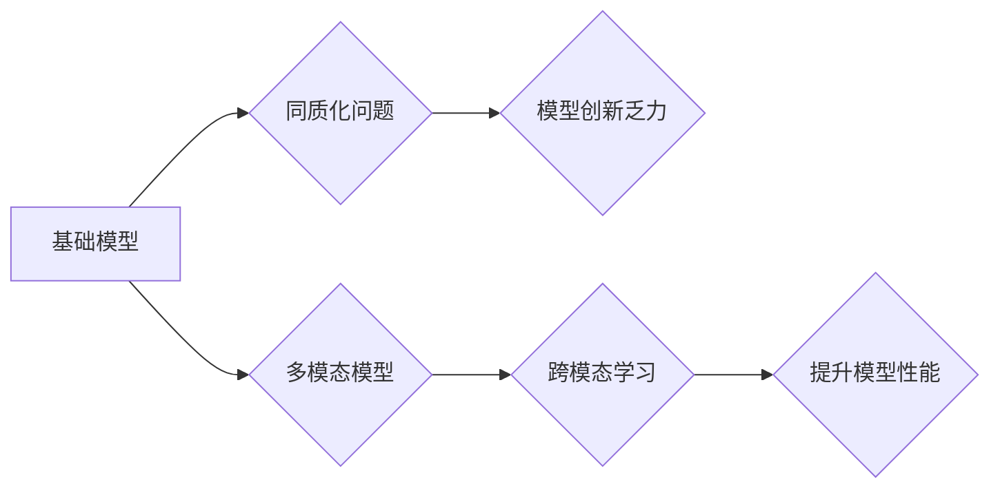

> 基础模型、同质化、多模态模型、大语言模型、图像生成、文本理解、跨模态学习、应用场景

## 1. 背景介绍

近年来，人工智能领域取得了令人瞩目的进展，其中基础模型扮演着越来越重要的角色。基础模型是指在海量数据上预训练的强大模型，能够在各种下游任务中表现出色，例如文本生成、图像识别、机器翻译等。

基础模型的出现，标志着人工智能发展进入了一个新的阶段。它打破了传统模型的局限性，使得模型的训练成本和时间大大降低，同时提升了模型的泛化能力和性能。

然而，随着基础模型的快速发展，也出现了新的挑战。例如，基础模型的同质化问题日益突出，许多模型在架构和训练方法上存在相似性，导致模型创新乏力。此外，现有的基础模型主要集中在单模态任务上，例如文本或图像，缺乏对多模态数据的处理能力。

## 2. 核心概念与联系

**2.1 基础模型**

基础模型是指在海量数据上预训练的强大模型，能够在各种下游任务中表现出色。其特点包括：

* **规模庞大:** 基础模型通常拥有数亿甚至数十亿个参数，拥有强大的学习能力。
* **预训练:** 基础模型在大量无标注数据上进行预训练，学习了数据的通用特征和规律。
* **通用性:** 基础模型能够应用于各种下游任务，例如文本生成、图像识别、机器翻译等。

**2.2 同质化问题**

基础模型的同质化问题是指许多模型在架构和训练方法上存在相似性，导致模型创新乏力。

**2.3 多模态模型**

多模态模型是指能够处理多种模态数据的模型，例如文本、图像、音频等。

**2.4 跨模态学习**

跨模态学习是指利用不同模态数据之间的关系，提升模型的学习能力和性能。

**2.5 核心概念联系**

基础模型的同质化问题和多模态模型的发展相互关联。

* 同质化问题导致模型创新乏力，难以满足多模态任务的需求。
* 多模态模型的发展需要突破基础模型的同质化局限，探索新的模型架构和训练方法。



## 3. 核心算法原理 & 具体操作步骤

### 3.1 算法原理概述

多模态模型的训练主要基于以下核心算法原理：

* **自监督学习:** 利用无标注数据，通过设计特定的预训练任务，让模型学习数据的内在特征和规律。
* **跨模态对比学习:** 通过对比不同模态数据的相似性和差异性，让模型学习不同模态之间的关系和映射。
* **联合训练:** 将不同模态的数据联合训练，让模型学习多模态数据的整体特征和表示。

### 3.2 算法步骤详解

**3.2.1 数据预处理:**

* 将不同模态的数据进行预处理，例如文本分词、图像裁剪、音频降噪等。

**3.2.2 模型架构设计:**

* 设计能够处理多模态数据的模型架构，例如Transformer、CNN、RNN等。

**3.2.3 预训练任务设计:**

* 设计适合多模态数据的预训练任务，例如文本图像匹配、图像文本描述等。

**3.2.4 模型训练:**

* 利用预处理后的数据和预训练任务，训练多模态模型。

**3.2.5 模型评估:**

* 利用下游任务的数据评估模型的性能，例如图像字幕生成、文本问答等。

### 3.3 算法优缺点

**优点:**

* 能够处理多种模态数据，提升模型的理解能力和泛化能力。
* 能够学习不同模态之间的关系，挖掘数据之间的潜在关联。

**缺点:**

* 训练成本较高，需要大量的计算资源和数据。
* 模型架构设计较为复杂，需要专业的知识和经验。

### 3.4 算法应用领域

* **图像识别和理解:** 将图像和文本结合，实现更准确的图像识别和理解。
* **视频分析:** 分析视频内容，识别人物、物体和事件。
* **人机交互:** 开发更自然和智能的人机交互系统。
* **医疗诊断:** 利用多模态数据辅助医生进行诊断。

## 4. 数学模型和公式 & 详细讲解 & 举例说明

### 4.1 数学模型构建

多模态模型的数学模型通常基于以下几个核心概念：

* **模态嵌入:** 将不同模态的数据映射到同一个低维空间，使得不同模态的数据能够进行比较和融合。
* **注意力机制:** 关注不同模态数据之间的重要关系，提高模型对关键信息的提取能力。
* **融合机制:** 将不同模态的数据融合在一起，形成一个完整的多模态表示。

### 4.2 公式推导过程

**4.2.1 模态嵌入:**

假设文本数据为 $T = \{t_1, t_2, ..., t_n\}$, 图像数据为 $I = \{i_1, i_2, ..., i_m\}$, 则可以使用词嵌入和图像特征提取器分别将文本和图像数据映射到低维空间：

* 文本嵌入: $e_t = f_t(t_i)$, 其中 $f_t$ 为词嵌入函数。
* 图像嵌入: $h_i = g_i(i_j)$, 其中 $g_i$ 为图像特征提取器。

**4.2.2 注意力机制:**

注意力机制可以用来计算不同模态数据之间的相关性，例如：

* 文本-图像注意力: $a_{ti} = \frac{exp(e_t^T h_i)}{\sum_{j=1}^{m} exp(e_t^T h_j)}$

**4.2.3 融合机制:**

将不同模态的数据融合在一起，可以使用加权平均、拼接等方法：

* 加权平均融合: $z = \alpha_t e_t + \alpha_i h_i$, 其中 $\alpha_t$ 和 $\alpha_i$ 为权重系数。

### 4.3 案例分析与讲解

**4.3.1 图像字幕生成:**

多模态模型可以用于生成图像的字幕描述。

* 输入: 图像数据 $I$
* 输出: 文本字幕 $T$

模型会首先将图像数据嵌入到低维空间，然后使用注意力机制计算图像和文本之间的相关性，最后使用融合机制将图像和文本信息融合在一起，生成文本字幕。

**4.3.2 文本问答:**

多模态模型可以用于回答基于图像和文本的问答问题。

* 输入: 图像数据 $I$ 和文本问题 $Q$
* 输出: 文本答案 $A$

模型会首先将图像和文本问题嵌入到低维空间，然后使用注意力机制计算图像、问题和答案之间的相关性，最后使用融合机制将图像、问题和答案信息融合在一起，生成文本答案。

## 5. 项目实践：代码实例和详细解释说明

### 5.1 开发环境搭建

* 操作系统: Ubuntu 20.04
* Python 版本: 3.8
* 必要的库: PyTorch, torchvision, transformers

### 5.2 源代码详细实现

```python
import torch
import torch.nn as nn
from transformers import BertModel

class MultiModalModel(nn.Module):
    def __init__(self, bert_model_name, num_classes):
        super(MultiModalModel, self).__init__()
        self.bert = BertModel.from_pretrained(bert_model_name)
        self.fc = nn.Linear(self.bert.config.hidden_size, num_classes)

    def forward(self, text_input_ids, text_attention_mask, image_features):
        text_output = self.bert(input_ids=text_input_ids, attention_mask=text_attention_mask)
        pooled_output = text_output.pooler_output
        output = self.fc(pooled_output)
        return output
```

### 5.3 代码解读与分析

* 该代码实现了一个简单的多模态模型，使用预训练的BERT模型处理文本数据，并使用图像特征作为输入。
* 模型将文本和图像特征融合在一起，然后使用全连接层进行分类。

### 5.4 运行结果展示

* 模型的运行结果可以通过评估指标，例如准确率、召回率等来衡量。

## 6. 实际应用场景

### 6.1 图像字幕生成

* 自动生成图像的字幕描述，用于辅助视障人士理解图像内容。
* 用于社交媒体平台，自动生成图片的描述信息。

### 6.2 文本问答

* 回答基于图像和文本的问答问题，例如在电子商务平台上，用户可以上传图片并询问相关商品信息。
* 用于教育领域，帮助学生理解图像和文本之间的关系。

### 6.3 多模态搜索

* 基于图像和文本的联合搜索，提高搜索结果的准确性和相关性。
* 用于医疗领域，根据患者的症状和病历图片进行诊断。

### 6.4 未来应用展望

* **更智能的人机交互:** 多模态模型将使人机交互更加自然和智能，例如通过语音、图像和文本进行交互。
* **个性化学习:** 多模态模型可以根据用户的学习风格和偏好，提供个性化的学习内容和体验。
* **增强现实和虚拟现实:** 多模态模型可以增强现实和虚拟现实体验，例如在虚拟现实游戏中，用户可以通过语音和手势控制虚拟角色。

## 7. 工具和资源推荐

### 7.1 学习资源推荐

* **书籍:**
    * Deep Learning by Ian Goodfellow, Yoshua Bengio, and Aaron Courville
    * Natural Language Processing with PyTorch by Jason Brownlee
* **在线课程:**
    * Stanford CS231n: Convolutional Neural Networks for Visual Recognition
    * DeepLearning.AI TensorFlow Specialization

### 7.2 开发工具推荐

* **框架:** PyTorch, TensorFlow
* **库:** transformers, torchvision

### 7.3 相关论文推荐

* **Attention Is All You Need:** https://arxiv.org/abs/1706.03762
* **BERT: Pre-training of Deep Bidirectional Transformers for Language Understanding:** https://arxiv.org/abs/1810.04805
* **Vision Transformer (ViT):** https://arxiv.org/abs/2010.11929

## 8. 总结：未来发展趋势与挑战

### 8.1 研究成果总结

近年来，多模态模型取得了显著进展，在图像字幕生成、文本问答、多模态搜索等领域取得了优异的性能。

### 8.2 未来发展趋势

* **模型规模和能力的提升:** 未来，多模态模型的规模和能力将进一步提升，能够处理更复杂的多模态数据，并完成更复杂的任务。
* **跨模态学习方法的创新:** 研究人员将继续探索新的跨模态学习方法，例如自监督学习、对比学习等，提升模型的学习能力和泛化能力。
* **应用场景的拓展:** 多模态模型将应用于更多领域，例如医疗、教育、娱乐等，为人们的生活带来更多便利。

### 8.3 面临的挑战

* **数据获取和标注:** 多模态数据的获取和标注成本较高，这限制了模型的训练和发展。
* **模型训练的复杂性:** 多模态模型的训练复杂度较高，需要大量的计算资源和专业知识。
* **模型解释性和可解释性:** 多模态模型的决策过程较为复杂，难以解释和理解，这限制了模型的应用和信任度。

### 8.4 研究展望

未来，多模态模型的研究将继续深入，解决上述