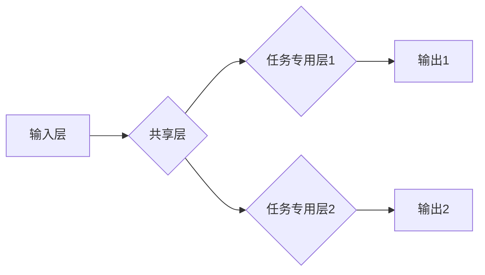

> 多任务学习，MTL，深度学习，迁移学习，模型共享，参数共享，任务相关性，任务无关性，代码实例，PyTorch

## 1. 背景介绍

在深度学习领域，模型训练通常针对单一任务进行，例如图像分类、文本生成或语音识别。然而，现实世界中往往存在多个相关任务，例如图像分类和物体检测、机器翻译和文本摘要等。针对这种情况，多任务学习 (Multi-Task Learning，MTL) 应运而生。

多任务学习是一种机器学习范式，它训练一个共享参数的模型来同时学习多个相关任务。通过共享参数，MTL 可以利用不同任务之间的相关性，从而提高模型的泛化能力和学习效率。

## 2. 核心概念与联系

**2.1 多任务学习的优势**

* **提升泛化能力:** MTL 可以通过学习多个任务的共同特征，从而提高模型对未知数据的泛化能力。
* **提高学习效率:** MTL 可以利用不同任务之间的相关性，减少模型训练所需的样本数量和时间。
* **促进知识迁移:** MTL 可以将已学习到的知识迁移到新的任务中，从而加速新任务的学习过程。

**2.2 多任务学习的挑战**

* **任务相关性:** MTL 的效果依赖于任务之间的相关性。如果任务之间不相关，MTL 可能无法发挥优势。
* **任务权重:** 不同任务的重要性可能不同，需要合理分配任务权重，以确保模型能够有效地学习所有任务。
* **模型复杂度:** MTL 模型通常比单任务模型更复杂，需要更多的计算资源和训练时间。

**2.3 MTL 的架构**



**2.4 MTL 与其他学习方法的关系**

* **迁移学习:** MTL 可以看作是一种迁移学习的特殊形式，其中源任务和目标任务是多个相关任务。
* **元学习:** 元学习旨在学习如何学习，而 MTL 可以看作一种元学习的应用，它学习如何从多个任务中学习。

## 3. 核心算法原理 & 具体操作步骤

### 3.1  算法原理概述

多任务学习的核心思想是共享模型参数，从而利用不同任务之间的相关性。

* **共享层:** 所有任务共享的模型层，用于学习通用特征。
* **任务专用层:** 每个任务都有自己的专用层，用于学习任务特定的特征。

模型训练时，使用所有任务的数据进行联合优化，共享层的参数会被更新，从而使模型能够学习到所有任务的共同特征。

### 3.2  算法步骤详解

1. **数据准备:** 收集多个相关任务的数据集。
2. **模型构建:** 设计一个包含共享层和任务专用层的模型架构。
3. **参数初始化:** 初始化模型参数。
4. **联合训练:** 使用所有任务的数据进行联合优化，更新模型参数。
5. **评估性能:** 在测试集上评估模型在每个任务上的性能。

### 3.3  算法优缺点

**优点:**

* 提升泛化能力
* 提高学习效率
* 促进知识迁移

**缺点:**

* 任务相关性要求高
* 任务权重分配需要谨慎
* 模型复杂度较高

### 3.4  算法应用领域

* **自然语言处理:** 文本分类、情感分析、机器翻译
* **计算机视觉:** 图像分类、物体检测、图像分割
* **语音识别:** 语音识别、语音合成
* **医疗诊断:** 病理图像分析、疾病预测

## 4. 数学模型和公式 & 详细讲解 & 举例说明

### 4.1  数学模型构建

假设我们有 $T$ 个任务，每个任务都有自己的损失函数 $L_t(y_t, \hat{y}_t)$，其中 $y_t$ 是真实标签，$\hat{y}_t$ 是模型预测的标签。

MTL 的目标是最小化所有任务的损失函数的加权平均值：

$$
L = \sum_{t=1}^{T} \lambda_t L_t(y_t, \hat{y}_t)
$$

其中 $\lambda_t$ 是任务 $t$ 的权重，用于平衡不同任务的重要性。

### 4.2  公式推导过程

MTL 的训练过程是通过反向传播算法来更新模型参数的。

对于每个任务 $t$，模型的梯度可以表示为：

$$
\nabla_{\theta} L_t(y_t, \hat{y}_t)
$$

其中 $\theta$ 是模型参数。

MTL 的整体梯度可以表示为：

$$
\nabla_{\theta} L = \sum_{t=1}^{T} \lambda_t \nabla_{\theta} L_t(y_t, \hat{y}_t)
$$

模型参数的更新规则为：

$$
\theta = \theta - \eta \nabla_{\theta} L
$$

其中 $\eta$ 是学习率。

### 4.3  案例分析与讲解

假设我们有两个任务：图像分类和物体检测。

* **图像分类任务:** 预测图像中包含的类别。
* **物体检测任务:** 预测图像中包含的物体的位置和类别。

这两个任务之间存在一定的相关性，因为它们都依赖于图像特征。

我们可以使用 MTL 训练一个共享模型，该模型可以同时学习图像分类和物体检测的任务。

共享模型的共享层可以学习到图像的通用特征，而任务专用层可以学习到每个任务特定的特征。

## 5. 项目实践：代码实例和详细解释说明

### 5.1  开发环境搭建

* Python 3.6+
* PyTorch 1.0+
* CUDA 10.0+ (可选)

### 5.2  源代码详细实现

```python
import torch
import torch.nn as nn

class SharedLayer(nn.Module):
    def __init__(self):
        super(SharedLayer, self).__init__()
        self.conv1 = nn.Conv2d(3, 16, kernel_size=3, padding=1)
        self.relu = nn.ReLU()
        self.maxpool = nn.MaxPool2d(kernel_size=2, stride=2)

    def forward(self, x):
        x = self.conv1(x)
        x = self.relu(x)
        x = self.maxpool(x)
        return x

class TaskSpecificLayer1(nn.Module):
    def __init__(self, in_channels, out_channels):
        super(TaskSpecificLayer1, self).__init__()
        self.fc = nn.Linear(in_channels, out_channels)

    def forward(self, x):
        x = self.fc(x)
        return x

class TaskSpecificLayer2(nn.Module):
    def __init__(self, in_channels, out_channels):
        super(TaskSpecificLayer2, self).__init__()
        self.fc = nn.Linear(in_channels, out_channels)

    def forward(self, x):
        x = self.fc(x)
        return x

class MultiTaskLearningModel(nn.Module):
    def __init__(self):
        super(MultiTaskLearningModel, self).__init__()
        self.shared_layer = SharedLayer()
        self.task_specific_layer1 = TaskSpecificLayer1(16 * 16 * 16, 64)
        self.task_specific_layer2 = TaskSpecificLayer2(64, 10)

    def forward(self, x):
        x = self.shared_layer(x)
        x1 = self.task_specific_layer1(x.view(x.size(0), -1))
        x2 = self.task_specific_layer2(x.view(x.size(0), -1))
        return x1, x2

# 实例化模型
model = MultiTaskLearningModel()

# 定义损失函数和优化器
criterion = nn.CrossEntropyLoss()
optimizer = torch.optim.Adam(model.parameters(), lr=0.001)

# 训练模型
for epoch in range(10):
    # 训练数据
    inputs, labels1, labels2 = ...

    # 前向传播
    outputs1, outputs2 = model(inputs)

    # 计算损失
    loss1 = criterion(outputs1, labels1)
    loss2 = criterion(outputs2, labels2)
    loss = loss1 + loss2

    # 反向传播
    optimizer.zero_grad()
    loss.backward()
    optimizer.step()

    # 打印训练进度
    print(f'Epoch [{epoch+1}/{10}], Loss: {loss.item():.4f}')

```

### 5.3  代码解读与分析

* **共享层:** `SharedLayer` 类定义了模型共享的卷积层、ReLU激活函数和最大池化层。
* **任务专用层:** `TaskSpecificLayer1` 和 `TaskSpecificLayer2` 类定义了每个任务的专用全连接层。
* **MTL 模型:** `MultiTaskLearningModel` 类将共享层和任务专用层组合在一起，形成了MTL模型。
* **训练过程:** 代码展示了MTL模型的训练过程，包括数据加载、前向传播、损失计算、反向传播和参数更新。

### 5.4  运行结果展示

训练完成后，可以评估模型在每个任务上的性能，例如准确率、召回率和F1-score。

## 6. 实际应用场景

### 6.1  自然语言处理

* **文本分类:** 使用MTL训练一个模型，同时学习多个文本分类任务，例如情感分析、主题分类和垃圾邮件过滤。
* **机器翻译:** 使用MTL训练一个模型，同时学习多个语言之间的翻译任务。
* **文本摘要:** 使用MTL训练一个模型，同时学习不同长度和风格的文本摘要任务。

### 6.2  计算机视觉

* **图像分类和物体检测:** 使用MTL训练一个模型，同时学习图像分类和物体检测任务。
* **图像分割和实例分割:** 使用MTL训练一个模型，同时学习图像分割和实例分割任务。
* **图像生成:** 使用MTL训练一个模型，同时学习不同风格和主题的图像生成任务。

### 6.3  语音识别

* **语音识别和语音合成:** 使用MTL训练一个模型，同时学习语音识别和语音合成任务。
* **语音情感分析:** 使用MTL训练一个模型，同时学习语音情感分析和语音识别任务。

### 6.4  未来应用展望

* **个性化推荐:** 使用MTL训练一个模型，同时学习用户的不同偏好，提供个性化的推荐。
* **医疗诊断:** 使用MTL训练一个模型，同时学习多种医疗影像分析任务，提高诊断准确率。
* **自动驾驶:** 使用MTL训练一个模型，同时学习多种感知任务，例如图像识别、物体检测和路径规划。

## 7. 工具和资源推荐

### 7.1  学习资源推荐

* **书籍:**
    * Deep Learning by Ian Goodfellow, Yoshua Bengio, and Aaron Courville
    * Hands-On Machine Learning with Scikit-Learn, Keras & TensorFlow by Aurélien Géron
* **论文:**
    * Multi-Task Learning by Richard S. Sutton and Andrew G. Barto
    * A Survey on Multi-Task Learning by Zhiyuan Liu et al.
* **在线课程:**
    * Deep Learning Specialization by Andrew Ng (Coursera)
    * Machine Learning by Stanford University (Coursera)

### 7.2  开发工具推荐

* **PyTorch:** 深度学习框架，支持GPU加速。
* **TensorFlow:** 深度学习框架，支持GPU加速。
* **Keras:** 高级深度学习API，可以运行在TensorFlow或Theano上。

### 7.3  相关论文